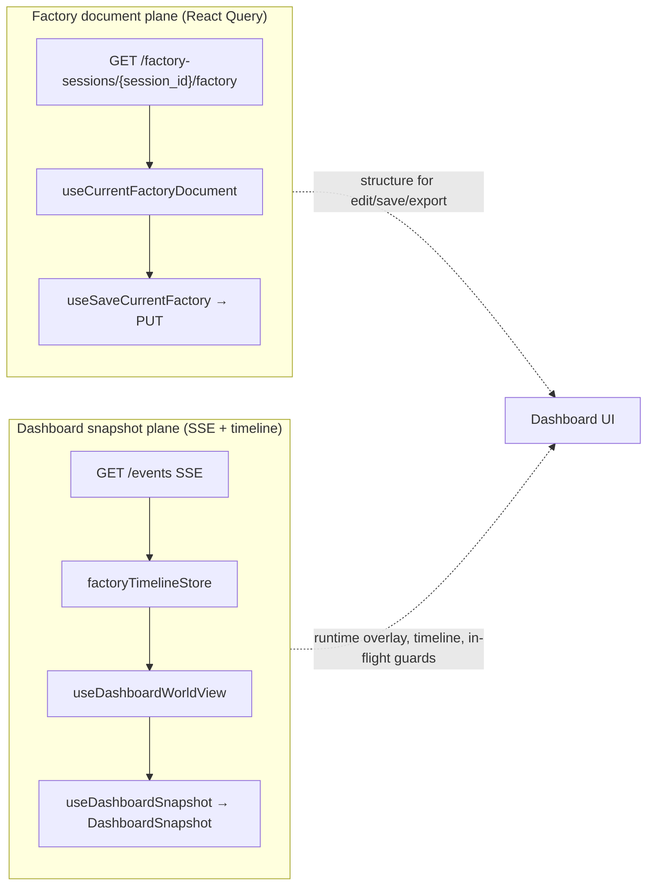

# Agent Factory Development Guide

This guide is the contributor guide for the Agent Factory checkout rooted at this repository root. Read it before changing runtime behavior, dashboard assets, workflow fixtures, or maintainer documentation, then use the local [docs index](../README.md) and [standards index](../standards/STANDARDS.md) for the current shared guidance.

## Purpose

`agent-factory` is the Coloured Petri Net workflow engine for orchestrating AI agent and script work. It owns runtime scheduling, worker dispatch, failure and retry behavior, replay, the HTTP API, and the embedded dashboard shell.

## Repository Root Contract

This checkout is operated from the repository root that contains `go.mod`, `Makefile`, `api/`, `cmd/`, `docs/`, `factory/`, `pkg/`, `tests/`, and `ui/`. Do not translate the commands in this guide into a legacy `libraries/agent-factory` subdirectory workflow; the maintained execution surface in this repo is the checkout root itself.

## Local Architecture

- `cmd/factory/` is the CLI binary entrypoint.
- `api/` contains the authored OpenAPI sources, bundling configuration, and published contract artifact used by generation and smoke checks.
- `factory/` contains the checked-in operator workflow surfaces, including starter guidance, workstation prompts, and the live idea or batch inbox directories under `factory/inputs/`.
- `pkg/cli/` owns Cobra routing, command-specific packages (`run`, `config`, `submit`, `default`, and `init`), and the CLI dashboard read models in `dashboard`.
- `pkg/factory/` owns runtime engine behavior, scheduling, markings, transitions, resources, and engine state snapshots.
- `pkg/service/` wires the runtime, configuration, API server, replay, logging, and worker construction.
- `pkg/api/` serves runtime HTTP endpoints and the embedded dashboard shell.
- `pkg/workers/` owns worker execution contracts, provider calls, script command execution, and work-scoped metadata.
- `pkg/replay/` owns record/replay artifact construction, side-effect matching, and deterministic replay behavior.
- `ui/` is the Vite dashboard source. `ui/dist/` is generated local build output, and `make ui-build` refreshes the ignored embed registration that wires those assets into Go builds.
- `tests/functional_test/` contains workflow fixtures and smoke coverage.

## Development Commands

Run commands from the repository root shown above.

```bash
make build
make generate-api
make api-smoke
make verify-fast
make verify-pr
make verify-extended
make test
make test-full
make typecheck
make verify-build-contracts
make verify-tests
make verify
make release-surface-smoke
make lint
make backend-size
make pkg-maint
make ui-deadcode
make script-timeout-companion-smoke-100
make current-factory-watcher-switch-smoke
make fmt
make dashboard-verify
make release VERSION=v1.2.3
make ui-deps
make ui-build
make ui-test
make ui-integration-test
make ui-storybook
make ui-test-storybook
```

## GitHub Actions CI Baseline

The repository CI workflow lives at `.github/workflows/ci.yml`. It runs automatically on pull requests and branch pushes and is intentionally limited to validation only. This first-pass workflow does not package or deploy releases.

Expensive specialty verification that is useful for maintainer confidence but not required to merge a pull request should stay off the required PR path. The current example is `.github/workflows/long-local-inference.yml`, which runs long OMNIVOICE managed-runtime and functional-runtime coverage only through post-merge pushes to `main`, the daily `06:00 UTC` schedule, or explicit `workflow_dispatch` runs. Use that workflow when a change may affect managed local inference runtime setup, model download and cache behavior, or long-running real local inference behavior that the required PR lanes do not need to block on every narrow pull request.

The maintainer-owned CLI release policy lives in [CLI release policy](cli-release-policy.md). Keep future release automation aligned with that guide: release publication should come from manual semver tags on `main`, not from developer-machine publishing or manually created GitHub Release events.

The workflow currently executes these repository-owned commands through one prerequisite lane and three required verification lanes:

1. `cd ui && bun install --frozen-lockfile`
2. `cd ui && bun run tsc`
3. `make verify-build-contracts`
4. `make test-ui-coverage`
5. `cd ui && bunx playwright install chromium`
6. `make ui-integration-test`
7. `make test-backend-verification`

Use the same root-level commands locally when reproducing a GitHub Actions failure. The workflow installs Go from `go.mod` and pins Bun to `1.3.12` in `.github/workflows/ci.yml`; keep that version aligned with the checked-in `ui/package.json` `packageManager` pin when either file changes.

Use these canonical verification tiers on the root command surface before reaching for the lower-level lane names:

- `make verify-fast` for the fastest safe author pass: dashboard typecheck, the jsdom-oriented UI unit lane, and the short Go suite. The tier prints the owned suite label before each step and, on failure, emits the exact `make <target>` rerun command for that step.
- `make verify-pr` for the pull-request-equivalent local pass: `make verify-build-contracts` plus the required CI test lanes. Like `make verify-fast`, it prints the owned aggregate or lane label before each nested step and reports the exact `make <target>` rerun command when one of those owned steps fails.
- `make verify-extended` for opt-in deeper coverage after the PR-equivalent pass: `make verify-pr` plus `make long-tests`. Like the other contributor-facing tiers, it labels the owned step before each nested `make` call and emits the exact rerun target if one of the opt-in long lanes fails.

The older aggregate names remain available as compatibility aliases while docs, workflows, and active review branches converge on the clearer tiered surface. In particular, `make verify` still works, but it now points contributors at `make verify-pr` as the canonical pull-request rerun command.

Treat the matrix below as the canonical suite-ownership and rerun guide for the tiered test surface:

| Surface | Runs | Intentionally excludes | Failure rerun path |
| --- | --- | --- | --- |
| `make verify-fast` | `make typecheck`, `make ui-test`, `make test` | `make test-ui-coverage`, `make ui-integration-test`, `make test-backend-verification`, `make long-tests` | rerun the failing owned step directly: `make typecheck`, `make ui-test`, or `make test` |
| `make verify-pr` | `make verify-build-contracts` once, then `make verify-tests` once | `make long-tests`, `make test-functional-long`, managed-runtime specialty coverage | rerun `make verify-pr` for the full required envelope, or rerun the failing owned lane called out in output |
| `make verify-extended` | `make verify-pr`, then `make long-tests` | no extra hidden suites beyond the named long and specialty lanes | rerun `make verify-extended` for the whole opt-in pass, or rerun the failing owned long lane called out in output |
| `make verify-tests` | `make test-ui-coverage`, `make ui-integration-test`, `make test-backend-verification` | compatibility aliases that would repeat the same confidence outcome | rerun the exact failing required lane printed in output |
| `make long-tests` | `make long-tests-managed-runtime`, `make long-tests-functional-runtime` | short-path fast and PR-tier suites, unless you intentionally rerun them through `make verify-pr` first | rerun the exact failing specialty lane printed in output |

Compatibility aliases that still remain on the root command surface:

| Compatibility alias | Canonical command to prefer | Why the alias still exists |
| --- | --- | --- |
| `make verify` | `make verify-pr` | Keeps existing docs, workflow references, and active review branches working while the canonical PR-tier name rolls out. |
| `make test-ui-browser-integration` | `make ui-integration-test` | Preserves the older lane-shaped name while the browser-backed dashboard lane keeps the simpler direct test-owner target. |
| `make test-backend-coverage` | `make test-backend-verification` | Preserves the older backend wording while the merged backend-plus-short-functional lane keeps one canonical rerun path. |
| `make test-backend-functional` | `make test-backend-verification` | Keeps an older backend-functional mental model callable even though that coverage now lives inside the merged backend verification lane. |

The pull-request workflow restores the supported built-in Go module and build cache through `actions/setup-go` keyed by `go.sum`, and restores Bun's global package cache from `~/.bun/install/cache` keyed by the hosted-runner OS, the pinned `BUN_VERSION`, and `ui/bun.lock`. Keep those invalidation inputs aligned with the real dependency surfaces instead of introducing static cache keys. The workflow intentionally does not cache Playwright browser binaries in the PR lanes because Playwright's CI guidance says restore cost is usually comparable to a fresh download on hosted runners; if that assumption changes, document the measured reason before adding a browser cache layer.

The `UI Browser Integration` lane also intentionally does not reuse a prebuilt `ui/dist` artifact from `verify-build-contracts`. The owned browser harness in `ui/integration/event-stream-replay.integration.test.mjs` rebuilds the dashboard with a lane-scoped `VITE_AGENT_FACTORY_API_ORIGIN` and then starts its own `vite preview` server inside `beforeAll`, so downloading an upstream artifact would add upload/download coupling without removing the lane's own build-and-preview responsibility or making independent retries easier to reason about.

Use `make dashboard-verify` for dashboard review readiness after UI source changes that affect embedded assets. It runs `ui-build`, `lint`, and the short Go test suite sequentially so Vite asset rotation does not race with Go embed scanning.

`make typecheck` is the root-level dashboard typecheck command and should stay aligned with the CI `bun run tsc` step.

`make backend-size` is the direct maintainer command for the repo-owned backend size gate. It runs `go run ./cmd/backendsizecheck` and fails when maintained backend Go files exceed 1000 lines or maintained backend Go functions exceed 100 lines under the scanner's explicit owned-source rules. When a legacy oversized surface must stay intact temporarily, use an inline `backendsizecheck:ignore-file` or `backendsizecheck:ignore-function` comment with a concrete justification at the owning file or function instead of adding shell-only allowlists.

`make pkg-maint` is the stable maintainer and reviewer command path for the handwritten `pkg/` maintainability lane. It runs `go run ./cmd/pkgmaintcheck ./pkg`, scans only owned `pkg/` Go source, excludes generated artifacts and `testdata` through the same repo-owned path rules as the backend size gate, and reports `file-lines`, `function-lines`, and `cyclomatic-complexity` violations with actual values and configured limits. The current thresholds are 1000 file lines, 100 function lines, and cyclomatic complexity 15. Use rule-scoped inline directives only when a later maintainability story needs a narrow exception tied to a concrete runtime, boundary, or generated-artifact constraint: `pkgmaintcheck:ignore-file-lines`, `pkgmaintcheck:ignore-function-lines`, or `pkgmaintcheck:ignore-cyclomatic-complexity`, each paired with a reviewer-readable justification comment.

`make lint` runs the UI Biome lint, the UI Knip dead-code baseline gate, `go vet ./...`, `make backend-size`, `make pkg-maint`, and the pinned Go deadcode analyzer. The frontend deadcode step writes a normalized current report to `bin/frontend-deadcode-current.json` and compares it with `docs/internal/development/frontend-deadcode-baseline.json`. The backend deadcode step writes a normalized current report to `bin/deadcode-current.txt` and compares it with `docs/internal/development/deadcode-baseline.txt`. Review any drift before updating either baseline.

Treat the `ui/` Biome excessive-lines rules as a maintainability boundary for handwritten frontend code, not as a prompt to add new suppressions. Generated API artifacts under `ui/src/api/generated/` may keep generated-code-specific exceptions, but handwritten app code, tests, stories, and fixtures should stay under the standard limits by decomposing the surface into smaller feature components, story modules, shared fixtures, or named test helpers. Review-ready proof for that decomposition is the normal `make typecheck`, `make lint`, and behavior-specific test or Storybook evidence for the touched surface, not a separate source-inventory audit.

`make verify-build-contracts` is the repository-owned build-contract lane used by CI after dependency setup. It runs `make typecheck`, `make ui-build`, `make build`, `make lint`, and `make api-smoke` in the same order the `verify-build-contracts` GitHub Actions job enforces.

`make verify-tests` is the repository-owned local aggregate for the required test lanes. It runs `make test-ui-coverage`, `make ui-integration-test`, and `make test-backend-verification`, prints the owned lane label before each one, and emits the exact lane rerun command if one fails. The GitHub Actions workflow fans those lanes out across separate `UI Coverage`, `UI Browser Integration`, and `Backend Verification` jobs so required failures point at one lane instead of a mixed `make ui-test` rerun. **CI vs local for UI Coverage:** pull-request CI runs ten parallel `ui-coverage-shard` matrix jobs plus one `ui-coverage-merge` job (both gated by `run_ui_coverage`); local `make verify-pr` and `make verify-tests` still use the unsharded canonical `make test-ui-coverage` command that `cmd/ciclassify` recommends for lane reruns.

Every pull request still runs the same prerequisite path before any lane-specific skips happen:

1. `Classify PR Impact`
2. `Typecheck`
3. `Build, Lint, and API`

The classifier is what decides whether the three downstream required test lanes run or skip. Treat its four classifications as the maintained routing contract:

| Classification | Touched surfaces | Required downstream lanes | Local rerun guidance |
| --- | --- | --- | --- |
| `docs-only` | `docs/**` plus root-level docs or text files such as `README.md`, `*.md`, `*.mdx`, and `*.txt` | skip `UI Coverage`, skip `UI Browser Integration`, skip `Backend Verification` | No downstream lane rerun is expected; if the change was misclassified, rerun the classifier logic through `go run ./cmd/ciclassify ...` or use the full path with `make verify-pr`. |
| `ui-only` | `ui/**` plus optional documentation companions under `docs/**` or root-level `*.md`, `*.mdx`, and `*.txt` files | run `UI Coverage`, run `UI Browser Integration`, skip `Backend Verification` | `make test-ui-coverage` and `make ui-integration-test` |
| `backend-only` | `cmd/**`, `pkg/**`, or `tests/**` plus optional documentation companions under `docs/**` or root-level `*.md`, `*.mdx`, and `*.txt` files | skip `UI Coverage`, skip `UI Browser Integration`, run `Backend Verification` | `make test-backend-verification` |
| `shared-risk` | mixed product areas or explicit shared surfaces such as `.github/workflows/**`, `api/**`, `pkg/api/**`, `pkg/apisurface/**`, `Makefile`, `go.mod`, or `go.sum` | run `UI Coverage`, run `UI Browser Integration`, run `Backend Verification` | `make verify-pr` |

The workflow publishes this routing decision twice in GitHub Actions: the `Classify PR Impact` job summary shows the overall classification, changed-file count, touched areas, and the full required rerun command, and each downstream lane summary shows its own `run` versus `skip` decision together with the specific local rerun command and the short reason emitted by `cmd/ciclassify`.

Treat those lanes as the stable contributor mental model:

| CI lane | Owned checks | Local rerun command | Why this lane stays separate |
| --- | --- | --- | --- |
| `UI Coverage` | CI: ten parallel `ui-coverage-shard` jobs (main covered Vitest shards) plus `ui-coverage-merge` (isolated React Flow pass, merged blob thresholds, standalone script-style test, replay metadata guard). Local: same contract via unsharded `make test-ui-coverage`. | `make test-ui-coverage` | Keeps unit and app-shell regressions, coverage thresholds, and replay fixture coverage in one dashboard-only lane without rerunning browser-backed integration. CI shards only the main covered pass; local `make test-ui-coverage` remains the canonical full phased lane via `ui/package.json`'s `test:coverage` flow plus replay check. Use `UI_COVERAGE_SHARD=<i>/10 make ui-test-coverage` or `make test-ui-coverage-merge` only when reproducing a CI shard or merge failure. |
| `UI Browser Integration` | the canonical browser-backed `ui/integration/*.integration.test.mjs` lane with Playwright provisioning plus build and preview owned by the shared browser harness | `make ui-integration-test` | Keeps real-browser dashboard workflows isolated so failures map cleanly to preview startup, API-origin wiring, or browser-visible behavior instead of the jsdom suite. |
| `Backend Verification` | `cmd/gocoveragecheck` over `./cmd/factory`, maintained backend `./pkg/...` packages, and the maintained short functional packages under `tests/functional/...` | `make test-backend-verification` | Merges backend coverage with the maintained short functional corpus because the covered command already executes the same supported backend packages and short functional packages in one lane. |

UI Coverage orchestration is owned by `ui/scripts/ui-coverage-runner.mjs` behind `ui/package.json`'s `test:coverage` script. Keep the main covered Vitest pass as the only parallelized covered phase in this rollout; it defaults to two workers and can be tuned for comparison runs with `UI_COVERAGE_MAIN_MAX_WORKERS`. **US-004 (2026-05-30):** a three-worker trial on a comparable local runner regressed main-pass time and failed a graph suite timeout—keep the default at two unless new green `make test-ui-coverage` timing on `ubuntu-latest` justifies a change (see `docs/internal/development/ui-coverage-speed-closeout.md` **Main-pass worker trial**). Keep `src/features/workflow-activity/components/react-flow-current-activity-card.test.tsx` in its separate covered React Flow pass with `--maxWorkers=1` unless later CI timing evidence proves that changing that isolation boundary is both faster and stable. **US-005 (2026-05-30):** do not add a parallel isolated pass for `src/App.*.test.tsx`—local trials showed main-pass wall time unchanged within noise when app-shell files are excluded, while a bundled single-worker app-shell phase adds ~500s serial cost (~46% lane regression); see `docs/internal/development/ui-coverage-speed-closeout.md` **App shell megatest isolation trial**. **CI sharding (2026-05-30):** pull-request UI Coverage runs `ui-coverage-shard` (matrix `1`–`10`) plus `ui-coverage-merge` instead of one runner invoking `make test-ui-coverage`. Each shard job defaults to one in-process Vitest worker (`UI_COVERAGE_MAIN_MAX_WORKERS` still overrides); merged coverage thresholds are enforced in the merge job via `vitest --mergeReports .vitest-reports --coverage` using `ui/vite.config.ts`. See `docs/internal/development/ui-coverage-speed-closeout.md` **CI ten-shard rollout** for before/after timing and the first green proof run.

The UI Coverage contract also includes the merged blob-report coverage threshold pass and the replay coverage check. Keep browser-backed integration tests under `ui/integration/*.integration.test.mjs` out of the jsdom coverage corpus, keep the standalone script-style dashboard shell responsive test outside the main covered worker pool, and preserve the stable `[ui-coverage]` phase labels so benchmark comparisons can use the same names across runs.

The backend lane is intentionally merged. `make test-backend-verification` shells through `cmd/gocoveragecheck`, and that command's default package discovery already executes the maintained short functional packages under `tests/functional/...` in the same covered `go test` invocation as `./cmd/factory` and backend-owned `./pkg/...` packages. Because that coverage lane already includes `tests/functional/bootstrap_portability`, `guards_batch`, `providers`, `replay_contracts`, `runtime_api`, `smoke`, and `workflow` while excluding only the internal support helper package, a separate required `make test-backend-functional` lane would only rerun the same short functional corpus without adding pull-request confidence. Keep `make test-backend-functional` as a compatibility alias for ad hoc local usage, but treat `make test-backend-verification` as the required PR backend lane.

The browser-backed lane remains self-building for the same reason: `make ui-integration-test` delegates into the shared browser harness that runs `bun run build` with a test-owned API origin and serves that exact build with `vite preview`. Treat that build plus preview startup as part of the lane's owned runtime contract instead of uploading `ui/dist` from another job.

When a required lane fails, GitHub Actions keeps the lane-owned failure evidence for 14 days and names it explicitly in the lane summary:

| CI lane | Failure artifact name | Retained evidence |
| --- | --- | --- |
| `UI Coverage` | `ui-coverage-merge-failure-artifacts` (merge lane) and per-shard `ui-coverage-shard-<index>` artifacts when a matrix leg fails | merge `command.log` under `.artifacts/ui-coverage-merge/`; shard `command.log` under `.artifacts/ui-coverage-shard-<index>/` |
| `UI Browser Integration` | `ui-browser-integration-failure-artifacts` | lane `command.log` plus the shared harness browser evidence: Playwright trace, final screenshot, page HTML snapshot, and diagnostics JSON |
| `Backend Verification` | `backend-verification-failure-artifacts` | lane `command.log` with the covered Go test and maintained short functional output |

Backend verification failure summaries are rendered by `go run ./cmd/backendverificationsummary -log .artifacts/backend-verification/command.log`. Keep that helper covered with `go test ./cmd/backendverificationsummary`, and keep the summary output focused on the first actionable failure block before falling back to a bounded command-log excerpt.

Treat `Long Local Inference` as the maintainer-owned follow-up lane for expensive real-runtime coverage rather than as part of merge-blocking pull-request CI. In GitHub Actions, its run names distinguish `post-merge verification`, `scheduled verification`, and `manual verification` so maintainers can tell why it ran from the workflow list. Reach for it after merging runtime-sensitive local-model changes, before a risky runtime release, or when you need to confirm that OMNIVOICE-specific setup and long-running inference still work outside the required short PR checks.

Use the lane-specific targets below when you need to rerun one required CI lane locally without replaying the full suite:

- `make test-ui-coverage` for the jsdom-oriented dashboard coverage lane.
- `make ui-integration-test` for the browser-backed dashboard integration lane.
- `make test-backend-verification` for the merged backend coverage plus maintained short functional lane.

`make verify-pr` is the canonical full review-ready local pass once dependencies and browser prerequisites are already installed. It does not install packages or browsers itself, so routine verification stays network-free after setup.

`make verify` remains as a compatibility alias for `make verify-pr` while existing references migrate.

## Website Copy Localization Guardrail

User-facing dashboard copy belongs in locale-aware message catalogs instead of inline React component text. When adding or changing visible UI text, validation messages, empty states, toast or dialog text, chart labels, accessible names, or other customer-facing metadata under `ui/src/`, put the message in the owning feature catalog under `ui/src/features/<feature>/messages/`. Shared primitive copy belongs under `ui/src/components/<shared>/messages/` only when the shared component owns the reusable wording. Keep IDs, enum values, API codes, CSS classes, and other structural values out of catalogs unless they are actually rendered as product copy.

Run the hardcoded-copy guard locally from the UI package:

```bash
cd ui && bun run check:localized-copy
```

The normal UI lint path also runs this guard through:

```bash
cd ui && bun run lint
```

The guard intentionally excludes tests, stories, generated API code, fixtures, developer-testing seams, and message-catalog files. Do not add product UI copy to `ui/scripts/hardcoded-ui-copy-baseline.txt`; the baseline is expected to stay empty for product copy. If the scanner reports a literal that is truly not product UI copy, such as a structural node id, an API error code, a class recipe, or maintainer-only diagnostic text, document that exact literal with the inline marker `hardcoded-ui-copy-exception: non-product-diagnostic` near the source. Use that marker narrowly and never as a bypass for customer-facing copy.

Localization changes should include tests at the layer where users observe the message. Prefer assertions against rendered text, accessible names, formatted labels, emitted validation errors, or pure message helper output, and cover at least one non-default locale when the behavior depends on locale selection, fallback, or interpolation. Avoid testing the source inventory itself; the guard already owns scanner behavior.

Reviewers should block new product copy that bypasses message catalogs, concatenates translated fragments instead of authoring a complete localized message, omits tests for dynamic interpolation or fallback behavior, or skips browser evidence for visible UI changes. For browser-backed dashboard proof, use the maintained Storybook or integration-test lanes described in this guide and record the relevant command and scenario in the PR notes.

Treat the opt-in long and specialty commands as a separate maintainer tier rather than hidden follow-on work inside `make verify-fast` or `make verify-pr`:

- `make verify-extended` is the canonical "everything above plus the deeper safety nets" pass. Use it after `make verify-pr` when a change may have touched managed-local runtime behavior or the real local inference path and you want one aggregate command that still preserves exact rerun hints.
- `make long-tests-managed-runtime` is the narrow specialty rerun for the package-level managed-runtime lane in `pkg/service`. It protects the subprocess adapter, managed local model loading, and handle-reuse behavior without requiring the full end-to-end API flow.
- `make long-tests-functional-runtime` is the narrow specialty rerun for the real OMNIVOICE functional lane in `tests/functional/runtime_api`. It protects the end-to-end `POST /models/{model_name}/pull`, direct invocation, and factory `MODEL_INVOKE` path against regressions that only appear with a real local runtime.
- `make long-tests` is the explicit aggregate over those two opt-in specialty lanes. It prints the owned specialty lane before each nested step and reports the direct `make long-tests-...` rerun command on failure.

Those long and specialty commands are intentionally excluded from `make verify-fast` and `make verify-pr`. Keep them opt-in so routine author and PR-equivalent feedback stays short and deterministic unless a maintainer explicitly asks for the deeper runtime coverage.

When extending the workflow, change the repository-owned command surface before editing GitHub Actions orchestration. Add or adjust the relevant `make test-*` target first, keep the lane name aligned with the owned command, and document any cache, artifact, or deduplication decision here in the same change. Contributors should be able to answer "which lane owns this check?" and "what do I rerun locally?" from this section alone without reverse-engineering `.github/workflows/ci.yml`.

To reproduce the backend size gate directly, run:

```bash
make backend-size
```

To reproduce the backend dead-code gate directly, run:

```bash
make deadcode
```

To prove the gate fails on newly introduced unreachable Go code without keeping the seed in the worktree, run:

```bash
seed_file=pkg/deadcode_seed_for_review.go
trap 'rm -f "$seed_file"' EXIT
printf 'package pkg\n\nfunc seededUnusedBackendDeadCodeForReview() {}\n' > "$seed_file"
make deadcode
```

The seeded command should exit non-zero and point reviewers at `bin/deadcode-current.txt`; remove the seed file before continuing normal verification.

To reproduce the frontend dead-code gate directly, run:

```bash
make ui-deadcode
```

To prove the gate fails on newly introduced unused frontend code without keeping the seed in the worktree, run:

```bash
seed_file=ui/src/deadcode-seed-for-review.ts
trap 'rm -f "$seed_file"' EXIT
printf 'export function seededUnusedFrontendDeadCodeForReview() { return true; }\n' > "$seed_file"
make ui-deadcode
```

The seeded command should exit non-zero and point reviewers at `bin/frontend-deadcode-current.json`; remove the seed file before continuing normal verification.

To run the backend size gate and both dead-code gates through the normal integrated lint path, run:

```bash
make lint
```

`make release VERSION=v1.2.3` is the maintainer-owned release-preparation path. It must run from a clean `main` checkout, reruns the repository readiness targets, creates the semver tag locally, and pushes only the tag so GitHub Actions owns publication.


Use `make ui-storybook` followed by `make ui-test-storybook` when dashboard Storybook stories, play functions, runtime mocks, or the package-local Storybook runner change. `ui-storybook` builds `ui/storybook-static`; `ui-test-storybook` serves that static build on the dashboard-owned runner port and executes the dashboard Storybook interaction tests through the UI package's `test-storybook` script.

Use `make ui-integration-test` as the canonical browser-backed dashboard lane. It runs the real-browser scenarios under `ui/integration/` without pulling in the jsdom-focused `ui/src` suite, keeps replay coverage as one member of that lane rather than a one-off exception, and should stay deterministic by preferring checked-in fixtures plus the shared browser harness seams over operating-system-native dialogs or timing-sensitive interactions.

## API Contract Generation

The authored JSON API contract source is `api/openapi-main.yaml` plus referenced fragments under `api/components/schemas/`. Keep the public event envelope, event enums, and event payload fragments under `api/components/schemas/events/`; keep reusable domain objects under `api/components/schemas/data-models/`; keep HTTP-facing request, response, status, token, and pagination contracts under `api/components/schemas/api/`; keep compatibility dashboard read-model schemas under `api/components/schemas/factory-world/`; and keep small cross-surface helpers under `api/components/schemas/shared/`. The checked-in `api/openapi.yaml` remains the bundled published artifact consumed by code generation, tests, and downstream readers. This standardization pass preserves the existing runtime API behavior; future route removals, renamed fields, pagination redesigns, or response fields changes need separate PRD/story scope before editing handlers or generated contracts for that redesign.

From a clean checkout, use this workflow after editing `api/openapi-main.yaml` or a referenced fragment:

1. Validate the authored source tree from the repository root:

```bash
node scripts/run-quiet-api-command.js validate:main ./api/openapi-main.yaml
```

2. Rebundle the published contract from the authored source tree:

```bash
make bundle-api
```

This uses the repository-supported Redocly CLI from the root `api/` workspace and rewrites `api/openapi.yaml` from `api/openapi-main.yaml` without manual post-processing. The package-local targets intentionally keep the command surface rooted at the checkout so the same workflow works in standard clones and nested worktrees.

3. Regenerate the checked-in Go server interface, model types, and UI OpenAPI types from the bundled contract:

```bash
make generate-api
```

`make generate-api` rebundles `api/openapi.yaml`, then runs `go generate -tags=interfaces ./pkg/api`, which uses `api/codegen_config/server.yaml` and writes `pkg/api/generated/server.gen.go`. It also runs `go generate -tags=interfaces ./pkg/generatedclient`, which uses `api/codegen_config/client.yaml` and writes `pkg/generatedclient/client.gen.go`, and then runs the dashboard UI OpenAPI generator to refresh `ui/src/api/generated/openapi.ts`.

4. Prove regeneration is stable when the authored sources are unchanged:

```bash
make api-smoke
```

`make api-smoke` validates `api/openapi-main.yaml`, runs `make generate-api` twice from the split-source tree, verifies `api/openapi.yaml`, `pkg/api/generated/server.gen.go`, `pkg/generatedclient/client.gen.go`, and `ui/src/api/generated/openapi.ts` are clean with `git diff --exit-code`, runs the focused bundled event-contract completeness guard from `pkg/api/openapi_contract_test.go`, and then runs the generated-contract live API smoke test across supported work, status, event, and generated-client current-factory surfaces without requiring live LLM provider credentials.

5. Run the focused API and package checks that cover the contract boundary:

```bash
go test ./pkg/api -count=1
make test
make lint
```

Review any generated diff together with the authored OpenAPI change. Do not hand-edit `api/openapi.yaml`, `pkg/api/generated/server.gen.go`, or `ui/src/api/generated/openapi.ts`; change `api/openapi-main.yaml` or a referenced fragment, then regenerate.

## Factory CLI Wire Composition

`google/wire` is limited to `cmd/factory/compose/`. Production `you run` builds
`*service.FactoryService` through the generated `InjectFactoryService` entry;
HTTP serving uses the same wired instance via `compose.ServeAPIServer`. See
[cmd-factory-wire-composition.md](cmd-factory-wire-composition.md) for the full
workflow.

From a clean checkout, after editing `wire.go` or `providers.go`:

1. Regenerate the checked-in injector:

```bash
go generate ./cmd/factory/compose/...
```

2. Commit `wire_gen.go` with the provider changes. Do not hand-edit
   `wire_gen.go`.

3. Verify the factory binary and composition tests:

```bash
go build ./cmd/factory/...
go test ./cmd/factory/compose/... ./pkg/cli/run/... -count=1
```

CI and `make verify-build-contracts` also run `make wire-smoke`, which
regenerates `wire_gen.go` and fails when the checked-in file is stale. Fix
drift with `go generate ./cmd/factory/compose/...` and commit the generated
file.

## Factory Sharing Contract

The canonical export/import sharing boundary is the generated OpenAPI
`Factory` payload returned by `GET /factory-sessions/{session_id}/factory`
and accepted by `POST /factories`. The active default runtime is addressed
through the default `session_id` route rather than a `~current` sentinel.
PNG export
and import reuse that exact payload through

Use [Named Factory API Contract Data Model](named-factory-api-contract-data-model.md)
as the detailed contract reference. Keep the dashboard on the authored API
boundary. Do not rebuild sharing payloads from `/events`, runtime-only
projections, or export-only field aliases.

## Package-Specific Verification

1. Run `make test` for normal Go changes; the short suite skips stress tests.
2. Run `make test-full` when changing scheduler behavior, retry logic, stress-sensitive runtime code, or failure cascades.
3. Run `make release-surface-smoke` after changing release-facing README content, shipped docs/examples, checked-in starter content, or `agent-factory init` defaults. It is the canonical smoke path for proving Agent Factory still reads as a standalone library across those public surfaces.
4. Run `make script-timeout-companion-smoke-100` after changing script timeout, requeue, command-runner, or companion smoke behavior. The target runs `TestIntegrationSmoke_ScriptTimeoutCompanionRequeuesBeforeLaterCompletion` 100 consecutive times through the real timeout/requeue/later-completion flow and fails on the first run that misses the direct timeout signal, retry dispatch, requeue mutation, or final completion.
5. Run `make current-factory-watcher-switch-smoke` after changing current-factory activation, watched-input listener ownership, or service-mode watcher handoff behavior. The target runs the focused named-factory smoke that proves watched input moves to the activated factory, the previous factory stops receiving watched work, and the handoff leaves only one completed dispatch for the new watched file.
6. Run `make dashboard-verify` after dashboard UI source changes or embedded asset changes.
7. Run `make ui-test` for focused dashboard UI behavior.
8. Run `make ui-integration-test` when changing browser-backed dashboard workflows, files under `ui/integration/`, shared browser harness seams, or fixture-driven session and graph-editor journeys that must be verified in Chromium.
9. Run `make ui-storybook` when Storybook fixtures, visual states, or dashboard component stories change.
10. Run `make ui-test-storybook` after `make ui-storybook` when Storybook play functions, dashboard Storybook runtime mocks, or browser-backed interaction behavior change.
11. Run replay-focused smoke tests when changing `pkg/replay`, record/replay CLI flags, worker side-effect matching, or artifact promotion behavior.

## Frontend Testing Layers

Place new dashboard UI regressions at the shallowest layer that still observes the customer-visible contract. Prefer behavioral assertions on rendered text, accessible names, network bodies, and emitted events—not source inventories, route lists, or doc-link topology checks.

| Layer | Scope | Example path |
| --- | --- | --- |
| Unit | Pure helpers, fixtures, and harness builders without mounting production React trees | `ui/src/testing/session-factory-mocks.test.ts` |
| Component | One widget or hook under jsdom with Testing Library | `ui/src/features/submit-work/components/submit-work-widget.test.tsx` |
| App shell (`App.*.test`) | Full `App` mount with shared fetch, stream, and layout seams | `ui/src/App.import.test.tsx` |
| Browser integration (`ui/integration/`) | Real Chromium flows across session tabs, import/export, or replay fixtures | `ui/integration/factory-import-second-session.integration.test.mjs` |
| Storybook | Visual states, play functions, and dashboard runtime mocks on built `storybook-static` | `ui/src/features/bento/components/dashboard-bento-metrics-workflow-catalog.stories.tsx` |

### App shell vs card-level harnesses

Use **`renderApp(...)`** from `ui/src/testing/app-shell-test-utils.tsx` when the regression needs the dashboard shell together: session tab bootstrap, event stream wiring, bento layout, cross-card navigation, locale switching, or end-to-end import/export/submit flows that start from the mounted `App`. Pass optional `sessionID` so `DashboardSessionTestProvider` pins `useDashboardSessionStore` without per-file store seeding.

Use **card-level `render(...)`** (or a feature-local test helper) when the behavior is owned by one card, hook, or graph surface and does not depend on shell routing. Combine focused renders with the shared harness modules below instead of duplicating inline `vi.fn()` fetch or mutation stubs.

| Concern | Harness module | Typical consumers |
| --- | --- | --- |
| Editable factory graph mocks and fixtures | `ui/src/testing/graph-editor-harness.ts` | `react-flow-current-activity-card.test.tsx`, `use-editable-factory-graph.test.tsx` |
| Session factory GET/PUT fetch doubles | `ui/src/testing/session-factory-mocks.ts` | `App.import.test.tsx`, `ui/src/api/named-factory/api.test.ts` |
| Dashboard session store pinning | `ui/src/testing/dashboard-session-test-provider.tsx` | `renderApp({ sessionID })`, `ui/.storybook/dashboard-story-runtime.tsx` |
| Bento catalog Storybook fixtures | `ui/src/features/bento/components/dashboard-bento-story-shared.tsx` | `dashboard-bento-*-catalog.stories.tsx` |
| Factory document save mutation states | `ui/src/testing/factory-document-save-mocks.ts` | `current-selection-widget.save.test.tsx`, worker save hook tests |
| Detail-card selection fixtures and time pins | `ui/src/features/current-selection/base/components/detail-card-test-helpers.tsx` | `work-item-card.test.tsx`, `workstation-detail-card.test.tsx` |

Harness modules under `ui/src/testing/` must import only types, fixtures, and test doubles—no production React components—and must not create import cycles with feature code.

For Storybook-only dashboard API mocking, keep fetch and session install logic in `ui/.storybook/dashboard-story-runtime.tsx` and prove session reset between story installs in `ui/.storybook/dashboard-story-runtime.test.ts`. After changing stories or runtime mocks, run `make ui-storybook` then `make ui-test-storybook` (or the targeted Storybook Vitest lane described under **Local Gotchas** when the full suite is blocked).

For jsdom coverage of app and component tests, use `make ui-test` or the `UI Coverage` lane (`make test-ui-coverage`) as appropriate for the touched surface.

### Cron Workstation Changes

Cron behavior crosses service tick production, Petri-net guards, dispatcher identity, event history, API read models, and dashboard projections. Keep [Workstation Kinds and Parameterized Fields](../reference/workstations.md#cron-kind) as the canonical authoring and migration guide instead of duplicating the full cron model in local notes.

`TestCronWorkstations_ServiceModeSmoke_SubmitsInternalTimeWorkExpiresRetriesDispatchesAndFiltersViews` is the end-to-end integration smoke for the token-backed cron flow. It starts service mode, observes missing-input time work, verifies stale tick expiry and retry, submits the required input, proves normal worker dispatch/output, checks canonical cron metadata, and confirms normal API/dashboard projections hide internal time work.

Use these focused checks before the broader package gates when changing cron behavior:

```bash
go test ./pkg/config ./pkg/timework ./pkg/service ./pkg/factory/scheduler ./pkg/factory/subsystems ./pkg/factory/projections -count=1
make cron-time-work-smoke CRON_TIME_WORK_SMOKE_COUNT=1
make test-full GO_TEST_TIMEOUT=300s
```

Use the default `make cron-time-work-smoke` count when the change touches timing-sensitive cron scheduling, expiry, dispatcher, or projection behavior and needs repeated stability evidence.

Run `make ui-test` and `make ui-build` when dashboard or projection code changes. Run `make api-smoke` after editing `api/openapi-main.yaml`, any referenced OpenAPI fragment, or handler behavior.

## Functional Test Harness Guidance

Functional tests should use `testutil.WithFullWorkerPoolAndScriptWrap()` or
the current full-worker-pool equivalent whenever the behavior can be observed
through normal runtime dispatch. Mock at the outer provider, provider
command-runner, command-runner, or mock-worker command boundary instead of
replacing workstation execution with the synchronous/default harness path.

Use lower-level custom executors, synchronous/default execution, or async-only
harness seams only when the test intentionally verifies a lower-level contract
that the edge mocks cannot expose. Acceptable examples include pausing an
in-flight dispatch for dashboard or runtime snapshot inspection, asserting raw
dispatch fields before workstation resolution, or testing harness compatibility
itself. Document the reason near the test or in the inventory so reviewers can
see what behavior would be lost by migrating it.

Use [Functional Test Execution Mode Inventory](functional-test-execution-mode-inventory.md)
when migrating shortcut tests or reviewing exceptions. Keep
`docs/internal/processes/AGENTS.md` linked to this section instead of duplicating the
full rule set for autonomous-agent instructions.

The functional-test package includes
`TestFunctionalTestsUseFullWorkerPoolHarnessOrDocumentException` as a
lightweight guardrail. New `testutil.NewServiceTestHarness(...)` calls should
include `testutil.WithFullWorkerPoolAndScriptWrap()`. If a shortcut is truly
needed, add a narrow entry to that test's exception map with the exact shortcut
count and the behavior that would be lost by migrating it.

Provider-error smoke tests that need to prove "requeue first, then fail after a
bounded retry budget" should mutate the copied fixture's `factory.json` with a
test-local guarded `LOGICAL_MOVE` workstation using a `visit_count` guard
instead of editing shared testdata. Keep the shared `worktree_passthrough`
fixture on its default infinite-retry shape and make the terminal-budget
behavior explicit inside the test that needs it.

## Local Gotchas

- Embedded dashboard builds are generated local artifacts. Rebuild `ui/dist/` with `make ui-build` or `make dashboard-verify` after dashboard source changes so Go picks up the refreshed embed registration.
- Do not run `ui-build` in parallel with Go vet, build, or test commands; Vite rotates hashed files under `ui/dist/assets`.
- Treat `factory.json` as a generated-schema boundary: normalize legacy key styles first, then decode through `pkg/api/generated.Factory` with unknown-field rejection enabled. Keep any compatibility exceptions explicit and narrow instead of falling back to permissive handwritten DTOs.
- Apply that same generated-schema boundary to replay and event-carried factory config: when `RUN_REQUEST.payload.factory` is decoded back from JSON, route the nested factory payload through `config.GeneratedFactoryFromOpenAPIJSON(...)` instead of relying on permissive struct unmarshalling.
- Browser-side PNG export should load the authored payload from `GET /factory-sessions/{session_id}/factory` and treat that canonical `Factory` response as the only source of truth for embedded sharing metadata. The detailed boundary and wrapper shape are documented in [Named Factory API Contract Data Model](named-factory-api-contract-data-model.md).
- Browser-side sharing roundtrip coverage should exercise `writeFactoryExportPng(...)`, `readFactoryImportPng(...)`, and `useFactoryImportActivation(...)` together so tests prove the same canonical `Factory` reaches `POST /factories` without dashboard-only reshaping.
- App-level browser sharing smokes should export through the real dashboard dialog, capture the downloaded PNG blob, drop that same file back through the graph viewport import entry, and assert the resulting `POST /factories` body matches the original `GET /factory-sessions/{session_id}/factory` `Factory` payload exactly.
- Dashboard Storybook interaction tooling is package-local to `ui/`. Keep runner config, `storybook-static` serving assumptions, base-path behavior, and API mocks under `ui/` or `ui/.storybook` instead of importing website Storybook setup.
- Browser-side factory export should serialize the authored `Factory` payload returned by `GET /factory-sessions/{session_id}/factory` and write it into one PNG `iTXt` metadata chunk through the additive `PortOSFactoryPngEnvelope` wrapper; do not create a parallel export-only DTO or mixed event-derived payload.
- Browser-side factory sharing metadata must reuse the public generated `Factory` contract fields directly, with PNG-only concerns limited to additive wrapper fields such as `schemaVersion`; do not reintroduce retired wrapper keys such as nested `factory` or `factoryName`.
- If browser-side PNG metadata has already shipped under a given `schemaVersion`, keep import compatibility for those required fields under that same version; for example, `v1` import still needs to accept legacy `factoryName` even though fresh exports now write canonical `name`.
- Browser-side factory export canonicalization must normalize legacy guard enum spellings such as `visit_count`, `all_children_complete`, and `any_child_failed` to the public OpenAPI values before packaging metadata; key-only alias rewrites still leak non-canonical factory contracts into exported PNGs.
- Browser-side export canonicalization must also preserve the full generated same-name input-guard contract: normalize `same_name` to `SAME_NAME` and `match_input` to `matchInput` instead of rejecting valid current-factory payloads during PNG export.
- Browser-side export canonicalization must stay aligned with `pkg/interfaces/public_factory_enums.go` and the strict generated-factory boundary in `pkg/config`: shared worker and workstation aliases canonicalize through the interfaces-owned helpers, while the generated `Factory` decode still rejects unsupported values after normalization.
- Browser-side export dialogs must invalidate any in-flight PNG export attempt when the dialog closes so a late async rasterization or metadata-write completion cannot trigger a download after the user cancels or dismisses the flow.
- For Agent Factory boundary-cleanup work that narrows a customer-visible DTO or formatter seam, check in a field inventory under `docs/internal/development/*-data-model.md` before removing the broad contract so later stories can distinguish render-owned fields from canonical passthrough and dead aggregate-only ballast.
- For browser-backed dashboard download stories, serve `ui/storybook-static` and scope the Vitest Storybook run with `--testNamePattern` when only one changed story needs proof. If the story or App-level test both decodes an uploaded image and downloads a blob, stub `createImageBitmap` or `OffscreenCanvas` on `globalThis` instead of `URL.createObjectURL` so the upload decode path does not consume the download stub.
- For package-local browser-visible narrow-width verification, wrap the dashboard story in a bounded container such as `width: 360px`, keep the same production component tree, and assert `document.documentElement.scrollWidth <= document.documentElement.clientWidth + 1` in the story `play` function instead of relying on website-only viewport helpers.
- Dashboard typography roles live in `ui/src/components/ui/dashboard-typography.ts` and `ui/src/styles.css`. Reuse those semantic page, section, body, and supporting text classes before adding new `text-[...]` literals to cards, drill-downs, or chart labels.
- Shared dashboard shell helpers also live in `ui/src/components/ui/dashboard-typography.ts`: use `DASHBOARD_SUPPORTING_LABELS_CLASS` for repeated metadata-label containers and `DASHBOARD_WIDGET_SUBTITLE_CLASS` for repeated large widget value/subtitle text instead of rebuilding inline label/value typography bundles.
- Detail-card and trace-table typography should layer `DASHBOARD_BODY_TEXT_CLASS`, `DASHBOARD_SUPPORTING_TEXT_CLASS`, `DASHBOARD_BODY_CODE_CLASS`, and `DASHBOARD_SUPPORTING_CODE_CLASS` onto nested rows, captions, pills, and metadata rather than restyling repeated `dt`/`dd` or code shells with local `text-[...]` values.
- Workstation-request selection banners and unavailable-request status copy should use `DASHBOARD_SUPPORTING_TEXT_CLASS` rather than keeping separate `text-[0.78rem]` status literals in drill-down cards.
- Current-selection drill-down coverage should stay in the focused component test files such as `work-item-card.test.tsx`, the split `workstation-request-detail.*.test.tsx` siblings, `workstation-detail-card.test.tsx`, `state-node-detail.test.tsx`, and `terminal-work-summary-detail.test.tsx`; do not revive broad duplicate umbrella suites like `detail-cards.test.tsx` after the component contracts have split.
- Nested workstation-request drill-down sections should use `DASHBOARD_SECTION_HEADING_CLASS` for subsection headings and `DASHBOARD_SUPPORTING_LABEL_CLASS` for prompt/response captions instead of bare `<h4>` elements or local `text-[...]` label spans.
- Trend summaries and chart-adjacent secondary copy should keep `dl` containers on `DASHBOARD_SUPPORTING_LABELS_CLASS`, put primary summary values on `DASHBOARD_WIDGET_SUBTITLE_CLASS`, and use `DASHBOARD_BODY_TEXT_CLASS` for nearby select controls or cause-list copy instead of descendant `text-[...]` literals.
- Keep the dashboard shell on `overflow-x-hidden` when the page includes the React Flow graph. The graph viewport intentionally contains off-screen nodes and labels for pan/zoom, and without shell-level horizontal clipping those internal transforms can widen the page at narrow widths even when the visible card layout is otherwise correct.
- Current-activity workstation icons should come from `ui/src/features/flowchart/workstation-icon-metadata.ts`; keep node rendering, legend entries, and regression fixtures on that shared metadata instead of maintaining separate workstation icon lists.
- Use `ui/src/components/dashboard/test-fixtures.ts` `workstationKindParityDashboardSnapshot` for browser-visible standard/repeater/cron icon checks instead of mutating `semanticWorkflowDashboardSnapshot` inline in stories or Vitest files.
- When Storybook and Vitest need the same dashboard parity assertions, export the scenario-specific expectation catalog from `ui/src/components/dashboard/test-fixtures.ts` and derive icon expectations from shared flowchart metadata instead of restating labels or icon kinds inline.
- The current-activity graph legend uses `DashboardFlowAxisLegend` and starts minimized by default; tests and stories that assert legend icons should expand it first with the shared `expandGraphLegend(...)` helper instead of assuming the legend panel is already rendered.
- Canonical runtime history is exposed through `GET /events`; new API and UI history consumers should replay factory events instead of depending on dashboard snapshot routes.
- Inference-event consumers should treat `FactoryEvent.context.dispatchId` as the canonical dispatch identity. Generated inference payloads no longer restate `dispatchId` or `transitionId`, so projections should recover the transition from the matching dispatch request and only keep a narrow legacy-payload fallback for older recorded fixtures.
- Compatibility dashboard projections should derive from `GetEngineStateSnapshot(...)` or canonical event world state instead of recombining primitive getters in handlers.
- Runtime log files are service-owned. Initialize file-backed structured logging through `pkg/service.BuildFactoryService(...)` and pass work identity through `workers.ExecutionMetadata`.
- Worktree-backed tests must locate the repository root by searching upward for `go.mod` instead of assuming fixed `../../..` traversal from package directories. Nested `.claude/worktrees/...` layouts break hard-coded relative root calculations.
- Keep behavior-oriented package tests on package-local or paired replay fixtures. Repository-root generated artifacts and dashboard fixture sweeps belong in release-surface smoke coverage instead of `pkg/api`, `pkg/config`, or `pkg/replay` behavior tests.
- Provider-error and lane-isolation smoke tests should use `pkg/testutil` harness helpers instead of open-coded fixture scaffolding and polling loops.
- Shared Codex, Cursor-family, and Claude provider-failure fixtures live in `pkg/workers/testdata/provider_error_corpus.json`; extend that corpus and load it through `provider.LoadProviderErrorCorpus()` from `pkg/workers/provider` before adding new inline raw provider payloads to worker or functional tests.
- Shared provider-error smoke scenarios should assert `CompletedDispatch.ProviderFailure` type and family from the corpus entry they use, so normalization and runtime routing stay aligned through the full worker-pool path instead of only through final token placement.
- When transcript-trimming or bounded-error-line tests need extra noise around a supported provider failure, start from the shared corpus entry and layer the unique transcript text around that corpus-derived `ERROR:` line instead of open-coding a fresh supported payload.
- When Codex or Cursor-family provider failures change classification, update both `pkg/workers/testdata/provider_error_corpus.json` and the shared `codexProviderBehavior` matcher needles in `pkg/workers/provider_behavior.go` so retryable temporary-server failures do not silently drift into throttle or unknown handling.
- Keep record/replay side effects behind existing worker interfaces. Replay mode should install replay-aware providers and command runners through service wiring, not through runtime-specific shortcuts.
- When retiring a public `Factory` config field from `api/openapi.yaml`, remove it from the generated/public `Factory` model, drop any orphaned OpenAPI component schemas that existed only for that field, reject the raw input at `FactoryConfigMapper.Expand` with migration guidance once the validation story lands, and migrate checked-in fixtures/examples to the supported replacement contract in the same change.
- Guarded loop breakers authored as `type: LOGICAL_MOVE` plus `visit_count` guards stay normal scheduler-dispatched workstations when docs or tests need dispatcher-visible execution history; reserve `TransitionExhaustion` for legacy or system circuit-breaker paths such as retired `exhaustion_rules` and time-expiry consumption.
- File watcher input handling should parse `FACTORY_REQUEST_BATCH` JSON as the only structured submit format, map public batch item `workTypeName` values into runtime work type IDs, fill missing batch item work types from the watched folder, wrap Markdown and non-batch JSON files as one-item `WorkRequest` batches with raw file content payloads, reject item work-type conflicts before submitting, and parse plus validate all preseed files before calling the factory so startup failures do not create partial work.
- Deadcode findings are baseline-managed through `docs/internal/development/deadcode-baseline.txt` for Go and `docs/internal/development/frontend-deadcode-baseline.json` for the UI. Remove confirmed stale symbols first, then update the baseline only for accepted remaining library, public-surface, or test-helper debt.

## Extending the Type System

Adding a new workstation type requires two steps — no engine changes are needed:

1. **Implement the `WorkstationTypeStrategy` interface:**

```go
type MyCustomType struct{}

func (m *MyCustomType) Kind() config.WorkstationKind {
    return "my-custom"
}

func (m *MyCustomType) HandleResult(result WorkResult) PostResultAction {
    // Return ActionAdvance to route normally, or ActionRepeat to re-fire.
    if result.Outcome == OutcomeRejected {
        return ActionRepeat
    }
    return ActionAdvance
}
```

2. **Register with the type registry:**

```go
registry := workers.NewWorkstationTypeRegistry()
registry.Register(&MyCustomType{})
```

The config validator checks workstation scheduling values against a known set of kinds. To make a new kind available in `factory.json`, add the kind constant to `pkg/interfaces/factory_config.go` and update the validation in `pkg/config/config_validator.go`.

## Factory document vs dashboard snapshot

The dashboard keeps two separate factory-related data planes. Do not treat them as interchangeable sources of truth.

| Concern | Authoritative plane | Primary hooks / owners |
| --- | --- | --- |
| Edit and save payloads | **Factory document** (React Query) | `useCurrentFactoryDocument`, `useSaveCurrentFactory`, `GET/PUT /factory-sessions/{session_id}/factory` |
| Graph editor structure (nodes, edges, draft baseline) | **Factory document** | `useEditableFactoryGraph` bases `baseDocument` / `latestDocument` on `useCurrentFactoryDocument` only |
| Runtime counts, in-flight dispatch, save-blocked while work runs | **Dashboard snapshot** | `DashboardSnapshot.runtime` (for example `in_flight_dispatch_count`, `activeWorkCount`) via `useDashboardSnapshot` |
| Timeline selection and selected-tick world view | **Dashboard snapshot** | `useFactoryTimelineStore`, `useDashboardWorldView` |
| Stale-save and version mismatch warnings | **Document version + snapshot runtime** | Compare document `version` from `useCurrentFactoryDocument`; use snapshot `in_flight_dispatch_count` for idle guards—not snapshot factory version alone |
| Export download payload | **Factory document** | Session-scoped factory GET for `useDashboardSession().sessionID`, not `DashboardSnapshot.factory` alone |
| Observe-mode live overlay (counts, selection hints) | **Dashboard snapshot** (display only) | Snapshot projection at the selected timeline tick; re-baseline on edit mode from the document plane |

**Save rule:** `DashboardSnapshot.factory` must **not** be the sole source for save payloads when a document is loaded. Build saves from `latestDocument`, pending graph draft, or other document-plane state, then send `baseVersion` from the document query.

### Data flow



ASCII equivalent:

```text
Factory document:  GET /factory-sessions/{id}/factory → React Query → edit / save / export
Dashboard snapshot: GET /events (SSE) → timeline store → world view → runtime overlay + timeline
```

Full program spec: [UI Factory Document vs Snapshot Planes](../../../tasks/prd-ui-factory-document-snapshot-planes.md).

Implementation hooks live under `ui/src/features/current-factory-definition/`, `ui/src/features/dashboard/hooks/useDashboardSnapshot.ts`, and `ui/src/features/timeline/`. Session-scoped query keys must include normalized `sessionID` from `useDashboardSession()`.

**Session switch:** When `sessionID` changes, `useDashboardSessionLifecycle` calls `resetDashboardSessionScopedState`, which resets the timeline and selection stores and `removeQueries` for every `current-factory-definition` cache entry (all sessions). `useCurrentFactoryDocument` then refetches for the active session only. Graph editor draft state resets via `factoryDocumentScopeKey` on `useFactoryGraphDraftState` / `useEditableFactoryGraph` so a dirty draft from the previous tab cannot seed the next session while the new document GET is pending.

## Related Docs

- [Factory CLI wire composition](cmd-factory-wire-composition.md)
- [CLI release policy](cli-release-policy.md)
- [Agent Factory README](../../README.md)
- [Internal Architecture](architecture.md)
- [API Inventory](api-inventory.md)
- [Dashboard UI Replay Testing](dashboard-ui-replay-testing.md)
- [Contract Guard Walker Inventory](contract-guard-walker-inventory.md)
- [Factory Config Schema Inventory And Enum Policy](factory-config-schema-inventory-and-enum-policy.md)
- [Factory Config Generated-Schema Boundary Inventory](factory-config-generated-schema-boundary-inventory.md)
- [Safe Diagnostics Contract Consolidation Data Model](safe-diagnostics-contract-consolidation-data-model.md)
- [Simple Dashboard World-View Seam Inventory](simple-dashboard-world-view-seam-inventory.md)
- [Simple Dashboard Render DTO Data Model](simple-dashboard-render-dto-data-model.md)
- [Simple Dashboard World-View Field Inventory](simple-dashboard-world-view-field-inventory.md)
- [World-View Contract Cleanup Data Model](world-view-contract-cleanup-data-model.md)
- [Factory document vs dashboard snapshot](#factory-document-vs-dashboard-snapshot) (this guide)
- [Live Dashboard](live-dashboard.md)
- [Record and Replay](record-replay.md)
- [Provider Error Corpus Audit](provider-error-corpus-audit.md)
- [Root Factory Artifact Contract Inventory](root-factory-artifact-contract-inventory.md)
- [Dashboard UI Workflow Baseline](dashboard-ui-workflow-baseline.md)
- [Dashboard UI Bun Validation](dashboard-ui-bun-validation.md)
- [Agent Factory Intent](../intents/agent-factory.md)
- [Standards Index](../standards/STANDARDS.md)
