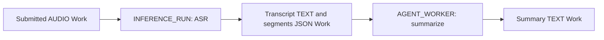
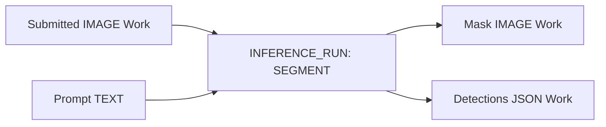
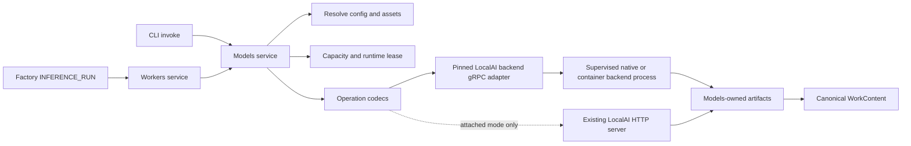
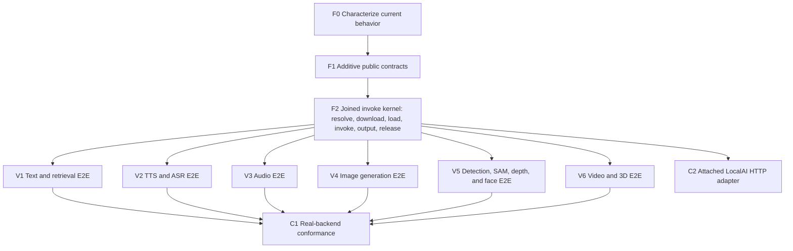

# Run local AI with YOU

Status: proposed  
Date: 2026-08-16  
Audience: Models, Workers, Factory Definitions, transport, and functional-test maintainers

Upstream references: [LocalAI](https://github.com/mudler/LocalAI),
[LocalAI architecture](https://github.com/mudler/LocalAI/blob/master/docs/content/reference/architecture.md),
[LocalAI backends](https://github.com/mudler/LocalAI/blob/master/docs/content/features/backends.md),
and [llama.cpp model loading](https://github.com/ggml-org/llama.cpp/blob/master/docs/models.md).

## What this adds

YOU will run local text, embedding, speech, audio, image, vision, video, and 3D
models through the same two customer surfaces:

- `you models invoke` for one direct request.
- `INFERENCE_WORKER` plus `INFERENCE_RUN` for a reusable Factory graph.

An invocation is the complete journey. YOU resolves the model, downloads any
missing model and backend artifacts, starts the backend, invokes it, writes the
result, and releases the runtime lease. Customers do not need to run a separate
install or pull command first.

This program supports bounded request/response inference. Stateful identity
registries, realtime sessions, training, and quantization remain separate work.

## Current baseline

The repository already has the correct service owners, but its local execution
contract is specialized around OmniVoice TTS:

- Models already owns catalog, pull, readiness, runtime scopes, leases,
  invocation, and output artifacts.
- `RuntimeWorker` currently carries `Model`, `ModelLocality`, and `Operations`.
- `RuntimeResource` currently carries `Model`, `Backend`, and `LoadPolicy` in
  addition to capacity.
- `InvokeModelWithLease` currently accepts one un-named `InferenceInput` and
  returns content plus artifacts under a caller-issued lease.
- CLI and HTTP model invocation currently shape TTS-specific input and file
  output.
- Functional coverage proves catalog, pull, readiness, host activation, lease
  behavior, and direct TTS invocation, but not a second operation family or a
  general LocalAI backend adapter.

The migration keeps the working scope, lease, artifact, and event foundations.
It moves model-runtime metadata out of Resources, makes operation input/output
generic, and adds a joined high-level invocation so clients cannot forget the
prepare phase.

## The customer contract

### Invoke downloads by default

The shortest useful command is the default:

```sh
you models invoke hf://ggerganov/whisper.cpp/ggml-base.en.bin \
  --operation ASR \
  --input audio=@./meeting.wav > meeting.txt
```

On the first invocation, YOU:

1. Resolves the Worker-scoped model configuration.
2. Validates the operation, inputs, parameters, and output route.
3. Reuses the Hugging Face cache or downloads missing immutable assets.
4. Prepares the compatible LocalAI backend artifact when it is missing.
5. Starts or reuses the backend and loads the model.
6. Invokes the operation and writes the output.
7. Releases the lease and applies the configured idle/unload policy.

Later invocations reuse cached bytes and a compatible ready backend. Concurrent
first invocations share one download and one load operation.

`you models pull <model>` remains an optional prefetch command for offline
preparation. It is never a prerequisite for `invoke`.

Use `--offline` when a command must use only local files and existing caches:

```sh
you models invoke studio-whisper --offline \
  --operation ASR --input audio=@./meeting.wav > meeting.txt
```

An offline cache miss reports every missing artifact and makes no network
request.

### Output is predictable

Output behavior is based on the selected operation contract:

- With exactly one output and no output flags, write the payload to stdout.
- Text and JSON outputs use their canonical UTF-8 representation.
- Audio, image, video, mesh, and other binary outputs write raw bytes.
- With multiple outputs and no explicit output mode, fail the request before
  downloading or starting anything.
- `--output <slot>=<path>` explicitly exports named outputs.
- `--json` is an explicit multi-output mode and returns canonical output
  metadata and artifact references.

That makes TTS naturally pipeable:

```sh
you models invoke local-voice \
  --operation TTS \
  --input text="Read the release summary." > summary.wav
```

A multi-output operation requires a choice:

```sh
you models invoke studio-whisper \
  --operation ASR \
  --input audio=@./meeting.wav \
  --output transcript=./meeting.txt \
  --output segments=./meeting.json
```

or:

```sh
you --json models invoke studio-whisper \
  --operation ASR \
  --input audio=@./meeting.wav
```

If neither output form is present, ASR fails because its configured contract
has both `transcript` and `segments` outputs. An implementation may omit an
optional output when the backend does not produce it, but every required
binary output must be mapped unless `--json` is selected.

### CLI grammar

```text
you models invoke <model-or-source> [--operation <name>]
  [--input <slot>=<value>]...
  [--param <name>=<value>]...
  [--output <slot>=<path>]...
  [--json]
  [--offline]
```

- `<model-or-source>` is an operator model name, local path, `file://` URI, or
  `hf://` reference.
- `--operation` can be omitted when the resolved model exposes one operation.
- `--input <slot>=<text>` binds inline text.
- `--input <slot>=@<path>` binds a file using its detected media type.
- `--input <slot>=json:<json>` binds inline JSON.
- `--param <name>=<value>` sets a validated operation parameter.
- `--text` remains a TTS compatibility alias for `--input text=...`.
- The existing unqualified TTS `--output <path>` remains a compatibility form.

Unknown or missing slots, ambiguous operations, invalid parameters, and
invalid output routing fail before heavyweight asset preparation.

### Complete direct journeys

Each example below is a complete resolve/download/load/invoke/output flow. No
preceding install step is implied.

| Family | Complete command | Default result |
| --- | --- | --- |
| Text | `you models invoke local-llm --operation TEXT_GENERATE --input prompt="Write a haiku"` | Text on stdout. |
| Embedding | `you models invoke local-embed --operation EMBED --input text="Find similar work"` | JSON on stdout. |
| Rerank | `you models invoke local-reranker --operation RERANK --input query="local AI" --input documents=json:'["a","b"]'` | Ranking JSON on stdout. |
| TTS | `you models invoke local-voice --operation TTS --input text="Hello" > hello.wav` | Audio bytes on stdout. |
| ASR | `you models invoke local-asr --operation ASR --input audio=@meeting.wav --output transcript=meeting.txt --output segments=meeting.json` | Two explicitly mapped outputs. |
| Sound | `you models invoke local-sound --operation SOUND_GENERATE --input prompt="Ocean at night" > ocean.wav` | Audio bytes on stdout. |
| Audio analysis | `you models invoke local-vad --operation VAD --input audio=@meeting.wav` | Segment JSON on stdout. |
| Audio transform | `you models invoke local-separator --operation AUDIO_TRANSFORM --input audio=@song.wav --json` | Named stem artifact references. |
| Image generation | `you models invoke local-image --operation IMAGE_GENERATE --input prompt="A winter lighthouse" > lighthouse.png` | Image bytes on stdout. |
| Detection | `you models invoke local-detector --operation OBJECT_DETECT --input image=@desk.jpg` | Detection JSON on stdout. |
| SAM | `you models invoke local-sam --operation SEGMENT --input image=@desk.jpg --input prompt="coffee mug" --output masks=mask.png --output detections=detections.json` | Mask and detections. |
| Depth | `you models invoke local-depth --operation DEPTH_ESTIMATE --input image=@room.jpg --json` | Depth, geometry, and optional point-cloud references. |
| Video | `you models invoke local-video --operation VIDEO_GENERATE --input prompt="Clouds moving over a ridge" --json` | Video and optional audio references. |
| 3D | `you models invoke local-mesh --operation MESH_GENERATE --input image=@chair.png > chair.glb` | GLB bytes on stdout. |

PowerShell users use the platform's normal binary redirection behavior or an
explicit `--output` path where byte-preserving redirection is unavailable.

### Prefetch and inspect are optional

Operators can prepare a machine before it goes offline:

```sh
you models pull local-image
you models inspect local-image
```

`inspect` reports the resolved source revision, cache state, operations, input
and output slots, runtime artifact, accelerator compatibility, and readiness.

Model names are configured in operator settings. An operator entry can point
at a local file, local configuration, or Hugging Face source:

```yaml
models:
  studio-whisper:
    source: hf://ggerganov/whisper.cpp/ggml-base.en.bin@main
    backend: localai-whisper
    loadPolicy: ON_DEMAND
    operations:
      - name: ASR
        inputs:
          - {name: audio, contentTypes: [AUDIO], required: true}
        outputs:
          - {name: transcript, contentTypes: [TEXT], required: true}
          - {name: segments, contentTypes: [JSON], required: true}
```

Most customers do not write that block. Built-in defaults cover known backend
and model formats. Operator configuration is the override for an ambiguous
model, custom backend build, non-default operation contract, or load policy.

There is deliberately no LocalAI gallery definition contract. YOU does not
pin, mirror, or expose LocalAI gallery YAML as a customer source type.

## Factory graphs

### Workers declare the model

The authored Worker stays small:

```yaml
workers:
  - name: transcriber
    type: INFERENCE_WORKER
    model: studio-whisper
```

The selected model's operations come from operator configuration when present,
then from YOU's built-in defaults. `modelLocality` is not required. Locality is
derived from the resolved model and backend runtime.

The effective model binding—source, backend, load policy, operations, and
runtime options—is Worker-scoped configuration. It is not a generic Factory
Resource. Optional inline overrides, if retained by the final schema, live on
the Worker's `model` binding and can only narrow operator policy.

Resources describe admission capacity only:

```yaml
resources:
  - name: local-gpu
    type: MODEL
    capacity: 1
```

A Worker can request that capacity, but the Resource never contains a model,
backend, source, or load policy:

```yaml
workers:
  - name: image-generator
    type: INFERENCE_WORKER
    model: local-image
    resources:
      - name: local-gpu
        amount: 1
```

This separation keeps Resources reusable across Workers and prevents hardware
admission state from becoming a second model catalog.

### Complete image-generation graph

```yaml
resources:
  - name: local-gpu
    type: MODEL
    capacity: 1

workers:
  - name: image-generator
    type: INFERENCE_WORKER
    model: local-image
    resources:
      - name: local-gpu
        amount: 1

workstations:
  - name: render-image
    type: INFERENCE_RUN
    worker: image-generator
    operation: IMAGE_GENERATE
    inputs:
      - workType: image-request
        state: ready
    outputs:
      - workType: generated-image
        state: complete
    onFailure:
      - workType: image-request
        state: failed
    operationBindings:
      - slot: prompt
        selector:
          type: TEXT
      - slot: parameters
        config:
          - type: JSON
            value:
              width: 1024
              height: 1024
              seed: 42
```

For the first matching Work dispatch, the complete graph journey is:

```mermaid
flowchart LR
    W["Ready Work"] --> D["INFERENCE_RUN dispatch"]
    D --> R["Resolve Worker model"]
    R --> V["Validate bindings and outputs"]
    V --> A["Reuse or download assets"]
    A --> H["Start or reuse backend"]
    H --> I["Invoke operation"]
    I --> O["Materialize named Work outputs"]
    O --> E["Append canonical Factory events"]
    E --> L["Release lease"]
```



The dispatch remains claimed while assets prepare. Preparation progress is
published as model/runtime observations; it does not create fake Work states.
Failure enters the Workstation's configured `onFailure` route with a stable,
provider-neutral failure classification.

### Example compositions





Factory definitions never name a LocalAI endpoint or protocol. Models maps the
stable operation contract to the configured backend.

## Supported operations

### Bounded operations in this program

| Public operation | Required inputs | Optional inputs | Outputs |
| --- | --- | --- | --- |
| `TEXT_GENERATE` | `prompt:TEXT` | `parameters:JSON` | `text:TEXT`, optional `usage:JSON` |
| `VISION` | `prompt:TEXT`, `image:IMAGE` | `parameters:JSON` | `text:TEXT`, optional `usage:JSON` |
| `EMBED` | `text:TEXT` or `tokens:JSON` | `parameters:JSON` | `embedding:JSON` |
| `RERANK` | `query:TEXT`, `documents:JSON` | `parameters:JSON` | `ranking:JSON` |
| `MODERATE` | `text:TEXT` | `parameters:JSON` | `moderation:JSON` |
| `TOKENIZE` | `text:TEXT` | `parameters:JSON` | `tokens:JSON` |
| `DETOKENIZE` | `tokens:JSON` | `parameters:JSON` | `text:TEXT` |
| `TTS` | `text:TEXT` | `voice:AUDIO`, `parameters:JSON` | `audio:AUDIO` |
| `SOUND_GENERATE` | `prompt:TEXT` | `parameters:JSON` | `audio:AUDIO` |
| `ASR` | `audio:AUDIO` | `prompt:TEXT`, `parameters:JSON` | `transcript:TEXT`, `segments:JSON` |
| `DIARIZE` | `audio:AUDIO` | `parameters:JSON` | `segments:JSON`, `rttm:TEXT` |
| `AUDIO_CLASSIFY` | `audio:AUDIO` | `parameters:JSON` | `classes:JSON` |
| `VAD` | `audio:AUDIO` | `parameters:JSON` | `segments:JSON` |
| `AUDIO_TRANSFORM` | `audio:AUDIO` | `reference:AUDIO`, `text:TEXT`, `parameters:JSON` | one or more named `audio:AUDIO` outputs, optional `metadata:JSON` |
| `IMAGE_GENERATE` | `prompt:TEXT` | `image:IMAGE`, `mask:IMAGE`, `parameters:JSON` | `image:IMAGE` |
| `IMAGE_UPSCALE` | `image:IMAGE` | `parameters:JSON` | `image:IMAGE` |
| `OBJECT_DETECT` | `image:IMAGE` | `prompt:TEXT`, `parameters:JSON` | `detections:JSON` |
| `SEGMENT` | `image:IMAGE` | `prompt:TEXT`, `points:JSON`, `boxes:JSON` | `masks:IMAGE`, `detections:JSON` |
| `DEPTH_ESTIMATE` | `image:IMAGE` | `parameters:JSON` | `depth:IMAGE`, `geometry:JSON`, optional `pointCloud:BINARY` |
| `FACE_DETECT` | `image:IMAGE` | `parameters:JSON` | `faces:JSON` |
| `FACE_EMBED` | `image:IMAGE` | `parameters:JSON` | `embedding:JSON` |
| `FACE_VERIFY` | `image:IMAGE`, `reference:IMAGE` | `parameters:JSON` | `verification:JSON` |
| `FACE_ANALYZE` | `image:IMAGE` | `parameters:JSON` | `analysis:JSON` |
| `SPEAKER_EMBED` | `audio:AUDIO` | `parameters:JSON` | `embedding:JSON` |
| `SPEAKER_VERIFY` | `audio:AUDIO`, `reference:AUDIO` | `parameters:JSON` | `verification:JSON` |
| `SPEAKER_ANALYZE` | `audio:AUDIO` | `parameters:JSON` | `analysis:JSON` |
| `VIDEO_GENERATE` | `prompt:TEXT` | `image:IMAGE`, `audio:AUDIO`, `parameters:JSON` | `video:VIDEO`, optional `audio:AUDIO` |
| `MESH_GENERATE` | `image:IMAGE` | `parameters:JSON` | `mesh:BINARY` |
| `MESH_REMESH` | `mesh:BINARY` | `parameters:JSON` | `mesh:BINARY` |

`VIDEO` becomes a first-class `WorkContent` type. GLB stays `BINARY` with the
`model/gltf-binary` media type.

`SEGMENT` covers SAM point, box, and text prompts. `IMAGE_GENERATE` covers
text-to-image, image-to-image, inpainting, and control images through optional
slots and validated parameters.

### Customer-visible variants

| Family | Variants |
| --- | --- |
| Text | Completion, structured generation, vision response, moderation, tokenization, and detokenization. |
| Retrieval | Text or token embeddings, dimensions, and query/document reranking. |
| Speech output | Named voices, reference-audio cloning, voice design, styles, and streamed audio. |
| Speech input | Transcript, language hints, word/segment timestamps, subtitle data, and diarization. |
| Generated audio | Speech, music, ambient sound, and effects. |
| Audio analysis | VAD, sound classification, speaker embedding, verification, and analysis. |
| Audio transform | Denoising, echo cancellation, dereverberation, separation, and voice conversion. |
| Image generation | Text-to-image, image-to-image, inpainting, control images, seeds, and upscaling. |
| Detection and SAM | Closed/open vocabulary detection; point, box, and text segmentation prompts. |
| Spatial vision | Depth, confidence, camera pose, and point-cloud artifacts. |
| Face analysis | Detection, embedding, verification, attributes, and anti-spoofing facts when supported. |
| Video | Text, image, or audio conditioning with optional generated audio. |
| 3D | Single-image mesh generation, textured GLB, quality selection, and remeshing. |

The resolved operation configuration determines supported variants. A backend
cannot silently accept an unknown slot or ignore a requested capability.

### Deferred capabilities

| Capability | Why it is separate |
| --- | --- |
| Face/speaker register, identify, and forget | They mutate identity registries and need durability and privacy policy. |
| Voice-profile create and delete | They mutate a voice library and need retention policy. |
| Realtime speech-to-speech and streaming transforms | They are long-lived bidirectional sessions with backpressure. |
| Background response jobs | Factory Sessions already own durable dispatch and cancellation. |
| Fine-tuning and quantization | They are model lifecycle jobs, not inference. |
| LocalAI agents, MCP, and stores | Existing YOU services already own those concerns. |

## Model resolution and caching

### Source forms

| Source | Meaning |
| --- | --- |
| `./model.gguf` or `./model.yaml` | File or configuration relative to the Factory or operator configuration. |
| `/absolute/model.gguf` | Absolute POSIX path. |
| `C:\models\model.gguf` | Absolute Windows path. |
| `file:///absolute/model.yaml` | Explicit local file URI. |
| `hf://owner/repository@revision` | Hugging Face repository snapshot. |
| `hf://owner/repository/file.gguf@revision` | Exact Hugging Face file. |

No LocalAI gallery URI is supported. Remote CLI execution resolves server-side
paths and rejects an unstaged client-relative path.

For a local source, YOU resolves the path against the correct configuration
root, validates it before backend startup, uses it in place, and records size
and digest diagnostics.

For Hugging Face, YOU resolves a requested revision to an immutable commit and
checks caches in this order:

1. `HUGGINGFACE_HUB_CACHE`, when set.
2. `$HF_HOME/hub`, when `HF_HOME` is set.
3. The platform-default Hugging Face hub cache.
4. The YOU content-addressed cache.
5. The network, unless `--offline` is active.

Downloads use a partial directory, digest verification, and atomic commit.
`HF_TOKEN` supports private repositories and is always redacted. Model/runtime
artifacts use separate caches so deleting one model never removes a shared
backend artifact.

This matches the useful `llama.cpp` experience: local paths load in place,
Hugging Face references resolve files and revisions, standard cache contents
are reused, and missing bytes download on the first invocation.

## How YOU integrates with LocalAI

### Decision

Use two LocalAI adapters behind the Models service:

1. `LOCALAI_GRPC`, the default for YOU-managed local execution. YOU supervises
   the selected LocalAI backend process and invokes its pinned gRPC protocol.
2. `LOCALAI_HTTP`, an optional compatibility adapter for an operator-supplied,
   already-running LocalAI server.

Do not start a full LocalAI HTTP server for the default managed path. Do not
import the entire LocalAI application into the YOU binary.



### Why not embed all of LocalAI as Go packages?

We can import LocalAI packages technically, but that does not embed the whole
inference system:

- LocalAI's Go core is a control plane and API shim. Its backend calls load a
  client and invoke gRPC methods; the inference engines remain separate
  backend processes.
- LocalAI backends include C++, Go, and Python implementations with different
  CPU, CUDA, ROCm, SYCL, Vulkan, Metal, and Jetson builds. Those native and
  language runtimes cannot become one portable pure-Go binary by importing a
  package.
- The upstream `ModelLoader` starts and watches gRPC processes. Importing it
  would duplicate Models, Platform process supervision, cache, lifecycle,
  retry, and policy responsibilities inside YOU.
- LocalAI currently declares Go 1.26 while this repository declares Go 1.25.
  Importing the module would force a toolchain change before considering its
  large server, UI, container, database, auth, P2P, and SDK dependency graph.
- The application packages are not a narrow, versioned embedding SDK. Direct
  imports would couple YOU to LocalAI's internal configuration and lifecycle.

The useful reusable boundary is its backend protocol and backend artifacts,
not its whole application. We will pin the upstream protobuf contract, retain
its license/attribution, generate an isolated client under the LocalAI adapter,
and protect it with compatibility tests. No LocalAI types cross the Models
service boundary.

### Why a process boundary remains valuable

The process boundary isolates native crashes and accelerator libraries, lets
different Workers select different backend builds, permits unload/restart, and
keeps YOU's core build portable. Large model inputs and outputs use local file
or artifact references where the backend contract permits, so the boundary
does not require copying every payload through memory.

HTTP is not required for the managed path. It remains useful only when an
operator explicitly points YOU at an existing LocalAI deployment, because the
HTTP API is that server's supported external boundary.

### Compatibility policy

- Pin a tested LocalAI backend protocol revision and artifact manifest.
- Verify backend artifact checksum, platform, architecture, and accelerator.
- Negotiate capabilities before marking a runtime ready.
- Reject an incompatible protocol or unknown backend build with a typed error.
- Update the pin only in a dependency PR that passes fixture and real-backend
  conformance tests.
- Permit a selective in-process pure-Go backend later only behind the same
  Models adapter contract; it is an optimization, not a public Worker type.

## Package integration

Most logic belongs in Models. Other packages change where they own an actual
contract, not because they know about LocalAI.

| Package family | Change | Why it is coupled |
| --- | --- | --- |
| `pkg/services/models` | Resolve Worker model definitions, assets, defaults, backend artifacts, lifecycle, leases, invocation, and output artifacts. Add internal LocalAI gRPC and attached-HTTP adapters. | This service already owns local-model readiness and inference. |
| `pkg/services/workers` | Pass model, operation, ordered inputs, and parameters to Models; preserve all named outputs. Stop requiring `modelLocality`; normally derive operations from Models. | Workers owns one request-scoped execution attempt. |
| `pkg/services/factory_definitions` | Validate that an inference Worker names a model and that Workstation bindings match resolved operation contracts. Remove model runtime fields from `MODEL` resources. | It owns authored graph validation, not resolution or download. |
| `pkg/services/operator_settings` | Persist model aliases and optional source/backend/load-policy/operation overrides; define backend trust and offline policy. | Operator policy supplies the Worker-scoped effective configuration. |
| `pkg/services/work` | Add `VIDEO`; preserve named multi-artifact lineage and GLB as `BINARY`. | Work owns canonical content representation. |
| `pkg/transports/cli` | Add generic inputs, parameters, output mappings, automatic prepare-on-invoke, stdout defaults, offline, pull, and inspect. | CLI owns command grammar and terminal/file output. |
| `api/` and HTTP mapping | Add generic invocation, named outputs, `VIDEO`, model detail, and typed failures. | Remote callers need equivalent service contracts. |
| `pkg/platform` | Reuse process, filesystem, network, and artifact effects; add local gRPC dialing only if no policy-free edge exists. | Platform owns external effects, not model choice. |
| `pkg/wire` and `pkg/initializer` | Construct adapters and stop supervised backends during shutdown/rollback. | Composition and lifecycle belong here. |
| Factory Runtime, Sessions, Recordings, Events | No new service methods expected. Existing dispatch, event, and replay contracts carry canonical Work. | A modality or LocalAI branch here would be misplaced coupling. |
| UI | Render schema-derived slots, readiness progress, and named artifacts. | UI projects public contracts; it does not inspect LocalAI payloads. |

### Proposed Models contracts

```go
type ModelReference struct {
    NameOrURI string
}

type ResolveModelRequest struct {
    Scope   RuntimeScopeRef
    Model   ModelReference
    Offline bool
}

type ResolvedModel struct {
    Identity      ModelIdentity
    Source        ResolvedModelSource
    Backend       BackendIdentity
    LoadPolicy    LoadPolicy
    Operations    []OperationDefinition
}

type InvokeModelRequest struct {
    Scope       RuntimeScopeRef
    Holder      string
    Model       ModelReference
    Operation   string
    Inputs      []InferenceInput
    Parameters  []OperationParameter
    OutputMode  OutputMode
    Offline     bool
}

type InvokeModelResult struct {
    Outputs []InferenceOutput
}
```

`InvokeModel` performs resolve and prepare as part of the same service
operation. Internal phases remain observable and cancellable; callers do not
have to coordinate `Pull`, `Activate`, `Lease`, and `Invoke` correctly.

Keep explicit `PullModel` and `InspectModel` operations for preparation and
diagnostics. Preserve the existing `InvokeModelWithLease` as the low-level,
already-prepared primitive during migration. The new joined operation opens or
uses a runtime scope, prepares assets, acquires a lease, calls that primitive,
and guarantees lease cleanup. Workers and direct transports migrate to the
joined operation; specialized runtime/session code can keep the scoped
primitive when it genuinely owns the lease lifecycle.

### Private Models layout

```text
pkg/services/models/internal/
  resolution/
    resolver.go
    local_path.go
    huggingface.go
    defaults.go
  backends/localai/
    protocol/        # pinned generated gRPC client and attribution
    managed.go       # process selection, start, readiness, stop
    attached_http.go # optional existing-server adapter
    codecs/          # public operation to backend request/response mapping
  artifacts/
  lifecycle/
```

No gallery resolver is added. The LocalAI adapter is the only package that can
import or contain LocalAI protocol details.

### Schema and interface changes

- `INFERENCE_WORKER.model` remains the primary authored field.
- `INFERENCE_WORKER.operations` becomes optional compatibility/override input;
  omit it when Models can resolve the operation definition.
- Deprecate and stop requiring `modelLocality` for inference Workers.
- Remove model, backend, source, and load-policy fields from `MODEL` Resources.
- Add operation parameters and required/optional named outputs.
- Add `VIDEO` content schemas.
- Extend model detail with resolved source, backend identity, operations, and
  readiness without exposing host addresses or cache paths.
- Add generic invocation and output-mode schemas while retaining TTS aliases.

The corresponding Go projection changes are explicit:

- `models.RuntimeWorker`: retain `Model`; remove the behavior dependency on
  `ModelLocality`; make `Operations` resolved data rather than required authored
  data.
- `models.RuntimeResource`: retain `ID`, `Name`, `Type`, and `Capacity`; remove
  `Model`, `Backend`, and `LoadPolicy` after compatibility decoding.
- `models.InferenceInput`: add `Name`, media metadata, and detached content or
  artifact reference; invocation accepts an ordered slice.
- `models.InferenceContent` and `models.InferenceArtifact`: add or consistently
  require the output slot name.
- `models.InvokeModelRequest`: add model reference, ordered inputs, parameters,
  offline policy, and output mode for the joined operation.
- `models.InvokeModelWithLease`: evolve additively to accept ordered named
  inputs and parameters while retaining explicit scope and lease identity.

Factory-definition migration decodes old Resource runtime fields long enough
to issue a targeted error or migration warning; it never creates a second
effective model definition from them. Semantic operation-binding validation
runs when a Factory Session resolves the Worker's model. Pure structural graph
validation remains possible without network or host access.

Author OpenAPI changes in `api/openapi-main.yaml` and `api/components/`, run
`make generate-api`, then `make interfaces-all`. Generated files are never
edited by hand.

### Documentation and examples

- Update `docs/reference/models.md` with invoke-first flows, source resolution,
  stdout rules, prefetch, and inspect.
- Update Worker and Workstation references with model-derived operations.
- Update Resources reference to describe capacity only.
- Add complete ASR, image-generation, and SAM Factory examples.
- Update the root README only after the first bounded vertical slice ships.

## Functional test plan

Tests construct the application through `root.BuildProcess` and execute
customer flows through `Process.Execute`. Fixtures replace only exact effects
through `edges.Edges`.

Every operation-family story is end to end. Its test owns model resolution,
cache behavior, runtime preparation, invocation mapping, output behavior,
Factory materialization, failure behavior, and customer documentation together.

### Shared contract cells

- A single-output CLI invocation writes exactly the canonical payload to stdout
  and writes diagnostics only to stderr.
- A multi-output invocation with neither mappings nor `--json` fails before
  model or backend download.
- `--json` returns every named output reference.
- Explicit mappings preserve output slot, media type, digest, and bytes.
- An omitted operation resolves only when exactly one operation is available.
- Unknown slots and parameters fail before backend activation.
- An invoke cache miss downloads automatically; a cache hit performs no network
  request; concurrent misses share one immutable commit.
- Local paths cause no network traffic.
- Offline hits succeed and offline misses list all missing artifacts.
- Digest mismatch and interrupted downloads never expose a ready snapshot.
- Secrets, signed URLs, backend addresses, and cache paths do not enter output,
  canonical events, or diagnostics.

### Vertical operation stories

| Story | Direct CLI proof | Factory proof | High-risk proof |
| --- | --- | --- | --- |
| Text and retrieval | First invoke downloads and emits text/JSON; embedding and rerank map canonical inputs. | `INFERENCE_RUN` emits TEXT/JSON Work. | Token/usage metadata, cancellation, invalid parameters. |
| Speech | First TTS/ASR invoke prepares backend; TTS pipes audio; ASR requires mappings or JSON. | Audio Work becomes transcript/segments; TTS becomes AUDIO Work. | Timestamps, language, streaming-to-artifact, lease release. |
| Audio | Generation, VAD, classification, verification, and transforms complete from source to output. | Named stems and JSON results become separate Work outputs. | Multiple outputs, backpressure, optional references. |
| Image generation | First invoke emits raw image and records seed metadata. | Prompt Work becomes IMAGE Work. | Inpaint/control inputs, large responses, cancellation. |
| Detection and SAM | Detection emits JSON; SAM requires explicit masks/detections output mode. | IMAGE plus prompts become mask and detection Work. | Multiple masks, points/boxes, media types. |
| Depth and face | Complete source-to-depth/face flows. | Named image/JSON/binary outputs materialize and replay. | Optional point cloud, unknown response fields. |
| Video and 3D | Video uses explicit multi-output mode; mesh emits GLB to stdout. | `VIDEO`, optional AUDIO, and BINARY Work route without prompt conversion. | Large artifact references and replay. |

Each story runs once through a protocol fixture. A scheduled conformance variant
runs one small real model for each backend/operation family without storing
weights in the repository.

Every public operation in the bounded-operation table receives at least one
named functional cell inside its family story; a family-level smoke test cannot
stand in for an untested operation codec.

### Lifecycle and failure cells

- Start a backend only after output and input validation succeeds.
- Share one ready backend and enforce capacity across concurrent invocations.
- Release capacity after success, mapping failure, timeout, cancellation, and
  process crash.
- Stop idle backends according to the resolved Worker model load policy.
- Stop all supervised processes during normal and rollback shutdown.
- Surface unsupported accelerator, incompatible protocol, backend startup,
  malformed response, oversized response, and disk-full failures safely.
- Record and replay canonical Work and failures without LocalAI-native payloads.
- Keep `onFailure` routing ordered under resource saturation.
- Use event or condition synchronization; do not use sleeps as the default test
  mechanism.

### Compatibility lanes

Protocol fixtures prove YOU behavior. The scheduled real-backend lane proves
compatibility with the pinned LocalAI revision and publishes only backend
version, immutable model revision, operation, hardware class, duration, and
result digest.

The optional attached-server lane starts a full LocalAI server and covers its
external HTTP adapter separately. A passing HTTP test is not required for the
default managed gRPC path.

## Parallel implementation plan

The plan has one small shared foundation followed by complete vertical slices.
Tests and docs ship with each slice; there is no late integration phase where
download, invocation, and Factory behavior are first joined.

| Lane | Independently mergeable outcome | Depends on |
| --- | --- | --- |
| `F0` | Characterize current OmniVoice, lease, artifact, CLI stdout, and Factory behavior. | none |
| `F1` | Additive model reference, operation, output-mode, named-output, and `VIDEO` contracts compile; legacy TTS still passes. | `F0` |
| `F2` | Joined `InvokeModel` resolve/prepare/load/invoke/release kernel; local/HF cache and managed gRPC host work through fixtures. | `F1` |
| `V1` | Text and retrieval work end to end through CLI and Factory, including first-invoke download, failures, tests, and docs. | `F2` |
| `V2` | TTS and ASR work end to end with stdout/multi-output behavior, tests, and docs. | `F2` |
| `V3` | Generated audio, analysis, verification, and transform work end to end. | `F2` |
| `V4` | Image generation and upscaling work end to end. | `F2` |
| `V5` | Detection, SAM, depth, and face operations work end to end. | `F2` |
| `V6` | Video and 3D work end to end, including `VIDEO` and large artifacts. | `F2` |
| `C1` | Real-backend conformance covers every shipped family and pins compatibility. | completed vertical slices |
| `C2` | Optional attached LocalAI HTTP compatibility works without affecting managed execution. | `F2` |



Shared-file ownership keeps parallel work mergeable:

- `F1` alone owns initial OpenAPI and generated contract changes.
- `F2` alone owns the resolver, cache transaction, backend supervisor, and
  pinned protocol client.
- Each `V` lane owns its codec directory, focused fixtures, functional story,
  example, and reference section.
- A vertical lane requests a small follow-up contract PR instead of editing
  shared generated interfaces concurrently.

OmniVoice stays functional behind the adapter contract until `V2` proves
equivalent TTS behavior. Removing its specialized runtime is a separate cleanup
after all callers use joined invocation.

## Acceptance criteria

- `models invoke` automatically resolves and downloads missing assets.
- A local path invokes without network traffic; Hugging Face cache contents are
  reused using standard cache locations.
- Pull remains optional prefetch and offline mode is strictly cache-only.
- Exactly one output defaults to stdout for text, JSON, and binary payloads.
- Multiple outputs without mappings or `--json` fail before expensive work.
- An inference Worker normally declares only `type` and `model`.
- Operations come from operator configuration or deterministic built-in
  defaults; ambiguous models fail with actionable configuration guidance.
- `modelLocality` is not required.
- Resources contain capacity only, never model, backend, source, or load policy.
- Direct and Factory invocation support every shipped bounded operation.
- Managed local execution talks directly to a pinned LocalAI backend protocol;
  a full HTTP server is not required.
- No LocalAI type or native payload crosses the Models public boundary.
- Canonical events contain provider-neutral Work, artifacts, and failures.
- Stateful and realtime capabilities do not masquerade as bounded inference.
- OpenAPI, generated Go/TypeScript, packaged schemas, docs, and examples stay
  synchronized.

## Verification

Use focused unit and functional packages for each vertical slice. Run the
broader public-interface gates when their source contracts change:

```sh
make generate-api
make interfaces-all
make api-smoke
make docs-reference-smoke
make verify-fast
make verify-pr
```

Run `make ui-test` and `make ui-lint` when graph editing or artifact
presentation changes. Run race coverage for cache singleflight, runtime leases,
and shared backend lifecycle. A LocalAI protocol-pin update must pass fixture
and real-backend conformance before merge.
