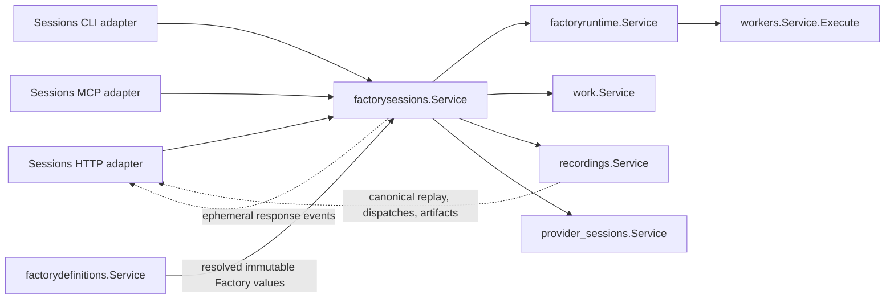

# Factory Sessions root-interface convergence

Factory Sessions is physically packaged, but its public contract is not yet converged. The package currently publishes one nominal aggregate while retaining the old live-session gateway, durable execution service, runtime-opening factory, application composition bundle, invocation collaborator, and presentation bridges.

The target is one process-scoped `factorysessions.Service` that owns customer-visible Factory Session identity, lifecycle, activation, invocation coordination, and ephemeral response observation. It must not expose runtime objects, application composition, transport facets, or a second execution interface.

This plan is aligned with:

- `docs/internal/standards/code/planning-standards.md`
- `docs/internal/standards/code/general-backend-standards.md`
- `docs/architecture/data-model.md`
- `docs/architecture/packaged-structure.md`
- `package-service-factory-runtime.md`
- `package-service-workers.md`

## 1. Intended ownership

Factory Sessions owns:

- Factory Session identity, including logical identity and live-ID remapping.
- The registry of open and recoverable Factory Sessions.
- Customer-visible session lifecycle decisions.
- Opening a Factory Session from an immutable Factory definition selection.
- Activating or swapping the Current Factory for a session.
- Coordinating one invocation against an existing Factory Session.
- Coordinating recovery of an interrupted session from an accepted checkpoint.
- Session-level result availability and result selection.
- Ephemeral `FactoryResponseEvent` retention and subscription.
- Session-level projections assembled from owner service values.

Factory Sessions does not own:

- Factory compilation, definition validation, named Factory catalogs, or authored persistence — Factory Definitions.
- Runtime scheduling, dispatch state machines, retries, cancellation mechanics, checkpoints, or execution instances — Factory Runtime.
- Worker runners, pools, executors, or persistent Worker instances — Workers.
- Canonical Work materialization or Work queries — Work.
- Canonical Factory Event append, replay, dispatch history, artifacts, or durable projections — Recordings.
- Provider conversations or transcripts — Provider Sessions.
- Model catalog/runtime presentation — Models.
- HTTP server binding, CLI application opening, MCP server construction, or process lifecycle — `pkg/wire`, service transports, and `pkg/initializer`.

## 2. Current root contract

The root currently publishes four named interfaces:

1. `Service`
2. `ExecutionService`
3. `DefinitionActivationGatewayProvider`
4. `ModelsCLIPresentationCollaborator`

`Service` embeds `ExecutionService`. The resulting aggregate exposes 44 methods:

- 18 durable execution methods from `ExecutionService`.
- 26 runtime binding, live control, event, observation, result, and durable compatibility methods directly on `Service`.

The interface therefore satisfies the one-name rule only cosmetically. Consumers still receive or request `ExecutionService` directly from CLI, HTTP, MCP, `pkg/wire`, and transport mapping.

## 3. Broken and incomplete contracts

### C1 — A second public execution authority remains

`ExecutionService` is returned by `wire.NewDurableExecution` and `wire.NewStandaloneExecution` and is injected directly into CLI, HTTP, MCP, mapping composition, and runtime opening. This bypasses the singular root and makes durable execution a separately constructible authority.

Required change: fold the required behavior into `Service`, migrate all peers to `Service`, then delete `ExecutionService` and both public execution constructors.

### C2 — Live and durable sessions are represented as different APIs

The root has overlapping pairs and families:

- `ListFactorySessions` and `ListSessions`
- `GetFactorySession` and `GetSession`
- `PauseLiveFactorySession`, `PauseDurableFactorySession`, and `Pause`
- `ResumeLiveFactorySession`, `ResumeDurableFactorySession`, and `Resume`
- `CloseFactorySession`, `Cancel`, and `Terminate`
- live result methods and durable `GetResult`
- live canonical-event methods and durable event methods

This contradicts the public model: a Factory Session is one resource. Persistence and hosting are properties of a session, not separate root interfaces.

Required change: one list, get, control, result, and start vocabulary must serve all session modes. Mode-specific behavior belongs in request values and typed results, not method names.

### C3 — `ForRuntime` makes the root a service factory

`Service.ForRuntime` returns another `Service` after binding a clock. `internal/service.Root` retains a placeholder embedded `Service`, and runtime opening creates a new `sessionservice.Assembly` behind the root. This splits process construction from domain opening and makes the public interface expose implementation assembly.

`OpeningBindingRequest` is an alias of `RuntimeBinding`; the two spellings are not a type mismatch. The contract problem is the factory pattern itself.

Required change: construct one inert process-scoped Sessions service in `factory_sessions/wire`, inject the clock/effects there, and make `Start` create private per-session state. Delete `ForRuntime`, `RuntimeBinding`, `OpeningBindingRequest`, `OpeningBindingResult`, and the placeholder embedded interface.

### C4 — Invocation is documented but absent from `Service`

The root comments claim invocation is part of the singular aggregate, but invocation is carried through anonymous interfaces, `SessionInvoker`, `HostedLiveInvocation`, and `RuntimeHTTPServices.SessionInvocation`. Consumers cannot invoke through `Service` itself.

Required change: publish one `Invoke` method on `Service` using Sessions-owned request/result values. Remove the anonymous and separately injected invoker paths.

### C5 — Definition activation requires downcasting

Runtime opening type-asserts a session runtime to `DefinitionActivationGatewayProvider`. Definitions consumes a separately exposed activation gateway.

Required change: make activation a normal Sessions root operation. Definitions resolves an immutable definition/version; Sessions serializes and applies activation through Runtime. Delete `DefinitionActivationGatewayProvider` and the downcast.

### C6 — Models CLI presentation leaks through Sessions

`ModelsCLIPresentationCollaborator`, `ModelsPresentationScope`, and `InvocationTarget` make Factory Sessions a bridge for Models CLI catalog/runtime presentation. Models CLI performs a type assertion against a Sessions-owned interface.

Required change: Models transports consume `models.Service` and Models-owned scope operations composed by `pkg/wire`. Delete the Sessions collaborator and all Models presentation types from this root.

### C7 — Application composition is published as Sessions vocabulary

The root exports `ApplicationOpeningRequest`, `ApplicationOpeningPorts`, `RuntimeHTTPServices`, `RuntimeOpeningRequest`, `RuntimeHTTPServicesBound`, `HostedLiveInvocation`, and a cross-service bundle containing Definitions, Runtime, Work, Models, Workers, Provider Sessions, prompts, logger, and transport callbacks.

Required change: move process/application composition to `pkg/wire` and lifecycle to `pkg/initializer`. Sessions may accept immutable session-start values; it must not publish the application service table.

### C8 — Runtime implementation types cross the root

The root aliases `factoryruntime.Sidecars`, `factorydefinitions.SessionHost`, Runtime clocks, Runtime observe requests/results, Runtime result projections, JavaScript workflow values, and runtime-log configuration. `LiveRuntime` and runtime projections expose Petri tokens, places, markings, and hosted runtime objects.

Required change: replace these with Sessions-owned IDs and customer-level values. Factory Runtime remains reachable only through its root service inside the Sessions implementation.

### C9 — Canonical event, dispatch, and artifact reads have the wrong authority

Sessions currently reads/probes/subscribes to canonical Factory Events and publishes dispatch/artifact inspection through `ExecutionService`. Recordings is the canonical ledger, replay, dispatch-history, and artifact owner.

Required change: move canonical event replay/subscription, dispatch inspection, and artifact inspection to `recordings.Service`. The Sessions HTTP adapter may compose links or delegate routes, but Sessions must not implement a second ledger.

Ephemeral `FactoryResponseEvent` subscription remains in Sessions because it is intentionally non-canonical, invocation-progress state.

### C10 — Runtime observation bypasses the Runtime root

`ObserveForSession` accepts `factoryruntime.ObserveRequest` and returns `factoryruntime.ObserveResult`. This exposes a Runtime command through Sessions and couples both roots' values.

Required change: Runtime observation/control goes directly through `factoryruntime.Service` using an opaque runtime/session binding ID. Sessions returns the binding identity in its session projection but does not proxy Runtime's API.

### C11 — Workers still back-query Sessions runtime state

Workers declares `CurrentRuntimeResolver` and calls `CurrentRuntime()` to recover Factory and workflow context. This forces private Sessions runtime objects to remain observable.

Required change: complete the stateless Workers plan. Sessions activates Runtime with immutable definition values; Runtime sends complete request-scoped values to `workers.Service.Execute`. Delete `CurrentRuntime` and every Workers import of Factory Sessions.

### C12 — Root effect aliases hide construction interfaces

The root aliases filesystem, temporary-file, cursor-store, metrics, ID generation, home-directory, and logger-oriented ports. These are construction/effect dependencies, not peer-facing product contracts.

Required change: place external effects in `edges.Edges` or focused platform contracts and inject them through `factory_sessions/wire`. Keep private owner-specific effect interfaces under `internal`.

### C13 — Transport mapping recreates service facets

`pkg/transports/mapping` publishes `LiveSessionAPI`, four durable API interfaces, and `DurableSessionAPI`. `factorysession.LiveGateway` and durable mapping wrappers restate subsets of the root. HTTP then receives more than a dozen mapped collaborators.

Required change: service-local HTTP/CLI/MCP adapters depend on `factorysessions.Service` directly. Mapping packages may translate generated values, but they must not define a second application service graph or own lifecycle policy.

### C14 — Session HTTP still owns adjacent domain policy

The Sessions HTTP adapter contains large Factory and Work handlers. It selects bundled targets, looks up workstations, builds prompt contracts, detects live versus durable sessions, merges lists, validates Work unions, stages content, constructs Work, and classifies domain errors.

Required change:

- Delegate Work routes to `work/transports/http`.
- Delegate Factory definition/save/validation routes to Factory Definitions.
- Return unified session projections from Sessions rather than merging live/durable rows in HTTP.
- Keep only decode, generated-type mapping, status/header selection, SSE framing, and typed-error mapping in the adapter.

### C15 — Internal implementations overlap

The package retains overlapping implementations under `internal/execution`, `internal/sessionservice`, `internal/runtime`, `internal/runtimebinding`, `internal/runtimeopening`, `internal/executionopening`, and newer `internal/services/*` wrappers. Many wrappers forward the full durable interface and preserve the old split.

Required change: establish one private root implementation and retain only deep private services with distinct state ownership. Delete forwarding wrappers after parity tests move to root behavior.

## 4. Converged root interface

The intended final peer surface is:

```go
type Service interface {
	Start(context.Context, StartRequest) (StartResult, error)
	Invoke(context.Context, InvokeRequest) (InvokeResult, error)
	Activate(context.Context, ActivateRequest) (ActivateResult, error)
	Get(context.Context, GetRequest) (Session, error)
	List(context.Context, ListRequest) (ListResult, error)
	Control(context.Context, ControlRequest) (ControlResult, error)
	ReadResult(context.Context, ResultRequest) (Result, error)
	PrepareSync(context.Context, SyncRequest) (SyncResult, error)
	SubscribeResponses(context.Context, ResponseSubscriptionRequest) (ResponseSubscription, error)
}
```

This is the target shape, not a requirement to rename everything in one commit. The important constraints are:

- Exactly one named root interface: `Service`.
- No embedded public facets.
- No method returns a service, executor, runtime, host, gateway, or pool.
- Every request contains immutable values or opaque IDs.
- Every result is Sessions-owned, customer-level vocabulary.
- Live/durable/hosted/standalone distinctions are values, not method families.
- Canonical event, dispatch, artifact, Work, and Runtime operations are not duplicated here.

### Start contract

`StartRequest` identifies the Factory source/version, target, initial Work input, persistence policy, and completion behavior. It replaces `OpenFactorySession`, `OpenFactorySessionFromFolder`, `StartAsync`, and `StartSync`.

`StartResult` always returns a stable Factory Session identity and status. A request may ask Sessions to wait to a defined completion boundary; this preserves synchronous CLI/API behavior without a separate execution service.

### Invoke contract

`InvokeRequest` contains the Factory Session ID, normalized Work invocation input, request correlation, and optional wait budget. Sessions asks Work to admit the input and Runtime to execute it. `InvokeResult` contains the selected primary Work outcome and terminal classification.

### Activate contract

`ActivateRequest` contains a Factory Session ID plus an immutable Definitions-owned definition/version reference. Sessions owns serialization, idle-policy evaluation, and Runtime swap coordination.

### Get and List contracts

`Get` and `List` return one unified projection for live, durable, interrupted, and terminal sessions. Persistence/hosting mode appears as data. HTTP must not merge two inventories.

### Control contract

`ControlRequest` contains a session ID, action, correlation metadata, and action-specific value payload where required. Actions include pause, resume, cancel, terminate, close, approve, recover, retry dispatch, and interrupt dispatch. Sessions validates whether the action is available and delegates mechanics to Runtime.

### Result and sync contracts

`ReadResult` returns one Sessions-owned result projection independent of Runtime/Petri types. `PrepareSync` owns logical-session remap and response/canonical-event cursor preflight while delegating canonical cursor validation to Recordings.

### Response subscription contract

`ResponseSubscription` is a concrete value containing an event receive channel or callback and an idempotent detach operation. It must not introduce another named root interface. It carries only ephemeral `FactoryResponseEvent` values.

## 5. Target dependency direction



Prohibited directions:

- Workers to Factory Sessions.
- Factory Runtime to Factory Sessions for missing execution context.
- Sessions to Workers executors or pools.
- Sessions to another service's internal packages.
- Transports/mapping to Sessions internals.
- Sessions root contracts to HTTP, CLI, MCP, logger, filesystem, or process types.

## 6. Explicit directional changes

| Current direction | Target direction |
| --- | --- |
| CLI/HTTP/MCP → `ExecutionService` | CLI/HTTP/MCP → `factorysessions.Service` |
| Sessions root → `ForRuntime` → another Sessions service | `factory_sessions/wire` constructs one service; `Start` creates private session state |
| Sessions → Workers runtime factory/executor | Sessions → Runtime; Runtime → stateless `Workers.Execute` |
| Workers → Sessions `CurrentRuntime()` | No edge; Runtime passes complete execution values |
| Definitions → `DefinitionActivationGatewayProvider` downcast | Definitions resolves values; caller invokes `Sessions.Activate` |
| Models CLI → Sessions presentation collaborator | Models CLI → Models root/scope composed by Wire |
| Sessions → Runtime observe proxy | Caller/adapter → Runtime root where Runtime observation is requested |
| Sessions → canonical event replay | Caller/adapter → Recordings root |
| Sessions → dispatch/artifact persistence and queries | Caller/adapter → Recordings root |
| Sessions HTTP → Work policy | Work HTTP adapter → Work root |
| Sessions HTTP → Factory definition policy | Definitions HTTP adapter → Definitions root |
| Mapping composition → many session facets | Owner-local transport → one Sessions root plus adjacent owner roots |
| Sessions → application HTTP service table | `pkg/wire` → HTTP application binding |
| Sessions → lifecycle plan/process host | `pkg/initializer` owns start/stop/join; Sessions owns only session lifecycle decisions |

## 7. Final package tree

```text
pkg/services/factory_sessions/
  service.go
  start_contracts.go
  invocation_contracts.go
  activation_contracts.go
  session_contracts.go
  control_contracts.go
  result_contracts.go
  sync_contracts.go
  response_event_contracts.go
  errors.go

  wire/
    wire.go
    effects.go

  transports/
    cli/
      ... thin command adapters ...
    http/
      handler.go
      mapping.go
      errors.go
      response_stream.go
    mcp/
      ... thin tool adapters ...

  internal/
    service/
      service.go
      start.go
      invoke.go
      activate.go
      get.go
      list.go
      control.go
      result.go
      sync.go
      responses.go

    services/
      identity/
        service.go
        internal/
        wire/
      registry/
        service.go
        internal/
        wire/
      lifecycle/
        service.go
        internal/
        wire/
      invocation/
        service.go
        internal/
        wire/
      response_stream/
        service.go
        internal/
        wire/
      projection/
        service.go
        internal/
        wire/

    persistence/
    validation/
    diagnostics/
    testkit/
```

Only genuinely stateful or deep private collaborators remain under `internal/services`. Pure identity normalization, mapping, validation, lifecycle evaluation, and projection helpers may instead be private packages beneath `internal` when a service abstraction adds no depth.

Required deletions or folds after migration:

- `internal/execution` as a separately surfaced durable engine.
- `internal/executionopening`.
- `internal/runtimeopening`.
- `internal/runtimebinding`.
- `internal/runtime` where it duplicates Factory Runtime or the session registry.
- `internal/sessionservice` after behavior moves to `internal/service` and focused private services.
- legacy `internal/responsestream`, `responseeventstore`, `stream`, and `cursors` packages after folding beneath the private response-stream service.
- public `wire/application_graph.go` composition types that belong to application Wire.
- public `wire.NewDurableExecution` and `wire.NewStandaloneExecution`.

## 8. Migration stories

### FSE-01 — Establish the unified session vocabulary

Outcome: callers can describe start, get, list, control, result, sync, and response subscription without live/durable method families.

Required work:

- Add the new request/result values and typed errors.
- Define status, hosting, persistence, completion, and control-action enums.
- Add deterministic conversion from current live and durable projections.
- Prohibit Runtime/Petri and generated transport types in the new contracts.

Acceptance:

- The same `Get` and `List` contracts represent live and durable sessions.
- Invalid action/payload combinations return typed validation errors.
- Contract tests compile with a small fake implementing only the final root.

### FSE-02 — Make one root start every Factory Session

Outcome: live open and durable sync/async execution enter through `Service.Start`.

Required work:

- Adapt existing live and durable start paths behind one operation.
- Preserve idempotency, recovery, validate-only, initialization, and wait behavior.
- Return one stable identity/status result.

Acceptance:

- Hosted, durable asynchronous, and wait-for-result starts pass through `Service.Start`.
- Two concurrent starts have isolated state.
- Construction remains inert until `Start` is called.

### FSE-03 — Publish invocation and activation on the root

Outcome: callers invoke and activate a Factory Session without anonymous collaborators or downcasts.

Required work:

- Add `Invoke` and `Activate` adapters over existing owner behavior.
- Pass immutable Definitions and Work values explicitly.
- Remove `HostedLiveInvocation`, separately injected `SessionInvoker`, and activation gateway provider use.

Acceptance:

- Hosted and non-hosted invocation produce equivalent terminal results.
- Activation serializes conflicting changes and preserves idle-policy errors.
- No production type assertion is required to invoke or activate Sessions.

### FSE-04 — Unify lifecycle, reads, and result selection

Outcome: session mode is data, not a duplicated API.

Required work:

- Implement `Get`, `List`, `Control`, `ReadResult`, and `PrepareSync` over the unified registry/projection.
- Route control to the correct private runtime binding.
- Replace mode-specific not-found heuristics and ID-prefix routing with stored session metadata.

Acceptance:

- One list deterministically returns live, durable, interrupted, and terminal sessions.
- Every supported action reports available, applied, no-op, or rejected with typed outcomes.
- Result reads do not expose Petri tokens or Runtime projection types.

### FSE-05 — Remove runtime binding and execution subroots

Outcome: application peers hold one process-scoped Sessions service.

Required work:

- Inject clock, IDs, persistence, and peer roots in `factory_sessions/wire.NewService`.
- Remove `ForRuntime` and the root's embedded placeholder interface.
- Migrate `NewDurableExecution`/`NewStandaloneExecution` callers to the root.
- Delete `ExecutionService` after the last caller moves.

Acceptance:

- `rg` finds exactly one named root interface in production root files.
- No method returns `Service` or another capability object.
- CLI, HTTP, MCP, and Wire compile using `factorysessions.Service` only.

### FSE-06 — Correct Recordings and Runtime ownership

Outcome: Sessions no longer acts as a Runtime proxy or canonical ledger.

Required work:

- Move canonical event replay/subscription, dispatch queries, and artifact queries to Recordings consumers.
- Move Runtime observation to Runtime consumers.
- Keep only ephemeral response-event subscription in Sessions.
- Replace Runtime root values in Sessions projections with Sessions-owned values and opaque references.

Acceptance:

- Sessions root has no Recordings-owned read methods and no `factoryruntime.Observe*` signatures.
- Replay ordering, reconnect behavior, dispatch inspection, and artifact access retain parity through Recordings.
- Response-event detach never cancels the underlying Factory Session.

### FSE-07 — Remove cross-service presentation and application composition

Outcome: Sessions exposes domain behavior rather than the application service table.

Required work:

- Move `RuntimeHTTPServices` and application binding callbacks to `pkg/wire`/HTTP application composition.
- Move Models presentation scope composition to Models/Wire.
- Move process lifecycle planning/hosting to `pkg/initializer`.
- Privatize filesystem, clock, logger, ID, cursor-store, and metrics ports.

Acceptance:

- Sessions root contracts do not import HTTP, CLI, MCP, zap, filesystem, process, or initializer packages.
- Models CLI does not import a Sessions presentation collaborator.
- Root construction through `root.BuildProcess` remains inert.

### FSE-08 — Reduce transports to adapters

Outcome: protocol layers translate Sessions operations without owning Factory, Work, Runtime, or session-mode policy.

Required work:

- Bind owner-local Sessions adapters directly to `factorysessions.Service`.
- Delegate Work and Definition endpoints to their owner adapters.
- Remove mapping-owned live/durable inventory merging and lifecycle classification.
- Retain generated mapping, strict decoding, SSE framing, HTTP status selection, CLI rendering, and MCP envelopes.

Acceptance:

- HTTP, CLI, and MCP expose behavior parity through the same root operations.
- Sessions HTTP has no Work construction or Factory compilation policy.
- Mapping packages do not define a second aggregate Sessions API.

### FSE-09 — Fold private implementations and seal the tree

Outcome: one implementation owns the root and private services hide distinct state.

Required work:

- Move root behavior to `internal/service`.
- Fold registry, lifecycle, invocation, identity, projection, and response-stream state into the target tree.
- Delete old forwarding wrappers and opening/assembly hierarchies.
- Lower package-structure, interface-count, dependency, and coverage baselines.

Acceptance:

- Direct root children are root Go files plus only `internal`, `wire`, and `transports`.
- No peer imports Sessions internals or Sessions Wire.
- Static gates reject `ExecutionService`, `ForRuntime`, `CurrentRuntime`, public composition bundles, and second root interfaces.

### FSE-10 — Prove public-process behavior and merge

Outcome: the converged service is proven through the actual application graph.

Required work:

- Exercise start, invoke, activate, list/get, control, result, sync/remap, recovery, and response observation through `root.BuildProcess` and `Process.Execute`.
- Replace only external effects through `edges.Edges`.
- Add race/stress coverage for concurrent starts, control versus completion, response detachment, and shutdown.

Acceptance:

- Functional tests do not import `factory_sessions/internal` or `factory_sessions/wire`.
- Construction is inert; initializer-owned lifecycle starts and stops cleanly.
- Required tests, lint, and CI are terminal green.
- Blocking review feedback is addressed, conflicts are resolved, and the PR is merged before the work is complete.

## 9. Recommended order

1. FSE-01: define the unified root vocabulary.
2. FSE-02: establish `Start` over both existing paths.
3. FSE-03: put invocation and activation on the root.
4. FSE-04: unify reads, lifecycle, result, and sync behavior.
5. FSE-05: migrate every consumer and delete `ExecutionService`/`ForRuntime`.
6. FSE-06: cut Recordings and Runtime ownership violations.
7. FSE-07: move application/presentation composition out.
8. FSE-08: simplify transports and mapping.
9. FSE-09: fold/delete private packages and seal baselines.
10. FSE-10: complete public-process, race, CI, review, conflict, and merge proof.

The first implementation slice should be FSE-01 through FSE-03. It establishes the new behavior without immediately deleting the proven live and durable implementations. FSE-05 is the irreversible cutover and should occur only after both modes run through the unified root.

## 10. Verification

Focused package evidence:

```text
go test ./pkg/services/factory_sessions/...
go test -race ./pkg/services/factory_sessions/...
```

Cross-owner evidence:

```text
go test ./pkg/services/factory_runtime/... ./pkg/services/work/... ./pkg/services/recordings/... ./pkg/services/workers/...
go test ./pkg/transports/mapping/... ./pkg/transports/http/... ./pkg/transports/cli/... ./pkg/transports/mcp/...
```

Repository gates:

```text
make verify-fast
make lint
make verify-pr
```

Add static checks that fail on:

- More than one named interface in `pkg/services/factory_sessions/*.go`.
- `ExecutionService`, `ForRuntime`, `CurrentRuntime`, or `RuntimeHTTPServices` in production.
- Peer imports of `factory_sessions/internal` or `factory_sessions/wire`.
- Sessions production imports of Workers internals, Runtime internals, transport generated packages, or initializer packages.
- Sessions HTTP construction of Work or Factory definition domain values beyond boundary mapping.

Current baseline note: on 2026-07-30, `go test ./pkg/services/factory_sessions/...` reached all packages but failed one existing fixture assertion in `internal/execution/fixtures`: the actual durable dispatch projection included `RunnerID: "CODEX"` while the fixture expected an empty Runner ID. That baseline failure is not caused by this planning document and must be reconciled before using the full Sessions suite as green convergence evidence.

## 11. Completion invariants

Factory Sessions convergence is complete only when:

- `factorysessions.Service` is the only named root interface.
- All peer services and transports depend on that root.
- The root is process-scoped, inertly constructed, and does not return another service.
- A Factory Session has one start, identity, query, lifecycle, and result vocabulary regardless of persistence mode.
- Invocation and activation are normal root operations.
- Runtime state and Workers execution context are never recovered through Sessions back-queries.
- Canonical replay, dispatches, and artifacts are served by Recordings.
- Work and Factory Definition policy is absent from Sessions transports.
- Application composition and process lifecycle are absent from Sessions contracts.
- Root requests/results contain only Sessions-owned values, adjacent root values deliberately accepted as immutable inputs, and opaque peer IDs.
- Functional and concurrency evidence proves isolation, recovery, cancellation, response detachment, and clean shutdown through the public process graph.
- Required CI is terminal green, blocking review feedback and conflicts are resolved, and the implementation PR is merged.
