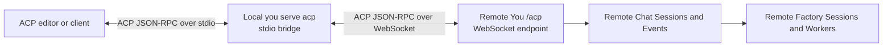
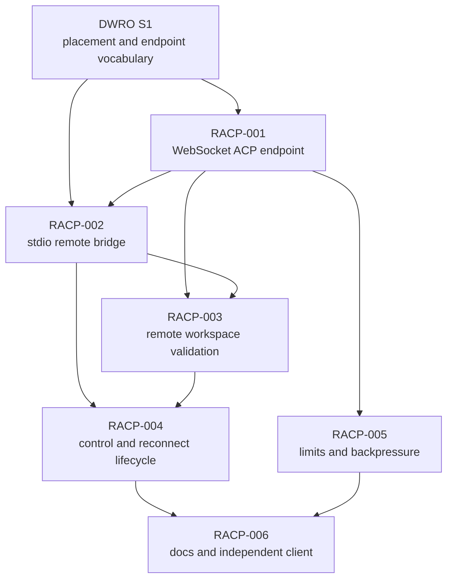

# Remote ACP Operations Implementation Plan

## Status

Proposed.

## Problem statement

Customers can run supported unary You CLI operations against a selected server,
but an ACP editor can only launch You as a local stdio child process, so it
cannot use the Factories, Chat Sessions, Events, and Factory Sessions owned by a
remote You server.

## Customer ask

Allow an existing ACP client that launches `you serve acp` over stdio to use a
remote You server while preserving the same ACP session, streaming, control,
and Factory behavior as local operation.

The customer-facing command is:

```text
you --remote --server <uri> serve acp
```

The local `you` process remains the stdio child expected by the ACP client. It
bridges that connection to the selected remote server. The remote server owns
the ACP connection's Chat Sessions, Events, Factory Sessions, Factory catalog,
worker execution, and lifecycle state.

## Solution

Add a WebSocket ACP endpoint to the existing You server and make remote
`you serve acp` a thin, full-duplex stdio-to-WebSocket bridge. Extract the
existing ACP request dispatch and connection lifecycle from newline-specific
stdio framing so the local stdio adapter and remote WebSocket adapter execute
one protocol implementation over the same service contracts.

The bridge forwards ACP JSON-RPC messages to exactly the selected endpoint. It
does not build a second Chat Sessions or Factory execution graph, translate ACP
into a collection of REST operations, retry non-idempotent messages, substitute
another endpoint, or fall back to local execution.

The first release assumes an operator-secured network boundary and a workspace
that is visible at the same absolute path on the remote host. Authentication,
secret handling, arbitrary local-to-remote path mapping, file synchronization,
and horizontally durable Chat Sessions are separate follow-ons.

## Original documents

- `C:\Users\andre\work\portos\infinite-you\docs\internal\projects\acp-client\final-proposal.md`
- `C:\Users\andre\work\portos\infinite-you\docs\internal\projects\acp-program\README.md`
- `C:\Users\andre\work\portos\infinite-you\docs\reference\serve-acp.md`
- `C:\Users\andre\work\portos\infinite-you\docs\internal\standards\code\planning-standards.md`
- Git ref `dwro-s1-remote-placement-flags:prd.json`, which supplies the
  prerequisite root `--remote`, endpoint-only `--server`, command placement,
  and no-fallback behavior.
- ACP active RFD: `https://agentclientprotocol.com/rfds/streamable-http-websocket-transport`

## Intended outcome

An operator runs a long-lived You server behind a trusted tunnel or an
operator-managed secured reverse proxy. An ACP editor continues to launch a
local child process, but configures it as:

```json
{
  "command": "/absolute/path/to/you",
  "args": [
    "--remote",
    "--server",
    "https://you.example.test",
    "serve",
    "acp"
  ]
}
```

The local process connects to `wss://you.example.test/acp`, preserves ACP
messages in both directions, and keeps stdout reserved for newline-delimited
ACP JSON-RPC. Factory discovery, target selection, prompt execution, response
streaming, control, and in-process reconnect behavior come from the remote
server.



## Decisions

### D1 — The remote server owns ACP state

The local bridge owns only its stdio and WebSocket connection resources. The
remote process owns connection identity, Chat Sessions, target episodes, turns,
attachments, Events topics, Factory Sessions, Factory target resolution, and
provider execution.

The bridge must not construct or invoke the local `acp.Server` after remote
placement has been selected. This preserves one canonical state owner and makes
remote target enumeration use the server's installed Factories and Operator
Settings rather than the local machine's home.

### D2 — WebSocket is the first remote transport

The first release implements the WebSocket profile at `/acp`. It does not
implement the Streamable HTTP POST/GET/DELETE profile. The ACP remote transport
RFD permits a server to support only WebSocket, while clients that implement
remote ACP are expected to support it.

Because the RFD is active rather than completed, implementation must pin the
reviewed RFD revision or date in the transport contract and retain committed
conformance fixtures. Customer documentation describes this remote transport
as preview until the upstream profile stabilizes.

### D3 — One ACP connection engine, two framing adapters

ACP negotiation, envelope validation, request identity, session methods,
prompt dispatch, notifications, control, response correlation, attachment
cleanup, and safe error mapping have one implementation under
`pkg/transports/acp`.

Stdio owns complete newline-delimited frames. WebSocket owns complete text
frames. Neither adapter reimplements ACP method dispatch or imports service
internals. Concurrent writes are serialized by the connection adapter so one
response or notification is one complete protocol frame.

### D4 — Remote placement never falls back

When `--remote` is selected, endpoint parsing, network connection, WebSocket
upgrade, protocol negotiation, remote shutdown, and transport failures remain
remote failures. The command does not invoke the local ACP server, start an HTTP
listener, select the default endpoint, or retry through local services.

The bridge does not automatically resend an in-flight `session/prompt`,
control, or other non-idempotent ACP message after disconnect. A customer or
client may open a new connection and use supported load or resume behavior.

### D5 — Workspace paths are shared-path-only in the first release

The bridge forwards `cwd` and `additionalDirectories` unchanged. The remote
server interprets them as absolute paths on the remote host. Session admission
rejects a path that is unavailable or unusable on the remote host before
Factory or provider execution begins.

The product does not silently substitute the server home, process working
directory, Factory directory, or another workspace. Cross-platform prefix
mapping, repository cloning, file synchronization, and remote workspace leases
are out of scope for this plan.

### D6 — Session durability remains process-scoped

Chat Sessions and Events remain in-memory and process-scoped. A network
disconnect may be followed by `session/load` or `session/resume` only while the
same server process retains that session. The first deployment model is one
server process or operator-provided sticky routing. Cross-process failover and
external session storage are not introduced.

### D7 — Secrets and authentication are out of scope

This plan does not add bearer tokens, secret references, ACP login/logout,
mTLS, credential rotation, multi-tenant authorization, or authentication
middleware.

The You listener remains loopback-oriented. Remote access is documented for a
trusted network, VPN, SSH tunnel, or operator-managed TLS/authenticating reverse
proxy. The product must not describe the unauthenticated endpoint as safe for
direct public-internet exposure. Non-loopback endpoint URIs use `wss`; plain
`ws` is accepted only for loopback and deterministic tests.

## Scope

### In scope

- WebSocket ACP upgrade at the transport-owned `/acp` route.
- A framing-neutral ACP connection engine shared by stdio and WebSocket.
- Remote placement for `you serve acp` through the authored CLI manifest.
- A local stdio-to-WebSocket bridge using the exact selected `--server` URI.
- Full-duplex forwarding of requests, responses, notifications, and
  server-originated requests.
- Exact no-fallback placement and transport diagnostics.
- Same-path remote workspace validation.
- Explicit disconnect, close, cancellation, load, and resume behavior.
- Bounded frame size, output buffering, backpressure, and cleanup behavior.
- ACP transport conformance fixtures and stdio/WebSocket parity evidence.
- Focused functional, race, repeat, real-client, help, and documentation proof.

### Out of scope

- Authentication, authorization, secrets, bearer tokens, ACP auth methods, and
  credential storage.
- Direct wildcard binding or a new public server deployment system.
- Streamable HTTP ACP.
- ACP protocol v2 migration.
- Durable Chat Sessions or Events storage.
- Cross-process session failover without sticky routing.
- Automatic reconnect or replay of in-flight ACP messages.
- Local-to-remote workspace prefix mapping, Git cloning, file synchronization,
  remote workspaces, or workspace leases.
- New Factory, Worker, Provider, or event vocabularies.
- Translating ACP into one-shot `you run` or ordinary REST client calls.
- Opportunistic cleanup outside the ACP and server-composition paths needed by
  the observable behavior.

## Canonical ownership

| Concern | Owner | Required boundary |
| --- | --- | --- |
| ACP negotiation, envelopes, connection dispatch, projections, and framing contracts | `pkg/transports/acp` | Protocol behavior remains transport-owned and service-neutral. |
| WebSocket upgrade and frame transport | `pkg/transports/acp` mounted by HTTP composition | The generated REST server does not own ACP policy. |
| CLI placement and stdio bridge selection | `pkg/transports/cli` | Normalize placement once and select either local ACP serving or the injected remote bridge. |
| Chat Session, target episode, turn, attachment, and control state | `pkg/services/chat_sessions` | The remote server's service is canonical. |
| Source-native ordered delivery | `pkg/services/events` | Remains in-memory and process-scoped. |
| Factory execution and controls | `pkg/services/factory_sessions` and `pkg/services/factory_runtime` | The ACP transport consumes existing public capabilities. |
| Factory target discovery | `pkg/services/factory_definitions` through Chat Sessions catalog contracts | Remote installed Factories are authoritative. |
| Production construction | `pkg/wire` | One inert graph; no command-local or connection-local injection pass. |
| Activation and shutdown | `pkg/initializer` | Listener, bridge, connections, and runtime roles are joined through existing lifecycle ownership. |

## Changes

### Package changes

- `pkg/transports/acp`
  - Introduce an internal connection abstraction that reads and writes complete
    JSON-RPC messages independently of newline or WebSocket framing.
  - Move shared dispatch, request correlation, prompt concurrency, attachment
    cleanup, and connection terminalization behind that abstraction.
  - Keep stdio as an adapter with the current newline and partial-frame
    behavior.
  - Add a WebSocket server adapter and a WebSocket client/bridge adapter.
  - Add endpoint resolution, frame-limit, close-classification, and
    conformance-fixture coverage.
- `pkg/transports/http`
  - Mount the injected ACP WebSocket handler at `/acp` before the generated
    not-found path.
  - Keep REST adapters and generated OpenAPI handlers unchanged unless review
    identifies a required route-description artifact.
- `pkg/transports/cli`
  - Stop suppressing `--remote` and `--server` for `you serve acp` once the
    remote bridge exists; continue suppressing unrelated `--json`.
  - Resolve local versus remote ACP behavior from the authored placement
    contract before I/O.
  - Preserve protocol-only stdout and sanitized stderr outcomes.
- `pkg/wire`
  - Construct the shared ACP connection engine, stdio server, WebSocket
    handler, and remote bridge client from explicit collaborators.
  - Inject the same remote ACP handler into the server route and the same local
    ACP server into local stdio operation.
- `pkg/initializer`
  - Reuse existing lifecycle roles where possible; add only the narrow opening
    or joining capability required to ensure WebSocket connections and bridge
    resources terminate with the selected command/server.
- `contracts/cli` and generated CLI artifacts
  - Change `you.serve.acp` placement from `local-only` to `dual`.
  - Project persistent `--remote` and `--server` into help and command metadata.
  - Declare network side effects for remote mode and stable remote transport
    errors.
- `docs/reference/serve-acp.md`
  - Add remote client configuration, trusted-boundary requirements, endpoint
    resolution, workspace constraints, reconnect limits, diagnostics, and
    troubleshooting.
- Architecture documentation
  - Reconcile ACP transport ownership and remote connection flow without
    changing Chat Sessions, Events, or Factory resource vocabulary.

### Contracts

#### CLI contract

```text
you serve acp
```

Serves the locally composed ACP authority over stdio exactly as today.

```text
you --remote --server <uri> serve acp
```

Serves stdio toward the caller and bridges to the selected remote ACP endpoint.

Rules:

- `--remote` may appear wherever persistent root flags are accepted.
- `--server` is the exact remote You base URI; `/acp` is joined to its existing
  base path by one tested resolver.
- `https` resolves to `wss`; loopback `http` may resolve to `ws`.
- URI userinfo, fragments, malformed schemes, missing authority, and
  non-loopback plaintext endpoints are rejected before stdin is consumed.
- Remote placement never starts a local listener or local ACP authority.
- `--json` remains unsupported because stdout is already the ACP protocol
  stream.

#### WebSocket endpoint contract

- Route: `GET /acp` with WebSocket upgrade.
- One WebSocket text frame contains one complete ACP JSON-RPC message.
- The first client message must be `initialize`.
- Text frames are accepted up to the named maximum frame size.
- Binary, fragmented-over-limit, malformed, or unsupported messages receive a
  bounded protocol or connection outcome without downstream side effects.
- The server mints connection identity and preserves JSON-RPC request IDs.
- Writes from prompt streaming, request responses, notifications, and future
  server-originated requests are serialized into complete frames.
- Connection close detaches connection-owned attachments and joins
  connection-owned work without deleting retained process-scoped Chat Session
  state.

#### Workspace contract

- `cwd` and every `additionalDirectories` entry remain required absolute paths.
- Paths are evaluated on the remote host without rewriting.
- An unavailable or unusable path fails session new/load/resume before Factory
  or provider side effects.
- Factory-pinned-root mismatch remains a typed admission failure.
- Documentation states that local and remote hosts must share the relevant
  paths for this release.

#### Failure contract

Stable failure families must distinguish at least:

- invalid remote endpoint;
- insecure non-loopback endpoint;
- connection refused or endpoint unreachable;
- WebSocket upgrade rejected;
- remote connection closed;
- remote workspace unavailable;
- unsupported remote frame;
- remote output/backpressure limit reached; and
- ordinary ACP protocol rejection returned by the remote agent.

Diagnostics may identify the sanitized endpoint authority and failure family.
They must not echo ACP frames, prompts, provider commands, unsafe paths, URI
userinfo, cookies, or response bodies.

### Services

No product service is introduced. Chat Sessions, Events, Factory Sessions,
Factory Runtime, Factory Definitions, Workers, Providers, and Operator Settings
retain their existing responsibilities.

The only new operational capabilities are transport adapters:

- an ACP connection engine shared by local and remote serving;
- a WebSocket agent-side connection adapter; and
- a WebSocket client-side bridge selected by CLI placement.

These capabilities are constructed once in `pkg/wire` and receive explicit
dependencies. They are not service locators, dependency bags, secondary
injectors, or alternate domain APIs.

### API changes

The You HTTP host gains the transport-owned `/acp` WebSocket upgrade route.
This route carries the upstream ACP JSON-RPC schema rather than a new You REST
resource. The WebSocket-only first slice does not add a parallel OpenAPI model
for Chat Sessions or duplicate ACP message schemas in You's public REST
components.

If implementation review determines that the route must appear in a generated
public API description, author the source contract under `api/openapi-main.yaml`
and components first, regenerate all required outputs, and include
`make generate-api` plus `make api-smoke`. Generated files must never be edited
directly.

## Work stories

### RACP-001 — Serve the canonical ACP lifecycle over WebSocket

As an operator, I want the running You server to accept ACP WebSocket
connections so remote clients use the same Factories and session authority as
the server.

Acceptance criteria:

- A WebSocket client can complete `initialize`, `session/new`, target
  selection, one streamed `session/prompt`, and terminal response through
  `/acp`.
- Equivalent stdio and WebSocket transcripts produce the same normalized ACP
  capabilities, target options, session behavior, updates, stop reason, and
  error outcomes; only transport connection metadata may differ.
- Target enumeration and Factory execution come from the remote process's
  canonical Factory Definitions, Chat Sessions, Events, and Factory Sessions
  instances.
- A connection constructs no service, runtime graph, or alternate state store.
- A missing or malformed initialize message, unsupported protocol version,
  invalid frame, or failed upgrade creates no Chat Session or Factory side
  effect.
- Connection close detaches connection-owned attachments and returns only after
  connection-owned goroutines and writes have stopped.
- Focused package, composition, and functional tests prove the WebSocket path
  without weakening existing stdio behavior.

### RACP-002 — Bridge a stdio ACP client to exactly one remote server

As an ACP editor user, I want my existing child-process configuration to target
a remote You server without changing editors or risking silent local execution.

Acceptance criteria:

- `you --remote --server <uri> serve acp` connects to exactly the resolved
  `<uri>/acp` WebSocket endpoint and begins forwarding complete ACP messages in
  both directions.
- The authored CLI manifest declares `you.serve.acp` as dual placement, exposes
  inherited `--remote` and `--server`, retains protocol-only stdout, and
  documents the remote invocation.
- The remote target list and session IDs observed by the client are the values
  returned by the remote server; local installed Factories and local Chat
  Sessions are not consulted.
- Invalid endpoint configuration, connection refusal, timeout, failed upgrade,
  or mid-connection remote failure never calls the local ACP server, starts a
  listener, or selects a different endpoint.
- Clean stdin EOF closes the remote connection and exits successfully after
  joined cleanup; context cancellation produces the documented cancellation
  outcome.
- Diagnostics are bounded and stderr-only, and stdout contains only complete
  ACP protocol frames.
- Direct CLI tests and one process-boundary functional test prove exact endpoint
  selection, no fallback, stdio fidelity, EOF, cancellation, and exit status.

### RACP-003 — Reject an unavailable remote workspace before execution

As a remote ACP user, I want the server to use the intended shared workspace or
fail clearly so work never runs in an unrelated directory.

Acceptance criteria:

- `session/new`, `session/load`, and `session/resume` evaluate the supplied
  `cwd` and `additionalDirectories` on the remote host without bridge-side
  rewriting.
- A valid shared absolute path becomes the Factory Session working root and is
  observable at the provider-command edge.
- A missing, inaccessible, non-directory, relative, or otherwise unusable path
  returns a typed remote workspace failure before Factory or provider
  execution.
- The server never substitutes its home, process working directory, Factory
  directory, or another session's workspace.
- An authored Factory root that conflicts with the requested workspace retains
  the existing typed mismatch outcome.
- Functional tests use temporary shared paths and public/provider-edge
  observations; they do not inspect internal runtime state.

### RACP-004 — Preserve control and session behavior across network lifecycle

As an ACP user, I want cancel, close, load, and resume to target the intended
remote session even when the transport disconnects or requests overlap.

Acceptance criteria:

- A cancel notification sent while `session/prompt` is in flight reaches the
  captured remote turn and produces an observable cancellation effect at the
  provider-command edge.
- The canceled request's control intent cannot affect a subsequently admitted
  turn.
- Two sessions on one connection and two connections reusing the same JSON-RPC
  IDs remain isolated by remote connection and session identity.
- A mid-prompt disconnect returns a bounded failure and never automatically
  resends the prompt or creates a second Factory/provider invocation.
- A new connection can load or resume a retained session while the same server
  process owns it; another process reports the session as unknown rather than
  fabricating or importing state.
- Session close, bridge cancellation, and server shutdown stop admitting new
  work and join connection-owned resources.
- Race and repeated functional coverage proves prompt/cancel, disconnect,
  reconnect, close, and multi-session isolation.

### RACP-005 — Bound remote ACP traffic and slow consumers

As an operator, I want remote ACP connections to have deterministic resource
limits so one malformed or slow client cannot stall Factory execution or grow
memory without bound.

Acceptance criteria:

- The transport defines named limits for inbound frame bytes, outbound queued
  messages, and connection shutdown time; no unexplained inline limits are
  introduced.
- Concurrent responses and notifications are written as complete, untorn
  frames with correct JSON-RPC correlation.
- Binary frames, oversized text frames, malformed frames, and queue overflow
  produce bounded outcomes without creating additional domain side effects.
- A slow or stopped client cannot block canonical Factory execution or Events
  publication indefinitely.
- Repeated connect/disconnect and slow-consumer scenarios leave no leaked
  goroutines, attachments, listeners, or provider processes.
- Package stress tests and focused `-race`/repeat functional evidence cover the
  relevant concurrency and backpressure paths without arbitrary sleeps.

### RACP-006 — Publish and independently prove the remote ACP workflow

As a customer, I want complete setup and troubleshooting guidance plus
independent-client proof so I can configure remote ACP without relying on
repository internals.

Acceptance criteria:

- `you docs serve-acp`, executable help, and examples document local and remote
  command forms, `/acp` resolution, trusted-boundary requirements, WSS versus
  loopback WS, shared-path workspaces, no-fallback failures, process-scoped
  reconnect behavior, and current non-goals.
- Documentation clearly states that You does not add authentication or secret
  handling in this release and that direct public exposure is unsupported.
- A pinned independent ACP client completes initialize, session creation,
  remote Factory selection, one streamed prompt, one terminal response, and
  session close through local stdio bridge -> remote WebSocket server.
- The independent scenario observes exactly one deterministic provider-command
  invocation and complete process-tree cleanup.
- Retained CI evidence contains only revision, client/protocol versions,
  connection/session identifiers, target identity, bounded counts, cleanup,
  and terminal outcomes; it contains no prompt, response, frame, provider
  argument, environment value, or host path.
- Documentation smoke, CLI help baselines, conformance fixtures, and required
  real-client CI pass.

## Dependency-aware sequencing



RACP-001 establishes protocol parity and the server endpoint before the CLI
claims remote support. RACP-002 makes the endpoint usable by existing stdio
clients. Workspace behavior then becomes explicit before broader lifecycle and
real-client claims. Resource hardening can proceed after the connection
contract exists, and the final customer documentation and independent proof
consume all preceding behavior.

## Tests

### Construction rules

- Functional application tests construct through `root.BuildProcess` and call
  `Process.Execute` by default.
- A built `you` binary is used only for the final OS-level child-process,
  stdio, signal, exit-code, and process-tree interoperability proof.
- Ordinary customer flows enter through CLI. Direct WebSocket entry is used
  only for the ACP transport-owned endpoint contract and explicit
  stdio/WebSocket parity cells.
- External effects are replaced only through `edges.Edges`, using
  `ProviderCommandRunner` and sanitized provider-shaped fixtures.
- Tests do not use `MockWorkers` outside the workers/mock feature area.
- Synchronization uses listener readiness, successful WebSocket upgrade,
  controlled provider-edge signals, committed Events records, or explicit
  terminal lifecycle outcomes. Arbitrary sleeps and timeout-padded polling are
  prohibited.
- Transport concurrency, cancel, disconnect, and backpressure paths run under
  `-race` and repeat modes.

### Functional matrix

| ID | Path | Observable scenario | Required evidence |
| --- | --- | --- | --- |
| RACP-FT-001 | `transport/acp_remote` | WebSocket initialize | `/acp` upgrades; implemented capabilities match stdio; no domain side effect before valid initialize. |
| RACP-FT-002 | `factory/acp_projection` | Remote Factory prompt | Remote target selected; streamed update and terminal response observed; exactly one provider invocation. |
| RACP-FT-003 | `sessions/chat_remote` | Remote authority | Remote Factory catalog/profile wins over deliberately different local catalog/profile. |
| RACP-FT-004 | `transport/acp_remote` | Stdio bridge happy path | Protocol-only stdin/stdout bridge completes initialize, new, prompt, and close. |
| RACP-FT-005 | `transport/acp_remote` | Exact endpoint and no fallback | Selected test server receives the upgrade; default/local server and local ACP service observe zero calls. |
| RACP-FT-006 | `transport/acp_remote` | Remote endpoint failures | Invalid URI, refusal, timeout, and rejected upgrade produce stable diagnostics and zero local fallback. |
| RACP-FT-007 | `sessions/chat_remote` | Cancel during prompt | Cancel reaches the provider edge while prompt is blocked; captured turn cancels; later turn is unaffected. |
| RACP-FT-008 | `sessions/chat_remote` | Multi-session isolation | Two remote sessions stream isolated updates over one connection. |
| RACP-FT-009 | `transport/acp_remote` | Connection identity isolation | Independent connections reuse JSON-RPC IDs without response or control collision. |
| RACP-FT-010 | `transport/acp_remote` | Mid-prompt disconnect | One visible failure, no automatic resend, no duplicate Factory/provider invocation, joined cleanup. |
| RACP-FT-011 | `sessions/chat_remote` | Load/resume same process | New connection loads/resumes retained session with stable session/item identity where supported. |
| RACP-FT-012 | `sessions/chat_remote` | Load on different process | Explicit unknown-session failure; no fabricated or imported history. |
| RACP-FT-013 | `sessions/chat_remote` | Shared workspace | Exact remote `cwd` reaches provider edge and produced effects stay under that path. |
| RACP-FT-014 | `sessions/chat_remote` | Unavailable workspace | Admission fails before Factory/provider execution with no fallback directory. |
| RACP-FT-015 | `transport/acp_remote` | Clean EOF and cancellation | EOF closes cleanly; context cancellation closes both streams and preserves documented exit classification. |
| RACP-FT-016 | `transport/acp_remote` | Slow consumer | Factory/provider completion is not indefinitely blocked; bounded connection outcome and cleanup observed. |
| RACP-FT-017 | `transport/acp_remote` | Oversized/binary frame | Bounded rejection, zero session/Factory side effects, connection remains or closes according to declared contract. |
| RACP-FT-018 | `transport/acp_remote` | Server shutdown | Listener, connections, attachments, runtime, and provider process are joined before command return. |
| RACP-FT-019 | `transport/acp_remote/realclient` | Pinned independent client | Client -> stdio bridge -> remote WebSocket -> provider edge succeeds once and retains sanitized evidence. |

### Package and contract evidence

- Pure endpoint-resolution tests cover base paths, `/acp` joining, `http`/`https`
  conversion, loopback plaintext policy, userinfo, fragments, malformed URLs,
  and safe authority diagnostics.
- Shared connection-engine tests run one committed ACP corpus through stdio and
  WebSocket frame harnesses and compare normalized results.
- Existing stdio framing, prompt concurrency, cancel, close, load, resume,
  attachment, response-bridge, and wire-recorder tests remain passing.
- CLI manifest/schema tests prove placement vocabulary, inherited flags,
  relationships, help, channels, side effects, and generated-artifact parity.
- HTTP composition tests prove `/acp` is mounted before generated not-found
  routing and does not disturb REST/dashboard routes.
- Wire tests prove local and remote ACP transports receive the canonical service
  singletons.
- Frame, writer, queue, disconnect, and shutdown tests prove bounded resource
  behavior directly before functional coverage.

### Quality gates

The implementation plan must run the narrowest relevant gates first and then
the shared verification tiers:

```text
go test ./pkg/transports/acp/... ./pkg/transports/cli/... ./pkg/transports/http/... ./pkg/wire/... -count=1
go test -race ./pkg/transports/acp/... -count=1
go test ./tests/functional/transport/acp_remote/... -count=1
go test ./tests/functional/sessions/chat_remote/... -count=1
go test ./tests/functional/factory/acp_projection/... -count=1
make contracts-validate
make cli-manifest-check
make docs-reference-smoke
make verify-fast
make verify-pr
```

If the authored OpenAPI contract changes, also run:

```text
make generate-api
make api-smoke
```

Generated CLI or API artifacts must be refreshed from their authored sources
and checked for drift. The change must add no new `backend-size`,
`pkg-file-count`, `pkg-boundary`, or `pkg-structure` finding in affected
packages.

## Project acceptance criteria

- An existing stdio-only ACP client can configure one local
  `you --remote --server <uri> serve acp` child process and complete the
  supported ACP lifecycle against a remote You server.
- The remote process is the sole authority for target discovery, Chat Sessions,
  Events, Factory Sessions, controls, and provider execution.
- Local and remote ACP produce contract-equivalent supported protocol behavior.
- Remote placement uses exactly the selected endpoint and never falls back to
  local execution or another endpoint.
- Requests, responses, notifications, streaming updates, and cancel flow in
  both directions without torn frames or identity collision.
- Workspace paths are interpreted on the remote host exactly as supplied, and
  unavailable paths fail before execution without directory substitution.
- Disconnect never silently replays a non-idempotent message or duplicates a
  Factory/provider invocation.
- Slow consumers, oversized frames, malformed frames, shutdown, and repeated
  reconnects have bounded, leak-free outcomes.
- Help and reference documentation state the trusted-boundary, shared-path,
  WebSocket-preview, process-scoped-session, and no-authentication limitations.
- Focused unit, package integration, functional, race/repeat, and independent
  real-client evidence pass, along with the relevant generated-contract,
  documentation, lint, and PR verification gates.
- The implementation/review loop continues until required CI is terminal and
  passing, every blocking PR conversation is explicitly addressed, merge
  conflicts and shared/generated-file churn are resolved against current
  `main`, and the PR is actually merged. Opening a PR, obtaining approval, or
  reaching green CI without merge is not completion.

## Follow-ons

These are deliberately not hidden inside the first remote ACP delivery:

- authenticated endpoint profiles and secret references;
- standardized ACP authentication when the selected protocol version supports
  the required customer flow;
- Streamable HTTP ACP and upstream RFD stabilization reconciliation;
- explicit local-to-remote workspace mapping;
- server-managed checkout/workspace leases and file synchronization;
- durable Chat Session storage, multi-process routing, and failover; and
- resumable remote message streams with defined replay identifiers.
