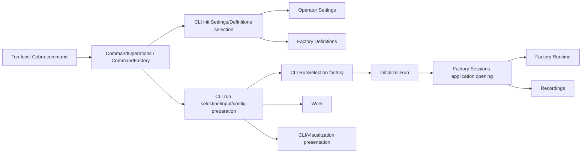
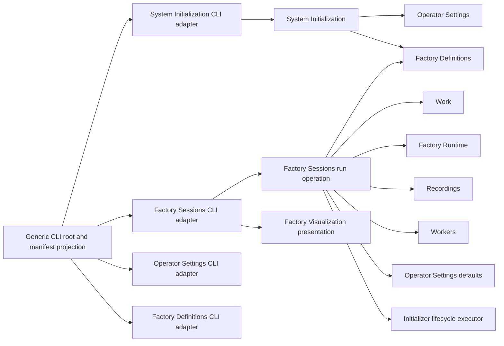
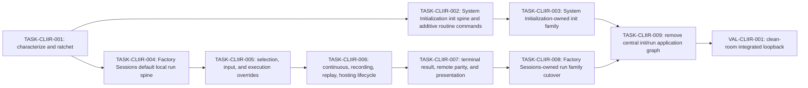

# Service-owned `you init` and `you run` plan

## 1. Problem and desired outcome

### Problem statement

Customers depend on `you init` and `you run`, but maintainers cannot change or
reuse those behaviors safely because their command execution is split across a
large top-level CLI operation graph instead of the System Initialization and
Factory Sessions services that own the underlying workflows.

### Current behavior and gap

The public CLI currently constructs one fresh Cobra tree per
`Process.Execute`, which is correct, but its top-level `CommandOperations` and
`CommandFactory` aggregate product services, individual domain operations,
runtime builders, filesystem and process effects, HTTP clients, completion
providers, and presentation behavior. `root.go`, `root_factory.go`,
`root_work.go`, and `pkg/transports/cli/run` then resolve Factory selection,
operator defaults, invocation input, recording policy, runtime opening,
hosting, completion, and result presentation.

`you init` is similarly assembled as part of a combined
Factory/config/init family. Its current modes configure provider/model
defaults through Operator Settings or install a packaged Factory through
Factory Definitions, while the committed architecture assigns the
customer-invoked cross-owner initialization workflow, ordering, idempotency,
partial failure, and rollback reporting to System Initialization.

The repository is already partway toward the intended shape:

- System Initialization publishes an idempotent `Initialize` root operation
  and a service-owned CLI adapter, but its public request currently carries
  only `HomeDir` and the production command does not exclusively use it for all
  initialization intent.
- Factory Sessions owns session identity, placement, runtime opening,
  invocation coordination, response streams, durable execution, recovery, and
  a Sessions-internal application-opening implementation. The remaining CLI
  run path still performs substantial preparation, runtime selection,
  completion inference, and presentation above that boundary.
- Initializer already accepts an inert run selection and activates the returned
  application. That lifecycle role is appropriate, but product selection and
  run semantics must not migrate into Initializer.
- Service-owned CLI packages exist for System Initialization, Factory
  Definitions, Operator Settings, Factory Sessions, Work, Models, Providers,
  Worker Sessions, Factory Visualization, and Costs, while central
  `climanifestcobra` and `commandregistry` packages still construct and bind
  owner-specific command families.

As of 2026-08-25, `pkg/transports/cli/run` contains 9 production files with
approximately 5,315 lines and 21 test files with approximately 9,343 lines.
Seven additional root-run test files contain approximately 3,361 lines. The
checked-in CLI command-tree, root help, run help, and run-flag baselines protect
important surface shape, but much of the behavioral coverage is coupled to the
legacy transport implementation rather than proving the same behavior through
one owner service operation. A focused test run observed
`pkg/transports/cli`, `climanifestcobra`, and `commandregistry` passing; the
broader CLI baseline package was blocked in the current dirty worktree by an
unrelated missing `projections.ProjectActiveThrottlePauses` symbol. The
implementation lane must establish a clean baseline on its own starting head
before citing characterization evidence.

### Desired outcome and success measures

Customers retain the documented `you init` and `you run` journeys while both
commands become thin adapters over reusable owner operations:

- `you init` calls exactly one System Initialization operation. System
  Initialization coordinates initial Operator Settings and packaged Factory
  outcomes without owning either peer store.
- Routine post-initialization changes are available through additive,
  owner-specific `you config defaults set` and `you factory install` commands.
  Existing `you init --provider`, `--model`, and `--package` forms remain
  compatible initialization inputs.
- `you run` calls one Factory Sessions run operation that owns preparation,
  session opening, lifecycle coordination, response streams, invocation
  completion, and terminal outcome. It commands peer roots through direct
  injection.
- Initializer remains the only lifecycle executor for already-prepared roles;
  it does not select Factories, prepare Work, choose recording policy, or infer
  results.
- Factory Visualization owns progress and terminal presentation, while the
  Factory Sessions CLI adapter owns Cobra syntax, stream selection, output
  mode, and CLI error/exit mapping.
- The top-level CLI retains only the root shell, global flags, generic
  manifest-to-Cobra projection, owner-family attachment, observation, and
  process execution.
- `CommandOperations`, `commandregistry`, and owner-specific
  `climanifestcobra` paths no longer contain init or run product behavior.

Completion is measurable when:

- an inventory reports no init/run domain operation or runtime builder in
  `pkg/transports/cli.CommandOperations` or `CommandFactory`;
- production top-level CLI code does not import product roots to implement
  `you init` or `you run`;
- `you init` reaches `system_initialization.Service.Initialize` once per
  invocation and `you run` reaches one Factory Sessions-owned run operation;
- the command-tree, help, completion, stdout/stderr, JSON/NDJSON, exit, local,
  remote, recording, replay, hosting, timeout, cancellation, and rollback
  witnesses named in this plan pass through `root.BuildProcess` and
  `Process.Execute`;
- `make cli-manifest-check`, `make cli-contract-smoke`, `make pkg-boundary`,
  `make pkg-structure`, `make pkg-file-count`, `make verify-fast`, and the
  affected functional/race suites pass on their owning task heads; and
- the integrated clean-room validation loopback reports PASS or returns an
  evidence-backed delta-plan request.

## 2. Scope and constraints

### In scope

- `you init` request, result, failure, CLI, documentation, and Wire composition
  needed to make System Initialization its singular workflow owner.
- Additive routine commands for Operator Settings defaults and packaged Factory
  installation.
- The complete local and remote `you run` behavior, including Factory
  selection, invocation input, Work input, execution overrides, runtime mode,
  recording/replay, hosting, response streams, terminal results, cancellation,
  and presentation.
- Factory Sessions root/internal operations needed to absorb run coordination
  without absorbing peer stores or policies.
- The neutral Initializer lifecycle interface needed for Factory Sessions to
  activate and unwind a prepared run without constructing a second graph.
- Service-owned CLI family construction for `init`, `config defaults`,
  `factory install`, and `run`.
- Generated CLI contract artifacts, packaged reference documentation,
  command-tree/help fixtures, Wire generation, boundary enforcement, and
  functional coverage required by these changes.
- Deletion of the init/run slices of central `CommandOperations`,
  `commandregistry`, `climanifestcobra`, `runconfig`, and root command glue once
  callers have migrated.

### Non-goals

- Redesigning unrelated CLI families or deleting all of `commandregistry` and
  `climanifestcobra` in this lane.
- Renaming public Factory, Factory Session, Work, Worker Session, Provider, or
  Model resources.
- Changing Factory orchestration, scheduling, worker retry, provider execution,
  model readiness, recording formats, or Work admission semantics.
- Changing public HTTP or MCP schemas unless implementation proves an existing
  parity defect that requires a separately approved delta plan.
- Removing existing `you init --provider`, `--model`, or `--package` inputs.
- Removing existing `you run` flags or changing their meanings as part of the
  ownership migration.
- Introducing a new `run`, `application`, or command service beside Factory
  Sessions.
- Moving Cobra or terminal presentation into a product service root or its
  internal domain implementation.
- Broad cleanup of unrelated user changes in the current worktree.

### Assumptions and constraints

- System Initialization remains stateless across requests and coordinates
  Operator Settings and Factory Definitions through their public roots.
- Factory Sessions remains the sole run/session authority and commands Factory
  Definitions, Work, Factory Runtime, Recordings, Workers, Providers, Models,
  and Operator Settings only through already-injected public contracts.
- Initializer activates and unwinds roles already constructed by Wire and
  planned/opened by Factory Sessions. It does not become a product service.
- Wire constructs each owner service, CLI adapter, lifecycle executor, and
  generic CLI aggregate once. Request values do not carry dependencies.
- The Factory Sessions run request contains only caller intent and immutable
  values. It must not contain services, stores, loggers, clocks, writers,
  filesystem implementations, runtime builders, or constructor callbacks.
- Factory response events and terminal results remain Sessions-owned;
  canonical Factory history remains Recordings-owned; visualization output is
  a projection rather than canonical state.
- Existing CLI compatibility is preserved unless an acceptance criterion in
  this plan explicitly marks an additive command.
- Generated CLI files are updated through `make cli-manifest-generate`; Wire is
  updated through `make generate-wire`. Generated artifacts are not hand
  edited.
- Functional application tests use `root.BuildProcess` and `Process.Execute`;
  external effects are replaced only through `edges.Edges`.
- Existing uncommitted user changes are preserved and overlapping edits are
  reconciled narrowly.

### Open questions

1. Whether the public Factory Sessions run contract should expose a
   request-scoped `RunHandle` with subscribe/execute/result methods or a
   synchronous `Run` method plus the existing response-stream subscription.
   TASK-CLIIR-004 must choose the smallest contract that prevents IO and
   presentation callbacks from entering domain requests.
2. Whether `you config defaults set` should use the exact noun `defaults` or a
   broader future-facing `operator-settings` spelling. This plan recommends
   `config defaults set` because `you config` already exists as a routing
   command, but contract review may select a clearer canonical spelling before
   TASK-CLIIR-002 changes `contracts/cli/commands.json`.
3. Whether a local `you run --remote` invocation can call the same public
   Factory Sessions operation through the generated HTTP client without an
   HTTP contract addition. If not, the lane must pause for an explicit API
   compatibility decision rather than retain CLI-owned durable polling.
4. Whether the existing Factory Sessions-to-Initializer dependency should be
   narrowed behind a neutral lifecycle-executor interface in `pkg/initializer`
   or adapted entirely in Wire. Either choice must preserve Initializer as the
   activation authority and avoid a cyclic application graph.

### Replanning triggers

- Characterization finds conflicting documented and actual behavior for an
  init or run mode.
- The additive command names conflict with the separately planned CLI command
  shape standardization program.
- A required remote run operation is absent from the public HTTP contract.
- Factory Sessions cannot own a run behavior without importing a peer
  implementation or taking ownership of a peer store.
- The run request requires an IO writer, presentation callback, service bag,
  or secondary constructor to reproduce existing behavior.
- Migration changes canonical recording bytes, Factory Event ordering,
  response-stream ordering, Work admission, or terminal-result semantics.
- A task must change more than one independent customer behavior or cannot
  leave `main` releasable without a later repair.
- Focused baseline tests do not compile on the implementation task's clean
  starting head.

Estimated work is nine implementation tasks plus one independent validation
deployment. Replanning is likely if remote run parity requires an OpenAPI
addition, if the command-shape plan selects different canonical commands, or if
response-stream presentation cannot be separated from current CLI execution
without a new owner contract.

## 3. Recommended approach

Use a strangler migration with two parent behavior lanes and one shared CLI
composition lane: characterize first, establish a System Initialization spine
for `init`, establish a Factory Sessions spine for the simplest local `run`,
extend each spine through the existing behavior matrix, and delete each central
path only after its final caller moves. The plan uses nine independently
revertible implementation tasks plus one clean-room validation loopback.

### Decision record

| Option | Decision | Evidence and tradeoff |
| --- | --- | --- |
| Keep both commands in top-level CLI and only split files | Rejected | File motion would retain the operation bag, service joins, runtime construction, and completion inference at the protocol edge. |
| Make Initializer own all `init` and `run` product behavior | Rejected | Initializer owns activation and unwind, not Factory selection, Work preparation, Session invocation, settings mutation, or recording policy. |
| Add a new Application or Run service | Rejected | Factory Sessions already owns the authority, lifecycle, response streams, invocation, and recovery produced by `run`; a new service would be a shallow application facade. |
| Split `you init` into unrelated transport handlers | Rejected | The committed System Initialization service exists specifically to coordinate the customer-invoked initialization transaction and partial-failure reporting. |
| System Initialization owns `init`; Factory Sessions owns `run`; Initializer executes lifecycle | Selected | Matches service ownership, reuses existing roots and application-opening code, gives non-CLI callers reusable operations, and keeps protocol and lifecycle responsibilities narrow. |
| Rewrite all init/run code in one PR | Rejected | The run surface and test inventory are too large for one focused review and would provide no safe intermediate rollback points. |

## 4. Customer behavior

### Actors, roles, and permissions

- A new operator initializes the product home, provider/model defaults, and
  optional packaged Factories.
- An existing operator changes defaults or installs a packaged Factory without
  rerunning the complete initialization workflow.
- A CLI user runs the Current, named, portable, or JavaScript Factory locally
  or against an existing server.
- Automation consumes JSON/NDJSON output and stable exit behavior.
- Maintainers and embedding callers invoke reusable System Initialization and
  Factory Sessions operations without constructing Cobra commands.
- No new authorization role is introduced. Local filesystem, provider
  permission, unsafe permission-bypass, and loopback-hosting rules remain as
  currently documented.

### User journeys

1. Run `you init` in a fresh home and observe created operator configuration,
   named Factory root, and packaged Factory outcomes.
2. Run `you init` again and observe idempotent preserved/current outcomes.
3. Run `you init --provider <id> [--model <id>] [--package <name>]` and observe
   one aggregate initialization result, including partial-failure facts when a
   later stage fails.
4. Run `you config defaults set --provider <id> [--model <id>]` to change
   existing execution defaults without reinstalling packaged Factories.
5. Run `you factory install <name>` to install or refresh one packaged Factory
   without changing operator defaults.
6. Run `you run` against the exact Current Factory and observe the same batch,
   progress, recording, and terminal behavior.
7. Run a named or portable Factory with signature-backed positional, stdin,
   file, repeated, and defaulted inputs and observe the same validation and
   result behavior.
8. Run continuously, with recording/replay/resume, mock workers, worktree or
   permission overrides, and cancel safely.
9. Run with an HTTP server or dashboard and observe readiness, selected binding,
   progress, graceful cancellation, and cleanup.
10. Run remotely and observe terminal status and output equivalent to the local
    Factory Sessions contract.

### Default, loading, empty, success, error, and permission states

- `you init` defaults to the existing home-directory bootstrap and does not
  require provider/model/package inputs.
- Repeated initialization returns explicit skipped/current outcomes rather than
  silently rewriting customer files.
- Empty optional initialization sections produce no peer mutation.
- CLI commands have no visual loading state; long-running initialization and
  run operations expose existing diagnostics/progress on stderr while stdout
  remains reserved for the selected result format.
- A run with no explicit selector continues to use the exact invocation-local
  Current Factory rule.
- A completed invocation returns a Sessions-owned terminal result. Failed,
  canceled, timed-out, unavailable, and partial results remain distinguishable.
- JSON and NDJSON stdout remain machine parseable; human progress remains
  stderr-only; quiet mode suppresses presentation without suppressing domain
  events.
- Existing unsafe permission-bypass, filesystem ownership, loopback listener,
  and provider permission rules remain unchanged.
- Unknown provider, model, package, Factory, input, Work, session, replay, or
  remote targets return typed owner errors mapped to the existing CLI error
  family and exit behavior.

### Accessibility, keyboard, focus, responsive, and localization behavior

No browser UI changes are planned. Terminal accessibility requirements are
preserved: redirected output is deterministic and ANSI-free, TTY decoration is
optional presentation, stdout/stderr channel separation remains stable, and
help exposes complete flag descriptions. Keyboard, focus, and responsive
behavior are not applicable to these CLI commands. Existing canonical English
copy remains the compatibility baseline; new command prose must use the
repository customer-writing standard and generated localization/contract path
where applicable.

### Visual references

Not applicable. This plan changes CLI and backend ownership without changing a
visual interface.

## 5. Contracts and data

### Contract inventory and compatibility classification

| Contract | Classification | Required handling |
| --- | --- | --- |
| Existing `you init` grammar, flags, human/JSON output, and exits | Unchanged | Preserve existing inputs and observable outcomes while changing the called owner. |
| `you config defaults set` command grammar | Additive | Author in `contracts/cli/commands.json`, generate artifacts, document examples, and provide owner CLI coverage. |
| `you factory install` command grammar | Additive | Author in the CLI contract, preserve packaged Factory semantics, generate artifacts, and document completion/output. |
| Existing `you run` grammar, dynamic help, flags, output, and exits | Unchanged | Characterize and preserve every supported mode; no flag removal or semantic correction in this lane. |
| System Initialization Go request/result/error contract | Additive, then internal caller migration | Extend plain owner values for initial defaults/packages and aggregate outcomes; migrate all repository callers. |
| Factory Sessions Go run/opening/result contract | Additive, then canonical | Introduce the owner operation beside the old CLI path, migrate callers, then remove the old internal transport contracts. |
| Initializer lifecycle execution contract | Additive/narrowing | Expose only the neutral activation capability needed by a prepared Sessions run; remove selection/product values from transport-owned bags. |
| Factory response-event and terminal-result contracts | Unchanged | Reuse Sessions-owned ordering, cursor, completion, timeout, and cancellation semantics. |
| OpenAPI and generated HTTP clients | Unchanged unless remote parity proves a gap | Any required API addition triggers replanning and normal API generation/smoke requirements. |
| Persisted operator settings, Factory definitions, recordings, checkpoints, and events | Unchanged | No schema or data migration; prove byte/value compatibility through existing fixtures. |
| `CommandOperations`, `runconfig`, command registries, and central family constructors | Breaking internal cleanup | Remove repository callers and delete the replaced init/run slices in TASK-CLIIR-009. |

### HTTP API, CLI, configuration, and event changes

The intended public changes are limited to two additive CLI commands. Existing
HTTP, MCP, configuration, Factory Event, response-event, recording, and result
schemas remain unchanged. Remote `you run` must reuse existing generated
Factory Sessions operations. Discovery of a missing operation is a replanning
trigger, not authorization to add an undocumented endpoint inside a migration
task.

`contracts/cli/commands.json` is the authored CLI contract. Generated
`packages/api/generated/cli/commands.json`, generated Go family manifests and
IDs, command-tree fixtures, and packaged reference topics are synchronized by
the canonical generation and smoke targets.

### Persisted data, migration, retention, and rollback

No persisted data migration is planned. Operator Settings and Factory
Definitions retain their own transactions and file formats. System
Initialization returns aggregate rollback facts but does not create a new
store. Factory Sessions and Recordings retain existing session, ledger,
artifact, replay, and retention formats.

Each task is code-revertible. A task that observes byte drift in settings,
Factory definitions, recordings, checkpoints, or events must stop before
cutover. Because additive commands do not remove old syntax, rollback removes
the new entry point without requiring customer data repair.

### Generated artifacts and consumers

Affected generated or derived artifacts include:

- `packages/api/generated/cli/commands.json`;
- `pkg/transports/cli/generated/*command_ids_gen.go` and
  `family_manifests_gen.go`;
- CLI command-tree, help, flag, and intentional-change fixtures;
- generated Wire composition in `pkg/wire/wire_gen.go`; and
- packaged `docs/reference` topic indexes and command examples.

Consumers include the `you` binary, functional tests through `Process.Execute`,
CLI contract tooling, packaged API consumers, documentation smoke tests, and
embedding callers of System Initialization and Factory Sessions root
operations.

## 6. Architecture and state

### Current-state flow

The top-level CLI currently acts as both protocol adapter and application
coordinator. `RunSelection` hides a second layer of request preparation and
runtime choices between the command and the Sessions application opener.

### Target-state flow

### Runtime sequence and dependencies

#### `you init`

1. The System Initialization CLI adapter decodes flags, arguments, stdin/TTY,
   and output mode into an owner request.
2. System Initialization validates aggregate initialization intent.
3. System Initialization commands Operator Settings for initial defaults and
   Factory Definitions for requested packaged Factories.
4. Each peer owns its mutation and rollback boundary.
5. System Initialization returns one aggregate result or typed partial failure.
6. The CLI adapter renders human or JSON output and maps typed failure to CLI
   behavior.

#### `you run`

1. The Factory Sessions CLI adapter decodes syntax and presentation choices
   into a value-only Sessions run request.
2. Factory Sessions coordinates Definitions selection, Settings defaults, Work
   input, Workers overrides, Recordings policy, and Runtime opening through
   injected roots.
3. Factory Sessions opens the live or replay application and constructs its
   lifecycle plan from already-injected roles.
4. Factory Sessions delegates activation, cancellation, join, and unwind to the
   neutral Initializer lifecycle executor.
5. Factory Sessions publishes response events and owns invocation completion
   and terminal result classification.
6. The CLI adapter subscribes through the Sessions response contract and asks
   Factory Visualization to render the selected human/JSON/NDJSON/primary
   projection.
7. The CLI adapter maps the typed Sessions outcome to stdout/stderr and exit
   behavior.

### Canonical, projected, and ephemeral state

- Operator Settings owns persisted provider/model defaults and ACP integration
  configuration.
- Factory Definitions owns persisted/authored Factories, packaged catalog and
  installation, Current Factory rules, validation, and invocation signature
  policy.
- System Initialization owns no store; its aggregate result and rollback facts
  are request-scoped observations.
- Factory Sessions owns session identity, desired lifecycle, run/request state,
  invocation observation, response streams, and terminal outcome.
- Factory Runtime owns live orchestration and scheduling state.
- Work owns Work Requests, Work content, admission, state, and lineage.
- Recordings owns canonical Factory Events, recordings, artifacts, replay, and
  historical projections.
- Workers, Providers, and Models own their respective execution attempts and
  readiness state.
- Factory Visualization output and Cobra values are ephemeral projections, not
  canonical state.

### Mutation ownership and consistency boundaries

System Initialization may order Settings and Definitions commands but cannot
combine their stores into one transaction. It reports partial completion and
rollback facts explicitly. Settings and Definitions remain responsible for
atomic writes, customer-modified preservation, and recovery.

Factory Sessions owns the run/session transaction. It commands peer roots and
records their typed outcomes without mutating peer state directly. Runtime
events re-enter the event-first loop; Recordings ledger writes remain
Recordings transactions; Work admission remains a Work transaction. CLI and
Visualization perform no canonical mutation.

### Legacy path and removal plan

| Legacy path | Canonical successor | Removal owner and gate |
| --- | --- | --- |
| Combined central Factory/config/init command handler | Owner CLI adapters plus System Initialization root | TASK-CLIIR-003 removes init slice after `you init` cutover. |
| CLI direct `ConfigureInit` and packaged-install operations | `system_initialization.Service.Initialize` aggregate request | TASK-CLIIR-003. |
| Top-level run preparation and `RunSelectionFactory` policy | Factory Sessions run preparation/opening | TASK-CLIIR-005 and TASK-CLIIR-006. |
| CLI durable polling and terminal-result inference | Factory Sessions invocation/result contract | TASK-CLIIR-007. |
| CLI dashboard/progress/result joins | Factory Visualization presentation over Sessions results/events | TASK-CLIIR-007. |
| Top-level `you run` construction and owner-specific family constructors | Factory Sessions CLI family | TASK-CLIIR-008. |
| Init/run fields in `CommandOperations`, `CommandFactory`, `commandregistry`, `runconfig`, and family constructors | Narrow generic CLI family registry | TASK-CLIIR-009. |
| Temporary old/new run compatibility selector | Canonical Factory Sessions run path | TASK-CLIIR-008; it must not survive TASK-CLIIR-009. |

## 7. Failure modes and quality attributes

| Case | Detection | Customer outcome | State/recovery | Telemetry | Evidence |
| --- | --- | --- | --- | --- | --- |
| Blank or invalid initialization home | System Initialization request validation | Existing typed initialization error; no partial success claim | No mutation | Initialization rejected log with safe field/category | System Initialization unit and functional tests |
| Unknown provider/model default | Operator Settings typed validation | Actionable CLI error; package work is not falsely reported complete | Settings transaction unchanged; aggregate outcome identifies failed stage | Settings failure category and initialization stage | TASK-CLIIR-002 tests |
| Unknown or invalid packaged Factory | Factory Definitions typed error | Actionable package failure and aggregate partial outcome where applicable | Definitions transaction rolled back/preserved; Settings outcome reported truthfully | Package identity, stage, safe error category | TASK-CLIIR-002/003 tests |
| Customer-modified packaged Factory | Definitions install policy | Existing current/refreshed/customer-modified outcome | Customer content preserved with existing backup policy | Installation outcome and backup identifier, not content | Package fixture tests |
| Initialization canceled between peer operations | Context cancellation and workflow stage tracking | Canceled/partial result without invented success | Completed peer mutations retained or rolled back according to existing contract; facts returned | Cancellation stage and rollback outcome | Cancellation/rollback tests |
| Concurrent initialization | Owner store locking/version behavior | One truthful success/preserved outcome or typed conflict | No corrupted settings or Factory data | Conflict/retry classification | System Initialization integration/race test |
| Missing or invalid Current/named/portable Factory | Definitions selection/validation | Existing `CURRENT_FACTORY_*` or Factory validation behavior | No runtime/session activation | Target kind, safe identifier, validation category | Run selection functional tests |
| Conflicting positional/stdin/signature input | Work/Definitions input validation | Existing invocation input conflict code | No Work admission or runtime side effect beyond validated opening boundary | Input source category without sensitive content | Input characterization and owner tests |
| Work admission rejection | Work typed result | Existing failure and exit behavior | No false terminal success; Work facts remain canonical | Session/request/work identifiers and rejection category | TASK-CLIIR-005 functional tests |
| Runtime opening failure | Factory Sessions opening result | Typed run startup error | Every opened resource closes in reverse lifecycle order | Session/target IDs, failed opening phase, duration | Opening rollback integration tests |
| Provider/model/worker failure | Owner execution facts and Sessions terminal observation | Failed invocation with stable Sessions error code | Canonical events/recording retained; no CLI fallback success | Dispatch/session/provider safe IDs and owner category | Controlled provider functional tests |
| Invocation timeout | Sessions timeout owner | Timed-out terminal result distinct from cancellation | Session cleanup follows requested mode; durable facts remain inspectable | Timeout budget, session/request IDs, outcome | Sessions invocation tests |
| Caller cancellation or SIGTERM | Process context and Initializer lifecycle | Existing cancel exit behavior; hosted roles stop | Ordered stop/join/unwind and recording finalization | Cancellation source and component stop outcomes | Lifecycle/race functional tests |
| Response-stream retention gap/backpressure | Sessions response-stream contract | Existing gap/degraded presentation; no fabricated complete stream | Run continues or terminates according to Sessions policy | Gap range, dropped/compacted counts, session ID | Response-stream tests |
| Recording write/replay divergence failure | Recordings typed error | Truthful failed/degraded/replay-divergence result | Ledger/artifacts retain existing recovery behavior | Recording/session IDs and divergence category | Replay/projection functional tests |
| Explicit listener collision or readiness failure | Hosting component/Initializer readiness | Existing bind/readiness failure; browser does not open prematurely | Listener and runtime close; no leaked process | Requested/actual loopback binding and phase | Hosted run tests |
| Remote server timeout/outage | Policy-free HTTP client and Sessions CLI mapping | Typed unavailable/timeout error; no local fallback | No local run is started | Endpoint class, duration, timeout category without credentials | Deterministic HTTP fault tests |
| Partial stdout write | CLI/Visualization writer error | Command fails and cancels response consumption where supported | Canonical run state is not rewritten; lifecycle cleanup proceeds | Output-write category and cancellation result | Presentation writer-failure tests |
| Legacy/new path mismatch during migration | Characterization/parity assertions | Cutover task fails before merge | Old canonical path remains; revert task | Parity test identifiers | Per-task functional evidence |

### Performance and scale

- Command-tree construction remains invocation-local and must not retain mutable
  Cobra state between `Process.Execute` calls.
- The owner migration must not introduce an additional full Factory load,
  runtime opening, Work submission, provider call, or recording replay per run.
- Response streaming remains incremental and bounded by existing Sessions
  retention/backpressure policy; the migration must not buffer an unbounded run
  in the CLI.
- Initialization performs at most the requested Settings mutation and one
  installation attempt per requested package; repeated requests remain
  idempotent.
- Focused benchmarks are required only if profiling or tests show a regression;
  a greater than 10% median slowdown in command construction or deterministic
  local run startup across the same fixture is a stop condition pending
  investigation.

### Reliability and availability

- Every structural step leaves the old behavior available until its caller
  cutover completes.
- Resource acquisition and cleanup remain paired, including listener,
  dashboard, response subscription, runtime, recording, and worker sidecars.
- Cancellation and deadlines propagate across Sessions and peer roots.
- Remote operations define explicit timeout behavior and never fall back to a
  local run silently.
- No retry is added unless the owning service proves idempotency and names the
  bounded policy.

### Security and privacy

- Initialization diagnostics must not log settings contents, credentials, or
  secret environment values.
- Run logs and errors must not add payload, prompt, stdin, provider output,
  recording content, or artifact content beyond existing documented channels.
- Filesystem paths remain subject to existing owned-path and worktree policy.
- Listener hosting remains loopback-only and explicit bind behavior is
  preserved.
- `--skip-permissions` remains an explicit invocation-only Workers policy and
  cannot mutate persisted Factory or operator configuration.
- JSON/NDJSON stdout contains only the documented public payload; diagnostics
  remain stderr-only.

### Cost and resource limits

All required verification uses controlled provider command runners,
local-real filesystem/HTTP/SSE, and existing deterministic fixtures. Required
paid calls: 0; maximum planned external cost: USD 0. A real paid provider does
not prove ownership or lifecycle properties and is outside this plan unless a
separate risk-triggered delta plan identifies a provider-protocol regression.

### Observability and operational readiness

System Initialization operations log accepted intent, stage transitions,
terminal outcome, duration, and safe identifiers. Factory Sessions run
operations log accepted target/mode, session and request identifiers, opening
outcome, terminal status, duration, and cleanup failures. Peer failures retain
their owner category through wrapped errors. Metrics should distinguish run
opening, active invocation, timeout, cancellation, lifecycle cleanup, response
stream degradation, and terminal outcome. Alerting changes are not required
for this ownership refactor; any observed increase in startup failures,
timeouts, leaked components, or partial initialization is a rollout stop
condition.

## 8. Rollout, compatibility, and rollback

### Deployment and feature-flag sequence

No persistent feature flag is planned. Each task uses an in-code strangler
seam and switches one characterized behavior to the new owner path in the same
task. The old path remains canonical for unmigrated behavior only and is
deleted when the final caller moves.

Sequence:

1. Land characterization and deletion-only boundary enforcement.
2. Land the System Initialization aggregate spine, then additive routine
   commands, then System Initialization-owned command construction.
3. Land the Factory Sessions default local run spine.
4. Extend that spine through selection/input, lifecycle/hosting, remote,
   terminal-result, and presentation behavior.
5. Move command construction and delete the temporary run selector.
6. Remove central init/run graph fields and enforce the zero baseline.
7. Run independent clean-room validation.

### Compatibility interval

Existing `you init` and `you run` grammar remains supported throughout and
after this plan. The new `you config defaults set` and `you factory install`
commands are additive. No compatibility interval is needed for internal Go
types because all repository callers migrate before deletion; any discovered
external compatibility commitment triggers replanning.

### Monitoring and stop conditions

Stop rollout when:

- command-tree/help/flag baselines drift outside the two approved additive
  commands;
- initialization idempotency, customer-modified preservation, or rollback
  facts differ;
- local/remote terminal classifications diverge;
- a run opens more than one runtime, submits duplicate Work, invokes a provider
  more than once, or writes duplicate terminal/recording facts;
- cancellation leaks a listener, response subscription, runtime, worker, or
  recording resource;
- structured output contains human progress or new sensitive data;
- persisted fixture bytes or canonical event order change; or
- the boundary violation count increases.

### Rollback procedure

Revert the owning task. Because public changes are additive and persisted
schemas are unchanged, rollback requires no data migration. A task must not
delete its predecessor until all affected behavior has cut over and passed its
characterization evidence, so reverting restores the prior canonical path.
If an additive command has shipped, rollback may temporarily remove only that
new command while retaining existing `you init` behavior.

### Deprecation and cleanup owner

No existing public flag is deprecated by this plan. System Initialization owns
removal of central init operations in TASK-CLIIR-003. Factory Sessions owns
removal of the temporary run selector and old run operations in
TASK-CLIIR-008. The shared CLI composition owner removes central aggregate
fields and zeroes enforcement baselines in TASK-CLIIR-009.

## 9. Implementation strategy

### Coverage assessment and characterization needs

Existing run coverage is substantial but implementation-coupled. TASK-CLIIR-001
must establish customer-boundary witnesses for the behavior matrix before any
move. Existing command-tree, help, flag, System Initialization, Sessions
application-opening, invocation, response-stream, lifecycle, replay, and
projection tests are retained and reclassified by the properties they prove.
Tests that assert private transport topology without protecting a public or
owner contract may be removed only alongside their replaced code after
behavioral coverage exists.

### Parent behavior lanes

- **BEH-CLIIR-INIT:** A customer initializes or routinely configures the
  product through one truthful owner workflow without CLI service joins.
- **BEH-CLIIR-RUN:** A customer runs a Factory through one Factory Sessions
  operation with equivalent local/remote lifecycle, stream, result, and
  presentation behavior.
- **BEH-CLIIR-COMPOSE:** Maintainers compose service-owned CLI families without
  a central init/run application graph.

### Narrow executable spine

TASK-CLIIR-002 establishes the init spine from the real `you init` command
through System Initialization to controlled Settings/Definitions roots.
TASK-CLIIR-004 establishes the run spine for the simplest default local batch
run through the real `you run` command, Factory Sessions opening, Initializer
lifecycle execution, controlled provider edge, response stream, and terminal
result. Later tasks extend those same spines rather than create alternatives.

### Justified enabling work

TASK-CLIIR-001 is a horizontal enabling task because restructuring without
customer-boundary characterization would make regressions indistinguishable
from intended movement. Its independent value is a measured behavior baseline
and a deletion-only architecture ratchet that prevents the migration target
from moving while implementation proceeds.

### Migration or strangler sequence

1. Characterize and ratchet.
2. Add owner operations beside old paths.
3. Route one executable customer slice through each owner.
4. Extend behavior through the same owner path.
5. Make the owner path canonical for the complete family.
6. Delete wrappers, operation bags, registries, and old constructors in a
   dedicated cleanup task.

At no point may both old and new paths perform side effects for one invocation.
Shadow comparison is allowed only for pure value planning and must not load a
runtime, mutate a store, admit Work, or invoke a provider twice.

### Shared-surface ownership

- TASK-CLIIR-001 exclusively owns characterization fixtures and boundary
  baselines.
- TASK-CLIIR-002 and TASK-CLIIR-003 own System Initialization, Operator
  Settings, Factory Definitions init-related contracts, and their CLI families.
- TASK-CLIIR-004 through TASK-CLIIR-008 own Factory Sessions run contracts,
  run behavior, Initializer lifecycle seam, and run presentation.
- TASK-CLIIR-002 owns the first additive edit to
  `contracts/cli/commands.json`; TASK-CLIIR-008 owns the final run-family
  manifest restructuring. They are sequenced to avoid concurrent generated
  artifact edits.
- TASK-CLIIR-009 exclusively owns shared `pkg/transports/cli`, `pkg/wire`, and
  generated Wire cleanup.
- No task may regenerate CLI or Wire artifacts concurrently with the named
  shared-surface owner.

## 10. Verification strategy

| Behavior/gate | Scope | Dependency fidelity | Cadence | Cost | Proves | Does not prove |
| --- | --- | --- | --- | --- | --- | --- |
| System Initialization request, idempotency, partial failure, rollback | Unit/package integration | controlled | Per change | Free | Aggregate workflow and peer transaction boundaries | Full Cobra/Wire behavior |
| Owner CLI adapter tests | Unit/functional | controlled | Per change | Free | Syntax mapping, output channels, typed error mapping | Production composition |
| Factory Sessions run preparation/opening/result tests | Package integration | controlled | Per change | Free | Owner coordination, lifecycle plan, terminal classification | Real customer command tree |
| CLI contract generation/check | Contract | local_real | Per CLI contract change | Free | Authored/generated manifest synchronization and stable IDs | Runtime behavior |
| Root `Process.Execute` init/run functional cells | Functional | controlled plus local_real filesystem/HTTP/SSE | Per PR | Bounded local resources | Customer entry point through production root construction | Remote paid provider availability |
| Hosted lifecycle and cancellation race tests | Integration/functional | local_real | Risk-triggered and affected PRs | Bounded local resources | Listener readiness, ordered cleanup, race safety | Internet deployment behavior |
| Recording/replay/projection tests | Package integration/functional | controlled plus local_real filesystem | Per affected PR | Free/bounded disk | Event, result, replay, and persisted compatibility | Unknown external recording consumers |
| `make pkg-boundary`, `pkg-structure`, `pkg-file-count` | Static/contract | local_real repository | Per PR | Free | Package direction, prohibited paths, file-count policy | Runtime behavior |
| `make verify-fast` | Shared integration gate | controlled/local_real | Per PR | Bounded local resources | Fast repository compilation, unit, UI type/test health | Full functional/race behavior |
| VAL-CLIIR-001 clean-room loopback | End-to-end/functional | controlled plus local_real | Once integrated, and after delta fixes | Bounded local resources | Cross-task customer journeys, generated artifacts, docs, cleanup | Paid provider credentials/availability |

### Paid-validation budgets and evidence-reuse keys

Paid validation is not applicable. Trigger: none. Maximum calls: 0. Maximum
cost: USD 0. Maximum duration: not applicable. Controlled provider command
runners and sanitized fixtures prove the relevant ownership, lifecycle,
serialization, and terminal behavior. Evidence-reuse keys are the exact commit,
CLI contract hash, fixture hash, Go version, operating system, and relevant
configuration hash for local evidence.

### Remaining unproven edges and owning gates

- Unknown external Go callers of internal init/run types -> review inventory
  in TASK-CLIIR-009; discovery triggers a compatibility delta plan.
- Real vendor provider availability -> intentionally unproven because it does
  not establish a migration property; existing provider-specific release gates
  remain responsible.
- Remote deployment networking beyond local-real HTTP -> existing deployment
  smoke/release lanes; deterministic local HTTP proves command semantics.
- Cross-platform signal and PTY details -> existing platform CI matrix after
  TASK-CLIIR-006 and TASK-CLIIR-007; Windows/Linux-specific failures produce a
  delta plan.
- Full integrated customer journey -> VAL-CLIIR-001.

## 11. Task dependency graph

## 12. Tasks

### TASK-CLIIR-001 — Characterize init/run behavior and prevent boundary growth

**Parent behavior:** BEH-CLIIR-COMPOSE — Maintainers can move init/run behavior
without losing observable compatibility or accumulating new central CLI policy.

**Problem:** Existing coverage is large but concentrated around the legacy CLI
implementation, and the migration lacks a measured customer-boundary baseline
and deletion-only architecture ratchet.

**Outcome:** Current init/run journeys are pinned through the canonical process
entry point, and new top-level CLI business-policy violations fail a focused
gate while existing violations are recorded for deletion.

**Plan reference:**
`C:\Users\andre\work\portos\infinite-you\.claude\worktrees\test-cleanup\docs\internal\development\plans\backlog\cli\service-owned-init-run-commands.md`,
Sections 1, 7, and 9.

**Actor and trigger:** A customer invokes an existing `you init` or `you run`
journey through `Process.Execute`, or a maintainer adds production CLI code that
could cross an owner boundary.

**Dependencies:** None.

**Parallel and shared-surface ownership:** Runs before every structural task.
This task exclusively owns new characterization fixtures, command baselines,
and the deletion-only CLI ownership baseline. It does not move production
behavior.

**Scope:**

- In:
  - Add/organize focused `root.BuildProcess` + `Process.Execute` witnesses for
    the init and run journeys listed in Section 4.
  - Record current command tree, help, completion, output-channel, exit,
    idempotency, partial failure, local/remote, recording/replay, hosting,
    cancellation, and terminal-result behavior.
  - Add a focused boundary inventory for top-level init/run domain operations,
    peer-service joins, runtime construction, result inference, and growth of
    `CommandOperations`.
  - Capture existing violations in an exact deletion-only baseline.
  - Resolve or isolate any clean-head compile blocker before claiming baseline
    evidence; do not modify unrelated dirty worktree behavior to make the plan
    appear green.
- Out:
  - Moving production code, changing public behavior, or correcting awkward
    behavior discovered by characterization.

**Implementation constraints:**

- Functional tests construct through `root.BuildProcess` and execute through
  `Process.Execute`.
- External effects use `edges.Edges`; provider behavior uses controlled command
  runners rather than `MockWorkers` outside its feature-owned cells.
- Do not add sleeps or timeout-padded polling as the default synchronization
  strategy.
- A baseline reports exact paths/counts and is deletion-only; it cannot permit
  new violations or count increases.
- Characterization assertions describe current outcomes even when a separate
  behavior correction might be desirable.

**Acceptance criteria:**

- [ ] Given each listed init/run journey, when invoked through the canonical
  process boundary, then current stdout, stderr, exit, state, provider-call,
  recording, and cleanup outcomes are asserted by named functional evidence.
- [ ] Given a synthetic new top-level CLI owner violation, when the boundary
  gate runs, then it reports the exact path/category and fails; existing
  production violations match a deletion-only baseline.
- [ ] Given the clean task head, when CLI baseline and contract gates run, then
  they reach and report command-tree/help/contract measurements rather than
  failing before measurement.

**Verification:**

- Behavioral witness: Invoke fresh/repeated initialization and representative
  default, selected, remote, hosted, recorded, replayed, canceled, and failed
  runs through `Process.Execute`, then observe pinned public outputs and side
  effects.
- Executable-spine effect: establish.
- Required evidence:
  - Scope: functional.
  - Dependency fidelity: controlled and local_real.
  - Command or procedure: focused new init/run functional packages, then
    `go test ./pkg/transports/cli/baseline ./pkg/transports/cli/clicontract -count=1`
    and the focused boundary-check command selected by the implementation.
  - Proves: Current public behavior and boundary-debt inventory are measured
    before restructuring.
  - Does not prove: New owner implementations or final integrated cleanup.
- Highest feasible level: Functional through production root construction with
  controlled providers and local-real filesystem/HTTP/SSE.
- Remaining unproven edges: Owner cutovers -> TASK-CLIIR-002 through
  TASK-CLIIR-009; clean integrated result -> VAL-CLIIR-001.

**Paid validation, when applicable:**

- Trigger: Not applicable.
- Maximum calls: 0.
- Maximum cost: USD 0.
- Maximum duration: Not applicable.
- Fixture and output validator: Controlled provider runners, existing
  Factory/recording fixtures, CLI output assertions.
- Evidence-reuse key: Not applicable.

**Operational and rollout notes:** No production change. Rollback removes only
the new tests/gate. Any characterized discrepancy becomes a delta-plan input,
not an unplanned correction.

**Escalation:** Stop and return a structured blocker when the required change
exceeds this task's outcome, a prerequisite or authority is absent, or the
observed architecture contradicts the plan. Include evidence, impact, safe work
completed, and the smallest recommended delta. Do not broaden scope silently.

**Handoff artifacts:** Characterization tests, exact boundary baseline, measured
commands/output, and a behavior matrix consumed by later tasks.

### TASK-CLIIR-002 — Route initialization through System Initialization and add routine owner commands

**Parent behavior:** BEH-CLIIR-INIT — Customers initialize or routinely
configure the product through truthful owner operations without CLI service
joins.

**Problem:** `you init` currently chooses Settings or packaged-Factory behavior
above the System Initialization root, while routine defaults/package changes
lack canonical owner-specific commands.

**Outcome:** `you init` reaches one aggregate System Initialization operation,
and additive Settings/Definitions commands support routine changes without
rerunning initialization.

**Plan reference:**
`C:\Users\andre\work\portos\infinite-you\.claude\worktrees\test-cleanup\docs\internal\development\plans\backlog\cli\service-owned-init-run-commands.md`,
Sections 5, 6, and 9 under BEH-CLIIR-INIT.

**Actor and trigger:** A new operator runs `you init` with no options or initial
defaults/packages, or an existing operator runs `you config defaults set` or
`you factory install`.

**Dependencies:** TASK-CLIIR-001.

**Parallel and shared-surface ownership:** May run independently of
TASK-CLIIR-004 after TASK-CLIIR-001. This task exclusively owns the first edit
to `contracts/cli/commands.json`, generated CLI artifacts, and init-related
System Initialization/Settings/Definitions contracts.

**Scope:**

- In:
  - Extend System Initialization request/result/typed failures for initial
    defaults and requested packages.
  - Implement aggregate ordering, idempotency, cancellation, partial failure,
    and rollback reporting through injected Settings/Definitions roots.
  - Adapt the existing `you init` handler to call the System Initialization
    root exactly once while preserving current syntax/output.
  - Add `you config defaults set` and `you factory install` to the authored CLI
    contract, owner adapters, completion, tests, and reference docs.
  - Generate CLI artifacts through the canonical target.
- Out:
  - Moving command construction out of the central family or changing run
    behavior.

**Implementation constraints:**

- System Initialization owns no peer store and imports no peer implementation.
- Settings and Definitions validation/persistence remain peer operations.
- The aggregate request is value-only and cohesive; no dependency bag.
- Existing `you init` flags remain supported and no new warning contaminates
  machine-readable stdout.
- Additive command names must be reconciled with the command-shape plan before
  editing the authored contract.

**Acceptance criteria:**

- [ ] Given fresh, repeated, defaults-only, package-only, and combined init
  requests, when `you init` executes, then one System Initialization operation
  returns truthful aggregate outcomes matching characterized behavior.
- [ ] Given a peer failure or cancellation between stages, when initialization
  terminates, then completed/rolled-back state and customer-visible partial
  failure facts are accurate and no peer store is corrupted.
- [ ] Given an existing installation, when the new routine commands execute,
  then Settings defaults or one packaged Factory changes without triggering the
  unrelated initialization stage.
- [ ] `make cli-manifest-check` and `make docs-reference-smoke` report generated
  contract and packaged documentation consistency.

**Verification:**

- Behavioral witness: Initialize a fresh controlled home with defaults and a
  package, repeat it, inject a package failure, then independently change
  defaults and install a package through the new commands.
- Executable-spine effect: establish.
- Required evidence:
  - Scope: functional and package integration.
  - Dependency fidelity: controlled plus local_real filesystem.
  - Command or procedure: focused System Initialization, Operator Settings,
    Factory Definitions, and root CLI functional tests; `make
    cli-manifest-generate`; `make cli-manifest-check`; `make
    docs-reference-smoke`.
  - Proves: Aggregate init ownership, routine owner commands, idempotency,
    partial failure, generated contract, and docs behavior.
  - Does not prove: Service-owned init Cobra construction or central graph
    removal.
- Highest feasible level: Functional through `Process.Execute` with local-real
  filesystem and controlled peer failures.
- Remaining unproven edges: Init family ownership/cleanup -> TASK-CLIIR-003;
  integration -> VAL-CLIIR-001.

**Paid validation, when applicable:**

- Trigger: Not applicable.
- Maximum calls: 0.
- Maximum cost: USD 0.
- Maximum duration: Not applicable.
- Fixture and output validator: Controlled Settings/Definitions failures,
  persisted-state assertions, and typed CLI output assertions.
- Evidence-reuse key: Not applicable.

**Operational and rollout notes:** Existing commands remain compatible and the
new commands are additive. Stop on settings/Factory byte drift, incorrect
partial facts, or command-contract conflict. Roll back by reverting the task.

**Escalation:** Stop and return a structured blocker when the required change
exceeds this task's outcome, a prerequisite or authority is absent, or the
observed architecture contradicts the plan. Include evidence, impact, safe work
completed, and the smallest recommended delta. Do not broaden scope silently.

**Handoff artifacts:** Owner contracts, additive command contract/generated
artifacts, docs, functional evidence, and the canonical System Initialization
spine.

### TASK-CLIIR-003 — Make System Initialization construct and present `you init`

**Parent behavior:** BEH-CLIIR-INIT — Customers initialize through one
System Initialization-owned CLI family.

**Problem:** After the root cutover, central CLI code still constructs the init
family and retains Settings/Definitions operations.

**Outcome:** The System Initialization CLI adapter constructs, executes, and
presents `you init`; top-level CLI only attaches it, and obsolete central init
operations are deleted.

**Plan reference:**
`C:\Users\andre\work\portos\infinite-you\.claude\worktrees\test-cleanup\docs\internal\development\plans\backlog\cli\service-owned-init-run-commands.md`,
Section 6 legacy path and BEH-CLIIR-INIT.

**Actor and trigger:** A customer invokes `you init` through the generated root
command tree.

**Dependencies:** TASK-CLIIR-002.

**Parallel and shared-surface ownership:** May proceed in parallel with run
tasks that do not edit root Factory/config/init composition. This task owns the
init slice of root CLI composition and related generated family registration.

**Scope:**

- In: Move Cobra construction, raw input/TTY mapping, prompts, human/JSON
  rendering, typed error mapping, and completion to
  `system_initialization/transports/cli`; attach the family generically; remove
  central `ConfigureInit`, packaged-install selection, and init registry
  bindings.
- Out: Factory CRUD/config construction unrelated to package installation, and
  run behavior.

**Implementation constraints:** The adapter calls one System Initialization
root, constructs no service, and performs no peer mutation. Generic manifest
projection may remain top-level. Preserve root command reusability across
multiple `Process.Execute` calls.

**Acceptance criteria:**

- [ ] Given every characterized `you init` form, when the owner-built command
  runs, then help, prompt, output, exit, state, and failure behavior matches the
  canonical spine.
- [ ] Given production source inventory, then top-level CLI contains no
  Settings/Definitions init selection or direct init operation fields.
- [ ] Given repeated Process executions, then each invocation uses fresh Cobra
  state with no retained flags, streams, or results.

**Verification:**

- Behavioral witness: Execute two differently configured init commands through
  one reusable Process and observe independent correct results.
- Executable-spine effect: increase_fidelity.
- Required evidence:
  - Scope: functional/integration.
  - Dependency fidelity: controlled and local_real.
  - Command or procedure: focused System Initialization CLI tests, root init
    functional tests, `make cli-manifest-check`, and the boundary inventory.
  - Proves: Owner command construction, fresh invocation state, and central
    init cleanup.
  - Does not prove: Run migration or final shared command graph cleanup.
- Highest feasible level: Functional through production root construction.
- Remaining unproven edges: Shared aggregate cleanup -> TASK-CLIIR-009;
  integrated validation -> VAL-CLIIR-001.

**Paid validation, when applicable:**

- Trigger: Not applicable.
- Maximum calls: 0.
- Maximum cost: USD 0.
- Maximum duration: Not applicable.
- Fixture and output validator: Controlled owner operations, reusable Process
  executions, and exact command/output assertions.
- Evidence-reuse key: Not applicable.

**Operational and rollout notes:** The System Initialization path is already
canonical from TASK-CLIIR-002. Rollback restores only command construction;
owner root behavior remains valid.

**Escalation:** Stop and return a structured blocker when the required change
exceeds this task's outcome, a prerequisite or authority is absent, or the
observed architecture contradicts the plan. Include evidence, impact, safe work
completed, and the smallest recommended delta. Do not broaden scope silently.

**Handoff artifacts:** Owner-built init family, removed central init fields and
handlers, boundary evidence, and focused test output.

### TASK-CLIIR-004 — Establish a Factory Sessions-owned default local run spine

**Parent behavior:** BEH-CLIIR-RUN — Customers run a Factory through one
Factory Sessions operation with equivalent lifecycle and result behavior.

**Problem:** No public Factory Sessions operation currently represents the
complete default `you run` use case, so the CLI prepares and joins product
operations before Sessions opening.

**Outcome:** The simplest default local batch run travels from the real CLI
through a value-only Factory Sessions run contract, Sessions application
opening, Initializer lifecycle execution, response events, and a canonical
terminal result.

**Plan reference:**
`C:\Users\andre\work\portos\infinite-you\.claude\worktrees\test-cleanup\docs\internal\development\plans\backlog\cli\service-owned-init-run-commands.md`,
Sections 6 and 9 under BEH-CLIIR-RUN.

**Actor and trigger:** A customer runs `you run` against the exact Current
Factory with the default local batch mode and optional characterized Work file.

**Dependencies:** TASK-CLIIR-001.

**Parallel and shared-surface ownership:** May run in parallel with
TASK-CLIIR-002 after characterization. This task owns the new Factory Sessions
run contract and default local path; it does not change the CLI manifest.

**Scope:**

- In:
  - Define the value-only Sessions run request/result and response consumption
    shape.
  - Choose and document the neutral Initializer lifecycle-executor seam.
  - Adapt existing Sessions application opening and invocation capabilities to
    execute one default local batch run.
  - Route only that characterized slice through the new path while leaving all
    other modes on the old canonical path.
  - Prevent double side effects and record the temporary selector for deletion.
- Out: Named/portable selection, custom signature inputs, continuous, replay,
  hosting, remote, and final presentation cutover.

**Implementation constraints:** No IO writers or callbacks in domain request
values; no service bag; no second graph; Initializer remains lifecycle-only;
Sessions commands peer roots only; exactly one runtime, Work admission, and
provider attempt per invocation.

**Acceptance criteria:**

- [ ] Given the default local fixture, when `you run` executes, then it opens
  one Factory Session, emits ordered response events, completes with the same
  terminal result/output/exit, and closes resources.
- [ ] Given startup, Work, provider, cancellation, and output failures, then the
  new spine returns typed outcomes without duplicate side effects or leaked
  resources.
- [ ] Given a run mode not yet migrated, then the old characterized path remains
  canonical and behaviorally unchanged.

**Verification:**

- Behavioral witness: Execute the default local run through `Process.Execute`
  with a controlled provider and assert one provider call, one terminal result,
  ordered events, recording behavior, and cleanup.
- Executable-spine effect: establish.
- Required evidence:
  - Scope: functional and package integration.
  - Dependency fidelity: controlled plus local_real filesystem.
  - Command or procedure: focused Factory Sessions opening/invocation/lifecycle
    tests and the default local run functional cell with repeated/race runs.
  - Proves: End-to-end owner spine and non-duplication for the first slice.
  - Does not prove: Remaining run modes, remote HTTP, or final central deletion.
- Highest feasible level: Functional through production root construction and
  controlled provider execution.
- Remaining unproven edges: Remaining modes -> TASK-CLIIR-005 through 008;
  integrated result -> VAL-CLIIR-001.

**Paid validation, when applicable:**

- Trigger: Not applicable.
- Maximum calls: 0.
- Maximum cost: USD 0.
- Maximum duration: Not applicable.
- Fixture and output validator: Controlled provider runner, local Factory and
  Work fixtures, ordered event assertions, and leak checks.
- Evidence-reuse key: Not applicable.

**Operational and rollout notes:** The temporary selector must be explicit,
deletion-only, and side-effect free before choosing one path. Stop on duplicate
provider calls, Work, runtimes, events, or recordings. Roll back to the old
path by reverting this task.

**Escalation:** Stop and return a structured blocker when the required change
exceeds this task's outcome, a prerequisite or authority is absent, or the
observed architecture contradicts the plan. Include evidence, impact, safe work
completed, and the smallest recommended delta. Do not broaden scope silently.

**Handoff artifacts:** Sessions run contract, lifecycle decision record,
default executable spine, selector inventory, and focused evidence.

### TASK-CLIIR-005 — Extend Sessions run ownership through selection, input, and execution overrides

**Parent behavior:** BEH-CLIIR-RUN — Customers select and invoke supported
Factories through the Sessions-owned run spine.

**Problem:** Named/current/portable selection, invocation input, defaults, Work,
and execution overrides remain prepared in the CLI after the default spine
exists.

**Outcome:** All Factory selection, input, Work, and execution-override modes
use Sessions coordination over their durable owner roots.

**Plan reference:**
`C:\Users\andre\work\portos\infinite-you\.claude\worktrees\test-cleanup\docs\internal\development\plans\backlog\cli\service-owned-init-run-commands.md`,
Sections 4, 6, and 9 under BEH-CLIIR-RUN.

**Actor and trigger:** A customer invokes a Current, named, JSON/YAML, or
JavaScript Factory with positional/stdin/file/repeated/defaulted input and
provider/model/mock/worktree/permission overrides.

**Dependencies:** TASK-CLIIR-004.

**Parallel and shared-surface ownership:** Sequential after the run contract.
This task owns run preparation and associated Sessions/Definitions/Work/Workers
ports; it does not own lifecycle hosting or presentation.

**Scope:** In: migrate selection, signature help data, input preparation, Work
files, operator defaults, and execution overrides into Sessions coordination;
delete each old helper after its final caller moves. Out: continuous,
recording/replay, hosting, remote, and renderer ownership.

**Implementation constraints:** Definitions owns selection/signatures; Work
owns input/admission; Settings owns defaults; Workers owns execution overrides.
Sessions joins typed results without reimplementing semantic validation. CLI
retains syntax and dynamic help projection only.

**Acceptance criteria:**

- [ ] Given every supported selector and input source, when run preparation
  occurs, then the characterized effective Factory/input and failure outcomes
  are preserved through owner roots.
- [ ] Given conflicting or invalid inputs/overrides, then no runtime/provider
  side effect occurs and the existing typed CLI failure is rendered.
- [ ] Production CLI no longer loads Factory definitions, resolves defaults,
  prepares Work, or selects Workers policy for migrated runs.

**Verification:**

- Behavioral witness: Run representative Factories across every input source
  and override family and compare owner request/result plus public output.
- Executable-spine effect: extend.
- Required evidence:
  - Scope: functional and package integration.
  - Dependency fidelity: controlled and local_real.
  - Command or procedure: Run focused Definitions, Work, Settings, and Workers
    collaboration tests; dynamic-help tests; and the root run selection/input
    functional packages selected during TASK-CLIIR-001 characterization.
  - Proves: Selection, input, defaults, Work, and override policy remains with
    its semantic owner while Sessions coordinates the complete request.
  - Does not prove: Continuous/hosted lifecycle, remote parity, or final owner
    command construction.
- Highest feasible level: Functional through `Process.Execute`.
- Remaining unproven edges: Lifecycle/hosting -> TASK-CLIIR-006; terminal and
  presentation -> TASK-CLIIR-007.

**Paid validation, when applicable:**

- Trigger: Not applicable.
- Maximum calls: 0.
- Maximum cost: USD 0.
- Maximum duration: Not applicable.
- Fixture and output validator: Authored Factory fixtures, controlled provider
  runners, exact owner-request assertions, and public CLI output assertions.
- Evidence-reuse key: Not applicable.

**Operational and rollout notes:** Stop on Factory byte drift, duplicate Work,
provider calls, or new sensitive diagnostics. Revert the task to restore old
preparation while retaining the default spine.

**Escalation:** Stop and return a structured blocker when the required change
exceeds this task's outcome, a prerequisite or authority is absent, or the
observed architecture contradicts the plan. Include evidence, impact, safe work
completed, and the smallest recommended delta. Do not broaden scope silently.

**Handoff artifacts:** Migrated preparation modes, removed CLI helpers, owner
collaboration evidence, and updated selector inventory.

### TASK-CLIIR-006 — Extend Sessions run ownership through lifecycle, persistence, replay, and hosting

**Parent behavior:** BEH-CLIIR-RUN — Customers use long-lived, durable,
replayed, and hosted runs through one Sessions lifecycle.

**Problem:** Continuous mode, recording/replay, server/dashboard hosting,
readiness, cancellation, and cleanup remain coordinated above Sessions.

**Outcome:** Factory Sessions plans all supported run lifecycles and delegates
activation/unwind to Initializer without CLI-owned components or policy.

**Plan reference:**
`C:\Users\andre\work\portos\infinite-you\.claude\worktrees\test-cleanup\docs\internal\development\plans\backlog\cli\service-owned-init-run-commands.md`,
Sections 6 through 9 under BEH-CLIIR-RUN.

**Actor and trigger:** A customer runs continuously, records/resumes/replays, or
requests `--with-server`/`--with-site` and later cancels or encounters startup
failure.

**Dependencies:** TASK-CLIIR-005.

**Parallel and shared-surface ownership:** Sequential in the run lane. This task
owns Sessions application-opening/lifecycle and the neutral Initializer seam;
it coordinates with but does not own Recordings or Visualization contracts.

**Scope:** In: migrate mode/persistence/hosting intent, binding/readiness,
browser-open ordering, sidecars, cancellation, stop/join/unwind, replay opening,
and diagnostics into Sessions planning plus Initializer execution. Out: remote
HTTP terminal parity, final renderer and command-constructor cutover.

**Implementation constraints:** Initializer inspects no product values;
Sessions owns desired lifecycle; Recordings owns canonical persistence/replay;
hosting remains loopback-only; browser opens only after readiness; cleanup is
paired and reverse-ordered.

**Acceptance criteria:**

- [ ] Given each lifecycle mode, when the run starts and ends normally, then
  the same roles activate once, readiness occurs in order, and all resources
  close.
- [ ] Given startup failure or cancellation at each lifecycle phase, then
  already-opened resources unwind, durable facts remain truthful, and the
  existing public failure/exit is preserved.
- [ ] CLI production code no longer constructs or starts runtime, recording,
  listener, dashboard, browser, or sidecar roles.

**Verification:**

- Behavioral witness: Start/cancel batch, continuous, recorded, replayed,
  server, and site runs with injected phase failures and inspect lifecycle
  order, bindings, artifacts, events, and leak-free cleanup.
- Executable-spine effect: extend.
- Required evidence:
  - Scope: integration and functional.
  - Dependency fidelity: controlled and local_real.
  - Command or procedure: Run focused Sessions application-opening tests,
    Initializer lifecycle and race tests, Recordings replay/projection tests,
    and hosted root-run functional cells with injected phase failures.
  - Proves: Sessions plans each desired lifecycle while Initializer activates
    and unwinds roles exactly once in the required order.
  - Does not prove: Remote terminal parity, presentation ownership, or final
    run-family construction.
- Highest feasible level: Functional with local-real filesystem/listener/SSE.
- Remaining unproven edges: Remote/result/presentation -> TASK-CLIIR-007;
  command cutover -> TASK-CLIIR-008.

**Paid validation, when applicable:**

- Trigger: Not applicable.
- Maximum calls: 0.
- Maximum cost: USD 0.
- Maximum duration: Not applicable.
- Fixture and output validator: Controlled lifecycle failures, local-real
  filesystem/listener fixtures, event-order assertions, and leak checks.
- Evidence-reuse key: Not applicable.

**Operational and rollout notes:** Monitor duplicate activation, readiness
failure, cleanup errors, and leaked ports/goroutines. Any leak or event/order
drift stops cutover. Rollback reverts this task.

**Escalation:** Stop and return a structured blocker when the required change
exceeds this task's outcome, a prerequisite or authority is absent, or the
observed architecture contradicts the plan. Include evidence, impact, safe work
completed, and the smallest recommended delta. Do not broaden scope silently.

**Handoff artifacts:** Sessions lifecycle plan, neutral Initializer executor,
host/replay/cancellation evidence, and deleted CLI lifecycle code.

### TASK-CLIIR-007 — Make Sessions terminal results and Visualization presentation canonical locally and remotely

**Parent behavior:** BEH-CLIIR-RUN — Customers observe equivalent terminal and
stream output for local and remote runs.

**Problem:** CLI code still polls/interprets durable state, selects fallback
results, classifies completion, and joins progress/result presentation.

**Outcome:** Factory Sessions returns canonical terminal outcomes for local and
remote runs, and Factory Visualization renders Sessions events/results without
deciding success.

**Plan reference:**
`C:\Users\andre\work\portos\infinite-you\.claude\worktrees\test-cleanup\docs\internal\development\plans\backlog\cli\service-owned-init-run-commands.md`,
Sections 4 through 7 under BEH-CLIIR-RUN.

**Actor and trigger:** A customer chooses response-stream or primary output,
human/JSON/NDJSON/quiet mode, and executes locally or with `--remote`.

**Dependencies:** TASK-CLIIR-006.

**Parallel and shared-surface ownership:** Sequential. This task owns Sessions
terminal/remote behavior and Visualization run presentation; it does not move
the Cobra constructor.

**Scope:** In: move timeout/cancellation/completion/result selection into
Sessions; use existing generated HTTP operations for remote parity; move
progress, response stream, recording/host summary, and terminal rendering to
Visualization; remove CLI polling/internal-state inference. Out: public HTTP
additions unless separately replanned, and final family construction.

**Implementation constraints:** Recordings supplies history but does not cede
terminal authority; Visualization never chooses status; structured stdout is
parseable; progress is stderr-only; no Petri/internal runtime types cross the
CLI boundary; remote never silently runs locally.

**Acceptance criteria:**

- [ ] Given completed, failed, canceled, timed-out, partial, and unavailable
  outcomes, then local and remote commands render the same stable Sessions
  classification and characterized exit behavior.
- [ ] Given response-stream, primary, JSON, NDJSON, quiet, and writer-failure
  cases, then output channels and cancellation/cleanup match the documented
  contract without partial false success.
- [ ] Production CLI contains no durable polling policy, fallback result
  selection, Petri/runtime-state interpretation, or cross-owner dashboard join.

**Verification:**

- Behavioral witness: Execute equivalent local and local-real HTTP runs for
  every terminal class and output mode, compare typed outcomes and sanitized
  output, and inject output/stream failures.
- Executable-spine effect: increase_fidelity.
- Required evidence:
  - Scope: functional and integration.
  - Dependency fidelity: controlled and local_real.
  - Command or procedure: Run focused Sessions result/stream tests,
    Visualization renderer tests, CLI output-parity tests, and root local/remote
    functional cells over local-real HTTP/SSE with injected writer failures.
  - Proves: Sessions owns terminal classification and local/remote equivalence,
    while Visualization owns presentation without deciding success.
  - Does not prove: Owner construction of the run command or deletion of the
    shared CLI application graph.
- Highest feasible level: End-to-end functional through actual CLI process
  boundary and production HTTP client/server composition with controlled
  providers.
- Remaining unproven edges: Owner command construction -> TASK-CLIIR-008;
  integrated cleanup -> TASK-CLIIR-009/VAL-CLIIR-001.

**Paid validation, when applicable:**

- Trigger: Not applicable.
- Maximum calls: 0.
- Maximum cost: USD 0.
- Maximum duration: Not applicable.
- Fixture and output validator: Controlled provider outcomes, local-real
  HTTP/SSE, sanitized golden output, typed terminal assertions, and writer
  failure injection.
- Evidence-reuse key: Not applicable.

**Operational and rollout notes:** Stop on local/remote mismatch, duplicate
polling, structured-output contamination, sensitive content, or changed
terminal status. Rollback restores prior presentation/polling while retaining
Sessions lifecycle work.

**Escalation:** Stop and return a structured blocker when the required change
exceeds this task's outcome, a prerequisite or authority is absent, or the
observed architecture contradicts the plan. Include evidence, impact, safe work
completed, and the smallest recommended delta. Do not broaden scope silently.
A missing remote API operation specifically requires a delta-plan request; do
not add an endpoint silently.

**Handoff artifacts:** Canonical Sessions terminal path, remote parity evidence,
Visualization presenters, and zero-inference inventory.

### TASK-CLIIR-008 — Make Factory Sessions construct the complete `you run` family

**Parent behavior:** BEH-CLIIR-RUN — Customers invoke the complete
Factory Sessions-owned run family through the canonical CLI tree.

**Problem:** Even after behavior cutover, top-level CLI code still owns run
command construction, dynamic help binding, and the temporary old/new selector.

**Outcome:** Factory Sessions CLI constructs and binds `you run`; the generic
root only attaches it, and the legacy run path is unreachable and deleted.

**Plan reference:**
`C:\Users\andre\work\portos\infinite-you\.claude\worktrees\test-cleanup\docs\internal\development\plans\backlog\cli\service-owned-init-run-commands.md`,
Section 6 legacy path and BEH-CLIIR-RUN.

**Actor and trigger:** A customer invokes any supported `you run` grammar from
the generated root tree.

**Dependencies:** TASK-CLIIR-007.

**Parallel and shared-surface ownership:** Owns run-related authored/generated
CLI manifests, dynamic help, root attachment, and deletion of the temporary
selector. Must not run concurrently with another CLI generation task.

**Scope:** In: move run Cobra construction, syntax extraction, help/completion,
presentation selection, typed error/exit mapping, and owner call to Factory
Sessions CLI; attach generically; delete old selector and root run handlers.
Out: unrelated command families and final shared operation-bag cleanup.

**Implementation constraints:** Service root/internal code imports no Cobra or
terminal IO; CLI adapter calls one owner run operation; generic projection stays
policy-free; no compatibility wrapper survives.

**Acceptance criteria:**

- [ ] Given every characterized run grammar, when owner-built `you run`
  executes, then command tree, dynamic help, completion, output, exit, state,
  and cleanup match the canonical Sessions spine.
- [ ] Given repeated `Process.Execute` calls, then commands retain no mutable
  state across invocations.
- [ ] Source inventory reports no reachable old run handler/selector and no
  top-level run product imports outside generic attachment/testing.
- [ ] `make cli-manifest-check` and `make cli-contract-smoke` pass and report the
  intended unchanged run contract.

**Verification:**

- Behavioral witness: Execute the full representative run matrix twice through
  a reusable process and compare fresh command behavior and owner operation
  counts.
- Executable-spine effect: promote.
- Required evidence:
  - Scope: functional and end-to-end.
  - Dependency fidelity: controlled and local_real.
  - Command or procedure: Run Factory Sessions CLI adapter tests, command
    baselines, the complete focused run functional matrix, `make
    cli-manifest-check`, and `make cli-contract-smoke`.
  - Proves: The Sessions-owned constructor exposes the complete compatible run
    grammar and the legacy selector/path is unreachable.
  - Does not prove: Final removal of shared init/run operation bags or clean-room
    project validation.
- Highest feasible level: End-to-end functional at the actual customer command
  entry point with production composition.
- Remaining unproven edges: Shared graph deletion -> TASK-CLIIR-009; clean-room
  result -> VAL-CLIIR-001.

**Paid validation, when applicable:**

- Trigger: Not applicable.
- Maximum calls: 0.
- Maximum cost: USD 0.
- Maximum duration: Not applicable.
- Fixture and output validator: Controlled providers, reusable Process
  executions, command baselines, and manifest/contract comparisons.
- Evidence-reuse key: Not applicable.

**Operational and rollout notes:** This is the canonical cutover. Stop on any
unplanned grammar/help/output drift or residual old-path caller. Rollback
restores the old constructor but not duplicate execution paths.

**Escalation:** Stop and return a structured blocker when the required change
exceeds this task's outcome, a prerequisite or authority is absent, or the
observed architecture contradicts the plan. Include evidence, impact, safe work
completed, and the smallest recommended delta. Do not broaden scope silently.

**Handoff artifacts:** Owner-built run family, deleted legacy run path, stable
generated artifacts/baselines, and complete focused evidence.

### TASK-CLIIR-009 — Remove the central init/run application graph and seal ownership

**Parent behavior:** BEH-CLIIR-COMPOSE — Maintainers compose service-owned CLI
families without a central init/run operation graph.

**Problem:** After owner cutovers, shared CLI and Wire code may still retain
unused operation fields, registry types, family constructors, configuration
bags, and compatibility baselines.

**Outcome:** Every central init/run artifact is deleted, Wire composes owner
adapters once, and zero-baseline enforcement prevents reintroduction.

**Plan reference:**
`C:\Users\andre\work\portos\infinite-you\.claude\worktrees\test-cleanup\docs\internal\development\plans\backlog\cli\service-owned-init-run-commands.md`,
Sections 6, 8, and 9 under BEH-CLIIR-COMPOSE.

**Actor and trigger:** A maintainer builds the production process or adds a new
CLI command family after both owner cutovers.

**Dependencies:** TASK-CLIIR-003 and TASK-CLIIR-008.

**Parallel and shared-surface ownership:** Runs alone after both lanes. It
exclusively owns shared `pkg/transports/cli`, `pkg/wire`, generated Wire,
package-structure checks, and boundary-baseline deletion.

**Scope:**

- In: remove init/run fields and providers from `CommandOperations`,
  `CommandFactory`, `runconfig`, `commandregistry`, and owner-specific central
  constructors; move generic CLI manifest contracts out of Work if required by
  the remaining generic projector; simplify Wire to owner adapters/family
  contributions; regenerate Wire; delete zeroed baselines and stale tests/docs.
- Out: complete removal of central packages for unrelated command families.

**Implementation constraints:** No replacement service bag, locator, `any`
capability, secondary injector, runtime factory, or lazy constructor. Generic
family registry stores already-constructed protocol handlers only and cannot
discover product services. Preserve unrelated command behavior.

**Acceptance criteria:**

- [ ] Given production source inventory, then central CLI/Wire code contains no
  init/run domain operation, service, runtime builder, result policy, or owner
  constructor.
- [ ] Given canonical process construction, then Wire constructs each owner
  service and CLI adapter once and generated Wire is stable across regeneration.
- [ ] Given all CLI families, then unrelated commands retain their command-tree
  and behavior baselines.
- [ ] Boundary, structure, file-count, manifest, Wire, and fast verification
  gates report the properties they measure and pass.

**Verification:**

- Behavioral witness: Build one process, execute init, run, and representative
  unrelated commands, and observe owner handlers with no central application
  graph or retained invocation state.
- Executable-spine effect: increase_fidelity.
- Required evidence:
  - Scope: integration/functional.
  - Dependency fidelity: controlled and local_real.
  - Command or procedure: zero-symbol `rg` inventories; `make generate-wire`;
    Wire stability check; `make cli-manifest-check`; `make cli-contract-smoke`;
    `make pkg-boundary`; `make pkg-structure`; `make pkg-file-count`; focused
    init/run tests; `make verify-fast`.
  - Proves: Central graph removal, single composition, generated stability, and
    preserved shared behavior.
  - Does not prove: Unknown external Go callers or paid provider availability.
- Highest feasible level: Integration plus functional with production Wire and
  real local protocol boundaries.
- Remaining unproven edges: Clean-room project result -> VAL-CLIIR-001;
  external Go consumers -> compatibility replanning trigger.

**Paid validation, when applicable:**

- Trigger: Not applicable.
- Maximum calls: 0.
- Maximum cost: USD 0.
- Maximum duration: Not applicable.
- Fixture and output validator: Zero-symbol inventories, generated-Wire diff,
  focused owner journeys, and repository boundary/structure gates.
- Evidence-reuse key: Not applicable.

**Operational and rollout notes:** No feature flag or data migration. Stop on
an unknown production caller or generated instability. Rollback reverts this
cleanup while owner paths remain valid.

**Escalation:** Stop and return a structured blocker when the required change
exceeds this task's outcome, a prerequisite or authority is absent, or the
observed architecture contradicts the plan. Include evidence, impact, safe work
completed, and the smallest recommended delta. Do not broaden scope silently.

**Handoff artifacts:** Deleted graph, regenerated Wire, zero inventories,
updated architecture docs, full gate output, and validator inputs.

### VAL-CLIIR-001 — Independently validate service-owned init/run journeys

**Parent behavior:** BEH-CLIIR-INIT, BEH-CLIIR-RUN, and BEH-CLIIR-COMPOSE — The
integrated product exposes compatible owner-backed init/run behavior without a
central CLI application graph.

**Problem:** Task-local evidence does not independently prove that generated
contracts, owner services, lifecycle, presentation, cleanup, docs, and the real
command entry point operate together from a clean checkout.

**Outcome:** A read-only validation report establishes every project criterion
or returns a structured FAIL/BLOCKED delta-plan request.

**Plan reference:**
`C:\Users\andre\work\portos\infinite-you\.claude\worktrees\test-cleanup\docs\internal\development\plans\backlog\cli\service-owned-init-run-commands.md`,
Sections 10 and 13 and behaviors BEH-CLIIR-INIT, BEH-CLIIR-RUN, and
BEH-CLIIR-COMPOSE.

**Actor and trigger:** An independent validator receives the integrated head
after TASK-CLIIR-009.

**Dependencies:** TASK-CLIIR-009.

**Parallel and shared-surface ownership:** Read-only and sequential after the
integrated head exists. It owns no implementation surface.

**Scope:** In: clean checkout, exact commit/config record, init/routine-command
journeys, representative full run matrix, generated checks, zero inventories,
docs usability, non-functional criteria, and structured report. Out: silent
fixes, paid providers, merge, or unrelated full-product exploration.

**Implementation constraints:** Use the validation-loopback template; do not
modify files; record exact commands and evidence; failure returns the smallest
delta-plan request.

**Acceptance criteria:**

- [ ] Given a clean environment, when initialization and routine Settings/
  package journeys run, then owner state, idempotency, partial failure, output,
  and docs match project criteria.
- [ ] Given representative local, remote, hosted, recorded, replayed, canceled,
  and failed runs, then one Sessions operation produces correct events,
  terminal outcomes, presentation, and leak-free cleanup.
- [ ] Given source/generated inventories and required gates, then no central
  init/run graph remains and every measurement reaches its property.
- [ ] The report records PASS, FAIL, or BLOCKED for each project criterion and
  names every unproven edge.

**Verification:**

- Behavioral witness: From a clean checkout, initialize a controlled home,
  change defaults, install a package, execute representative run modes through
  the real CLI, and inspect state/output/telemetry/cleanup plus zero source
  inventories.
- Executable-spine effect: promote.
- Required evidence:
  - Scope: end-to-end functional and integration.
  - Dependency fidelity: controlled plus local_real filesystem/HTTP/SSE.
  - Command or procedure: task-provided focused commands, zero inventories,
    `make cli-manifest-check`, `make cli-contract-smoke`, `make
    docs-reference-smoke`, `make generate-wire` stability check, `make
    pkg-boundary`, `make pkg-structure`, `make pkg-file-count`, affected
    functional/race suites, and `make verify-fast`.
  - Proves: Integrated customer behavior, architecture removal, generated/docs
    consistency, and local operational quality.
  - Does not prove: Paid vendor availability, remote production networking, or
    unknown external Go callers.
- Highest feasible level: End-to-end functional through the actual command
  entry point with production root/Wire and local-real protocol boundaries.
- Remaining unproven edges: The explicit exclusions above; discovery of a
  material commitment changes the verdict to BLOCKED and requests replanning.

**Paid validation, when applicable:**

- Trigger: Not applicable.
- Maximum calls: 0.
- Maximum cost: USD 0.
- Maximum duration: Not applicable.
- Fixture and output validator: Controlled provider fixtures, local-real
  protocol fixtures, typed state assertions, and human/JSON/NDJSON validators.
- Evidence-reuse key: Exact integrated commit, generated-contract digest, and
  controlled fixture-set version.

**Operational and rollout notes:** Read-only. Any FAIL/BLOCKED verdict stops
delivery and returns an evidence-backed delta-plan request.

**Escalation:** Stop and return a structured blocker when the required change
exceeds this task's outcome, a prerequisite or authority is absent, or the
observed architecture contradicts the plan. Include evidence, impact, safe work
completed, and the smallest recommended delta. Do not broaden scope silently.

**Handoff artifacts:** Completed validation-loopback report tied to the exact
commit/build, project-criterion evidence, findings, and any delta-plan request.

## 13. Project acceptance criteria

- [ ] Given fresh, repeated, defaults-only, package-only, and combined
  initialization intent, when `you init` executes through `Process.Execute`,
  then one System Initialization operation returns truthful idempotent,
  complete, partial, rollback, cancellation, human, JSON, and persisted owner
  outcomes; evidence is the System Initialization package and root functional
  suite.
- [ ] Given an initialized installation, when an operator runs the additive
  defaults or Factory-install command, then only the corresponding owner state
  changes and the unrelated initialization stage is not invoked; evidence is
  the owner CLI functional tests.
- [ ] Given every characterized Current/named/portable/JavaScript selection,
  invocation input, Work input, execution override, lifecycle, recording,
  replay, hosting, local/remote, output, failure, timeout, and cancellation
  case, when `you run` executes, then one Factory Sessions operation preserves
  the documented state, event, result, output, exit, provider-call, and cleanup
  behavior; evidence is the focused end-to-end run matrix.
- [ ] Given lifecycle startup failure or cancellation at each phase, then all
  opened listener, dashboard, response-stream, runtime, worker, recording, and
  sidecar resources unwind without duplicate side effects or leaked
  goroutines/ports; evidence is lifecycle fault-injection and race coverage.
- [ ] Given machine-readable modes, stdout contains only valid JSON/NDJSON or
  the documented primary result, human progress remains stderr-only, and no new
  sensitive payload is logged; evidence is presentation and privacy-focused
  functional tests.
- [ ] Repository inventory contains no central init/run product behavior,
  service join, runtime builder, terminal inference, compatibility selector, or
  obsolete operation field; evidence is recorded zero-match inventories and
  the passing boundary gate.
- [ ] CLI public compatibility is unchanged except for the two approved
  additive routine commands, and persisted/OpenAPI/event/recording contracts
  remain unchanged; evidence is authored/generated diff review, manifest and
  contract smoke output, fixtures, and review inspection.
- [ ] The implementation performs no required paid remote call and stays
  within USD 0 external verification cost; evidence records controlled and
  local-real dependencies for every task.
- [ ] `make cli-manifest-check`, `make cli-contract-smoke`, `make
  docs-reference-smoke`, Wire generation stability, `make pkg-boundary`, `make
  pkg-structure`, `make pkg-file-count`, affected functional/race suites, and
  `make verify-fast` pass on the relevant task or integrated head and report
  the named properties.
- [ ] VAL-CLIIR-001 runs from a clean environment and reports PASS for every
  project criterion, or reports FAIL/BLOCKED with the required structured
  delta-plan request.
- [ ] Implementation-stage delivery criterion: The implementation stage marks
  this criterion satisfied and stops after its final head is pushed, the PR is
  open, CI has started, and all blocking review feedback is addressed. It does
  not poll or re-check CI after this finish line. The review stage owns driving
  CI to terminal-and-passing, resolving merge conflicts, and merging the PR;
  merge remains the lane-wide delivery boundary. CI-run evidence goes in a PR
  comment and never in a commit.

## 14. References

- `factory/docs/standards/planning-standards.md` — required behavior slicing,
  evidence progression, failure readiness, task graph, and delivery split.
- `factory/docs/standards/plan-template.md` — required plan structure.
- `factory/docs/standards/task-template.md` — required implementation task
  packet shape.
- `factory/docs/standards/validation-loopback-template.md` — required
  independent validation report.
- `docs/internal/standards/code/general-backend-standards.md` — thin
  entrypoints, direct injection, service operations, Wire construction,
  lifecycle, observability, and functional-test rules.
- `docs/internal/standards/code/code-review-standards.md` — architecture,
  correctness, test, and review gates.
- `docs/architecture/architecture.md` — current Process, Wire, Initializer,
  Factory Sessions, event, and frontend/runtime flow.
- `docs/architecture/packaged-structure.md` — package family, service transport,
  dependency-direction, and composition conventions.
- `docs/architecture/service-ownership-rationale.md` — System Initialization
  ownership of the customer initialization workflow and Factory Sessions
  ownership of placement, runtime opening, invocation, lifecycle, response
  streams, and recovery.
- `docs/architecture/data-model.md` — public Factory, Factory Session, Current
  Factory, Work, and Work Request terminology.
- `contracts/cli/commands.json` — authored CLI grammar and documentation
  contract.
- `pkg/transports/cli/baseline/testdata/command_tree.txt` — current public
  command-tree witness.
- `pkg/transports/cli/root.go`, `root_factory.go`, `root_work.go`, and
  `pkg/transports/cli/run` — central operation graph and run implementation
  targeted for convergence.
- `pkg/transports/cli/climanifestcobra` and
  `pkg/transports/cli/commandregistry` — central owner-family construction and
  bindings targeted for init/run slice removal.
- `pkg/services/system_initialization/service.go` and `internal/workflow` —
  existing initialization owner contract and workflow.
- `pkg/services/system_initialization/transports/cli` — existing owner CLI
  adapter to become the `you init` command owner.
- `pkg/services/operator_settings/transports/cli` and
  `pkg/services/factory_definitions/transports/cli` — owner destinations for
  routine defaults and packaged Factory commands.
- `pkg/services/factory_sessions/assembly_contract.go`, `opened_runtime.go`,
  `internal/applicationopening`, `internal/runtimeopening`, and
  `internal/invocation` — existing owner capabilities forming the run spine.
- `pkg/initializer/application/entrypoints.go`,
  `pkg/initializer/process/contracts.go`, and `pkg/initializer/lifecycle` —
  existing policy-neutral application selection and lifecycle execution.
- `pkg/services/factory_visualization/transports/cli` — owner presentation
  destination for progress and terminal projections.
- `pkg/wire/cli_commands.go` and `pkg/wire/wire.go` — current CLI construction
  graph and final direct owner-adapter composition surfaces.
- `docs/internal/development/plans/backlog/cli/cli-command-shape-standardization.md`
  — adjacent command grammar program that must be reconciled before additive
  command naming is authored.
