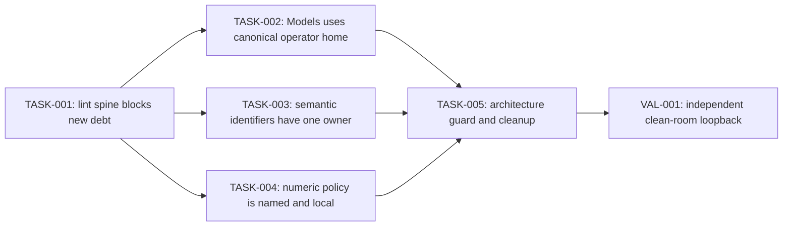

# Service-owned constants, defaults, and model-cache layout

## 1. Problem and desired outcome

### Problem statement

Customers and maintainers cannot rely on one service-owned source for default
paths, machine-readable identifiers, and operational policy because literals
and constants are duplicated across packages, including a Models default cache
root that incorrectly uses `.agent-factory` instead of the canonical operator
home directory.

### Current behavior and gap

Operator Settings resolves its configuration below
`$HOME/.you-agent-factory`, while Models independently defaults managed assets
to `$HOME/.agent-factory/models` in both named-model and generic-artifact paths.
The reference documentation records this split as unresolved, and functional
tests currently preserve it. Elsewhere, metric names, error/status values,
timeouts, retry counts, capacities, directory fragments, and protocol values
are variously inline, aliased, or repeated without a consistent ownership rule.

The repository standards reject unexplained magic values, but the active lint
lane does not currently enforce repeated strings or magic numbers. The existing
`cmd/pkglintcheck` pins golangci-lint v1.64.8, which cannot analyze the module's
Go 1.25 target, and that checker is not present in the default `make lint`
target list.

### Desired outcome and success measures

- Operator Settings is the sole owner of the canonical operator-home directory
  name and resolves the operator-home path from an observed user home.
- Models owns its `models` child-directory policy and defaults all managed model
  and backend artifacts below `<operator-home>/models` when no explicit cache
  directory is configured.
- `pkg/wire` declares no product constants or default policy; it only obtains
  inputs, invokes service-owned resolution, and injects resolved values.
- Stable domain identifiers and operational policy values live at the narrowest
  scope owned by the service that interprets them; no repository-wide
  `constants` package is introduced.
- Production Go changes are checked by a working Go-1.25-compatible lint lane
  using tuned repeated-literal and magic-number detection, with existing debt
  recorded in an exact deletion-only baseline.
- Repository-specific checks reject new default policy declared in `pkg/wire`,
  raw metric-name literals at emission sites, and unauthorized uses of the
  canonical operator-home directory literal.
- Focused service, functional Models, documentation, and repository lint gates
  prove the change on the implementation PR.

## 2. Scope and constraints

### In scope

- Define and document the constant/default placement policy for Go production
  code.
- Repair and activate the repository's golangci-lint path, enabling `goconst`
  and `mnd` with production-focused settings.
- Inventory existing repeated strings and magic numeric policy values and create
  a deletion-only adoption baseline where immediate cleanup is not reviewable.
- Make Operator Settings own canonical operator-home derivation.
- Make Models derive its default cache root from the resolved operator home and
  its own private `models` directory policy.
- Preserve explicit `RuntimeScopeConfig.CacheDirectory` and
  `INFINITE_YOU_OMNIVOICE_CACHE_DIR` precedence.
- Update model-cache tests and public reference documentation from
  `.agent-factory/models` to `.you-agent-factory/models`.
- Consolidate duplicated metric names, typed error/status identifiers, timeout,
  retry, retention, buffer, and capacity policy according to service ownership.
- Add repository-specific enforcement and final clean-room validation.

### Non-goals

- A global `constants`, `defaults`, `paths`, or service-locator package.
- Product policy, default declarations, or directory-name constants in
  `pkg/wire`.
- Moving constants solely to reduce the number of declarations when ownership
  and scope are already correct.
- Extracting contextual `fmt.Errorf` text, log prose, test fixture values,
  mathematical identities, indices, counter increments, or generated values.
- Changing public HTTP or CLI grammar, model names, model revision layout, or
  explicit cache-directory configuration precedence.
- Automatically moving or deleting potentially large caches under the legacy
  `$HOME/.agent-factory/models` directory.
- Frontend changes.

### Assumptions and constraints

- `.you-agent-factory` is the canonical operator-home directory name.
- Operator Settings owns canonical operator-home derivation because it owns
  operator configuration documents, defaults, and effective-settings
  resolution.
- Models owns only the `models` subtree and all managed-cache semantics below
  the operator home.
- Cross-service consumers use public service-root contracts. Private service
  implementation packages remain inaccessible to peers.
- `pkg/wire` may call a service-owned resolver or service-root operation and
  inject its result; it may not declare or reinterpret the default.
- Existing `.agent-factory/models` data remains untouched. During rollback or
  recovery, an operator may explicitly select that directory with the existing
  cache-directory override.
- Generated OpenAPI and client files are not hand-edited.
- Existing user work and unrelated constants are preserved.

### Open questions

- Whether the public Operator Settings operation should be named
  `DefaultOperatorHome`, `OperatorHomeDirectory`, or another name consistent
  with the service's existing `DefaultConfigPath` vocabulary. Implementation
  must settle this during TASK-002 without changing ownership or semantics.
- Whether all current lint findings fit one exact baseline. If the inventory is
  too large for reliable review, TASK-001 may split the baseline by linter and
  durable service owner without weakening the new-debt gate.

### Replanning triggers

- Existing callers rely on `.agent-factory/models` without an explicit cache
  override and product requirements demand transparent automatic migration.
- The operator-home resolver introduces a service dependency cycle.
- The supported golangci-lint release cannot run against Go 1.25 in the
  repository's CI environment.
- Inventory shows a category whose values are generated-contract authority
  rather than handwritten service policy.
- A proposed cleanup crosses more than one independently reviewable behavior or
  requires a public contract break.

## 3. Recommended approach

Deliver five tasks/agent deployments in one behavior lane: activate an exact
new-debt lint spine, correct the default model-cache journey, migrate semantic
identifiers, migrate numeric policy values, and then seal ownership with a
repository-specific checker and independent validation. The sequence preserves
current behavior until the correction task and leaves every task independently
reviewable and revertible.

### Decision record

| Option | Decision | Evidence and tradeoff |
| --- | --- | --- |
| Put shared constants/defaults in `pkg/wire` | Rejected | Wire owns composition, not product policy; this would make defaults invisible to their durable service owner. |
| Create a repository-wide constants package | Rejected | It couples unrelated services by representation and obscures who may change a value. |
| Let every service hardcode `.you-agent-factory` | Rejected for the canonical operator-home name | Independent copies can drift; Operator Settings already owns operator defaults and configuration-path resolution. |
| Operator Settings resolves operator home; Models derives its child root | Selected | It preserves service authority: Operator Settings owns the shared operator-home contract, Models owns managed-cache layout, and Wire only composes resolved values. |
| Automatically move `.agent-factory/models` | Rejected | Model caches can be large, concurrently used, or partially populated. Silent movement adds destructive and recovery risk. Explicit override provides a bounded recovery path. |
| `goconst` plus `mnd` | Selected | The checks separately cover repeated representations and unnamed numeric policy and can be tuned to exclude tests, generated code, prose-producing functions, and mechanical values. |
| Revive `add-constant` in addition to both linters | Rejected | It overlaps the selected checks and would duplicate findings without adding ownership knowledge. |

## 4. Customer behavior

### Actors, roles, and permissions

- A local operator running `you models list`, `inspect`, `pull`, `invoke`, or a
  model-backed Factory uses the process user's home directory unless an
  explicit cache directory is configured.
- The process requires the same filesystem permissions currently needed to
  inspect, create, and update the managed cache.
- Maintainers add or change Go production behavior under repository lint and
  ownership checks.

### User journeys

1. With no explicit cache directory, an operator invokes a managed-model
   command. Operator Settings derives `<home>/.you-agent-factory`; Models derives
   `<operator-home>/models`; all cache inspection, pulling, readiness, backend
   artifacts, and direct invocation use that root.
2. With an explicit cache directory, Models uses it unchanged and does not
   consult or append the default operator-home path.
3. An operator upgrading with legacy cache data sees no automatic deletion or
   movement. They can set the existing cache override to the legacy root or
   manually relocate data following documented guidance.
4. A maintainer introduces a repeated semantic string, magic numeric policy, a
   raw metric name, an unauthorized operator-home literal, or default policy in
   `pkg/wire`; the closest lint gate reports the owner-oriented remediation.

### Default, loading, empty, success, error, and permission states

- Default: managed assets resolve below `.you-agent-factory/models`.
- Explicit override: the supplied cache root wins exactly as before.
- Empty home: resolution fails before cache mutation with an actionable error.
- Success: model responses and inspection report paths below the selected root.
- Legacy-only cache: it remains untouched and is not implicitly selected.
- Permission failure: the existing Models error classification is preserved and
  includes enough path context to diagnose the selected root.

### Accessibility, keyboard, focus, responsive, and localization behavior

Not applicable: the changed behavior is filesystem policy, backend linting, and
CLI/reference documentation; no interactive UI is changed. Customer-facing
error and documentation text must still follow the repository writing standard.

### Visual references

Not applicable: no visual surface changes.

## 5. Contracts and data

### Contract inventory and compatibility classification

| Contract | Classification | Required treatment |
| --- | --- | --- |
| `operatorsettings.Service` operator-home resolution | Additive | Add one service-owned operation/value contract and implement it on the singular root. |
| Models construction/configuration | Internal additive then replacement | Supply the resolved operator-home input/default cache root without adding policy to Wire. |
| `RuntimeScopeConfig.CacheDirectory` | Unchanged | Explicit values continue to win. |
| `INFINITE_YOU_OMNIVOICE_CACHE_DIR` | Unchanged | Existing environment override remains the customer recovery/compatibility path. |
| Managed model cache default path | Behavior-breaking default correction | Changes from `.agent-factory/models` to `.you-agent-factory/models`. |
| Metric names/error codes | Unchanged values unless separately identified as a defect | Move authority without wire-format drift; contract tests prove value preservation. |
| OpenAPI/CLI grammar | Unchanged | No authored schema or command grammar change expected. |
| Public model reference documentation | Corrective | Replace the obsolete path and unresolved-storage finding with canonical behavior and upgrade guidance. |

### HTTP API, CLI, configuration, and event changes

No HTTP schema, CLI grammar, configuration schema, or event schema changes are
planned. Customer-visible `cachePath` values change only when the default cache
root is selected. Explicit configuration behavior is unchanged.

### Persisted data, migration, retention, and rollback

- No automatic migration or deletion of legacy model-cache data.
- New default writes target `.you-agent-factory/models`.
- Operators needing the old data immediately may explicitly configure
  `.agent-factory/models` through the existing override.
- Rollback restores old default selection; data created under the new root is
  retained and can likewise be selected explicitly.
- Documentation must state the old and new roots and the absence of automatic
  movement.

### Generated artifacts and consumers

No generated artifacts should change. If implementation discovers generated
description text containing the default model-cache root, the authored OpenAPI
source must be corrected and `make generate-api` run; this is a replanning
trigger for task scope and verification.

## 6. Architecture and state

### Current-state flow

```text
home-directory effect
  -> Models assets implementation
  -> hardcoded $HOME/.agent-factory/models
  -> model and backend artifact cache

home-directory effect
  -> Operator Settings
  -> hardcoded $HOME/.you-agent-factory/config.json
```

### Target-state flow

```text
home-directory effect
  -> Operator Settings service-owned operator-home resolver
  -> $HOME/.you-agent-factory
  -> composition passes resolved value
  -> Models service-owned default cache derivation
  -> <operator-home>/models
  -> model and backend artifact cache
```

### Runtime sequence and dependencies

1. Composition observes the home directory through the existing edge.
2. The Operator Settings root derives and validates the canonical operator-home
   directory.
3. Composition passes the resolved directory as configuration to Models.
4. Models applies an explicit request/config cache directory when present;
   otherwise it appends its private `models` child policy.
5. Named-model and generic model/backend artifact paths consume one Models-owned
   cache-root resolver.

### Canonical, projected, and ephemeral state

- Canonical policy: Operator Settings owns the operator-home name and path
  derivation; Models owns the managed-cache child layout.
- Persisted state: model and backend cache files below the selected cache root.
- Projected state: `cachePath`, cache-size, readiness, and inspection responses.
- Ephemeral state: resolved home/operator-home/cache-root values during process
  construction and model operations.

### Mutation ownership and consistency boundaries

Models remains the only service mutating managed model cache contents. Operator
Settings derives a path but does not create, inspect, move, or delete model
assets. Wire has no mutation or policy authority. Existing Models cache safety,
path-containment, active-use, and publication boundaries remain authoritative.

### Legacy path and removal plan

The `.agent-factory/models` default is removed from production resolution in
TASK-002. References may remain only in migration documentation and explicit
legacy-path tests. The Models owner is responsible for removing those remaining
compatibility references when the documented recovery interval is retired.

## 7. Failure modes and quality attributes

| Case | Detection | Customer outcome | State/recovery | Telemetry | Evidence |
| --- | --- | --- | --- | --- | --- |
| Home directory absent/blank | Operator-home resolver validation | Actionable failure before model cache access | No filesystem mutation; supply a valid home/edge | Existing structured operation failure with path-resolution context | Operator Settings and Models unit tests |
| Explicit cache override present | Scope/config precedence | Override path is used unchanged | No default path consulted | Existing cache-path fields | Models unit and functional tests |
| Only legacy cache exists | New-root inspection misses | Model is reported absent/not ready under the new default | Legacy data untouched; operator may set explicit legacy override | Existing cache miss/readiness signals | Functional upgrade fixture |
| New cache root lacks permission | Filesystem operation error | Existing typed Models failure with actionable context | Partial publication rules remain unchanged; retry after permission repair | Existing structured Models operation logs | Controlled filesystem fault test |
| Concurrent model operations | Existing cache coordination/active-use checks | No cross-root corruption or unsafe removal | Existing locking and active-use policy | Existing model lifecycle/cache diagnostics | Existing concurrency/functional coverage rerun at new root |
| Generic artifacts and named models diverge | Root-equivalence assertion | Gate fails; change cannot merge | Correct both call paths | Test failure identifies selected roots | Focused unit and functional tests |
| Linter emits excessive prose/test findings | Inventory classification | Maintainer receives actionable production findings only | Tune exclusions; do not blanket-disable linter | Lint report counts by rule/owner | TASK-001 fixture tests and baseline audit |
| Existing lint debt increases | Exact deletion-only baseline comparison | CI blocks the change | Remove new finding or explicitly name/narrow an approved exception | Lint finding and stale-baseline reporting | `make lint` fixture tests |
| Default policy added to `pkg/wire` | Repository AST checker | CI reports prohibited declaration and expected service owner | Move declaration/resolver to owner | Checker output | Positive/negative checker fixtures |

### Performance and scale

Path derivation must be allocation- and IO-light and must not scan or copy the
legacy cache. No new background work is introduced. Generic lint and ownership
checks must remain suitable for the existing `make lint` parallel lane; record
wall time before and after and keep the added focused lane within 60 seconds on
the repository CI class unless an existing lint budget is stricter.

### Reliability and availability

The correction must use one Models resolver for named and generic artifacts so
the two paths cannot drift. Explicit overrides remain the deterministic escape
hatch. No failure may delete or move legacy or new cache data implicitly.

### Security and privacy

Existing path-containment and symlink protections remain mandatory. Errors and
logs may identify selected paths as they do today but must not expose model
contents, credentials, environment secrets, or configuration payloads.

### Cost and resource limits

All planned verification is local and free. Tests must use fixtures and
controlled edges; no provider inference, remote model download, or paid API call
is authorized. The implementation must not duplicate cache data automatically.

### Observability and operational readiness

No new production metric is required. Existing model inspection/readiness and
structured operation failures must expose the selected path sufficiently to
distinguish explicit, canonical-default, and permission failures. Lint output
must name rule, file, line, and owner-oriented remediation.

## 8. Rollout, compatibility, and rollback

### Deployment and feature-flag sequence

No feature flag. Land the lint spine first, then the path correction and owner
migrations under that guard. Each task is independently revertible.

### Compatibility interval

For at least the release containing the correction, documentation preserves the
legacy path and explains how to select it explicitly. Production does not
implicitly search it. The cleanup owner is Models.

### Monitoring and stop conditions

Stop rollout if functional tests show explicit override precedence changed,
generic and named artifact roots diverge, path containment weakens, generated
contracts drift unexpectedly, or lint cannot distinguish production policy from
test/prose literals without broad exclusions.

### Rollback procedure

Revert the responsible task. Cache data in both old and new roots remains
untouched. Operators may point the existing override at either root. Reverting
lint enforcement does not require reverting already-corrected owner placement.

### Deprecation and cleanup owner

Models owns legacy `.agent-factory/models` documentation and test cleanup.
Operator Settings owns operator-home contract evolution. The repository
maintainership/lint checker owner owns baseline shrinkage and linter upgrades.

## 9. Implementation strategy

### Coverage assessment and characterization needs

Current behavior is already characterized by functional Models tests that
assert `.agent-factory/models`, including model invoke, root composition, pull
to ready, and text-to-speech flows. TASK-002 changes those assertions only with
the behavior correction and adds focused resolver/preference tests. Metric and
error identifier value preservation needs inventory-driven characterization in
TASK-003 before aliases or duplicates are removed.

### Parent behavior lanes

- **BEH-001 — Service-owned policy remains consistent and mechanically
  enforced:** maintainers can locate the authority for defaults, identifiers,
  and operational values, and CI rejects new ownership/magic-value debt.
- **BEH-002 — Managed model assets use the canonical operator home by default:**
  operators see all default Models storage beneath `.you-agent-factory/models`
  while explicit overrides and cache safety remain unchanged.

### Narrow executable spine

TASK-001 establishes the contributor-facing executable spine through the real
`make lint` entry point. TASK-002 establishes the customer-facing spine through
`root.BuildProcess`/`Process.Execute` Models functional tests with controlled
filesystem and model edges.

### Justified enabling work

TASK-001 is a bounded horizontal enabler because existing findings must be
measured and protected before broad structural cleanup; mixing toolchain
migration, baseline construction, and one domain behavior correction would make
both rollback and review ambiguous. Its independently useful outcome is a
working gate that prevents new repeated-literal and numeric-policy debt.

### Migration or strangler sequence

1. Activate compatible linting and record exact existing debt.
2. Declare Operator Settings operator-home resolution and Models cache-child
   derivation canonical; replace both legacy production call paths together.
3. Characterize and consolidate stable semantic identifiers without changing
   their values.
4. Name and localize numeric operational policy while shrinking the baseline.
5. Add architectural checks for invariants generic linters cannot understand,
   remove stale baseline entries, and run integrated validation.

### Shared-surface ownership

- TASK-001 and TASK-005 own lint configuration, Make integration, checker code,
  and lint baselines; they run sequentially.
- TASK-002 exclusively owns Operator Settings/Models default-path contracts and
  `docs/reference/models.md` during its change.
- TASK-003 owns metric/error/status identifier authority and must not edit model
  path policy.
- TASK-004 owns timeout/retry/retention/buffer/capacity policy and must not
  broaden into algorithm changes.

## 10. Verification strategy

| Behavior/gate | Scope | Dependency fidelity | Cadence | Cost | Proves | Does not prove |
| --- | --- | --- | --- | --- | --- | --- |
| Operator-home and Models cache-root unit tests | Unit | Controlled | Per change | Free | Canonical joining, blank-home failure, and explicit override precedence | Full process composition |
| Models service tests | Functional/package integration | Controlled | Per PR | Free | Named and generic asset paths use one selected root and preserve safety behavior | Customer command composition |
| Models `root.BuildProcess` functional cells | Functional | Controlled production wiring | Per PR | Bounded local resources | Customer commands report/use `.you-agent-factory/models` and explicit overrides | Remote model availability |
| `make docs-reference-smoke` | Contract/documentation | Local real | Per PR | Free | Packaged Models reference remains valid and discoverable | Runtime filesystem behavior |
| `make lint` | Static/repository integration | Local real | Per change and PR | Bounded local resources | Generic magic-value and repository ownership invariants block new debt | Runtime behavior |
| `make verify-fast` | Integration suite | Controlled/local real | Per PR | Bounded local resources | Shared Go/UI fast gates remain healthy | Paid/remote dependencies |
| VAL-001 clean-room loopback | Functional plus repository integration | Controlled production wiring | Once after all tasks | Bounded local resources | Cross-task behavior, documentation, lint, and rollback guidance integrate | Remote provider/model download |

### Paid-validation budgets and evidence-reuse keys

Not applicable. Maximum remote calls: 0. Maximum cost: $0. No paid evidence is
required for local path policy or static enforcement.

### Remaining unproven edges and owning gates

- Real multi-gigabyte legacy-cache operator migration is intentionally unproven
  because no automatic migration is implemented; documentation and explicit
  override behavior own recovery.
- Remote model downloads are unproven and unnecessary; controlled asset clients
  prove selected paths and publication behavior.
- CI terminal success is owned by the review stage on the implementation PR.

## 11. Task dependency graph



TASK-002, TASK-003, and TASK-004 may run in parallel after TASK-001 only when
their shared-surface ownership above is respected.

## 12. Tasks

### TASK-001 — New repeated-literal and numeric-policy debt is blocked

**Parent behavior:** BEH-001 — Service-owned policy remains consistent and
mechanically enforced.

**Problem:** The current golangci-lint path is incompatible with Go 1.25,
disconnected from the default lint lane, and does not check repeated strings or
magic numbers.

**Outcome:** `make lint` runs a supported golangci-lint release with tuned
`goconst` and `mnd` checks and an exact deletion-only baseline that blocks new
production debt without forcing unrelated cleanup.

**Plan reference:** `C:\Users\andre\work\portos\infinite-you\.claude\worktrees\test-cleanup\docs\internal\development\plans\constants-defaults-and-model-cache-ownership.md`, BEH-001 and Sections 3, 9, and 10.

**Actor and trigger:** A maintainer runs `make lint` locally or CI runs it for a
Go production change.

**Dependencies:** None.

**Parallel and shared-surface ownership:** Must complete before TASK-002 through
TASK-005. This task exclusively owns golangci-lint version/config migration,
Make integration, and initial baselines.

**Scope:**

- In: migrate to a Go-1.25-compatible golangci-lint v2 release; update config
  schema; connect the package lint target to `make lint`; enable/tune `goconst`
  and `mnd`; exclude generated/test/prose-producing surfaces narrowly; inventory
  findings; add exact baseline and checker tests.
- Out: bulk owner refactors, model-cache behavior changes, generic Revive
  `add-constant`, or blanket directory exclusions.

**Implementation constraints:**

- Preserve all existing enabled linters and generated-code exclusions unless a
  v2 migration requires an equivalent syntax change.
- Ignore contextual error/log strings through function-specific settings rather
  than excluding their packages.
- Existing findings may enter only an exact deletion-only baseline; every
  reduction must make the baseline stale until updated downward.
- Lint failure messages must include the finding and the closest remediation.

**Acceptance criteria:**

- [ ] Given Go 1.25, when `make lint` reaches package linting, then the selected
  golangci-lint binary loads the repository and runs the existing plus new
  checks without a toolchain-version or config-version failure.
- [ ] Given a fixture with a new repeated semantic string or numeric timeout,
  when the focused checker runs, then it fails with the `goconst` or `mnd`
  finding and file location.
- [ ] Given only recorded existing debt, when the focused checker runs, then it
  passes; increasing debt or retaining a stale removed finding fails.
- [ ] `make lint` includes this gate and reports the property it measured.

**Verification:**

- Behavioral witness: add one failing fixture for each new linter, observe
  failure, restore the compliant fixture, and observe pass through the same
  target.
- Executable-spine effect: establish.
- Required evidence:
  - Scope: repository integration.
  - Dependency fidelity: local_real.
  - Command or procedure: focused tests for the lint driver/baseline checker,
    followed by `make lint`.
  - Proves: compatible tool execution, default-lane integration, positive
    detection, and exact baseline behavior.
  - Does not prove: domain constant ownership or model-cache behavior.
- Highest feasible level: repository integration through the real Make target.
- Remaining unproven edges: architectural ownership -> TASK-005; domain cleanup
  -> TASK-003/TASK-004.

**Paid validation, when applicable:** Not applicable; maximum calls 0 and cost
$0.

**Operational and rollout notes:** Record before/after lint duration and finding
counts. Stop if narrow settings cannot avoid generated/test/prose noise. Rollback
is removal of the new target/config changes; the baseline contains no runtime
state.

**Escalation:** Stop and return a structured blocker when the required change
exceeds this task's outcome, a prerequisite or authority is absent, or the
observed architecture contradicts the plan. Include evidence, impact, safe work
completed, and the smallest recommended delta. Do not broaden scope silently.

**Handoff artifacts:** Migrated lint config/version, Make target integration,
exact baseline, checker fixtures/tests, finding inventory by service/category,
and timing evidence.

### TASK-002 — Models defaults to the canonical operator-home cache

**Parent behavior:** BEH-002 — Managed model assets use the canonical operator
home by default.

**Problem:** Models independently hardcodes `.agent-factory/models`, diverging
from the Operator Settings-owned `.you-agent-factory` home convention.

**Outcome:** With no explicit cache directory, all named and generic Models
assets use `<home>/.you-agent-factory/models`; explicit overrides, cache safety,
and legacy data remain intact.

**Plan reference:** `C:\Users\andre\work\portos\infinite-you\.claude\worktrees\test-cleanup\docs\internal\development\plans\constants-defaults-and-model-cache-ownership.md`, BEH-002 and Sections 4 through 8.

**Actor and trigger:** A local operator invokes a managed-model command or a
model-backed Factory without configuring a cache directory.

**Dependencies:** TASK-001.

**Parallel and shared-surface ownership:** May run with TASK-003/TASK-004.
Exclusively owns Operator Settings/Models default-path contracts, affected
functional Models assertions, and `docs/reference/models.md`.

**Scope:**

- In: add Operator Settings-owned operator-home resolution; add the singular
  service-root operation; pass its resolved result through composition; make
  Models own and apply the `models` child root in named and generic paths;
  preserve overrides; update unit/functional tests and reference docs.
- Out: automatic legacy cache movement/deletion, cache eviction, schema changes,
  or other `.agent-factory` occurrences unrelated to Models default storage.

**Implementation constraints:**

- No product constant/default may be declared in `pkg/wire`.
- Models must not import Operator Settings internals or read its config document.
- Both current production hardcodes must converge on one Models-owned resolver.
- Existing path-containment, symlink, active-use, cancellation, and atomic
  publication behavior must remain unchanged.
- Legacy data must not be mutated; document the explicit-override recovery path.

**Acceptance criteria:**

- [ ] Given home `/home/operator` and no explicit cache directory, when a named
  or generic model/backend asset resolves storage, then every selected root is
  below `/home/operator/.you-agent-factory/models`.
- [ ] Given an explicit cache directory, when the same operations run, then the
  explicit directory is used unchanged and `.you-agent-factory/models` is not
  appended or consulted.
- [ ] Given blank/unavailable home resolution, when default storage is needed,
  then the operation fails before cache mutation with actionable context.
- [ ] Given files only under `.agent-factory/models`, when the new default is
  used, then those files are neither moved nor deleted; the documented explicit
  override selects them when supplied.
- [ ] Focused Operator Settings/Models tests, Models functional cells, and
  `make docs-reference-smoke` report the stated properties.

**Verification:**

- Behavioral witness: run Models list/inspect or pull-to-ready through
  `root.BuildProcess` with a temporary home and controlled model edges; observe
  the returned/materialized path below `.you-agent-factory/models`.
- Executable-spine effect: extend.
- Required evidence:
  - Scope: unit and functional.
  - Dependency fidelity: controlled production wiring.
  - Command or procedure: `go test ./pkg/services/operator_settings/... ./pkg/services/models/...`; focused `go test` for `tests/functional/models/root_composition` and `tests/functional/models/model_invoke`; `make docs-reference-smoke`.
  - Proves: ownership, joining, override precedence, customer-path behavior,
    legacy non-mutation, and packaged documentation.
  - Does not prove: remote downloads or paid provider availability.
- Highest feasible level: functional through `root.BuildProcess` with controlled
  external effects.
- Remaining unproven edges: integrated lint/ownership convergence -> VAL-001.

**Paid validation, when applicable:** Not applicable; maximum calls 0, maximum
cost $0, maximum duration 0 remote minutes.

**Operational and rollout notes:** No feature flag. Release notes/reference docs
must state the corrected default and explicit legacy override. Stop if override
precedence or containment changes. Rollback retains both directory trees.

**Escalation:** Stop and return a structured blocker when the required change
exceeds this task's outcome, a prerequisite or authority is absent, or the
observed architecture contradicts the plan. Include evidence, impact, safe work
completed, and the smallest recommended delta. Do not broaden scope silently.

**Handoff artifacts:** Operator Settings contract/implementation, Models default
resolver and composition changes, unit/functional evidence, updated Models
reference, and migration/rollback note.

### TASK-003 — Stable semantic identifiers have one service owner

**Parent behavior:** BEH-001 — Service-owned policy remains consistent and
mechanically enforced.

**Problem:** Metric names, metric labels, error/status codes, and aliases are
sometimes repeated or owned by adapters rather than the service that defines
their semantics.

**Outcome:** Inventory-confirmed semantic identifiers have one typed or named
service-owned authority at the narrowest legitimate consumer boundary, with
wire/protocol values unchanged.

**Plan reference:** `C:\Users\andre\work\portos\infinite-you\.claude\worktrees\test-cleanup\docs\internal\development\plans\constants-defaults-and-model-cache-ownership.md`, BEH-001 and Sections 3, 5, and 9.

**Actor and trigger:** A maintainer traces, emits, maps, or handles a stable
machine-readable identifier.

**Dependencies:** TASK-001.

**Parallel and shared-surface ownership:** May run with TASK-002/TASK-004. Owns
only inventory-selected metric/error/status surfaces; coordinate authored
contract files with TASK-005 if an unexpected public value change is found.

**Scope:**

- In: characterize current values; move metric names to the measurement-owning
  service; keep storage field names with the sink/schema owner; place public
  typed error/status codes at service roots and private codes internally; remove
  redundant aliases and raw emission-site names; shrink the lint baseline.
- Out: renaming externally observable values, extracting human-readable errors,
  or changing metric semantics/cardinality.

**Implementation constraints:**

- Values must remain byte-for-byte stable unless a separately approved defect
  is recorded and replanned.
- Export only for real cross-package consumers; prefer local or private package
  constants otherwise.
- Sentinel errors remain `var` values and are exported only for `errors.Is`
  callers.
- Protocol-owned values remain in authored contracts or transports; generated
  code is not edited.

**Acceptance criteria:**

- [ ] Given an inventory-selected metric emission, when its name is traced,
  then one owner declaration defines the value and adapters consume it without
  redefining aliases.
- [ ] Given an inventory-selected machine-readable error/status value, when a
  peer branches on it, then the owning service root exposes a named type and
  constant; internal-only values remain private.
- [ ] Given existing contract fixtures, when focused tests run, then emitted and
  serialized values are unchanged.
- [ ] The `goconst` baseline decreases by every removed duplicate and contains
  no stale entries.

**Verification:**

- Behavioral witness: capture representative metric and typed-error output
  before/after and compare exact names/codes.
- Executable-spine effect: preserve.
- Required evidence:
  - Scope: unit and package integration.
  - Dependency fidelity: controlled.
  - Command or procedure: focused tests for each changed owner plus the focused
    lint/baseline target.
  - Proves: single authority and value compatibility.
  - Does not prove: all future ownership rules -> TASK-005.
- Highest feasible level: package integration because customer wire values are
  preserved, supplemented by existing contract tests where touched.
- Remaining unproven edges: architecture guard -> TASK-005.

**Paid validation, when applicable:** Not applicable; maximum calls 0 and cost
$0.

**Operational and rollout notes:** No runtime rollout change. Revert each owner
batch independently if a consumer was missed. Do not mix unrelated owners in
one review batch when the inventory exceeds a focused pass.

**Escalation:** Stop and return a structured blocker when the required change
exceeds this task's outcome, a prerequisite or authority is absent, or the
observed architecture contradicts the plan. Include evidence, impact, safe work
completed, and the smallest recommended delta. Do not broaden scope silently.

**Handoff artifacts:** Before/after identifier inventory, characterization
tests, owner declarations, removed aliases, baseline reductions, and exact-value
comparison evidence.

### TASK-004 — Operational numeric policy is named at its owner

**Parent behavior:** BEH-001 — Service-owned policy remains consistent and
mechanically enforced.

**Problem:** Inline timeouts, retries, capacities, retention limits, and buffer
sizes can hide operational policy and evade owner review.

**Outcome:** Inventory-confirmed numeric policy values are named at the narrowest
service/package scope or represented in cohesive configuration defaults, while
mechanical numeric literals remain inline and lint exceptions stay narrow.

**Plan reference:** `C:\Users\andre\work\portos\infinite-you\.claude\worktrees\test-cleanup\docs\internal\development\plans\constants-defaults-and-model-cache-ownership.md`, BEH-001 and Sections 2, 7, and 9.

**Actor and trigger:** A maintainer reads or changes timeout, retry, retention,
capacity, or buffer policy in production Go.

**Dependencies:** TASK-001.

**Parallel and shared-surface ownership:** May run with TASK-002/TASK-003. Owns
only numeric-policy findings and the corresponding `mnd` baseline reductions.

**Scope:**

- In: classify `mnd` findings; name policy values locally or in service-owned
  default configuration; add unit coverage for default selection and boundary
  behavior; document non-obvious units/invariants; shrink baseline.
- Out: algorithm changes, universal constants for `0`/`1`, test timing cleanup,
  mathematical/index literals, file-mode policy changes, or unrelated
  performance tuning.

**Implementation constraints:**

- A constant must be scoped to the smallest legitimate consumer set.
- Values shared only inside one function may be local constants.
- Configuration constructors are preferred when values form one cohesive policy
  such as retention or retry behavior.
- Naming a value must not silently change its value, unit, or precedence.

**Acceptance criteria:**

- [ ] Given each inventory-confirmed policy literal, when reviewed after the
  task, then its name and owner communicate timeout/retry/retention/capacity
  semantics and units.
- [ ] Given mechanical values and approved standard-library call shapes, when
  lint runs, then they do not require meaningless constants or broad package
  exclusions.
- [ ] Focused boundary/default tests prove changed declarations preserve their
  previous effective values.
- [ ] The `mnd` baseline decreases with no stale entries and rejects a new
  unapproved policy literal.

**Verification:**

- Behavioral witness: focused tests assert effective timeout/retry/retention or
  capacity defaults through their owner APIs before and after extraction.
- Executable-spine effect: preserve.
- Required evidence:
  - Scope: unit and repository lint integration.
  - Dependency fidelity: controlled/local_real.
  - Command or procedure: focused owner tests and focused lint/baseline target.
  - Proves: value compatibility, clear ownership, and recurrence prevention.
  - Does not prove: performance improvements, because none are intended.
- Highest feasible level: unit plus repository lint integration.
- Remaining unproven edges: full-lane integration -> VAL-001.

**Paid validation, when applicable:** Not applicable; maximum calls 0 and cost
$0.

**Operational and rollout notes:** No behavior rollout. Any discovered need to
change a numeric policy is a separate behavior plan. Revert owner batches
independently.

**Escalation:** Stop and return a structured blocker when the required change
exceeds this task's outcome, a prerequisite or authority is absent, or the
observed architecture contradicts the plan. Include evidence, impact, safe work
completed, and the smallest recommended delta. Do not broaden scope silently.

**Handoff artifacts:** Classified numeric inventory, owner-local declarations or
config defaults, focused tests, documented exceptions, and baseline reductions.

### TASK-005 — Architecture-specific ownership violations are rejected

**Parent behavior:** BEH-001 — Service-owned policy remains consistent and
mechanically enforced.

**Problem:** Generic literal linters cannot determine whether a default belongs
to a service, whether Wire declared product policy, or whether a raw string is a
metric name at a semantic emission boundary.

**Outcome:** A repository AST checker integrated into `make lint` rejects new
default policy in `pkg/wire`, unauthorized canonical operator-home literals,
and raw metric names at known emission calls, with exact tests and no stale
baseline debt.

**Plan reference:** `C:\Users\andre\work\portos\infinite-you\.claude\worktrees\test-cleanup\docs\internal\development\plans\constants-defaults-and-model-cache-ownership.md`, BEH-001 and Sections 7 through 11.

**Actor and trigger:** A maintainer or CI runs `make lint` after changing
production constants/defaults or telemetry emission.

**Dependencies:** TASK-002, TASK-003, TASK-004.

**Parallel and shared-surface ownership:** Runs after the three cleanup tasks and
exclusively owns the final repository checker, its Make target, fixtures, and
remaining ownership baseline.

**Scope:**

- In: AST-based checks for product default declarations in `pkg/wire`, exact
  `.you-agent-factory` authorization, and literal metric-name arguments at
  recognized emission APIs; positive/negative fixtures; actionable reporting;
  integration into default lint; stale-baseline enforcement.
- Out: a universal style checker, inference of arbitrary business semantics, or
  prohibition of all constants in `pkg/wire` if language/framework mechanical
  declarations require a documented narrow exception.

**Implementation constraints:**

- Match syntax and semantic call/declaration shapes, not comments or generated
  files.
- Exceptions must be exact, explained, and tested; package-wide exemptions are
  prohibited.
- Error text must name the owning service pattern: service-root contract,
  service-internal policy, or explicit configuration injected by Wire.
- Follow the repository's existing checker and deletion-only baseline patterns.

**Acceptance criteria:**

- [ ] Given a fixture declaring a product directory/default in `pkg/wire`, when
  the checker runs, then it fails and directs the declaration to its service
  owner.
- [ ] Given an unauthorized `.you-agent-factory` literal or raw string metric
  name at a recognized emission call, when the checker runs, then it fails with
  file, line, and owner-oriented remediation.
- [ ] Given service-owned resolvers/constants and composition that only passes
  resolved values, when the checker runs, then it passes.
- [ ] Given a removed legacy violation, when its baseline entry remains, then
  the checker fails as stale.
- [ ] `make lint` and `make verify-fast` pass on the implementation PR and their
  output records the properties actually measured.

**Verification:**

- Behavioral witness: run each prohibited and allowed fixture through the exact
  Make-integrated checker and observe deterministic fail/pass output.
- Executable-spine effect: increase_fidelity.
- Required evidence:
  - Scope: unit and repository integration.
  - Dependency fidelity: local_real.
  - Command or procedure: checker unit/fixture tests, focused Make target,
    `make lint`, and `make verify-fast`.
  - Proves: architecture-specific recurrence prevention and integration with
    generic checks.
  - Does not prove: customer model-cache behavior -> TASK-002/VAL-001.
- Highest feasible level: repository integration through the default lint lane.
- Remaining unproven edges: clean-room cross-task behavior -> VAL-001.

**Paid validation, when applicable:** Not applicable; maximum calls 0 and cost
$0.

**Operational and rollout notes:** Report finding counts and lint duration. Stop
if semantic matching requires broad textual heuristics. Rollback removes only
the new checker target; service-owned corrections remain valid independently.

**Escalation:** Stop and return a structured blocker when the required change
exceeds this task's outcome, a prerequisite or authority is absent, or the
observed architecture contradicts the plan. Include evidence, impact, safe work
completed, and the smallest recommended delta. Do not broaden scope silently.

**Handoff artifacts:** AST checker, exact fixtures/tests, Make integration,
baseline cleanup, full lint/verify evidence, and inputs for VAL-001.

## 13. Project acceptance criteria

- [ ] Given no explicit model cache directory, Models list/inspect/pull/invoke
  functional evidence shows named models plus generic model/backend artifacts
  resolve below `<home>/.you-agent-factory/models`.
- [ ] Given an explicit cache directory or a legacy `.agent-factory/models`
  override, focused evidence shows the supplied root wins unchanged and neither
  legacy nor canonical cache data is implicitly moved or deleted.
- [ ] Operator Settings owns canonical operator-home derivation, Models owns its
  `models` child layout, and repository checks prove `pkg/wire` owns no product
  default policy.
- [ ] Characterization/contract evidence shows migrated metric names and
  error/status codes preserve exact externally observable values.
- [ ] Focused tests show named numeric policy preserves effective values and
  units, while documented mechanical literals remain permitted.
- [ ] A Go-1.25-compatible package lint target is part of `make lint`; positive
  fixtures prove `goconst`, `mnd`, Wire-default, operator-home-literal, and
  raw-metric-name violations fail, and deletion-only baselines reject increases
  and stale entries.
- [ ] Added lint work remains within the stated 60-second focused-lane budget on
  the repository CI class, or a stricter existing budget if present.
- [ ] `make docs-reference-smoke`, `make lint`, and `make verify-fast` pass on
  the change's own PR and evidence comments state the property each gate
  measured.
- [ ] VAL-001 runs from a clean temporary home, exercises default and explicit
  Models cache paths through the assembled customer process, verifies docs and
  lint integration, confirms legacy non-mutation, and reports PASS using the
  canonical validation-loopback template.
- [ ] Implementation-stage delivery criterion: The implementation stage marks
  this criterion satisfied and stops after its final head is pushed, the PR is
  open, CI has started, and all blocking review feedback is addressed. It does
  not poll or re-check CI after this finish line. The review stage owns driving
  CI to terminal-and-passing, resolving merge conflicts, and merging the PR;
  merge remains the lane-wide delivery boundary. CI-run evidence goes in a PR
  comment and never in a commit.

## 14. References

- `docs/internal/standards/code/general-backend-standards.md` — normative
  backend ownership, magic-value, lint, state, and testing requirements.
- `docs/architecture/packaged-structure.md` — service, Platform, Wire, and
  dependency-direction ownership boundaries.
- `factory/docs/standards/planning-standards.md` — required behavior slicing,
  acceptance criteria, progressive verification, and delivery split.
- `pkg/services/operator_settings/defaults_resolution.go` — current
  service-owned configuration path and duplicated operator-home literal.
- `pkg/services/operator_settings/service_contract.go` — singular public
  Operator Settings root to extend additively.
- `pkg/services/models/internal/services/assets/internal/service/service.go` —
  named-model production default currently using `.agent-factory/models`.
- `pkg/services/models/internal/services/assets/internal/service/generic.go` —
  generic model/backend production default currently using the same legacy
  root independently.
- `tests/functional/models/model_invoke/cli_test.go` and
  `tests/functional/models/root_composition/` — current customer-process
  characterization and target functional evidence.
- `docs/reference/models.md` — canonical packaged Models reference currently
  documenting the divergent path and unresolved storage finding.
- `.golangci.pkg.yml`, `cmd/pkglintcheck/main.go`, and `Makefile` — current
  package-lint configuration, incompatible version pin, and lint-lane
  integration surface.
