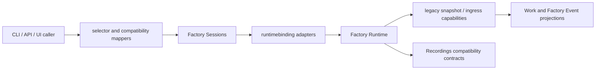
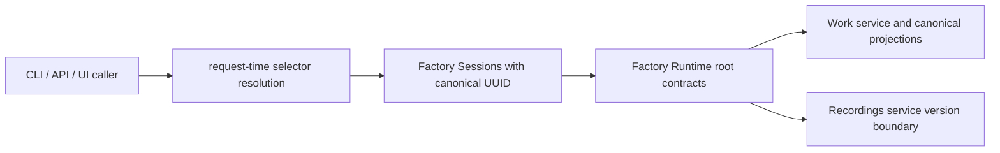
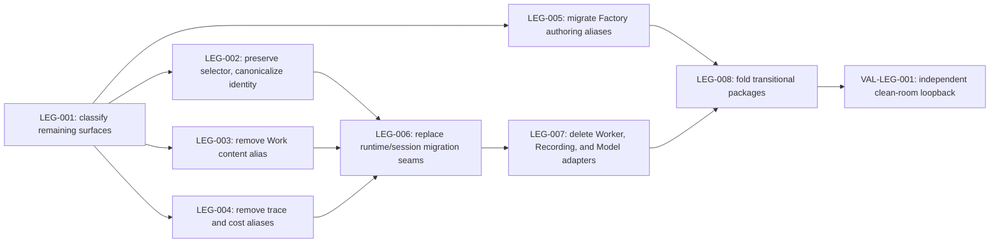

# Remaining legacy compatibility removal plan

Status: Draft
Owner: Backend maintainers, with contract and UI owners for public cutovers
Last reviewed: 2026-08-25

## 1. Problem and desired outcome

### Problem statement

Customers and maintainers still encounter compatibility data shapes and
migration-only runtime adapters whose support status, removal gate, and
canonical successor are not consistently expressed.

### Current behavior and gap

The retired global Factory-directory migration has been removed, but remaining
legacy references span several different kinds of behavior:

- `~default` is useful as an active request-time Factory Session selector, yet
  `contracts/api/deprecated.json` classifies the selector itself as deprecated;
- clients can accidentally persist or replay `~default` where a resolved
  Factory Session UUID is required;
- Work content, trace fields, dispatch-event payloads, and cost responses still
  carry deprecated aliases alongside canonical fields;
- Factory authoring accepts older taxonomy values, omitted defaults, and moved
  invocation examples;
- Factory Runtime and Factory Sessions still communicate through
  `legacysnapshot`, `WorkAndEventIngress`, and `LegacyEventSource` seams;
- Workers, Recordings, and Models retain internal adapters explicitly described
  as transitional or legacy; and
- the unfinished-package-moves ledger still records transitional package
  locations whose rows have no bounded removal sequence in one current plan.

A text match for `legacy`, `compatibility`, or `retired` is not sufficient
evidence for deletion. Provider deprecation metadata, dispatch retirement
outcomes, replay compatibility required by the supported recording format, and
historical release notes can all be intentional current behavior.

### Desired outcome and success measures

The repository has no unowned migration-only implementation or deprecated
alias. Every remaining compatibility surface is either removed with executable
proof or recorded as intentionally supported with an owner and objective review
gate.

Success requires:

- `~default` remains accepted at documented request boundaries and is no longer
  described as a deprecated identifier;
- all durable and client-cached Factory Session identities use the resolved
  UUID returned by the backend;
- each removed public alias is absent from authored OpenAPI/config schemas,
  generated clients, emitters, consumers, fixtures, and customer docs;
- runtime/session behavior, replay, restart, Work projection, and lifecycle
  control pass without the migration-only snapshot and ingress seams;
- transitional Worker, Recording, and Model adapters have no production
  callers before deletion;
- `unfinished-package-moves.json` only shrinks, and each completed cohort also
  removes its obsolete checks, aliases, and exemptions; and
- `make verify-pr`, `make compatibility-alias-check`,
  `make retired-surface-check`, and a clean-room CLI/API loopback pass on the
  change's own head.

## 2. Scope and constraints

### In scope

- Lifecycle metadata and tests for `~default`.
- Request-time selector resolution and durable identity normalization.
- Deprecated Work content, trace, dispatch-event, and cost aliases.
- Legacy Factory authoring taxonomy/defaulting after an explicit fixture
  migration decision.
- Factory Runtime/Factory Sessions migration-only capabilities and snapshots.
- Explicitly deprecated internal Worker and Recording contracts and the Models
  `internal/legacyhost` package.
- Transitional package moves already listed in
  `docs/internal/baselines/unfinished-package-moves.json`.
- Generated contracts, tests, release notes, and customer migration guidance
  required by each public cutover.

### Non-goals

- Removing `~default` as a selector or registry alias.
- Renaming domain outcomes such as dispatch `RETIRED`.
- Removing the provider-catalog deprecation mechanism.
- Rewriting historical release notes merely to eliminate legacy terminology.
- Removing compatibility needed to read an explicitly supported recording or
  Factory format without a separately approved support-window decision.
- Treating general maintainability exemptions as legacy code unless the
  exemption exists specifically because of a migration seam removed here.

### Assumptions and constraints

- Public removals are breaking changes and land only in an approved breaking
  release or after the repository's published compatibility interval.
- Canonical state remains the Factory Event ledger and service-owned durable
  Factory Session state; projections must not become alternate authorities.
- OpenAPI changes begin in `api/openapi-main.yaml` and `api/components/`, then
  regenerate all Go and TypeScript consumers.
- Generated files are never hand-edited.
- Existing factories and recordings used as supported fixtures must be migrated
  before their reader fallback is removed.
- Each task must preserve a releasable executable spine and be independently
  revertible.

### Open questions

- Which next release is authorized to remove each public request or response
  alias?
- What recording format versions remain supported across upgrades?
- Are external Factory definitions using `MODEL_WORKER`, `MODEL_WORKSTATION`,
  omitted orchestrator declarations, `SCRIPT_WRAP`, or
  `invocationSignature.examples`, and what telemetry or customer inventory can
  prove the answer?
- Should deprecated public fields be rejected immediately after removal or
  ignored with a typed warning for one additional release?

### Replanning triggers

Replan when an external caller is found for a proposed removal, a supported
recording cannot replay without the old shape, a package cohort overlaps active
architecture work, generated contract changes affect an unlisted consumer, or
the breaking-release authorization changes. The expected implementation is
eight tasks plus one independent validation deployment; external usage evidence
or recording-version expansion may split Tasks LEG-003 through LEG-007.

## 3. Recommended approach

First establish a machine-readable classification that distinguishes active
selectors, temporary compatibility, supported historical readers, and
removal-ready code. Then remove public aliases in narrow behavior lanes before
collapsing internal runtime adapters and transitional package locations; this
keeps every change measurable and independently revertible.

### Decision record

| Option | Decision | Evidence and tradeoff |
| --- | --- | --- |
| Delete every source containing legacy terminology | Rejected | The search includes active `~default` selection, provider lifecycle metadata, dispatch retirement, and supported replay behavior. |
| Keep all compatibility indefinitely | Rejected | Migration-only interfaces and duplicate fields increase state ambiguity and prevent package-boundary completion. |
| Classify, measure callers, cut over by behavior, then delete | Selected | Matches the repository replacement standard and gives every breaking surface an explicit gate and rollback boundary. |

## 4. Customer behavior

### Actors, roles, and permissions

- CLI, API, ACP, MCP, and dashboard callers may use `~default` where the
  endpoint explicitly accepts a Factory Session selector.
- Clients that cache, reconnect, save, replay, or correlate a Factory Session
  must use the resolved UUID returned by the backend.
- Factory authors may use only the canonical schema after the applicable
  authoring compatibility window closes.
- Operators retain read access to supported historical recordings throughout
  the declared recording support window.

No authorization or permission model changes are planned.

### User journeys

1. A caller sends `~default`, receives a response containing a canonical
   Factory Session UUID, and uses that UUID for all durable follow-up state.
2. A caller submitting canonical Work content, trace context, or cost queries
   receives one unambiguous canonical representation.
3. A Factory author validates an old definition and receives an actionable
   migration diagnostic before the old spelling becomes unsupported.
4. An operator starts, controls, stops, restarts, and replays a Factory Session
   through the same public surfaces after internal compatibility adapters are
   removed.

### Default, loading, empty, success, error, and permission states

- Default: `~default` resolves at request time; it is never stored as canonical
  session identity.
- Loading: streams and UI caches remain keyed by the resolved UUID during
  reconnect and hydration.
- Empty: no current default session returns the existing typed not-found or
  unavailable result without creating a durable alias record.
- Success: responses and events contain canonical fields only after their
  approved removal task.
- Error: removed inputs fail with the documented validation error; they never
  partially mutate canonical state.
- Permission: unchanged; selector normalization must not bypass the same access
  checks applied to explicit UUIDs.

### Accessibility, keyboard, focus, responsive, and localization behavior

No new visual interaction is planned. If dashboard validation text changes,
existing focus placement, screen-reader announcements, responsive layout, and
localizable message construction must remain unchanged and be covered by the
focused UI tests.

### Visual references

Not applicable: this plan changes contracts, normalization, and internal
runtime composition rather than visual layout.

## 5. Contracts and data

### Contract inventory and compatibility classification

| Surface | Current classification | Target |
| --- | --- | --- |
| `~default` request selector | Incorrectly deprecated in `contracts/api/deprecated.json` | Active selector; prohibited as durable identity |
| Durable Factory Session identity | Mixed selector/UUID compatibility | UUID only |
| Work content `file` | Deprecated alias for `url` | Remove after input migration gate |
| Work/submit `traceId` | Legacy alias for `currentChainingTraceId` | Remove after consumer migration gate |
| Dispatch payload chaining-trace copies | Deprecated copies of `FactoryEvent.context` | Remove after replay/projection gate |
| Cost `priced_subtotal` | Deprecated alias for `known_cost` | Remove after API/UI/package gate |
| Factory taxonomy/default aliases | Retained during migration | Canonical authored values only after fixture/external-usage gate |
| Invocation content fallback | Compatibility text carrier | Retain until all callers send canonical `args`; then separately remove |
| Runtime/session snapshot and ingress seams | Migration-only internal contracts | Replace with service-owned root contracts, then delete |
| Worker `Runner` alias and legacy result mapper | Deprecated internal API | Private runner execution and canonical proposed output only |
| Recording pre-neutral replay requests | Deprecated internal API | Neutral Recording service requests only |
| Models `internal/legacyhost` | Internal legacy package | Runtime-host/assets services only |
| Provider deprecation metadata | Active product lifecycle contract | Unchanged |
| Dispatch retirement outcomes | Active domain behavior | Unchanged |

### HTTP API, CLI, configuration, and event changes

- `~default` remains accepted only on fields documented as selectors; OpenAPI
  descriptions must distinguish selector input from response identity.
- Public alias removals update authored OpenAPI fragments, contract fixtures,
  HTTP mapping, CLI adapters, dashboard API adapters, and published package
  clients together.
- Factory schema removals update the authored schema source, generated packaged
  schemas, validators, examples, and packaged factories in one task.
- Event payload removals retain the canonical values in
  `FactoryEvent.context`; consumers must not infer them from payload copies.

### Persisted data, migration, retention, and rollback

- Before removing an input alias, provide a read-only audit or deterministic
  repository fixture scan and a documented migration transformation.
- Do not rewrite canonical Factory Event recordings in place. If old recording
  versions remain supported, isolate decoding at the recording-version boundary
  rather than leaking old fields into current service contracts.
- Persisted `~default` values are normalized to UUIDs at the owning client or
  service boundary before the deprecated classification is removed.
- Rollback restores the previous parser/adapter and generated contract from the
  task's revert; migrations must be additive or backed up until the breaking
  release is accepted.

### Generated artifacts and consumers

Applicable consumers include bundled OpenAPI, generated Go server/client,
generated TypeScript API types, publishable API packages, dashboard adapters,
contract fixtures, packaged Factory schemas, CLI manifest baselines, and MCP
schemas where the same service contract is exposed.

## 6. Architecture and state

### Current-state flow

### Target-state flow

### Runtime sequence and dependencies

Public field producers and consumers migrate before their aliases disappear.
Factory Sessions receives explicit root capabilities before migration-only type
assertions are removed. Recording version decoding stays at the Recording
service boundary, and Work projections continue to derive from canonical
events/service contracts rather than snapshots owned by callers.

### Canonical, projected, and ephemeral state

- Canonical: Factory Events, durable Factory Session records, Work state, and
  provider/worker session identities owned by their services.
- Projected: dashboard/session/world views rebuilt from canonical services and
  event history.
- Ephemeral: `~default` selector resolution, request adapters, subscriptions,
  and in-process runtime handles.

### Mutation ownership and consistency boundaries

Factory Sessions owns durable session identity and lifecycle. Recordings owns
the event ledger and version decoding. Work owns Work materialization. Factory
Runtime emits ordered outcomes but does not let compatibility adapters mutate
canonical state. Selector resolution completes before mutation authorization
and admission.

### Legacy path and removal plan

Each old path follows: characterize, add or confirm canonical path, migrate all
producers and consumers, prove zero production callers, delete the adapter and
its baseline entry, then run the relevant integrated gate. The task that
deletes a path owns cleanup of comments, fixtures, generated output, and
machine-readable inventories for that path.

## 7. Failure modes and quality attributes

| Case | Detection | Customer outcome | State/recovery | Telemetry | Evidence |
| --- | --- | --- | --- | --- | --- |
| `~default` has no live target | Selector resolution returns typed absence | Existing not-found/unavailable response | No record created; retry after a session starts | Existing request failure metric, no selector value in sensitive logs | LEG-002 functional tests |
| Client attempts to persist `~default` | Validation at durable write/cache boundary | Actionable canonical-identity error or automatic resolution where a live request exists | No ambiguous durable state | Structured normalization/rejection counter during rollout | LEG-002 UI/API tests |
| Removed public alias is submitted | Canonical schema/validator rejects field | Typed migration error naming successor | No partial admission or mutation | Validation failure code and bounded release metric | LEG-003/004 tests |
| Old Factory fixture uses removed taxonomy | Static Factory validation | Finding names old value and canonical replacement | Definition unchanged; author migrates and retries | Validation finding count | LEG-005 corpus tests |
| Supported old recording lacks canonical field | Version decoder detects old format | Replay succeeds through version-local conversion or fails as unsupported version | Ledger remains immutable | Replay version and failure classification | LEG-004/007 replay matrix |
| Runtime capability missing after adapter cutover | Constructor validation | Startup fails before session registration | No partially opened runtime/session | Construction failure metric/log | LEG-006 composition tests |
| Concurrent default resolution changes target | Resolution binds UUID once at admission | Request remains attached to the admitted UUID | No mid-request retargeting | Session ID on structured request lifecycle events | LEG-002 concurrency test |
| Cancellation during lifecycle/replay | Existing context cancellation | Existing canceled outcome | No duplicate event or leaked worker | Existing lifecycle telemetry | LEG-006/007 integration tests |
| Package move leaves stale import | Boundary/structure checks | Build or lint fails | Revert cohort | CI finding | LEG-008 gates |

### Performance and scale

Selector resolution remains O(1) against the session registry. Alias removal
must not add a second event scan, recording rewrite, or per-event allocation in
steady-state replay. Focused benchmarks or allocation tests are required when a
replacement changes event projection or content materialization; otherwise the
existing performance envelope is preserved.

### Reliability and availability

No task may weaken restart, replay, lifecycle idempotency, stream cursor, or
partial-failure semantics. A canonical service being unavailable fails closed
rather than falling back to a removed adapter.

### Security and privacy

Selector resolution must preserve authorization scope. File-path alias removal
reduces host-local path exposure; diagnostics must not log raw file paths,
content, secrets, transcripts, or provider payloads. Recording migrations never
upload customer data.

### Cost and resource limits

All required validation uses local fixtures and controlled dependencies. No
paid provider calls are required. Any optional remote-provider smoke is a
separate risk-triggered approval with one call, a five-minute duration limit,
and the repository's existing provider budget policy.

### Observability and operational readiness

During public alias deprecation/removal, retain bounded counters by stable field
or taxonomy ID, not raw customer value. Stop rollout if canonical-field decode,
session resolution, replay, or validation errors regress from the pre-change
baseline. Remove temporary counters with the alias cleanup task after the
approved observation interval.

## 8. Rollout, compatibility, and rollback

### Deployment and feature-flag sequence

1. Correct the `~default` policy and add persistence guards without changing
   request-time callability.
2. Measure and migrate public alias producers/consumers.
3. Remove each public alias only at its approved breaking boundary.
4. Collapse internal runtime adapters after canonical behavior passes through
   production wiring.
5. Fold transitional packages in independent owner-aligned cohorts.

Feature flags are not required for internal-only adapter deletions. Public
removals use release boundaries rather than permanent dual-path flags.

### Compatibility interval

The interval for each public alias is unresolved until release ownership
approves a version. Internal migration-only APIs have no external compatibility
promise but still require zero-caller and behavioral proof. `~default` has no
removal interval because the selector remains active.

### Monitoring and stop conditions

Stop a cutover on any new schema incompatibility in canonical clients, replay
failure for a supported recording version, session identity mismatch, stream
cursor regression, lifecycle non-idempotency, or unexplained compatibility
usage. Record evidence and request a delta plan rather than restoring an
unbounded fallback silently.

### Rollback procedure

Revert the individual task/PR, regenerate contracts from the restored authored
source, and rerun that task's focused and integration gates. Do not roll back by
reintroducing `legacy_factories`, persisting `~default`, rewriting recordings,
or editing generated files directly.

### Deprecation and cleanup owner

The service owning the canonical successor owns removal: Factory Sessions for
selector identity and runtime bindings, Work for content, Recordings for event
and replay compatibility, Costs for cost fields, Factory Definitions for
authoring aliases, Workers for execution aliases, and Models for host adapters.
Contract owners coordinate OpenAPI and generated consumers.

## 9. Implementation strategy

### Coverage assessment and characterization needs

Existing tests cover many individual compatibility branches, but the first task
must convert the audit into an executable inventory and identify which tests
characterize supported behavior versus enforce a removal target. Add missing
characterization before changing any public shape or runtime control path.

### Parent behavior lanes

- **BEH-LEG-A — Identity is useful but never ambiguous:** retain request-time
  `~default` and canonicalize all durable identity.
- **BEH-LEG-B — Public data has one canonical representation:** remove aliases
  only after producers, consumers, and supported persisted formats migrate.
- **BEH-LEG-C — Runtime services communicate through owned contracts:** replace
  migration-only snapshot, ingress, Worker, Recording, and Model adapters.
- **BEH-LEG-D — Package structure reflects committed ownership:** complete
  transitional moves without changing customer behavior.

### Narrow executable spine

The earliest spine is a real `~default` request through production composition
that returns a UUID and then reconnects with that UUID. Later tasks preserve
that spine while adding canonical submit, event, cost, restart, control, and
replay witnesses.

### Justified enabling work

LEG-001 is a bounded horizontal enabler because deletion safety depends on one
classification vocabulary and zero-caller evidence shared by API, config,
runtime, and package lanes. It changes no customer behavior.

### Migration or strangler sequence

Introduce or confirm canonical representation, switch writers, switch readers,
reject or version-decode old input, remove old fields/types, then delete the
inventory row. Never delete a reader before supported persisted data is either
migrated or assigned to a version-local decoder.

### Shared-surface ownership

LEG-003 and LEG-004 exclusively own authored OpenAPI and API generation while
active and must be serialized. LEG-005 owns Factory schemas and packaged
Factory fixtures. LEG-006 owns Factory Runtime/Factory Sessions shared
contracts. LEG-007 starts after LEG-006 and owns Worker/Recording/Model adapter
deletions. LEG-008 may run per service only when it does not overlap an active
service task.

## 10. Verification strategy

| Behavior/gate | Scope | Dependency fidelity | Cadence | Cost | Proves | Does not prove |
| --- | --- | --- | --- | --- | --- | --- |
| Compatibility classification check | Unit/contract | None | Per change | Free | Every candidate has an explicit disposition and owner | Runtime behavior |
| `~default` UUID loop | Functional/integration | Local real | Per PR | Free | Selector remains callable and durable follow-up uses UUID | External clients have migrated |
| Public schema and generation gates | Contract/integration | Schema mock/local real | Per public contract change | Free | Authored and generated consumers agree | Supported old recording replay |
| Factory migration corpus | Functional | Controlled/local real | Per Factory schema change | Free | Canonical fixtures validate and old forms produce planned outcome | Unknown external Factory usage |
| Runtime/session control and replay | Integration | Local real | Per runtime adapter task | Free | Production wiring preserves lifecycle, restart, stream, and replay behavior | Remote provider availability |
| Package/boundary checks | Static/integration | None | Per package cohort | Free | Imports and ownership match committed structure | Customer journeys |
| Clean-room CLI/API loopback | End-to-end | Local real | Final validation | Free | Integrated canonical journey works outside test-local seams | Paid remote providers |

### Paid-validation budgets and evidence-reuse keys

Not required. If a provider-specific regression makes remote validation
necessary, request separate approval and key evidence by commit, contract
version, provider/API version, model, region, fixture, target environment, and
configuration hash.

### Remaining unproven edges and owning gates

- External Factory authoring usage -> release-owner usage decision before
  LEG-005 removal.
- Supported historical recording versions -> recording support matrix in
  LEG-004 and LEG-007.
- Third-party generated API consumers -> approved breaking-release gate before
  LEG-003 or LEG-004 removal.
- Remote provider execution -> existing provider release smoke; not required to
  prove internal adapter equivalence.

## 11. Task dependency graph

## 12. Tasks

### LEG-001 — Every remaining compatibility surface has a reviewed disposition

**Parent behavior:** All four behavior lanes; this bounded enabler prevents
supported behavior from being confused with removal-ready code.

**Problem:** The current inventory covers transport aliases and unfinished
package moves but not all migration-only Go contracts or public data aliases.

**Outcome:** One machine-checkable inventory records stable ID, owner,
classification, canonical successor, removal gate, supported data versions,
and references for every in-scope surface.

**Plan reference:**
`C:/Users/andre/work/portos/infinite-you/.claude/worktrees/test-cleanup/docs/internal/development/plans/backlog/remaining-legacy-compatibility-removal.md#12-tasks`

**Actor and trigger:** A maintainer proposes a compatibility addition, retention
decision, or removal.

**Dependencies:** None.

**Parallel and shared-surface ownership:** May inventory all services in
parallel, but one contract owner owns schema and checker changes.

**Scope:**

- In: API/config aliases, runtime migration-only capabilities, internal
  deprecated types, package-move rows, supported recording versions, and
  intentional-retention exclusions.
- Out: Runtime removal or public contract changes.

**Implementation constraints:** The inventory must distinguish active behavior
from deprecated behavior and must not infer removability from names alone.

**Acceptance criteria:**

- [ ] Given every production source reference matched by the audit query, when
  the checker runs, then each in-scope surface resolves to exactly one reviewed
  disposition or produces a finding.
- [ ] Given `~default`, provider deprecation metadata, and dispatch retirement,
  when classified, then they are protected as active behavior rather than
  removal-ready code.
- [ ] `make compatibility-alias-check`, `make retired-surface-check`, and the
  new inventory checker pass and reject an unclassified fixture.

**Verification:**

- Behavioral witness: adding an unclassified migration-only fixture fails the
  checker with its path and missing disposition.
- Executable-spine effect: preserve.
- Required evidence:
  - Scope: unit/contract.
  - Dependency fidelity: none.
  - Command or procedure: focused checker tests plus
    `make compatibility-alias-check retired-surface-check`.
  - Proves: classification coverage and protected active terminology.
  - Does not prove: runtime equivalence or external usage.
- Highest feasible level: Contract, because this task changes metadata/checks.
- Remaining unproven edges: All runtime behavior -> LEG-002 through LEG-007.

**Paid validation, when applicable:** Not applicable.

**Operational and rollout notes:** Land before deletions. Roll back by reverting
the checker and inventory together; never weaken it with a blanket allowlist.

**Escalation:** Stop if a surface has no identifiable canonical owner or if its
supported data interval is disputed; return the exact references and decision
needed.

**Handoff artifacts:** Inventory, schema/checker tests, initial zero-caller
queries, and owner-approved classifications.

### LEG-002 — `~default` remains an active selector while UUIDs own durable identity

**Parent behavior:** BEH-LEG-A — Identity is useful but never ambiguous.

**Problem:** The selector is incorrectly marked deprecated, while some wording
and compatibility paths permit it to be treated as durable identity.

**Outcome:** Request-time selection remains supported, all durable/client state
uses the resolved UUID, and lifecycle metadata describes that distinction.

**Plan reference:**
`C:/Users/andre/work/portos/infinite-you/.claude/worktrees/test-cleanup/docs/internal/development/plans/backlog/remaining-legacy-compatibility-removal.md#12-tasks`

**Actor and trigger:** A CLI, API, MCP, ACP, or dashboard caller selects the
current default Factory Session.

**Dependencies:** LEG-001.

**Parallel and shared-surface ownership:** Serialized for shared session
identity contracts; UI cache work may proceed in parallel after response
identity is fixed.

**Scope:**

- In: `contracts/api/deprecated.json`, API descriptions, selector resolvers,
  persisted session IDs, reconnect cursors/cache keys, CLI defaults, UI state,
  and identity tests.
- Out: Removing the selector or changing permissions.

**Implementation constraints:** Resolve once before admission; return and store
the UUID; never serialize `~default` into canonical events or durable records.

**Acceptance criteria:**

- [ ] Given a live default session, when a caller selects `~default`, then the
  request succeeds and returns its canonical UUID.
- [ ] Given a reconnect, saved client state, event, or recording, then its
  Factory Session identity is the UUID and contains no `~default` value.
- [ ] Given no default session, selection fails without creating durable state.
- [ ] Contract tests no longer classify the selector itself as deprecated.

**Verification:**

- Behavioral witness: select with `~default`, capture UUID, reconnect/read with
  UUID, and inspect emitted/persisted identities.
- Executable-spine effect: establish.
- Required evidence:
  - Scope: functional/integration.
  - Dependency fidelity: local real.
  - Command or procedure: focused Factory Sessions/API/UI tests, `make api-smoke`,
    `make ui-test`, and `make compatibility-alias-check`.
  - Proves: selector callability and canonical durable identity.
  - Does not prove: third-party clients have stopped persisting old values.
- Highest feasible level: Integration through production HTTP/CLI composition.
- Remaining unproven edges: External client migration -> breaking-release gate.

**Paid validation, when applicable:** Not applicable.

**Operational and rollout notes:** Monitor normalization/rejection counts without
logging identifiers. Roll back identity guards and contract metadata together.

**Escalation:** Stop on evidence that canonical event or recording identity
semantics require `~default`; identify the owner before changing that state.

**Handoff artifacts:** Corrected lifecycle contract, generated descriptions,
identity guards, UI/cache changes, and integrated evidence.

### LEG-003 — Work content uses `url` without the deprecated `file` carrier

**Parent behavior:** BEH-LEG-B — Public data has one canonical representation.

**Problem:** Work audio/image/binary content still accepts a host-local `file`
field and normalizes it to `url`, duplicating content-location semantics.

**Outcome:** Canonical clients and services use `url`; the `file` property and
normalizers are removed at the approved breaking boundary.

**Plan reference:**
`C:/Users/andre/work/portos/infinite-you/.claude/worktrees/test-cleanup/docs/internal/development/plans/backlog/remaining-legacy-compatibility-removal.md#12-tasks`

**Actor and trigger:** A caller submits or materializes non-text Work content.

**Dependencies:** LEG-001 and approved release gate.

**Parallel and shared-surface ownership:** Owns authored OpenAPI and generation;
must not overlap LEG-004 generation changes.

**Scope:**

- In: Work schemas/contracts, admission, interpolation, model output mapping,
  script runner diagnostics, generated clients, UI, fixtures, and docs.
- Out: Internal diagnostic structs whose unrelated `File` field identifies a
  source file rather than Work content.

**Implementation constraints:** Preserve URL validation and avoid exposing host
paths. Old input must fail before mutation with migration guidance.

**Acceptance criteria:**

- [ ] Canonical URL content round-trips through submit, execution, recording,
  replay, and output materialization.
- [ ] Submitted Work content containing `file` is rejected with the documented
  successor and creates no Work.
- [ ] Authored and generated schemas/types contain no
  `WorkContentDeprecatedFileProperty` or Work-content `file` property.

**Verification:**

- Behavioral witness: submit URL-backed content and replay the resulting Work;
  submit `file` and observe typed rejection/no mutation.
- Executable-spine effect: extend.
- Required evidence:
  - Scope: functional/integration.
  - Dependency fidelity: local real.
  - Command or procedure: focused Work/Runtime tests, `make interfaces-all`,
    `make api-smoke`, `make ui-test`, and packaged-schema checks.
  - Proves: canonical round trip and alias absence.
  - Does not prove: external client readiness.
- Highest feasible level: Integration through HTTP and recording replay.
- Remaining unproven edges: External consumers -> release gate.

**Paid validation, when applicable:** Not applicable.

**Operational and rollout notes:** Publish migration guidance before removal.
Rollback restores the authored schema and normalizer, then regenerates clients.

**Escalation:** Stop if supported recordings store only host-local paths without
a safe version-local decoder.

**Handoff artifacts:** OpenAPI/schema changes, generated clients, migration
guide, content tests, and release note.

### LEG-004 — Trace and cost responses expose only canonical fields

**Parent behavior:** BEH-LEG-B — Public data has one canonical representation.

**Problem:** Work/submit trace IDs, dispatch payload trace copies, and cost
`priced_subtotal` duplicate canonical context or `known_cost` fields.

**Outcome:** Current responses/events use canonical trace context and cost
fields, while supported old recordings decode at the Recordings version seam.

**Plan reference:**
`C:/Users/andre/work/portos/infinite-you/.claude/worktrees/test-cleanup/docs/internal/development/plans/backlog/remaining-legacy-compatibility-removal.md#12-tasks`

**Actor and trigger:** A caller submits Work, consumes Factory Events, queries
costs, or replays a supported recording.

**Dependencies:** LEG-001, approved release gate, and serialization after
LEG-003.

**Parallel and shared-surface ownership:** Trace and cost subchanges may be
separate PRs; one PR at a time owns API generation.

**Scope:**

- In: `traceId`, dispatch payload chaining-trace copies, `priced_subtotal`,
  mappings, projections, UI/package consumers, fixtures, and versioned replay.
- Out: Canonical `FactoryEvent.context`, `currentChainingTraceId`,
  `previousChainingTraceIds`, and `known_cost`.

**Implementation constraints:** Never rewrite the canonical event ledger; old
formats convert only when read through their supported version decoder.

**Acceptance criteria:**

- [ ] New Work and events correlate using canonical chaining-trace context only.
- [ ] Cost JSON and UI use `known_cost` and contain no `priced_subtotal`.
- [ ] Every supported recording version replays with identical observable Work
  ordering and correlation after compatibility fields leave current contracts.
- [ ] Removed inputs fail before mutation with documented successors.

**Verification:**

- Behavioral witness: submit correlated Work, inspect/replay events, and query
  aggregate costs through generated clients.
- Executable-spine effect: increase_fidelity.
- Required evidence:
  - Scope: contract/integration.
  - Dependency fidelity: schema mock and local real.
  - Command or procedure: focused Work/Recordings/Costs/UI tests,
    `make interfaces-all`, `make api-smoke`, and replay functional suites.
  - Proves: current contract singularity and supported replay fidelity.
  - Does not prove: unsupported recording versions.
- Highest feasible level: Integration with production mappings and local ledger.
- Remaining unproven edges: Third-party clients -> release gate.

**Paid validation, when applicable:** Not applicable.

**Operational and rollout notes:** Track decode failures by recording version.
Stop on any correlation or cost-total mismatch. Roll back per trace/cost PR.

**Escalation:** Stop if recording support versions are undefined or a current
consumer cannot read canonical context.

**Handoff artifacts:** Updated OpenAPI/generated artifacts, version support
matrix, replay evidence, UI evidence, and release note.

### LEG-005 — Factory definitions validate and persist canonical authoring values

**Parent behavior:** BEH-LEG-B — Public data has one canonical representation.

**Problem:** Older worker/workstation taxonomy, orchestrator defaulting,
provider spellings, runner fallback, and moved invocation examples remain
accepted without one approved external-usage and migration decision.

**Outcome:** Each authoring alias is either explicitly retained with an owner or
migrated to canonical syntax and removed with actionable validation.

**Plan reference:**
`C:/Users/andre/work/portos/infinite-you/.claude/worktrees/test-cleanup/docs/internal/development/plans/backlog/remaining-legacy-compatibility-removal.md#12-tasks`

**Actor and trigger:** A Factory author validates, creates, updates, packages,
or runs a Factory definition.

**Dependencies:** LEG-001 and external-usage/release decision.

**Parallel and shared-surface ownership:** May run alongside LEG-002 through
LEG-004 but exclusively owns Factory schemas and packaged Factory fixtures.

**Scope:**

- In: `MODEL_WORKER`/`MODEL_WORKSTATION` pairings, omitted types/orchestrator,
  `SCRIPT_WRAP` and named executor aliases, provider spellings,
  `invocationSignature.examples`, validators, writers, and examples.
- Out: Petri as an internal orchestrator implementation and canonical provider
  extension identities.

**Implementation constraints:** Migrate every checked-in Factory and example
before tightening validation; persistence must never write an old alias.

**Acceptance criteria:**

- [ ] Every checked-in Factory validates and persists with canonical values.
- [ ] Each removed alias produces one deterministic finding naming its
  replacement and source location.
- [ ] Loading, saving, and reloading a canonical Factory is idempotent.
- [ ] Retained aliases have inventory owner, rationale, and next review gate.

**Verification:**

- Behavioral witness: migrate a representative old Factory, validate it, run
  it with mock workers, persist it, and validate the round trip.
- Executable-spine effect: extend.
- Required evidence:
  - Scope: functional/end-to-end.
  - Dependency fidelity: controlled/local real.
  - Command or procedure: Factory validation and packaged Factory suites,
    schema generation/checks, and a CLI mock-worker run.
  - Proves: authoring migration usability and canonical persistence.
  - Does not prove: unknown external Factory usage.
- Highest feasible level: End-to-end local CLI with mock workers.
- Remaining unproven edges: External usage -> release-owner decision.

**Paid validation, when applicable:** Not applicable.

**Operational and rollout notes:** Publish a mechanical migration table. Stop
if an alias maps ambiguously to multiple runtime behaviors.

**Escalation:** Return ambiguous taxonomy examples and required product decision
without guessing their canonical meaning.

**Handoff artifacts:** Usage decision, migrated fixtures, schemas, validation
findings, docs, and end-to-end evidence.

### LEG-006 — Factory Sessions and Runtime use owned root contracts only

**Parent behavior:** BEH-LEG-C — Runtime services communicate through owned
contracts.

**Problem:** `legacysnapshot`, `WorkAndEventIngress`, `LegacyEventSource`, and
runtime type assertions bypass committed service-owned observation, Work, and
event boundaries.

**Outcome:** Session open, invoke, inspect, control, stop, restart, and replay
use explicit Factory Runtime, Work, Events, and Recordings root contracts; the
migration-only seams are deleted.

**Plan reference:**
`C:/Users/andre/work/portos/infinite-you/.claude/worktrees/test-cleanup/docs/internal/development/plans/backlog/remaining-legacy-compatibility-removal.md#12-tasks`

**Actor and trigger:** An operator or caller opens and controls a Factory
Session or reads its state/history.

**Dependencies:** LEG-002, LEG-003, and LEG-004.

**Parallel and shared-surface ownership:** Exclusive ownership of Factory
Runtime/Factory Sessions shared contracts and Wire composition.

**Scope:**

- In: activation contracts, runtime binding, live runtime service, projections,
  stop summaries, invocation adapter, visualization source, tests, and Wire.
- Out: Customer-visible lifecycle semantics and canonical event schemas.

**Implementation constraints:** Add explicit successor capabilities first;
migrate one caller cohort at a time; delete old types only after zero callers.

**Acceptance criteria:**

- [ ] Production composition opens, invokes, lists Work, streams events,
  controls, stops, restarts, and replays without migration-only type assertions.
- [ ] Missing required root capability fails construction before session
  registration.
- [ ] No production source imports either Runtime or Factory Sessions
  `internal/legacysnapshot` or references the migration-only ingress/event
  contracts.
- [ ] Event ordering, cursor behavior, Work state, and stop summaries match
  characterization evidence.

**Verification:**

- Behavioral witness: one durable session completes the full lifecycle through
  production HTTP/CLI composition and replay.
- Executable-spine effect: promote.
- Required evidence:
  - Scope: integration/end-to-end.
  - Dependency fidelity: local real.
  - Command or procedure: focused Runtime/Factory Sessions/Recordings tests,
    replay/projection suites, Wire tests, `make verify-fast`, and local CLI/API
    lifecycle loop.
  - Proves: canonical service boundaries preserve behavior.
  - Does not prove: remote provider execution.
- Highest feasible level: End-to-end local with controlled workers.
- Remaining unproven edges: Remote provider edge -> existing release smoke.

**Paid validation, when applicable:** Not applicable.

**Operational and rollout notes:** Land canonical capabilities before caller
cutovers. Stop on replay, cursor, idempotency, or projection differences.

**Escalation:** Stop when a snapshot field has no canonical owning service;
record the missing contract rather than copying the snapshot type.

**Handoff artifacts:** Root contracts, migrated callers, deleted adapters,
Wire regeneration, behavior comparison, and architecture updates.

### LEG-007 — Worker, Recording, and Model execution has no transitional adapters

**Parent behavior:** BEH-LEG-C — Runtime services communicate through owned
contracts.

**Problem:** Deprecated Worker `Runner`, legacy Work-result mapping, pre-neutral
Recording replay requests, and Models `internal/legacyhost` preserve duplicate
execution and replay contracts.

**Outcome:** Production execution uses Workers service/private runners and
canonical proposed output, Recordings exposes neutral replay operations, and
Models uses runtime-host/assets services directly.

**Plan reference:**
`C:/Users/andre/work/portos/infinite-you/.claude/worktrees/test-cleanup/docs/internal/development/plans/backlog/remaining-legacy-compatibility-removal.md#12-tasks`

**Actor and trigger:** Runtime dispatches a Worker, replays a recording, or
executes/pulls a local model.

**Dependencies:** LEG-006.

**Parallel and shared-surface ownership:** Service-specific sub-PRs may run in
parallel after successor contracts stabilize; each service owner controls its
root and Wire changes.

**Scope:**

- In: Worker Runner alias/callers, legacy result and continuation mappers,
  Recording replay request aliases/core methods, Model legacy host imports,
  composition, tests, and baselines.
- Out: Provider deprecation and supported provider continuation semantics.

**Implementation constraints:** Preserve one normalized execution attempt,
provider-session identity, output validation, replay determinism, and local
model lease/readiness behavior.

**Acceptance criteria:**

- [ ] Worker dispatch and continuation use only canonical request/output types.
- [ ] Supported recordings replay through neutral service operations without
  deprecated request aliases.
- [ ] Model catalog, pull, readiness, lease, and local execution pass without
  importing `internal/legacyhost`.
- [ ] Zero production callers and no baseline entries remain for deleted types.

**Verification:**

- Behavioral witness: dispatch/continue a controlled Worker, replay it, then
  run local-model catalog/readiness behavior through production composition.
- Executable-spine effect: increase_fidelity.
- Required evidence:
  - Scope: integration.
  - Dependency fidelity: controlled/local real.
  - Command or procedure: focused Workers/Recordings/Models/Wire tests,
    `make verify-fast`, `make deadcode`, and relevant functional replay tests.
  - Proves: adapter-free local execution and replay.
  - Does not prove: billable remote model availability.
- Highest feasible level: Integration with production wiring and controlled
  external edges.
- Remaining unproven edges: Remote providers -> release smoke.

**Paid validation, when applicable:** Not applicable unless separately approved.

**Operational and rollout notes:** Separate service commits permit targeted
rollback. Stop on provider identity, output bytes, replay, or lease differences.

**Escalation:** Stop if a deprecated type is imported across an unexpected
public boundary; resolve ownership before adding another adapter.

**Handoff artifacts:** Canonical contracts, deleted adapters, Wire changes,
zero-caller scans, and integration evidence.

### LEG-008 — Transitional package locations are folded into committed owners

**Parent behavior:** BEH-LEG-D — Package structure reflects committed ownership.

**Problem:** `unfinished-package-moves.json` still lists transitional packages
and their temporary aliases/check exemptions.

**Outcome:** Owner-aligned cohorts move callers to committed destinations,
delete old packages, and remove their ledger rows without behavior changes.

**Plan reference:**
`C:/Users/andre/work/portos/infinite-you/.claude/worktrees/test-cleanup/docs/internal/development/plans/backlog/remaining-legacy-compatibility-removal.md#12-tasks`

**Actor and trigger:** Maintainers build, test, and import a service through its
committed root and private subservices.

**Dependencies:** LEG-005 for Factory Definition overlaps and LEG-007 for
Runtime/Worker/Recording/Model overlaps.

**Parallel and shared-surface ownership:** Different service cohorts may run in
parallel; no two tasks may edit the same service root, Wire provider set, or
baseline row family concurrently.

**Scope:**

- In: existing rows in `unfinished-package-moves.json`, their imports, Wire,
  tests, baselines, and migration-specific exemptions.
- Out: Registering new unfinished moves or unrelated maintainability cleanup.

**Implementation constraints:** The ledger only shrinks. Each cohort lands
independently, preserves public service roots, and deletes rather than forwards
from the old internal path.

**Acceptance criteria:**

- [ ] Each completed cohort has no imports or filesystem package at its retired
  path and its exact ledger rows are deleted.
- [ ] Root/public package contracts remain unchanged unless separately approved.
- [ ] Boundary, structure, cycle, dead-code, and ownership checks pass after
  every cohort.
- [ ] When the final row is removed, the ledger and its dedicated loaders/checks
  are deleted as its own final cleanup.

**Verification:**

- Behavioral witness: service root composition and representative behavior
  pass before and after each package cohort.
- Executable-spine effect: preserve.
- Required evidence:
  - Scope: static/integration.
  - Dependency fidelity: none/local real.
  - Command or procedure: focused service tests plus `make pkg-boundary
    pkg-structure service-cycle-check package-target-manifest-check
    ownership-inventory-check deadcode`.
  - Proves: committed structure and absence of stale imports/packages.
  - Does not prove: unrelated customer journeys.
- Highest feasible level: Integration through each service root and Wire.
- Remaining unproven edges: Cross-cohort integration -> VAL-LEG-001.

**Paid validation, when applicable:** Not applicable.

**Operational and rollout notes:** One service cohort per revertible PR. Do not
use forwarding aliases at the old path as a completed move.

**Escalation:** Stop when the committed destination conflicts with current
architecture docs or an active owner change; request a ledger/destination
decision.

**Handoff artifacts:** Moved packages, deleted paths and rows, updated baselines,
and per-cohort composition evidence.

### VAL-LEG-001 — Independent clean-room canonical lifecycle loopback

**Parent behavior:** All behavior lanes integrated from a clean environment.

**Problem:** Focused task evidence does not independently prove the complete
system has no hidden reliance on removed compatibility paths.

**Outcome:** A read-only validation run demonstrates canonical authoring,
selection, identity, Work submission, execution, event streaming, cost query,
control, restart, and replay through production composition.

**Plan reference:**
`C:/Users/andre/work/portos/infinite-you/.claude/worktrees/test-cleanup/docs/internal/development/plans/backlog/remaining-legacy-compatibility-removal.md#12-tasks`

**Actor and trigger:** Review validation starts on the final integrated head.

**Dependencies:** LEG-008 and all earlier tasks.

**Parallel and shared-surface ownership:** Read-only; no implementation
ownership. Failures return a delta-plan request.

**Scope:**

- In: clean home/workspace, canonical Factory fixture, CLI and HTTP entry
  points, generated clients, controlled worker, recording/replay, residue scan,
  full required quality gates, and documentation usability.
- Out: Silent fixes, paid provider calls, or unsupported historical formats.

**Implementation constraints:** Use the validation loopback template and record
commit, environment, commands, artifacts, and unproven edges.

**Acceptance criteria:**

- [ ] The clean-room journey completes using `~default` only for initial
  selection and UUIDs for every durable follow-up.
- [ ] Canonical content, trace, cost, Factory definition, lifecycle, and replay
  behavior match the plan with no removed field or adapter in emitted artifacts.
- [ ] `make verify-pr`, compatibility, retired-surface, structure, ownership,
  and dead-code gates pass on the final head.
- [ ] The report contains no unowned unproven edge or silent repair.

**Verification:**

- Behavioral witness: the recorded clean-room journey and residue report.
- Executable-spine effect: promote.
- Required evidence:
  - Scope: end-to-end.
  - Dependency fidelity: local real with controlled worker.
  - Command or procedure: validation-loopback runbook plus `make verify-pr` and
    named cleanup gates.
  - Proves: integrated local product behavior and repository hygiene.
  - Does not prove: remote paid-provider availability or unknown external
    consumer migration.
- Highest feasible level: End-to-end local real.
- Remaining unproven edges: Explicitly documented release gates only.

**Paid validation, when applicable:** Not applicable.

**Operational and rollout notes:** Read-only. Any failure stops validation and
returns evidence plus the smallest delta-plan request.

**Escalation:** Follow the validation-loopback standard; do not patch the final
head from the validation task.

**Handoff artifacts:** Completed structured loopback report, logs, generated
contract checks, residue inventory, and release-gate evidence.

## 13. Project acceptance criteria

- [ ] `~default` is documented and tested as an active request selector, while
  canonical UUIDs are the only persisted, cached, recorded, and emitted Factory
  Session identity.
- [ ] Every public legacy alias is either removed at an approved breaking
  boundary with generated consumers synchronized or retained in the inventory
  with an owner and objective gate.
- [ ] Supported Factory and recording inputs have a tested migration or
  version-local reader; unsupported input fails before mutation with actionable
  guidance.
- [ ] Factory Runtime, Factory Sessions, Workers, Recordings, and Models pass
  their production-composition witnesses without migration-only adapters.
- [ ] Completed package-move cohorts leave no forwarding package, stale import,
  obsolete baseline row, or migration-specific exemption.
- [ ] Security checks confirm selector resolution preserves authorization and
  diagnostics expose no host paths, content, secrets, or provider payloads.
- [ ] `make verify-pr`, `make compatibility-alias-check`,
  `make retired-surface-check`, `make pkg-structure`,
  `make ownership-inventory-check`, and `make deadcode` pass on the final head.
- [ ] VAL-LEG-001 completes from a clean environment and records all remaining
  release-gated edges.
- [ ] Implementation-stage delivery criterion: The implementation stage marks
  this criterion satisfied and stops after its final head is pushed, the PR is
  open, CI has started, and all blocking review feedback is addressed. It does
  not poll or re-check CI after this finish line. The review stage owns driving
  CI to terminal-and-passing, resolving merge conflicts, and merging the PR;
  merge remains the lane-wide delivery boundary. CI-run evidence goes in a PR
  comment and never in a commit.

## 14. References

- `factory/docs/standards/planning-standards.md` — normative planning and
  progressive-verification requirements.
- `factory/docs/standards/task-template.md` — required task packet shape.
- `docs/architecture/data-model.md` — canonical public Factory, Factory
  Session, and Work vocabulary.
- `docs/architecture/architecture.md` — event-first runtime and projection flow.
- `docs/architecture/packaged-structure.md` — committed package ownership and
  dependency direction.
- `docs/architecture/service-ownership-rationale.md` — canonical service
  responsibilities and public-surface owners.
- `contracts/api/deprecated.json` — current incorrect deprecation treatment of
  `~default` to correct in LEG-002.
- `api/components/schemas/data-models/WorkContentDeprecatedFileProperty.yaml` —
  deprecated Work content path carrier.
- `api/components/schemas/events/payloads/DispatchRequestEventPayload.yaml` and
  `DispatchResponseEventPayload.yaml` — deprecated trace-context copies.
- `api/components/schemas/api/CostsReport.yaml` and related rollups — deprecated
  cost alias.
- `pkg/services/factory_sessions/internal/runtimebinding/binding.go` — current
  migration-only ingress, snapshot, and event-source binding seam.
- `pkg/services/factory_sessions/internal/legacysnapshot/snapshot.go` and
  `pkg/services/factory_runtime/internal/legacysnapshot/snapshot.go` — snapshot
  compatibility types targeted by LEG-006.
- `pkg/services/workers/interfaces.go` — deprecated Worker Runner alias.
- `pkg/services/recordings/internal/contracts/contracts.go` — pre-neutral replay
  request aliases.
- `pkg/services/models/internal/legacyhost/` — Model host adapter targeted by
  LEG-007.
- `docs/internal/baselines/unfinished-package-moves.json` — authoritative
  shrinking ledger for LEG-008.
