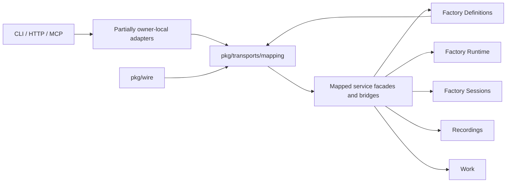
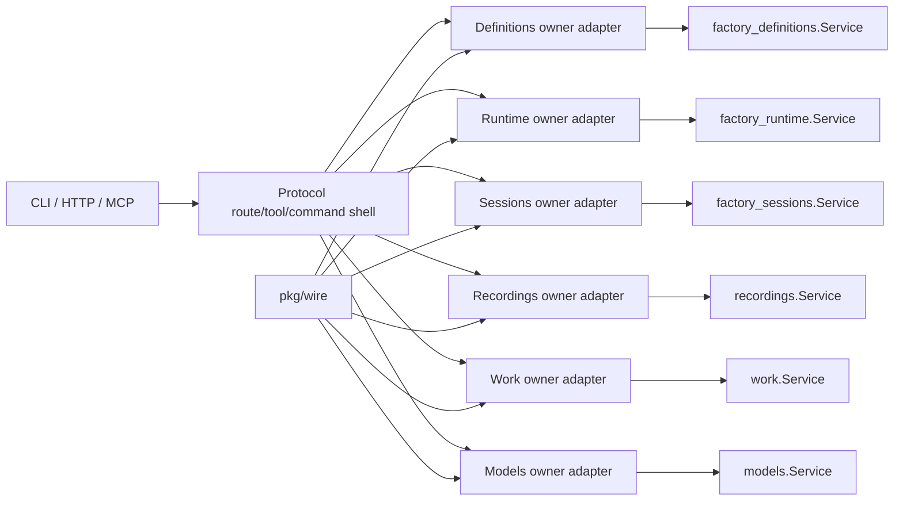
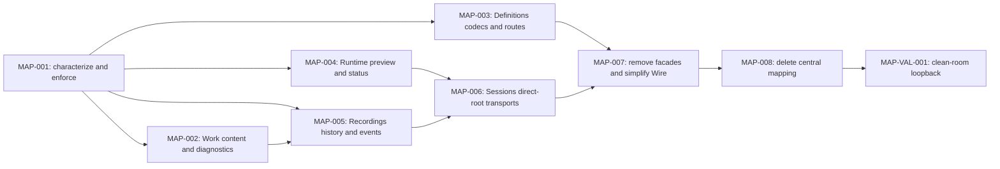

# Transport mapping owner convergence plan

## 1. Problem and desired outcome

### Problem statement

Maintainers cannot reliably locate or change public-boundary behavior because
`pkg/transports/mapping` combines representation conversion, domain policy,
service facades, cross-service composition, compatibility codecs, and dead
conversion paths outside their durable service owners.

### Current behavior and gap

As of 2026-08-25, `pkg/transports/mapping` contains 41 non-test Go files with
approximately 11,700 non-blank production lines and 40 test files with
approximately 12,500 non-blank test lines. The largest families are
`factoryconfig` and `factorysession`, but the root package also publishes
alternate application interfaces such as `RuntimeAPI`, `LiveSessionAPI`,
`InvocationAPI`, and durable session facets.

The package currently performs six materially different jobs:

1. generated OpenAPI-to-service value conversion;
2. authored Factory compatibility, canonicalization, defaults, and validation;
3. HTTP error/status and event-stream adaptation;
4. CLI presentation and validation summaries;
5. application-service facade construction and cross-service bridging; and
6. reverse mappings retained only by tests.

This conflicts with the repository ownership model. Representation conversion
may exist at a public protocol boundary, but domain policy must remain with its
service, owner transports must call service roots directly, Recordings must own
canonical history, and Wire must remain the only application composition
graph. The existing mapping package also creates inverted dependencies: Factory
Definitions compilation and Wire import the central transport package to obtain
their canonical codecs or service facades.

The focused command `go test ./pkg/transports/mapping/...` currently passes.
The current worktree's `make pkg-boundary` run reports four production
violations, including Factory Sessions importing Factory Definitions'
`validationentry` transport subpackage and Models transports importing Factory
Definitions' `workerinference` transport subpackage. Those direct peer-transport
imports are not acceptable target locations and are included in this plan's
cutover work.

### Desired outcome and success measures

The completed repository has no `pkg/transports/mapping` directory. Every
public request reaches exactly one owner transport, crosses one owner service
root before side effects, and is converted by pure owner-local representation
code. Domain codecs, compatibility rules, defaults, validation, redaction, and
projection classification reside in their durable services.

Success is measurable when:

- `rg -n "pkg/transports/mapping" pkg internal cmd tests --glob '*.go'`
  returns no matches;
- `pkg/transports/mapping` does not exist;
- Factory Sessions HTTP receives only `factorysessions.Service`, a logger, and
  protocol mechanics rather than a dependency bag of peer services and mapped
  facets;
- Factory Definitions owns canonical/authored Factory codecs without importing
  generated HTTP contracts from domain compilation or persistence code;
- Recordings owns all canonical event, result, dispatch, artifact, workstation,
  and reconnect projection paths;
- existing CLI, HTTP, MCP, OpenAPI, SSE, and persisted Factory behavior remains
  compatible unless a separately approved behavior-correction task says
  otherwise; and
- `make pkg-boundary`, `make pkg-structure`, `make pkg-file-count`,
  `make verify-fast`, and applicable API smoke tests pass on the change's own
  pull request.

## 2. Scope and constraints

### In scope

- Every production and test file currently below `pkg/transports/mapping`.
- Owner-local Factory Definitions, Factory Runtime, Factory Sessions,
  Recordings, Work, Models, and transport code required to absorb or replace
  that logic.
- Route reassignment required to eliminate cross-owner transport imports.
- Wire simplification required to remove mapped API construction, bridge
  construction, type assertions, and secondary service graphs.
- Characterization and parity coverage needed to preserve public behavior.
- Boundary-checker, package-structure, ownership baseline, and architecture
  documentation updates needed to prevent reintroduction.
- Deletion of dead reverse mappings and redundant generated conversion helpers.

### Non-goals

- Redesigning the public OpenAPI resource model or renaming public fields.
- Removing a documented compatibility alias as part of a structural move.
- Changing Factory scheduling, orchestration, Work admission, provider
  execution, or session lifecycle semantics.
- Converging unrelated top-level CLI or MCP infrastructure beyond the paths
  needed to remove central mapping imports.
- Reorganizing generated OpenAPI files under `pkg/transports/http/generated`.
- Correcting existing behavior, such as silently ignored Work content union
  members, in the same task that relocates it; corrections require separately
  approved acceptance criteria after characterization.

### Assumptions and constraints

- `factory_definitions.Service`, `factory_runtime.Service`,
  `factory_sessions.Service`, `recordings.Service`, `work.Service`, and
  `models.Service` remain the only cross-owner operational contracts.
- Service transports may share pure conversion through a Go `internal`
  package beneath their own `transports` directory. They must not expose a
  second public service-shaped mapping package.
- A pure mapper must not accept `context.Context`, invoke a service, construct
  an adapter, type-assert optional product capabilities, or merge state from
  multiple owners.
- Each migration task introduces an owner path, moves its callers, and deletes
  the replaced central slice before the task is complete. Temporary forwarding
  aliases must not survive the task that introduces their replacement.
- Existing uncommitted user changes are preserved. Implementers must inspect
  the live diff before editing overlapping files.
- Generated files remain generated and are changed only through the canonical
  API generation targets if a contract correction becomes separately approved.

### Open questions

1. Whether Work content union decoding should continue dropping unsupported or
   malformed parts for strict compatibility, or return a typed boundary error.
   This plan preserves current behavior and records a separate correction
   decision after characterization.
2. Whether any non-HTTP owner transport still requires the generated OpenAPI
   Factory shape after route convergence. If not, the proposed owner-internal
   OpenAPI helper can be narrowed to HTTP instead of shared beneath
   `transports/internal`.
3. Whether live canonical event reads have complete Recordings-root coverage
   for every session mode. Any uncovered mode blocks removal of the legacy
   Sessions history bridge and requires an additive Recordings root operation,
   not retention of the bridge.

### Replanning triggers

- Characterization reveals observable incompatibility between current CLI,
  HTTP, and MCP behavior.
- A required owner operation cannot be expressed through the committed service
  root without changing public behavior.
- Recordings cannot address a live or finalized canonical history case without
  a new persistence or consistency decision.
- Moving Factory canonical encoding away from generated OpenAPI structs changes
  serialized bytes for existing fixtures.
- A task must modify the OpenAPI contract rather than only relocate handwritten
  behavior.
- A task grows to contain more than one independently reviewable owner cutover.

## 3. Recommended approach

Use eight independently revertible implementation tasks plus one clean-room
validation loopback. Establish characterization first, then migrate owner
slices in parallel where semantics are independent, converge Recordings before
Sessions, remove central facades from Wire, and delete the package only after
all production callers are gone.

### Decision record

| Option | Decision | Evidence and tradeoff |
| --- | --- | --- |
| Retain one global pure mapping package | Rejected | It keeps representation ownership detached from route ownership, encourages peer imports, and has already accumulated operational interfaces and domain policy. |
| Move current subdirectories wholesale beneath service roots | Rejected | `factoryconfig` contains Definitions policy mixed with OpenAPI conversion, while `factorysession` contains both Sessions and Recordings behavior plus operational facades. Whole-directory moves preserve the wrong boundaries. |
| Owner-local pure mapping plus service-owned policy | Selected | Matches `packaged-structure.md`, makes route ownership discoverable, prevents secondary service graphs, and permits dead mappings to be deleted rather than carried forward. |
| Rewrite all mappings and behavior in one change | Rejected | The surface is too large for one focused review, obscures regressions, and provides no independently releasable cutover points. |

## 4. Customer behavior

### Actors, roles, and permissions

- Maintainers change service or transport behavior and need one durable owner
  location.
- CLI, HTTP, and MCP clients retain their existing permissions and public
  request/response behavior.
- Operators running factories retain the same access to definitions, previews,
  sessions, Work, events, results, dispatches, and artifacts.

### User journeys

The following journeys must remain behaviorally unchanged:

1. Author, validate, save, load, and invoke a Factory Definition.
2. Preview a JavaScript workflow and inspect validation diagnostics.
3. Start, list, read, control, invoke, and delete a Factory Session.
4. Follow ephemeral response events and reconnect to canonical Factory events.
5. Read historical results, dispatches, artifacts, and workstation projections.
6. Submit and read multimodal Work content.
7. Invoke a model with operation bindings through CLI and HTTP.

### Default, loading, empty, success, error, and permission states

- Default values and omitted fields remain byte- or value-compatible with the
  existing generated contract and persisted fixtures.
- Empty lists remain empty rather than becoming missing or `null` where the
  current contract requires an array.
- Success status codes and CLI exit behavior remain unchanged.
- Validation, not-found, conflict, unavailable, reconnect-gap, and expired
  stream outcomes retain their current public error families.
- Authorization and permission behavior is unchanged because this plan adds no
  new operation or access path.

### Accessibility, keyboard, focus, responsive, and localization behavior

Not applicable. This is a backend ownership refactor with no intended UI or
customer-copy change. Existing generated UI consumers remain compatibility
checks.

### Visual references

Not applicable. No visual behavior changes.

## 5. Contracts and data

### Contract inventory and compatibility classification

| Contract | Classification | Required handling |
| --- | --- | --- |
| OpenAPI schemas and generated Go/TypeScript clients | Unchanged | Preserve exact fields, unions, enum spellings, omission rules, and route responses. Regenerate only if a separately approved contract correction is required. |
| CLI command grammar and JSON/NDJSON output | Unchanged | Move presentation to owner CLI packages while preserving output and exit behavior. |
| MCP schemas and tool envelopes | Unchanged | Owner MCP packages continue publishing the same schema and result envelopes. |
| Canonical Factory Event and response-event wire formats | Unchanged | Recordings owns canonical events; Sessions owns ephemeral response events. Preserve IDs, ordering, cursors, and SSE representation. |
| Persisted Factory Definition JSON and split authored layout | Unchanged | New Definitions-owned codecs must round-trip all accepted fixtures and emit canonical bytes matching the characterized output. |
| Internal Go mapping interfaces | Breaking internal cleanup | Delete alternate APIs and bridges after direct owner-root cutover. All repository callers migrate in the same task. |
| Package import paths under `pkg/transports/mapping` | Breaking internal cleanup | Remove all callers and delete the package. No compatibility shim remains after MAP-008. |

### HTTP API, CLI, configuration, and event changes

No public change is intended. Route implementation ownership changes behind the
generated HTTP interface. Authored Factory aliases and deprecated fields retain
their current acceptance or rejection behavior until a dedicated deprecation
plan changes them.

### Persisted data, migration, retention, and rollback

No persisted migration is planned. The Definitions codec cutover must prove
canonical byte parity for representative fixtures and semantic round-trip
parity for the full accepted corpus. Recordings retention and replay formats do
not change.

Rollback is code-only: revert the owner cutover task. No data downgrade or
repair procedure should be necessary. A codec byte-parity failure is a stop
condition and blocks deletion of the old codec.

### Generated artifacts and consumers

Generated files are unchanged unless a separate contract delta is approved.
Consumers to validate include:

- `pkg/transports/http/generated/server.gen.go`;
- `pkg/transports/http/client/client.gen.go`;
- `ui/src/api/generated/openapi.ts`;
- CLI JSON and NDJSON renderers;
- owner MCP tool schemas and clients; and
- internal packaged Factory catalog and snapshot consumers.

## 6. Architecture and state

### Current-state flow

The central package sometimes maps a value, sometimes invokes a service,
sometimes discovers a capability, and sometimes chooses canonical policy. This
creates a second application layer and obscures mutation and projection
ownership.

### Target-state flow

### Runtime sequence and dependencies

1. The top-level protocol shell receives the raw generated request or CLI/MCP
   input and selects the already-constructed owner adapter.
2. The owner adapter performs syntax-level decoding and maps into its owner
   root request.
3. The owner service performs normalization, compatibility, validation,
   mutation, projection, and typed failure classification.
4. The owner adapter maps the detached result to generated, CLI, or MCP output
   and applies protocol-only status, framing, and presentation.
5. Wire constructs each service and adapter once. No mapping package constructs
   or joins services at request time.

### Canonical, projected, and ephemeral state

- Factory Definitions owns canonical authored/effective definition values,
  compatibility policy, validation, layout policy, and persisted codec rules.
- Factory Runtime owns live orchestration state and workflow preview policy.
- Factory Sessions owns Factory Session identity, lifecycle, invocation, live
  projections, and ephemeral response-event cursors.
- Recordings owns the canonical Factory Event ledger, historical results,
  dispatches, artifacts, workstation views, replay, and reconnect projection.
- Work owns Work content, admission, lineage, and Work read models.
- Models owns model invocation request/result behavior.
- Generated OpenAPI values are ephemeral boundary representations and never
  canonical state.

### Mutation ownership and consistency boundaries

Mapping code performs no mutation. Each command crosses the corresponding
service root before state changes. Recordings reads canonical history without
mutating Sessions. Sessions response-event detachment stops only the observer;
it must not cancel the Factory Session run. Factory codec changes do not write
data during mapping and remain inside Definitions persistence transactions.

### Legacy path and removal plan

| Current path | Action | Removal gate |
| --- | --- | --- |
| Root alternate API interfaces and error aliases | Delete after adapters call owner roots | MAP-007 |
| `runtime_api.go` cross-owner facade | Delete after Runtime, Definitions, and Recordings route split | MAP-007 |
| `factoryconfig` central codec | Split into Definitions domain codecs and owner OpenAPI mapping | MAP-003 |
| `factorysession` `LiveAPI`, `InvocationAPI`, `DurableAPI` | Delete after direct Sessions root cutover | MAP-006 |
| Durable history/inspection bridges | Delete after Recordings covers canonical queries | MAP-005 |
| `optional` helpers | Inline or move exact HTTP value primitive | MAP-007 |
| `workcontent` central mapper | Move to Work owner-internal OpenAPI mapping | MAP-002 |
| `workerdiagnostics` | Inline sole live projection and delete dead reverse maps | MAP-002 |
| Mapping test-only packages and fixtures | Move with owner behavior | MAP-003, MAP-005, MAP-006, MAP-008 |
| Entire `pkg/transports/mapping` directory | Delete and prevent reintroduction | MAP-008 |

### Detailed source-to-destination inventory

#### Root package

| Current file | Destination |
| --- | --- |
| `contract.go` | Delete operational interfaces and aliases; move invocation response copying to Sessions owner OpenAPI mapping; use owner-root errors/constants directly. |
| `runtime_api.go` | Delete; Runtime, Definitions, and Recordings adapters call their roots directly. |
| `surface.go` | Recordings projection/OpenAPI for canonical events; Sessions HTTP for ephemeral response events; delete alternate subscription interfaces. |
| `factory_preview.go` | Runtime domain preview classification plus Runtime owner OpenAPI and CLI presentation. |
| `factory_status.go` | Runtime HTTP observation mapping. |
| `factory_validation.go` | Definitions domain taxonomy/diagnostics policy, Definitions owner OpenAPI mapping, and Definitions CLI rendering. |
| `workflow.go` | Sessions live-result mapping and Recordings canonical result/event/artifact mapping. |

#### Factory configuration package

| Current file or group | Destination |
| --- | --- |
| `openapi_factory.go` | Generated copying to Definitions `transports/internal/openapi`; canonicalization, aliases, retired-field rejection, operation validation, and runtime resource interpretation to Definitions compilation/compatibility. |
| `factory_config_metadata.go` | Retire public `FactoryConfigMapper`; Expand/Flatten become Definitions codec operations; field copying becomes owner OpenAPI mapping; orchestrator defaults become Definitions policy. |
| `authored_source.go` | Definitions authored JSON codec and unknown-field diagnostics, using a Definitions-owned schema inventory rather than reflection over generated HTTP structs. |
| `authored_helpers.go` | Move with authored codec and make private. |
| `factory_config_guard_resource.go` and `_internal.go` | Generated field copying to owner OpenAPI; enum compatibility/canonicalization to Definitions compilation. |
| `factory_config_worker_workstation.go` and `_internal.go` | Generated field copying to owner OpenAPI; type inference, scheduled-model compatibility, operation normalization, and defaults to Definitions compilation/validation. |
| `factory_config_mapping.go` and `_internal.go` | Work/input/return field copying to owner OpenAPI; effective selection policy to Definitions invocation policy. |
| `factory_config_layout.go` | Layout DTO copying to owner OpenAPI; structural and numeric rules to Definitions validation/authoring-layout. |
| `layout_annotations.go` | Annotation/image/base64/size/path validation to Definitions validation/authoring-layout; generated copying to owner OpenAPI. |
| `invocation_examples_compatibility.go` | Definitions compilation compatibility policy. |
| `runtime_helpers.go` | Definitions authored compilation or workstation-execution policy. |
| `authored/agents_config.go` | `factory_definitions/internal/services/authoring_layout/authoredlayout`. |
| `authored/agents_frontmatter_strict.go` | Same authored codec; strict field and retired-alias policy remain domain-owned. |

#### Factory Session package

| Current file | Destination |
| --- | --- |
| `durable_contract.go` | Delete; use Sessions root or root-published capability. |
| `factory_session_execution.go` | Delete `DurableAPI`; move only start request/result representation copying to Sessions owner OpenAPI. |
| `factory_session_execution_inputs.go` | Delete history/inspection bridges and capability assertions; keep request decoding in the actual Sessions or Recordings adapter. |
| `factory_session_execution_errors.go` | Sessions HTTP/MCP error mapping for session operations; Recordings HTTP/MCP error mapping for history. |
| `factory_session_lifecycle.go` | Sessions owner OpenAPI for values; Sessions HTTP for statuses; typed outcome classification in Sessions. |
| `factory_session_listing.go` | Sessions owner OpenAPI; list merge and canonicalization in Sessions root operation. |
| `factory_session_projection.go` | Historical projections to Recordings; genuinely live result projection to Sessions; retry/failure classification to result-producing service. |
| `factory_session_mapper.go` | Delete production-unused reverse response maps; move required request decoders to Sessions owner OpenAPI. |
| `factory_session_resource_capacity.go` | Sessions HTTP mapping backed by a Sessions-owned typed capacity-change result. |
| `helpers.go` | Private forward-only Sessions OpenAPI helpers; delete unused reverse helpers. |
| `invocation_api.go` | Delete; Sessions adapters call the root directly. |
| `live_api.go` | Delete; Sessions adapters call the root directly. |
| `response_events.go` | Sessions HTTP/SSE using owner cursor and event values directly. |

#### Remaining packages

| Current package | Destination |
| --- | --- |
| `optional` | Delete and inline; retain only a demonstrably shared HTTP-specific primitive under `pkg/transports/http/apitypes`. |
| `workcontent` | `pkg/services/work/transports/internal/openapi/workcontent`; preserve ordering and current compatibility behavior during relocation. |
| `workerdiagnostics` | Inline the sole production world-view projection into Recordings transport mapping; delete production-unused reverse conversions. |
| `taxonomyvalidationtests` | Definitions validation tests. |
| `factoryconfig/mappingtests` | Definitions owner OpenAPI mapper tests. |
| `factoryconfig/openapitests` | Definitions generated-contract parity tests with their support files and fixtures. |

## 7. Failure modes and quality attributes

| Case | Detection | Customer outcome | State/recovery | Telemetry | Evidence |
| --- | --- | --- | --- | --- | --- |
| Unknown or retired Factory field changes behavior | Characterization fixture mismatch | Same warning or rejection as before | No write; fix owner codec before cutover | Existing safe validation diagnostics | Definitions codec fixture suite |
| Canonical Factory bytes drift | Golden/hash mismatch | Deployment stopped before merge | No migration; retain old path until parity | CI artifact records mismatch | Canonical encode round-trip tests |
| Invalid layout annotation, image, or base64 bypasses validation | Definitions validation test | Same targeted validation error | Definition remains unpersisted | Validation code/path only; no payload logging | Layout boundary fixtures |
| Session request mapper applies semantic defaults | Boundary review or parity mismatch | No change allowed | Move default to Sessions and retry test | Sessions operation logs | Sessions request/service tests |
| Session lifecycle status/error mapping drifts | HTTP/MCP/CLI parity failure | Same status, code, and safe message | No state repair; mapper fix and retest | Existing operation logs | Lifecycle parity tests |
| Canonical history still falls back to Sessions | Structural import check | No customer-visible change until owner coverage exists | Add Recordings root capability; do not delete fallback early | Recordings query diagnostics | Recordings history and reconnect tests |
| Invalid reconnect cursor is misclassified | SSE/probe contract failure | Same invalid-cursor or gap response | Stream remains read-only; client may reconnect correctly | Stream gap/recovery diagnostics | SSE reconnect contract tests |
| Observer cancellation cancels the run | Concurrency test | Observer detaches; run continues | Re-subscribe with a valid cursor | Session stream detach logs | Response-event race/functional test |
| Work content part is reordered, lost, or mutated | Round-trip fixture failure | Existing order and metadata retained | No admission side effect before decode completes | Safe content counts only | Work content mapper/admission tests |
| Unsupported Work union behavior changes accidentally | Characterization failure | Preserve current behavior in this plan | Separate correction plan if desired | Boundary validation diagnostics | Explicit unsupported-member test |
| Provider continuation leaks internal data | Redaction/projection test | Only allowed provider-session metadata appears | Projection fails closed; canonical event unchanged | Redaction failure diagnostics without secrets | Recordings event tests |
| Cross-owner transport import is introduced | `make pkg-boundary` | Build/CI fails | Move request/value to root or route to owner | CI finding | Package boundary gate |
| Mapping package is reintroduced | Structure checker | Build/CI fails | Put behavior under owner | CI finding | Negative package-structure test |

### Performance and scale

- Mapping remains linear in input collection size and must preserve input order.
- Avoid additional JSON marshal/unmarshal round trips where typed copying is
  possible.
- Canonical event streaming must remain incremental and must not buffer an
  unbounded recording or response stream.
- Factory layout image byte limits and Work content size limits remain enforced
  by their domain owners before expensive processing.
- No new network calls, remote dependencies, goroutines, or background loops
  are introduced by representation conversion.

### Reliability and availability

- Each task leaves the executable CLI/HTTP/MCP spine releasable.
- Historical reads must not lose their current live/finalized coverage during
  Recordings cutover.
- Response-event subscriptions retain backpressure, retention-gap, detachment,
  and request-cancellation behavior.
- No compatibility facade is removed before its owner operation and all callers
  are proven in the same task.

### Security and privacy

- Mappers and diagnostics must not log request payloads, prompt contents,
  secrets, tokens, raw provider continuations, or artifact bodies.
- Provider continuation conversion remains fail-closed and exposes only the
  approved provider-session metadata.
- Safe authored layout path validation remains in Factory Definitions.
- Work remote/data content safety remains in Work materialization and is not
  weakened by transport relocation.

### Cost and resource limits

All planned verification uses local, free dependencies. No remote or paid
provider calls are required. Test fixtures must stay bounded by the existing
layout, event, and content limits.

### Observability and operational readiness

No new service operation is intended. Existing owner operations retain their
structured start/outcome logs. Transport mappings must not add payload logging.
New typed failures introduced to replace mapper inference must be covered by
owner operation logs and mapped to the established public error family.

Alerting changes are not applicable because the migration introduces no new
runtime signal. CI stop conditions are any public parity failure, canonical
codec drift, new package-boundary violation, service cycle, race failure, or
API smoke failure.

## 8. Rollout, compatibility, and rollback

### Deployment and feature-flag sequence

No runtime feature flag is required. Each owner cutover follows this sequence:

1. add characterization when the behavior is not already protected;
2. introduce the owner operation or pure owner mapper beside the old path;
3. declare the owner path canonical in code and tests;
4. migrate all callers for that bounded concern;
5. delete the replaced central code and tests in the same task; and
6. run owner-focused and boundary verification before merging.

### Compatibility interval

Compatibility exists within a task branch only. No release should contain two
supported operational APIs for the same behavior. Public aliases and persisted
formats remain supported according to their existing contracts.

### Monitoring and stop conditions

Stop the cutover when:

- a public JSON, CLI, MCP, SSE, or persisted fixture changes unexpectedly;
- Recordings cannot serve a previously supported canonical history request;
- owner adapters require a peer transport import;
- a service root would need generated OpenAPI values in its public contract;
- a new application dependency bag or optional capability assertion appears;
- focused race or streaming tests fail; or
- the implementation task cannot delete its replaced central slice.

### Rollback procedure

Revert the affected owner cutover commit or pull request. Because no public
schema or persisted-data migration is intended, rollback restores the previous
code path without data repair. If canonical encoding changed bytes, do not
deploy or merge; restore parity before proceeding.

### Deprecation and cleanup owner

The implementer of each task owns deletion of its replaced central slice. The
MAP-008 implementer owns the final package deletion, checker updates, stale
baseline removal, and documentation cleanup. Review owns confirming that no
temporary forwarding path survives.

## 9. Implementation strategy

### Coverage assessment and characterization needs

The central mapping suite passes, but passing package-local tests do not prove
owner-route integration. Existing tests provide substantial Factory config and
session mapping coverage. Characterization must be added or explicitly
relocated for:

- canonical Factory byte output and unknown-field diagnostics;
- route-level CLI/HTTP/MCP validation parity;
- live versus durable session list merging;
- canonical versus ephemeral event ownership and reconnect behavior;
- provider continuation redaction;
- Work content unsupported-member behavior;
- response-event detachment and cancellation; and
- reverse mappers identified as production-unused before deletion.

### Parent behavior lanes

**BEH-MAP-001 — Owner-local public boundary behavior:** A maintainer can trace
each public request from one owner adapter through one owner root, while clients
observe the same contract and `pkg/transports/mapping` no longer exists.

This is justified bounded enabling work: the primary outcome is architectural
enforcement and maintainability rather than a new customer feature. It cannot
be safely folded into one customer behavior slice because the package spans
independent Definitions, Runtime, Sessions, Recordings, Work, and Models
owners. Each task nevertheless proves an executable public or owner-root spine.

### Narrow executable spine

MAP-001 freezes representative public behavior. MAP-002 establishes the first
owner-local shared resource mapper. MAP-003 and MAP-004 prove Definitions and
Runtime owner routes. MAP-005 establishes Recordings as the canonical history
spine. MAP-006 then reduces Sessions to its root-owned surface. MAP-007 removes
the alternate application graph, and MAP-008 deletes the package and installs
the structural prevention gate.

### Justified enabling work

- Characterization is a horizontal enabling task because structural movement
  across six owners would otherwise have no reliable behavioral oracle.
- The final package-deletion/checker task is horizontal because its independently
  useful outcome is enforcement that prevents architecture regression.

### Migration or strangler sequence

- Add owner paths alongside central functions only long enough to migrate the
  bounded concern.
- Prefer direct caller migration over forwarding aliases.
- Delete dead reverse conversions as soon as production usage is proven absent.
- Converge Recordings before deleting Sessions history bridges.
- Converge owner adapters before simplifying Wire.
- Delete the root package only after `rg` proves all production callers are gone.

### Shared-surface ownership

| Shared surface | Task owner |
| --- | --- |
| Work content generated union | MAP-002, Work owner |
| Factory canonical/authored codec | MAP-003, Factory Definitions owner |
| Factory generated representation | MAP-003, Definitions owner transports |
| Workflow preview/status | MAP-004, Factory Runtime owner |
| Canonical events/history/artifacts | MAP-005, Recordings owner |
| Session lifecycle/result/response events | MAP-006, Factory Sessions owner |
| Wire adapter construction | MAP-007, Wire owner |
| Structure/boundary gates and final deletion | MAP-008 |

## 10. Verification strategy

| Behavior/gate | Scope | Dependency fidelity | Cadence | Cost | Proves | Does not prove |
| --- | --- | --- | --- | --- | --- | --- |
| Owner mapper unit tests | Unit | None | Per change | Free | Exact field, enum, pointer, ordering, and error conversion | Route registration or service wiring |
| Definitions codec fixture and parity tests | Unit/integration | Local real filesystem fixtures | Per PR | Free | Authored acceptance, canonical bytes, layout and alias behavior | Full CLI or HTTP journey |
| Owner root plus adapter tests | Functional | Controlled external effects | Per PR | Free | Public request crosses the intended owner and maps typed outcomes | Process-level startup |
| CLI/HTTP/MCP parity tests | Functional | Controlled | Per PR | Free | Equivalent contract outcomes across transports | Remote network dependencies |
| Recordings replay/reconnect tests | Integration | Local real storage and production wiring | Per PR | Free | Canonical history, event ordering, cursor and artifact behavior | Paid provider availability |
| Response-event race tests | Integration | Controlled concurrency | Risk-triggered and final PR | Free | Detachment, cancellation, backpressure, and retention behavior | Remote client behavior |
| `make pkg-boundary` | Static architecture | Repository real | Per change | Free | No prohibited peer transport/subpackage dependency | Runtime correctness |
| `make pkg-structure` and `make pkg-file-count` | Static architecture | Repository real | Per change | Free | Approved package shape and bounded package size | Semantic behavior |
| `make verify-fast` | Unit/functional aggregate | Controlled/local real | Per PR | Free | Short Go/UI/typecheck regression tier | Full release behavior |
| `make api-smoke` | Functional/contract | Generated schema and local real server | Final relevant tasks | Free | REST contract compatibility | CLI/MCP behavior |
| MAP-VAL-001 clean-room journey | End-to-end | Local real with controlled external effects | Final loopback | Free | Cross-task wiring and customer entry points | Remote paid provider behavior |

### Paid-validation budgets and evidence-reuse keys

Not applicable. The migration does not require a billable remote dependency.
If an unexpected provider-specific edge is discovered, it requires replanning
with an explicit budget rather than an unbounded call.

### Remaining unproven edges and owning gates

- Remote provider availability is unrelated and remains outside scope.
- Browser visual behavior is unchanged; generated UI typecheck and existing UI
  tests own client compatibility.
- Release packaging beyond API/CLI build compatibility remains owned by the
  normal review-stage `verify-pr` or release gates.

## 11. Task dependency graph

## 12. Tasks

### MAP-001 — Characterize central mapping behavior and enforce mapper purity

**Parent behavior:** BEH-MAP-001 — public boundary behavior is owner-local and
contract-compatible.

**Problem:** Structural relocation is unsafe while several compatibility,
streaming, and projection behaviors lack an explicit owner-level oracle.

**Outcome:** A reviewable characterization suite and structural rule define
what must remain compatible and prevent new operational mapping behavior.

**Plan reference:**
`C:/Users/andre/work/portos/infinite-you/.claude/worktrees/test-cleanup/docs/internal/development/plans/backlog/transport-mapping-owner-convergence.md#map-001--characterize-central-mapping-behavior-and-enforce-mapper-purity`

**Actor and trigger:** A maintainer changes mapping or owner transport code and
runs focused tests or repository boundary gates.

**Dependencies:** None.

**Parallel and shared-surface ownership:** This task precedes all migration
tasks and owns characterization fixtures and the mapper-purity structural rule.

**Scope:**

- In: characterize Factory codec bytes/diagnostics, session mapping parity,
  event redaction/reconnect, response-event detachment, Work content ordering,
  and production-unused reverse mapping inventory; add a checker for operational
  mapping behavior.
- Out: moving production mapping implementations or correcting characterized
  behavior.

**Implementation constraints:**

- Do not weaken existing boundary gates or add baseline exceptions.
- Tests must exercise public or owner-root contracts where feasible.
- Do not add sleeps as the default synchronization strategy.

**Acceptance criteria:**

- [ ] Given every current compatibility-sensitive mapping family, when its
  characterization suite runs, then current output, errors, ordering, and
  omission behavior are captured by named assertions.
- [ ] Given a mapping package that declares a service-shaped interface, accepts
  `context.Context`, constructs an adapter, starts a goroutine, or type-asserts
  an optional product capability, when the structural checker runs, then it
  fails with an actionable owner-local remediation.
- [ ] Given the current repository, when the focused mapping suite runs, then it
  passes and the known package-boundary failures are recorded without being
  baselined.

**Verification:**

- Behavioral witness: existing Factory, session, event, and Work content
  fixtures produce the characterized outputs.
- Executable-spine effect: `preserve`.
- Required evidence:
  - Scope: unit and functional.
  - Dependency fidelity: controlled and local real fixtures.
  - Command or procedure: `go test ./pkg/transports/mapping/...` and the new
    focused checker tests.
  - Proves: the structural migration has a regression oracle.
  - Does not prove: owner cutovers or final route wiring.
- Highest feasible level: functional with local fixtures.
- Remaining unproven edges: owner route integration -> MAP-002 through MAP-006;
  final wiring -> MAP-VAL-001.

**Paid validation, when applicable:** Not applicable.

**Operational and rollout notes:** Test-only change. Roll back by reverting the
task. No customer telemetry change.

**Escalation:** Stop and return a structured blocker when characterization
reveals inconsistent public behavior that cannot be preserved by one owner
without a contract decision.

**Handoff artifacts:** Characterization tests, production-unused symbol
inventory, structural checker, and exact baseline commands.

### MAP-002 — Make Work own shared content conversion and remove diagnostics dead code

**Parent behavior:** BEH-MAP-001 — public boundary behavior is owner-local and
contract-compatible.

**Problem:** Work content conversion is globally located despite a clear Work
owner, while `workerdiagnostics` retains mostly unused reverse conversion and
Models imports a peer Definitions transport mapper.

**Outcome:** Work exposes a pure owner-internal OpenAPI content mapper, Models
maps its own invocation values, and the central diagnostics/worker-inference
mapping debt is deleted.

**Plan reference:**
`C:/Users/andre/work/portos/infinite-you/.claude/worktrees/test-cleanup/docs/internal/development/plans/backlog/transport-mapping-owner-convergence.md#map-002--make-work-own-shared-content-conversion-and-remove-diagnostics-dead-code`

**Actor and trigger:** A Work, Models, Definitions, Sessions, or Recordings
transport maps generated Work content or model operation bindings.

**Dependencies:** MAP-001.

**Parallel and shared-surface ownership:** May run with MAP-003 and MAP-004.
This task exclusively owns the Work content generated-union import path and
removal of `workerdiagnostics`/`workerinference` dependencies.

**Scope:**

- In: move `workcontent`; update all callers; map Models bindings directly to
  Models-owned values; inline the sole live diagnostics projection into
  Recordings; delete unused reverse maps and obsolete packages.
- Out: changing unsupported Work content behavior or worker diagnostic schema.

**Implementation constraints:**

- Preserve content order, JSON values, metadata cloning, deprecated file-field
  handling, and current nil/empty behavior.
- No service transport may import another service's transport subpackage.

**Acceptance criteria:**

- [ ] Given every supported Work content part, when it crosses each existing
  consumer boundary, then order and content remain identical to the
  characterized result.
- [ ] Given Models CLI and HTTP operation bindings, when mapped, then they
  produce equivalent Models-owned requests without importing Definitions
  transport code.
- [ ] Given the production source tree, when imports are scanned, then
  `pkg/transports/mapping/workcontent`, `workerdiagnostics`, and the obsolete
  `workerinference` path have no production callers and are deleted.

**Verification:**

- Behavioral witness: multimodal Work content and model binding fixtures
  produce unchanged owner requests and responses.
- Executable-spine effect: `extend`.
- Required evidence:
  - Scope: unit and functional.
  - Dependency fidelity: controlled.
  - Command or procedure: focused Work, Models, Definitions, and Recordings
    transport tests plus `make pkg-boundary`.
  - Proves: shared content conversion is owner-local and peer imports are gone.
  - Does not prove: Factory codec, session, or history convergence.
- Highest feasible level: functional owner-adapter tests.
- Remaining unproven edges: full customer invocation -> MAP-VAL-001.

**Paid validation, when applicable:** Not applicable.

**Operational and rollout notes:** Preserve current union behavior. Record any
desired strictness correction as a separate follow-up. Roll back by reverting
the owner import cutover.

**Escalation:** Stop if a caller requires an operational Work capability rather
than pure value conversion; publish that capability at Work root instead of
widening the mapper.

**Handoff artifacts:** Work owner mapper, migrated callers, deleted dead
packages, and parity evidence.

### MAP-003 — Make Factory Definitions own codecs, validation mapping, and routes

**Parent behavior:** BEH-MAP-001 — public boundary behavior is owner-local and
contract-compatible.

**Problem:** Factory configuration mapping is a policy engine and persistence
codec located under transports, while legacy Factory routes and callers import
mapping internals rather than the Definitions root.

**Outcome:** Definitions owns authored/canonical codecs and compatibility
policy, owner transports own generated conversion and presentation, and all
central `factoryconfig` code is deleted.

**Plan reference:**
`C:/Users/andre/work/portos/infinite-you/.claude/worktrees/test-cleanup/docs/internal/development/plans/backlog/transport-mapping-owner-convergence.md#map-003--make-factory-definitions-own-codecs-validation-mapping-and-routes`

**Actor and trigger:** A client validates, saves, loads, snapshots, catalogs, or
renders a Factory Definition.

**Dependencies:** MAP-001.

**Parallel and shared-surface ownership:** May run with MAP-002 and MAP-004.
This task owns all Factory config mapper files, fixtures, generated parity
tests, and Definitions route/presentation cutover.

**Scope:**

- In: split every `factoryconfig` file according to the detailed inventory;
  move `AGENTS.md` parsing; introduce Definitions canonical/authored codecs;
  move generated conversion to owner-internal OpenAPI mapping; move validation
  routes and CLI rendering; update Wire, snapshots, packaged catalog, and test
  utilities; delete replaced central code.
- Out: public schema changes or compatibility alias removal.

**Implementation constraints:**

- Definitions domain compilation and persistence must not import generated HTTP
  types.
- Canonical byte output and accepted/rejected fixtures must remain compatible.
- CLI and MCP must call Definitions root operations rather than importing an
  HTTP/mapping sibling.

**Acceptance criteria:**

- [ ] Given every accepted and rejected Factory fixture, when processed by the
  new Definitions codec and validation service, then the outcome and safe
  diagnostics match characterization.
- [ ] Given a canonical Factory config, when encoded, decoded, and encoded
  again, then canonical bytes and semantic values match the required fixtures.
- [ ] Given Factory validation through CLI, HTTP, and MCP, when invoked, then
  each transport calls the Definitions root and returns the established result.
- [ ] Given Definitions production code, when imports are scanned, then it does
  not import `pkg/transports/mapping` or generated HTTP contracts from domain
  compilation/persistence paths.
- [ ] All central `factoryconfig`, authored, taxonomy, mapping-test, and
  OpenAPI-test files have moved or been deleted.

**Verification:**

- Behavioral witness: Factory source, expanded layout, snapshot, packaged
  catalog, and validation fixtures round-trip through Definitions-owned code.
- Executable-spine effect: `increase_fidelity`.
- Required evidence:
  - Scope: unit, functional, and integration.
  - Dependency fidelity: local real filesystem fixtures and production service
    wiring.
  - Command or procedure: focused Definitions tests, config contract smoke,
    packaged catalog checks, CLI validation tests, `make api-smoke`, and
    `make pkg-boundary`.
  - Proves: Definitions owns its data format and public routes.
  - Does not prove: Runtime preview or Session/history convergence.
- Highest feasible level: integration with production Definitions wiring.
- Remaining unproven edges: full process journey -> MAP-VAL-001.

**Paid validation, when applicable:** Not applicable.

**Operational and rollout notes:** Canonical byte drift is a stop condition. No
data migration or feature flag. The task owns deletion of its central slice.

**Escalation:** Stop if a domain-owned codec cannot preserve canonical bytes
without importing generated types; report the exact fields and smallest
contract decision required.

**Handoff artifacts:** Definitions codecs, owner transport mappers and routes,
moved fixtures, deleted central package family, and parity report.

### MAP-004 — Make Factory Runtime own workflow preview and status projection

**Parent behavior:** BEH-MAP-001 — public boundary behavior is owner-local and
contract-compatible.

**Problem:** Workflow preview mapping decides blocking policy and Sessions HTTP
hosts Runtime preview/status collaborators and routes.

**Outcome:** Runtime returns an already-classified preview result and owns its
HTTP/MCP/CLI mapping, status routes, and presentation.

**Plan reference:**
`C:/Users/andre/work/portos/infinite-you/.claude/worktrees/test-cleanup/docs/internal/development/plans/backlog/transport-mapping-owner-convergence.md#map-004--make-factory-runtime-own-workflow-preview-and-status-projection`

**Actor and trigger:** A client previews or validates workflow source, or reads
Factory Runtime status.

**Dependencies:** MAP-001.

**Parallel and shared-surface ownership:** May run with MAP-002 and MAP-003.
This task owns root `factory_preview.go` and `factory_status.go`.

**Scope:**

- In: move blocking-diagnostic classification into Runtime; add pure Runtime
  OpenAPI projection; move CLI rendering and HTTP/MCP routes; remove Runtime
  collaborators from Sessions HTTP.
- Out: workflow language, source-resolution, or policy rule changes.

**Implementation constraints:**

- Generated values remain in Runtime transports, not Runtime domain logic.
- Preview classification must be deterministic and transport-independent.

**Acceptance criteria:**

- [ ] Given preview source resolution, artifact-root, syntax, and policy
  diagnostics, when Runtime returns its result, then blocking diagnostics are
  already classified without transport inference.
- [ ] Given CLI, HTTP, and MCP preview requests, when invoked, then they return
  compatible results through the Runtime owner.
- [ ] Given a status request, when invoked, then Runtime owns projection and
  HTTP representation without a central `FactoryStatusAPI` facade.
- [ ] Sessions HTTP has no workflow preview or Factory Runtime status
  collaborator.

**Verification:**

- Behavioral witness: canonical preview and status fixtures match previous
  outputs across transports.
- Executable-spine effect: `extend`.
- Required evidence:
  - Scope: unit and functional.
  - Dependency fidelity: controlled/local real source fixtures.
  - Command or procedure: Runtime preview/status tests, CLI/MCP parity tests,
    API smoke, and package-boundary checks.
  - Proves: preview/status behavior is Runtime-owned.
  - Does not prove: Sessions or Recordings route convergence.
- Highest feasible level: functional owner transport tests.
- Remaining unproven edges: full runtime server assembly -> MAP-VAL-001.

**Paid validation, when applicable:** Not applicable.

**Operational and rollout notes:** No feature flag. Roll back by restoring the
previous route registration and Runtime mapper together.

**Escalation:** Stop if a preview diagnostic depends on mutable Sessions state;
report the exact dependency and required owner contract.

**Handoff artifacts:** Runtime-classified result, owner mappers/routes,
Sessions dependency removal, and parity evidence.

### MAP-005 — Make Recordings the sole canonical history and event projection owner

**Parent behavior:** BEH-MAP-001 — public boundary behavior is owner-local and
contract-compatible.

**Problem:** Canonical event, result, dispatch, artifact, and workstation
mapping is split between central mapping, Sessions bridges, Recordings HTTP,
and Recordings MCP.

**Outcome:** Recordings root and owner transports serve every canonical history
path directly, with no Sessions history bridge or cross-transport mapper import.

**Plan reference:**
`C:/Users/andre/work/portos/infinite-you/.claude/worktrees/test-cleanup/docs/internal/development/plans/backlog/transport-mapping-owner-convergence.md#map-005--make-recordings-the-sole-canonical-history-and-event-projection-owner`

**Actor and trigger:** A client reads or follows canonical Factory events,
results, dispatches, artifacts, or workstation history.

**Dependencies:** MAP-001 and MAP-002.

**Parallel and shared-surface ownership:** May begin with MAP-003/MAP-004 after
MAP-002. This task owns canonical event/history mapping and removal of legacy
history bridges.

**Scope:**

- In: move historical portions of `surface.go`, `workflow.go`, and
  `factorysession` projection/error/input files; add any missing Recordings root
  capability; move provider continuation sanitization into Recordings policy;
  share pure owner-internal representation with HTTP/MCP; delete legacy
  Sessions fallbacks when coverage is complete.
- Out: ephemeral Factory response events, which remain Sessions-owned.

**Implementation constraints:**

- Recordings transports call `recordings.Service` directly.
- No Recordings MCP import of Recordings HTTP or Sessions mapping.
- Event order, cursor behavior, redaction, artifact visibility, and historical
  failure semantics remain stable.

**Acceptance criteria:**

- [ ] Given every currently supported live or finalized canonical history
  query, when executed, then Recordings serves it without a Sessions history or
  inspection bridge.
- [ ] Given a provider continuation in a canonical event, when projected, then
  only approved provider-session metadata reaches the public representation.
- [ ] Given valid, stale, missing, corrupt, and gap reconnect cases, when read
  through HTTP or MCP, then existing public outcomes are preserved.
- [ ] `legacy_history.go`, `DurableHistoryBridge`, `DurableInspectionBridge`,
  and central historical mapping are deleted.

**Verification:**

- Behavioral witness: canonical event, result, dispatch, artifact, and
  workstation fixtures are served from Recordings for live/finalized cases.
- Executable-spine effect: `increase_fidelity`.
- Required evidence:
  - Scope: unit, integration, and functional.
  - Dependency fidelity: local real recording storage and production wiring.
  - Command or procedure: Recordings projection/replay tests, HTTP/MCP history
    tests, SSE reconnect tests, race tests, and package-boundary checks.
  - Proves: canonical history has one owner and preserves public behavior.
  - Does not prove: ephemeral response-event behavior or Sessions direct-root
    convergence.
- Highest feasible level: integration with production Recordings wiring.
- Remaining unproven edges: assembled server journey -> MAP-VAL-001.

**Paid validation, when applicable:** Not applicable.

**Operational and rollout notes:** Do not remove a fallback until every
characterized history mode is covered. Missing coverage is a replan trigger,
not permission to retain the bridge indefinitely.

**Escalation:** Stop with a matrix of uncovered live/finalized cases if the
Recordings root lacks a required consistency or persistence contract.

**Handoff artifacts:** Recordings root additions, owner-local mapping, migrated
HTTP/MCP routes, deleted bridges, and reconnect/replay evidence.

### MAP-006 — Flatten Factory Sessions transports onto the Sessions root

**Parent behavior:** BEH-MAP-001 — public boundary behavior is owner-local and
contract-compatible.

**Problem:** Sessions transports depend on mapped live/durable/invocation
facades, a large dependency bag, peer services, request-preparation adapters,
and numerous reverse conversions with no production use.

**Outcome:** Sessions CLI/HTTP/MCP call the Sessions root directly and own only
session representation, protocol errors, and ephemeral response-event framing.

**Plan reference:**
`C:/Users/andre/work/portos/infinite-you/.claude/worktrees/test-cleanup/docs/internal/development/plans/backlog/transport-mapping-owner-convergence.md#map-006--flatten-factory-sessions-transports-onto-the-sessions-root`

**Actor and trigger:** A client starts, lists, reads, controls, invokes, deletes,
or follows ephemeral events for a Factory Session.

**Dependencies:** MAP-004 and MAP-005.

**Parallel and shared-surface ownership:** Must own all Sessions central mapping
files and Sessions adapter constructor changes. It should not overlap MAP-005's
canonical history files after their split.

**Scope:**

- In: replace `LiveAPI`, `InvocationAPI`, `DurableAPI`, root mapping facets, and
  request-preparation bridges with direct root operations; move forward-only
  request/result mapping owner-locally; delete unused reverse maps; converge
  list/get/control behavior; inline response-event cursor adaptation; narrow
  adapter dependencies.
- Out: canonical history routes and Runtime/Definitions/Work routes already
  assigned to their owners.

**Implementation constraints:**

- Sessions adapter receives the root directly once and no peer service bag.
- Lifecycle and source semantics belong to Sessions, not generated mapping.
- Ephemeral observer detachment must not cancel the underlying run.

**Acceptance criteria:**

- [ ] Given session start, list, get, control, invoke, result, and delete
  requests, when invoked through CLI, HTTP, or MCP, then the transport calls the
  same Sessions root vocabulary and preserves the public result.
- [ ] Given live and durable list modes, when listed, then the Sessions root
  returns the converged projection without HTTP merging owner state.
- [ ] Given response-event subscription cancellation, when the client detaches,
  then the Factory Session continues and a later valid subscription behaves as
  characterized.
- [ ] `LiveAPI`, `InvocationAPI`, `DurableAPI`, durable facet interfaces,
  preparation bridges, and production-unused reverse mappers are deleted.
- [ ] Sessions HTTP constructor receives only Sessions root, logger, and
  protocol-only mechanics.

**Verification:**

- Behavioral witness: one session exercises start/list/get/control/invoke and
  response-event streaming through each supported transport.
- Executable-spine effect: `increase_fidelity`.
- Required evidence:
  - Scope: unit, functional, and integration.
  - Dependency fidelity: controlled with production Sessions wiring.
  - Command or procedure: Sessions root tests, CLI/HTTP/MCP parity tests,
    response-event race tests, and package-boundary checks.
  - Proves: Sessions public behavior crosses one owner root with no mapped
    application facade.
  - Does not prove: final Wire graph or complete package deletion.
- Highest feasible level: integration with production owner wiring.
- Remaining unproven edges: full process composition -> MAP-VAL-001.

**Paid validation, when applicable:** Not applicable.

**Operational and rollout notes:** Remove each facade in the same task as its
last caller. Roll back the constructor and caller cutover together.

**Escalation:** Stop if a Sessions operation still requires a peer transport or
generated type in the root contract; identify the missing detached owner value.

**Handoff artifacts:** Narrow owner adapters, owner-local forward mappings,
deleted facades/reverse maps, and cross-transport parity evidence.

### MAP-007 — Remove the central application layer and simplify Wire

**Parent behavior:** BEH-MAP-001 — public boundary behavior is owner-local and
contract-compatible.

**Problem:** Root mapping interfaces, aliases, optional helpers, and Wire
construction retain a second service graph after owner mapping moves.

**Outcome:** Wire constructs owner adapters directly from owner roots, no
operational central mapping API remains, and generic mapping helpers are local.

**Plan reference:**
`C:/Users/andre/work/portos/infinite-you/.claude/worktrees/test-cleanup/docs/internal/development/plans/backlog/transport-mapping-owner-convergence.md#map-007--remove-the-central-application-layer-and-simplify-wire`

**Actor and trigger:** Process construction opens an application runtime and
registers already-built owner HTTP/CLI/MCP adapters.

**Dependencies:** MAP-003 and MAP-006.

**Parallel and shared-surface ownership:** This task exclusively owns root
mapping contracts, Wire mapped API construction, and `optional` deletion.

**Scope:**

- In: delete root API interfaces, aliases, facade constructors, mapped service
  graph, bridge construction, optional capability assertions, and generic
  optional package; inject owner roots/adapters directly once.
- Out: final test-directory deletion and documentation/checker cleanup owned by
  MAP-008.

**Implementation constraints:**

- Wire remains the only production construction graph.
- Services are constructed once and injected directly.
- No dependency bags, service locators, secondary binders, or lazy constructors.

**Acceptance criteria:**

- [ ] Given application runtime construction, when Wire builds the HTTP/CLI/MCP
  graph, then each owner adapter receives its owner root directly and exactly
  once.
- [ ] Given the production source tree, when imports and symbols are scanned,
  then root mapping API interfaces, error aliases, facade constructors, and
  `optional` no longer exist.
- [ ] `pkg/wire` has no `pkg/transports/mapping` import and no optional
  capability assertion used to construct a mapped service.
- [ ] Package-boundary, service-cycle, package-structure, and Wire composition
  tests pass.

**Verification:**

- Behavioral witness: the assembled runtime registers all owner handlers and
  existing smoke requests reach them.
- Executable-spine effect: `promote`.
- Required evidence:
  - Scope: integration and functional.
  - Dependency fidelity: local real production wiring with controlled external
    effects.
  - Command or procedure: Wire composition tests, application smoke tests,
    `make pkg-boundary`, `make pkg-structure`, and service-cycle check.
  - Proves: there is one construction graph and no mapped application layer.
  - Does not prove: final absence gate or clean-room full journey.
- Highest feasible level: integration through `root.BuildProcess` where
  applicable.
- Remaining unproven edges: final absence and customer journey -> MAP-008 and
  MAP-VAL-001.

**Paid validation, when applicable:** Not applicable.

**Operational and rollout notes:** No feature flag. Revert the Wire and adapter
constructor cutover as one unit if composition fails.

**Escalation:** Stop if an owner adapter cannot be constructed from published
root contracts without runtime service discovery; report the missing direct
dependency or owner operation.

**Handoff artifacts:** Simplified Wire providers, removed root mapping APIs,
deleted optional helpers, and composition evidence.

### MAP-008 — Delete `pkg/transports/mapping` and install the absence gate

**Parent behavior:** BEH-MAP-001 — public boundary behavior is owner-local and
contract-compatible.

**Problem:** Even after production cutover, residual tests, fixtures, checker
messages, baselines, or documentation can preserve or recreate the central
package.

**Outcome:** The directory is deleted, all evidence lives with owners, and CI
prevents reintroduction.

**Plan reference:**
`C:/Users/andre/work/portos/infinite-you/.claude/worktrees/test-cleanup/docs/internal/development/plans/backlog/transport-mapping-owner-convergence.md#map-008--delete-pkgtransportsmapping-and-install-the-absence-gate`

**Actor and trigger:** A maintainer adds or moves backend boundary code and runs
repository structure gates.

**Dependencies:** MAP-007.

**Parallel and shared-surface ownership:** None. This is the final cleanup owner
for the central directory, tests, baselines, checkers, and architecture prose.

**Scope:**

- In: move/delete remaining tests and fixtures; delete the directory; remove
  stale baseline entries; update checker remediation and architecture docs; add
  a negative package/import gate; run full relevant verification.
- Out: unrelated package-count or architecture debt.

**Implementation constraints:**

- Do not delete behavioral fixtures unless equivalent owner coverage exists.
- Archived plans may retain historical references if clearly historical;
  production documentation and checker remediation must describe the new owner
  model.

**Acceptance criteria:**

- [ ] `pkg/transports/mapping` does not exist.
- [ ] A production Go import scan finds no central mapping path.
- [ ] Given a fixture that recreates the directory or import, when the structure
  gate runs, then it fails with owner-local remediation.
- [ ] Ownership baselines contain no stale central mapping entry.
- [ ] Focused owner tests, `make verify-fast`, API smoke, package-boundary,
  package-structure, and package-file-count gates pass.

**Verification:**

- Behavioral witness: all characterized journeys pass from their new owner
  packages while the central directory is absent.
- Executable-spine effect: `promote`.
- Required evidence:
  - Scope: static, unit, functional, and integration.
  - Dependency fidelity: controlled and local real.
  - Command or procedure: import/path scan; focused owner suites;
    `make pkg-boundary`; `make pkg-structure`; `make pkg-file-count`;
    `make verify-fast`; `make api-smoke`.
  - Proves: central mapping is removed and cannot silently return.
  - Does not prove: independent clean-room usability.
- Highest feasible level: integration plus repository-wide fast verification.
- Remaining unproven edges: independent customer journey -> MAP-VAL-001.

**Paid validation, when applicable:** Not applicable.

**Operational and rollout notes:** The absence gate is permanent. Rollback must
revert the complete final cleanup; do not reintroduce a partial forwarding
package.

**Escalation:** Stop if any production caller remains or an owner test cannot
replace a central test; report the exact caller and owning prior task.

**Handoff artifacts:** Deleted package, moved tests/fixtures, checker and
baseline updates, architecture documentation, and complete gate output.

### MAP-VAL-001 — Validate owner-local mapping from clean customer entry points

**Parent behavior:** BEH-MAP-001 — public boundary behavior is owner-local and
contract-compatible.

**Problem:** Per-task evidence does not independently prove the complete
cross-owner runtime or documentation usability from a clean environment.

**Outcome:** A read-only clean-room report confirms the integrated CLI, HTTP,
MCP, persistence, streaming, and history journeys or requests a bounded delta
plan.

**Plan reference:**
`C:/Users/andre/work/portos/infinite-you/.claude/worktrees/test-cleanup/docs/internal/development/plans/backlog/transport-mapping-owner-convergence.md#map-val-001--validate-owner-local-mapping-from-clean-customer-entry-points`

**Actor and trigger:** An independent validator receives the final merged or
reviewable implementation artifact after MAP-008.

**Dependencies:** MAP-008.

**Parallel and shared-surface ownership:** None. The validator is read-only and
must not silently repair implementation defects.

**Scope:**

- In: clean build; authored Factory load/validation; preview/status; session
  lifecycle/invocation; ephemeral and canonical event paths; historical reads;
  multimodal Work; Models bindings; contract and package gates; documentation
  discoverability.
- Out: remote paid provider execution and unrelated release qualification.

**Implementation constraints:**

- Use `root.BuildProcess` and `Process.Execute` for ordinary functional journeys
  unless an OS boundary must be proven.
- Replace external effects only through `edges.Edges`.
- Emit the canonical validation-loopback report and do not fix failures.

**Acceptance criteria:**

- [ ] Given a clean environment, when every named journey runs, then the
  customer-visible result matches the characterized contract and all operations
  reach their owner adapters.
- [ ] Given invalid definition, session, reconnect, recording, and content
  inputs, when exercised, then the expected safe error and state outcome occurs.
- [ ] The validation report records PASS for every project criterion or emits a
  precise delta-plan request with reproduction evidence.

**Verification:**

- Behavioral witness: one clean end-to-end transcript covering all named
  journeys and structure gates.
- Executable-spine effect: `promote`.
- Required evidence:
  - Scope: end-to-end.
  - Dependency fidelity: local real with controlled external effects.
  - Command or procedure: clean build plus the procedures named in Section 10;
    record commit, environment, commands, outputs, and artifacts.
  - Proves: cross-task integration and customer-entry compatibility.
  - Does not prove: remote provider availability.
- Highest feasible level: end-to-end local real.
- Remaining unproven edges: remote provider behavior, outside scope.

**Paid validation, when applicable:** Not applicable; maximum calls and cost
are zero.

**Operational and rollout notes:** Read-only. Failure blocks lane completion and
produces a delta-plan request.

**Escalation:** Return `BLOCKED` only when a required environment or authority is
absent; otherwise return `FAIL` with the smallest reproducible correction.

**Handoff artifacts:** Validation report following
`factory/docs/standards/validation-loopback-template.md`.

## 13. Project acceptance criteria

- [ ] Given a maintainer tracing any Factory Definition, Runtime, Session,
  Recording, Work, or Models public operation, when following the code path,
  then one owner adapter maps the request and one owner root owns behavior and
  state.
- [ ] Given all characterized valid and invalid inputs, when run through their
  public entry points, then outputs, errors, ordering, omission behavior,
  reconnect semantics, and persisted bytes remain compatible.
- [ ] Given canonical history and ephemeral response-event requests, when
  exercised, then Recordings and Sessions respectively own them without a
  cross-owner bridge.
- [ ] Given the final source tree, when imports and paths are scanned, then
  `pkg/transports/mapping` is absent and no service transport imports a peer
  service's transport subpackage.
- [ ] Mapping code performs no service invocation, context-aware operation,
  construction, capability discovery, state merge, or domain defaulting.
- [ ] Focused owner tests, generated contract checks, `make pkg-boundary`,
  `make pkg-structure`, `make pkg-file-count`, `make verify-fast`, and
  `make api-smoke` pass and record the properties each gate measured.
- [ ] MAP-VAL-001 returns PASS from a clean environment for Factory authoring,
  preview/status, Sessions, streaming/history, Work content, and Models binding
  journeys.
- [ ] Implementation-stage delivery criterion: The implementation stage marks
  this criterion satisfied and stops after its final head is pushed, the PR is
  open, CI has started, and all blocking review feedback is addressed. It does
  not poll or re-check CI after this finish line. The review stage owns driving
  CI to terminal-and-passing, resolving merge conflicts, and merging the PR;
  merge remains the lane-wide delivery boundary. CI-run evidence goes in a PR
  comment and never in a commit.

## 14. References

- `AGENTS.md` — repository package map, service ownership, transport mapping,
  generation, and verification rules.
- `docs/internal/standards/STANDARDS.md` — normative repository standards
  index.
- `docs/internal/standards/code/general-backend-standards.md` — service-root,
  dependency-injection, boundary mapping, state, and testing requirements.
- `docs/internal/standards/code/code-review-standards.md` — design-fit,
  dependency, test, and review quality gates.
- `factory/docs/standards/planning-standards.md` — required problem framing,
  behavior lanes, task evidence, failure analysis, and delivery split.
- `factory/docs/standards/plan-template.md` — required plan shape.
- `factory/docs/standards/task-template.md` — required implementation task
  packet shape.
- `factory/docs/standards/validation-loopback-template.md` — final independent
  validation report shape.
- `docs/architecture/architecture.md` — service/event flow and boundary mapping
  responsibility.
- `docs/architecture/structures.md` — application components and current
  mapping placement.
- `docs/architecture/data-model.md` — public Factory, Factory Session, Work, and
  Provider Session vocabulary.
- `docs/architecture/packaged-structure.md` — durable package families,
  dependency direction, and owner-local transport convention.
- `docs/architecture/service-ownership-rationale.md` — durable authority,
  transaction, state, lifecycle, and projection ownership by service.
- `docs/internal/development/plans/archive/08-20/packaged-service-structure/package-service-transport-convergence.md`
  — historical transport-convergence audit and central mapping deletion intent;
  this plan refreshes that intent against the current tree.
- `docs/internal/development/plans/archive/08-20/packaged-service-structure/packaged-service-restructure-remaining.md`
  — prior evidence identifying Factory config normalization and workflow
  blocking classification as misplaced domain policy.
- `pkg/transports/mapping` — source inventory being retired.
- `pkg/services/factory_sessions/transports/http/handler.go` — current Sessions
  dependency bag and mapped facade consumers.
- `pkg/services/recordings/transports/http` — existing owner-local canonical
  event, artifact, history, and workstation adapters used as cutover anchors.
- `pkg/wire/http_runtime_binding.go` — current mapped API and bridge construction
  to remove.
- `ownership-boundary-baseline.json` and
  `docs/internal/baselines/package-structure-baseline.json` — deletion-only
  architecture evidence that must remain accurate after cleanup.
