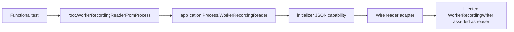
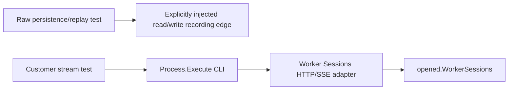
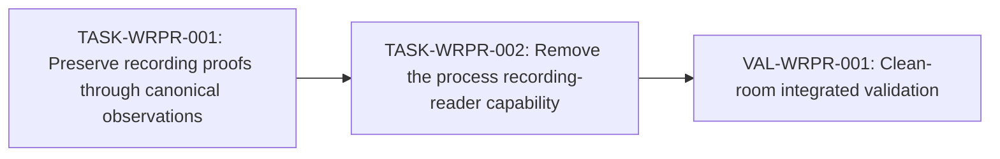

# Worker Recording Process Capability Removal Plan

## 1. Problem and desired outcome [Required]

### Problem statement

Repository maintainers need Worker recording replay coverage without turning the
caller-facing root process into a service locator for a Recordings-owned storage
capability.

### Current behavior and gap

`root.BuildProcess` composes a `WorkerRecordingWriter`, Wire requires that value
to also implement `recordings.WorkerRecordingReader`, converts snapshots to JSON
through an initializer-neutral interface, retains the interface on
`application.Process`, and lets functional tests convert it back to the
Recordings domain through `root.WorkerRecordingReaderFromProcess`.

No production CLI, HTTP, MCP, ACP, or runtime caller uses this capability. The
callers are functional tests that either already own the injected read/write
recording edge or can use the public Worker Session or Factory Event stream.
The current path therefore adds a second operational API beside
`Process.Execute`, makes the process retain a product capability, and silently
requires a writer edge to implement a read operation that its declared contract
does not require.

### Desired outcome and success measures

- `pkg/root` exposes process construction and execution but no Worker recording
  reader accessor or adapter.
- `pkg/initializer/application.Process` does not retain a Worker recording
  reader, and `pkg/initializer/process` contains no Worker recording reader
  handoff contract.
- Wire accepts any valid `recordings.WorkerRecordingWriter`, including a
  writer-only implementation.
- Existing Worker recording persistence, recovery, portable-codec, replay
  parity, and public Worker Session stream behavior remain covered at their
  closest valid observation boundary.
- Public CLI grammar, OpenAPI, HTTP behavior, event schemas, persisted recording
  formats, and replay semantics are unchanged.
- Focused package and functional tests, Wire generation drift checks, and the
  repository's fast verification tier pass on the change's own commit.

## 2. Scope and constraints [Required]

### In scope

- Migrate functional-test callers of
  `root.WorkerRecordingReaderFromProcess` to one of two existing canonical
  observation paths:
  - direct observation of the explicitly injected `WorkerRecordingWriter` edge
    when the test asserts raw storage, recovery, or codec behavior;
  - public CLI/HTTP streaming when the test asserts customer-visible retained
    or live Worker Session events.
- Remove `BuildProcessWithRecordingReader` and
  `FunctionalAPIServer.WorkerRecordingReader` from shared functional support.
- Remove the root adapter, initializer process field and contract, Wire provider,
  generated Wire arguments, and tests whose only purpose is the removed
  capability.
- Add or adjust composition coverage proving a writer-only recording edge is a
  valid `BuildProcess` dependency.
- Preserve all existing replay, portable recording, recovery, ordering,
  terminal, and no-provider-reexecution assertions.

### Non-goals

- Adding a public API for raw Worker recording snapshots.
- Changing `recordings.Service`, Worker Session observation contracts, Factory
  Event contracts, recording file formats, or codec behavior.
- Moving Worker recording ownership out of Recordings.
- Reworking the wider `application.Process` capability inventory beyond the
  Worker recording reader addressed by this plan.
- Replacing the existing CLI/HTTP Worker Session streaming implementation.

### Assumptions and constraints

- Raw Worker recording snapshot assertions are implementation-level evidence;
  the injected edge is an allowed functional-test observation boundary under
  the general backend standard.
- Tests that inject `wsrFT004RecordingProbe`, `wsrFT009DurableWriter`, or
  `remoteWorkerRecordingStore` retain those concrete values and may invoke
  their reader behavior directly.
- `api/openapi-main.yaml` is the source of truth for public HTTP contracts, but
  it is unchanged by this work; generated API artifacts must not be edited.
- `pkg/wire/wire_gen.go` is generated and must be updated with
  `make generate-wire`, not hand-edited.
- Existing user changes in the worktree must be preserved; implementation must
  resolve overlap narrowly rather than restoring deleted or modified files.

### Open questions

- None required to begin. If implementation discovers a production caller
  outside the current repository or a released Go compatibility commitment for
  `WorkerRecordingReaderFromProcess`, stop and request a compatibility decision
  before removal.

### Replanning triggers

- A non-test production caller is found.
- A migrated test cannot observe its required property through either its
  injected edge or an existing public transport.
- Removing the reader reveals that production startup or recording durability
  depends on the read side rather than only on the writer.
- The generated Wire graph requires a broader constructor change unrelated to
  this capability.
- Focused verification exposes a persisted-format or public-contract change.

## 3. Recommended approach [Required]

Use one behavior lane with two implementation tasks and one independent
validation loopback. First migrate all callers to existing canonical
observation paths while preserving the old capability; then remove the process
handoff and prove writer-only composition, for an estimated two implementation
deployments plus one validation deployment.

### Decision record

| Option | Decision | Evidence and tradeoff |
| --- | --- | --- |
| Retain the process reader as a narrow capability | Rejected | It has no production caller, duplicates owner/transport operations, adds JSON encode/decode solely to cross the initializer boundary, and makes a writer imply an undeclared reader. |
| Add a new raw Worker recording HTTP or CLI API | Rejected for this plan | Existing callers are tests asserting internal storage and codec properties. A customer contract would broaden the product surface without a demonstrated customer journey. |
| Migrate tests to injected-edge observation or existing public streams, then remove the capability | Selected | The repository already supports both paths. This preserves behavior, follows functional-test standards, and restores direct single injection without a process service locator. |

## 4. Customer behavior [Conditional]

This is an architecture and test-boundary cleanup with no intended
customer-visible behavior change.

### Actors, roles, and permissions

- CLI users continue to record and replay Factory executions through the
  existing `you run` flags.
- CLI and HTTP clients continue to read Worker Session observations through the
  existing Worker Session routes.
- No authorization or permission contract changes.

### User journeys

- `you run --record <path>` continues to persist the canonical Factory
  recording.
- `you run --replay <path>` continues to replay through the existing Factory
  Session/Recordings opening path.
- `you worker-sessions stream --worker-session-id <id> --replay-only --output json`
  continues to return retained observations and a replay summary through HTTP
  SSE.

### Default, loading, empty, success, error, and permission states

All states are unchanged. Existing tests remain the contract witnesses; this
plan adds no new state or presentation.

### Accessibility, keyboard, focus, responsive, and localization behavior

Not applicable: no UI or customer prose changes.

### Visual references

Not applicable: no visual surface changes.

## 5. Contracts and data [Conditional]

### Contract inventory and compatibility classification

| Contract | Classification | Planned outcome |
| --- | --- | --- |
| `root.WorkerRecordingReaderFromProcess` Go API | Breaking removal | Remove after all repository callers migrate; confirm no documented or production consumer. |
| `initializer/application.Process.WorkerRecordingReader` Go API | Breaking internal-boundary removal | Remove the field, constructor parameter, and method. |
| `initializer/process.WorkerRecordingReader` | Breaking internal-boundary removal | Remove the neutral JSON handoff interface. |
| `recordings.WorkerRecordingWriter` | Unchanged, enforcement corrected | Wire stops requiring implementations to also satisfy `WorkerRecordingReader`. |
| `recordings.WorkerRecordingReader` | Unchanged | Remains available to Recordings-owned implementations and focused tests. |
| Worker recording snapshot/portable schemas | Unchanged | Existing codec and persistence tests remain. |
| Worker Session and Factory Event HTTP/OpenAPI contracts | Unchanged | Existing routes remain the public stream boundary. |
| CLI grammar and output | Unchanged | Existing record, replay, and stream commands remain. |

### HTTP API, CLI, configuration, and event changes

No HTTP, CLI, configuration, or event contract changes. Do not run API
generation unless an unexpected authored-contract edit occurs.

### Persisted data, migration, retention, and rollback

No data migration or retention change. Worker recording writers persist the
same snapshots; only the process-level read exposure is removed.

### Generated artifacts and consumers

- Regenerate `pkg/wire/wire_gen.go` with `make generate-wire` after changing
  providers and constructors.
- OpenAPI Go/TypeScript clients are unchanged.

## 6. Architecture and state [Conditional]

### Current-state flow



### Target-state flow



### Runtime sequence and dependencies

- Production composition continues to inject the Worker recording writer into
  the Recordings-owned Worker Session recorder.
- Opened Factory Session runtimes continue to inject `opened.Recordings`
  directly into the Recordings HTTP adapter and `opened.WorkerSessions`
  directly into the Worker Sessions HTTP handler.
- CLI stream commands continue to receive an injected HTTP protocol and consume
  the public SSE route.
- No test retrieves a service or operational capability from
  `application.Process` after the migration.

### Canonical, projected, and ephemeral state

- Canonical Factory history remains owned by Recordings.
- Durable Worker capture snapshots remain Recordings-owned persistence facts.
- Worker Session retained/live observations remain process-local state owned by
  Worker Sessions and Events.
- Tests receive detached snapshot values from their controlled edge; no new
  canonical or projected state is introduced.

### Mutation ownership and consistency boundaries

- `WorkerRecordingWriter` remains the only injected mutation edge for Worker
  capture persistence.
- A test's reader view observes the same controlled store supplied through that
  writer edge; it does not mutate application state.
- Public streaming remains read-only and respects the existing Worker Session
  cursor, retention, terminal, and replay-summary policy.

### Legacy path and removal plan

`pkg/root/worker_recording_replay.go`, the initializer handoff, and
`provideWorkerRecordingReader` are the legacy path. TASK-WRPR-001 removes all
callers; TASK-WRPR-002 owns complete removal and generated Wire convergence.

## 7. Failure modes and quality attributes [Required]

| Case | Detection | Customer outcome | State/recovery | Telemetry | Evidence |
| --- | --- | --- | --- | --- | --- |
| Writer implements persistence only | Wire composition test | Process builds normally; no customer error | Writer remains the mutation edge; no read capability is required | Existing construction error logs remain for genuine missing dependencies | TASK-WRPR-002 writer-only composition test |
| Injected test reader cannot find a recording ID | Typed/error result from the controlled store | Not customer-visible; focused test fails with recording identity | No retry; fix fixture identity or persistence regression | Test failure includes recording ID | Migrated recording recovery/parity tests |
| Worker recording persistence fails after opening | Existing injected failure position | Existing Factory/Worker behavior and degraded snapshot remain unchanged | Existing degradation and terminal policy applies | Existing recording failure evidence | `recording_gate_test.go` focused cases |
| Restart loads interrupted or completed history | Controlled durable file store | Existing recovery result remains unchanged | Existing recovery classifier applies; provider is not re-invoked | Existing test counters and diagnostics | `recording_recovery_test.go` focused cases |
| Public retained stream is incomplete or active | Existing replay-summary frame | CLI/HTTP client receives current completeness result | No storage mutation; client may follow later | Existing stream diagnostics | Worker Sessions CLI/HTTP functional tests |
| Process reader caller remains | Compile failure or `rg` inventory gate | No shipped partial behavior | Complete caller migration before removal | Not applicable | Zero-match inventory plus Go compile |
| Generated Wire graph is stale | `make wire-smoke` drift check | Change cannot merge | Regenerate from providers | CI/build output | TASK-WRPR-002 and VAL-WRPR-001 |
| Cancellation/concurrency behavior regresses | Existing Worker Session functional tests | Existing cancellation and stream semantics must remain | Existing lifecycle cleanup | Existing service logs | Focused functional suite |

### Performance and scale

No runtime performance regression is expected. Removing JSON marshal/unmarshal
and a retained process field reduces unused construction and memory work.
Verification should confirm no new polling, sleeps, files, or network calls are
introduced.

### Reliability and availability

The public stream and recording paths remain unchanged. The principal
reliability improvement is allowing a valid writer-only edge without failing
process composition for an unused read capability.

### Security and privacy

Raw Worker recording snapshots no longer cross the root process boundary,
reducing the number of surfaces that can expose recorded payloads. Tests must
continue to use controlled fixtures and must not print secrets or full
production payloads.

### Cost and resource limits

All verification uses controlled local dependencies and is free aside from
bounded local CPU, filesystem, and test runtime. No paid or remote provider
calls are authorized or required.

### Observability and operational readiness

No production telemetry changes. Existing service operation logging remains
the owner of recording and stream diagnostics. The removal itself is enforced
by compile checks, a zero-match inventory, and Wire drift validation rather
than a runtime alert.

## 8. Rollout, compatibility, and rollback [Conditional]

### Deployment and feature-flag sequence

No feature flag. Land caller migration first, then capability removal. Each
task must leave the branch buildable and preserve all production behavior.

### Compatibility interval

The repository caller interval lasts through TASK-WRPR-001: the old capability
remains while all callers migrate. TASK-WRPR-002 removes it after the inventory
is empty. No runtime dual-write or dual-read interval is needed because the
replacement paths already exist.

### Monitoring and stop conditions

Stop removal if a production caller, documented public use, external Go
compatibility requirement, or hidden runtime read dependency is discovered.
Stop rollout on any Worker recording format, provider call-count, stream-frame,
or process-startup regression.

### Rollback procedure

- Revert TASK-WRPR-002 to restore the process capability if an unknown consumer
  is found.
- TASK-WRPR-001 remains safe after rollback because injected-edge and public
  stream observations are valid independently of the process getter.
- No data rollback is needed.

### Deprecation and cleanup owner

TASK-WRPR-002 owns complete removal. The implementing maintainer owns cleanup
of stale comments, tests, providers, generated arguments, imports, and shared
functional support fields.

## 9. Implementation strategy [Required]

### Coverage assessment and characterization needs

Current coverage already characterizes the essential behavior:

- completed live-to-reloaded replay parity and zero provider re-execution;
- persistence-loss degradation and terminal truth;
- restart recovery for interrupted and completed recordings;
- portable recording encode/decode/replay fidelity and tamper rejection;
- public Worker Session retained replay and continuation streams.

No new pre-migration characterization task is required. TASK-WRPR-001 must
preserve these assertions while changing only their observation source.

### Parent behavior lanes

- **BEH-WRPR-001 — Worker recording behavior remains verifiable without a
  process service locator.** Maintainers can prove raw persistence through an
  explicit controlled edge and customer-visible streams through public
  transports, while production processes require only the capabilities they
  execute.

### Narrow executable spine

The existing spine is retained:

```text
root.BuildProcess -> Process.Execute -> CLI/runtime opening
  -> Worker Sessions/Recordings owner -> injected external-effect edge
  -> public CLI/HTTP observation or controlled edge observation
```

### Justified enabling work

TASK-WRPR-001 is a bounded test-boundary migration. It is separated from
removal so reviewers can confirm that each behavioral witness still proves the
same property before the old API disappears, and so TASK-WRPR-002 remains a
small structural deletion.

### Migration or strangler sequence

1. Keep the old process reader temporarily.
2. Change every functional caller to retain its injected recording store or use
   the existing public stream.
3. Remove shared test support that returns a reader from the process.
4. Verify zero callers of the root/initializer capability.
5. Remove the root adapter, initializer contract/field/method, Wire provider,
   and capability-only tests.
6. Regenerate Wire and prove writer-only composition.

### Shared-surface ownership

- TASK-WRPR-001 owns functional test and shared functional-support migration.
- TASK-WRPR-002 owns `pkg/root`, `pkg/initializer`, `pkg/wire`, generated Wire
  output, and capability-specific unit/composition tests.
- The tasks are sequential because TASK-WRPR-002 semantically requires an empty
  caller inventory.
- Existing unrelated worktree changes remain user-owned and must not be
  reverted.

## 10. Verification strategy [Required]

| Behavior/gate | Scope | Dependency fidelity | Cadence | Cost | Proves | Does not prove |
| --- | --- | --- | --- | --- | --- | --- |
| Worker recording codec and file-writer tests | Unit/package integration | controlled/local_real filesystem | Per change | Free, bounded | Snapshot load, recovery, portable codec, replay, ordering, and failure classification remain correct | Root composition or customer transport |
| Migrated inference recording functional tests | Functional | controlled provider runner and controlled/local-real recording store | Per PR | Free, bounded | `Process.Execute` still records, reloads through the injected edge, replays without provider execution, and preserves failure/recovery facts | Real provider or remote deployment |
| Worker transport functional tests | Functional | controlled provider runner, local-real HTTP/SSE server | Per PR | Free, bounded | CLI/HTTP retained stream and continuation behavior remain customer-observable | Remote network infrastructure or paid provider |
| Writer-only `BuildProcess` composition test | Integration | production Wire with controlled external edge | Per PR | Free, bounded | Writer no longer needs to implement a reader and canonical composition succeeds | Full execution with every provider |
| `make wire-smoke` | Integration/contract | production generation and local-real toolchain | Per PR | Free, bounded | Wire graph is generated, stable on a second pass, and package tests compile/pass | All repository behavior |
| `make verify-fast` | Repository integration | controlled/local-real toolchain | Per PR | Free, bounded | Shared Go/UI fast gates detect compile and nearby regression classes | Slow functional, stress, remote, or release-only behavior |
| VAL-WRPR-001 clean-room loopback | Functional/integration | controlled provider and local-real filesystem/HTTP | Once after task integration | Free, bounded | Cross-task removal, root execution, raw edge observation, and public stream behavior work together from a clean checkout | Paid provider availability |

### Paid-validation budgets and evidence-reuse keys

Not applicable. Maximum remote calls: zero. Maximum paid cost: USD 0.

### Remaining unproven edges and owning gates

- External Go consumers of the removed root symbol are not discoverable from
  repository tests; a discovered compatibility commitment triggers replanning
  before TASK-WRPR-002.
- Real provider behavior is not required because the removed capability is
  downstream of persistence and replay; controlled provider runners prove the
  relevant no-reexecution property.

## 11. Task dependency graph [Required]



## 12. Tasks [Required]

### TASK-WRPR-001 — Preserve Worker recording proofs through canonical observations

**Parent behavior:** BEH-WRPR-001 — Worker recording behavior remains
verifiable without a process service locator.

**Problem:** Functional tests currently retrieve a controlled recording store
through `application.Process` even when they already own that store or can
observe the behavior through a public stream.

**Outcome:** Every repository caller of
`root.WorkerRecordingReaderFromProcess` is migrated to an explicit injected
edge or existing public CLI/HTTP stream while all behavioral assertions remain
intact.

**Plan reference:**
`C:\Users\andre\work\portos\infinite-you\.claude\worktrees\test-cleanup\docs\internal\development\plans\worker-recording-process-capability-removal.md`,
BEH-WRPR-001 and Section 9.

**Actor and trigger:** A functional test builds and executes the canonical
process with a controlled `WorkerRecordingWriter`, then verifies durable Worker
recording or public stream behavior.

**Dependencies:** None.

**Parallel and shared-surface ownership:** Must complete before TASK-WRPR-002.
This task exclusively owns the affected files under `tests/functional` and
`tests/functional/internal/support`; it does not modify root, initializer, or
Wire production capability code.

**Scope:**

- In:
  - Update inference recording parity, persistence-loss, recovery, and portable
    recording tests to retain and read their explicit injected store/writer.
  - Update the remote Worker Sessions invoke/continue test to use its existing
    `remoteWorkerRecordingStore` directly for raw parity while retaining its
    public CLI replay-only stream assertions.
  - Remove `BuildProcessWithRecordingReader`, the recording-reader field on
    `FunctionalAPIServer`, and `FunctionalAPIServer.WorkerRecordingReader` once
    their callers are migrated.
  - Preserve provider call-count, terminal ordering, degraded persistence,
    restart recovery, codec round-trip, tamper diagnostic, continuation lineage,
    and stream replay-summary assertions.
- Out:
  - Removing the production capability.
  - Adding new HTTP/CLI operations or changing recording schemas.

**Implementation constraints:**

- Functional application setup continues through `root.BuildProcess` and
  `Process.Execute`.
- External effects are replaced only through `edges.Edges`.
- Do not add sleeps, polling, a second application graph, or service
  construction outside the owning test fixture/Wire boundary.
- A test asserting raw persistence reads only the same controlled store it
  explicitly injected; a test asserting customer behavior uses the public
  CLI/HTTP route.
- Preserve unrelated worktree modifications.

**Acceptance criteria:**

- [ ] Given a completed or degraded Worker execution, when the functional test
  reads the explicitly injected recording store, then the snapshot, replay,
  terminal ordering, persistence failure, and provider call-count assertions
  match the pre-migration behavior.
- [ ] Given a restarted process over a durable test store, when recovery is
  inspected through the retained test reader, then interrupted/completed
  classification is preserved and the provider call count remains zero.
- [ ] Given a remote Worker Session and successor, when the CLI invokes
  `worker-sessions stream --replay-only`, then the public stream still reports
  the expected terminal and lineage frames, while raw persistence parity is
  checked through the injected `remoteWorkerRecordingStore`.
- [ ] `rg` reports no test or support caller of
  `WorkerRecordingReaderFromProcess`, `BuildProcessWithRecordingReader`, or
  `FunctionalAPIServer.WorkerRecordingReader`.
- [ ] Focused functional packages pass and demonstrate the preserved properties,
  not merely successful compilation.

**Verification:**

- Behavioral witness: Run a recorded inference execution, load its detached
  snapshot from the explicitly injected store, replay it, and observe exact
  live/replay equality with no additional provider invocation; separately drain
  a Worker Session through the public replay-only CLI stream.
- Executable-spine effect: preserve.
- Required evidence:
  - Scope: functional
  - Dependency fidelity: controlled
  - Command or procedure:
    `go test ./tests/functional/workers/inference ./tests/functional/workers/transports/http -count=1`
  - Proves: The migrated observations preserve persistence, recovery, portable
    replay, failure, and public stream behaviors through canonical boundaries.
  - Does not prove: Removal of the production process capability or Wire
    generation convergence.
- Highest feasible level: Functional with production root construction,
  controlled provider runners, controlled/local-real storage, and local-real
  HTTP/SSE; real providers add cost without proving a relevant property.
- Remaining unproven edges: Production capability removal and writer-only
  composition -> TASK-WRPR-002.

**Paid validation, when applicable:**

- Trigger: Not applicable.
- Maximum calls: 0.
- Maximum cost: USD 0.
- Maximum duration: Not applicable.
- Fixture and output validator: Existing deterministic provider fixtures and
  typed/NDJSON assertions.
- Evidence-reuse key: Not applicable.

**Operational and rollout notes:** The old process capability remains during
this task, so rollback is a simple task revert. No telemetry, migration,
feature flag, or runtime compatibility behavior changes.

**Escalation:** Stop and return a structured blocker when the required change
exceeds this task's outcome, a prerequisite or authority is absent, or the
observed architecture contradicts the plan. Include evidence, impact, safe work
completed, and the smallest recommended delta. Do not broaden scope silently.

**Handoff artifacts:** Migrated functional tests, simplified shared functional
support, focused test output, and a zero-caller inventory for TASK-WRPR-002.

### TASK-WRPR-002 — Remove the Worker recording reader from the root process

**Parent behavior:** BEH-WRPR-001 — Worker recording behavior remains
verifiable without a process service locator.

**Problem:** After callers migrate, root, initializer, and Wire still retain an
unused product-service handoff and require recording writers to implement an
undeclared reader capability.

**Outcome:** The complete process reader path is deleted, canonical Wire
composition accepts a writer-only recording edge, and generated construction is
in sync.

**Plan reference:**
`C:\Users\andre\work\portos\infinite-you\.claude\worktrees\test-cleanup\docs\internal\development\plans\worker-recording-process-capability-removal.md`,
BEH-WRPR-001 and Section 6 legacy removal plan.

**Actor and trigger:** An application caller invokes `root.BuildProcess` with a
valid `recordings.WorkerRecordingWriter` that does not implement a reader.

**Dependencies:** TASK-WRPR-001.

**Parallel and shared-surface ownership:** Runs after TASK-WRPR-001. This task
owns the affected `pkg/root`, `pkg/initializer`, and `pkg/wire` files plus
generated `pkg/wire/wire_gen.go`; no other task may edit those shared surfaces
concurrently.

**Scope:**

- In:
  - Delete `pkg/root/worker_recording_replay.go`.
  - Remove `workerReader` and `WorkerRecordingReader()` from
    `initializer/application.Process` and update its constructors/tests.
  - Remove `initializer/process.WorkerRecordingReader`.
  - Remove `provideWorkerRecordingReader`, its JSON adapter, provider-set entry,
    and capability-only composition tests.
  - Regenerate Wire.
  - Add or update composition coverage showing `BuildProcess` accepts a
    writer-only `recordings.WorkerRecordingWriter` and still composes the Worker
    Session recorder.
  - Remove stale imports, comments, and test fixtures dedicated only to the
    deleted path.
- Out:
  - Any change to Recordings, Worker Sessions, public transports, persisted
    schemas, or unrelated process capabilities.

**Implementation constraints:**

- `pkg/root` remains the thin `BuildProcess` caller boundary.
- Wire remains the sole production composition graph.
- Do not replace the removed getter with `any`, another opaque capability,
  service lookup, global, secondary injector, or constructor bag.
- Generate `pkg/wire/wire_gen.go` using `make generate-wire`.
- Do not edit authored or generated OpenAPI artifacts.
- Preserve unrelated worktree modifications and resolve overlapping constructor
  edits minimally.

**Acceptance criteria:**

- [ ] Given a writer-only `recordings.WorkerRecordingWriter`, when
  `root.BuildProcess` composes the application, then construction succeeds and
  no reader assertion or JSON adapter executes.
- [ ] Given the repository source after removal, when symbols are inventoried,
  then `WorkerRecordingReaderFromProcess`,
  `processcontract.WorkerRecordingReader`, `Process.WorkerRecordingReader`, and
  `provideWorkerRecordingReader` have zero matches outside historical plan text.
- [ ] Given existing recording and Worker Session tests, when they run after
  removal, then persistence, recovery, replay, portable codec, and stream
  behavior remain unchanged.
- [ ] `make wire-smoke` reports a stable twice-generated Wire graph and passing
  `pkg/wire` tests.
- [ ] Focused initializer/root tests and `make verify-fast` pass on the final
  task head.

**Verification:**

- Behavioral witness: Compose and execute a root process with a writer-only
  recording edge, then observe successful Worker recording persistence through
  the edge and unchanged public Worker Session stream behavior.
- Executable-spine effect: increase_fidelity.
- Required evidence:
  - Scope: integration
  - Dependency fidelity: controlled
  - Command or procedure:
    `go test ./pkg/initializer/... ./pkg/root/... ./pkg/wire/... -count=1`
    followed by `make wire-smoke`, the focused functional command from
    TASK-WRPR-001, and `make verify-fast`.
  - Proves: Process construction no longer exposes or requires the reader;
    generated composition and affected behavior remain correct.
  - Does not prove: Unknown external Go source consumers or real remote provider
    availability.
- Highest feasible level: Integration plus functional using production Wire,
  root construction, controlled edges, and local-real HTTP/filesystem.
- Remaining unproven edges: Clean-room cross-task result -> VAL-WRPR-001;
  unknown external Go consumers -> compatibility replanning trigger.

**Paid validation, when applicable:**

- Trigger: Not applicable.
- Maximum calls: 0.
- Maximum cost: USD 0.
- Maximum duration: Not applicable.
- Fixture and output validator: Existing deterministic fixtures, Go assertions,
  Wire drift script, and CLI NDJSON validators.
- Evidence-reuse key: Not applicable.

**Operational and rollout notes:** No feature flag or data migration. Stop on
any newly discovered production caller or public compatibility commitment.
Rollback by reverting this task; TASK-WRPR-001 remains valid and need not be
reverted. The implementing maintainer owns deletion of every stale capability
artifact.

**Escalation:** Stop and return a structured blocker when the required change
exceeds this task's outcome, a prerequisite or authority is absent, or the
observed architecture contradicts the plan. Include evidence, impact, safe work
completed, and the smallest recommended delta. Do not broaden scope silently.

**Handoff artifacts:** Deleted capability path, regenerated Wire graph,
writer-only composition coverage, symbol-inventory output, focused verification
output, and PR evidence for validation.

### VAL-WRPR-001 — Independently validate process-boundary cleanup and preserved recording behavior

**Parent behavior:** BEH-WRPR-001 — Worker recording behavior remains
verifiable without a process service locator.

**Problem:** Task-local evidence does not independently prove that the migrated
tests, generated graph, root process, controlled persistence edge, and public
stream operate together from a clean checkout.

**Outcome:** A read-only clean-room report establishes the project acceptance
criteria or returns a structured delta-plan request.

**Plan reference:**
`C:\Users\andre\work\portos\infinite-you\.claude\worktrees\test-cleanup\docs\internal\development\plans\worker-recording-process-capability-removal.md`,
Sections 10 and 13.

**Actor and trigger:** An independent validator receives the integrated task
head after TASK-WRPR-002.

**Dependencies:** TASK-WRPR-002.

**Parallel and shared-surface ownership:** No implementation edits. Validation
is read-only and runs after the integrated head exists.

**Scope:**

- In: Clean checkout, zero-symbol inventory, generated Wire stability, focused
  recording/recovery/transport tests, writer-only composition witness,
  `make verify-fast`, and structured validation report.
- Out: Silent fixes, paid providers, unrelated repository verification, merge.

**Implementation constraints:**

- Use the validation-loopback template.
- Do not modify implementation or test files.
- Record exact commit, environment, commands, dependencies, and evidence.
- A failure produces a delta-plan request rather than an unplanned fix.

**Acceptance criteria:**

- [ ] Given a clean checkout of the integrated head, when the symbol inventory
  and generated Wire stability checks run, then the removed capability is
  absent and generation is idempotent.
- [ ] Given controlled recording and provider fixtures, when focused functional
  journeys run, then raw persistence/recovery and public replay-only streams
  retain their prior outcomes.
- [ ] Given all project criteria, when validation completes, then the report
  records PASS, FAIL, or BLOCKED with evidence and an unproven edge for every
  criterion.

**Verification:**

- Behavioral witness: From a clean checkout, run a root-built Worker recording
  scenario using a writer-only edge and a public replay-only Worker Session
  stream, with no process reader symbol present.
- Executable-spine effect: promote.
- Required evidence:
  - Scope: functional
  - Dependency fidelity: controlled and local_real
  - Command or procedure: Run the zero-symbol `rg` inventory, `make wire-smoke`,
    `go test ./pkg/initializer/... ./pkg/root/... ./pkg/wire/... -count=1`,
    `go test ./tests/functional/workers/inference ./tests/functional/workers/transports/http -count=1`,
    and `make verify-fast` from a clean environment.
  - Proves: Integrated architecture removal and preserved closest-boundary and
    customer-stream behavior.
  - Does not prove: Unknown external Go consumers or paid remote providers.
- Highest feasible level: Functional/integration with production composition,
  controlled provider edge, local-real storage, and local-real HTTP/SSE.
- Remaining unproven edges: External Go consumer compatibility only; if a
  commitment is discovered, verdict is BLOCKED and replanning is required.

**Paid validation, when applicable:**

- Trigger: Not applicable.
- Maximum calls: 0.
- Maximum cost: USD 0.
- Maximum duration: Not applicable.
- Fixture and output validator: Existing controlled provider fixtures, typed Go
  assertions, Wire drift script, and CLI NDJSON validation.
- Evidence-reuse key: Not applicable.

**Operational and rollout notes:** Read-only. A FAIL or BLOCKED verdict stops
delivery and returns the smallest evidence-backed delta-plan request.

**Escalation:** Stop and return a structured blocker when the required change
exceeds this task's outcome, a prerequisite or authority is absent, or the
observed architecture contradicts the plan. Include evidence, impact, safe work
completed, and the smallest recommended delta. Do not broaden scope silently.

**Handoff artifacts:** A completed validation-loopback report tied to the exact
commit/build, with project-criterion evidence and any required delta-plan
request.

## 13. Project acceptance criteria [Required]

- [ ] Given a valid writer-only Worker recording edge, when the canonical root
  process is built, then construction succeeds without a reader assertion,
  process reader field, or JSON capability adapter; evidence is the
  writer-only composition test and `make wire-smoke`.
- [ ] Given completed, degraded, interrupted, and recovered Worker recordings,
  when focused tests inspect their explicit injected stores and replay codecs,
  then existing status, ordering, terminal, failure, portable fidelity, and
  no-provider-reexecution outcomes remain unchanged; evidence is the focused
  inference functional suite.
- [ ] Given retained Worker Session history, when a client invokes the existing
  replay-only CLI/HTTP stream, then event frames, continuation lineage,
  terminal delivery, and completeness summary remain unchanged; evidence is
  the focused Worker transport functional suite.
- [ ] Repository inventory contains no production or test reference to the
  removed root, initializer, or Wire reader capability; evidence is a recorded
  zero-match `rg` command and successful Go compilation.
- [ ] Public OpenAPI, CLI grammar, event schemas, persisted formats, and
  customer-visible behavior are unchanged; evidence is no authored API diff,
  focused contract behavior, and review inspection.
- [ ] No paid or remote dependency call occurs; all verification stays within
  controlled/local-real dependencies and USD 0 cost.
- [ ] `make wire-smoke` and `make verify-fast` pass and their outputs establish
  generated-graph stability and shared fast-gate health respectively.
- [ ] VAL-WRPR-001 runs from a clean environment and reports PASS for every
  project criterion, or returns FAIL/BLOCKED with a structured delta-plan
  request.
- [ ] Implementation-stage delivery criterion: The implementation stage marks
  this criterion satisfied and stops after its final head is pushed, the PR is
  open, CI has started, and all blocking review feedback is addressed. It does
  not poll or re-check CI after this finish line. The review stage owns driving
  CI to terminal-and-passing, resolving merge conflicts, and merging the PR;
  merge remains the lane-wide delivery boundary. CI-run evidence goes in a PR
  comment and never in a commit.

## 14. References [Required]

- `factory/docs/standards/planning-standards.md` — required behavior slicing,
  evidence progression, task graph, acceptance criteria, and delivery split.
- `factory/docs/standards/plan-template.md` — required plan structure.
- `factory/docs/standards/task-template.md` — required implementation task
  packet shape.
- `factory/docs/standards/validation-loopback-template.md` — required
  independent validation report.
- `docs/internal/standards/code/general-backend-standards.md` — direct single
  injection, service operation, Wire construction, and functional-test rules.
- `docs/architecture/architecture.md` — canonical Process.Execute, Wire,
  initializer, Recordings, and transport flow.
- `docs/architecture/packaged-structure.md` — root, initializer, Wire,
  Recordings, Worker Sessions, and transport ownership boundaries.
- `docs/architecture/service-ownership-rationale.md` — Recordings ownership of
  replay/history and Worker Sessions ownership of retained/live observations.
- `pkg/root/worker_recording_replay.go` — legacy root adapter targeted for
  removal.
- `pkg/initializer/application/process.go` and
  `pkg/initializer/process/contracts.go` — legacy retained capability and
  neutral handoff contract.
- `pkg/wire/worker_sessions_providers.go` — legacy writer-to-reader assertion
  and JSON adapter.
- `pkg/wire/http_runtime_binding.go` — existing direct owner-to-HTTP adapter
  composition for Recordings and Worker Sessions.
- `pkg/services/worker_sessions/transports/cli/stream.go` and
  `api/openapi-main.yaml` — existing public Worker Session SSE client and
  routes.
- `tests/functional/workers/inference/recording_gate_test.go`,
  `recording_recovery_test.go`, and `portable_recording_test.go` — raw
  persistence, replay, recovery, and portable-codec behavioral witnesses.
- `tests/functional/workers/transports/http/worker_sessions_invoke_continue_test.go`
  and `worker_recording_store_test.go` — public stream witness and existing
  controlled read/write store.
