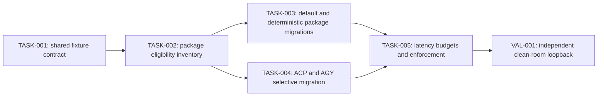

# Shared-process functional-test migration

## 1. Problem and desired outcome

### Problem statement

Functional-test packages repeatedly construct the complete application process, making the pull-request feedback loop too slow for contributors to use as a reliable development gate.

### Current behavior and gap

Long-running packages commonly start one root process and server per scenario even when scenarios differ only by Factory Definition, seed Work, or deterministic worker outcome. The process startup, catalog loading, HTTP composition, and runtime initialization costs are therefore paid many times; some relationship tests additionally substitute Git worktrees or provider spies for temporal behavior that mock workers can represent directly.

The `tests/functional/work/relationships` reference slice now demonstrates the target shape: one package-scoped service-mode process, isolated Factory Sessions per eligible scenario, deterministic mock-worker gates for partial fan-in and active cross-batch behavior, and separate fixtures only where a genuinely process-scoped edge is under test.

### Desired outcome and success measures

- The full functional suite completes in less than three minutes on the CI reference runner for three consecutive runs.
- Every migrated package starts at most one shared application process for its eligible scenario group.
- Every migrated scenario owns and closes an explicit Factory Session and proves behavior through public CLI/HTTP, Work, session, or Factory Event surfaces.
- Scenarios needing a bespoke process-scoped provider, command runner, filesystem, clock, port, environment, persistence restart, or transport lifecycle remain isolated and document the reason.
- Package timing evidence shows no migrated package regresses by more than 10% from its accepted post-migration baseline.
- The race-enabled relationship package and the normal functional suite remain passing.

## 2. Scope and constraints

### In scope

- Long-running functional packages, initially relationships, workers/mock, workers/inference, packaged factories, transport/cli/process, ACP, factory transformation, AGY, and providers.
- A reusable package fixture pattern consisting of one service-mode process plus multiple explicit Factory Sessions.
- Mock-worker accept, reject, input selection, usage, script, and deterministic gate behavior needed to replace incidental provider edges.
- Scenario eligibility inventory, timing baselines, package migration batches, and CI latency reporting.
- Removal of incidental Git/worktree/provider assertions from tests whose owning behavior is elsewhere.

### Non-goals

- Combining separate Go test packages into one process.
- Sharing mutable Factory Sessions between tests.
- Replacing integration tests that intentionally exercise live subprocess, provider protocol, port binding, persistence restart, authentication, environment, or transport teardown behavior.
- Weakening public behavioral assertions to obtain lower timings.
- Introducing arbitrary sleeps, delay fields, global mutable fixtures, or test-order dependencies.
- Changing production scheduling semantics.

### Assumptions and constraints

- Go package tests may run concurrently with other packages and must not use process-wide working-directory or environment mutation.
- A shared process owns immutable process-scoped edges; individual scenarios may vary only state carried by an explicit Factory Session or deterministic mock-worker entry known before process startup.
- Mock-worker selectors must be unique across concurrently executing sessions. Tests that reuse the same Work identifiers for conflicting mock outcomes must rename fixture identifiers or remain in separate fixture groups.
- Each subtest must be safe under `t.Parallel()` and must close its session even after failure.
- Existing unrelated work in the repository must be preserved.

### Open questions

- Which CI machine class is the canonical three-minute reference runner?
- Should package timing budgets become blocking immediately or begin with one non-blocking observation interval?
- Do ACP and AGY have enough scenario-level session identity to share one listener without connection-lifecycle interference?

### Replanning triggers

- A package needs more than three shared fixture groups because most behavior is process-scoped.
- Shared execution introduces cross-session leakage, nondeterministic mock selection, or a race finding.
- CI timing variance exceeds 20% across three clean runs.
- A migration would require exposing an internal test-only control through a customer API.

## 3. Recommended approach

Use five implementation tasks plus one independent validation loopback. Establish the relationship package as the executable reference, inventory each long-running package by process-scoped dependency, then migrate eligible scenarios in bounded package batches while retaining named isolated groups for genuine edge behavior.

### Decision record

| Option | Decision | Evidence and tradeoff |
| --- | --- | --- |
| One process per scenario with broader Go parallelism | Rejected | Parallelism hides some wall time but multiplies initialization, memory, ports, and scheduler contention; the original relationship package still paid repeated startup cost. |
| One global process for the entire functional suite | Rejected | Go packages are independent binaries and many packages intentionally own incompatible process-scoped edges. |
| One process per package with explicit Factory Sessions | Recommended | The relationship reference slice reduced package time from 23.048 seconds to approximately 3.6 seconds while retaining public state/event proofs. |
| Mock internal services directly | Rejected | Functional tests must preserve the assembled customer transport and internally owned runtime spine; only external or expensive edges are controlled. |

## 4. Customer behavior

Not applicable: this plan changes contributor test execution and does not change a customer UI or permission model.

## 5. Contracts and data

### Contract inventory and compatibility classification

| Contract/component | Authored source | Classification | Consumers |
| --- | --- | --- | --- |
| Mock-worker JSON configuration | `contracts/config/mock-workers.schema.json` | Unchanged prerequisite after the relationship reference slice | CLI run input, Workers, Factory Runtime activation, functional support |
| Factory Session HTTP operations | `api/openapi-main.yaml` | Unchanged | Shared functional fixtures and CLI session selection |
| Functional package fixture convention | This plan and `tests/functional/internal/support` | Additive internal convention | Long-running functional packages |
| Factory Events and Work projections | Existing OpenAPI components | Unchanged | Migrated behavioral assertions |

### HTTP API and OpenAPI changes

Not applicable: migrations use the existing session open, close, Work, submission, and event operations.

### Configuration and schema changes

No additional configuration change is proposed by this plan. The reference implementation depends on the already-authored additive `gateConfig` shape:

Authored source: `contracts/config/mock-workers.schema.json` (`$defs.mockWorker.properties.gateConfig` and `$defs.gateConfig`)

Current:

```json
{
  "$defs": {
    "mockWorker": {
      "properties": {
        "gateConfig": {
          "$ref": "#/$defs/gateConfig"
        },
        "runType": {
          "enum": ["accept", "script", "reject"]
        }
      },
      "required": ["runType"],
      "type": "object"
    },
    "gateConfig": {
      "additionalProperties": true,
      "properties": {
        "arrivedFile": {"minLength": 1, "type": "string"},
        "releaseFile": {"minLength": 1, "type": "string"},
        "timeout": {"minLength": 1, "type": "string"}
      },
      "required": ["arrivedFile", "releaseFile", "timeout"],
      "type": "object"
    }
  }
}
```

Proposed:

```json
{
  "$defs": {
    "mockWorker": {
      "properties": {
        "gateConfig": {
          "$ref": "#/$defs/gateConfig"
        },
        "runType": {
          "enum": ["accept", "script", "reject"]
        }
      },
      "required": ["runType"],
      "type": "object"
    },
    "gateConfig": {
      "additionalProperties": true,
      "properties": {
        "arrivedFile": {"minLength": 1, "type": "string"},
        "releaseFile": {"minLength": 1, "type": "string"},
        "timeout": {"minLength": 1, "type": "string"}
      },
      "required": ["arrivedFile", "releaseFile", "timeout"],
      "type": "object"
    }
  }
}
```

Validation, defaults, migration, and rollback:

- Gate paths remain absolute, distinct, and bounded by a positive duration.
- Omitting `gateConfig` preserves immediate execution of the selected run type.
- No generated artifact changes are required for later package migrations; the prerequisite schema projection is `packages/api/generated/schemas/mock-workers.schema.json`.
- A package migration rolls back by restoring its isolated fixture without changing customer data.

### CLI, event, message, and persisted-contract changes

Not applicable: existing `--server`, `--session`, Factory Event, and Work contracts are preserved.

### Persisted data, migration, retention, and rollback

Functional fixtures use temporary session state. No customer data migration or retention change applies.

### Generated artifacts and consumers

No generated outputs are expected after the prerequisite mock-worker schema work. Any later public contract change triggers `make contracts-generate` and the applicable API generation gates.

## 6. Architecture and state

### Current-state flow

Each scenario commonly constructs `root.Process`, loads a Factory Definition, starts a server, opens the default runtime, runs one behavior, and tears the entire graph down. Provider spies, command runners, Git repositories, or marker files sometimes control timing even when the observed contract is only relationship scheduling.

### Target-state flow

One parent package fixture constructs `root.Process` and a service-mode HTTP server. Each eligible subtest creates a temporary Factory Definition, opens an explicit Factory Session, submits or seeds Work through public boundaries, observes session-scoped Work and Factory Events, and closes that session; mock-worker selectors and gates provide deterministic outcomes without changing canonical state directly.

### Runtime sequence and dependencies

1. Parent test creates all process-scoped mock-worker entries and starts one server.
2. Parallel subtest creates its Factory Definition and opens one Factory Session.
3. The runtime loads that definition and owns canonical Work/Event state for the session.
4. Mock workers control only the external execution result or synchronization point.
5. The subtest observes public projections and event ordering, then closes its session.
6. Parent cleanup stops the shared process after every subtest completes.

### Canonical, projected, and ephemeral state

- Canonical: session-owned Factory Events and Work state.
- Projected: HTTP Work, Factory Session, progress, and Factory Event responses.
- Ephemeral: mock gate arrival/release files, temporary definitions, client inputs, and timing samples.

### Mutation ownership and consistency boundaries

Factory Runtime remains the only owner of canonical scheduling mutations. Mock workers emit outcomes through Workers; gate files synchronize the external-effect boundary and never mutate Work. Each Factory Session is the transaction/isolation boundary for a scenario.

### Legacy path and removal plan

The owner of each migrated package removes obsolete per-scenario process helpers, provider call-count assertions, Git marker scaffolds, and duplicate default-session URL helpers in the same migration task. Genuine edge fixtures remain with a comment naming the behavior they alone prove.

## 7. Failure modes and quality attributes

| Case | Detection | Customer outcome | State/recovery | Telemetry | Evidence |
| --- | --- | --- | --- | --- | --- |
| Gate never arrives | Bounded arrival wait | Test fails with gate identity | Session cleanup terminates the runtime | Test failure includes gate path | Gate unit and relationship functional tests |
| Gate never releases | Mock-worker timeout | Dispatch fails instead of hanging CI | Session cleanup; no global fixture corruption | Worker error includes release path and deadline | Mock runner timeout unit test |
| Mock selector collides across sessions | Unexpected outcome/event ordering | Package test fails | Rename Work IDs or split fixture group | Scenario and entry IDs in failure | Repeated and race-enabled package runs |
| Session state leaks | Other session lists unexpected Work/events | Test fails atomically | Close both sessions; migration stops | Session IDs in public observations | Cross-session isolation functional test |
| Shared process exits early | Server done/status observation | All affected subtests fail clearly | Parent fixture owns teardown | Daemon stdout/stderr on failure | Support-harness test and package run |
| Bespoke edge incorrectly migrated | Characterization mismatch | Migration PR is rejected | Restore isolated fixture | Eligibility inventory records edge | Pre/post behavioral witness comparison |
| Concurrent capacity exhaustion | Timeout or elevated package timing | CI gate fails | Reduce parallel group or cap package concurrency | Package duration and timeout diagnostics | Three-run timing evidence |
| Cancellation during gate wait | Context cancellation error | Test exits without hang | Gate waiter returns; cleanup releases | Worker cancellation diagnostic | Unit cancellation test |
| Temporary-file permission failure | Arrival/release filesystem error | Test fails with path operation | Temp directory cleanup | Structured wrapped error | Unit filesystem-failure coverage where practical |
| Timing regression | Budget comparison | CI reports regression | Stop rollout for that package | Package timing artifact | Per-PR timing gate |

### Performance and scale

The suite target is less than three minutes on the reference CI runner. Measure clean wall time, package time, process-start count, and scenario count. A shared group should normally contain at least three eligible scenarios or save at least two process startups.

The 2026-08-25 uncached Windows baseline used `make test-functional` with two package workers. It passed, but exceeded the target. The largest observed package durations were `workers/mock` 99.9 seconds, `workers/inference` 57.8 seconds, packaged `fix` 51.3 seconds, ACP 49.3 seconds, `transport/cli/process` 48.4 seconds, packaged `subagent` 48.6 seconds, packaged `review` 39.7 seconds, factory transformation 36.3 seconds, packaged `goal` 35.5 seconds, and AGY 33.0 seconds. Relationships completed in 10.2 seconds under suite contention and approximately 3.6 to 5.9 seconds alone, down from the 23.048-second reference baseline. Migrations should therefore start with deterministic workers/mock and packaged-factory scenarios before selectively addressing protocol-owned ACP/AGY cases.

### Reliability and availability

Tests must use state observations and bounded contexts, not fixed sleeps. Run migrated packages at least three times and once with `-race` where supported.

### Security and privacy

Gate files contain no credentials or customer payloads and live under test-owned temporary directories. Failure messages may contain paths and stable test identifiers but must not log environment secrets or mock payload values.

### Cost and resource limits

All migration verification uses controlled local dependencies and makes zero paid provider calls. Shared fixtures reduce process, memory, port, and antivirus-scanning cost.

### Observability and operational readiness

CI publishes package durations and the total functional duration. A blocking regression names the package, baseline, observed duration, threshold, and run identifier. No production alerting change applies.

## 8. Rollout, compatibility, and rollback

### Deployment and feature-flag sequence

Migrate one package per PR batch after the reference helpers land. Begin with packages whose scenarios already use default mock acceptance, then controlled failures/gates, then ACP/AGY subsets after their connection-lifecycle inventory.

### Compatibility interval

Isolated and shared fixture patterns may coexist until every eligible scenario has migrated. Public API and configuration compatibility is unchanged.

### Monitoring and stop conditions

Stop a package rollout on state leakage, race findings, flaky results in three repetitions, more than 10% timing regression, or loss of an existing behavioral witness.

### Rollback procedure

Revert the affected package migration and restore its previous isolated fixture. Retain reusable support and mock-worker primitives if their own tests remain valid.

### Deprecation and cleanup owner

The package migration task owner removes obsolete helpers. The final enforcement task owns baseline retirement and CI-budget documentation.

## 9. Implementation strategy

### Coverage assessment and characterization needs

Before migration, record each test's customer-visible witness, process-scoped edges, session state, transport lifecycle, and median duration across three clean runs. Add characterization first when a test currently relies only on provider call count, prompt text, Git marker, or internal state.

### Parent behavior lanes

- BEH-001: Contributors receive equivalent functional behavior evidence from a package-scoped process in materially less time.
- BEH-002: Scenarios with genuine process-scoped dependencies remain isolated and clearly justified.
- BEH-003: CI enforces the suite and package latency envelope without hiding regressions.

### Narrow executable spine

The relationship reference slice establishes the spine: real root process, real HTTP/CLI transport, real Factory Session and Runtime, controlled Workers edge, and public Work/Event evidence.

### Justified enabling work

The shared fixture helpers and mock gate are horizontal enablers because multiple unrelated packages require the same safe session lifecycle and deterministic external-effect synchronization. They are independently useful, tested, and do not change runtime scheduling policy.

### Migration or strangler sequence

1. Characterize and classify scenarios.
2. Create one shared group beside existing isolated tests.
3. Move default-accept scenarios.
4. Move deterministic reject/gate scenarios with unique selectors.
5. Retain and document true process-edge scenarios.
6. Remove obsolete helpers after parity and timing evidence pass.

### Shared-surface ownership

TASK-001 owns `tests/functional/internal/support` fixture contracts. Each package migration task owns only its package. TASK-005 owns CI timing baselines and must not modify package behavior concurrently with a migration task.

## 10. Verification strategy

| Behavior/gate | Scope | Dependency fidelity | Cadence | Cost | Proves | Does not prove |
| --- | --- | --- | --- | --- | --- | --- |
| Mock selector and gate unit tests | unit | controlled | per change | free | Match, arrival, release, timeout, clone | Runtime/session propagation |
| Runtime activation round trip | unit | controlled | per change | free | Gate/config survives session activation | Full dispatch behavior |
| Relationship shared group | functional | controlled | per PR | bounded resource use | Fan-in, cross-batch, isolation through public state/events | Live provider or Git worktrees |
| Migrated package normal run | functional | controlled | per PR | bounded resource use | Package behavior parity | Remote dependencies |
| Migrated package race run | functional | controlled | risk-triggered | bounded resource use | Shared fixture synchronization safety | Every production race |
| Full functional timing run | functional | controlled | per PR and scheduled | bounded resource use | Suite correctness and latency envelope | Paid/remote provider availability |
| ACP/AGY retained edge smoke | integration | local real | risk-triggered | bounded resource use | Listener/process/connection properties excluded from sharing | Remote provider behavior |

### Paid-validation budgets and evidence-reuse keys

Not applicable: maximum paid calls and cost are zero.

### Remaining unproven edges and owning gates

- Remote provider availability and billing: existing provider integration/release gates.
- Git worktree preparation: Workers worktree functional/integration packages.
- ACP/AGY connection teardown and negotiation: retained local-real transport tests.
- CI reference-runner variance: TASK-005 scheduled timing gate.

## 11. Task dependency graph



## 12. Tasks

### TASK-001 — Reusable package-scoped process and session fixture

**Parent behavior:** BEH-001 — Contributors receive equivalent functional evidence with less process startup cost.

**Problem:** Packages lack one canonical helper contract for a shared process with isolated explicit sessions and deterministic mock gates.

**Outcome:** A tested support fixture owns process startup, session open/close, scoped observations, failure diagnostics, and gate cleanup.

**Plan reference:** `/docs/internal/development/plans/backlog/shared-functional-process-sessions.md` section 12, TASK-001.

**Actor and trigger:** A functional package parent test starts a shared scenario group.

**Dependencies:** None.

**Parallel and shared-surface ownership:** Owns `tests/functional/internal/support`; package migrations consume but do not concurrently redesign these helpers.

**Scope:**

- In: support APIs, unit/functional harness tests, documentation comments, race-safe cleanup.
- Out: migration of packages other than the relationship reference slice.

**Implementation constraints:** Preserve real root/HTTP composition, require explicit session IDs, use test-owned temporary paths, and avoid global environment or working-directory mutation.

**Contract and configuration excerpts:** No public contract change; uses the unchanged gate schema in section 5.

Generated outputs and consumers: None.

**Acceptance criteria:**

- [ ] Given parallel subtests, when each opens and closes an explicit session, then no Work or Factory Event crosses session boundaries.
- [ ] Given a gate that is not released, when its timeout or context ends, then the dispatch returns a bounded actionable error.
- [ ] The support-focused and relationship race gates pass.

**Verification:**

- Behavioral witness: two parallel sessions complete independent definitions through one server.
- Executable-spine effect: establish.
- Required evidence:
  - Scope: functional
  - Dependency fidelity: controlled
  - Command or procedure: `go test -race ./tests/functional/work/relationships -count=1`
  - Proves: shared process/session isolation and synchronization safety.
  - Does not prove: compatibility of every package-specific edge.
- Highest feasible level: functional with real local application composition.
- Remaining unproven edges: package-specific process edges -> TASK-002.

**Paid validation, when applicable:** Not applicable; zero paid calls.

**Operational and rollout notes:** Land additively; rollback removes helper consumers first, then unused helpers.

**Escalation:** Stop and return a structured blocker when required behavior needs process-global mutation or a customer API change.

**Handoff artifacts:** Support code, focused test evidence, relationship timing baseline.

### TASK-002 — Package eligibility and characterization inventory

**Parent behavior:** BEH-002 — Genuine process-scoped behavior remains isolated and justified.

**Problem:** Existing test names do not reliably reveal whether their provider, Git, process, or transport edges are essential.

**Outcome:** Every candidate test is classified as shareable, shareable-with-mock, or isolated-with-reason and has a named public witness.

**Plan reference:** `/docs/internal/development/plans/backlog/shared-functional-process-sessions.md` section 12, TASK-002.

**Actor and trigger:** A maintainer selects a package whose clean duration exceeds ten seconds.

**Dependencies:** TASK-001.

**Parallel and shared-surface ownership:** Package inventories may run in parallel; each package has one owner and no shared test file is edited by multiple tasks.

**Scope:**

- In: relationships, workers/mock, workers/inference, packaged factories, transport/cli/process, factory transformation, providers, ACP, AGY, timing and edge inventories.
- Out: behavior changes or removal of uncharacterized assertions.

**Implementation constraints:** Classify semantic dependencies, not file structure; characterization precedes assertion removal.

**Contract and configuration excerpts:** Not applicable; no contract change.

Generated outputs and consumers: None.

**Acceptance criteria:**

- [ ] Given each test, when reviewed, then its witness, process edge, session state, eligibility, and migration group are recorded.
- [ ] Given an internal-only assertion, when no owning behavioral test exists, then characterization is added before migration.
- [ ] Three clean timing samples and the environment are recorded per package.

**Verification:**

- Behavioral witness: inventory rows link to executable existing tests and evidence.
- Executable-spine effect: preserve.
- Required evidence:
  - Scope: functional
  - Dependency fidelity: controlled or local_real as classified
  - Command or procedure: three package runs with `go test -count=1` and test2json timing capture.
  - Proves: current behavior and cost.
  - Does not prove: target migration safety.
- Highest feasible level: existing package functional/integration level.
- Remaining unproven edges: target fixture safety -> TASK-003 or TASK-004.

**Paid validation, when applicable:** Not applicable; zero paid calls.

**Operational and rollout notes:** Replan if fewer than three scenarios in a package are eligible.

**Escalation:** Stop when the current witness cannot be distinguished from incidental implementation behavior.

**Handoff artifacts:** Eligibility matrix, characterization tests, timing artifacts.

### TASK-003 — Migrate eligible deterministic packages

**Parent behavior:** BEH-001 — Contributors receive equivalent functional evidence with less process startup cost.

**Problem:** Default-accept and deterministic-failure scenarios still pay repeated process startup.

**Outcome:** Eligible scenarios in relationships, workers/mock, workers/inference, packaged factories, transport/cli/process, factory transformation, and providers use package-scoped processes and isolated sessions; retained tests name their process-edge reason.

**Plan reference:** `/docs/internal/development/plans/backlog/shared-functional-process-sessions.md` section 12, TASK-003.

**Actor and trigger:** CI or a contributor runs a migrated functional package.

**Dependencies:** TASK-002.

**Parallel and shared-surface ownership:** One owner per package; TASK-001 owns support APIs and TASK-005 owns timing enforcement.

**Scope:**

- In: relationships reference completion followed by workers/mock, packaged factories, workers/inference, transport/cli/process, factory transformation, and providers; fixture grouping, unique Work IDs, mock selector/gate configs, public assertions, obsolete helper deletion.
- Out: ACP/AGY connection-lifecycle tests and real provider integration behavior.

**Implementation constraints:** Preserve customer transport, canonical session state, public events, failure semantics, and parallel safety.

**Contract and configuration excerpts:** No public change; use the unchanged schema in section 5.

Generated outputs and consumers: None.

**Acceptance criteria:**

- [ ] Given eligible scenarios, when the package runs, then one shared process hosts explicit isolated sessions and all original public witnesses pass.
- [ ] Given deterministic failure or partial completion, when the configured mock rejects or gates, then public Work and events show the same terminal or blocked state as characterization.
- [ ] Median clean package duration improves by at least 30% unless the inventory records a smaller accepted bound.

**Verification:**

- Behavioral witness: package-specific public Work/session/event assertions.
- Executable-spine effect: extend.
- Required evidence:
  - Scope: functional
  - Dependency fidelity: controlled
  - Command or procedure: normal, repeated, and selected `-race` package runs.
  - Proves: migrated behavior parity, isolation, and timing.
  - Does not prove: retained real-edge behavior outside migrated groups.
- Highest feasible level: functional with assembled local process.
- Remaining unproven edges: retained edge tests -> their existing package gates.

**Paid validation, when applicable:** Not applicable; zero paid calls.

**Operational and rollout notes:** One package per reviewable batch; stop on flake, leakage, or witness loss.

**Escalation:** Stop if selector uniqueness requires weakening product identifiers or if the edge is genuinely process scoped.

**Handoff artifacts:** Migrated packages, retained-edge comments, before/after timing evidence.

### TASK-004 — Selectively migrate ACP and AGY scenarios

**Parent behavior:** BEH-002 — Genuine process-scoped behavior remains isolated and justified.

**Problem:** ACP and AGY packages are expensive, but some cases own connection/process lifecycle while others only need session-isolated application behavior.

**Outcome:** Session-safe ACP/AGY scenarios share a process; negotiation, listener, stdio, environment, and teardown cases remain isolated with explicit evidence.

**Plan reference:** `/docs/internal/development/plans/backlog/shared-functional-process-sessions.md` section 12, TASK-004.

**Actor and trigger:** CI runs ACP or AGY functional packages.

**Dependencies:** TASK-002.

**Parallel and shared-surface ownership:** ACP and AGY may migrate in parallel with separate owners; transport support changes require one designated owner.

**Scope:**

- In: session-safe cases, connection fixture inventory, retained edge groups, timing.
- Out: protocol semantic changes or remote provider calls.

**Implementation constraints:** Do not share a connection whose lifecycle is the behavior under test; preserve protocol envelopes and cancellation semantics.

**Contract and configuration excerpts:** Not applicable unless inventory discovers a required protocol change, which triggers replanning with exact native shapes.

Generated outputs and consumers: None unless replanned.

**Acceptance criteria:**

- [ ] Given a session-safe transport scenario, when run in the shared group, then its protocol-visible response remains session-correlated.
- [ ] Given negotiation, connection failure, or teardown behavior, when classified, then it remains isolated and passes its local-real gate.
- [ ] ACP and AGY timing evidence identifies process startup savings separately from retained edge cost.

**Verification:**

- Behavioral witness: protocol response/envelope and session correlation.
- Executable-spine effect: increase_fidelity.
- Required evidence:
  - Scope: integration
  - Dependency fidelity: local_real
  - Command or procedure: focused ACP/AGY packages plus repeated runs.
  - Proves: connection and session behavior at the classified fidelity.
  - Does not prove: remote provider availability.
- Highest feasible level: local-real integration without paid dependencies.
- Remaining unproven edges: remote provider compatibility -> existing release gate.

**Paid validation, when applicable:** Not applicable; zero paid calls.

**Operational and rollout notes:** Keep separate fixture groups when one listener cannot safely host concurrent clients.

**Escalation:** Stop if a shared listener changes protocol sequencing or teardown observations.

**Handoff artifacts:** ACP/AGY eligibility matrix, migrated groups, retained-edge evidence, timings.

### TASK-005 — Enforce the functional latency envelope

**Parent behavior:** BEH-003 — CI enforces suite and package latency without hiding regressions.

**Problem:** Optimizations can regress because package and total timing are not compared to an explicit accepted envelope.

**Outcome:** CI records package durations, enforces the three-minute suite target after an observation interval, and reports actionable regressions.

**Plan reference:** `/docs/internal/development/plans/backlog/shared-functional-process-sessions.md` section 12, TASK-005.

**Actor and trigger:** Pull-request and scheduled CI run the functional suite.

**Dependencies:** TASK-003 and TASK-004.

**Parallel and shared-surface ownership:** Owns CI configuration and timing baselines; package owners supply accepted measurements.

**Scope:**

- In: timing capture, baseline format, variance policy, reports, blocking threshold, documentation.
- Out: masking slow packages with retries or reducing behavior coverage.

**Implementation constraints:** Use wall-clock evidence from the change's own CI run; separate correctness failure from latency regression.

**Contract and configuration excerpts:** Any CI schema change must be added during task planning with exact current/proposed native YAML or JSON.

Generated outputs and consumers: CI timing artifacts and PR summaries.

**Acceptance criteria:**

- [ ] Given a functional run, when it completes, then total and per-package durations are retained as CI artifacts.
- [ ] Given total duration at or above three minutes after the observation interval, when evaluated, then CI fails with the slowest package list.
- [ ] Given a package regression above its threshold, when evaluated, then the report names baseline, observed time, percentage, and run ID.

**Verification:**

- Behavioral witness: a fixture timing regression produces the expected CI diagnostic.
- Executable-spine effect: promote.
- Required evidence:
  - Scope: end-to-end
  - Dependency fidelity: controlled
  - Command or procedure: change-owned PR CI and one scheduled clean run.
  - Proves: enforceable suite latency and reporting.
  - Does not prove: timings on every developer machine.
- Highest feasible level: CI end-to-end on the reference runner.
- Remaining unproven edges: runner fleet variance -> scheduled trend review.

**Paid validation, when applicable:** Not applicable; zero paid calls.

**Operational and rollout notes:** Begin non-blocking for the agreed observation interval, then enable the blocking total and package thresholds. Roll back only the blocking decision, not timing collection.

**Escalation:** Stop if no canonical runner or acceptable variance policy is selected.

**Handoff artifacts:** CI config, timing baseline, PR evidence comment, maintainer documentation.

## 13. Project acceptance criteria

- [ ] Given the full eligible migration set, when functional tests run on the reference CI runner, then all tests complete in less than three minutes for three consecutive runs.
- [ ] Given partial fan-in or an active cross-batch dependency, when one prerequisite dispatch is gated, then public Work/events prove the dependent remains undispatched until release.
- [ ] Given failed, completed, mixed-terminal, and cross-session dependency targets, when later batches are submitted, then public state and dispatch evidence preserve admission, cascade, and isolation behavior.
- [ ] Every retained isolated test names the process-scoped property it proves and the dependency fidelity required.
- [ ] Mock-worker unit, activation, schema, relationship functional, race, and full functional gates pass.
- [ ] Independent clean-room validation reports PASS using `factory/docs/standards/validation-loopback-template.md` and records remaining remote edges.
- [ ] Implementation-stage delivery criterion: The implementation stage marks this criterion satisfied and stops after its final head is pushed, the PR is open, CI has started, and all blocking review feedback is addressed. It does not poll or re-check CI after this finish line. The review stage owns driving CI to terminal-and-passing, resolving merge conflicts, and merging the PR; merge remains the lane-wide delivery boundary. CI-run evidence goes in a PR comment and never in a commit.

## 14. References

- `factory/docs/standards/planning-standards.md` — normative plan, evidence, delivery, and loopback requirements.
- `factory/docs/standards/plan-template.md` — required plan structure.
- `factory/docs/standards/task-template.md` — required implementation task packet structure.
- `factory/docs/standards/validation-loopback-template.md` — independent clean-room validation report.
- `docs/internal/standards/code/general-backend-standards.md` — backend test, concurrency, and architecture rules.
- `tests/functional/work/relationships/shared_server_test.go` — reference package-scoped process and explicit-session fixture.
- `tests/functional/internal/support/mock_worker_gate.go` — deterministic test gate support.
- `contracts/config/mock-workers.schema.json` — canonical mock-worker configuration contract.
- `docs/reference/mock-workers.md` — customer-facing mock-worker behavior.
