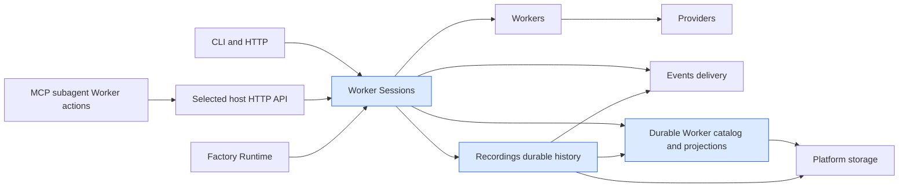

# Worker Session visibility and controls plan

Status: Proposed. Binding MCP fold amendment: owner 2026-10-06T09:59Z; one `you.subagent` action tool replaces the three Worker Session tool names, preserving their capabilities and existing RUN behavior. Source inspection: October 2, 2026. This plan specifies future work; it does not claim that proposed behavior or validation has been delivered.

## 1. Problem and desired outcome

### Problem statement

Operators cannot consistently discover what active Workers are doing, inspect their history independently of provider rollout files, or safely stop and redirect the exact execution they observed.

### Current behavior and gap

There is already a substantial Worker Session implementation. `you worker-sessions` supports `list`, `show`, `stream`, `read`, `invoke`, `continue`, `interrupt`, and lifecycle controls. HTTP exposes matching identity, event, transcript, start, continuation, interruption, and control operations. Recordings already has Worker capture, opening barriers, terminal health, portable histories, and replay. Factory-scoped and copied-ledger history tests protect parts of durable inspection.

The fleet enumeration in `worker_sessions/internal/service/observations.go` collects IDs from process-local observations and sessions. Its transcript projection rejects active sessions, requires a Provider Session association, and calls `provider_sessions.Project`. Existing durable identity/event inspection is therefore a foundation to extend, not proof of a complete durable fleet catalog or provider-independent transcript experience. Existing controls route to the owning execution; `Terminate` is cancellation plus joining the callback, which does not establish a portable force-kill guarantee. Direct interruption already cancels the source and creates a distinct successor, using its exact Provider Session.

Historical source finding (October 2, before T9 and T6c): MCP exposed none of this. `you server mcp` registers only the generated discovery in `pkg/transports/mcp/generated/discovery.json` (ten `you.factory_session.*` tools plus `you.subagent`), and the production tool operation in `pkg/wire/profiles.go:617-630` dispatches every name to `factorysessionmcp.BindToolOperation`. No `worker_sessions/transports/mcp` adapter exists, and `docs/reference/mcp.md:22-24` states the stdio server does not connect to a live HTTP server. The stdio process composes its own in-process services (`contracts/cli/commands.json` places `you.server.mcp` as `local-only`), so an MCP tool bound to in-process Worker Sessions would see none of the daemon's live Workers. The operator agent that drives this project acts mostly through MCP, so MCP parity is a delivery requirement, not polish.

These are source findings, not runtime reproductions. Architecture notes describe process-local Worker Session ownership; implementation now also consumes Recordings. Update those notes to reflect the resulting durable read architecture.

### Desired outcome and success measures

An operator can discover an owned active direct or Factory Worker, see its captured messages, tool activity, output, lifecycle, and termination reason, reconnect without losing committed history, and address controls by Worker Session ID. Ended and recovered sessions remain discoverable through an explicit history selector without accessing provider rollout directories.

Release evidence must show:

- Every supported admitted attempt has a durable opening before external execution and a queryable identity.
- Captured observations remain readable after host restart and after removing access to provider rollout storage. Uncaptured provider internals are explicitly unavailable.
- Acknowledged durable positions replay in order without duplication or silent gaps.
- Stop, termination, force kill, and interruption affect only the observed admitted attempt; no successor overlaps an unconfirmed predecessor.
- Direct provider invocation preserves requested supported parameters, returns the stable Worker Session ID, and is inspectable through the same commands.
- An agent operator reaches the bootstrap capabilities (list/history, summary, transcript, logs page and polling follow, capture health, cancel, terminate, kill, interrupt with resume mode) through `you.subagent` actions LIST, READ and CONTROL against the selected host, with functional parity evidence against the matching CLI/HTTP outcome. Continue, pause/resume and start stay CLI/HTTP-only until a follow-up extends `control`.
- Observations and log records carry enough facts for later experiment metrics: start/end/duration, per-record capture time, token usage, provider/model/reasoning effort, attempt/dispatch/Work/Factory Session lineage, predecessor/successor links and a terminal cause that distinguishes operator stops from natural outcomes.
- The latency, capacity, privacy, and failure thresholds in section 7 pass their owning gates.

## 2. Scope and constraints

### In scope

Durable fleet discovery; active and archived selectors; bounded provider-independent log and transcript reads; finite replay and follow; truthful capture health; host-loss recovery; durable control idempotency; graceful cancellation and joined termination; explicit capability-gated force kill; direct interruption with provider continuation or an explicit recorded-context restart; existing provider-specific invocation parameters; CLI, HTTP and MCP parity (MCP tools route to the selected `--server` host); generated clients and MCP discovery; analysis-ready observation fields; packaged CLI and MCP reference documentation.

Include visibility and cancellation for Factory-originated attempts. Factory Runtime retains authority over scheduling, Work results, retries, capacity, and dispatch lineage. Direct session interruption is delivered here; a Factory attempt must be redirected through a Runtime-owned operation rather than by creating an untracked direct successor.

### Non-goals

A new dashboard (existing dashboard consumers must keep working; see T8), aggregated metrics endpoints or experiment bookkeeping (observers derive metrics from the fields above), MCP streaming notifications (MCP follow is cursor polling), arbitrary process attachment, managing agents launched outside `you`, a universal durable Events bus, changing the canonical Factory ledger, synthesizing private model reasoning, scraping every provider's historical directory, silently recovering tool side effects, automatic resumption after host loss, and inventing pause support for providers that cannot pause.

### Assumptions and constraints

Use existing Worker Session and Recordings contracts wherever possible. Recordings owns durable history, catalog/projection implementations and capture policy; Worker Sessions consumes those durable capabilities and owns identity, control validation, and live supervision; Events remains an in-memory delivery service. Platform storage/process primitives remain policy-free. Composition stays in `pkg/wire` and service-owned `wire/`. A concurrent flat-dependency-injection project is reshaping `pkg/wire` and service `wire/` packages: every new constructor in this plan (catalog reader, control-operation store, kill capability, MCP adapter, host client factory) takes fixed direct dependencies supplied by the owner `wire` package, with no optional fallbacks, setters, nil-means-default branches or service getters. Rebase onto that project's merged shape rather than copying a pre-refactor provider pattern.

History means past `you` Worker Sessions, including older compatible recordings. Historical discovery uses Portos-owned captured sessions only. Provider-issued session references are execution/continuation identities, not permission to scan native rollout directories. Provider Sessions consumers must migrate to captured projections where applicable; do not present unowned third-party sessions as supervised Workers. Live status requires current ownership, not merely a persisted RUNNING record or a surviving PID.

CLI defaults have compatibility implications: initially preserve the current omitted-selector list and add explicit `--history active|all|archived`. Adopt active-by-default only in a separately announced breaking release, with `--history all` as the documented migration. This plan does not silently change existing automation output.

### Decisions (formerly open questions)

Each row is the binding default for task packets. An operator or Project Lead may overturn a row only by amending this plan before the affected lane is dispatched.

| Question | Decision | Revisit trigger |
| --- | --- | --- |
| Must Factory Workers support interrupt-and-replace in this delivery? | No. Factory-origin interrupt returns UNSUPPORTED before any cancellation. Factory Workers get visibility, cancel, terminate and (where proved) kill. | Operator requests Factory replacement: add a Runtime-owned delta task after T4. |
| Which provider adapters can force terminate? | Kill is enabled only for local command-runner executions whose process tree is owned by the host (Codex and Claude command adapters) on platforms where I1 actually executed. ACP and hosted/remote providers return UNSUPPORTED. | T1 finds a different real boundary, or an adapter exposes a remote cancellation API. |
| Which platforms are claimed for kill? | Linux, proven by the existing `backend-integration` CI job (`.github/workflows/ci.yml:573`, ubuntu-latest). Windows is claimed only if the T5 lane records a Windows I1 run of the same package against a prebuilt artifact; otherwise Windows kill returns UNSUPPORTED. No new Windows CI job in this project. | Operator funds a Windows integration job. |
| Can native provider continuation survive host restart? | Preserve the captured reference and sanitized recipe; claim continuation only for adapters with controlled-runner tests (Codex `resume`, Claude `--resume`) and label real-provider behavior unproven without I2. | I2 authorized. |
| How much history predates usable Worker recordings? | No backfill from provider files. Older recordings are listed when decodable and otherwise classified INCOMPLETE/unsupported. T1 reports counts from a sample profile. | — |
| What retention applies? | No new retention mechanism or configuration in this project. Existing recording retention (T1 records what exists) applies to catalog entries; the 30-day / 5 GiB figures are L1 sizing targets only. | Retention enforcement is a follow-up plan. |
| How does MCP reach live Workers? | Worker Session MCP tools call the HTTP API of the host selected by the inherited `--server` flag (default `http://localhost:7437`), exactly like the `remote-only` CLI read commands. An unreachable host is a typed retryable error; there is no in-process fallback. Existing `you.factory_session.*` tools and `you.subagent` RUN keep their in-process behavior. | — |
| How large is the new public surface? | MCP has one `you.subagent` tool with RUN (default), LIST, READ (a `view` selector) and CONTROL (an `operation` enum); ten Factory Session tools remain unchanged. Later tasks add enum values, view kinds or optional fields, never tools. Continue, pause/resume and start through MCP are deferred. CLI and HTTP fold the same way: logs is `read --view logs`, and kill is `terminate --force`, an optional body on the existing terminate route. The only new route is `/logs`. | The operator needs a deferred capability through MCP. Add it as a `control` operation in a follow-up (START would carry the start request fields). |
| How does MCP follow live output? | Cursor polling: `you.subagent` READ with `view: logs` and `nextToken` until state is terminal and `committedPosition` stops advancing. No MCP notifications or long-poll in this project. | Measured polling cost in V1 exceeds the section 7 targets. |
| Default for omitted `--history`? | Unchanged compatibility view (section 5); MCP `you.subagent` LIST defaults `history` to `all` because it is a new surface with no compatibility burden. | Separate breaking-release plan. |

### Replanning triggers

Estimate nine implementation tasks (T1-T9) plus one independent validation deployment. Replan if a durable fleet listing already satisfies the journey, capture loses source records before persistence, provider parameters require new contracts, process ownership cannot safely support kill, recorded-context restart needs unsupported tools, or Factory replacement is required. Add a traced delta rather than stretching a task. No agents are dispatched by this document.

## 3. Recommended approach

Extend existing Worker recordings into the durable read source and discoverable catalog, while keeping live execution ownership in Worker Sessions and Factory Runtime. Add bounded CLI/API/MCP queries, durable control operations, and an explicit distinction between native continuation and restart from recorded context. Deliver nine slices and one clean-environment loopback, beginning with characterization, an MCP spine over the existing operations (T9), and a provider-independent inspection spine (T2). Every later slice that adds a capability extends the CLI, HTTP and MCP surfaces in the same PR. It prefers a new flag, enum value or optional field on an existing command, route or tool over a new one.

### Decision record

| Option | Decision | Evidence and tradeoff |
| --- | --- | --- |
| Extend Recordings and current Worker Session surfaces | Recommended | Capture, portable replay, identity reads, and controls exist; preserves owners and avoids a second canonical journal. |
| Rely on provider rollout files | Remove Codex/Cursor reader code and its consumers after Portos capture replaces reads | Native log files are outside the canonical visibility boundary. Provider IDs remain necessary for native continuation, independently of reading those files. |
| Make Events globally durable | Reject for this feature | Events owns short-lived delivery; durable Factory and Worker capture already belong to Recordings. |
| Treat all stop actions as kill | Reject | Current terminate joins cancellation; hard termination has provider and OS capability requirements and may leave external side effects unfinished. |

## 4. Customer behavior

### Actors and permissions

The local operator may inspect/control sessions in their selected profile. Remote operators use the deployment's existing authentication and authorization; reads, transcript access, invocation, and controls must enforce the same resource scope. Do not assume a new multi-user RBAC system already exists. An ID or cursor conveys no permission. Archived sessions are readable but have no restored execution authority.

### User journeys

Discover and inspect:

```text
you --server http://localhost:7437 worker-sessions list --history active --output json
you --server http://localhost:7437 worker-sessions show --worker-session-id WS_ID
you --server http://localhost:7437 worker-sessions read --worker-session-id WS_ID --view logs --limit 100
you --server http://localhost:7437 worker-sessions read --worker-session-id WS_ID --view logs --follow
you --server http://localhost:7437 worker-sessions list --history archived --output json
```

Stop or redirect:

```text
you --server http://localhost:7437 worker-sessions cancel WS_ID --remote
you --server http://localhost:7437 worker-sessions terminate WS_ID --remote
you --server http://localhost:7437 worker-sessions terminate WS_ID --remote --force --request-id KILL_ID --expected-attempt-id ATTEMPT_ID
you --server http://localhost:7437 worker-sessions interrupt WS_ID --remote --request-id INTERRUPT_ID --successor-worker-session-id NEXT_ID --replacement-message "Stop the current approach and inspect the failing tests"
you --server http://localhost:7437 worker-sessions interrupt WS_ID --remote --request-id INTERRUPT_ID --successor-worker-session-id NEXT_ID --resume-mode recorded --replacement-message "Use the captured work as context and try a smaller change"
```

The same journeys through MCP (host started as `you --server http://localhost:7437 server mcp`):

```text
you.subagent {"action":"LIST","history":"active","scope":"all"}
you.subagent {"action":"READ","workerSessionId":"WS_ID"}
you.subagent {"action":"READ","workerSessionId":"WS_ID","view":"logs","limit":100,"nextToken":"TOKEN"}
you.subagent {"action":"CONTROL","workerSessionId":"WS_ID","operation":"TERMINATE"}
you.subagent {"action":"CONTROL","workerSessionId":"WS_ID","operation":"KILL","requestId":"KILL_ID","expectedAttemptId":"ATTEMPT_ID"}
you.subagent {"action":"CONTROL","workerSessionId":"WS_ID","operation":"INTERRUPT","requestId":"INTERRUPT_ID","successorWorkerSessionId":"NEXT_ID","replacementMessage":"...","resumeMode":"recorded"}
```

Provider invocation uses the existing `invoke` command, supported `--provider`, `--model`, `--reasoning-effort`, prompts, retry budget, and `--execution FILE` contract. Characterize its actual required route arguments before publishing minimal copy-paste examples. Additional supported parameters already represented in `WorkerSessionResolvedExecution`, such as working directory, output schema, and environment variables, remain in the execution document. Provider secrets resolve through existing provider configuration; never put credential values in a persistent execution recipe. Reject unsupported parameters before admission.

For cross-command visibility, recommend `invoke --remote --async` against the selected running host. A short-lived local invocation is inspectable from its durable recording after exit; this plan does not imply that a new CLI process inherits its supervisor or keeps an async local worker alive.

### Default and result states

| State | Observable behavior |
| --- | --- |
| Default | Existing list semantics during compatibility; explicit active view spans direct and Factory origins. The logs view is finite unless --follow. |
| Loading | Diagnostics on stderr; JSON stdout contains only complete schema-valid records. |
| Empty | Exit 0 with an empty collection or existing empty-list message; an unknown identity remains distinguishable. |
| Success | Stable IDs, ordered bounded observations, cursor, capture completeness, and authoritative control outcomes. |
| Error | Typed invalid-cursor, unavailable/corrupt-history, ownership, unsupported-capability, or control-phase error; no false empty success. |
| Permission | Existing scoped denial without exposing payloads or sibling IDs. |
| Disconnect | Ctrl-C stops the observer. Admitted remote executions and durable control intents continue independently. |
| History incomplete | Present the captured prefix and explicit health/gap information; never imply a complete transcript. |

### Accessibility and localization

CLI and MCP only: no responsive layout, focus management, or visual reference applies. Human output remains readable without ANSI or color; redirected JSON/NDJSON is stable, stdout/stderr stay separate, and Ctrl-C detaches observation promptly. Follow existing customer terminology and error localization conventions; IDs, enum values, and machine fields are stable protocol literals.

## 5. Contracts and data

All shapes below are proposed source-plan contracts, not edits to generated files. Existing start, continue, cancel, terminate, pause/resume, observation and event schemas remain unchanged unless explicitly specified. Transcript JSON remains compatible for recorded sessions with a Provider Session association, but its data source changes to Portos capture. Discovery of sessions existing only in third-party logs is intentionally retired.

### Contract inventory

| Contract | Authored source | Classification | Consumers |
| --- | --- | --- | --- |
| Fleet history selector | api/openapi-main.yaml, GET /worker-sessions | Additive during compatibility; later default change breaking | CLI list, HTTP clients, dashboard API adapter |
| CLI history, read view, terminate force, resume mode | contracts/cli/commands.json (new flags on existing `list`, `read`, `terminate` and `interrupt`; no new commands) | Additive; later list default breaking | Manifest generation, command bindings, packaged help |
| Canonical captured logs | New api/components/schemas/api/WorkerSessionLogPage.yaml and /logs route in api/openapi-main.yaml (the only new route and response schema) | Additive | CLI, HTTP clients, future dashboard |
| Force terminate mode | Optional request body on existing POST /worker-sessions/{worker_session_id}/terminate; optional `forced` in WorkerSessionControlResponse.yaml | Additive; body-less requests unchanged | CLI `terminate --force`, MCP `control` KILL, Worker Session control adapter |
| Interrupt mode | api/components/schemas/api/WorkerSessionInterruptRequest.yaml | Additive, default provider preserves current behavior | CLI, HTTP and Worker Sessions |
| Catalog and control-operation records | Proposed worker_capture schema files below | Additive versioned durable contracts | Recordings writer/reducer, recovery and migration |
| Captured transcript | Existing /transcript and WorkerSessionTranscriptResponse.yaml | JSON shape unchanged; source semantics changed, third-party-only discovery retired | Existing clients and read command migrated to Portos projections |
| MCP Worker Session tools | contracts/mcp/tools.json and contracts/mcp/manifest.json (generated: pkg/transports/mcp/generated/discovery.{json,gen.go}, packages/api/generated/mcp/manifest.json) | Three additive tools (`list`, `read`, `control`); `you server mcp` additionally reads `--server` | MCP hosts, operator agents, mcp-contract-check |
| MCP host selection | pkg/initializer/process/contracts.go MCPIntent and pkg/wire/profiles.go MCP server builder | Additive Go field | `you server mcp`, wire composition |
| Analysis fields | api/components/schemas/api/WorkerSessionObservation.yaml, WorkerSessionEventRecord.yaml | Additive optional fields | CLI/HTTP/MCP readers, dashboard generated types |
| Generated Go client operations | api/codegen_config/client.yaml include-operation-ids | Additive list entries (the Go client is a filtered subset; today it has only get/transcript/stream-by-factory-session Worker Session operations) | MCP host adapter, integration tests |
| Public-surface coverage manifest | contracts/functional-scenarios.json (checked by `make contracts-check`) | One `covered` entry per new REST operation and MCP tool, with a test pointer; new flags and views add test pointers to the existing entries | Functional coverage gate |

### Captured transcript source contract

Authored source: `api/components/schemas/api/WorkerSessionTranscriptResponse.yaml`. The concrete change is the entries source; unchanged fields retain the existing associated-session envelope.

Current:

```yaml
type: object
additionalProperties: false
required:
  - workerSessionId
  - providerSession
  - workIds
  - attemptId
  - state
  - entries
properties:
  workerSessionId:
    type: string
    description: Stable Worker Session identity.
  factorySessionId:
    type: string
    description: Explicit Factory Session scope used for this transcript read.
  providerSession:
    $ref: './WorkerSessionProviderSessionRef.yaml'
  workIds:
    type: array
    items:
      type: string
    description: Work identities correlated with this Worker Session attempt.
  turnId:
    type: string
    nullable: true
    description: Optional turn correlation identifier.
  attemptId:
    type: string
    description: Stable attempt or dispatch identity.
  state:
    type: string
    description: Terminal Worker Session lifecycle state at transcript read time.
  entries:
    type: array
    description: Ordered normalized transcript entries projected by Provider Sessions.
    items:
      $ref: './ProviderSessionTranscriptEntry.yaml'
```

Proposed:

```yaml
type: object
additionalProperties: false
required:
  - workerSessionId
  - providerSession
  - workIds
  - attemptId
  - state
  - entries
properties:
  workerSessionId:
    type: string
    description: Stable Worker Session identity.
  factorySessionId:
    type: string
    description: Explicit Factory Session scope used for this transcript read.
  providerSession:
    $ref: './WorkerSessionProviderSessionRef.yaml'
  workIds:
    type: array
    items:
      type: string
    description: Work identities correlated with this Worker Session attempt.
  turnId:
    type: string
    nullable: true
    description: Optional turn correlation identifier.
  attemptId:
    type: string
    description: Stable attempt or dispatch identity.
  state:
    type: string
    description: Terminal Worker Session lifecycle state at transcript read time.
  entries:
    type: array
    description: Ordered normalized transcript entries projected from Portos-captured Worker records.
    items:
      $ref: './ProviderSessionTranscriptEntry.yaml'
```

Wire shape remains unchanged; regenerate affected documentation/types and migrate CLI/HTTP/UI reads to the captured projection. Do not use provider_sessions.Project as fallback. A recorded session with no provider association is inspectable through logs; extending this transcript envelope to omit providerSession requires a separate explicit contract delta. Third-party-only sessions have no captured transcript and are no longer discovered through native files. Retain the old read implementation only until T8's dedicated removal, and never restore it as the final compatibility path.

### Fleet selector

Authored source: `api/openapi-main.yaml`, `paths./worker-sessions.get.parameters`. The following comparison preserves existing parameter values and response references; the excerpt normalizes YAML layout.

Current:

```yaml
# api/openapi-main.yaml: paths./worker-sessions.get.parameters
parameters:
  - name: scope
    in: query
    required: false
    description: Origin scope to inspect. Omit for the fleet-wide view.
    schema:
      type: string
      enum: [direct, factory, all]
      default: all
  - name: state
    in: query
    required: false
    description: Optional repeated Worker Session lifecycle state filters.
    style: form
    explode: true
    schema:
      type: array
      items:
        type: string
        enum: [RESERVED, STARTING, RUNNING, PAUSED, COMPLETED, FAILED, CANCELED, TERMINATED]
  - $ref: '#/components/parameters/MaxResults'
  - $ref: '#/components/parameters/WorkerSessionLimit'
  - $ref: '#/components/parameters/NextToken'
```

Proposed:

```yaml
# api/openapi-main.yaml: paths./worker-sessions.get.parameters
parameters:
  - name: scope
    in: query
    required: false
    description: Origin scope to inspect. Omit for the fleet-wide view.
    schema:
      type: string
      enum: [direct, factory, all]
      default: all
  - name: state
    in: query
    required: false
    description: Optional repeated Worker Session lifecycle state filters.
    style: form
    explode: true
    schema:
      type: array
      items:
        type: string
        enum: [RESERVED, STARTING, RUNNING, PAUSED, COMPLETED, FAILED, CANCELED, TERMINATED]
  - $ref: '#/components/parameters/MaxResults'
  - $ref: '#/components/parameters/WorkerSessionLimit'
  - $ref: '#/components/parameters/NextToken'
  - name: history
    in: query
    required: false
    description: >-
      active selects owned nonterminal sessions; all includes durable history;
      archived selects ended or owner-lost sessions. Omission retains the
      process-local compatibility view during the migration interval.
    schema:
      type: string
      enum: [active, all, archived]
```

The existing 200 ListWorkerSessionsResponse and 400/500 error responses remain unchanged. Reuse existing observation state, failure and recording-health representations. Scope, states, limit and history compose before pagination; conflicting active/terminal filters yield an empty match. Reject history on the legacy Work-scoped endpoint until that endpoint has its own documented extension. Bind opaque cursors to profile, origin, filters and snapshot generation; later sessions do not silently enter an earlier snapshot.

Compatibility: omitted selector retains existing behavior for at least one minor release. No new enum enters existing lifecycle fields. Recovered owner-loss histories use existing FAILED plus PROCESS_GONE only where loss is established; otherwise incomplete capture health remains explicit. Before changing the omitted default, amend this plan with the exact `default: active` contract and publish a breaking-release migration.

### CLI grammar

Authored source: `contracts/cli/commands.json`, Worker Session family. Native command grammar excerpt; existing unrelated global flags remain unchanged.

Current:

```text
you worker-sessions list [--work-id ID] [--scope direct|factory|all] [--state STATE]... [--limit N] [--max-results N] [--next-token TOKEN] [--session ID] [--output json]
you worker-sessions read (--worker-session-id ID | --provider P --kind K --id ID) [--session ID] [--output json]
you worker-sessions stream (--worker-session-id ID | --provider P --kind K --id ID) [--session ID] [--follow] [--replay-only] [--output json]
you worker-sessions terminate ID [--output json]
you worker-sessions interrupt SOURCE_ID --request-id REQUEST_ID --successor-worker-session-id ID --replacement-message MESSAGE [--async] [--output json]
# --remote and --server are persistent root flags, not per-command flags.
# history selector, read view, terminate force and resume-mode flags: Not present
```

Proposed (new flags only; no new commands):

```text
you worker-sessions list [--work-id ID] [--scope direct|factory|all] [--state STATE]... [--limit N] [--max-results N] [--next-token TOKEN] [--session ID] [--history active|all|archived] [--output json]
you worker-sessions read (--worker-session-id ID | --provider P --kind K --id ID) [--session ID] [--view transcript|logs] [--limit N] [--next-token TOKEN] [--follow] [--output json]
you worker-sessions stream (unchanged)
you worker-sessions terminate ID [--force --request-id REQUEST_ID --expected-attempt-id ATTEMPT_ID] [--output json]
you worker-sessions interrupt SOURCE_ID --request-id REQUEST_ID --successor-worker-session-id ID --replacement-message MESSAGE [--resume-mode provider|recorded] [--async] [--output json]
```

`--view` defaults to `transcript`, so existing `read` invocations are unchanged. `--view logs` requires `--worker-session-id`. `--limit`, `--next-token` and `--follow` are usage errors without `--view logs`. N defaults to 100 and is 1..1000. The logs view outputs a page in finite JSON mode and existing WorkerSessionEvent frames in follow NDJSON mode. A next token binds the exact Worker Session and recording generation. `--follow` (T3) consumes the finite committed prefix, then switches at the acknowledged watermark to existing event delivery, backfilling from durable history on an Events retention gap. `stream` is unchanged. `read --view logs --follow` differs from `stream --follow` only by starting from the durable page and backfilling across Events retention gaps.

`--force` requires `--request-id` and `--expected-attempt-id`, and both are usage errors without `--force`. Force terminate uses explicit remote placement or the existing owner-routing policy; remote failure never dispatches against another host. No new stop command or alias is needed: cancel requests a graceful stop, terminate stops and joins, and `terminate --force` force-terminates at a proved boundary. Placement is unchanged (`read` stays `remote-only`, `terminate` stays `dual`). Regenerate CLI manifests/help through `make cli-manifest-generate`; retain aliases and `--max-results`. There are no new commands, so `contracts/functional-scenarios.json` gets no new `cli/` entry; the existing `cli/you.worker-sessions.read`, `terminate`, `list` and `interrupt` entries gain test pointers for their new flags.

### Captured logs page

Authored sources: new `api/components/schemas/api/WorkerSessionLogPage.yaml` and `api/openapi-main.yaml` logs operation.

Current:

```yaml
# Not present
```

Proposed:

```yaml
# api/components/schemas/api/WorkerSessionLogPage.yaml
type: object
additionalProperties: false
required: [workerSessionId, recordingGenerationId, committedPosition, health, events]
properties:
  workerSessionId:
    type: string
    minLength: 1
  recordingGenerationId:
    type: string
    minLength: 1
  committedPosition:
    type: integer
    format: int64
    minimum: 0
  health:
    type: string
    enum: [COMPLETE, DEGRADED, INCOMPLETE]
    description: Capture completeness, independent of execution success.
  events:
    type: array
    maxItems: 1000
    items:
      $ref: './WorkerSessionEvent.yaml'
  nextToken:
    type: string
    minLength: 1
---
# api/openapi-main.yaml, paths addition
/worker-sessions/{worker_session_id}/logs:
  get:
    tags: [Worker Sessions]
    operationId: readWorkerSessionLogs
    summary: Read captured Worker Session observations
    parameters:
      - $ref: '#/components/parameters/WorkerSessionID'
      - name: limit
        in: query
        required: false
        schema:
          type: integer
          minimum: 1
          maximum: 1000
          default: 100
      - $ref: '#/components/parameters/NextToken'
    responses:
      '200':
        description: A bounded captured prefix with its durable watermark.
        content:
          application/json:
            schema:
              $ref: '#/components/schemas/WorkerSessionLogPage'
      '400':
        $ref: '#/components/responses/BadRequest'
      '404':
        $ref: '#/components/responses/NotFound'
      '503':
        $ref: '#/components/responses/WorkerSessionRecordingUnavailable'
```

/logs is the plan's only new HTTP route. Neither existing read route can carry the page without changing its contract: /events is an SSE stream, and /transcript is terminal-only (409 while active) with a required `providerSession`. Add matching component registration to the authored entrypoint. Use existing deployment permission/error responses; do not invent an auth mechanism. COMPLETE means no detected capture loss, including a currently active committed prefix; it does not assert execution completion. Stream delivery remains the existing schema. Logs provides provider-independent rollout visibility. T2 delivers only the /logs route and the `read --view logs` CLI view. T8 (not T2) migrates the default transcript view of `read` and /transcript to normalized Portos-captured content and removes calls to provider_sessions.Project and all Codex/Cursor native log readers. Preserve the current transcript envelope for recorded sessions with an associated provider reference; sessions without that reference use logs until an explicitly planned envelope extension is approved. Provider-session tuple routes resolve recorded associations only and never scan native directories.

No data migration is required for the API. Old compatible recordings are decoded through existing codecs; unavailable content produces a health classification, never provider scraping. A rollback can remove consumers of /logs while retaining recordings.

### Force terminate mode

Authored sources: `api/openapi-main.yaml` `paths./worker-sessions/{worker_session_id}/terminate.post` (optional request body) and `api/components/schemas/api/WorkerSessionControlResponse.yaml` (optional property). The plan adds no route, operation ID or schema file.

Current:

```yaml
# paths./worker-sessions/{worker_session_id}/terminate.post (excerpt)
operationId: terminateWorkerSession
parameters:
  - $ref: '#/components/parameters/WorkerSessionID'
# requestBody: Not present
# 200 WorkerSessionControlResponse; 400; 404; 409 WorkerSessionControlConflict;
# 500 WorkerSessionControlInternalError; 503 WorkerSessionControlUnavailable
---
# WorkerSessionControlResponse.yaml: forced property Not present
```

Proposed:

```yaml
# paths./worker-sessions/{worker_session_id}/terminate.post, added
requestBody:
  required: false
  content:
    application/json:
      schema:
        type: object
        additionalProperties: false
        properties:
          force:
            type: boolean
            default: false
            description: >-
              Force terminate the exact owned attempt at a proved process
              boundary. Requires requestId and expectedAttemptId.
          requestId:
            type: string
            minLength: 1
          expectedAttemptId:
            type: string
            minLength: 1
---
# WorkerSessionControlResponse.yaml, properties addition
  forced:
    type: boolean
    description: Present and true only when the request set force. action stays TERMINATE.
```

A request with no body, or with `force: false` and no other fields, keeps today's joined terminate unchanged. `force: true` without both `requestId` and `expectedAttemptId` is 400, and so are those fields without `force: true`. The action enum is not widened. Force mode keeps the existing outcome and state vocabulary and the existing error responses. UNSUPPORTED must be an honest existing control outcome and perform no mutation. A stale attempt returns conflict before effects; an unavailable termination boundary returns failure rather than success. A request interrupted while waiting remains recoverable with the same key; the force join deadline is a service policy, initially 10 seconds. Unknown termination after deadline is not APPLIED. The generated Go and TypeScript terminate signatures gain an optional body; HTTP callers that send none are unaffected. The internal control-operation record keeps action `kill`. Internal capability extensions need their exact Go Current/Proposed signatures in T5's implementation packet after T1 identifies the real boundary.

### Interrupt restart mode

Authored source: `api/components/schemas/api/WorkerSessionInterruptRequest.yaml`.

Current:

```yaml
type: object
additionalProperties: false
required:
  - requestId
  - successorWorkerSessionId
  - replacementMessage
description: >-
  Idempotent interrupt-and-replace request for one active Worker Session. The
  server cancels the exact source dispatch, waits for its authoritative
  CANCELED outcome, and admits the distinct successor with this replacement
  input. The source identity is supplied by the route.
properties:
  requestId:
    type: string
    minLength: 1
    description: Required caller idempotency key for this interrupt.
  successorWorkerSessionId:
    type: string
    minLength: 1
    description: Distinct Worker Session identity to reserve for the replacement.
  replacementMessage:
    type: string
    minLength: 1
    description: Non-empty replacement input delivered to the admitted successor.
```

Proposed:

```yaml
type: object
additionalProperties: false
required:
  - requestId
  - successorWorkerSessionId
  - replacementMessage
description: >-
  Idempotent interrupt-and-replace request for one active Worker Session. The
  server cancels the exact source dispatch, waits for its authoritative
  CANCELED outcome, and admits the distinct successor with this replacement
  input. The source identity is supplied by the route.
properties:
  requestId:
    type: string
    minLength: 1
    description: Required caller idempotency key for this interrupt.
  successorWorkerSessionId:
    type: string
    minLength: 1
    description: Distinct Worker Session identity to reserve for the replacement.
  replacementMessage:
    type: string
    minLength: 1
    description: Non-empty replacement input delivered to the admitted successor.
  resumeMode:
    type: string
    enum: [provider, recorded]
    default: provider
    description: >-
      provider continues the recorded Provider Session; recorded starts a fresh
      provider execution from bounded recorded context and replacementMessage.
      There is no automatic fallback between modes.
```

Existing response/error snapshots and phases remain unchanged. Validate mode and restart recipe before canceling. Provider mode continues the exact recorded association; missing/unsupported association fails before cancellation. Recorded mode omits provider resume identity and supplies the original sanitized execution settings, bounded captured context, and replacement input to a new execution. Truncation is explicit in captured successor input; replacement input is never discarded. Neither mode promises rollback of tools already executed.

The durable operation stores the chosen mode and normalized tuple. Reusing a key with changed mode or message is a conflict. Existing clients omit mode and retain provider behavior. Factory-originated interruption is unsupported until Runtime owns a replacement operation; visibility and stopping do not depend on that extension.

### Durable catalog and control record schemas

Authored sources proposed under `pkg/services/recordings/internal/services/worker_capture/schemas/`. These are internal JSON Schema contracts, not public OpenAPI domain models.

Current:

```json
{
  "$comment": "# Not present: session-catalog.v1.schema.json and control-operation.v1.schema.json"
}
```

Proposed:

```json
{
  "$schema": "https://json-schema.org/draft/2020-12/schema",
  "$id": "you.worker-session-catalog.v1",
  "type": "object",
  "additionalProperties": false,
  "required": ["version", "workerSessionId", "recordingId", "recordingGenerationId", "origin", "ownerEpoch", "committedPosition"],
  "properties": {
    "version": {"const": 1},
    "workerSessionId": {"type": "string", "minLength": 1},
    "recordingId": {"type": "string", "minLength": 1},
    "recordingGenerationId": {"type": "string", "minLength": 1},
    "origin": {"enum": ["direct", "factory"]},
    "factorySessionId": {"type": "string", "minLength": 1},
    "ownerEpoch": {"type": "string", "minLength": 1},
    "committedPosition": {"type": "integer", "minimum": 0}
  }
}
```

```json
{
  "$schema": "https://json-schema.org/draft/2020-12/schema",
  "$id": "you.worker-session-control-operation.v1",
  "type": "object",
  "additionalProperties": false,
  "required": ["version", "requestId", "workerSessionId", "expectedAttemptId", "action", "phase", "inputDigest"],
  "properties": {
    "version": {"const": 1},
    "requestId": {"type": "string", "minLength": 1},
    "workerSessionId": {"type": "string", "minLength": 1},
    "expectedAttemptId": {"type": "string", "minLength": 1},
    "action": {"enum": ["cancel", "terminate", "kill", "interrupt"]},
    "phase": {"enum": ["INTENT", "SOURCE_STOPPED", "SUCCESSOR_ADMITTED", "COMPLETED", "FAILED"]},
    "inputDigest": {"type": "string", "pattern": "^[a-f0-9]{64}$"},
    "successorWorkerSessionId": {"type": "string", "minLength": 1},
    "resumeMode": {"enum": ["provider", "recorded"]}
  },
  "allOf": [
    {
      "if": {"properties": {"action": {"const": "interrupt"}}},
      "then": {"required": ["successorWorkerSessionId", "resumeMode"]}
    }
  ]
}
```

Valid examples:

```json
{"version":1,"workerSessionId":"ws-001","recordingId":"recording-001","recordingGenerationId":"generation-001","origin":"direct","ownerEpoch":"owner-001","committedPosition":8}
```

```json
{"version":1,"requestId":"kill-001","workerSessionId":"ws-001","expectedAttemptId":"attempt-001","action":"kill","phase":"INTENT","inputDigest":"aaaaaaaaaaaaaaaaaaaaaaaaaaaaaaaaaaaaaaaaaaaaaaaaaaaaaaaaaaaaaaaa"}
```

The catalog is rebuildable from existing recordings and opening metadata, not authoritative lifecycle state. Operation records are committed through the Recordings-owned durable store, using its ordered record envelope; their request identity and digest are scoped to profile/host. Persist replacement input and sanitized restart recipe as existing captured input artifacts, referenced by successor identity; a digest alone cannot resume interrupted admission.

T1 must locate the actual canonical record envelope and binding schema. If these shapes cannot be represented without a second ledger or changing that envelope, T2/T4 must issue a contract delta with exact existing and proposed excerpts before implementation. Do not create a competing journal because this plan provides new schema names.

### Captured record time (T2)

Authored source: `api/components/schemas/api/WorkerSessionEventRecord.yaml`. Per-record time is required to derive tool latency, time-to-first-output and stall metrics; today no Worker Session record carries one.

Current (properties excerpt; `required` list unchanged):

```yaml
properties:
  cursor: {$ref: './WorkerSessionEventCursor.yaml'}
  position: {type: integer, format: int64, minimum: 1}
  sourceType: {type: string}
  sourceId: {type: string}
  sourceSequence: {type: integer, format: int64, minimum: 1}
  sourceEventId: {type: string}
  schemaId: {type: string}
  payload: {type: object, additionalProperties: true}
```

Proposed (added property only):

```yaml
  capturedAt:
    type: string
    format: date-time
    description: >-
      Host time at which Recordings committed this record. Omitted for records
      captured before this field existed. Never provider-reported time.
```

Source: the Recordings record envelope's existing recorded time (`pkg/services/recordings/internal/contracts/contracts.go` carries `RecordedAt` on recorded entries; T1 confirms whether Worker capture records reuse that envelope). If Worker capture records have no stored time, T2 adds it to newly captured records only; it never synthesizes times for old records. Applies to logs pages and SSE frames alike.

### Observation analysis fields (T3, T4)

Authored source: `api/components/schemas/api/WorkerSessionObservation.yaml`. The Go `workersessions.Observation` already has `PredecessorWorkerSessionID` and `SuccessorWorkerSessionID` (`pkg/services/worker_sessions/observation.go:259-262`) but the public schema drops them, and the provider identity is only visible through `providerSession`, which is absent before a provider reference exists.

Current: none of the properties below exist; `required` list unchanged.

Proposed (all optional, additive):

```yaml
  predecessorWorkerSessionId:
    type: string
    description: Source Worker Session when this session was admitted by continue or interrupt. (T3)
  successorWorkerSessionId:
    type: string
    description: Successor admitted from this session by continue or interrupt, when known. (T3)
  provider:
    type: string
    description: Provider identity bound to this attempt, available before any Provider Session reference. (T3)
  terminalCause:
    type: string
    nullable: true
    enum: [COMPLETED, FAILED, OPERATOR_CANCEL, OPERATOR_TERMINATE, OPERATOR_KILL, OPERATOR_INTERRUPT, OWNER_LOST]
    description: >-
      Why the attempt ended. Null while nonterminal. OPERATOR_* values are set
      only from a committed control operation for this exact attempt. (T4;
      T5 is the first writer of OPERATOR_KILL.)
```

`tokenUsage`, `turnUsage` and `model` keep their schema. Today `tokenUsage`, `turnUsage` and `parse` for sessions with a Provider Session reference come from `provider_sessions.Project` (`pkg/services/worker_sessions/internal/service/observations.go:637-657`), that is, from the native readers T8 deletes. T2 must project `tokenUsage` from captured `KindUsage`/`PhaseUpdated` records (already decoded by `pkg/services/recordings/internal/services/worker_capture/portable_decode.go`) for durable reads; T8 must keep `tokenUsage` populated from capture and may leave `turnUsage`/`parse` absent only when no captured equivalent exists, documenting that loss.

### MCP subagent actions (T9, extended by T3, T5, T6; owner fold amendment)

The owner decision of 2026-10-06T09:59Z replaces the three historical Worker
Session tool registrations with `you.subagent` actions. Exactly 11 public tools
remain: `you.subagent` and ten unchanged `you.factory_session.*` tools. Old
Worker Session names are removed; clients keep their fields/results and add
LIST, READ or CONTROL as `action`. RUN defaults when `action` is omitted.
MESSAGE and REVIVE remain future-only; Worker start, continue and pause/resume
remain CLI/HTTP-only.

Authored sources: `contracts/mcp/manifest.json` and `contracts/mcp/tools.json`.
The catalog mirrors this complete manifest input schema:

```json
{
  "type": "object",
  "properties": {
    "action": {
      "type": "string",
      "enum": [
        "RUN",
        "LIST",
        "READ",
        "CONTROL"
      ],
      "default": "RUN"
    }
  },
  "oneOf": [
    {
      "additionalProperties": false,
      "properties": {
        "model": {
          "type": "string"
        },
        "prompt": {
          "type": "string"
        },
        "provider": {
          "type": "string"
        },
        "reasoningEffort": {
          "type": "string"
        },
        "timeoutMillis": {
          "type": "integer"
        },
        "workingRoot": {
          "type": "string"
        },
        "action": {
          "type": "string",
          "enum": [
            "RUN"
          ]
        }
      },
      "required": [
        "prompt"
      ],
      "type": "object"
    },
    {
      "additionalProperties": false,
      "properties": {
        "limit": {
          "minimum": 1,
          "type": "integer"
        },
        "nextToken": {
          "minLength": 1,
          "type": "string"
        },
        "scope": {
          "enum": [
            "direct",
            "factory",
            "all"
          ],
          "type": "string"
        },
        "state": {
          "items": {
            "enum": [
              "RESERVED",
              "STARTING",
              "RUNNING",
              "PAUSED",
              "COMPLETED",
              "FAILED",
              "CANCELED",
              "TERMINATED"
            ],
            "type": "string"
          },
          "type": "array"
        },
        "history": {
          "type": "string",
          "enum": [
            "active",
            "all",
            "archived"
          ],
          "default": "all"
        },
        "action": {
          "type": "string",
          "enum": [
            "LIST"
          ]
        }
      },
      "type": "object",
      "required": [
        "action"
      ]
    },
    {
      "additionalProperties": false,
      "properties": {
        "limit": {
          "default": 100,
          "maximum": 1000,
          "minimum": 1,
          "type": "integer"
        },
        "view": {
          "default": "summary",
          "enum": [
            "summary",
            "transcript",
            "events",
            "logs"
          ],
          "type": "string"
        },
        "workerSessionId": {
          "minLength": 1,
          "type": "string"
        },
        "nextToken": {
          "type": "string",
          "minLength": 1
        },
        "action": {
          "type": "string",
          "enum": [
            "READ"
          ]
        }
      },
      "required": [
        "action",
        "workerSessionId"
      ],
      "type": "object"
    },
    {
      "additionalProperties": false,
      "properties": {
        "operation": {
          "enum": [
            "CANCEL",
            "TERMINATE",
            "INTERRUPT",
            "KILL"
          ],
          "type": "string"
        },
        "replacementMessage": {
          "minLength": 1,
          "type": "string"
        },
        "requestId": {
          "minLength": 1,
          "type": "string"
        },
        "successorWorkerSessionId": {
          "minLength": 1,
          "type": "string"
        },
        "workerSessionId": {
          "minLength": 1,
          "type": "string"
        },
        "expectedAttemptId": {
          "type": "string",
          "minLength": 1
        },
        "resumeMode": {
          "type": "string",
          "enum": [
            "provider",
            "recorded"
          ],
          "default": "provider"
        },
        "action": {
          "type": "string",
          "enum": [
            "CONTROL"
          ]
        }
      },
      "required": [
        "action",
        "workerSessionId",
        "operation"
      ],
      "type": "object"
    }
  ]
}
```

Validate canonical spelling, duplicate members, action type/value and branch
fields before configuration, HTTP or execution. Only the RUN branch accepts
omitted action and requires prompt; it preserves provider/model/reasoning,
workingRoot, timeout, cleanup, text results and Factory Session error codes.
LIST defaults history to all, composes scope/state/history before paging, and
preserves snapshot membership. READ defaults summary, fetches observation first,
and retains transcript, finite events and captured logs results. Limit is
accepted only with events/logs; nextToken only with logs. Poll until terminal
state and committedPosition stop advancing; inspect capture health.

CONTROL retains CANCEL, TERMINATE, KILL and INTERRUPT. INTERRUPT requires
requestId, successorWorkerSessionId and replacementMessage; resumeMode is
provider by default or recorded, and is accepted only for INTERRUPT. KILL
requires requestId and expectedAttemptId and rejects replacement fields. Other
operations reject those fields. Preserve exact target fencing, idempotent
request tuples, source join before successor, lineage and partial recovery.
Factory interruption remains unsupported before cancellation.

Results are unchanged: LIST returns ListWorkerSessionsResponse; READ returns
session plus its requested transcript/events/logs member; CONTROL returns the
existing control or interruption response. No action wrapper or new output
modality is introduced. Unknown action returns nonretryable
worker_session.invalid_request with isError=true before effects. Selected-host
errors retain invalid_request, not_found, permission_denied, conflict,
unavailable and retryable host_unavailable meanings and safe structuredContent.
There is no in-process fallback. RUN failures retain their Factory namespace.

The consolidated catalog uses destructiveHint=true, idempotentHint=false,
openWorldHint=true and readOnlyHint=false. Globally optional argument metadata
uses branch requirements; success documentation distinguishes RUN and Worker
results. Schema defaults do not inject branch-only fields into other actions.

Wire supplies the fixed generated HTTP host client from inherited --server
(default http://localhost:7437). MCP composition validates action before
provider configuration, routes RUN to existing packaged Factory execution,
and routes LIST/READ/CONTROL to existing Worker Session adapter operations.
The canonical public handler identity is mcp.handler.you.subagent. Checker,
discovery and legacy catalog projections must delete old Worker tool bindings.
The host API, HTTP client, MCPIntent.ServerURL and all service/ledger ownership
remain unchanged. T3/T5/T6 extend these action branches rather than adding tools.

Regenerate discovery.json/discovery.gen.go with make mcp-discovery-generate,
package manifests with make contracts-generate and inventories with
`go run ./cmd/mcptoolinventorygen`. Migrate all functional parity assertions to
these actions and record one covered mcp/mcp.tool.you.subagent scenario,
including omitted RUN text and unknown action/no-effect witnesses. FOLD-V1
independently validates the delivered artifact after the fold merges; WSV-V1
retains project acceptance ownership.

### Persistence, migration, retention and generated artifacts

Build the catalog incrementally at opening/terminalization and reconstruct it from retained recordings when missing or stale. Scan/migrate in bounded batches; malformed recordings do not hide healthy entries. Active loss, retention pruning, and unknown schema versions produce distinct diagnostics. Keep active captures and in-flight operations pinned. Retention removes only ended data and its catalog entry; old cursors fail explicitly.

Use existing storage paths and recording codecs. Never use filenames or PID alone as ownership. No automatic import from provider directories. Rollback retains old-compatible recordings and ignores optional new catalog/control schemas, but must refuse conflicting concurrent writers.

After API changes run `make generate-api`; for publishable contracts run `make interfaces-all`. Refresh `api/openapi.yaml`, `pkg/transports/http/generated/server.gen.go`, `pkg/transports/http/client/client.gen.go`, `ui/src/api/generated/openapi.ts`, and affected publishable API/UI package clients. Update service-owned HTTP adapters and shared mapping where applicable. The Go client only contains operations listed in `api/codegen_config/client.yaml` `include-operation-ids`; add each new or newly consumed operation there or it will not be generated. Existing UI behavior must not regress; ensure generated type consumers compile and `make ui-test` passes.

After MCP contract changes run `make contracts-generate` and `make mcp-discovery-generate`, refresh `contracts/testdata/baseline/mcp-tools.json` and `mcp-result-policy.json` through their owning generators/tests, and verify with `make mcp-contract-smoke`. Every new REST operation and MCP tool adds a `contracts/functional-scenarios.json` entry with `status: covered` and a `test` pointer, verified by `make contracts-check`. This plan adds one REST operation and folds Worker capabilities into the existing subagent tool; new CLI flags and views add test pointers to existing command entries. New Go packages register in `docs/internal/baselines/go-unit-coverage-package-minimums.json`, `go-functional-coverage-package-minimums.json` and `backend-package-file-count.json` as their gates require.

No operator configuration shape changes are currently specified. Retention and resource targets are proposals implemented through existing policies where supported; any new configurable fields require a source-plan amendment with concrete schema defaults and validation.

## 6. Architecture and state

### Current flow

Factory/direct input resolves Workers execution, opens Worker Session supervision and Events publication, then invokes Providers through Workers. Recordings captures supported Worker observations. Current fleet enumeration reads process-local sessions; provider transcripts may be projected from provider storage. Existing Factory recording projections provide durable identity/event reads.

### Target flow and dependencies

Dependency graph (an arrow means the left component consumes the right component):



Blue nodes are extended. Catalog and projections are Recordings-owned capabilities injected into Worker Sessions, directly or through the Recordings root. They never depend on Worker Sessions, its registry, lifecycle service, or control handles. Recordings captures Events records through an Events dependency and receives explicit detached input; it does not call Worker Sessions to reconstruct history. Returned query results are data flow, not a reverse dependency. The MCP adapter (`pkg/services/worker_sessions/transports/mcp`) depends only on the generated HTTP client contract for the selected host, never on in-process Worker Sessions internals. Runtime owns its existing dispatch control bridge; no WS-to-Runtime service dependency is added. `pkg/wire` binds exact contracts once.

Reserve identity, commit opening and catalog visibility, then admit execution. Captured content includes observable provider messages, tools/results, worker output, and lifecycle, with attempt correlation preserved across retries. Redact before persistence. Keep source identity and order. Recordings exposes committed watermarks; live output beyond that watermark is not advertised as durable.

Read a captured prefix with a generation-bound cursor, then follow existing Events. Backfill committed durable observations if the transient ring has evicted them. Report an actual capture gap rather than manufacturing continuity. Normalize captured records for human logs at read time; do not create another canonical transcript.

### Stop then resume through the third party session identity

The primary continuation journey is explicit: stop and join a source Worker Session, then `continue` its recorded third-party session with a new message. `interrupt` combines those stages. A new Worker Session/attempt gets its own Portos history and predecessor link while Providers resumes the original third-party conversation.

```text
you --server http://localhost:7437 worker-sessions terminate WS_ID --remote
you --server http://localhost:7437 worker-sessions continue WS_ID --remote --request-id RESUME_ID --successor-worker-session-id NEXT_ID --user-message "Continue with this correction"
```

Do not redefine existing `worker-sessions resume`, which resumes a paused execution, as continuation of a terminal session. The Worker Session ID resolves the captured provider/kind/session ID; customers need not find that identity in third-party logs. Providers already exposes `Continue` and `ContinueReference`, and remains the only adapter dispatch authority.

Persist the association as soon as a provider emits it, including during a failed/canceled attempt, before forwarding the corresponding observation. Preserve provider identity, opaque session ID/kind, original working-directory/profile scope and sanitized execution settings. A third-party ID is not globally valid: resume must use the same provider account/profile/workspace or fail with a scope/stale-reference outcome. Recordings stores these detached facts; it never queries Worker Sessions.

Execution sequence:

1. Validate recorded provider reference and supported continuation capability before stopping for an interrupt.
2. Cancel/terminate the exact owned attempt and join it; do not run two attempts against the same provider conversation concurrently.
3. Commit the source outcome and continuation intent, reserve one distinct successor, and route the captured identity plus follow-up input through Workers to Providers.Continue/ContinueReference.
4. Resume using the adapter's native mechanism; capture successor output directly into Portos logs. Preserve any newly reported provider ID without overwriting predecessor history.
5. Return explicit unsupported, stale/missing native session, wrong scope, timeout or partial-admission failure. Never silently switch to a fresh conversation. Recorded-context restart remains a separately chosen mode.

Provider mapping below describes repository code inspected on October 2, 2026; it is not a claim about the newest installed third-party release:

| Provider path | Source finding | Proposed continuation handling and proof |
| --- | --- | --- |
| Codex command adapter | `adapters/codex/command.go` builds `exec --json` and appends `resume <id>` for a ResumeSession; message is stdin. | Feed captured exact ID through Providers continuation. Preserve working directory/configuration and test argv/input and identity across stop/continue with controlled runner; optional real adapter gate validates installed-version behavior. |
| Claude command adapter | `adapters/claude/command.go` adds `--resume <id>` to print/stream-json execution. | Capture returned session identity and resume it with follow-up input, respecting adapter capability/prerequisite checks. Command-building code alone does not establish advertised or installed-provider support. |
| Cursor ACP | Authored `providers/cursor/provider.yaml` currently declares sessionResume false. | No native-file reader and no guessed CLI resume flag. Enable only if the chosen ACP adapter actually supports loading the captured session and capability policy permits it; otherwise return UNSUPPORTED before stop in interrupt mode. |
| Gemini ACP and other ACP providers | Gemini's authored maximum currently declares sessionResume false; existing Providers continuation tests exercise negotiated load-session support. | Use negotiated ACP session loading only when both policy and handshake allow it; send follow-up prompt after loading. Account/workspace/session-not-found behavior needs provider-specific proof. |
| Other native/hosted providers | Support varies; a SessionRef or session_resume catalog label is insufficient to prove recoverability. | Require an implemented native continuation API and exact returned reference; publish unsupported until demonstrated. No log scraping as a substitute. |

Portos owns visibility even when native continuation fails because provider state is gone. The third-party program may internally load its own conversation storage when resuming; removing Portos' Codex/Cursor log readers does not mean reproducing or deleting that provider-private state.

Required cases extend F7: terminate then continue with the same captured provider ID and a distinct Worker Session; recover the reference across host restart; reject wrong provider/profile; no ID emitted before stop; stale native session; unsupported Cursor/ACP capability; supported ACP load then prompt; source joined before continuation; duplicate request returns one successor. Pure adapter argv/decoder branches remain unit/contract tests; real installed-version resume is I2.

### Canonical and ephemeral state

Recordings is canonical for captured history, operation intents/results, and completed historical facts. Factory ledger remains canonical for Factory Work/dispatch consequences. Worker Sessions owns the current supervisor and execution association; Runtime owns its admitted dispatch controls. Catalogs and presentation transcripts are projections. Events subscribers, process handles, and liveness leases are ephemeral.

Use per-session serialization for control/admission decisions and compare the exact attempt and owner epoch. Persist intent before effects, completion after observation. A cross-service operation is a recoverable staged operation, not an atomic transaction across a provider, OS, Worker Session, and Factory ledger. Recovery never repeats an effect against an uncertain owner, and never admits a successor until source termination is established.

### Recovery and legacy removal

On host restart, load histories without installing dead process handles. Mark definitely owner-lost attempts FAILED/PROCESS_GONE through the appropriate authoritative owner and preserve INCOMPLETE recording health; do not infer successful termination from a missing callback. In-flight controls can be queried/retried by identity, but unknown remote worker liveness blocks replacement.

Worker Sessions and Providers maintain continuation associations in Portos history. Recordings owns catalog migration/cleanup; Worker Sessions transport owner owns omitted-selector migration and docs. T8 owns removal of the Codex/Cursor reader implementations, their construction ports/wiring, provider_sessions.Project consumers and native-storage fixtures. Keep Provider Sessions identity/metadata contracts only where they remain useful without native logs. Native provider continuation may require the provider's internal state, but Portos does not read or reconstruct that state.

Known consumers of the readers at origin/main 933b8c691d (T8 must re-enumerate with `rg "codex_reader|cursor_reader|providersessions\.|provider-sessions"` before deleting):

- Production: `pkg/services/provider_sessions/internal/services/{codex_reader,cursor_reader}/`, `pkg/services/provider_sessions/internal/service/service.go`, `pkg/services/provider_sessions/wire/`, `pkg/services/provider_sessions/transports/http/` (`GET /provider-sessions/detail`), `pkg/services/worker_sessions/internal/service/observations.go` (transcript at ~219, observation enrichment at ~637).
- Dashboard: `ui/src/api/provider-session-details/api.ts` calls `/provider-sessions/detail` for `codex`/`cursor` and feeds `ui/src/features/provider-session-detail/`. Keep that route and response shape, resolving recorded associations to captured content, so the panel keeps working for recorded sessions; unrecorded native-only sessions become NOT_FOUND. Update its tests/stories only where they assert native-only behavior.
- Tests: `tests/functional/provider_sessions/details/` (codex/cursor details), `tests/functional/provider_sessions/rollout/large_rollout_test.go`, `tests/stress/provider_sessions_large_rollout_test.go`, `pkg/services/provider_sessions/transports/http/handler_test.go`, `internal/ownershipinventory/provider_sessions*_test.go`, `cmd/pkgboundarycheck/cursor_retirement_test.go` and `production_defaults_test.go`. Replace native-file fixtures with captured-recording fixtures that prove the same customer outcome, or delete only when the behavior itself is retired.
- Baselines and policy (deletion-only gates): `docs/internal/baselines/backend-package-file-count.json`, `go-unit-coverage-package-minimums.json`, `go-functional-coverage-package-minimums.json`, `go-unit-lane-latency-budget.v1.json`, `deadcode-baseline.txt`, `ownership-inventory.json`, `backend-exemption-budget.json`, `cmd/pkgboundarycheck/policy.go`, `cmd/packagetargetmanifestcheck/owners.go`, `internal/ownershipinventory/{named_owners.go,provider_sessions_top_level.go}`, and `docs/architecture/{service-ownership-rationale.md,visualizations/services/provider_sessions.md}`.

## 7. Failure modes and quality attributes

| Case | Detection | Customer outcome | State and recovery | Telemetry | Evidence |
| --- | --- | --- | --- | --- | --- |
| Invalid input/limit/cursor | Boundary/schema validation | Typed 400/CLI error | No admission or effects | Rejection code | U1, F8 |
| Permission or wrong profile | Existing scope checks | Existing denial/not-found policy | No leaked identity or content | Safe denied operation | F9 |
| Provider absent/timeout | Providers capability/deadline | Clear invocation failure | Durable ended failure; retry only per existing policy | Provider/attempt classification | F6 |
| Capture failure before opening | Durable opening barrier | Start unavailable | No provider handoff | Opening failure | F4 |
| Disk full or capture gap mid-run | Capture writer/sequence health | Prefix plus DEGRADED/INCOMPLETE | Stop new admissions; retain live controls, do not relabel execution success | Lag/failure counters | F4 |
| Crash/torn tail/index loss | Codec and owner-epoch recovery | Healthy prefix or typed corrupt/unavailable | Rebuild catalog; no assumed active supervisor | Recovery classification | U2, F3 |
| Duplicate request | Durable key + digest | Same operation/result | One source effect and at most one successor | Replay/conflict counts | F7 |
| Concurrent stop/natural finish | Attempt and lifecycle checks | Authoritative outcome or safe NOOP | One terminal outcome; no duplicate Work result | Terminal cause/operation | F5 |
| Stale attempt/PID reuse | Handle, epoch, attempt comparison | Conflict before effect | Never kill successor/unrelated process | Stale-target rejection | U3, I1 |
| Source stop succeeds, successor fails | Staged operation journal | SUCCESSOR_ADMISSION error | Source remains canceled; replay can only complete same successor identity | Phase/result | F7 |
| Kill unsupported or unconfirmed | Provider/process capability and join | UNSUPPORTED or failure | No false terminal/APPLIED; no replacement | Capability/join timeout | F5, I1 |
| Remote host unavailable/client disconnect | Transport/context and durable intent | Unreachable or recoverable pending result | No remote-to-local fallback | Host/operation correlation | F10 |
| Capacity/retention ceiling | Bounded queues and store accounting | Admission unavailable; reads/controls remain usable | Pin active and operation data; prune eligible history | Quota/queue pressure | L1 |
| Older unsupported recording | Versioned decoder | Explicit unsupported/incomplete history | No destructive rewrite/provider import | Version and migration counters | U2, F3 |

### Performance and scale

Proposed test envelope: 100 active sessions, 10,000 archived sessions, aggregate 1,000 observations/second, and 5 GiB retained data on local SSD. Targets: p95 active list <=250 ms, first logs page <=500 ms, captured progress visible <=1 second, and capture backlog bounded to <=8 MiB per session. Catalog reads must not parse every recording per request. A single returned event is capped at 1 MiB; larger tool output uses existing artifact references with explicit truncation/size metadata.

These are acceptance targets, not measurements. T1 records a baseline; T2/T3 amend them only through an explicit plan decision. Dedicated L1 records hardware and all valid latency samples. Durability lag target <=1 second; do not claim crash survival for frames beyond committedPosition.

### Reliability and availability

Opening is durable before admission. Terminal capture is flushed before successful joined shutdown, or health is explicitly degraded. Readers return the valid committed prefix. Storage failure must not disable stopping an already executing Worker: attempt cancellation even if intent cannot persist, return a clear degraded operation result, and prohibit replacement admission until durable intent is available. No host-loss auto-resume.

### Security and privacy

Capture only observations available at supported provider boundaries; do not request hidden reasoning. Redact credentials, authorization headers, env secrets and configured sensitive fields before storage and logs. Sanitize restart recipes and control messages using the same capture policy. Use profile-owned permissions and existing artifact access rules; defend against path traversal, symlinks and forged cross-session cursors. Never authorize a kill from a supplied PID.

Retention applies to prompt/tool content and artifacts as well as catalogs. Do not emit content or secrets into metrics/traces. Test a planted secret in prompt, environment, tool output and diagnostics. Historical content may still contain customer code; preserve existing local data/access policy.

### Cost and observability

All ordinary validation uses controlled provider command runners and is free. Recorded restart adds one ordinary provider invocation and bounded context (proposed 64 KiB captured context, excluding required replacement input); enforce the existing provider/input limits and reject an overlarge replacement before cancellation. Native continuation cost remains provider-dependent.

Log safe session/attempt/request IDs, owner epoch, operation phase, capture health and terminal cause. Measure capture lag, persisted bytes, gaps, active count, catalog latency, control duration, replay/conflict counts and pruning. Alert on opening persistence failure, any silent-gap invariant failure, sustained lag >5 seconds, and join timeouts. Do not use session IDs as unbounded metric labels.

## 8. Rollout and rollback

Land characterization first. Introduce explicit history/logs alongside current reads, migrate every customer inspection consumer to Portos recordings, then delete the native Codex/Cursor log readers in T8. The final state has no native-log inspection fallback. Enable kill per proved provider/platform capability; enable recorded restart only after durable control recovery passes. Avoid a new permanent feature flag: availability follows contract version and truthful capabilities.

Preserve omitted list behavior for at least one minor release; active-by-default is a separately reviewed breaking release. Stop rollout on orphan successors, wrong-attempt effects, unredacted secrets, new capture gaps, catalog omission, or exceeded resource bounds.

Rollback consumers and disable new control capabilities first; drain/join active operations before reverting their owner. Preserve recordings and operation schemas, rebuild old-compatible indexes, and prevent old binaries from mutating unknown in-flight operations. Rollback cannot restore killed execution or undo completed tools. Recordings owns optional index cleanup; Worker Sessions owns temporary compatibility guidance and the eventual default change.

## 9. Implementation strategy

### Coverage assessment and executable spine

Existing unit tests cover publication, supervision, continuation/interruption, control races and recording health. Functional tests cover fleet CLI, direct invocation/continuation, provider-neutral identity history, cursor/replay, copied-ledger restart, capture gates and portable recording. Their presence is not evidence that this proposal passes: T1 maps each selected behavior to an executed witness and identifies gaps before structural change.

The first customer increment is a controlled provider emitting progress, discovered by Worker Session ID and read through durable logs after provider-file access is removed. Subsequent slices extend this same path with fleet history, recovery, controls and redirection. No backend-only/API-only sequence.

### Parent behavior lanes

- BEH-1: Discover and inspect captured Worker activity during and after execution.
- BEH-2: Stop the exact Worker execution and redirect a supported direct session safely.
- BEH-3: Invoke a configured provider and use the same durable inspection/control surface.

T1 is a justified bounded characterization enabler because current behavior and compatibility must be established before replacing read/control semantics; its output is a merged amendment to this plan (see T1 loopback). T9 exposes the existing operations through LIST/READ/CONTROL actions of `you.subagent` against the selected host so the operator agent gains BEH-1/BEH-2 reach early; every later capability extends those action branches in its own PR. T2 establishes BEH-1's spine; T3 extends it. T4 protects BEH-2 control intent and ownership; T5 adds force kill; T6 adds recorded restart; T7 promotes BEH-3; T8 removes native-log readers and closes the final captured-only inspection journey.

### Shared ownership

T2 owns catalog/storage schema, the logs route and CLI view, and `capturedAt`. T3 owns fleet query/CLI filters, lineage/provider observation fields, the MCP `history` filter and `logs` view, and the L1 stress package. T4 owns durable control envelope, recovery and `terminalCause`; T5 owns the kill capability contract, the terminate force mode and the MCP `KILL` operation. T6 owns interrupt mode, native provider continuation cases and MCP `resumeMode`. T7 adds no MCP surface. T8 owns reader removal and all remaining consumer migration (section 6 inventory). T9 owns the Worker Session MCP adapter, host routing, MCP contract-check generalization and the shared MCP parity test harness. `contracts/mcp/*.json`, `api/openapi-main.yaml`, `api/codegen_config/client.yaml`, `contracts/cli/commands.json` and `contracts/functional-scenarios.json` are shared append-mostly files: lanes rebase and regenerate rather than hand-merge generated output. Each behavior slice owns its generated updates and reference documentation; coordinate entrypoint and manifest edits rather than treating shared files as semantic prerequisites. Do not submit a pure generator/documentation task detached from delivered behavior.

## 10. Verification strategy

| Gate | Scope | Fidelity | Cadence | Cost | Proves | Does not prove |
| --- | --- | --- | --- | --- | --- | --- |
| U1 validation/cursor | Unit and contract | None/controlled | Per change | Free | Filter/limit validation, cursor scoping, schema compatibility | Assembled journey |
| U2 capture/recovery | Unit and contract | Controlled; local filesystem for storage-owned unit tests | Per change | Bounded disk | Truncated tail, versions, redaction, catalog rebuilding | OS worker death |
| U3 controls | Unit | Controlled | Per change | Free | Attempt fencing, intent replay and terminal races | Actual force kill |
| F1-F11 matrix | Functional | Controlled provider effects | Per PR | Free, isolated temp files | Public customer outcomes, including MCP-to-HTTP parity | Real provider protocols and OS signals |
| M1 MCP contract | Contract/static | None | Per PR touching MCP | Free | Manifest/catalog/discovery/handler alignment, exactly 11 public tools with the four-action `you.subagent` contract, baselines, functional-scenario coverage entries | Runtime behavior |
| I1 process controls | Integration | Local real | Risk-triggered and PR for kill changes | <=2 minutes per OS, no remote calls | Prebuilt CLI/fixture, owned child termination, no unrelated kill; extends the existing `tests/integration/workers/cancel` prebuilt pattern | Remote provider cancellation; Windows unless run there |
| I2 provider continuation | Integration | Remote paid only if authorized | Adapter/protocol changes | Budget below | Exact supported provider resume and decoding | Exhaustive failures |
| L1 capacity | Load/stress | Local real storage, controlled provider | Risk-triggered/release | <=5 GiB, <=10 minutes | Section 7 bounds | Internet/provider latency |
| V1 loopback | End-to-end | Local real delivered CLI/host, controlled provider process; optional I2 | Before lane completion | Bounded | Clean customer journey, docs, artifact/runtime parity | Untested provider adapters |

### Functional case matrix

| ID | Kind | Given | When | Then | Owner |
| --- | --- | --- | --- | --- | --- |
| F1 | Happy | Direct and Factory sessions emit messages/tool progress | List active, show and logs by stable ID | Both origins discoverable, ordered activity without provider rollout lookup | T2/T3 |
| F2 | Boundary | Known session has no provider ref or no output yet | Read logs; query empty fleet | Opening remains inspectable; empty is successful, unknown ID distinct | T2 |
| F3 | Happy/unhappy | Ended and owner-lost recordings copied to a fresh test profile; provider files unavailable | Start host, query history/logs | Compatible captured content recoverable; no dead control handle; corrupt item explicit | T3 |
| F4 | Unhappy | Opening or mid-run store failure injected | Invoke/read/stop | Opening failure prevents provider admission; later loss shows prefix/health and stopping remains possible | T2/T4 |
| F5 | Happy/unhappy | Owned attempt before provider ref, terminal attempt, concurrent natural finish, unsupported kill | Cancel/terminate/kill exact ID | Truthful stop/join/no-op/conflict/unsupported; sibling unaffected | T4/T5 |
| F6 | Happy/unhappy | Configured provider with supported parameters or unavailable provider | Invoke through Process.Execute | Supported values reach injected command boundary; stable ID and logs; rejection/failure before or after admission correctly distinguished | T7 |
| F7 | Happy/unhappy | Active direct source, resumable provider ref, injected cancellation/admission boundaries | Interrupt in each mode; repeat key; fail successor admission | Source stops before one successor; message/mode preserved; partial failure replay and changed-key conflict | T4/T6 |
| F8 | Boundary/unhappy | Multiple pages, changing fleet, replay cursor, cross-session/expired token | Filter/page/reconnect/follow | Snapshot/filter scope preserved, ordered durable backfill, explicit invalid/expired cursor | T3 |
| F9 | Unhappy | Secret fixtures and profile/remote permission mismatch | Logs/list/control | Redaction and existing denial policy; no sibling leakage/effects | T2/T4 |
| F10 | Unhappy | Accepted remote operation; caller disconnect or host unavailable | Detach/retry same key | Remote ownership retained, no local fallback, recoverable authoritative operation result | T4/T6 |
| F11 | Happy/unhappy | Running host with a controlled direct Worker and a Factory Worker; `you server mcp` started against that host's `--server` URL | Call each Worker action of `you.subagent`, then the matching CLI command/HTTP route | Same IDs, states, outcomes and error codes as CLI/HTTP; unknown ID -> `worker_session.not_found` with `isError=true`; unreachable host -> retryable `worker_session.host_unavailable`, no in-process result; `tools/list` has exactly 11 tools with the four-action subagent schema. Cases: T9 `list`; `read` views summary/transcript/events; `control` CANCEL, TERMINATE and INTERRUPT, plus INTERRUPT without `requestId` rejected before any HTTP call; T3 `list` history and `read` view logs paged to terminal; T5 `control` KILL applied/stale-conflict/unsupported; T6 INTERRUPT `resumeMode` recorded and invalid mode | T9 then T3/T5/T6 |

Pure enum/input validation branches belong to U1, not additional functional inventory cases. OS termination and PID reuse are I1, not helper executables inside functional tests. Load thresholds belong to L1. Real provider resume and remote kill require adapter-specific I2 gates; unsupported adapters are excluded explicitly.

### Test-layer design

Functional application tests share one safe `root.BuildProcess` per package and enter ordinary journeys through `Process.Execute`; HTTP cases prove the expressly required API parity. Use explicit Factory Sessions wherever possible; direct Worker cases use the direct-session boundary when a Factory Session would change the behavior. Each scenario owns valid session/request/attempt identities, routes, temporary profile/storage, streams and cleanup.

Control external effects at `edges.Edges`, preferring `ProviderCommandRunner`; never replace the capture/control logic being tested. Independent cases call `t.Parallel` with canonical lane budgets. Same-request races intentionally share one scenario operation to prove uniqueness, but do not serialize peer scenarios. Synchronize on admission/progress/terminal observations, not sleeps. A restart fixture is the narrowly justified sequential handoff of one recording directory between two stopped/started processes; never run concurrent writers to prove accidental profile locking.

MCP functional cases live in a new package `tests/functional/transport/mcp/worker_sessions/`, following the stdio client harness in `tests/functional/transport/mcp/stdio/` and `tests/functional/transport/mcp/resume/stdio_client_test.go`: the scenario starts one in-process host through `Process.Execute`, then drives `you --server <host URL> server mcp` through `Process.Execute` with piped stdio (as `discovery_test.go:287-342` does; no spawned executable) and compares results with the same host's HTTP responses.

Compilation for I1 already belongs to CI: the `backend-integration` job (`.github/workflows/ci.yml:573-653`, ubuntu-latest) builds `.artifacts/integration/bin/you` and runs `make test-integration` with `INFINITE_YOU_PREBUILT_ARTIFACT` and `INFINITE_YOU_REQUIRE_PREBUILT_ARTIFACT=1`. Without those variables the prebuilt tests skip, and a skip is not evidence. `make test-integration` has a hard-coded package list (`Makefile:592`) and no selector variable: a new I1 package must be appended to that list, or I1 extends `tests/integration/workers/cancel` in place. V1 builds its CLI once with `go build -o <dir>/you ./cmd/factory` (the same command CI uses) and records the binary hash. Keep I1 to termination and stale-handle production-boundary proofs. T3 creates `tests/stress/worker_sessions` (it does not exist; `tests/stress` today is one flat package) and owns L1. Ownership inventories, dependency checks and generated drift belong in lint/static gates.

Suggested commands, scoped to files actually implemented:

```text
go test ./pkg/services/worker_sessions/... ./pkg/services/recordings/internal/services/worker_capture/...
go test -race ./pkg/services/worker_sessions/... ./pkg/services/recordings/internal/services/worker_capture/...
make test-functional
make api-smoke
make cli-contract-smoke
make docs-reference-smoke
make mcp-contract-smoke
make contracts-check
make verify-pr
go test ./tests/stress/worker_sessions -count=1 -timeout 15m -v
INFINITE_YOU_PREBUILT_ARTIFACT=<built you> INFINITE_YOU_REQUIRE_PREBUILT_ARTIFACT=1 make test-integration
```

`make test-functional` invokes the canonical budgeted runner. For focused feedback, use its documented package selector or explicit `go test -p=2` against the named packages; do not assume the Make target accepts a FUNCTIONAL_PACKAGES override. `make test-stress` passes `-short`, and several existing stress tests skip under `-short`, so L1 runs with the explicit `go test` line above and must not gate on `testing.Short()`.

### Paid validation and unresolved edges

I2 is optional until credentials and a billable run are explicitly authorized; this plan alone authorizes no paid invocation. Trigger on provider adapter/resume protocol changes. Maximum three calls for one configured provider/model, $2 total, five minutes. Fixture: benign initial instruction then a marker-preserving continuation; validator checks recorded Provider Session association, unchanged marker context and captured terminal output. Stop before calling when limits cannot be enforced. A remote kill requires a separate provider-specific budget amendment.

Reuse key: commit/build ID, contract version, provider/API version, model/deployment, region, fixture hash, environment and relevant configuration hash. Reuse only identical evidence and customer entry point when claiming V1. Native resume and remote cancellation remain unproven for adapters without I2; expose UNSUPPORTED rather than extending the claim.

## 11. Task dependency graph

| Task | Prerequisites | Reason |
| --- | --- | --- |
| T1 Characterize current visibility and controls | None | Protect current semantics and identify exact seams; merges the plan amendment that T4/T5/T6 consume |
| T9 Expose Worker Sessions through MCP against the selected host | T1 | Needs T1's MCP/HTTP parity baseline; uses only existing operations |
| T2 Read captured activity without provider files | T1 | Requires mapped capture/record compatibility |
| T3 Discover and follow live and archived sessions | T2, T9 | Requires durable read/catalog spine; adds the MCP `history` filter and `logs` view to T9's tools |
| T4 Stop exact attempts with recoverable intent | T1, T2 | Requires preserved controls and durable operation storage; T1 amendment supplies Go contracts |
| T5 Force terminate supported owned attempts | T4, T9 | Requires fencing and operation recovery; adds the MCP `KILL` operation |
| T6 Redirect direct sessions from recorded context | T3, T4 | Requires captured context and source-stop barrier; kill not prerequisite (T9 reached through T3) |
| T7 Invoke and inspect supported providers consistently | T3, T4 | Requires common observation/control journey; no MCP change (start through MCP is deferred) |
| T8 Remove third-party log readers and complete Portos inspection | T2, T3, T6, T7 | All read/resume consumers have captured-data replacements |
| V1 Independent validation | T3, T4, T5, T6, T7, T8, T9 | Full delivered journey across CLI, HTTP and MCP |

T1 loopback gate: no lane after T1 is dispatched until T1's PR, which amends this file (see T1 handoff), has merged; the Project Lead re-reads the amended T4/T5/T6 packets before dispatching them. T9 and T2 run in parallel after T1. T8 removes the old path only after public Portos reads and native continuation are established. T3 and T4 can proceed independently after T2; T5/T6/T7 share generated contracts through coordinated owners. Critical path: T1 -> T2 -> T3 -> T6 -> T8 -> V1. This is a dependency plan, not a request to dispatch parallel agents.

## 12. Tasks

Task packets below inherit the normative standards and acceptance targets in this document. Every implementation PR must retain exact changed source contracts from section 5, not substitute a prose summary.

### T1 Characterize the existing Worker Session journey

**Parent behavior:** BEH-1 and BEH-2.

**Problem:** The repository has overlapping live and durable paths whose actual guarantees are not yet measured.

**Outcome:** Executed characterization protects current admission, list, replay, transcript, continuation and control behavior before replacement, and a merged amendment to this plan replaces every "after T1 identifies" placeholder with exact Go Current/Proposed excerpts.

**Plan reference:** `docs/internal/development/plans/backlog/worker-session-visibility-and-controls.md`, sections 1, 2 Decisions, 5, 6, 9. Derived task JSON must carry this path in `context.sourcePlan` and these sections in `sourcePlanRef`.

**Actor and trigger:** Maintainer runs existing public-boundary scenarios with controlled provider effects.

**Dependencies:** None.

**Parallel and shared-surface ownership:** Owns coverage/capability findings and the plan amendment; no production contract changes. Cannot be folded into the replacement slice because current compatibility must be protected first.

**Scope:**

- In: Existing `tests/functional/workers/inference/`, `tests/functional/provider_sessions/cli/` (includes `worker_sessions_cli_test.go`, `worker_sessions_fleet_list_test.go`, `worker_sessions_cli_replay_test.go`), `tests/functional/workers/invoke_continue/`, `tests/functional/workers/transports/http/` and `tests/integration/workers/{cancel,interrupt}` (prebuilt OS process-tree witnesses; record what cancel already proves about tree termination). Close the REST coverage gaps that this journey depends on: `contracts/functional-scenarios.json` lists `rest/listWorkerSessions` and `rest/terminateWorkerSession` as `missing`; add characterization tests and flip them to `covered`. Record provider/platform capability evidence and the existing MCP surface (eleven tools, none for Worker Sessions).
- Out: New product behavior, native reader deletion (owned by T8), OS kill implementations, MCP tools (T9).

**T1 loopback (required output):** The T1 PR edits this plan file and nothing else in `docs/internal/development/plans/`. It (1) fills the "T1 amendment slot" paragraphs in T4, T5 and T6 with Current/Proposed Go excerpts for the control-operation store port, the kill capability boundary (Workers/Providers/platform process signature) and the recorded-restart recipe/input port, each with file:line; (2) records whether Worker capture records carry a recorded time (for `capturedAt`) and which envelope operation records use; (3) records existing retention behavior and a sample-profile count of decodable vs incomplete historical recordings; (4) records any section 5 excerpt that disagrees with source and the corrected excerpt; (5) appends a "T1 findings" subsection under section 9 listing executed test names and observed limitations. If a finding contradicts a section 2 decision, T1 records it as a blocker for the Project Lead instead of rewriting the decision.

**Implementation constraints:** Follow FSTD-001/FSTD-005, backend and review standards; preserve event-first ownership, direct injection and user changes. Use existing helpers and generated-source workflows. Do not broaden the outcome without a source-plan delta.

**Contract and configuration excerpts:**

Unchanged. T1 characterizes existing contracts; T7 consumes existing invoke/start/configuration shapes. Any proposed mutation requires concrete Current/Proposed excerpts in this plan before coding.

**Generated outputs and consumers:** No generated changes unless a documented contract delta is accepted.

**Acceptance criteria:**

- [ ] Given current commands, when their selected scenarios execute, then output/state and known limitations are recorded with test names and scope. Evidence: U1/U3 and existing focused functional characterization; F1/F5 baseline.
- [ ] Given an active no-reference Worker and a concurrent control/finish, when existing controls execute, then authoritative observed outcomes are preserved. Evidence: U1/U3 and existing focused functional characterization; F1/F5 baseline.
- [ ] Current published schemas and existing capture records are identified with exact source paths before structural changes. Evidence: U1/U3 and existing focused functional characterization; F1/F5 baseline.
- [ ] `rest/listWorkerSessions` and `rest/terminateWorkerSession` are `covered` in `contracts/functional-scenarios.json` by executed functional tests. Evidence: `make contracts-check` and the named tests.
- [ ] The T1 loopback amendment is merged in this plan with exact Go excerpts for T4, T5 and T6. Evidence: plan diff in the PR; Project Lead review.

**Verification:**

- Behavioral witness: A started controlled Worker can be listed, streamed, ended and replayed with documented current transcript behavior.
- Executable-spine effect: `preserve`.
- Required evidence: U1/U3 and existing focused functional characterization; F1/F5 baseline. Unit/contract evidence uses controlled or no effects, per change, free. Functional evidence uses public CLI/API boundaries and controlled provider effects, per PR, free; commands/procedures are section 10's scoped commands and the named case matrix. Record exact selected test names and outputs in the PR.
- Proves: This task's criteria and witness, limited to the gate's scope/fidelity in section 10.
- Does not prove: Real provider compatibility or OS effects unless the matching integration gate executes.
- Highest feasible level: Functional, controlled; production OS capability remains I1.
- Remaining unproven edges: Actual kill -> I1/T5; durable fleet enumeration -> T3; provider-independent content -> T2.
- Test-layer design: Section 10 applies: one safe shared BuildProcess per package, Process.Execute ordinary entry, explicit Factory Sessions where applicable, exact edges and per-scenario profile/routes, parallel independent scenarios, no sleeps or real executables in functional tests. I1/V1 receive artifacts compiled by build/release lanes. L1 owns load; lint owns source topology.

**Paid validation:** None required for ordinary task acceptance. Optional I2 follows section 10's trigger, three-call/$2/five-minute cap, fixture/validator and complete evidence-reuse key; no paid run without explicit authorization.

**Operational and rollout notes:** No feature flag or migration. Record capability gaps and propose the smallest contract deltas.

**Escalation:** Return a structured blocker if the architecture contradicts the plan or scope exceeds this outcome. Include evidence, impact, safe work completed and the smallest proposed delta; do not broaden silently.

**Handoff artifacts:** Code, exact source-contract excerpts, refreshed generated outputs where applicable, reference docs, criterion-by-criterion PR evidence, migration/rollback notes and remaining gate inputs. CI evidence belongs in a PR comment.

### T2 Inspect captured Worker activity without provider rollout files

**Parent behavior:** BEH-1.

**Problem:** Provider-native transcript reads cannot guarantee visibility of captured activity independently of provider storage.

**Outcome:** An admitted Worker has a durable identity and bounded logs readable during execution and after completion without provider rollout access.

**Plan reference:** `docs/internal/development/plans/backlog/worker-session-visibility-and-controls.md`, sections 5 Captured logs page and durable catalog, 6, 7. Derived task JSON must carry this path in `context.sourcePlan` and these sections in `sourcePlanRef`.

**Actor and trigger:** Operator starts a controlled Worker, observes progress, then reads its captured logs.

**Dependencies:** T1.

**Parallel and shared-surface ownership:** Owns logs OpenAPI/component, catalog schema, Recordings read/watermark seam and matching generated updates.

**Scope:**

- In: Reuse Worker capture/codecs, durable opening, catalog entry, logs service, `read --view logs` CLI view (paging only; `--follow` is T3) and /logs route, capture health, redaction and reference docs (`docs/reference/operations.md`; customer docs say "captured by `you`", never "Portos"); optional `capturedAt` on WorkerSessionEventRecord; durable `tokenUsage` projected from captured usage records; `readWorkerSessionLogs` in `api/codegen_config/client.yaml`; a `contracts/functional-scenarios.json` entry for `rest/readWorkerSessionLogs` and a `read --view logs` test pointer on the existing `cli/you.worker-sessions.read` entry; amend exact internal seams before coding.
- Out: Full fleet migration, new transcript semantics on the existing /transcript route and `read` migration (T8), force kill, the MCP `logs` view (T3, because T9 runs in parallel with T2).

**Implementation constraints:** Follow FSTD-001/FSTD-005, backend and review standards; preserve event-first ownership, direct injection and user changes. Use existing helpers and generated-source workflows. Do not broaden the outcome without a source-plan delta.

**Contract and configuration excerpts:**

### Captured logs page

Authored sources: new `api/components/schemas/api/WorkerSessionLogPage.yaml` and `api/openapi-main.yaml` logs operation.

Current:

```yaml
# Not present
```

Proposed:

```yaml
# api/components/schemas/api/WorkerSessionLogPage.yaml
type: object
additionalProperties: false
required: [workerSessionId, recordingGenerationId, committedPosition, health, events]
properties:
  workerSessionId:
    type: string
    minLength: 1
  recordingGenerationId:
    type: string
    minLength: 1
  committedPosition:
    type: integer
    format: int64
    minimum: 0
  health:
    type: string
    enum: [COMPLETE, DEGRADED, INCOMPLETE]
    description: Capture completeness, independent of execution success.
  events:
    type: array
    maxItems: 1000
    items:
      $ref: './WorkerSessionEvent.yaml'
  nextToken:
    type: string
    minLength: 1
---
# api/openapi-main.yaml, paths addition
/worker-sessions/{worker_session_id}/logs:
  get:
    tags: [Worker Sessions]
    operationId: readWorkerSessionLogs
    summary: Read captured Worker Session observations
    parameters:
      - $ref: '#/components/parameters/WorkerSessionID'
      - name: limit
        in: query
        required: false
        schema:
          type: integer
          minimum: 1
          maximum: 1000
          default: 100
      - $ref: '#/components/parameters/NextToken'
    responses:
      '200':
        description: A bounded captured prefix with its durable watermark.
        content:
          application/json:
            schema:
              $ref: '#/components/schemas/WorkerSessionLogPage'
      '400':
        $ref: '#/components/responses/BadRequest'
      '404':
        $ref: '#/components/responses/NotFound'
      '503':
        $ref: '#/components/responses/WorkerSessionRecordingUnavailable'
```

/logs is the plan's only new HTTP route. Neither existing read route can carry the page without changing its contract: /events is an SSE stream, and /transcript is terminal-only (409 while active) with a required `providerSession`. Add matching component registration to the authored entrypoint. Use existing deployment permission/error responses; do not invent an auth mechanism. COMPLETE means no detected capture loss, including a currently active committed prefix; it does not assert execution completion. Stream delivery remains the existing schema. Logs provides provider-independent rollout visibility. T2 delivers only the /logs route and the `read --view logs` CLI view. T8 (not T2) migrates the default transcript view of `read` and /transcript to normalized Portos-captured content and removes calls to provider_sessions.Project and all Codex/Cursor native log readers. Preserve the current transcript envelope for recorded sessions with an associated provider reference; sessions without that reference use logs until an explicitly planned envelope extension is approved. Provider-session tuple routes resolve recorded associations only and never scan native directories.

No data migration is required for the API. Old compatible recordings are decoded through existing codecs; unavailable content produces a health classification, never provider scraping. A rollback can remove consumers of /logs while retaining recordings.


### Durable catalog and control record schemas

Authored sources proposed under `pkg/services/recordings/internal/services/worker_capture/schemas/`. These are internal JSON Schema contracts, not public OpenAPI domain models.

Current:

```json
{
  "$comment": "# Not present: session-catalog.v1.schema.json and control-operation.v1.schema.json"
}
```

Proposed:

```json
{
  "$schema": "https://json-schema.org/draft/2020-12/schema",
  "$id": "you.worker-session-catalog.v1",
  "type": "object",
  "additionalProperties": false,
  "required": ["version", "workerSessionId", "recordingId", "recordingGenerationId", "origin", "ownerEpoch", "committedPosition"],
  "properties": {
    "version": {"const": 1},
    "workerSessionId": {"type": "string", "minLength": 1},
    "recordingId": {"type": "string", "minLength": 1},
    "recordingGenerationId": {"type": "string", "minLength": 1},
    "origin": {"enum": ["direct", "factory"]},
    "factorySessionId": {"type": "string", "minLength": 1},
    "ownerEpoch": {"type": "string", "minLength": 1},
    "committedPosition": {"type": "integer", "minimum": 0}
  }
}
```

```json
{
  "$schema": "https://json-schema.org/draft/2020-12/schema",
  "$id": "you.worker-session-control-operation.v1",
  "type": "object",
  "additionalProperties": false,
  "required": ["version", "requestId", "workerSessionId", "expectedAttemptId", "action", "phase", "inputDigest"],
  "properties": {
    "version": {"const": 1},
    "requestId": {"type": "string", "minLength": 1},
    "workerSessionId": {"type": "string", "minLength": 1},
    "expectedAttemptId": {"type": "string", "minLength": 1},
    "action": {"enum": ["cancel", "terminate", "kill", "interrupt"]},
    "phase": {"enum": ["INTENT", "SOURCE_STOPPED", "SUCCESSOR_ADMITTED", "COMPLETED", "FAILED"]},
    "inputDigest": {"type": "string", "pattern": "^[a-f0-9]{64}$"},
    "successorWorkerSessionId": {"type": "string", "minLength": 1},
    "resumeMode": {"enum": ["provider", "recorded"]}
  },
  "allOf": [
    {
      "if": {"properties": {"action": {"const": "interrupt"}}},
      "then": {"required": ["successorWorkerSessionId", "resumeMode"]}
    }
  ]
}
```

Valid examples:

```json
{"version":1,"workerSessionId":"ws-001","recordingId":"recording-001","recordingGenerationId":"generation-001","origin":"direct","ownerEpoch":"owner-001","committedPosition":8}
```

```json
{"version":1,"requestId":"kill-001","workerSessionId":"ws-001","expectedAttemptId":"attempt-001","action":"kill","phase":"INTENT","inputDigest":"aaaaaaaaaaaaaaaaaaaaaaaaaaaaaaaaaaaaaaaaaaaaaaaaaaaaaaaaaaaaaaaa"}
```

The catalog is rebuildable from existing recordings and opening metadata, not authoritative lifecycle state. Operation records are committed through the Recordings-owned durable store, using its ordered record envelope; their request identity and digest are scoped to profile/host. Persist replacement input and sanitized restart recipe as existing captured input artifacts, referenced by successor identity; a digest alone cannot resume interrupted admission.

T1 must locate the actual canonical record envelope and binding schema. If these shapes cannot be represented without a second ledger or changing that envelope, T2/T4 must issue a contract delta with exact existing and proposed excerpts before implementation. Do not create a competing journal because this plan provides new schema names.


### Captured record time (T2)

Authored source: `api/components/schemas/api/WorkerSessionEventRecord.yaml`. Per-record time is required to derive tool latency, time-to-first-output and stall metrics; today no Worker Session record carries one.

Current (properties excerpt; `required` list unchanged):

```yaml
properties:
  cursor: {$ref: './WorkerSessionEventCursor.yaml'}
  position: {type: integer, format: int64, minimum: 1}
  sourceType: {type: string}
  sourceId: {type: string}
  sourceSequence: {type: integer, format: int64, minimum: 1}
  sourceEventId: {type: string}
  schemaId: {type: string}
  payload: {type: object, additionalProperties: true}
```

Proposed (added property only):

```yaml
  capturedAt:
    type: string
    format: date-time
    description: >-
      Host time at which Recordings committed this record. Omitted for records
      captured before this field existed. Never provider-reported time.
```

Source: the Recordings record envelope's existing recorded time (`pkg/services/recordings/internal/contracts/contracts.go` carries `RecordedAt` on recorded entries; T1 confirms whether Worker capture records reuse that envelope). If Worker capture records have no stored time, T2 adds it to newly captured records only; it never synthesizes times for old records. Applies to logs pages and SSE frames alike.

Durable `tokenUsage`: T2 projects `tokenUsage` for durable/logs-backed observations from captured `KindUsage`/`PhaseUpdated` records (decoded today by `pkg/services/recordings/internal/services/worker_capture/portable_decode.go`), so usage survives T8. No schema change.

**Generated outputs and consumers:** Regenerate affected HTTP Go server/client, dashboard OpenAPI types and publishable clients from authored sources; refresh CLI manifest/help when command grammar changes. Consumers are listed in section 5.

**Acceptance criteria:**

- [ ] Given a Worker emitting captured tool/messages without a Provider Session ref, when logs is queried, then the ordered prefix and committed watermark are returned. Evidence: U1/U2; F1, F2, F4, F9; api-smoke, cli-contract-smoke and docs-reference-smoke.
- [ ] Given provider rollout storage is unavailable, when completed captured logs are queried, then content is unchanged. Evidence: U1/U2; F1, F2, F4, F9; api-smoke, cli-contract-smoke and docs-reference-smoke.
- [ ] Given opening persistence fails, when invoke is attempted, then no provider is admitted; given mid-run capture loss, logs reports explicit degraded health. Evidence: U1/U2; F1, F2, F4, F9; api-smoke, cli-contract-smoke and docs-reference-smoke.
- [ ] Given planted secrets, when logs and captured artifacts are read, then redacted content is consistent. Evidence: U1/U2; F1, F2, F4, F9; api-smoke, cli-contract-smoke and docs-reference-smoke.

**Verification:**

- Behavioral witness: Invoke -> stable identity -> logs during execution -> terminal logs, with provider-file reads unavailable.
- Executable-spine effect: `establish`.
- Required evidence: U1/U2; F1, F2, F4, F9; api-smoke, cli-contract-smoke and docs-reference-smoke. Unit/contract evidence uses controlled or no effects, per change, free. Functional evidence uses public CLI/API boundaries and controlled provider effects, per PR, free; commands/procedures are section 10's scoped commands and the named case matrix. Record exact selected test names and outputs in the PR.
- Proves: This task's criteria and witness, limited to the gate's scope/fidelity in section 10.
- Does not prove: Real provider compatibility or OS effects unless the matching integration gate executes.
- Highest feasible level: Functional, controlled, through CLI plus explicit HTTP parity.
- Remaining unproven edges: Fleet restart discovery/follow -> T3; real storage capacity -> L1; process loss -> I1/V1.
- Test-layer design: Section 10 applies: one safe shared BuildProcess per package, Process.Execute ordinary entry, explicit Factory Sessions where applicable, exact edges and per-scenario profile/routes, parallel independent scenarios, no sleeps or real executables in functional tests. I1/V1 receive artifacts compiled by build/release lanes. L1 owns load; lint owns source topology.

**Paid validation:** None required for ordinary task acceptance. Optional I2 follows section 10's trigger, three-call/$2/five-minute cap, fixture/validator and complete evidence-reuse key; no paid run without explicit authorization.

**Operational and rollout notes:** Additive logs/catalog, opening admission barrier, capture-health telemetry; migrate read to Portos capture. Stop rollout on unredacted content or lost admitted identities.

**Escalation:** Return a structured blocker if the architecture contradicts the plan or scope exceeds this outcome. Include evidence, impact, safe work completed and the smallest proposed delta; do not broaden silently.

**Handoff artifacts:** Code, exact source-contract excerpts, refreshed generated outputs where applicable, reference docs, criterion-by-criterion PR evidence, migration/rollback notes and remaining gate inputs. CI evidence belongs in a PR comment.

### T3 Discover and follow active and archived Worker Sessions

**Parent behavior:** BEH-1.

**Problem:** Process-local enumeration cannot serve a complete historical fleet after host restart.

**Outcome:** Explicit active/all/archived discovery and durable follow work across compatible recordings and host restarts.

**Plan reference:** `docs/internal/development/plans/backlog/worker-session-visibility-and-controls.md`, sections 5 Fleet selector and CLI grammar, 6 Recovery, 8. Derived task JSON must carry this path in `context.sourcePlan` and these sections in `sourcePlanRef`.

**Actor and trigger:** Operator lists current Workers, follows one, then selects archived histories on a restarted host.

**Dependencies:** T2.

**Parallel and shared-surface ownership:** Owns fleet history query, CLI history flag, generation/filter-bound cursors and index migration; coordinate entrypoint edits with T4.

**Scope:**

- In: Merge owned live projection and durable catalog without duplicate identities; origin/state filters; bounded index rebuild; finite-then-live follow and backfill; docs and generated types; `predecessorWorkerSessionId`/`successorWorkerSessionId`/`provider` observation fields; MCP `history` filter and `logs` read view (F11); `read --view logs --follow`; new package `tests/stress/worker_sessions` with the L1 scenarios, run by `go test ./tests/stress/worker_sessions -count=1 -timeout 15m -v` and never skipped under `-short`.
- Out: Changing omitted list default, automatic resumption, provider session directory imports.

**Implementation constraints:** Follow FSTD-001/FSTD-005, backend and review standards; preserve event-first ownership, direct injection and user changes. Use existing helpers and generated-source workflows. Do not broaden the outcome without a source-plan delta.

**Contract and configuration excerpts:**

### Fleet selector

Authored source: `api/openapi-main.yaml`, `paths./worker-sessions.get.parameters`. The following comparison preserves existing parameter values and response references; the excerpt normalizes YAML layout.

Current:

```yaml
# api/openapi-main.yaml: paths./worker-sessions.get.parameters
parameters:
  - name: scope
    in: query
    required: false
    description: Origin scope to inspect. Omit for the fleet-wide view.
    schema:
      type: string
      enum: [direct, factory, all]
      default: all
  - name: state
    in: query
    required: false
    description: Optional repeated Worker Session lifecycle state filters.
    style: form
    explode: true
    schema:
      type: array
      items:
        type: string
        enum: [RESERVED, STARTING, RUNNING, PAUSED, COMPLETED, FAILED, CANCELED, TERMINATED]
  - $ref: '#/components/parameters/MaxResults'
  - $ref: '#/components/parameters/WorkerSessionLimit'
  - $ref: '#/components/parameters/NextToken'
```

Proposed:

```yaml
# api/openapi-main.yaml: paths./worker-sessions.get.parameters
parameters:
  - name: scope
    in: query
    required: false
    description: Origin scope to inspect. Omit for the fleet-wide view.
    schema:
      type: string
      enum: [direct, factory, all]
      default: all
  - name: state
    in: query
    required: false
    description: Optional repeated Worker Session lifecycle state filters.
    style: form
    explode: true
    schema:
      type: array
      items:
        type: string
        enum: [RESERVED, STARTING, RUNNING, PAUSED, COMPLETED, FAILED, CANCELED, TERMINATED]
  - $ref: '#/components/parameters/MaxResults'
  - $ref: '#/components/parameters/WorkerSessionLimit'
  - $ref: '#/components/parameters/NextToken'
  - name: history
    in: query
    required: false
    description: >-
      active selects owned nonterminal sessions; all includes durable history;
      archived selects ended or owner-lost sessions. Omission retains the
      process-local compatibility view during the migration interval.
    schema:
      type: string
      enum: [active, all, archived]
```

The existing 200 ListWorkerSessionsResponse and 400/500 error responses remain unchanged. Reuse existing observation state, failure and recording-health representations. Scope, states, limit and history compose before pagination; conflicting active/terminal filters yield an empty match. Reject history on the legacy Work-scoped endpoint until that endpoint has its own documented extension. Bind opaque cursors to profile, origin, filters and snapshot generation; later sessions do not silently enter an earlier snapshot.

Compatibility: omitted selector retains existing behavior for at least one minor release. No new enum enters existing lifecycle fields. Recovered owner-loss histories use existing FAILED plus PROCESS_GONE only where loss is established; otherwise incomplete capture health remains explicit. Before changing the omitted default, amend this plan with the exact `default: active` contract and publish a breaking-release migration.


### CLI grammar

Authored source: `contracts/cli/commands.json`, Worker Session family. Native command grammar excerpt; existing unrelated global flags remain unchanged.

Current:

```text
you worker-sessions list [--work-id ID] [--scope direct|factory|all] [--state STATE]... [--limit N] [--max-results N] [--next-token TOKEN] [--session ID] [--output json]
you worker-sessions read (--worker-session-id ID | --provider P --kind K --id ID) [--session ID] [--output json]
you worker-sessions stream (--worker-session-id ID | --provider P --kind K --id ID) [--session ID] [--follow] [--replay-only] [--output json]
you worker-sessions terminate ID [--output json]
you worker-sessions interrupt SOURCE_ID --request-id REQUEST_ID --successor-worker-session-id ID --replacement-message MESSAGE [--async] [--output json]
# --remote and --server are persistent root flags, not per-command flags.
# history selector, read view, terminate force and resume-mode flags: Not present
```

Proposed (new flags only; no new commands):

```text
you worker-sessions list [--work-id ID] [--scope direct|factory|all] [--state STATE]... [--limit N] [--max-results N] [--next-token TOKEN] [--session ID] [--history active|all|archived] [--output json]
you worker-sessions read (--worker-session-id ID | --provider P --kind K --id ID) [--session ID] [--view transcript|logs] [--limit N] [--next-token TOKEN] [--follow] [--output json]
you worker-sessions stream (unchanged)
you worker-sessions terminate ID [--force --request-id REQUEST_ID --expected-attempt-id ATTEMPT_ID] [--output json]
you worker-sessions interrupt SOURCE_ID --request-id REQUEST_ID --successor-worker-session-id ID --replacement-message MESSAGE [--resume-mode provider|recorded] [--async] [--output json]
```

`--view` defaults to `transcript`, so existing `read` invocations are unchanged. `--view logs` requires `--worker-session-id`. `--limit`, `--next-token` and `--follow` are usage errors without `--view logs`. N defaults to 100 and is 1..1000. The logs view outputs a page in finite JSON mode and existing WorkerSessionEvent frames in follow NDJSON mode. A next token binds the exact Worker Session and recording generation. `--follow` (T3) consumes the finite committed prefix, then switches at the acknowledged watermark to existing event delivery, backfilling from durable history on an Events retention gap. `stream` is unchanged. `read --view logs --follow` differs from `stream --follow` only by starting from the durable page and backfilling across Events retention gaps.

`--force` requires `--request-id` and `--expected-attempt-id`, and both are usage errors without `--force`. Force terminate uses explicit remote placement or the existing owner-routing policy; remote failure never dispatches against another host. No new stop command or alias is needed: cancel requests a graceful stop, terminate stops and joins, and `terminate --force` force-terminates at a proved boundary. Placement is unchanged (`read` stays `remote-only`, `terminate` stays `dual`). Regenerate CLI manifests/help through `make cli-manifest-generate`; retain aliases and `--max-results`. There are no new commands, so `contracts/functional-scenarios.json` gets no new `cli/` entry; the existing `cli/you.worker-sessions.read`, `terminate`, `list` and `interrupt` entries gain test pointers for their new flags.


### Observation analysis fields (T3, T4)

Authored source: `api/components/schemas/api/WorkerSessionObservation.yaml`. The Go `workersessions.Observation` already has `PredecessorWorkerSessionID` and `SuccessorWorkerSessionID` (`pkg/services/worker_sessions/observation.go:259-262`) but the public schema drops them, and the provider identity is only visible through `providerSession`, which is absent before a provider reference exists.

Current: none of the properties below exist; `required` list unchanged.

Proposed (all optional, additive):

```yaml
  predecessorWorkerSessionId:
    type: string
    description: Source Worker Session when this session was admitted by continue or interrupt. (T3)
  successorWorkerSessionId:
    type: string
    description: Successor admitted from this session by continue or interrupt, when known. (T3)
  provider:
    type: string
    description: Provider identity bound to this attempt, available before any Provider Session reference. (T3)
  terminalCause:
    type: string
    nullable: true
    enum: [COMPLETED, FAILED, OPERATOR_CANCEL, OPERATOR_TERMINATE, OPERATOR_KILL, OPERATOR_INTERRUPT, OWNER_LOST]
    description: >-
      Why the attempt ended. Null while nonterminal. OPERATOR_* values are set
      only from a committed control operation for this exact attempt. (T4;
      T5 is the first writer of OPERATOR_KILL.)
```

`tokenUsage`, `turnUsage` and `model` keep their schema. Today `tokenUsage`, `turnUsage` and `parse` for sessions with a Provider Session reference come from `provider_sessions.Project` (`pkg/services/worker_sessions/internal/service/observations.go:637-657`), that is, from the native readers T8 deletes. T2 must project `tokenUsage` from captured `KindUsage`/`PhaseUpdated` records (already decoded by `pkg/services/recordings/internal/services/worker_capture/portable_decode.go`) for durable reads; T8 must keep `tokenUsage` populated from capture and may leave `turnUsage`/`parse` absent only when no captured equivalent exists, documenting that loss.

T3 implements `predecessorWorkerSessionId`, `successorWorkerSessionId` and `provider`; `terminalCause` belongs to T4.

MCP additions (T3), applied to the tools T9 created; conventions in section 5 "MCP Worker Session tools". No new tool:

```json
{"tool":"you.subagent","action":"LIST","addProperty":{"history":{"type":"string","enum":["active","all","archived"],"default":"all"}}}
{"tool":"you.subagent","action":"READ","extendEnum":{"view":["logs"]},"addProperty":{"nextToken":{"type":"string","minLength":1}}}
```

`view: logs` maps to GET /worker-sessions/{worker_session_id}/logs with `limit` and `nextToken`, and returns WorkerSessionLogPage as the result's `logs` member next to `session`. Follow is repeated reads with the returned `nextToken` until `session.state` is terminal and `logs.committedPosition` stops advancing. `nextToken` with any other view is `worker_session.invalid_request`. Add `readWorkerSessionLogs` to the client include list if not already present. In `contracts/functional-scenarios.json`, add test pointers for `history` and the logs view to the existing `rest/listWorkerSessions`, `cli/you.worker-sessions.list`, `cli/you.worker-sessions.read`, `mcp/mcp.tool.you.subagent` and `mcp/mcp.tool.you.subagent` entries.

**Generated outputs and consumers:** Regenerate affected HTTP Go server/client, dashboard OpenAPI types and publishable clients from authored sources; refresh CLI manifest/help when command grammar changes. Consumers are listed in section 5.

**Acceptance criteria:**

- [ ] Given direct and Factory sessions, when history active is selected, then only currently owned nonterminal sessions appear. Evidence: U1/U2; F1, F3, F8; L1 catalog measurements; contract/docs gates.
- [ ] Given copied compatible recordings and no provider files, when a fresh host lists history all/archived and logs, then ended content is discoverable and dead sessions are not controllable. Evidence: U1/U2; F1, F3, F8; L1 catalog measurements; contract/docs gates.
- [ ] Given a live retention gap, when follow reconnects from its token, then committed events backfill without duplication; expired/cross-session tokens fail explicitly. Evidence: U1/U2; F1, F3, F8; L1 catalog measurements; contract/docs gates.
- [ ] Given current clients omit history, when list executes, then compatibility behavior remains unchanged. Evidence: U1/U2; F1, F3, F8; L1 catalog measurements; contract/docs gates.

**Verification:**

- Behavioral witness: List active -> follow progress -> host restart -> list archived -> replay same committed observations.
- Executable-spine effect: `extend`.
- Required evidence: U1/U2; F1, F3, F8; L1 catalog measurements; contract/docs gates. Unit/contract evidence uses controlled or no effects, per change, free. Functional evidence uses public CLI/API boundaries and controlled provider effects, per PR, free; commands/procedures are section 10's scoped commands and the named case matrix. Record exact selected test names and outputs in the PR.
- Proves: This task's criteria and witness, limited to the gate's scope/fidelity in section 10.
- Does not prove: Real provider compatibility or OS effects unless the matching integration gate executes.
- Highest feasible level: Functional controlled recovery; V1 proves actual host restart.
- Remaining unproven edges: Actual crash/OS teardown -> I1/V1; scale -> L1.
- Test-layer design: Section 10 applies: one safe shared BuildProcess per package, Process.Execute ordinary entry, explicit Factory Sessions where applicable, exact edges and per-scenario profile/routes, parallel independent scenarios, no sleeps or real executables in functional tests. I1/V1 receive artifacts compiled by build/release lanes. L1 owns load; lint owns source topology.

**Paid validation:** None required for ordinary task acceptance. Optional I2 follows section 10's trigger, three-call/$2/five-minute cap, fixture/validator and complete evidence-reuse key; no paid run without explicit authorization.

**Operational and rollout notes:** Maintain omitted-selector compatibility for one minor release minimum; catalog rebuild is bounded and non-destructive. Active-default switch requires a separate breaking plan amendment.

**Escalation:** Return a structured blocker if the architecture contradicts the plan or scope exceeds this outcome. Include evidence, impact, safe work completed and the smallest proposed delta; do not broaden silently.

**Handoff artifacts:** Code, exact source-contract excerpts, refreshed generated outputs where applicable, reference docs, criterion-by-criterion PR evidence, migration/rollback notes and remaining gate inputs. CI evidence belongs in a PR comment.

### T4 Stop the observed Worker attempt with recoverable control intent

**Parent behavior:** BEH-2.

**Problem:** Control retries and host failure need durable intent and exact ownership without stopping the wrong successor.

**Outcome:** Existing cancellation/termination and interruption stages are fenced and recoverable while preserving truthful control outcomes.

**Plan reference:** `docs/internal/development/plans/backlog/worker-session-visibility-and-controls.md`, sections 5 Durable catalog and control record schemas, 6 consistency, 7. Derived task JSON must carry this path in `context.sourcePlan` and these sections in `sourcePlanRef`.

**Actor and trigger:** Operator cancels/terminates an observed direct or Factory attempt, or disconnects and retries an interrupt request.

**Dependencies:** T1, T2.

**Parallel and shared-surface ownership:** Owns operation record envelope/codec, recovery and attempt fencing; Runtime owns Factory consequences. Verify source envelope and attach exact Go contract deltas in the packet before implementation.

**Scope:**

- In: Existing cancel/terminate semantics, current interrupt key replay and partial-completion recovery; durable request/phase/input artifact; live owner resolution; unavailable storage fallback for stopping; cross-profile denial; `terminalCause`; F11 MCP CANCEL/TERMINATE retry parity.

**T1 amendment slot:** Go Current/Proposed excerpts (file:line) for the control-operation store port and its owner `wire` constructor, inserted by T1. Do not dispatch T4 while this paragraph has no excerpts. New constructors take fixed direct dependencies through the owning `wire` package; no fallbacks, setters or getters.
- Out: New public cancel/terminate request fields (T5 adds the optional terminate force body), remote-to-local fallback, force kill, new recorded restart mode.

**Implementation constraints:** Follow FSTD-001/FSTD-005, backend and review standards; preserve event-first ownership, direct injection and user changes. Use existing helpers and generated-source workflows. Do not broaden the outcome without a source-plan delta.

**Contract and configuration excerpts:**

### Durable catalog and control record schemas

Authored sources proposed under `pkg/services/recordings/internal/services/worker_capture/schemas/`. These are internal JSON Schema contracts, not public OpenAPI domain models.

Current:

```json
{
  "$comment": "# Not present: session-catalog.v1.schema.json and control-operation.v1.schema.json"
}
```

Proposed:

```json
{
  "$schema": "https://json-schema.org/draft/2020-12/schema",
  "$id": "you.worker-session-catalog.v1",
  "type": "object",
  "additionalProperties": false,
  "required": ["version", "workerSessionId", "recordingId", "recordingGenerationId", "origin", "ownerEpoch", "committedPosition"],
  "properties": {
    "version": {"const": 1},
    "workerSessionId": {"type": "string", "minLength": 1},
    "recordingId": {"type": "string", "minLength": 1},
    "recordingGenerationId": {"type": "string", "minLength": 1},
    "origin": {"enum": ["direct", "factory"]},
    "factorySessionId": {"type": "string", "minLength": 1},
    "ownerEpoch": {"type": "string", "minLength": 1},
    "committedPosition": {"type": "integer", "minimum": 0}
  }
}
```

```json
{
  "$schema": "https://json-schema.org/draft/2020-12/schema",
  "$id": "you.worker-session-control-operation.v1",
  "type": "object",
  "additionalProperties": false,
  "required": ["version", "requestId", "workerSessionId", "expectedAttemptId", "action", "phase", "inputDigest"],
  "properties": {
    "version": {"const": 1},
    "requestId": {"type": "string", "minLength": 1},
    "workerSessionId": {"type": "string", "minLength": 1},
    "expectedAttemptId": {"type": "string", "minLength": 1},
    "action": {"enum": ["cancel", "terminate", "kill", "interrupt"]},
    "phase": {"enum": ["INTENT", "SOURCE_STOPPED", "SUCCESSOR_ADMITTED", "COMPLETED", "FAILED"]},
    "inputDigest": {"type": "string", "pattern": "^[a-f0-9]{64}$"},
    "successorWorkerSessionId": {"type": "string", "minLength": 1},
    "resumeMode": {"enum": ["provider", "recorded"]}
  },
  "allOf": [
    {
      "if": {"properties": {"action": {"const": "interrupt"}}},
      "then": {"required": ["successorWorkerSessionId", "resumeMode"]}
    }
  ]
}
```

Valid examples:

```json
{"version":1,"workerSessionId":"ws-001","recordingId":"recording-001","recordingGenerationId":"generation-001","origin":"direct","ownerEpoch":"owner-001","committedPosition":8}
```

```json
{"version":1,"requestId":"kill-001","workerSessionId":"ws-001","expectedAttemptId":"attempt-001","action":"kill","phase":"INTENT","inputDigest":"aaaaaaaaaaaaaaaaaaaaaaaaaaaaaaaaaaaaaaaaaaaaaaaaaaaaaaaaaaaaaaaa"}
```

The catalog is rebuildable from existing recordings and opening metadata, not authoritative lifecycle state. Operation records are committed through the Recordings-owned durable store, using its ordered record envelope; their request identity and digest are scoped to profile/host. Persist replacement input and sanitized restart recipe as existing captured input artifacts, referenced by successor identity; a digest alone cannot resume interrupted admission.

T1 must locate the actual canonical record envelope and binding schema. If these shapes cannot be represented without a second ledger or changing that envelope, T2/T4 must issue a contract delta with exact existing and proposed excerpts before implementation. Do not create a competing journal because this plan provides new schema names.


### Observation analysis fields (T3, T4)

Authored source: `api/components/schemas/api/WorkerSessionObservation.yaml`. The Go `workersessions.Observation` already has `PredecessorWorkerSessionID` and `SuccessorWorkerSessionID` (`pkg/services/worker_sessions/observation.go:259-262`) but the public schema drops them, and the provider identity is only visible through `providerSession`, which is absent before a provider reference exists.

Current: none of the properties below exist; `required` list unchanged.

Proposed (all optional, additive):

```yaml
  predecessorWorkerSessionId:
    type: string
    description: Source Worker Session when this session was admitted by continue or interrupt. (T3)
  successorWorkerSessionId:
    type: string
    description: Successor admitted from this session by continue or interrupt, when known. (T3)
  provider:
    type: string
    description: Provider identity bound to this attempt, available before any Provider Session reference. (T3)
  terminalCause:
    type: string
    nullable: true
    enum: [COMPLETED, FAILED, OPERATOR_CANCEL, OPERATOR_TERMINATE, OPERATOR_KILL, OPERATOR_INTERRUPT, OWNER_LOST]
    description: >-
      Why the attempt ended. Null while nonterminal. OPERATOR_* values are set
      only from a committed control operation for this exact attempt. (T4;
      T5 is the first writer of OPERATOR_KILL.)
```

`tokenUsage`, `turnUsage` and `model` keep their schema. Today `tokenUsage`, `turnUsage` and `parse` for sessions with a Provider Session reference come from `provider_sessions.Project` (`pkg/services/worker_sessions/internal/service/observations.go:637-657`), that is, from the native readers T8 deletes. T2 must project `tokenUsage` from captured `KindUsage`/`PhaseUpdated` records (already decoded by `pkg/services/recordings/internal/services/worker_capture/portable_decode.go`) for durable reads; T8 must keep `tokenUsage` populated from capture and may leave `turnUsage`/`parse` absent only when no captured equivalent exists, documenting that loss.

T4 implements only `terminalCause` (all enum values defined now so later writers do not widen a published enum); it is set from the committed control operation for the exact attempt, else from the natural terminal outcome, else OWNER_LOST on recovery. MCP `you.subagent` CONTROL (T9) needs no schema change; T4 adds F11 cases proving MCP CANCEL/TERMINATE retries return the same authoritative outcome as HTTP.

**Generated outputs and consumers:** Regenerate affected HTTP Go server/client, dashboard OpenAPI types and publishable clients from authored sources; refresh CLI manifest/help when command grammar changes. Consumers are listed in section 5.

**Acceptance criteria:**

- [ ] Given an admitted Worker without provider ref, when cancel/terminate is issued, then only its owned attempt is stopped and joined according to the current contract. Evidence: U2/U3; F4, F5, F7, F9, F10; runtime projection/replay tests for Factory effects.
- [ ] Given duplicate interruption request keys or caller disconnection, when retried, then one source outcome and at most one successor are observed. Evidence: U2/U3; F4, F5, F7, F9, F10; runtime projection/replay tests for Factory effects.
- [ ] Given stop succeeds but successor admission fails, when status/retry is observed, then the source remains stopped and no different successor is admitted. Evidence: U2/U3; F4, F5, F7, F9, F10; runtime projection/replay tests for Factory effects.
- [ ] Given persistence becomes unavailable, when an active Worker must stop, then stopping remains available and loss of durable operation evidence is explicit. Evidence: U2/U3; F4, F5, F7, F9, F10; runtime projection/replay tests for Factory effects.

**Verification:**

- Behavioral witness: Stop exact ID -> authoritative terminal reason -> retry safely, including partial interrupted admission.
- Executable-spine effect: `extend`.
- Required evidence: U2/U3; F4, F5, F7, F9, F10; runtime projection/replay tests for Factory effects. Unit/contract evidence uses controlled or no effects, per change, free. Functional evidence uses public CLI/API boundaries and controlled provider effects, per PR, free; commands/procedures are section 10's scoped commands and the named case matrix. Record exact selected test names and outputs in the PR.
- Proves: This task's criteria and witness, limited to the gate's scope/fidelity in section 10.
- Does not prove: Real provider compatibility or OS effects unless the matching integration gate executes.
- Highest feasible level: Functional, controlled; I1 owns OS termination.
- Remaining unproven edges: Force kill -> T5/I1; fresh recorded replacement -> T6.
- Test-layer design: Section 10 applies: one safe shared BuildProcess per package, Process.Execute ordinary entry, explicit Factory Sessions where applicable, exact edges and per-scenario profile/routes, parallel independent scenarios, no sleeps or real executables in functional tests. I1/V1 receive artifacts compiled by build/release lanes. L1 owns load; lint owns source topology.

**Paid validation:** None required for ordinary task acceptance. Optional I2 follows section 10's trigger, three-call/$2/five-minute cap, fixture/validator and complete evidence-reuse key; no paid run without explicit authorization.

**Operational and rollout notes:** Persist intent before effects when available; no replacement without durable intent. Never attach restored process handles to archival records. Add phase/conflict/owner metrics.

**Escalation:** Return a structured blocker if the architecture contradicts the plan or scope exceeds this outcome. Include evidence, impact, safe work completed and the smallest proposed delta; do not broaden silently.

**Handoff artifacts:** Code, exact source-contract excerpts, refreshed generated outputs where applicable, reference docs, criterion-by-criterion PR evidence, migration/rollback notes and remaining gate inputs. CI evidence belongs in a PR comment.

### T5 Force terminate a supported owned Worker execution

**Parent behavior:** BEH-2.

**Problem:** Joined cancellation does not prove force termination of a stuck provider process or its children.

**Outcome:** Kill is available only for supported exact execution handles and returns applied only after confirmed termination.

**Plan reference:** `docs/internal/development/plans/backlog/worker-session-visibility-and-controls.md`, sections 5 Force terminate mode, 7. Derived task JSON must carry this path in `context.sourcePlan` and these sections in `sourcePlanRef`.

**Actor and trigger:** Operator submits a force terminate with the observed Worker Session and attempt IDs.

**Dependencies:** T4.

**Parallel and shared-surface ownership:** Owns the terminate force mode (HTTP body, CLI `--force`, MCP `KILL`) and exact Workers/Providers/platform capability contract; add exact Go before/after shapes once T1 identifies boundary.

**Scope:**

- In: Capability-gated process-group/job-object or provider-native termination for Codex and Claude local command-runner executions (section 2 Decisions); join/deadline results; durable intent; generated clients/docs; MCP `control` operation `KILL`; I1 via `tests/integration/workers/cancel` or an appended `tests/integration/workers/kill` package.

**T1 amendment slot:** Go Current/Proposed excerpts (file:line) for the kill capability boundary across Workers, Providers and the platform process package (for example the `edges.ProviderCommandRunner` boundary in `pkg/services/edges/definition.go:54`), inserted by T1. Do not dispatch T5 while this paragraph has no excerpts. New constructors take fixed direct dependencies through the owning `wire` package; no fallbacks, setters or getters.
- Out: Arbitrary PID termination, unsupported remote job destruction, automatic successor creation.

**Implementation constraints:** Follow FSTD-001/FSTD-005, backend and review standards; preserve event-first ownership, direct injection and user changes. Use existing helpers and generated-source workflows. Do not broaden the outcome without a source-plan delta.

**Contract and configuration excerpts:**

### Force terminate mode

Authored sources: `api/openapi-main.yaml` `paths./worker-sessions/{worker_session_id}/terminate.post` (optional request body) and `api/components/schemas/api/WorkerSessionControlResponse.yaml` (optional property). The plan adds no route, operation ID or schema file.

Current:

```yaml
# paths./worker-sessions/{worker_session_id}/terminate.post (excerpt)
operationId: terminateWorkerSession
parameters:
  - $ref: '#/components/parameters/WorkerSessionID'
# requestBody: Not present
# 200 WorkerSessionControlResponse; 400; 404; 409 WorkerSessionControlConflict;
# 500 WorkerSessionControlInternalError; 503 WorkerSessionControlUnavailable
---
# WorkerSessionControlResponse.yaml: forced property Not present
```

Proposed:

```yaml
# paths./worker-sessions/{worker_session_id}/terminate.post, added
requestBody:
  required: false
  content:
    application/json:
      schema:
        type: object
        additionalProperties: false
        properties:
          force:
            type: boolean
            default: false
            description: >-
              Force terminate the exact owned attempt at a proved process
              boundary. Requires requestId and expectedAttemptId.
          requestId:
            type: string
            minLength: 1
          expectedAttemptId:
            type: string
            minLength: 1
---
# WorkerSessionControlResponse.yaml, properties addition
  forced:
    type: boolean
    description: Present and true only when the request set force. action stays TERMINATE.
```

A request with no body, or with `force: false` and no other fields, keeps today's joined terminate unchanged. `force: true` without both `requestId` and `expectedAttemptId` is 400, and so are those fields without `force: true`. The action enum is not widened. Force mode keeps the existing outcome and state vocabulary and the existing error responses. UNSUPPORTED must be an honest existing control outcome and perform no mutation. A stale attempt returns conflict before effects; an unavailable termination boundary returns failure rather than success. A request interrupted while waiting remains recoverable with the same key; the force join deadline is a service policy, initially 10 seconds. Unknown termination after deadline is not APPLIED. The generated Go and TypeScript terminate signatures gain an optional body; HTTP callers that send none are unaffected. The internal control-operation record keeps action `kill`. Internal capability extensions need their exact Go Current/Proposed signatures in T5's implementation packet after T1 identifies the real boundary.


MCP addition (T5), applied to `you.subagent` CONTROL; conventions in section 5 "MCP Worker Session tools". No new tool:

```json
{"tool":"you.subagent","action":"CONTROL","extendEnum":{"operation":["KILL"]},"addProperty":{"expectedAttemptId":{"type":"string","minLength":1}}}
```

KILL requires `requestId` and `expectedAttemptId` (otherwise `worker_session.invalid_request` before any HTTP call) and maps to POST /worker-sessions/{worker_session_id}/terminate with `{"force":true,"requestId":...,"expectedAttemptId":...}`. Result: WorkerSessionControlResponse with `forced:true`; 409 maps to `worker_session.conflict`. Also: `terminateWorkerSession` is already in `api/codegen_config/client.yaml` from T9; set `terminalCause: OPERATOR_KILL`; add force-mode test pointers to the existing `cli/you.worker-sessions.terminate`, `rest/terminateWorkerSession` and `mcp/mcp.tool.you.subagent` entries in `contracts/functional-scenarios.json` (no new entries). I1 either extends `tests/integration/workers/cancel` (preferred; it already samples two OS process trees from a prebuilt CLI) or adds `tests/integration/workers/kill` and appends it to the `test-integration` package list in `Makefile:592`. Linux evidence comes from the CI `backend-integration` job; Windows support is claimed only with a recorded Windows run (section 2 Decisions).

**Generated outputs and consumers:** Regenerate affected HTTP Go server/client, dashboard OpenAPI types and publishable clients from authored sources; refresh CLI manifest/help when command grammar changes. Consumers are listed in section 5.

**Acceptance criteria:**

- [ ] Given a supported owned execution, when kill targets its exact attempt, then it and owned children end before APPLIED and captured terminal facts identify operator termination. Evidence: U3; F5; I1 on supported Windows and Linux production process boundaries; api/CLI/docs gates.
- [ ] Given a stale attempt/ownership token or reused process identity, when kill executes, then the request conflicts and unrelated execution survives. Evidence: U3; F5; I1 on supported Windows and Linux production process boundaries; api/CLI/docs gates.
- [ ] Given unsupported or unconfirmed termination, when kill executes, then UNSUPPORTED/failure is returned and no false terminal is committed. Evidence: U3; F5; I1 on supported Windows and Linux production process boundaries; api/CLI/docs gates.

**Verification:**

- Behavioral witness: A deliberately non-cooperative fixture process is stopped by kill while an unrelated fixture survives.
- Executable-spine effect: `increase_fidelity`.
- Required evidence: U3; F5; I1 on supported Windows and Linux production process boundaries; api/CLI/docs gates. Unit/contract evidence uses controlled or no effects, per change, free. Functional evidence uses public CLI/API boundaries and controlled provider effects, per PR, free; commands/procedures are section 10's scoped commands and the named case matrix. Record exact selected test names and outputs in the PR.
- Proves: This task's criteria and witness, limited to the gate's scope/fidelity in section 10.
- Does not prove: Real provider compatibility or OS effects unless the matching integration gate executes.
- Highest feasible level: Integration local real, already compiled artifacts; support claims limited to platforms/adapters actually verified.
- Remaining unproven edges: Remote job cancellation -> adapter-specific I2 with plan/budget amendment.
- Test-layer design: Section 10 applies: one safe shared BuildProcess per package, Process.Execute ordinary entry, explicit Factory Sessions where applicable, exact edges and per-scenario profile/routes, parallel independent scenarios, no sleeps or real executables in functional tests. I1/V1 receive artifacts compiled by build/release lanes. L1 owns load; lint owns source topology.

**Paid validation:** None required for ordinary task acceptance. Optional I2 follows section 10's trigger, three-call/$2/five-minute cap, fixture/validator and complete evidence-reuse key; no paid run without explicit authorization.

**Operational and rollout notes:** Enable per capability only after I1; join ceiling 10 seconds; timeout never equals APPLIED. Rollback disables kill but preserves operation history.

**Escalation:** Return a structured blocker if the architecture contradicts the plan or scope exceeds this outcome. Include evidence, impact, safe work completed and the smallest proposed delta; do not broaden silently.

**Handoff artifacts:** Code, exact source-contract excerpts, refreshed generated outputs where applicable, reference docs, criterion-by-criterion PR evidence, migration/rollback notes and remaining gate inputs. CI evidence belongs in a PR comment.

### T6 Interrupt a direct Worker and restart from captured context

**Parent behavior:** BEH-2.

**Problem:** Native continuation alone cannot redirect a session that lacks usable provider session storage.

**Outcome:** Stop-then-continue and interrupt resume the exact captured third-party conversation under a distinct successor Worker Session; explicit recorded mode remains an optional fresh restart.

**Plan reference:** `docs/internal/development/plans/backlog/worker-session-visibility-and-controls.md`, sections 5 Interrupt restart mode, 6, 7. Derived task JSON must carry this path in `context.sourcePlan` and these sections in `sourcePlanRef`.

**Actor and trigger:** Operator supplies replacementMessage and an explicit resume mode for an active direct Worker.

**Dependencies:** T3, T4.

**Parallel and shared-surface ownership:** Owns interrupt mode request, restart shaping in Workers, provider capability validation and exact input lineage. Recordings owns saved recipe/input.

**Scope:**

- In: Stop-then-continue across restart using captured provider identity; Codex/Claude adapter and ACP capability matrix in section 6; provider mode compatibility; recorded mode validation; bounded context/truncation; sanitized execution recipe; durable partial failure; CLI/HTTP/MCP parity including MCP `resumeMode`; docs/generated artifacts.

**T1 amendment slot:** Go Current/Proposed excerpts (file:line) for the recorded-restart recipe/input port between Recordings and Workers, inserted by T1. Do not dispatch T6 while this paragraph has no excerpts. New constructors take fixed direct dependencies through the owning `wire` package; no fallbacks, setters or getters.
- Out: Automatic mode fallback, Factory-originated replacement without Runtime command, replaying tools or resuming hidden model state.

**Implementation constraints:** Follow FSTD-001/FSTD-005, backend and review standards; preserve event-first ownership, direct injection and user changes. Use existing helpers and generated-source workflows. Do not broaden the outcome without a source-plan delta.

**Contract and configuration excerpts:**

### Interrupt restart mode

Authored source: `api/components/schemas/api/WorkerSessionInterruptRequest.yaml`.

Current:

```yaml
type: object
additionalProperties: false
required:
  - requestId
  - successorWorkerSessionId
  - replacementMessage
description: >-
  Idempotent interrupt-and-replace request for one active Worker Session. The
  server cancels the exact source dispatch, waits for its authoritative
  CANCELED outcome, and admits the distinct successor with this replacement
  input. The source identity is supplied by the route.
properties:
  requestId:
    type: string
    minLength: 1
    description: Required caller idempotency key for this interrupt.
  successorWorkerSessionId:
    type: string
    minLength: 1
    description: Distinct Worker Session identity to reserve for the replacement.
  replacementMessage:
    type: string
    minLength: 1
    description: Non-empty replacement input delivered to the admitted successor.
```

Proposed:

```yaml
type: object
additionalProperties: false
required:
  - requestId
  - successorWorkerSessionId
  - replacementMessage
description: >-
  Idempotent interrupt-and-replace request for one active Worker Session. The
  server cancels the exact source dispatch, waits for its authoritative
  CANCELED outcome, and admits the distinct successor with this replacement
  input. The source identity is supplied by the route.
properties:
  requestId:
    type: string
    minLength: 1
    description: Required caller idempotency key for this interrupt.
  successorWorkerSessionId:
    type: string
    minLength: 1
    description: Distinct Worker Session identity to reserve for the replacement.
  replacementMessage:
    type: string
    minLength: 1
    description: Non-empty replacement input delivered to the admitted successor.
  resumeMode:
    type: string
    enum: [provider, recorded]
    default: provider
    description: >-
      provider continues the recorded Provider Session; recorded starts a fresh
      provider execution from bounded recorded context and replacementMessage.
      There is no automatic fallback between modes.
```

Existing response/error snapshots and phases remain unchanged. Validate mode and restart recipe before canceling. Provider mode continues the exact recorded association; missing/unsupported association fails before cancellation. Recorded mode omits provider resume identity and supplies the original sanitized execution settings, bounded captured context, and replacement input to a new execution. Truncation is explicit in captured successor input; replacement input is never discarded. Neither mode promises rollback of tools already executed.

The durable operation stores the chosen mode and normalized tuple. Reusing a key with changed mode or message is a conflict. Existing clients omit mode and retain provider behavior. Factory-originated interruption is unsupported until Runtime owns a replacement operation; visibility and stopping do not depend on that extension.


MCP addition (T6): `you.subagent` CONTROL gains `"resumeMode":{"type":"string","enum":["provider","recorded"],"default":"provider"}`, accepted only with `operation: INTERRUPT` and passed through unchanged to the HTTP request. No new tool. F11 adds an MCP recorded-mode interrupt and an invalid-mode rejection with no source cancellation.

**Generated outputs and consumers:** Regenerate affected HTTP Go server/client, dashboard OpenAPI types and publishable clients from authored sources; refresh CLI manifest/help when command grammar changes. Consumers are listed in section 5.

**Acceptance criteria:**

- [ ] Given provider mode and a usable association, when interrupt runs, then exact native continuation receives the replacement message after source cancellation. Evidence: U1/U3; F7/F10; generated contract gates; optional I2 native continuation.
- [ ] Given recorded mode without native transcript access, when interrupt runs, then a fresh provider session receives captured context/settings and replacement message, with distinct successor lineage. Evidence: U1/U3; F7/F10; generated contract gates; optional I2 native continuation.
- [ ] Given invalid/unsupported restart or Factory-origin source, when validation runs, then source cancellation has not occurred. Evidence: U1/U3; F7/F10; generated contract gates; optional I2 native continuation.
- [ ] Given successor admission failure or disconnect, when the same key is retried, then no overlapping or duplicate successor is created. Evidence: U1/U3; F7/F10; generated contract gates; optional I2 native continuation.

**Verification:**

- Behavioral witness: Capture activity -> interrupt recorded -> source terminal -> one fresh successor whose input includes the redirect.
- Executable-spine effect: `extend`.
- Required evidence: U1/U3; F7/F10; generated contract gates; optional I2 native continuation. Unit/contract evidence uses controlled or no effects, per change, free. Functional evidence uses public CLI/API boundaries and controlled provider effects, per PR, free; commands/procedures are section 10's scoped commands and the named case matrix. Record exact selected test names and outputs in the PR.
- Proves: This task's criteria and witness, limited to the gate's scope/fidelity in section 10.
- Does not prove: Real provider compatibility or OS effects unless the matching integration gate executes.
- Highest feasible level: Functional, controlled; V1 actual CLI journey and optional I2 supported real provider.
- Remaining unproven edges: Real provider native continuation -> I2; Factory replacement -> explicit delta task if selected.
- Test-layer design: Section 10 applies: one safe shared BuildProcess per package, Process.Execute ordinary entry, explicit Factory Sessions where applicable, exact edges and per-scenario profile/routes, parallel independent scenarios, no sleeps or real executables in functional tests. I1/V1 receive artifacts compiled by build/release lanes. L1 owns load; lint owns source topology.

**Paid validation:** None required for ordinary task acceptance. Optional I2 follows section 10's trigger, three-call/$2/five-minute cap, fixture/validator and complete evidence-reuse key; no paid run without explicit authorization.

**Operational and rollout notes:** Default provider preserves current behavior. Pin recipe and operation data; mark context truncation. Rollback disables recorded mode after draining admitted operations.

**Escalation:** Return a structured blocker if the architecture contradicts the plan or scope exceeds this outcome. Include evidence, impact, safe work completed and the smallest proposed delta; do not broaden silently.

**Handoff artifacts:** Code, exact source-contract excerpts, refreshed generated outputs where applicable, reference docs, criterion-by-criterion PR evidence, migration/rollback notes and remaining gate inputs. CI evidence belongs in a PR comment.

### T7 Invoke configured providers through the common inspection journey

**Parent behavior:** BEH-3.

**Problem:** Invocation parameters and ownership must lead to the same visible/controllable Worker Session instead of a separate execution path.

**Outcome:** Existing supported provider invocation is documented and proven against durable logs and controls for local and hosted placement.

**Plan reference:** `docs/internal/development/plans/backlog/worker-session-visibility-and-controls.md`, sections 4 Provider invocation, 5 unchanged start contract, 7, 10. Derived task JSON must carry this path in `context.sourcePlan` and these sections in `sourcePlanRef`.

**Actor and trigger:** Operator invokes a configured provider with supported model, reasoning, execution and prompt parameters.

**Dependencies:** T3, T4.

**Parallel and shared-surface ownership:** Owns invocation characterization/fixes, customer docs and end-to-end fixtures; no provider selection moved into Worker Sessions.

**Scope:**

- In: Existing flags and execution JSON precedence; unsupported parameter rejection; request replay; hosted async observation and local finished-history inspection; privacy and failure classifications.
- Out: Adding arbitrary provider passthrough flags or changing public start/config schemas without a source-plan delta.

**Implementation constraints:** Follow FSTD-001/FSTD-005, backend and review standards; preserve event-first ownership, direct injection and user changes. Use existing helpers and generated-source workflows. Do not broaden the outcome without a source-plan delta.

**Contract and configuration excerpts:**

HTTP, CLI and configuration shapes are unchanged; T7 consumes existing invoke/start/configuration shapes. Any proposed mutation requires concrete Current/Proposed excerpts in this plan before coding.

MCP: no change in this project. Starting a Worker through MCP is deferred to a follow-up, because the observer bootstrap only needs to find, read and control sessions. When it is needed, it becomes a `START` operation on `you.subagent` CONTROL that carries the WorkerSessionStartRequest fields, not a new tool. Agents can already run bounded work through the existing `you.subagent` tool.

**Generated outputs and consumers:** Refreshed reference docs only; no OpenAPI, CLI grammar or MCP change.

**Acceptance criteria:**

- [ ] Given supported explicit parameters, when invoke executes, then the injected provider boundary receives the normalized values and one stable session is discoverable. Evidence: F6 and integrated F1/F3/F5; cli-contract-smoke/docs-reference-smoke; V1; optional I2.
- [ ] Given unavailable provider or unsupported parameters, when invoke runs, then the documented typed failure and admission boundary are observed. Evidence: F6 and integrated F1/F3/F5; cli-contract-smoke/docs-reference-smoke; V1; optional I2.
- [ ] Given hosted async admission, when the caller exits, then a later CLI observer reads/controls the same owned session. Evidence: F6 and integrated F1/F3/F5; cli-contract-smoke/docs-reference-smoke; V1; optional I2.
- [ ] Given local synchronous completion, when a new reader uses retained history, then captured output is discoverable without inheriting execution authority. Evidence: F6 and integrated F1/F3/F5; cli-contract-smoke/docs-reference-smoke; V1; optional I2.

**Verification:**

- Behavioral witness: Invoke configured provider -> active list -> logs -> stop or finish -> archived logs, with exact requested parameters.
- Executable-spine effect: `promote`.
- Required evidence: F6 and integrated F1/F3/F5; cli-contract-smoke/docs-reference-smoke; V1; optional I2. Unit/contract evidence uses controlled or no effects, per change, free. Functional evidence uses public CLI/API boundaries and controlled provider effects, per PR, free; commands/procedures are section 10's scoped commands and the named case matrix. Record exact selected test names and outputs in the PR.
- Proves: This task's criteria and witness, limited to the gate's scope/fidelity in section 10.
- Does not prove: Real provider compatibility or OS effects unless the matching integration gate executes.
- Highest feasible level: End-to-end local real CLI/host with controlled provider fixture; remote paid provider only by separate authorization.
- Remaining unproven edges: Untested provider adapters remain unproven and capability-gated; real protocol -> I2.
- Test-layer design: Section 10 applies: one safe shared BuildProcess per package, Process.Execute ordinary entry, explicit Factory Sessions where applicable, exact edges and per-scenario profile/routes, parallel independent scenarios, no sleeps or real executables in functional tests. I1/V1 receive artifacts compiled by build/release lanes. L1 owns load; lint owns source topology.

**Paid validation:** None required for ordinary task acceptance. Optional I2 follows section 10's trigger, three-call/$2/five-minute cap, fixture/validator and complete evidence-reuse key; no paid run without explicit authorization.

**Operational and rollout notes:** Reuse existing provider configuration and secrets. No new schema by default. If fixes change a contract, amend section 5 before implementation.

**Escalation:** Return a structured blocker if the architecture contradicts the plan or scope exceeds this outcome. Include evidence, impact, safe work completed and the smallest proposed delta; do not broaden silently.

**Handoff artifacts:** Code, exact source-contract excerpts, refreshed generated outputs where applicable, reference docs, criterion-by-criterion PR evidence, migration/rollback notes and remaining gate inputs. CI evidence belongs in a PR comment.

### T8 Remove Codex and Cursor log readers from inspection

**Parent behavior:** BEH-1 and BEH-3: all customer inspection uses Portos-captured logs and projections.

**Problem:** Retaining native transcript fallback keeps visibility coupled to third-party storage despite a durable Portos path.

**Outcome:** Customer reads resolve Portos history and associations; obsolete Codex/Cursor log reader implementations, wiring and consumers are deleted.

**Plan reference:** `docs/internal/development/plans/backlog/worker-session-visibility-and-controls.md`, sections 3, 5, 6 and 8. Derived task JSON carries these exact references.

**Actor and trigger:** Operator lists, shows, reads and follows captured sessions with native provider directories inaccessible.

**Dependencies:** T2, T3, T6, T7.

**Parallel and shared-surface ownership:** T8 owns provider_sessions reader deletion, remaining CLI/HTTP/UI consumer migration and composition cleanup. Catalog/projection contracts remain dependencies of Worker Sessions; static boundary owners verify direction.

**Scope:**

- In: Migrate worker_sessions transcript/enrichment calls from provider_sessions.Project to captured Recordings projections; migrate `read`'s transcript view and /transcript to captured content; remove codex_reader/cursor_reader implementations and their construction/wiring/fixtures; migrate provider-session inspection consumers to captured associations where supported, including `GET /provider-sessions/detail` and its dashboard consumer `ui/src/api/provider-session-details/api.ts`; update every test, baseline, checker and architecture doc in the section 6 "Known consumers" inventory; update `docs/reference/sessions.md`/`providers.md` (customer docs say "captured by `you`"; do not introduce "Portos" into `docs/reference/`).
- Out: Deleting provider execution adapters, third-party provider-private state, useful Provider Session identity vocabulary, or unrelated package cleanup.

**Implementation constraints:** First enumerate actual consumers; preserve Portos transcript JSON where its existing reference envelope applies. Retiring unrecorded third-party-only discovery is an intentional behavior removal and must be documented. If an endpoint/schema must change rather than use captured data in its current representation, add exact Current/Proposed source excerpts here before coding. Do not preserve a hidden fallback.

**Contract and configuration excerpts:**

### Captured transcript source contract

Authored source: `api/components/schemas/api/WorkerSessionTranscriptResponse.yaml`. The concrete change is the entries source; unchanged fields retain the existing associated-session envelope.

Current:

```yaml
type: object
additionalProperties: false
required:
  - workerSessionId
  - providerSession
  - workIds
  - attemptId
  - state
  - entries
properties:
  workerSessionId:
    type: string
    description: Stable Worker Session identity.
  factorySessionId:
    type: string
    description: Explicit Factory Session scope used for this transcript read.
  providerSession:
    $ref: './WorkerSessionProviderSessionRef.yaml'
  workIds:
    type: array
    items:
      type: string
    description: Work identities correlated with this Worker Session attempt.
  turnId:
    type: string
    nullable: true
    description: Optional turn correlation identifier.
  attemptId:
    type: string
    description: Stable attempt or dispatch identity.
  state:
    type: string
    description: Terminal Worker Session lifecycle state at transcript read time.
  entries:
    type: array
    description: Ordered normalized transcript entries projected by Provider Sessions.
    items:
      $ref: './ProviderSessionTranscriptEntry.yaml'
```

Proposed:

```yaml
type: object
additionalProperties: false
required:
  - workerSessionId
  - providerSession
  - workIds
  - attemptId
  - state
  - entries
properties:
  workerSessionId:
    type: string
    description: Stable Worker Session identity.
  factorySessionId:
    type: string
    description: Explicit Factory Session scope used for this transcript read.
  providerSession:
    $ref: './WorkerSessionProviderSessionRef.yaml'
  workIds:
    type: array
    items:
      type: string
    description: Work identities correlated with this Worker Session attempt.
  turnId:
    type: string
    nullable: true
    description: Optional turn correlation identifier.
  attemptId:
    type: string
    description: Stable attempt or dispatch identity.
  state:
    type: string
    description: Terminal Worker Session lifecycle state at transcript read time.
  entries:
    type: array
    description: Ordered normalized transcript entries projected from Portos-captured Worker records.
    items:
      $ref: './ProviderSessionTranscriptEntry.yaml'
```

Wire shape remains unchanged; regenerate affected documentation/types and migrate CLI/HTTP/UI reads to the captured projection. Do not use provider_sessions.Project as fallback. A recorded session with no provider association is inspectable through logs; extending this transcript envelope to omit providerSession requires a separate explicit contract delta. Third-party-only sessions have no captured transcript and are no longer discovered through native files. Retain the old read implementation only until T8's dedicated removal, and never restore it as the final compatibility path.

**Acceptance criteria:**

- [ ] Given captured content and no access to native directories, when list/show/read (both views)/stream and applicable provider inspection run, then results come from Portos history. Evidence: F1/F3 plus migrated public read scenarios.
- [ ] Given a captured third-party session ID, when stop then continue runs, then Providers receives that ID without any Portos native-log read. Evidence: F7 and controlled command/ACP observations.
- [ ] Given a session that existed only in native logs, when discovery runs, then it is not fabricated as a Portos Worker; the documented retirement applies.
- [ ] Static dependency/retired-surface checks and independent source review confirm deleted readers/wiring and no catalog/projection dependency on Worker Sessions. These are lint evidence, not runtime tests.
- [ ] Given a recorded Codex or Cursor session, when the dashboard provider-session detail panel loads it, then it renders captured content through the unchanged `/provider-sessions/detail` shape. Evidence: `make ui-test` plus the migrated `tests/functional/provider_sessions/details/` cases.
- [ ] Given a recorded session that had `tokenUsage` before T8, when it is observed after T8, then `tokenUsage` is still populated from capture; any loss of `turnUsage`/`parse` is listed in the PR and the reference docs. Evidence: U1 projection test and F3.
- [ ] Every deletion-only baseline in the section 6 inventory is ratcheted down in the same PR; `make lint` and `make verify-pr` pass.

**Verification:**

- Behavioral witness: Native directories inaccessible; captured read and stop/continue remain usable.
- Executable-spine effect: `preserve` while removing the retired path.
- Required evidence: Functional, controlled public reads and F7, per PR, free; unit/contract captured projection checks; static ownership/retired-surface checks; `make ui-test`; `TestLargeRolloutStress` in `tests/stress/provider_sessions_large_rollout_test.go` migrated to captured recordings or deleted with the readers; docs-reference-smoke and verify-pr. Use section 10 commands with exact migrated test selections recorded.
- Proves: Visibility and continuation do not call native reader implementations.
- Does not prove: Provider can resume if its own private conversation storage was destroyed.
- Highest feasible level: V1 end-to-end local delivered artifact with native file access denied to Portos readers; optional I2 real provider continuation.
- Remaining unproven edges: Installed provider resume semantics -> I2.
- Test-layer design: Section 10 shared process, scenario-owned profile/session and exact edge strategy applies. No topology assertions in functional tests; deletion/dependency inventories belong to lint.

**Paid validation:** Optional I2 only within its declared authorization, budget and reuse key.

**Operational and rollout notes:** Final reader removal follows successful captured reads/continuation. Rollback deploys a prior compatible captured-reader release, not a hidden native-file fallback. Retain customer recordings and provider-private execution state.

**Escalation:** Return evidence and a minimal source-plan delta for any consumer requiring an unplanned public removal. Do not leave native reader code silently.

**Handoff artifacts:** Reader deletions, migrated consumers/fixtures, architecture and customer docs, static and public behavior evidence in the PR.

### T9 Expose Worker Sessions through MCP against the selected host

**Parent behavior:** BEH-1 and BEH-2 for agent operators.

**Problem:** `you server mcp` publishes eleven tools and none reaches Worker Sessions (`pkg/transports/mcp/generated/discovery.json`). The MCP process runs in-process (`local-only` placement, `docs/reference/mcp.md:22-24`) and cannot see Workers owned by a running host, so an agent operator must shell out to the CLI.

**Outcome:** An MCP client started as `you --server <host URL> server mcp` lists, inspects, reads and controls that host's Worker Sessions with the same IDs, states, outcomes and error meanings as CLI and HTTP, using only operations that exist after T1.

**Plan reference:** `docs/internal/development/plans/backlog/worker-session-visibility-and-controls.md`, sections 2 Decisions, 4 MCP journey, 5 "MCP Worker Session tools", 9, 10 F11. Derived task JSON carries this path in `context.sourcePlan` and these sections in `sourcePlanRef`.

**Actor and trigger:** Agent operator calls `you.subagent` Worker actions over stdio MCP.

**Dependencies:** T1 (merged amendment). Runs in parallel with T2.

**Parallel and shared-surface ownership:** Owns `pkg/services/worker_sessions/transports/mcp/` (new package `workersessionmcp`), its wire constructor, `MCPIntent.ServerURL`, the action routing in `pkg/wire/profiles.go`, generalizing `internal/mcpcontractcheck` and `pkg/services/factory_sessions/transports/mcp/discoverygen` to multiple handler registries, the MCP parity harness `tests/functional/transport/mcp/worker_sessions/`, and the Worker Session content of `docs/reference/mcp.md`. T3, T5 and T6 extend its action branches with enum values, view kinds and optional fields; none adds a tool. Shares `contracts/mcp/*.json`, `api/codegen_config/client.yaml` and `contracts/functional-scenarios.json` with all lanes (rebase and regenerate).

**Scope:**

- In: Actions LIST, READ (views summary, transcript, events) and CONTROL (CANCEL, TERMINATE, INTERRUPT) exactly as section 5 defines. Host client from the generated Go client: add `listWorkerSessions`, `cancelWorkerSession`, `terminateWorkerSession`, `interruptWorkerSession` and `streamWorkerSessionEventsByTopLevelWorkerSessionId` to `include-operation-ids` (`getWorkerSessionObservationByWorkerSessionId` and `readWorkerSessionTranscriptByWorkerSessionId` are already there; the existing `streamWorkerSessionEventsByWorkerSessionId` is the Factory-scoped route). Conditional input rules and HTTP status to typed error mapping; tool catalog/manifest, generated discovery, baselines and coverage manifest entries; reference docs.
- Out: New HTTP operations, any additional tool, continue/pause/resume/start through MCP (deferred), MCP streaming notifications or subscriptions, in-process fallback when the host is unreachable, `you.factory_session.*` behavior changes, ACP.

**Implementation constraints:** Flat injection: the adapter receives one fixed host-client dependency through `pkg/services/worker_sessions/wire`; no fallbacks, setters, getters, nil-default branches or service locators. The adapter imports only the generated client and its own schemas, never `worker_sessions/internal`. Every tool rejects unknown input properties before any HTTP call. `read` fetches the observation first; its `events` view uses `replayOnly=true`, stops at `limit` and sets `truncated`.

**Contract and configuration excerpts:** Section 5 "MCP Worker Session tools" (three manifest entries, conditional input rules, result and error envelope, annotations) and the `MCPIntent` Current/Proposed excerpt; copy them verbatim into the PR description. CLI grammar is unchanged because `--server` is already a persistent root flag.

**Generated outputs and consumers:** `make contracts-generate`, `make mcp-discovery-generate` (refreshes `pkg/transports/mcp/generated/discovery.{json,gen.go}` and `packages/api/generated/mcp/manifest.json`), `make generate-api` for the Go client, refreshed `contracts/testdata/baseline/mcp-tools.json` and `mcp-result-policy.json`, one `mcp/mcp.tool.you.subagent` entry `covered` in `contracts/functional-scenarios.json`, and new package rows in coverage and file-count baselines.

**Acceptance criteria:**

- [ ] Given a host running one direct and one Factory Worker, when `you.subagent` LIST and `read` (view `summary`) are called through `you --server <url> server mcp`, then results equal `GET /worker-sessions` and `GET /worker-sessions/{id}` on the same host. Evidence: F11.
- [ ] Given each control operation, when called through MCP, then the outcome equals the HTTP outcome for the same input, and an INTERRUPT without `requestId` is rejected as `worker_session.invalid_request` before any HTTP call. Evidence: F11.
- [ ] Given an unknown ID or an unreachable host, when any tool runs, then `isError=true` with `worker_session.not_found` or retryable `worker_session.host_unavailable`, and no in-process result is returned. Evidence: F11.
- [ ] `tools/list` contains exactly 11 public tools with the four-action `you.subagent` contract with the section 5 schemas; manifest, catalog, discovery, handler bindings and baselines agree. Evidence: M1 (`make mcp-contract-smoke`, `make contracts-check`).
- [ ] Existing `you.factory_session.*` tools and `tests/functional/transport/mcp/{stdio,protocol,resume}` are unchanged and pass. Evidence: `make test-functional`.

**Verification:**

- Behavioral witness: an MCP client controls a Worker owned by a separate host instance.
- Executable-spine effect: `extend`.
- Required evidence: U1 adapter tests (input decoding, status-to-error mapping) with a fake host client injected through the constructor; F11 per PR; M1 static; `make docs-reference-smoke`; `make verify-pr`.
- Proves: MCP-to-HTTP parity for existing operations.
- Does not prove: the logs view, KILL or resumeMode (later tasks), start (deferred), or auth beyond what HTTP already enforces.
- Highest feasible level: V1 MCP journey.
- Test-layer design: F11 uses one in-process host per scenario and `Process.Execute` for the MCP server with piped stdio. No spawned executables; OS-process tests belong in `tests/integration`.

**Paid validation:** None.

**Operational and rollout notes:** Amend `docs/reference/mcp.md` lines 22-24: the stdio server stays local, but LIST/READ/CONTROL actions call the HTTP API of the `--server` host. Rollback removes the tools; no state is involved.

**Escalation:** If `mcpcontractcheck` or `discoverygen` cannot accept a second registry without changing Factory Session adapter contracts, return the exact Current/Proposed Go excerpt as a plan delta before coding.

**Handoff artifacts:** Adapter, routing, generated contracts and baselines, F11 tests, docs, and the parity table filled in the PR.

### V1 Independent validation loopback

Use a clean test-owned profile and prebuilt CLI/host/provider fixture. Exercise invoke with supported parameters, active discovery across direct/Factory origins, progress logs, reconnect/backfill, graceful stop, supported kill, direct interruption in both modes, partial admission failure, host restart, archived discovery and replay with provider rollout access unavailable. Repeat list, read (summary and logs paging) and control (stop, KILL, INTERRUPT) through LIST/READ/CONTROL actions of `you --server <host URL> server mcp` and confirm results match the CLI for the same IDs. Inspect docs discoverability, redaction, permission/errors, `terminalCause`, `capturedAt`, lineage fields, and L1 measurements. Unsupported real-provider capabilities must remain explicit.

The validator is read-only toward the implementation and must not silently fix defects. Emit the exact report structure from `factory/docs/standards/validation-loopback-template.md`: environment/build, criteria PASS/FAIL/BLOCKED with evidence and unproven edges, exact journey commands/output/exit status, integration/usability findings, severity/reproduction, verdict, and delta-plan request for FAIL/BLOCKED. The report is validation evidence, not an extra production artifact. Review owns resulting corrections and convergence.

## 13. Project acceptance criteria

- [ ] BEH-1: Direct and Factory activity is discoverable by canonical Worker Session ID and captured logs work during and after execution without provider rollout reads. Evidence: F1/F2 and V1.
- [ ] BEH-1: Explicit archived discovery and ordered replay survive a clean host restart; incomplete histories do not masquerade as complete or live. Evidence: F3/F8 and V1.
- [ ] BEH-2: Cancellation, joined termination and capability-gated kill affect only the exact owned execution; no-reference sessions remain controllable. Evidence: F5/U3/I1.
- [ ] T8: Codex/Cursor native log readers and their wiring are removed; Worker Sessions consumes durable catalog/projections, which have no dependency on Worker Sessions. Evidence: public captured-read tests and static ownership/retired-surface checks.
- [ ] BEH-2: Stop then continue resumes the captured third-party session ID under one distinct Worker successor without Portos reading provider logs. Evidence: extended F7, controlled adapter/ACP cases and V1; real provider claims require I2.
- [ ] BEH-2: Interrupt preserves input/mode/lineage, stops source before one successor, and exposes recoverable partial failure. Factory replacement is explicitly unsupported until Runtime owns it. Evidence: F7/F10.
- [ ] BEH-3: Supported provider parameters reach the execution boundary and invocation uses the same inspect/control path. Evidence: F6/V1; I2 limits real-provider claims.
- [ ] Opening storage failure prevents external admission; mid-run failure exposes captured prefix/health while live stopping stays available. Evidence: F4.
- [ ] Every bootstrap capability (list, history, show, transcript, logs page, follow, capture health, cancel, terminate, kill, interrupt with resumeMode) is reachable through CLI, HTTP and `you.subagent` actions LIST, READ and CONTROL with equal outcomes and error meanings; follow over MCP is cursor polling with `read` `view: logs`. The plan adds one HTTP route (`/logs`), no CLI commands and exactly 11 public MCP tools: `you.subagent` plus ten Factory Session tools. Continue, pause/resume and start stay CLI/HTTP-only. Evidence: F11, M1 and V1.
- [ ] Observations and records expose start/end/duration, `capturedAt`, `tokenUsage`, provider/model/reasoning effort, predecessor/successor lineage and `terminalCause` for durable sessions, so an experiment observer needs no provider files. Evidence: F1/F3/F5 assertions and V1.
- [ ] Secrets and cross-profile content do not leak; unauthorized or stale controls have no effects. Evidence: F9/U3.
- [ ] Section 7 latency, scale, backlog, record-size and retention constraints pass with hardware and honest sample ranges recorded. Evidence: L1.
- [ ] Existing CLI omitted-selector, transcript JSON for Portos-recorded associated sessions and default interruption behavior remain compatible during the declared interval; third-party-only discovery is explicitly retired in T8. Evidence: U1 and CLI/API compatibility cases.
- [ ] Generated API/CLI/MCP surfaces and client consumers remain synchronized; API smoke, CLI contract smoke, mcp-contract-smoke, contracts-check, docs-reference-smoke and verify-pr pass for the change's own PR and measure applicable properties.
- [ ] Clean-environment V1 report passes integrated journey, docs usability and non-functional criteria; failed checks produce a delta plan.
- [ ] Implementation-stage delivery criterion: The implementation stage marks this criterion satisfied and stops after its final head is pushed, the PR is open, CI has started, and all blocking review feedback is addressed. It does not poll or re-check CI after this finish line. The review stage owns driving CI to terminal-and-passing, resolving merge conflicts, and merging the PR; merge remains the lane-wide delivery boundary. CI-run evidence goes in a PR comment and never in a commit.
- [ ] Lane completion requires merged behavior slices and passing independent validation, or an explicit structured blocked outcome. Implementation handoff alone is not completion.

## 14. References

- [Planning standard](../../../../../factory/docs/standards/planning-standards.md), [plan template](../../../../../factory/docs/standards/plan-template.md), [task template](../../../../../factory/docs/standards/task-template.md), [testing standard](../../../../../factory/docs/standards/testing-standards.md), [review standard](../../../../../factory/docs/standards/review-standards.md), [loopback template](../../../../../factory/docs/standards/validation-loopback-template.md): normative artifact, execution and delivery requirements.
- [Architecture](../../../../architecture/architecture.md), [structures](../../../../architecture/structures.md), [data model](../../../../architecture/data-model.md), [package structure](../../../../architecture/packaged-structure.md), [service ownership](../../../../architecture/service-ownership-rationale.md): ownership and public vocabulary.
- [Backend standard](../../../standards/code/general-backend-standards.md), [code review standard](../../../standards/code/code-review-standards.md): engineering and quality gates.
- `pkg/services/worker_sessions/contracts.go`, `observation.go`, `internal/service/observations.go`, `internal/service/interrupt.go`, `wire/fleet.go`: current identity, process-local list, native transcript, supervision and control behavior.
- `pkg/services/worker_sessions/transports/http/`, `transports/cli/`: current read/control placement and representations.
- `pkg/services/recordings/internal/contracts/worker_capture.go`, `internal/services/worker_capture/`: durable opening/capture, portable records, replay and health.
- `api/openapi-main.yaml`, `api/components/schemas/api/WorkerSession*.yaml`, `contracts/cli/commands.json`: authored public contracts.
- [Operations reference](../../../../reference/operations.md), [sessions reference](../../../../reference/sessions.md): current packaged customer commands and compatibility behavior.
- `tests/functional/workers/inference/`, `workers/invoke_continue/`, `workers/transports/http/`, `provider_sessions/cli/`: existing behavioral coverage to execute and extend.
- `contracts/mcp/manifest.json`, `contracts/mcp/tools.json`, `pkg/transports/mcp/server/server.go`, `pkg/transports/mcp/generated/`, `pkg/wire/profiles.go` (MCP builder and tool routing), `pkg/initializer/process/contracts.go` (`MCPIntent`), `internal/mcpcontractcheck/`, `pkg/services/factory_sessions/transports/mcp/` (handler conventions), `tests/functional/transport/mcp/`, [MCP reference](../../../../reference/mcp.md): MCP surface and conventions.
- `api/codegen_config/client.yaml`, `contracts/functional-scenarios.json`, `tests/integration/workers/cancel/`, `.github/workflows/ci.yml` `backend-integration` job, `Makefile` `test-integration`: generated-client scope, public-surface coverage manifest and prebuilt integration path.
