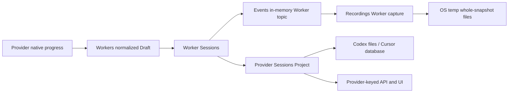
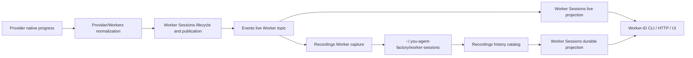
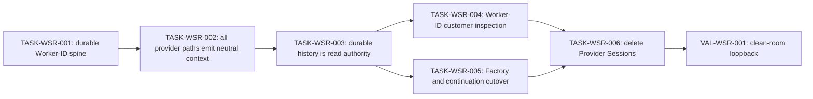

# Durable Worker Session Authority and Provider Sessions Removal Plan

## 1. Problem and desired outcome [Required]

### Problem statement

Customers and operators need one provider-neutral Worker Session history that is
complete while a Worker runs, durable after restart, and sufficient for list,
inspection, transcript, continuation, and replay without reading provider-owned
session stores.

### Current behavior and gap

The repository already has the beginning of the target write path:

- Workers normalizes provider progress into the `workers.Draft` kind/phase
  vocabulary.
- Worker Sessions publishes lifecycle and normalized Worker records to the
  process-local Events topic `worker-session/<worker-session-id>/events`.
- Recordings' Worker capture subscribes to that Events topic before provider
  handoff and persists accepted records through `WorkerRecordingWriter`.

That spine is not yet the system authority. The default writer uses
`<os-temp>/you-worker-recordings`, stores hashed whole-snapshot
`*.worker.json` files, and is not composed as the durable read catalog for
Worker Sessions. Worker Session transcript and usage projection still call
`provider_sessions.Service.Project`, which reparses Codex rollout files or
Cursor storage after execution. Provider-keyed HTTP routes, schemas, CLI/UI
selection, Factory projections, Wire providers, process edges, and 46 files in
`pkg/services/provider_sessions` retain that second model. A provider that does
not expose a readable native session can therefore execute successfully but
cannot offer equivalent historical context.

### Desired outcome and success measures

- Every admitted Worker publishes its opening lifecycle record and every
  available normalized provider context event to Events before the terminal
  Worker record closes the topic's recording window.
- Recordings durably captures the ordered Worker Session Events stream under
  `~/.you-agent-factory/worker-sessions/` using a versioned, provider-neutral,
  append-oriented artifact whose canonical identity is the Worker Session ID.
- Worker Sessions derives lifecycle, messages, reasoning, tools, usage, errors,
  lineage, recording health, and normalized context/transcript views solely
  from its live Events topic or the corresponding durable recording.
- List, show, replay-only events, transcript/context, and supported continuation
  behavior remain available after process restart without accessing Codex,
  Cursor, or another provider's native session files or database.
- Public inspection is keyed by Worker Session ID. Provider identity and an
  opaque continuation reference may remain optional metadata needed to resume
  a provider execution, but neither selects the history nor determines its
  schema.
- The `/provider-sessions/detail` endpoint, provider-keyed Worker Session
  compatibility routes, Provider Sessions schemas/UI, Provider Sessions
  service, construction edges, Wire providers, tests, and documentation are
  deleted after consumers migrate.
- Controlled conformance tests cover every registered provider execution path;
  focused Go/UI/API gates and a clean-room restart journey pass on the final
  integrated head.

## 2. Scope and constraints [Required]

### In scope

- Characterize and retain the existing Workers -> Worker Sessions -> Events ->
  Recordings opening, progress, terminal, retry, continuation, cancellation,
  and degradation behavior.
- Declare the existing normalized Worker draft taxonomy, with additive changes
  where coverage is missing, as the provider-neutral context-event contract.
- Require every provider adapter used by Workers to map supported native
  progress into that contract before it reaches Worker Sessions.
- Replace the temp-backed whole-snapshot default with a durable Worker Session
  store rooted at `~/.you-agent-factory/worker-sessions/`.
- Add Recordings-owned lookup, bounded enumeration, replay, recovery, and
  corruption/degradation behavior for durable Worker Session histories.
- Make Worker Sessions' list, show, events, transcript/context, usage, and
  continuation reads consume live/durable Worker Session history rather than
  `provider_sessions.Service`.
- Migrate OpenAPI, HTTP, CLI, dashboard, Factory Runtime/Session projections,
  generated Go/TypeScript clients, tests, and docs to Worker Session identity
  and terminology.
- Delete `pkg/services/provider_sessions`, its route, edges, Wire construction,
  generated/public schemas, UI feature, and all remaining production callers.
- Update architecture and data-model documentation so Worker Session is the
  public execution-history resource and a provider continuation is only an
  opaque execution detail.

### Non-goals

- Persisting raw provider protocol frames, raw provider session files, database
  rows, secrets, environment variables, or credentials in Worker recordings.
- Making Events durable; Events remains the process-local ordered delivery
  owner and Recordings remains the durable owner.
- Moving provider execution, adapter selection, or continuation protocol policy
  out of Providers.
- Moving request-scoped execution, runner selection, retry policy, prompt
  shaping, or worktree policy out of Workers.
- Folding Worker Session history into the canonical Factory Event ledger.
  Worker recordings are a distinct Recordings-owned artifact and projection.
- Guaranteeing continuation when a provider never returns a resumable opaque
  reference. Historical inspection must still work in that case.
- Importing arbitrary pre-existing Codex or Cursor sessions that were not run
  through this system. If native-session import is desired later, it requires a
  separate explicit import plan and trust model.

### Assumptions and constraints

- `workers.Draft` already supplies the intended system vocabulary (`SESSION`,
  `RUN`, `TURN`, `MESSAGE`, `REASONING`, `TOOL`, `FILE_CHANGE`, `PLAN`,
  `PROGRESS`, `USAGE`, `ERROR`, and `STREAM_GAP`). Provider-neutral means the
  record shape and reduction do not branch on provider identity; provenance may
  retain the provider as optional diagnostic metadata.
- An opaque provider continuation reference is not canonical history. It may be
  encrypted/redacted and retained only to the degree required by the existing
  continuation contract.
- The storage root must be resolved through the repository's canonical home and
  runtime-artifact policy, injected once through Wire; service logic must not
  read `HOME` or OS globals directly.
- Worker Session filenames must not interpolate caller-controlled IDs directly.
  Use a collision-safe storage key or digest while retaining the exact Worker
  Session ID inside the versioned artifact and index.
- The artifact writer must use platform-owned safe filesystem mechanics,
  `0600`-equivalent permissions, bounded writes, and crash-safe publication.
- `api/openapi-main.yaml` and component fragments are authored sources;
  generated OpenAPI, Go, and TypeScript files are regenerated, never hand
  edited.
- `pkg/wire/wire_gen.go` is regenerated from Wire providers.
- Existing unrelated worktree changes are user-owned and must be preserved.

### Open questions

- Retention policy needs a product default before TASK-WSR-003 merges. The
  recommended starting policy is the existing runtime-artifact rotation
  mechanism with explicit configurable size/age limits, not unbounded history.
- Confirm whether released clients require a one-release deprecation interval
  for provider-keyed HTTP routes. If no compatibility commitment exists, the
  tasks may land in one release while still preserving the internal additive
  migration sequence.
- Confirm whether opaque continuation references require at-rest encryption in
  addition to `0600` permissions. If encryption infrastructure is unavailable,
  the plan must either omit the reference from disk and mark continuation
  unavailable after restart or add a prerequisite security task.

### Replanning triggers

- A registered provider cannot emit enough normalized events to reconstruct its
  customer-visible final message or terminal failure.
- Existing provider-native parsing exposes a required behavior that has no
  representation in the normalized Worker event contract.
- A released compatibility commitment requires retaining provider-keyed routes
  longer than the declared interval.
- Correct continuation requires persisting secrets or provider-native payloads
  outside the approved security boundary.
- The proposed store cannot provide bounded enumeration or crash recovery
  without a broader platform storage capability.
- A production caller outside Provider Sessions depends on native-session
  discovery rather than Worker execution history.

## 3. Recommended approach [Required]

Complete the existing event-capture spine, make its durable artifact the read
authority, migrate every customer journey to Worker Session identity, and only
then delete Provider Sessions. Use six implementation tasks and one independent
validation deployment; replan if provider conformance, continuation security,
or released-route compatibility contradicts the assumptions above.

### Decision record

| Option | Decision | Evidence and tradeoff |
| --- | --- | --- |
| Keep Provider Sessions as a fallback parser | Rejected | It preserves two authorities, ties transcript availability to provider-owned storage, and cannot serve providers without discoverable native sessions. |
| Move provider-native parsers into Worker Sessions | Rejected | Package motion would retain provider branching and post-hoc filesystem/database parsing inside the system-neutral history owner. |
| Persist raw provider events and normalize on read | Rejected | It makes the durable schema provider-specific, increases secret exposure, and forces every reader to understand every provider version. |
| Normalize at the provider/Workers boundary, publish through Worker Sessions to Events, capture in Recordings, and project on read | Selected | This extends the path already implemented, preserves owner boundaries, gives live and replay one schema, and permits deletion of post-hoc provider parsers. |

## 4. Customer behavior [Conditional]

### Actors, roles, and permissions

- A Worker operator starts, inspects, follows, interrupts, continues, or replays
  a Worker Session by Worker Session ID.
- A dashboard user selects a Worker execution and sees provider-neutral context,
  tool, usage, lineage, and failure information.
- Existing process/filesystem permissions apply. No route accepts a raw
  provider file path or provider database location.
- Provider metadata is diagnostic only and does not grant access to another
  Worker Session.

### User journeys

1. A Worker starts. Its opening record commits to Events and is durably accepted
   before provider handoff.
2. Provider progress is normalized into Worker context events, appended to the
   Worker topic, and captured in aggregate order.
3. Live clients follow the Events-backed stream; the terminal record closes the
   durable recording with COMPLETE or DEGRADED recording health.
4. After restart, a client lists Worker Sessions, opens one by Worker Session
   ID, replays its event stream, and reads the same normalized context without a
   provider session file or database.
5. If the terminal history contains an allowed opaque continuation reference,
   a client can create a successor Worker Session; otherwise the history stays
   readable and continuation returns a typed unsupported/unavailable result.

### Default, loading, empty, success, error, and permission states

- Default/list: a bounded, cursor-based list combines durable history with live
  sessions and de-duplicates by Worker Session ID.
- Loading: existing dashboard loading and reconnect behavior remains, keyed by
  Worker Session ID.
- Empty: no recordings returns a successful empty list.
- Success: live and replay views use the same event/context schema and stable
  ordering.
- Error: corrupt, incomplete, retention-gapped, or persistence-failed history
  is reported with typed recording health and safe diagnostics; readable
  prefixes are not discarded.
- Permission: an unreadable storage root or disallowed continuation secret
  returns a typed unavailable result without falling back to provider storage.

### Accessibility, keyboard, focus, responsive, and localization behavior

- Replacing the Provider Session detail widget must preserve keyboard selection,
  visible focus, accessible names, responsive layout, and loading/error
  announcements in the Worker Session panel.
- Customer-visible text uses `Worker Session`, `context`, `event`, and
  `continuation`; it does not expose provider parser, rollout, SQLite, token,
  Petri-net, or filesystem implementation language.
- Existing supported locales receive updated message keys; no untranslated
  Provider Session labels remain in the shipped UI.

### Visual references

Use the current Worker detail and Provider Session detail Storybook stories as
behavioral references only. TASK-WSR-004 must replace them with versioned Worker
Session stories covering loading, empty context, live success, durable replay,
degraded recording, and continuation unavailable states; no redesign is
required.

## 5. Contracts and data [Conditional]

### Contract inventory and compatibility classification

| Contract | Classification | Planned outcome |
| --- | --- | --- |
| `workers.Draft` kind/phase/payload vocabulary | Additive, then canonical internal contract | Fill proven gaps only; adapters emit it without provider-specific payload branches. |
| Events `Record`, topic, cursor, duplicate, gap, and backpressure contracts | Unchanged | Continue as the process-local ordering and delivery boundary. |
| Worker recording artifact | Versioned replacement | Introduce append-oriented v2 history under the home-root store; retain explicit v1 snapshot read compatibility during migration. |
| Recordings Worker history reader/catalog | Additive | Provide exact lookup, bounded list, replay, recording health, and recovery over provider-neutral records. |
| Worker Sessions list/show/events/context/transcript by Worker Session ID | Additive/canonical | Existing Worker-ID routes become the only supported inspection surface; context is reduced from Worker history. |
| Provider-keyed Worker Session routes and query parameters | Deprecated then breaking removal | Migrate CLI/UI/callers and delete in TASK-WSR-006. |
| `/provider-sessions/detail` and Provider Session detail schemas | Breaking removal | Replaced by Worker Session ID inspection/context routes. |
| Public dashboard/Factory `provider_session(s)` projections | Breaking rename/removal | Replace selection/history references with Worker Session IDs; keep optional provider provenance under neutral execution metadata only where useful. |
| `providers.SessionRef` compatibility values | Deprecated internal migration | Use an opaque continuation reference owned by Providers; do not expose it as the history identity. |
| `provider_sessions.Service` and construction ports | Breaking internal removal | All callers migrate before package deletion. |

### HTTP API, CLI, configuration, and event changes

- Canonical reads use:
  - `GET /worker-sessions`
  - `GET /worker-sessions/{worker_session_id}`
  - `GET /worker-sessions/{worker_session_id}/events`
  - `GET /worker-sessions/{worker_session_id}/transcript` as a derived,
    provider-neutral message/reasoning/tool view; the complete normalized
    context remains the `/events` history
  - existing control/continue operations by Worker Session ID
- Factory-scoped aliases may remain where scope enforcement is required, but
  they also identify the Worker Session in the path and never require
  `provider`, `kind`, or provider-issued `id` query parameters.
- Remove `GET /provider-sessions/detail` and provider-keyed Worker Session
  detail, events, and transcript routes after migration.
- CLI commands accept `--worker-session-id`; remove provider/kind/session tuple
  flags from Worker history inspection.
- Event payloads keep optional provider provenance and continuation metadata but
  never require provider identity to validate or reduce a context event.
- Run `make generate-api`; if publishable contract packages change, run
  `make interfaces-all` and update every generated consumer.

### Persisted data, migration, retention, and rollback

- Default root: `~/.you-agent-factory/worker-sessions/`, resolved through an
  injected home/runtime-artifact boundary.
- Recommended v2 artifact: append-oriented JSONL containing a versioned header,
  exact Worker Session identity, detached ordered Events records, and a bounded
  terminal/failure marker. The filename uses a safe digest or reserved key; an
  index/catalog maps the exact Worker Session ID to the artifact.
- New writes use v2 only. During the compatibility interval readers accept the
  current `*.worker.json` snapshot form when explicitly located in the
  configured Worker root; they do not scan historical OS temp directories.
- Startup recovers terminal histories, classifies a valid unterminated prefix as
  INCOMPLETE, and never invents a terminal event. Corrupt tails preserve the
  last validated prefix and report DEGRADED where the codec can do so safely.
- Retention and capacity are explicit and observable. Eviction must remove the
  index entry and artifact consistently and must never target an active
  recording.
- Rollback readers retain v2 read support for the declared compatibility
  interval. Do not delete v2 artifacts during code rollback.

### Generated artifacts and consumers

- Regenerate `api/openapi.yaml`, Go server/client, TypeScript OpenAPI types, and
  Wire output from their authored sources.
- Update HTTP adapters, CLI protocol clients, dashboard API adapters, Storybook,
  fixtures, contract tests, functional tests, and public reference docs.
- Remove obsolete Provider Session component fragments only after zero authored
  references and a successful clean API generation.

## 6. Architecture and state [Conditional]

### Current-state flow



### Target-state flow



### Runtime sequence and dependencies

1. Worker Sessions opens a Recordings capture subscription for the exact Worker
   topic.
2. Worker Sessions appends and verifies the opening lifecycle record.
3. Recordings durably accepts position 1; only then may provider handoff occur.
4. Providers/Workers emit normalized drafts. Worker Sessions enforces session,
   attempt, source identity, ordering, and provider-binding correlation before
   appending to Events.
5. Recordings consumes the same ordered records and durably appends them.
6. Worker Sessions commits exactly one absorbing terminal record; Recordings
   drains through it and records COMPLETE or a safe DEGRADED/INCOMPLETE state.
7. Reads select live Events history when attached and the durable Recordings
   history otherwise, using one reducer and one Worker Session ID.

### Canonical, projected, and ephemeral state

- Canonical Worker history: the versioned durable ordered Worker recording
  owned by Recordings.
- Canonical live delivery: the Worker Session topic owned by Events while the
  process is alive; it is the source captured into the durable history, not a
  second durable authority.
- Worker Session domain state: identity, supervision, controls, attempt and
  continuation lineage owned by Worker Sessions.
- Projected state: context/transcript, usage, recording health, list/show views,
  and UI models reduced from live/durable Worker events.
- Factory history: remains the separate canonical Factory Event ledger owned by
  Recordings.
- Provider-native state: execution-private and non-canonical; it is not read by
  Worker Session history operations.

### Mutation ownership and consistency boundaries

- Providers maps protocol-native observations to normalized progress; it does
  not append to Events or Worker storage directly.
- Workers routes progress and execution correlation; Worker Sessions validates
  and appends to its topic.
- Events serializes topic positions and idempotency outcomes.
- Recordings alone mutates durable Worker artifacts and catalog/index state.
- Worker Sessions reads detached Recordings histories and owns the semantic
  projection returned to transports.
- Opening is an explicit durability barrier. Terminal execution truth is not
  rolled back if persistence later fails; recording health becomes DEGRADED and
  exposes a safe reason.

### Legacy path and removal plan

- TASK-WSR-001 declares the canonical neutral event contract and establishes one
  durable Worker-ID spine alongside existing readers.
- TASK-WSR-002 closes all provider-output and failure-path gaps.
- TASK-WSR-003 makes durable Worker history authoritative for reads/restart.
- TASK-WSR-004 migrates customer transports and UI to Worker-ID inspection.
- TASK-WSR-005 migrates Factory projections and continuation behavior away from
  Provider Sessions.
- TASK-WSR-006 removes compatibility routes, Provider Sessions construction,
  service code, parsers, edges, schemas, UI, tests, and terminology.

## 7. Failure modes and quality attributes [Required]

| Case | Detection | Customer outcome | State/recovery | Telemetry | Evidence |
| --- | --- | --- | --- | --- | --- |
| Invalid or provider-shaped draft | Worker draft schema validation | Worker output is rejected with a typed publication failure; no malformed event is exposed | No append; execution follows existing failure policy | Provider, Worker Session, attempt, safe event kind | TASK-WSR-002 conformance/fault tests |
| Duplicate provider callback | Events idempotency identity | One event appears | Exact duplicate returns duplicate outcome; conflicting duplicate fails closed | Duplicate/conflict counter and identifiers | Events/Worker Sessions integration test |
| Out-of-order source sequence | Worker Sessions publication guard | Stream remains ordered; publisher gets typed error | No partial append | Out-of-order counter | TASK-WSR-002 fault matrix |
| Events retention gap/backpressure | Typed Events delivery | Live client or capture gets explicit gap/source failure | Recordings marks DEGRADED/INCOMPLETE; readable prefix retained | Gap/backpressure metric and recording health | Capture fault tests |
| Storage root unavailable or permission denied | Writer/catalog open failure | Start fails before provider handoff when opening cannot be made durable | No provider call and no false active session | Root-free error code; no path/payload leakage | TASK-WSR-001 functional test |
| Disk full or mid-session write failure | Durable append error | Execution truth remains available live; durable health is DEGRADED | Safe failure marker when possible; no fabricated records | Persistence-failure counter, stage, session ID | TASK-WSR-003 fault injection |
| Crash after opening and before terminal | Restart scan | Session is visible as INCOMPLETE/interrupted | Valid prefix replays; no terminal invented | Recovery classification count | Restart functional test |
| Corrupt/truncated tail | Framing/checksum/schema validation | Valid prefix is readable with DEGRADED diagnostic, or typed corrupt-history error if header/identity is unsafe | Quarantine/ignore invalid tail; never parse provider storage | Corruption counter and safe code | Codec/restart tests |
| Concurrent live and durable read | Cursor/generation and ID de-duplication | No duplicate or missing record at handoff | Atomic high-water transition; stable cursor | Handoff duplicate/gap counter | Stream integration/race test |
| Provider emits no native session ID | Missing optional continuation metadata | Full history remains readable; continuation is unavailable | No fallback parser | Capability/continuation availability field | Provider conformance test |
| Continuation reference missing, stale, or foreign | Providers validation plus Worker lineage validation | Typed 409/404-style continuation outcome; source history unchanged | No successor or provider call on invalid input | Safe continuation failure kind | TASK-WSR-005 functional tests |
| Cancellation/termination race | Existing supervision terminal classifier | Exactly one terminal Worker state and terminal event | Idempotent absorbing terminal; capture drains through winner | Outcome/cause and attempt IDs | Race/control tests |
| Retention capacity reached | Store reservation/retention check | Active recording is never evicted; new start fails clearly or eligible old history rotates per policy | Deterministic cleanup and catalog consistency | Bytes, artifacts, evictions, refusal count | Capacity test |
| Legacy v1 artifact | Version decoder | History remains readable during interval | Read-only compatibility; new writes v2 | Compatibility-read count | TASK-WSR-003 compatibility test |
| Provider Sessions caller remains at deletion | Compile and zero-symbol inventory | Removal does not ship partially | Stop TASK-WSR-006 until migrated | Not applicable | Zero-match inventory and builds |

### Performance and scale

- Persistence must be append-oriented: total durable bytes written for N events
  are O(total encoded event bytes), not O(N times accumulated history).
- Add a deterministic 10,000-event recording/replay test that asserts exact
  ordering, bounded write amplification (no full-history rewrite), and no
  unbounded goroutine/subscription growth.
- Extend `tests/stress/query_latency_test.go` so Worker Session list/show/replay
  measures the durable catalog at the existing repository load cells. Record a
  baseline before migration and require no regression beyond the suite's
  incident thresholds rather than inventing a disconnected latency target.
- Enumeration is cursor-based and bounded; no request decodes every recording
  payload merely to list summary rows.

### Reliability and availability

- The opening record durability barrier prevents provider execution when no
  recoverable Worker history can be established.
- Terminal truth and recording health remain distinct; persistence failure must
  not rewrite a completed execution as failed.
- Restart recovery is deterministic from artifacts and does not invoke a
  provider.
- Live availability does not depend on the provider-native session store, and
  durable availability does not depend on Events retention after restart.

### Security and privacy

- Persist normalized context only. Redact credentials, environment values,
  secret tool arguments/results, encrypted reasoning payloads, and provider
  native frames according to existing redaction policy before durable append.
- Files use owner-only permissions where supported; path and identifier
  validation prevents traversal and symlink escape.
- Logs and API errors contain safe IDs/codes, never raw prompts, responses,
  provider paths, database queries, or continuation tokens.
- Continuation-reference persistence follows the open-question decision; tests
  prove the chosen encryption/omission behavior.

### Cost and resource limits

- All required verification uses controlled providers and local-real
  filesystem/HTTP dependencies. Maximum remote provider calls: 0. Maximum paid
  cost: USD 0.
- Store size, event size, subscription buffer, list page size, and retention
  limits are named configuration/constants and mechanically tested.

### Observability and operational readiness

- Structured logs: recording open/accepted/terminal/degraded/recovered,
  provider-normalization rejection, history lookup, continuation availability,
  and cleanup outcome with Worker Session/attempt IDs and safe codes.
- Metrics: active captures, append failures, bytes/events persisted, recording
  health counts, recovery classifications, corrupt artifacts, retention
  evictions/refusals, projection failures, and live/durable handoff gaps.
- Alerts: sustained persistence failures, corrupt-history increase, capacity
  refusal, or nonzero live/durable handoff gaps.
- Traces, where present, correlate Worker Session ID, attempt ID, Events
  position, and durable record position without payload content.

## 8. Rollout, compatibility, and rollback [Conditional]

### Deployment and feature-flag sequence

1. Land the additive v2 writer/reader and one canonical Worker-ID path while
   legacy Provider Sessions reads remain available.
2. Close provider conformance gaps and make dual-source comparison tests assert
   that Worker context matches required legacy behavior.
3. Switch Worker-ID reads to durable Worker history; retain a diagnostic-only
   comparison in tests, never a production fallback.
4. Migrate CLI/API/UI and Factory projections.
5. Delete Provider Sessions and compatibility paths after zero-caller gates.

A runtime feature flag is not preferred because dual authorities create
ambiguous state. If released compatibility requires staged deployment, use a
read-selection flag with Worker history as the declared canonical path and a
bounded rollback interval; never dual-write provider-native history.

### Compatibility interval

- v1 Worker recording read compatibility: at least through the release that
  first writes v2, unless the artifacts are confirmed unreleased/test-only.
- Provider-keyed API compatibility: one release only if a released-client
  commitment is confirmed; otherwise migrate within the same release and
  remove in TASK-WSR-006.
- New writes never create Provider Sessions artifacts or v1 Worker snapshots.

### Monitoring and stop conditions

Stop rollout on missing final messages, context ordering differences, incorrect
usage, lost continuation, provider re-execution during recovery, write
amplification, corrupt artifacts, unexplained stream gaps, secret leakage, or a
remaining production Provider Sessions caller.

### Rollback procedure

- Before TASK-WSR-006, revert the read cutover while retaining v2 artifacts;
  the compatibility reader must make rollback non-destructive.
- After TASK-WSR-006, restore the preceding task as a unit only if an unknown
  compatibility consumer is found. Do not restore native parsers as an
  unbounded permanent fallback.
- Storage rollback never deletes or rewrites Worker history. A repair/reindex
  tool must be read-only by default and separately authorized.

### Deprecation and cleanup owner

TASK-WSR-006 owns final removal. Its implementer removes every Provider Sessions
package, route, schema, generated reference, edge, Wire provider, UI component,
test fixture, docs entry, baseline exception, and compatibility adapter. The
review stage verifies the zero-symbol inventory before merge.

## 9. Implementation strategy [Required]

### Coverage assessment and characterization needs

Existing tests cover opening capture, ordered persistence, duplicate handling,
gap/backpressure/failure classification, terminal recording health, portable
codec/replay, Worker Session live/replay streams, provider association,
continuation, and query latency. Before structural cutover, TASK-WSR-001 must
add an inventory-backed characterization matrix that identifies, per registered
provider path, which normalized event kinds and legacy Provider Sessions facts
are currently produced. Missing required behavior is fixed in TASK-WSR-002,
not silently redefined by deletion.

### Parent behavior lanes

- **BEH-WSR-001 — A Worker produces one complete provider-neutral live and
  durable history.** The same ordered events power live following and restart
  replay regardless of provider.
- **BEH-WSR-002 — Customers inspect and continue work through Worker Session
  identity.** List, show, context, replay, controls, and supported continuation
  no longer require a Provider Session tuple or native store.
- **BEH-WSR-003 — Provider Sessions is absent without loss of Worker behavior.**
  All production callers, contracts, UI, construction, parsers, and docs are
  removed after the replacement is proven.

### Narrow executable spine

The first slice exercises one controlled provider through the real internal
owners:

```text
root.BuildProcess -> Worker execution -> provider progress normalization
  -> Worker Sessions PublishRecord -> Events topic
  -> Recordings v2 writer under an isolated home root
  -> process restart -> Worker Sessions show/events/context by Worker Session ID
```

Every later task preserves this spine and adds providers, projections,
customers, continuation fidelity, or removal.

### Justified enabling work

TASK-WSR-001 includes characterization and additive storage/catalog contracts
because deletion cannot be reviewed safely until the normalized event coverage
and current parser-derived behavior are explicit. It still delivers an
observable end-to-end durable Worker-ID journey and is not a test-only or
contract-only task.

### Migration or strangler sequence

1. Characterize event/parser parity and establish v2 durable spine.
2. Make every provider execution path conform to the neutral event contract.
3. Project authoritative histories from Recordings and recover after restart.
4. Migrate customer inspection surfaces to Worker Session ID.
5. Migrate Factory projections and continuation semantics.
6. Delete Provider Sessions and all compatibility residue.

### Shared-surface ownership

- TASK-WSR-001 owns Worker recording v2 contracts/store and the first functional
  spine.
- TASK-WSR-002 owns provider/Workers normalization adapters and conformance
  fixtures; it does not edit public transport schemas.
- TASK-WSR-003 owns Recordings catalog/read APIs, Worker Sessions durable
  projection, and recovery composition.
- TASK-WSR-004 owns OpenAPI Worker inspection routes, generated API clients,
  CLI, dashboard API adapters/components/stories, and customer docs.
- TASK-WSR-005 owns Factory Runtime/Factory Sessions projections, continuation
  compatibility, and remaining internal Provider Sessions consumers.
- TASK-WSR-006 exclusively owns deletion, Wire/edges cleanup, generated cleanup,
  architecture docs, baselines, and zero-symbol gates.
- TASK-WSR-004 and TASK-WSR-005 may start after TASK-WSR-003 only if their API
  and generated-file edits are sequenced by one declared owner; otherwise run
  them sequentially as shown in the dependency graph.

## 10. Verification strategy [Required]

| Behavior/gate | Scope | Dependency fidelity | Cadence | Cost | Proves | Does not prove |
| --- | --- | --- | --- | --- | --- | --- |
| Draft schema/reducer tests | Unit | none | Per change | Free | Provider-neutral kind/phase/payload validation and deterministic context reduction | Adapter emission or persistence |
| Registered-provider conformance matrix | Functional | controlled provider adapters | Per PR | Free | Every provider path maps required lifecycle/message/tool/usage/failure facts without native-store parsing | Remote provider availability |
| Events-to-Recordings capture tests | Package integration | production Events, controlled/local-real writer | Per change | Free | Opening barrier, order, duplicates, terminal, degradation, and bounded append behavior | Root composition |
| Root durable restart spine | Functional/integration | production Wire, controlled provider, isolated local-real home/filesystem and HTTP | Per PR | Free | A Worker is live, persisted under the configured home root, restarted, listed, replayed, and projected without provider execution/storage | Paid remote provider |
| OpenAPI/generation and API smoke | Contract/integration | local-real toolchain/server | Per PR | Free | Authored routes/schemas and generated consumers agree; removed routes are absent | Dashboard usability |
| Focused UI tests and Storybook/browser inspection | Functional UI | schema mock/local-real browser | Per PR | Free | Worker-ID selection, states, accessibility, responsive behavior, and localization | Backend persistence |
| Continuation/retry/cancel functional matrix | Functional | controlled Providers/Workers and local-real storage | Per PR | Free | Lineage and exactly-once terminal behavior survive provider-parser removal | Arbitrary native provider state |
| Query latency and 10k-event recording tests | Stress | local-real filesystem/HTTP | Risk-triggered and PR for affected paths | Free, bounded | No O(N²) writes, bounded enumeration, stable latency, and no resource leak | Production hardware extremes |
| `make verify-fast`, `make lint`, `make api-smoke`, `make wire-smoke` | Repository integration | local-real toolchain | Per PR/final task as applicable | Free | Shared build, lint, generated graph, and public API gates | Full clean-room journey |
| VAL-WSR-001 | End-to-end/functional | production root and transports, controlled providers, local-real home/filesystem/HTTP/browser | Once after integration | Free | Complete cross-task customer journey and deletion from a clean environment | Remote paid provider availability |

### Paid-validation budgets and evidence-reuse keys

Not applicable. Trigger: none. Maximum calls: 0. Maximum cost: USD 0. Maximum
duration: not applicable. Controlled provider fixtures prove the relevant
normalization and persistence properties more deterministically than paid calls.

### Remaining unproven edges and owning gates

- Released external clients -> compatibility decision before TASK-WSR-004/006.
- At-rest protection for continuation references -> security decision and
  TASK-WSR-003 acceptance gate.
- Native sessions created outside this system -> explicitly out of scope and a
  future import plan.
- Real provider endpoint availability -> not relevant to deletion; provider
  adapter conformance is controlled and remote calls are not authorized.

## 11. Task dependency graph [Required]



## 12. Tasks [Required]

### TASK-WSR-001 — Persist and replay one provider-neutral Worker Session from the durable home root

**Parent behavior:** BEH-WSR-001 — A Worker produces one complete
provider-neutral live and durable history.

**Problem:** The existing capture spine writes whole snapshots to an OS temp
directory and is not proven as a restart-readable Worker-ID journey.

**Outcome:** One controlled Worker execution commits normalized events through
Events into a versioned append-oriented artifact under an isolated
`~/.you-agent-factory/worker-sessions` equivalent and replays by Worker Session
ID after restart.

**Plan reference:**
`C:\Users\andre\work\portos\infinite-you\.claude\worktrees\test-cleanup\docs\internal\development\plans\worker-session-recording-authority-and-provider-session-removal.md`,
BEH-WSR-001 and Sections 5-6.

**Actor and trigger:** An operator starts a Worker through the canonical root
process with a controlled provider that emits lifecycle, message, tool, usage,
and terminal progress.

**Dependencies:** None.

**Parallel and shared-surface ownership:** Owns Recordings Worker artifact
contracts/store, home-root composition, and the first functional fixture. No
other task edits these surfaces concurrently.

**Scope:**

- In: characterize current provider/parser facts; define v2 artifact and safe
  catalog key; resolve the default home root through injected policy; persist
  append-oriented records; support exact lookup/replay; retain explicit v1 read
  compatibility; prove opening durability before provider handoff.
- Out: all-provider conformance, public UI migration, production Provider
  Sessions removal.

**Implementation constraints:**

- Preserve Events as source ordering and Recordings as sole durable writer.
- Use `workers.Draft` as the neutral payload vocabulary; do not persist raw
  provider frames.
- Use safe platform filesystem mechanics, owner-only permissions, bounded
  artifact/event sizes, and no direct environment lookup in service logic.
- The task must leave legacy Provider Sessions reads available while declaring
  Worker history canonical for its new Worker-ID witness.

**Acceptance criteria:**

- [ ] Given an isolated home and a controlled Worker, when execution starts,
  then the opening event is durably accepted under
  `<home>/.you-agent-factory/worker-sessions` before the provider call begins.
- [ ] Given normalized progress and a terminal result, when capture closes,
  then the v2 artifact contains each accepted Events record exactly once in
  aggregate order and reports COMPLETE independently of execution success.
- [ ] Given a new process over the same home, when history is loaded by Worker
  Session ID, then the detached records and reduced context equal the live
  records without invoking the provider or reading provider-native storage.
- [ ] Given an unavailable root or opening persistence failure, when start is
  attempted, then no provider call occurs and a typed safe error is returned.
- [ ] The characterization matrix names every registered provider path and any
  event/context gap assigned to TASK-WSR-002.

**Verification:**

- Behavioral witness: Start one controlled Worker, follow its live Events
  records, terminate, restart the process, and replay byte-equivalent semantic
  records by Worker Session ID from the home-root artifact.
- Executable-spine effect: establish.
- Required evidence:
  - Scope: functional/integration
  - Dependency fidelity: controlled provider plus local_real filesystem/Events
  - Command or procedure: focused Recordings Worker capture packages, Worker
    Sessions package tests, and a new root-built restart functional test.
  - Proves: home-root durability, opening barrier, neutral recording, exact
    order, and restart replay.
  - Does not prove: every provider adapter or customer UI migration.
- Highest feasible level: Functional through `root.BuildProcess` with a
  controlled provider and isolated real filesystem; a remote provider adds no
  relevant confidence.
- Remaining unproven edges: provider matrix gaps -> TASK-WSR-002; global read
  cutover -> TASK-WSR-003.

**Paid validation, when applicable:**

- Trigger: Not applicable.
- Maximum calls: 0.
- Maximum cost: USD 0.
- Maximum duration: Not applicable.
- Fixture and output validator: Controlled provider fixture, typed event codec,
  v2 artifact validator, and provider call counter.
- Evidence-reuse key: Not applicable.

**Operational and rollout notes:** New writer is additive. Keep v1 reader and
legacy inspection during this task. Stop on secret leakage, O(N²) writes, or a
provider call before opening durability. Rollback retains v2 files.

**Escalation:** Stop and return a structured blocker when the required change
exceeds this task's outcome, a prerequisite or authority is absent, or the
observed architecture contradicts the plan. Include evidence, impact, safe work
completed, and the smallest recommended delta. Do not broaden scope silently.

**Handoff artifacts:** v2 schema/codec/store, home-root Wire composition,
characterization matrix, first restart functional witness, compatibility notes,
and focused evidence.

### TASK-WSR-002 — Emit complete normalized context from every provider execution path

**Parent behavior:** BEH-WSR-001 — A Worker produces one complete
provider-neutral live and durable history.

**Problem:** Required transcript/context facts are not yet proven to reach
Worker Sessions for every registered provider without post-hoc native parsing.

**Outcome:** Every registered provider execution path passes one conformance
suite for supported message, reasoning, tool, usage, error, session-binding,
retry, cancellation, and terminal events.

**Plan reference:**
`C:\Users\andre\work\portos\infinite-you\.claude\worktrees\test-cleanup\docs\internal\development\plans\worker-session-recording-authority-and-provider-session-removal.md`,
BEH-WSR-001 and Section 9 coverage assessment.

**Actor and trigger:** Workers invokes any registered controlled provider and
receives streaming or final-only progress.

**Dependencies:** TASK-WSR-001.

**Parallel and shared-surface ownership:** Owns Providers/Workers adapter
normalization and conformance fixtures. TASK-WSR-003 may not cut reads over
until the matrix is green.

**Scope:**

- In: fill characterized mapping gaps; normalize streaming and final-only
  providers; attach stable source identities; cover provider binding and
  optional continuation metadata; reject malformed/conflicting events; ensure
  final message and failure are never available only through native stores.
- Out: storage catalog, HTTP/UI migration, native session import.

**Implementation constraints:**

- Provider-specific parsing stays inside its adapter and produces neutral
  drafts before crossing into Workers/Worker Sessions.
- Do not branch Worker Sessions reducers on provider names.
- Preserve existing response-stream behavior and `ProgressAlreadyObserved`
  duplicate suppression.
- Redaction occurs before the durable publication boundary.

**Acceptance criteria:**

- [ ] Given each registered provider fixture, when it streams supported native
  events, then the same neutral event kinds and semantic fields are appended in
  deterministic order.
- [ ] Given a final-only provider, when it completes, then an authoritative
  final message, usage when supplied, association metadata when supplied, and
  terminal event are recorded without claiming native streaming fidelity.
- [ ] Given timeout, cancellation, authentication, throttling, malformed event,
  stream gap, or duplicate callback, then typed neutral failure/gap behavior is
  recorded once and terminal classification remains exactly once.
- [ ] No conformance assertion reads a Codex rollout path, Cursor database, or
  `provider_sessions.Service`.

**Verification:**

- Behavioral witness: Run the same semantic provider fixture through every
  registered execution adapter and compare the reduced Worker context, allowing
  only declared fidelity/capability differences.
- Executable-spine effect: extend.
- Required evidence:
  - Scope: functional
  - Dependency fidelity: controlled provider adapters and production Workers/
    Worker Sessions/Events composition
  - Command or procedure: provider execution conformance packages, Worker
    runner tests, and focused capture/reducer tests.
  - Proves: provider-independent semantic coverage and failure behavior.
  - Does not prove: restart catalog reads or public customer clients.
- Highest feasible level: Functional with production adapters around controlled
  external effects.
- Remaining unproven edges: durable authority -> TASK-WSR-003.

**Paid validation, when applicable:**

- Trigger: Not applicable.
- Maximum calls: 0.
- Maximum cost: USD 0.
- Maximum duration: Not applicable.
- Fixture and output validator: Controlled provider fixtures and typed neutral
  event/context validators.
- Evidence-reuse key: Not applicable.

**Operational and rollout notes:** Instrument normalization rejection and
fidelity/capability differences. Stop if a required fact has no safe neutral
representation and request an additive schema delta.

**Escalation:** Stop and return a structured blocker when the required change
exceeds this task's outcome, a prerequisite or authority is absent, or the
observed architecture contradicts the plan. Include evidence, impact, safe work
completed, and the smallest recommended delta. Do not broaden scope silently.

**Handoff artifacts:** Green provider matrix, adapter changes, fault matrix,
redaction evidence, and explicit declared provider capability differences.

### TASK-WSR-003 — Make durable Worker history authoritative for restart-safe Worker Session reads

**Parent behavior:** BEH-WSR-002 — Customers inspect and continue work through
Worker Session identity.

**Problem:** Worker Session observations and transcripts still depend on
in-memory registry state and `provider_sessions.Project` instead of the durable
recording.

**Outcome:** Worker Sessions list, show, replay-only events, context/transcript,
usage, lineage, and recording health are reduced from live or durable Worker
history and remain available after restart.

**Plan reference:**
`C:\Users\andre\work\portos\infinite-you\.claude\worktrees\test-cleanup\docs\internal\development\plans\worker-session-recording-authority-and-provider-session-removal.md`,
BEH-WSR-002 and Sections 6-8.

**Actor and trigger:** A client reads a live or historical Worker Session by its
stable Worker Session ID.

**Dependencies:** TASK-WSR-002.

**Parallel and shared-surface ownership:** Owns Recordings catalog/read
contracts, Worker Sessions history projection, restart recovery, and live-to-
durable handoff. Public transport schema remains TASK-WSR-004-owned.

**Scope:**

- In: bounded catalog/list; exact ID lookup; one provider-neutral reducer;
  transcript/context and token/turn usage from recorded events; restart
  recovery; corruption/incomplete/degraded behavior; cursor-safe durable/live
  handoff; v1 read compatibility; retention and capacity policy.
- Out: UI rename, Provider Sessions package deletion, importing external native
  sessions.

**Implementation constraints:**

- Recordings owns storage and returns detached histories; Worker Sessions owns
  domain projection and customer semantics.
- No production fallback to Provider Sessions. Temporary comparison belongs in
  tests only.
- Do not decode every artifact for a list page; maintain/rebuild a bounded
  catalog/index from safe metadata.
- Resolve the continuation-reference at-rest decision before merging.

**Acceptance criteria:**

- [ ] Given terminal histories from every conformance fixture, when live and
  durable projections are compared, then lifecycle, ordered context, tools,
  usage, lineage, failure, and recording health are semantically equal.
- [ ] Given a clean restart, when list/show/events/context are called by Worker
  Session ID, then they succeed with zero provider calls and zero provider-
  native filesystem/database reads.
- [ ] Given an incomplete, degraded, corrupt-tail, missing, or v1 history, when
  read, then the documented typed outcome and valid-prefix behavior occurs
  without fabricating events.
- [ ] Given a live reader crossing the durable high-water mark, then every
  record is delivered exactly once with no cursor from another Worker Session.
- [ ] The 10,000-event test proves linear write volume and bounded resources;
  the existing query-latency matrix stays within its incident thresholds.

**Verification:**

- Behavioral witness: Restart over a mixed catalog of complete, failed,
  incomplete, degraded, and v1 sessions; list and inspect them by Worker ID,
  then attach to one live session without duplicate/gap.
- Executable-spine effect: increase_fidelity.
- Required evidence:
  - Scope: integration/functional/stress
  - Dependency fidelity: production Recordings/Worker Sessions/Events with
    local_real filesystem and controlled provider
  - Command or procedure: focused services, restart functional packages, race
    tests, 10k capture test, and `tests/stress/query_latency_test.go` matrix.
  - Proves: durable authority, restart, handoff, failure, compatibility, and
    scale behavior.
  - Does not prove: generated transport/client migration.
- Highest feasible level: Functional/integration plus local stress.
- Remaining unproven edges: customer journey -> TASK-WSR-004; continuation and
  Factory consumers -> TASK-WSR-005.

**Paid validation, when applicable:**

- Trigger: Not applicable.
- Maximum calls: 0.
- Maximum cost: USD 0.
- Maximum duration: Not applicable.
- Fixture and output validator: Mixed durable-history fixtures, controlled
  provider, typed codec/projection validators, and query-latency statistics.
- Evidence-reuse key: Not applicable.

**Operational and rollout notes:** Worker history becomes canonical in this
task. Stop on any production fallback to native provider storage, catalog
inconsistency, secret exposure, or query incident threshold regression.

**Escalation:** Stop and return a structured blocker when the required change
exceeds this task's outcome, a prerequisite or authority is absent, or the
observed architecture contradicts the plan. Include evidence, impact, safe work
completed, and the smallest recommended delta. Do not broaden scope silently.

**Handoff artifacts:** durable catalog/read service, neutral reducer, restart
recovery, live/durable handoff, retention policy, v1 compatibility evidence,
and scale results.

### TASK-WSR-004 — Inspect Worker history by Worker Session ID across API, CLI, and dashboard

**Parent behavior:** BEH-WSR-002 — Customers inspect and continue work through
Worker Session identity.

**Problem:** Customer inspection still exposes Provider Session tuples, detail
schemas, selection state, and UI despite Worker-ID routes already existing.

**Outcome:** CLI, HTTP, and dashboard users list, select, show, stream, and read
context for live/durable sessions using only Worker Session ID.

**Plan reference:**
`C:\Users\andre\work\portos\infinite-you\.claude\worktrees\test-cleanup\docs\internal\development\plans\worker-session-recording-authority-and-provider-session-removal.md`,
BEH-WSR-002 and Sections 4-5.

**Actor and trigger:** A customer selects a Worker execution from the dashboard
or invokes Worker Session inspection through CLI/HTTP.

**Dependencies:** TASK-WSR-003.

**Parallel and shared-surface ownership:** Owns authored OpenAPI Worker routes,
generated clients, Worker HTTP/CLI adapters, UI/API components, Storybook, and
customer docs. Coordinate generated files with TASK-WSR-005 or run sequentially.

**Scope:**

- In: canonicalize Worker-ID routes and flags; migrate API adapters and UI
  selection; replace Provider Session detail widget with Worker context;
  cover all states, accessibility, localization, responsive behavior; mark or
  remove provider-keyed compatibility from customer clients.
- Out: final service deletion, Factory internal projection migration owned by
  TASK-WSR-005.

**Implementation constraints:**

- Author fragments first and regenerate via `make generate-api` /
  `make interfaces-all` as applicable.
- Public names follow `docs/architecture/data-model.md` after its planned update.
- Provider provenance may display as metadata but is never a selection key.
- Preserve keyboard/focus behavior and do browser inspection for layout changes.

**Acceptance criteria:**

- [ ] Given live and historical sessions, when a customer uses CLI, HTTP, or UI,
  then list/show/events/context resolve by Worker Session ID and display equal
  semantic history.
- [ ] Given no provider continuation identity, then history remains fully
  inspectable and continuation is visibly unavailable rather than history being
  labeled unavailable.
- [ ] Given loading, empty context, degraded/incomplete recording, missing ID,
  and permission/storage failure, then each client renders the documented safe
  state.
- [ ] Keyboard selection, focus visibility, accessible names/live regions,
  responsive layout, and supported localization tests pass.
- [ ] Generated clients contain no newly canonical provider-keyed Worker
  inspection operation.

**Verification:**

- Behavioral witness: From the Worker list, select one session, follow live
  context, restart, reopen it by the same ID, and replay the same history in CLI
  and dashboard.
- Executable-spine effect: promote.
- Required evidence:
  - Scope: end-to-end/functional
  - Dependency fidelity: controlled provider, local_real HTTP/filesystem/browser
  - Command or procedure: focused Worker transports, CLI functional tests, UI
    unit tests, Storybook/browser checks, `make generate-api`, `make api-smoke`,
    `make ui-test`, and `make ui-lint`.
  - Proves: customer contract, generated parity, usability, and accessible UI.
  - Does not prove: final internal service deletion.
- Highest feasible level: Local end-to-end through real CLI/HTTP/UI with
  controlled provider.
- Remaining unproven edges: Provider Sessions deletion -> TASK-WSR-006.

**Paid validation, when applicable:**

- Trigger: Not applicable.
- Maximum calls: 0.
- Maximum cost: USD 0.
- Maximum duration: Not applicable.
- Fixture and output validator: Controlled Worker histories, local HTTP/CLI,
  Storybook/browser assertions, accessibility checks, and generated-contract
  validation.
- Evidence-reuse key: Not applicable.

**Operational and rollout notes:** Respect the declared API compatibility
interval. Stop on a released client requirement or behavior loss. Roll back the
client cutover without deleting v2 history.

**Escalation:** Stop and return a structured blocker when the required change
exceeds this task's outcome, a prerequisite or authority is absent, or the
observed architecture contradicts the plan. Include evidence, impact, safe work
completed, and the smallest recommended delta. Do not broaden scope silently.

**Handoff artifacts:** authored/generated API changes, Worker-ID CLI/UI,
accessible Storybook states, customer docs, API smoke and UI evidence.

### TASK-WSR-005 — Preserve Factory projection and continuation behavior without Provider Sessions

**Parent behavior:** BEH-WSR-002 — Customers inspect and continue work through
Worker Session identity.

**Problem:** Factory Runtime/Sessions projections and Worker continuation still
carry Provider Session models or call Provider Sessions-derived enrichment.

**Outcome:** Factory views correlate Worker Session IDs, and continuation uses
only Worker history plus Providers-owned opaque continuation behavior.

**Plan reference:**
`C:\Users\andre\work\portos\infinite-you\.claude\worktrees\test-cleanup\docs\internal\development\plans\worker-session-recording-authority-and-provider-session-removal.md`,
BEH-WSR-002 and Sections 5-6.

**Actor and trigger:** A Factory dispatch completes, appears in Factory history,
or a customer continues/interrupts a terminal Worker Session.

**Dependencies:** TASK-WSR-003.

**Parallel and shared-surface ownership:** Owns Factory Runtime/Factory Sessions,
Factory recording/projection fields, continuation lineage, and internal
Provider Sessions caller migration. Coordinate any OpenAPI/generated edits with
TASK-WSR-004.

**Scope:**

- In: replace provider-session projection keys with Worker Session identity;
  source usage/context from recorded Worker events; retain safe provider
  provenance; migrate continuation references to Providers-owned opaque
  contracts; prove retries/resume/interrupt/cancel; remove internal reads from
  `provider_sessions.Service`.
- Out: public inspection UI owned by TASK-WSR-004; physical package deletion
  owned by TASK-WSR-006.

**Implementation constraints:**

- Factory Event ledger remains distinct from Worker history and stores only the
  Worker Session association/projection facts its replay requires.
- Continuation is optional capability; never make history depend on it.
- No provider-native file/database read or provider call during Factory replay.
- Preserve exactly-once terminal and one-Worker-across-retries semantics.

**Acceptance criteria:**

- [ ] Given a Factory Worker, when Factory live and replay views are built, then
  dispatch history identifies its Worker Session and derives usage/context
  without Provider Sessions.
- [ ] Given a terminal resumable Worker, when continue or interrupt is invoked,
  then one successor Worker Session is created with explicit lineage and the
  exact approved opaque continuation reference.
- [ ] Given missing, stale, foreign, or non-persistable continuation metadata,
  then the typed result leaves source history unchanged and makes no provider
  call.
- [ ] Given retry, cancel, terminate, or restart recovery, then exactly one
  terminal outcome and consistent Worker/Factory associations remain.
- [ ] Production inventory outside `pkg/services/provider_sessions` contains no
  import or call to its service after this task, excluding TASK-WSR-006 deletion
  fixtures.

**Verification:**

- Behavioral witness: Run a Factory Worker, inspect its Worker association and
  usage in live/replay Factory views, restart, continue it where supported, and
  observe one linked successor without native session parsing.
- Executable-spine effect: extend.
- Required evidence:
  - Scope: functional/integration
  - Dependency fidelity: production Factory/Worker/Recordings wiring,
    controlled provider, local_real filesystem
  - Command or procedure: focused Factory Runtime/Session projection/replay,
    Worker continuation/control functional tests, and zero-caller inventory.
  - Proves: Factory and continuation parity without Provider Sessions.
  - Does not prove: physical deletion or final generated cleanup.
- Highest feasible level: Functional through root-built Factory execution and
  restart.
- Remaining unproven edges: physical removal -> TASK-WSR-006.

**Paid validation, when applicable:**

- Trigger: Not applicable.
- Maximum calls: 0.
- Maximum cost: USD 0.
- Maximum duration: Not applicable.
- Fixture and output validator: Controlled continuation-capable and
  continuation-incapable provider fixtures, lineage assertions, and Factory
  live/replay projection comparison.
- Evidence-reuse key: Not applicable.

**Operational and rollout notes:** Stop if continuation security is unresolved
or replay attempts a provider/native-store read. Rollback preserves Worker
history and can restore prior projection code during the compatibility window.

**Escalation:** Stop and return a structured blocker when the required change
exceeds this task's outcome, a prerequisite or authority is absent, or the
observed architecture contradicts the plan. Include evidence, impact, safe work
completed, and the smallest recommended delta. Do not broaden scope silently.

**Handoff artifacts:** migrated Factory projections, continuation contracts and
tests, zero production caller inventory, replay evidence, and compatibility
notes.

### TASK-WSR-006 — Delete Provider Sessions and every legacy inspection path

**Parent behavior:** BEH-WSR-003 — Provider Sessions is absent without loss of
Worker behavior.

**Problem:** After replacement consumers migrate, the Provider Sessions service,
native parsers, routes, schemas, UI, edges, Wire graph, and terminology remain
as dead competing architecture.

**Outcome:** Provider Sessions is physically absent, generated/public surfaces
contain no Provider Sessions resource, and all Worker/Factory behavior continues
through durable Worker history.

**Plan reference:**
`C:\Users\andre\work\portos\infinite-you\.claude\worktrees\test-cleanup\docs\internal\development\plans\worker-session-recording-authority-and-provider-session-removal.md`,
BEH-WSR-003 and Section 6 legacy removal plan.

**Actor and trigger:** The replacement tasks are green and a maintainer builds
and exercises the application without any Provider Sessions construction.

**Dependencies:** TASK-WSR-004 and TASK-WSR-005.

**Parallel and shared-surface ownership:** Exclusive ownership of deletion,
`pkg/wire`, `pkg/services/edges`, API component cleanup, generated cleanup,
architecture/docs, and ownership/package baselines. Runs alone.

**Scope:**

- In: delete `pkg/services/provider_sessions`; remove its HTTP route/handler,
  edges, Wire providers/set/imports, runtime-opening ports, CLI/UI feature and
  tests, schemas/parameters/responses, provider-keyed Worker compatibility
  routes, stale docs and baselines; regenerate API/Wire; add absence gates.
- Out: removal of Providers-owned execution/continuation protocol capability or
  unrelated provider adapters.

**Implementation constraints:**

- Do not retain a renamed copy of Codex/Cursor native parsers in Worker Sessions
  or Recordings.
- Do not replace the deleted service with a service locator, filesystem scan,
  hidden constructor, or transport-level parser.
- Preserve Providers-owned opaque continuation only under system-neutral naming
  and narrow execution contracts.
- Update `AGENTS.md`, architecture, data-model, packaged-structure, ownership
  rationale, OpenAPI, public docs, generated outputs, and inventories together.

**Acceptance criteria:**

- [ ] `pkg/services/provider_sessions` and all dedicated transport/wire/parser
  code are deleted.
- [ ] Source inventory has zero production import/reference to
  `provider_sessions`, `/provider-sessions`, `ProviderSessions`, or public
  Provider Session detail schemas, excluding historical archived plan text.
- [ ] Given the root process with no Provider Sessions filesystem/database
  edges, when Worker and Factory journeys run, then construction, execution,
  restart inspection, replay, and supported continuation succeed.
- [ ] `make generate-api`, `make interfaces-all`, and `make wire-smoke` are
  idempotent and contain no removed generated surface.
- [ ] Focused suites, `make api-smoke`, `make docs-reference-smoke`,
  `make verify-fast`, and `make lint` pass and establish their named properties.

**Verification:**

- Behavioral witness: Build from a clean tree with Provider Sessions absent,
  run/restart/inspect a Worker by ID, run/replay a Factory association, and
  continue a supported Worker without native parser edges.
- Executable-spine effect: increase_fidelity.
- Required evidence:
  - Scope: integration/functional
  - Dependency fidelity: production root/Wire/transports with controlled
    provider and local_real filesystem/HTTP
  - Command or procedure: zero-symbol inventory, API/Wire generation smoke,
    focused service/functional/UI/docs suites, `make verify-fast`, and `make
    lint`.
  - Proves: physical absence, generated convergence, and preserved replacement
    behavior.
  - Does not prove: unknown external clients beyond the decided compatibility
    interval.
- Highest feasible level: Functional/integration through the assembled product.
- Remaining unproven edges: clean-room cross-task outcome -> VAL-WSR-001.

**Paid validation, when applicable:**

- Trigger: Not applicable.
- Maximum calls: 0.
- Maximum cost: USD 0.
- Maximum duration: Not applicable.
- Fixture and output validator: Controlled provider journeys, zero-symbol
  inventory, clean API/Wire generation, and focused behavioral suites.
- Evidence-reuse key: Not applicable.

**Operational and rollout notes:** This is the cleanup owner. Stop on any
production caller or released compatibility commitment. Roll back the whole
task if necessary; do not reintroduce only fragments of the service.

**Escalation:** Stop and return a structured blocker when the required change
exceeds this task's outcome, a prerequisite or authority is absent, or the
observed architecture contradicts the plan. Include evidence, impact, safe work
completed, and the smallest recommended delta. Do not broaden scope silently.

**Handoff artifacts:** deleted service/surfaces, regenerated API/Wire,
architecture/docs/baseline updates, zero-symbol report, and full focused gate
evidence.

### VAL-WSR-001 — Independently validate durable Worker history and Provider Sessions removal

**Parent behavior:** BEH-WSR-001, BEH-WSR-002, and BEH-WSR-003.

**Problem:** Task-local evidence does not independently prove that provider
normalization, live Events, durable Recordings, restart projection, transports,
Factory association, continuation, UI, and deletion work together.

**Outcome:** A read-only clean-room validation report passes every project
criterion or returns an evidence-backed delta-plan request.

**Plan reference:**
`C:\Users\andre\work\portos\infinite-you\.claude\worktrees\test-cleanup\docs\internal\development\plans\worker-session-recording-authority-and-provider-session-removal.md`,
Sections 10 and 13.

**Actor and trigger:** An independent validator receives the integrated head
after TASK-WSR-006.

**Dependencies:** TASK-WSR-006.

**Parallel and shared-surface ownership:** Read-only; no implementation edits.

**Scope:**

- In: clean checkout; isolated home; zero-symbol inventory; API/Wire generation
  stability; controlled provider matrix; live/restart Worker journey; Factory
  association/replay; continuation available/unavailable; degraded/corrupt
  history; CLI/HTTP/UI checks; scale and required repository gates.
- Out: silent fixes, paid providers, production mutation, merge.

**Implementation constraints:**

- Use `factory/docs/standards/validation-loopback-template.md`.
- Record exact commit/build, environment, commands, artifact paths, dependency
  fidelity, outputs, and cost.
- A failure produces a delta-plan request and does not modify implementation.

**Acceptance criteria:**

- [ ] From a clean isolated home, one Worker's live event/context sequence is
  semantically identical after restart and is stored only under the Worker
  Session root.
- [ ] Provider fixtures with and without continuation support remain equally
  inspectable; supported continuation creates exactly one linked successor.
- [ ] Factory live/replay views retain correct Worker Session association and
  usage/context.
- [ ] Provider Sessions code, routes, schemas, UI, construction, and native
  parser effects are absent by inventory and runtime composition.
- [ ] Every project criterion receives PASS, FAIL, or BLOCKED with evidence and
  an explicit unproven edge.

**Verification:**

- Behavioral witness: Execute the full customer journey from Worker start to
  live follow, durable restart inspection, Factory replay, optional
  continuation, and UI display in a build containing no Provider Sessions.
- Executable-spine effect: promote.
- Required evidence:
  - Scope: end-to-end/functional/integration
  - Dependency fidelity: controlled providers and local_real home/filesystem/
    HTTP/browser
  - Command or procedure: the final plan's recorded focused commands,
    zero-symbol inventory, generation smoke, API/UI/docs gates, 10k/latency
    checks, `make verify-fast`, and `make lint`.
  - Proves: integrated project behavior and removal from a clean environment.
  - Does not prove: remote provider availability or external unreleased clients.
- Highest feasible level: Local end-to-end with production composition and only
  the remote provider edge controlled.
- Remaining unproven edges: remote provider availability is intentionally out
  of scope; discovered external compatibility is BLOCKED and requires a delta
  plan.

**Paid validation, when applicable:**

- Trigger: Not applicable.
- Maximum calls: 0.
- Maximum cost: USD 0.
- Maximum duration: Not applicable.
- Fixture and output validator: Controlled providers, isolated home directory,
  typed artifacts/events, CLI/HTTP/UI assertions, and clean generation gates.
- Evidence-reuse key: Not applicable.

**Operational and rollout notes:** Read-only. FAIL/BLOCKED stops delivery and
returns the smallest correction/retest scope.

**Escalation:** Stop and return a structured blocker when the required change
exceeds this task's outcome, a prerequisite or authority is absent, or the
observed architecture contradicts the plan. Include evidence, impact, safe work
completed, and the smallest recommended delta. Do not broaden scope silently.

**Handoff artifacts:** Completed validation-loopback report tied to the exact
commit/build, project-criterion matrix, customer-journey evidence, and any delta
plan request.

## 13. Project acceptance criteria [Required]

- [ ] Given every registered controlled provider path, when a Worker emits
  supported progress and terminates, then provider-neutral Worker Session Events
  contain the required lifecycle, message/context, tool, usage, failure,
  lineage, and terminal facts with declared fidelity and no native-store parse.
- [ ] Given a Worker start, when the durable opening record cannot be accepted
  under `~/.you-agent-factory/worker-sessions`, then no provider handoff occurs
  and a typed safe failure is returned.
- [ ] Given a complete, failed, canceled, terminated, incomplete, or degraded
  Worker recording, when the process restarts, then list/show/replay/context by
  Worker Session ID returns the documented deterministic result without a
  provider call or provider-native file/database read.
- [ ] Given a provider with no native/resumable session identity, then Worker
  history is still complete to the provider's declared fidelity and only
  continuation is marked unavailable.
- [ ] Given a supported continuation, retry, interrupt, cancel, or terminate,
  then Worker lineage and exactly-once terminal outcomes remain correct across
  live and durable projections.
- [ ] Given the CLI, HTTP API, and dashboard, customers inspect Worker history
  by Worker Session ID with accessible loading, empty, success, degraded,
  incomplete, error, and continuation-unavailable states.
- [ ] The v2 writer demonstrates O(total event bytes) write volume in the
  10,000-event test, bounded enumeration, no leaked subscriptions/goroutines,
  and query latency within the repository stress suite's established incident
  thresholds.
- [ ] Normalized recording security tests prove owner-only file access where
  supported, path/symlink safety, event and artifact bounds, redaction, safe
  logs/errors, and the approved continuation-reference at-rest behavior.
- [ ] `pkg/services/provider_sessions`, `/provider-sessions`, provider-keyed
  Worker history routes, Provider Session public schemas/UI, process edges,
  Wire providers, parsers, and non-historical documentation references are
  absent; zero-symbol inventory and clean generation prove the removal.
- [ ] `make generate-api`, `make interfaces-all`, `make wire-smoke`, `make
  api-smoke`, focused Go/functional/UI/docs tests, `make verify-fast`, and `make
  lint` pass and each recorded result names the property it proves.
- [ ] VAL-WSR-001 runs from a clean environment and reports PASS for every
  criterion, or FAIL/BLOCKED with a structured delta-plan request.
- [ ] Implementation-stage delivery criterion: The implementation stage marks
  this criterion satisfied and stops after its final head is pushed, the PR is
  open, CI has started, and all blocking review feedback is addressed. It does
  not poll or re-check CI after this finish line. The review stage owns driving
  CI to terminal-and-passing, resolving merge conflicts, and merging the PR;
  merge remains the lane-wide delivery boundary. CI-run evidence goes in a PR
  comment and never in a commit.

## 14. References [Required]

- `factory/docs/standards/planning-standards.md` — required behavior lanes,
  replacement sequence, evidence progression, failure matrix, and delivery
  split.
- `factory/docs/standards/plan-template.md` — required plan structure.
- `factory/docs/standards/task-template.md` — required task packet shape.
- `factory/docs/standards/validation-loopback-template.md` — clean-room report
  shape.
- `docs/internal/standards/code/general-backend-standards.md` — service
  ownership, direct injection, state, storage, observability, and test rules.
- `docs/architecture/architecture.md` — Events, Recordings, Worker Sessions,
  Provider Sessions, Factory Event, and composition boundaries.
- `docs/architecture/data-model.md` — current public Worker Session and Provider
  Session vocabulary that TASK-WSR-006 updates.
- `docs/architecture/packaged-structure.md` and
  `docs/architecture/service-ownership-rationale.md` — package ownership and
  mutation boundaries.
- `pkg/services/workers/response_drafts.go` and
  `pkg/services/workers/progress_observations.go` — current normalized Worker
  event vocabulary and progress handoff.
- `pkg/services/worker_sessions/contracts.go`, `publish.go`, and
  `internal/service/publish_record.go` — current lifecycle, provider binding,
  publication, and Events path.
- `pkg/services/worker_sessions/internal/service/observations.go` — current
  Provider Sessions-dependent observation/transcript projection targeted for
  replacement.
- `pkg/services/recordings/internal/services/worker_capture/` — current Events
  capture, reduction, replay, file writer, and recording-health behavior.
- `pkg/wire/worker_sessions_providers.go` — current temp-root writer and Worker
  Sessions/Provider Sessions composition.
- `pkg/services/provider_sessions/` — native Codex/Cursor parsing and discovery
  service targeted for deletion.
- `api/openapi-main.yaml` and `api/components/schemas/api/WorkerSession*.yaml` —
  current Worker-ID and provider-keyed public routes/schemas.
- `tests/stress/query_latency_test.go` — existing Worker Session query latency
  matrix to extend rather than replace with an unrelated benchmark.
- `docs/internal/development/plans/archive/08-20/worker-session-convergence/README.md`
  — landed Worker Session execution convergence and known composition behavior.
- `docs/internal/development/plans/recordings-as-single-session-artifact.md` —
  adjacent storage safety, append-only, collision, and retention analysis; its
  Factory recording decisions must be reconciled rather than duplicated.
