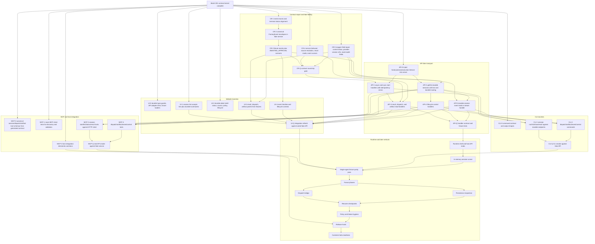
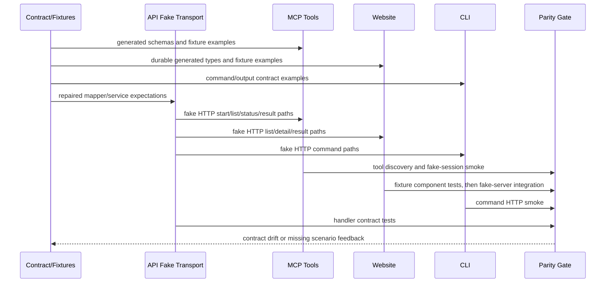

# Dynamic Workflows v0 — Program Plan

Operator-facing planning record for the Dynamic Workflows v0 program. This
document tracks batch completion, cross-surface contract posture, and the
recommended next batch for maintainers scheduling factory work.

**Last updated:** 2026-06-09 (Batch 001 retro — granular parallel execution plan)

## Program overview

### Intent

Dynamic Workflows v0 introduces **JavaScript orchestrator-backed factories**
alongside existing Petri factories without splitting the runtime model. A
**dynamic workflow** is shorthand for a factory whose authored orchestrator
kind is `JAVASCRIPT`. Customers author workflow source, request policy, and
structured args; the platform runs that definition as a durable
`FactorySession` with shared dispatches, artifacts, results, and event-stream
semantics.

The v0 program goal is to land a **contract kernel** first—OpenAPI shapes,
service seams, event payloads, validation/policy stubs, and representative
fixtures—so API, CLI, MCP, dashboard, and later runtime/persistence lanes can
share one vocabulary before real JavaScript execution or durable stores exist.

### Canonical nouns and boundaries

| Noun | Role in v0 |
|------|------------|
| `Factory` | Authored orchestration definition (Petri graph or JavaScript workflow source). |
| `FactoryOrchestrator` | Authored identity (`PETRI` or `JAVASCRIPT`) on a factory. |
| `FactorySession` | **Canonical runtime object** for every live or durable orchestration on a host. |
| `Dispatch` | Shared child-execution record for Petri transitions or JavaScript tasks. |
| `FactoryArtifact` | Session-owned output (results, findings, logs, checkpoint refs). |
| `FactoryEvent` | Canonical stream for lifecycle, phase, checkpoint, dispatch, artifact, and replay facts. |

**Do not introduce `DynamicWorkflowRun` as a separate canonical runtime noun.**
A dynamic workflow run is a `FactorySession` with
`runtime.orchestratorKind = JAVASCRIPT`. Reference docs (`docs/reference/orchestrators.md`)
and generated contracts must preserve this boundary.

Petri compatibility remains: factories without an authored orchestrator block
default to `orchestrator.kind = PETRI`. JavaScript sessions project phase,
checkpoint refs, child dispatch counts, and result refs under
`runtime.javascript` without exposing raw VM checkpoint bodies.

### Batch posture

#### Batch 001 — contract kernel (merged)

Batch 001 established the shared contract surfaces that downstream batches must
not reinterpret:

- **Data model and orchestrator projections** (PR #767): `FactoryOrchestrator`,
  kind-specific `FactorySession` runtime projections, shared dispatch/artifact
  semantics, Petri defaulting.
- **OpenAPI durable session routes and schemas** (PR #771): async/sync start,
  get/list scopes, results, dispatches, artifacts, lifecycle controls, source
  resolution, `requestId` idempotency, generated types and contract fixtures.
- **FactoryEvent session lifecycle** (PR #772): `SESSION_STARTED`,
  `SESSION_RESULT_UPDATED`, `SESSION_COMPLETED`, orchestrator phase/checkpoint
  events, dispatch queue/interruption/reconciliation, artifact creation,
  reconnect and replay expectations.
- **Workflow source validation and policy stub** (PR #773): JavaScript/TypeScript
  loader expectations, source lookup order, read-only effective policy defaults,
  artifact URI conventions, structured JSON result constraints.
- **Shared execution service seams** (PR #776): `factorysessionexecution.Service`,
  deterministic fake service, apisurface mappers, durable session contract
  fixtures in `pkg/api/testdata/durable-session-contract-fixtures.json`.

Batch 001 intentionally landed **contracts and projections**, not full transport
wiring or real runtime execution. Handlers may still return `501 NotImplemented`
or empty persisted listings until later batches wire transports and stores.

#### Batch 002 — fake-session skeleton (planned)

Batch 002 targets **deterministic fake-session skeleton work**: API/CLI/MCP/UI
surfaces that call the shared `factorysessionexecution.Service` (including the
injectable fake implementation) so reviewers can exercise durable session
start, status, result, dispatch, artifact, event, and lifecycle flows without
a JavaScript VM or durable persistence backend.

Skeleton work should:

- Reuse Batch 001 OpenAPI shapes and service/domain projections verbatim.
- Prove round-trip through apisurface mappers and contract fixtures.
- Emit or consume `FactoryEvent` payloads consistent with durable read models.
- Treat transport stubs from Batch 001 as wiring targets, not permission to
  redefine schemas.

#### Later lanes (post–Batch 002)

After the fake-session skeleton proves cross-surface contract alignment, later
batches are expected to land in roughly this order. Exact batch IDs may shift;
dependencies are architectural, not calendar promises.

| Lane | Purpose |
|------|---------|
| **Runtime** | Real JavaScript workflow execution, orchestrator phase transitions, checkpoint refs, child dispatch execution. |
| **Persistence** | Durable session stores, persisted/all listing with real rows, reconnect/replay against stored events and state. |
| **Dispatch bridge** | Provider-session integration for queued/running dispatches, interruption, and reconciliation. |
| **Policy** | Enforcement beyond read-only MVP defaults; capability denial before runtime; effective-policy stability across surfaces. |
| **Release host** | Packaging, deployment, and host integration for beta factories running dynamic workflows. |
| **Beta readiness** | End-to-end operator flows, observability, failure handling, and customer-facing docs for a bounded beta. |

Each lane must keep `FactorySession` canonical and extend—not fork—the Batch
001 contract kernel.

## Batch 001 completion checklist

Merged PR range: [#767](https://github.com/portpowered/you-agent-factory/pull/767) →
[#771](https://github.com/portpowered/you-agent-factory/pull/771) →
[#772](https://github.com/portpowered/you-agent-factory/pull/772) →
[#773](https://github.com/portpowered/you-agent-factory/pull/773) →
[#776](https://github.com/portpowered/you-agent-factory/pull/776) (2026-06-08 through
2026-06-09 UTC).

Status key:

| Symbol | Meaning |
|--------|---------|
| ✅ | Contract surface landed (schemas, types, service seams, tests, or docs) |
| 🔌 | Transport/handler wiring still stubbed (`501 NotImplemented` or empty durable rows) |

### PR #767 — data model and orchestrator projections

**Merged:** 2026-06-08 · [contract-data-model-orchestrators](https://github.com/portpowered/you-agent-factory/pull/767)

| Item | Status | Completion notes |
|------|--------|------------------|
| `FactoryOrchestrator` with `PETRI` / `JAVASCRIPT` kinds on authored factories | ✅ | Factory create/read/validate accept orchestrator blocks; existing Petri configs default to `PETRI` without edits. |
| Kind-specific `FactorySession` runtime projections | ✅ | Petri sessions expose marking/enabled transitions; JavaScript sessions expose phase, phases, checkpoint refs/summaries, args digest, child dispatch counts under `runtime.javascript`. |
| Shared dispatch and artifact contracts | ✅ | One dispatch/artifact model across orchestrators; Petri transition fields and JavaScript task fields stay in kind-specific projections. |
| Raw JavaScript checkpoints behind refs | ✅ | Public projections expose checkpoint id/label/summary/ref metadata only; raw VM bodies live in internal artifacts. |
| `FactoryEvent` orchestrator terminology alignment | ✅ | Lifecycle, phase, checkpoint, dispatch, and artifact events use canonical payloads without Petri-only leakage into JavaScript progress. |
| No `DynamicWorkflowRun` canonical noun | ✅ | API/generated models and reference docs treat dynamic workflows as `JAVASCRIPT` orchestrator-backed `FactorySession` executions. |
| Durable execution transport | 🔌 | Batch 001 scoped the **data model**; durable start/read/control handlers were not wired in this PR. |

### PR #771 — OpenAPI durable session routes and schemas

**Merged:** 2026-06-08 · [contract-openapi-session-execution](https://github.com/portpowered/you-agent-factory/pull/771)

| Item | Status | Completion notes |
|------|--------|------------------|
| `POST /factory-sessions/async` and `POST /factory-sessions/sync` request/response schemas | ✅ | `FactorySessionExecutionRequest`, async/sync responses, sync timeout outcomes, and `requestId` idempotency semantics are defined in `api/openapi.yaml` with generated Go/TypeScript types. |
| Session get/list with `scope=live\|persisted\|all` | ✅ | `ListFactorySessionsResponse` distinguishes live summaries from durable summaries; scope parameter and de-duplication rules are documented. |
| Result, dispatch, artifact read routes | ✅ | OpenAPI defines `GET /factory-sessions/{session_id}/result(s)`, dispatch list/get, and artifact list/get shapes including status enums and link refs. |
| Lifecycle control routes (approve, pause, resume, cancel, terminate, retry-dispatch) | ✅ | Request/response schemas and error shapes are specified; control semantics reference canonical session/dispatch projections. |
| Workflow source resolution contract | ✅ | `WORKFLOW_FILE` / `WORKFLOW_NAME` lookup order (project → user → package → built-in → explicit factory) is documented on durable start routes. |
| Generated contracts and fixture hooks | ✅ | `pkg/api/generated/` and UI generated types refreshed; contract tests can bind to OpenAPI examples. |
| Durable route handlers | 🔌 | `StartDurableFactorySessionAsync`, `StartDurableFactorySessionSync`, durable result/dispatch/artifact reads, and lifecycle controls in `pkg/api/handlers_factory.go` return **`501 NotImplemented`**. |
| Persisted listing rows | 🔌 | `ListFactorySessions` with `scope=persisted` or `scope=all` returns **`durableSessions: []`** (empty) until a persistence backend is wired. |
| Live-session compatibility routes | ✅ | `POST /factory-sessions` (open), `GET /factory-sessions/{id}`, live result/partial-result reads, and live `scope=live` listing remain wired through `sessionRuntime` for existing Petri workspace flows. |

### PR #772 — FactoryEvent session lifecycle additions

**Merged:** 2026-06-09 · [contract-event-stream-session-lifecycle](https://github.com/portpowered/you-agent-factory/pull/772)

| Item | Status | Completion notes |
|------|--------|------------------|
| Session lifecycle events | ✅ | `SESSION_STARTED`, `SESSION_RESULT_UPDATED`, `SESSION_COMPLETED` bracket one durable execution with replay-safe payloads. |
| Orchestrator progress events | ✅ | `ORCHESTRATOR_PHASE_CHANGED` and `ORCHESTRATOR_CHECKPOINT_WRITTEN` expose phase/checkpoint refs without raw checkpoint bodies. |
| Dispatch and artifact observability events | ✅ | `DISPATCH_QUEUED`, `DISPATCH_INTERRUPTED`, `DISPATCH_RECONCILED`, and `ARTIFACT_CREATED` cover child-work and output facts before/after worker execution. |
| Canonical `FactoryEvent.context` envelope | ✅ | Shared identity fields (session id, orchestrator kind, phase, checkpoint, dispatch, sequence, request id) avoid duplicating context inside payloads. |
| Event replay and stream reconnect spec | ✅ | After-event-id/sequence reconnect, idempotent replay, and dispatch/provider reconciliation expectations are specified and covered by focused tests. |
| Durable event route transport for new session-scoped reads | 🔌 | Global and session-scoped event streaming for **live** sessions exists; wiring durable session event reads to the fake/real execution service is a Batch 002 skeleton target, not a Batch 001 schema gap. |

### PR #773 — workflow source validation and policy stub behavior

**Merged:** 2026-06-09 · [contract-validation-policy-stub](https://github.com/portpowered/you-agent-factory/pull/773)

| Item | Status | Completion notes |
|------|--------|------------------|
| Workflow source validation before session creation | ✅ | Inline and file-backed JavaScript validation rejects syntax errors, invalid meta/schemas, unsupported globals/primitives, and forbidden host access with path-aware diagnostics. |
| JavaScript and TypeScript loader expectations | ✅ | `.js` is the MVP executable format; `.ts` follows bounded transpile/placeholder behavior with structured unsupported-loader diagnostics. |
| Ordered source lookup contract | ✅ | `FACTORY_ID`, `FACTORY_INLINE`, `WORKFLOW_FILE`, `WORKFLOW_NAME`, and `INLINE_WORKFLOW` kinds share one resolution order across API normalization surfaces. |
| Read-only effective policy defaults | ✅ | Default mode `READ_ONLY`, bounded child limits, stable policy hashes, and fail-closed denied-capability diagnostics before runtime side effects. |
| Structured JSON result and artifact URI rules | ✅ | JSON-compatible primary results via `WorkContent`; large/binary outputs use artifact refs or `you-artifact://sessions/{session_id}/artifacts/{artifact_id}` URIs. |
| `POST /workflow-previews` handler | ✅ | `PreviewWorkflow` in `pkg/api/handlers_factory.go` runs the shared preview contract (validation + policy projection) without starting a session. |
| Durable start-time validation wiring | 🔌 | Validation/policy contracts exist; **`POST /factory-sessions/async|sync`** handlers still return **`501`** so start-time enforcement awaits Batch 002 service injection. |

### PR #776 — shared execution service, fake service, mappers, and fixtures

**Merged:** 2026-06-09 · [contract-service-seams](https://github.com/portpowered/you-agent-factory/pull/776)

| Item | Status | Completion notes |
|------|--------|------------------|
| `factorysessionexecution.Service` interface | ✅ | Start (async/sync), read/status, result/dispatch/artifact projection, lifecycle controls, listing scopes, and idempotency are defined in `pkg/factorysessionexecution/`. |
| Deterministic fake service | ✅ | Injectable fake implements the same contract with stable scenario ids, JavaScript orchestrator projections, dispatch lists, result states, artifact refs, and event sequences (`fake_service.go`, `fake_fixture.go`). |
| `apisurface` mappers | ✅ | `pkg/apisurface/factorysession/` round-trips OpenAPI execution requests/responses, session records, results, dispatches, artifacts, and lifecycle payloads. |
| Durable session contract fixtures | ✅ | `pkg/api/testdata/durable-session-contract-fixtures.json` covers Petri and JavaScript scenarios (running, partial, final, failed-with-partial, canceled, timed-out, interrupted, multi-dispatch). |
| Projection/event consistency checks | ✅ | Service tests assert result status aligns with latest `SESSION_RESULT_UPDATED` events where fixtures include an event stream. |
| API handler injection of fake/real service | 🔌 | Handlers do not yet delegate durable routes to `factorysessionexecution.Service`; Batch 002 skeleton work wires transport → service → mappers. |
| Persisted listing backend | 🔌 | Service defines `scope=persisted|all` semantics; API listing returns empty durable rows until persistence lane or fake listing injection lands. |

### Batch 001 transport stub summary (not contract blockers by default)

The following gaps are **implementation wiring**, not missing OpenAPI/service definitions:

| Surface | Stubbed behavior | Owning follow-up |
|---------|------------------|------------------|
| Durable start (`async` / `sync`) | `501 NotImplemented` | Batch 002 — inject `factorysessionexecution.Service` (fake first) |
| Durable result index (`/results`) | `501 NotImplemented` | Batch 002 |
| Durable dispatch list/get | `501 NotImplemented` | Batch 002 |
| Durable artifact list/get | `501 NotImplemented` | Batch 002 |
| Lifecycle controls (approve, pause, resume, cancel, terminate, retry-dispatch) | `501 NotImplemented` | Batch 002 |
| `scope=persisted` / `scope=all` durable rows | Empty `durableSessions` arrays | Batch 002 fake listing, later persistence lane for real rows |

Cross-surface **schema or projection conflicts** are inventoried in the gap inventory section below. Transport stubs from the checklist are **not** repeated here unless they mask a contract mismatch.

## Cross-surface contract gap inventory

Classification key:

| Class | Meaning |
|-------|---------|
| **Blocking** | Schema, enum, mapper, or projection mismatch that would mislead Batch 002 skeleton consumers or break round-trip contract tests once handlers wire up |
| **Non-blocking** | Documented drift or incomplete coverage that can ship with Batch 002 skeleton work if tracked explicitly |
| **Stubbed transport** | Handler or backend wiring gap already accounted for in the Batch 001 checklist; not a contract conflict |

Evidence sources: `api/openapi.yaml`, `pkg/factorysessionexecution/`, `pkg/apisurface/factorysession/`, `pkg/api/testdata/durable-session-contract-fixtures.json`, `pkg/api/contracttests/`, and `pkg/api/handlers_factory.go`.

### OpenAPI (`api/openapi.yaml`)

| Gap | Class | Notes |
|-----|-------|-------|
| Durable route handlers return `501 NotImplemented` | Stubbed transport | Start async/sync, durable `/results`, dispatch/artifact reads, lifecycle controls — see checklist 🔌 rows |
| `scope=persisted` / `scope=all` returns empty `durableSessions` | Stubbed transport | Listing contract is defined; rows await service injection or persistence lane |
| `SessionCompletedEventPayload.finalStatus` references live `FactorySessionStatus` (`ACTIVE`/`IDLE`/`FINISHED`) instead of durable `FactorySessionDurableLifecycleStatus` (`SUCCEEDED`/`FAILED`/…) | **Blocking** | Event consumers cannot correlate terminal durable sessions with REST read models; `api/openapi.yaml` ~3661 vs ~4425 |
| `FactoryEventSessionResultStatus` omits `NOT_READY` and `UNAVAILABLE` present on `FactorySessionResultStatus` | **Blocking** | Event ↔ `GET /results` result availability enums diverge; ~3564–3574 vs ~4211–4225 |
| `ErrControlRequestIDConflict` in service has no matching OpenAPI `ErrorResponse.code` | **Blocking** | OpenAPI defines `FACTORY_SESSION_CONTROL_REQUEST_ALREADY_APPLIED` for idempotent replay but not a distinct conflict code for reused `requestId` with different control tuples (unlike `EXECUTION_REQUEST_ID_CONFLICT` for start) |
| `FactorySessionExecutionLinks` lacks `dispatches`/`artifacts` while `FactorySessionLifecycleControlLinks` includes them | Non-blocking | Start/get polling links vs post-control inspection links are intentionally asymmetric today |
| List endpoint exposes only `scope`; no query filters for status, orchestrator, recoverable, stale lease, or time ranges | Non-blocking | Service `ListSessionsRequest.Filters` is richer than current OpenAPI list params |
| `FactorySessionDurableReadModel` requires `budgets`/`usage` but service/mapper types lack those fields | **Blocking** (on wire-up) | Schema is ahead of `SessionReadResult` and `SessionReadResponseToAPI` |
| `GET /factory-sessions/{session_id}` documents oneOf live `FactorySession` \| durable `FactorySessionDurableReadModel` | **Blocking** (on wire-up) | Handler always returns live `FactorySession` via `sessionRuntime`; durable IDs will 404 or return wrong shape until service routing lands |

**Aligned:** Durable start routes (async/sync), source kinds and resolution order, `requestId` idempotency with `EXECUTION_REQUEST_ID_CONFLICT`, result/dispatch/artifact read schemas, lifecycle control request/response shapes, listing scope enum, event reconnect params (`after_event_id`, `after_sequence`), and FactoryEvent payload vocabulary in schema oneOf.

### `factorysessionexecution.Service` (`pkg/factorysessionexecution/`)

| Gap | Class | Notes |
|-----|-------|-------|
| No production `Service` implementation; only `FakeService` | Stubbed transport | Expected Batch 001 state; handlers do not inject service yet |
| Workflow source resolution not in start path | **Blocking** | OpenAPI documents resolution order on durable start routes; service normalizes `Source` only — resolution lives in `pkg/workflowsource/` (used by preview) and is not called from `factorysessionexecution` |
| `SessionReadResult` missing `budgets`, `usage` | **Blocking** (on wire-up) | Required by OpenAPI `FactorySessionDurableReadModel` |
| `DispatchSummary` missing `providerSessionRefs` | **Blocking** | OpenAPI dispatch schemas include provider-session correlation refs; service projection omits them |
| `ReadEvents` validates reconnect cursor but returns full event list | **Blocking** | `after_event_id`/`after_sequence` params on OpenAPI route are not enforced in `FakeService.ReadEvents` |
| `GetResult` ignores `mode`/`includeArtifacts` shaping | **Blocking** | Returns static fixture clone; normalization exists but no projection logic |
| `deriveProjectionEvents` emits non-canonical events | **Blocking** | Synthetic events lack `schemaVersion`/`id`/`context` envelope; `SESSION_COMPLETED` uses `status` not `finalStatus`; `sessionId` duplicated inside payload (`fake_fixture.go` ~780–808) |
| `InspectionLinks` includes `dispatches`/`artifacts` but OpenAPI `FactorySessionExecutionLinks` does not | Non-blocking | Service is richer than start-response link schema |
| `RETRY_DISPATCH` evaluation accepts on active sessions but fake only mutates on `FAILED` | Non-blocking | Service rule vs fake behavior inconsistency |

**Aligned:** Full `Service` interface (start async/sync, get, controls, result, dispatch/artifact reads, events, listing), durable lifecycle model (12 statuses, control kinds/outcomes), start and control idempotency helpers, listing scope (`live`/`persisted`/`all`) with filters and dedup, projection consistency validators, and deterministic `FakeService` with fixture-backed scenarios.

### apisurface mappers (`pkg/apisurface/factorysession/`)

| Gap | Class | Notes |
|-----|-------|-------|
| Handlers do not call mappers (501 stubs) | Stubbed transport | Mappers are proven via unit/fake-consumer tests only |
| `ControlErrorToAPI` omits required `status` on `FactorySessionLifecycleControlResponse` | **Blocking** | OpenAPI requires `sessionId`, `operation`, `outcome`, **`status`**; mapper sets only first three fields |
| `SessionReadResponseToAPI` does not map `budgets`/`usage` | **Blocking** (on wire-up) | Matches missing service fields |
| `dispatchSummaryToAPI` omits `providerSessionRefs` | **Blocking** | Matches missing service field |
| `executionLinksToAPI` drops `dispatches`/`artifacts` from service `InspectionLinks` | Non-blocking | Matches narrower OpenAPI `FactorySessionExecutionLinks` |
| `ListSessionsRequestFromAPI` maps only `scope` | Non-blocking | OpenAPI has no filter params yet; service filters unused at API boundary |
| `EventReadResponseToAPI` silently skips unmarshal failures | Non-blocking | Tolerates invalid fake events today; will hide real envelope gaps |
| `SyncStartResponseToAPI` silently drops unmarshalable embedded `Result` | Non-blocking | Edge-case loss on sync start mapping |

**Aligned:** Start request/response mapping, session/result/dispatch/artifact projections, lifecycle control mapping, listing mapping, and bidirectional fixture round-trips in `factory_session_*_test.go` and `factory_session_fake_consumer_test.go`.

### FactoryEvent payloads

| Gap | Class | Notes |
|-----|-------|-------|
| `SessionCompletedEventPayload.finalStatus` enum mismatch (live vs durable) | **Blocking** | See OpenAPI row; fake projections emit durable `status` string in wrong field name |
| `FactoryEventSessionResultStatus` ⊂ `FactorySessionResultStatus` | **Blocking** | Event payloads cannot express `NOT_READY`/`UNAVAILABLE` availability states |
| Fake/synthetic events are not valid `FactoryEvent` documents | **Blocking** | `deriveProjectionEvents` output fails canonical envelope; `EventReadResponseToAPI` expects full documents |
| Reconnect filtering not implemented at service layer | **Blocking** | OpenAPI params validated but not applied in `ReadEvents` |
| Dual phase event models (`ORCHESTRATOR_PHASE_CHANGED` vs `JAVASCRIPT_PHASE_CHANGE`) | Non-blocking | Both in schema oneOf; no durable-client preference guidance yet |
| No typed durable event payload structs in `factorysessionexecution` | Non-blocking | Only string kind list + minimal JSON snippets in `projection_consistency.go` |

**Aligned:** Canonical `FactoryEvent` envelope (`schemaVersion`, `id`, `type`, `context`, `payload`), `FactoryEventContext` reconnect fields, durable session event type vocabulary in OpenAPI, `SessionProjectionEventKinds` list, and live SSE route contract on session events.

### Contract fixtures (`pkg/api/testdata/durable-session-contract-fixtures.json`)

| Gap | Class | Notes |
|-----|-------|-------|
| No `events[]` arrays with canonical `FactoryEvent` envelopes | **Blocking** | Fixtures only include `links.events` URLs; fake synthesizes invalid events — cannot prove event round-trip from JSON catalog |
| No `AWAITING_APPROVAL` session scenario | **Blocking** | Status exists in OpenAPI enum and `canApprove` action availability; no matching scenario `id` |
| Interrupted/recoverable scenario only in fake builtin, not JSON catalog | Non-blocking | `BuiltinInterruptedRecoverableScenario` in `fake_fixture.go`; not in `scenarios[]` |
| No `STILL_RUNNING` sync outcome fixture | Non-blocking | Only `COMPLETED` and `TIMED_OUT` sync outcomes represented |
| Lifecycle control fixtures incomplete | Non-blocking | Only PAUSE, CANCEL, RETRY_DISPATCH samples; missing APPROVE, RESUME, `INVALID_STATE`, `CONFLICT`, control idempotency replay |
| No reconnect/event-cursor fixture | Non-blocking | `after_event_id`/`after_sequence` not fixture-tested |
| `providerSessionRefs` absent from dispatch fixtures | Non-blocking | OpenAPI schema tests assert field presence; fixture dispatch rows omit correlation refs |
| List filters not fixture-tested | Non-blocking | Service tests cover filters; fixtures only exercise `scope` |

**Aligned:** 10-scenario matrix (Petri + JavaScript; running, paused, failed-with-partial, timed-out, canceled, succeeded, unsupported-runner, missing-source), per-scenario `executionRequest`/`session`/`listSummary`/`dispatches`/`result` coverage, `idempotentReplay` block, `listResponse` with `scope: all`, lifecycle control samples on three scenarios, host-path omission guard, and OpenAPI validate/round-trip in `generated_contract_durable_session_test.go`.

### Cross-cutting summary

| Mismatch | Class | Primary surfaces |
|----------|-------|------------------|
| HTTP handlers 501 / empty persisted list | Stubbed transport | `handlers_factory.go` ↔ OpenAPI ↔ service |
| No `factorysessionexecution.Service` wired into API server | Stubbed transport | `handlers_factory.go` |
| Workflow source resolution documented but not in execution service start path | **Blocking** | OpenAPI ↔ `workflowsource` ↔ `factorysessionexecution` |
| `GET /factory-sessions/{id}` union vs handler returns live shape only | **Blocking** (on wire-up) | OpenAPI ↔ `handlers_factory.go` |
| `SessionCompleted` + fake events use wrong status model / invalid envelope | **Blocking** | OpenAPI events ↔ fake ↔ apisurface |
| Result status enums differ (event vs REST) | **Blocking** | OpenAPI events ↔ `FactorySessionResult` |
| `budgets`/`usage` on durable read model — no service/mapper fields | **Blocking** (on wire-up) | OpenAPI ↔ service ↔ apisurface |
| `providerSessionRefs` on dispatches — no service/mapper/fixture | **Blocking** | OpenAPI ↔ service ↔ apisurface ↔ fixtures |
| `ControlErrorToAPI` missing required `status` | **Blocking** | OpenAPI ↔ apisurface |
| Control idempotency conflict has no distinct OpenAPI error code | **Blocking** | OpenAPI ↔ `ErrControlRequestIDConflict` |
| Event reconnect params validated but not enforced | **Blocking** | OpenAPI ↔ `ReadEvents` |
| `GetResult` ignores `mode`/`includeArtifacts` | **Blocking** | OpenAPI ↔ service |
| Execution links vs lifecycle control links shape drift | Non-blocking | OpenAPI ↔ service ↔ apisurface |
| List filter model in service without OpenAPI params | Non-blocking | OpenAPI ↔ service |
| Fixture gaps (events, approval, STILL_RUNNING, interrupted in JSON) | Mixed | Fixtures ↔ all surfaces |

Stubbed transport gaps are **expected Batch 001 follow-up for Batch 002 wiring**, not permission to redefine schemas. Blocking items above are the inputs for the go/no-go recommendation below.

## Batch 002 go/no-go recommendation

**Recommendation: No-go** — do **not** schedule Batch 002 fake-session skeleton work as the
immediate next batch. Schedule a **contract-repair batch** first to close the blocking
cross-surface mismatches inventoried above, then re-run this checklist before skeleton
handler wiring.

### Evidence

The Batch 001 completion checklist shows contract surfaces landed (✅) while durable
transport remains stubbed (🔌). That split is healthy and **not** the reason for no-go.
The gap inventory identifies **twelve blocking mismatches** across OpenAPI, service,
mappers, events, and fixtures that would invalidate Batch 002's stated goals:

1. Prove round-trip through apisurface mappers and contract fixtures.
2. Emit or consume `FactoryEvent` payloads consistent with durable read models.
3. Wire handlers to `factorysessionexecution.Service` without redefining schemas.

If Batch 002 proceeds now, skeleton consumers would exercise **wrong terminal status
enums**, **invalid event envelopes**, **incomplete error mappings**, and **fixture
scenarios that cannot prove event round-trip** — masking regressions until persistence
or real runtime lands.

### Blocking findings (must close in contract-repair batch)

| # | Finding | Surfaces | Why it blocks skeleton work |
|---|---------|----------|------------------------------|
| B1 | `SessionCompletedEventPayload.finalStatus` uses live `FactorySessionStatus` instead of durable lifecycle enum | OpenAPI events ↔ fake projections | Terminal session facts cannot correlate REST reads with event stream |
| B2 | `FactoryEventSessionResultStatus` omits `NOT_READY` / `UNAVAILABLE` | OpenAPI events ↔ `GET /results` | Result availability cannot round-trip between events and REST |
| B3 | `deriveProjectionEvents` emits non-canonical `FactoryEvent` documents (`status` vs `finalStatus`, missing envelope) | fake service ↔ apisurface ↔ fixtures | Event reads will fail mapper unmarshaling once handlers wire up |
| B4 | Contract fixtures lack canonical `events[]` arrays | fixtures ↔ fake ↔ apisurface | Cannot prove event round-trip from JSON catalog — only invalid synthetics |
| B5 | No `AWAITING_APPROVAL` fixture scenario | fixtures ↔ OpenAPI enum ↔ controls | Approval control skeleton cannot be fixture-tested |
| B6 | `ControlErrorToAPI` omits required `status` on lifecycle control responses | apisurface ↔ OpenAPI | Error responses violate required response schema |
| B7 | Control `requestId` conflict has no distinct OpenAPI `ErrorResponse.code` | OpenAPI ↔ `ErrControlRequestIDConflict` | Idempotency replay vs true conflict cannot be distinguished at API boundary |
| B8 | Workflow source resolution documented on durable start but not called from service start path | OpenAPI ↔ `workflowsource` ↔ service | Skeleton start would skip validation/resolution contract Batch 001 defined |
| B9 | `ReadEvents` validates reconnect cursor but returns full list | OpenAPI ↔ service | Event reconnect contract is false once routes delegate to service |
| B10 | `GetResult` ignores `mode` / `includeArtifacts` shaping | OpenAPI ↔ service | Result read contract diverges from schema parameters |
| B11 | `budgets` / `usage` required on durable read model but absent from service/mappers | OpenAPI ↔ service ↔ apisurface | Durable `GET` responses cannot satisfy schema on wire-up |
| B12 | `providerSessionRefs` on dispatch schemas absent from service/mappers/fixtures | OpenAPI ↔ service ↔ apisurface ↔ fixtures | Dispatch correlation refs drop on round-trip |

Items marked **Blocking (on wire-up)** in the inventory (B11, durable `GET` union routing)
are included here because Batch 002's core deliverable **is** wire-up; they cannot be
deferred past skeleton work without shipping schema-invalid responses.

### Non-blocking follow-ups (safe to carry into Batch 002 after repair)

| Finding | Class | Carry-forward rationale |
|---------|-------|-------------------------|
| Durable handlers return `501` / empty persisted listings | Stubbed transport | Expected Batch 001 state; Batch 002 wiring target after contracts stabilize |
| `FactorySessionExecutionLinks` lacks `dispatches`/`artifacts` vs lifecycle control links | Non-blocking | Asymmetric link shapes are documented; skeleton can start with narrower start links |
| Service list filters richer than OpenAPI list params | Non-blocking | Filters work in service tests; API query params can land later |
| `RETRY_DISPATCH` fake vs service rule drift on active sessions | Non-blocking | Fake behavior can align during skeleton without schema change |
| Dual phase event models (`ORCHESTRATOR_PHASE_CHANGED` vs `JAVASCRIPT_PHASE_CHANGE`) | Non-blocking | Both in schema oneOf; client guidance can follow skeleton |
| Interrupted/recoverable, `STILL_RUNNING` sync, incomplete lifecycle control fixture matrix, reconnect cursor fixtures, list-filter fixtures | Non-blocking | Expand fixture catalog during or after skeleton; not schema blockers |
| `EventReadResponseToAPI` / `SyncStartResponseToAPI` silent drop on unmarshal failure | Non-blocking | Tighten once canonical events land (B3/B4) |

### Smallest contract-repair batch (before Batch 002 skeleton)

Schedule one focused batch — **not** a broad refactor — with this minimum scope:

1. **OpenAPI repairs:** align `SessionCompletedEventPayload.finalStatus` and
   `FactoryEventSessionResultStatus` with durable REST enums; add distinct
   `FACTORY_SESSION_CONTROL_REQUEST_ID_CONFLICT` (or equivalent) for control
   `requestId` reuse with different tuples.
2. **Fake + fixtures:** rewrite `deriveProjectionEvents` to emit canonical envelopes;
   add `events[]` to fixture scenarios; add `AWAITING_APPROVAL` scenario.
3. **Service seams:** call workflow source resolution from start path; enforce
   `ReadEvents` cursor filtering; honor `GetResult` `mode`/`includeArtifacts`; add
   `budgets`/`usage` and `providerSessionRefs` to projections.
4. **Mappers:** map new fields; fix `ControlErrorToAPI` required `status`; regenerate
   contracts if OpenAPI changes.
5. **Verification:** extend contract/fake-consumer tests to prove event and durable-read
   round-trips for at least running, `AWAITING_APPROVAL`, and terminal scenarios.

Estimated posture: **one vertically sliced contract batch** touching the five surfaces
already named in this plan — smaller than Batch 002 skeleton (which also spans
CLI/MCP/UI) but mandatory so skeleton work does not encode broken contracts.

### Re-entry criteria for Batch 002 (Go)

After contract-repair merges, treat Batch 002 as **Go** when:

- Blocking table B1–B12 rows are closed or explicitly downgraded with reviewer sign-off.
- `durable-session-contract-fixtures.json` includes canonical `events[]` for representative
  scenarios and an `AWAITING_APPROVAL` row.
- Fake-service + mapper round-trip tests pass for durable session get, result, dispatch,
  artifact, event, and lifecycle control paths without schema workarounds.
- Transport stubs (501 handlers, empty persisted listing) remain the **only** deliberate
  gaps — wired in Batch 002 skeleton against the repaired contract kernel.

### Product behavior goals (in scope for the program)

- Customers can define JavaScript workflow factories and start them as durable
  `FactorySession` executions with explicit orchestrator identity.
- Session status, partial/final results, dispatches, artifacts, and lifecycle
  controls are observable through API, CLI, MCP, dashboard, and events with
  matching semantics.
- Workflow sources resolve through a shared lookup order; validation and
  read-only policy defaults reject unsafe or malformed input before execution.
- Event streams bracket one session execution and support reconnect/replay
  without duplicating applied facts.
- Contract fixtures and fake-service projections give reviewers deterministic
  scenarios (running, terminal, partial, failed, canceled, interrupted) before
  real runtime exists.

### Out of scope for current batches (explicit non-goals)

The following are **not** goals of Batch 001 retro documentation or of Batch
002 skeleton work unless a later batch explicitly schedules them:

- **Real JavaScript execution** in a production VM/sandbox (runtime lane).
- **Durable persistence stores** and real persisted-session listing backends
  (persistence lane).
- **MCP tool wiring** beyond contract-level planning shared with API/CLI.
- **CLI command implementation** and **dashboard UI screens** beyond skeleton
  flows needed to exercise the service contract.
- **Provider dispatch bridges** and live external tool sessions (dispatch-bridge
  lane).
- **Broad refactors** of unrelated packages, route registration cleanup, or
  Petri-runtime rewrites not required for dynamic-workflow contracts.
- Introducing **`DynamicWorkflowRun`** or parallel session nouns in OpenAPI,
  events, or operator docs.

Stubbed transport behavior (for example `501 NotImplemented` handlers or empty
persisted rows) is an **implementation gap**, not a license to change Batch
001 schema or service semantics. Later stories in this retro document separate
transport stubs from true cross-surface contract conflicts.

### Granular parallel execution plan

The original Batch 002 shape is too wide for maximum throughput: API handler
wiring, MCP tools, CLI commands, website components, host integration files,
and contract repair do not all have the same dependencies. The code comparison
on 2026-06-09 shows:

- `factorysessionexecution.Service`, deterministic fake scenarios, OpenAPI
  durable route shapes, generated Go/TypeScript types, and mapper packages exist.
- Durable API handlers in `pkg/api/handlers_factory.go` still return `501` for
  async/sync start, results, dispatches, artifacts, lifecycle controls, and
  durable events; `scope=persisted|all` returns empty durable rows.
- `pkg/mcp/workflow/` only exposes workflow preview/start-validation helpers,
  so session/dispatch/artifact MCP tools can be designed now but need a later
  API/service parity pass.
- `ui/src/api/factory-sessions/api.ts` and the current factory-session detail
  panel are live-session oriented; generated durable types are present for
  fixture-backed adapters and components before HTTP wiring exists.
- `pkg/api/testdata/durable-session-contract-fixtures.json` lacks canonical
  `events[]` arrays and an `AWAITING_APPROVAL` scenario, so event/control
  tranches need fixture repair before cross-surface parity claims.

Use the following graph to schedule smaller work items. `CR-*` closes contract
drift; `API-*`, `MCP-*`, `UI-*`, and `CLI-*` can advance as soon as their
specific inputs exist rather than waiting for a monolithic fake-session batch.

#### Suggested micro-batches

| ID | Smallest independently testable behavior | Can start when | Primary evidence |
|----|------------------------------------------|----------------|------------------|
| CR-1 | Event terminal/result enums match durable REST status vocabulary. | Batch 001 complete | OpenAPI contract tests and generated type diff. |
| CR-2 | Fake service emits canonical `FactoryEvent` envelopes with context and payload identity boundaries. | CR-1 | Fake-service event tests and `EventReadResponseToAPI` round-trip. |
| CR-3 | Durable fixture catalog includes `events[]` and `AWAITING_APPROVAL`. | CR-2 | Fixture validation for running, approval, terminal, and failed-with-partial scenarios. |
| CR-4 | Fake/service reads honor source resolution, result mode/includeArtifacts, and event reconnect cursors. | Batch 001 complete | Service unit tests over `workflowsource`, result projection, and cursor filtering. |
| CR-5 | Mappers preserve required lifecycle, provider-correlation, and read-model fields. | Batch 001 complete | Mapper round-trip tests against fixtures. |
| API-0 | Server can receive an injectable durable execution service without changing route contracts. | Batch 001 complete | Server construction tests still pass with nil/live defaults and fake injection. |
| API-1 | Async/sync start routes return fake sessions and idempotency conflicts. | CR-Q and API-0 | Handler tests for accepted, completed, timed-out, and conflict outcomes. |
| API-2 | `GET` and list route durable rows coexist with live-session compatibility. | CR-5 and API-0 | Handler tests for `scope=live|persisted|all` and durable id lookup. |
| API-3 | Result, dispatch, and artifact reads map through the service. | API-1 plus CR-4/CR-5 | Handler tests for not-ready, partial, final, failed, and missing resources. |
| API-4 | Lifecycle controls map approve/pause/resume/cancel/terminate/retry outcomes. | API-2 plus CR-5 | Handler tests for accepted, no-op, invalid-state, terminal, replay, and conflict. |
| API-5 | Durable event reads honor reconnect cursors and canonical envelopes. | CR-3 plus API-2 | Event route tests for initial history and after-event/sequence replay. |
| MCP-0 | Canonical MCP tool schemas exist for session, dispatch, and artifact nouns. | Batch 001 complete | Schema/discovery tests using generated OpenAPI types; no live server required. |
| MCP-1 | Mock client validates preview/start error shape and tool discovery. | Batch 001 complete | Mock MCP tests over `pkg/mcp/workflow` and new session tool catalog. |
| MCP-2 | MCP start/list/status/result tools call the current HTTP durable endpoints. | API-1 and API-2 | Mock HTTP tests first; real fake-server smoke after API wiring. |
| MCP-3 | MCP dispatch/artifact/event/control tools match API behavior. | API-3, API-4, API-5 | Mock and fake-server parity tests. |
| MCP-4 | Host integration directories and packaging manifests exist. | Batch 001 complete | File inventory tests and release-archive inclusion checks; tool implementation can follow. |
| UI-0 | Website durable-session adapters and guards accept generated durable shapes. | Batch 001 complete | Type-level/API tests with durable fixtures; no server required. |
| UI-1 | Session list can render live and durable summaries together. | Batch 001 complete | Component tests using `scope=all` fixture responses. |
| UI-2 | Durable detail shell renders status, source, policy, lifecycle, and actions. | Batch 001 complete | Component tests from `FactorySessionDurableReadModel` fixtures. |
| UI-3 | Result, dispatch, and artifact panels render fake durable data. | CR-3 and CR-5 | Component and adapter tests over repaired fixtures. |
| UI-4 | Event timeline and lifecycle controls render canonical events/outcomes. | CR-3 | Component/hook tests with canonical event arrays and control responses. |
| CLI-0 | Durable command names, JSON output shape, and help text stay on factory/session nouns. | Batch 001 complete | CLI command tests without HTTP execution. |
| CLI-1 | Durable run/list/show/result commands call fake API endpoints. | API-1 and API-2 | CLI HTTP tests for start/list/show/result. |
| CLI-2 | Dispatch/artifact/event/control commands call fake API endpoints. | API-3, API-4, API-5 | CLI HTTP tests for each inspection/control path. |
| PAR-Q | Cross-surface parity test proves one fake session is explainable everywhere. | API-Q, MCP-Q, UI-Q, CLI-Q | API, CLI, MCP, and UI all show same session id, status, result, dispatches, artifacts, and events. |

#### Tranche cadence

Each tranche should converge on one fake scenario before adding a broader
scenario matrix. This keeps website and MCP work unblocked while still forcing
realignment after API/service implementation catches up.

#### Scheduling guidance

- Start **MCP-0**, **MCP-1**, **MCP-4**, **UI-0**, **UI-1**, **UI-2**,
  **CLI-0**, and **API-0** immediately; they depend only on Batch 001 generated
  contracts and fixtures, not on non-`501` durable handlers.
- Treat **CR-Q** as the gate for handler claims, not for client scaffolds. Client
  scaffolds may use fixtures, generated types, and mocked HTTP responses while
  contract repair is in flight.
- Split API work by route family. `API-1` and `API-2` unblock MCP/CLI start and
  list/status work; `API-3` unblocks result/dispatch/artifact panels and tools;
  `API-4` and `API-5` can follow independently.
- Put a parity gate after every tranche: first running/succeeded, then
  not-ready/partial, then failed-with-partial, then awaiting approval and
  lifecycle controls, then interrupted/reconnect.
- Do not start real runtime, persistence, dispatch bridge, or resume work until
  at least one fake session vertical passes `PAR-Q`; otherwise later lanes will
  debug transport drift and runtime behavior at the same time.

### Decision context for the next batch

Maintainers use this plan to decide which **micro-batches** can proceed in
parallel and which require a contract-repair gate before handler or parity
claims. The old Batch 002 label remains useful as a milestone name, but the
actual queue should be scheduled as the granular graph above.

**Current decision (2026-06-09 UTC):** **No-go** for a monolithic Batch 002
fake-session skeleton, but **go** for parallel fixture/type/client scaffolds
that do not claim live handler parity yet. Schedule **CR-1 through CR-5** plus
**API-0** as the contract/API foundation, and in parallel schedule **MCP-0**,
**MCP-1**, **MCP-4**, **UI-0**, **UI-1**, **UI-2**, and **CLI-0**.
Transport stubs from the checklist remain route-family wiring targets after
the relevant repair gates pass.

The **Batch 001 completion checklist** is the authoritative record of what
merged in PRs #767–#776. Treat Batch 001 as **contract-complete at the
interface-definition layer** but **not** safe for handler parity claims until
the blocking inventory is refreshed and the relevant CR gates are resolved.

### Related references

- `docs/reference/orchestrators.md` — canonical nouns and dynamic-workflow aliases
- `docs/reference/sessions.md` — live session discovery and CLI routing
- `pkg/factorysessionexecution/` — shared durable session execution service
- `pkg/apisurface/factorysession/` — OpenAPI ↔ service mappers
- `pkg/api/testdata/durable-session-contract-fixtures.json` — contract fixtures
