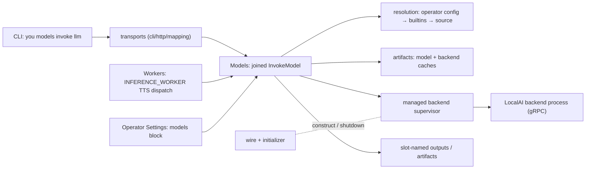
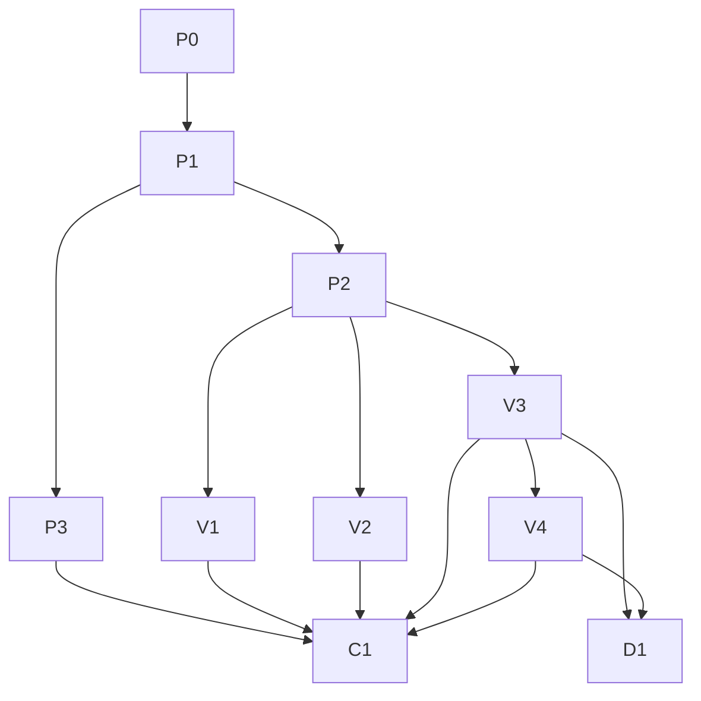

# Run local AI with YOU — priority slice

Status: proposed  
Date: 2026-08-20  
Audience: Models, Workers, transports, operator-settings, packaged-factory,
CI, and functional-test maintainers

Scope source: `problems.md` (current docket, "local models from localai").  
Deferred remainder: `docs/internal/development/plans/backlog/localai-extensions-deferred.md`.  
Archived full program: `docs/internal/development/plans/archive/08-20/localai-extensions-full-program.md`.  
Upstream references: [LocalAI](https://github.com/mudler/LocalAI),
[LocalAI backends](https://github.com/mudler/LocalAI/blob/master/docs/content/features/backends.md),
[LocalAI audio-to-text](https://localai.io/docs/features/audio-to-text/),
[llama.cpp model loading](https://github.com/ggml-org/llama.cpp/blob/master/docs/models.md),
[VibeVoice-7B](https://huggingface.co/vibevoice/VibeVoice-7B),
[Qwen3-Embedding-0.6B GGUF](https://huggingface.co/Qwen/Qwen3-Embedding-0.6B-GGUF).

## Problem, gap, and outcome

Customers can only run one specialized local operation today: OmniVoice TTS
through a TTS-shaped `you models invoke` and a TTS-specialized factory
runtime. They cannot transcribe audio, embed text, run a local LLM, or
point a model at image or video files, and nothing downloads on demand —
the invocation contract, input shaping, and output routing are all
TTS-specific.

Outcome of this slice: `you models invoke` becomes a generic,
download-on-first-use CLI journey over built-in model names — `asr`
(whisper), `tts` (VibeVoice-7B), `llm` (gemma-e4b omni text + media
understanding via llama.cpp), `embed` (Qwen3-Embedding-0.6B) — backed by
managed LocalAI backends compiled in CI for macOS, Linux, and Windows.
Factory TTS switches to the same path: the packaged TTS factory runs on the
`tts` (vibevoice) model through the new invocation kernel, and the
specialized OmniVoice runtime is deprecated and deleted.

## Exit criterion

An agent with no prior context, in an empty repository, given only
`you docs models` (and `you docs agents`), can use the CLI to:

- transcribe an audio file (ASR),
- describe/understand image and video files, including timing questions
  about the video (omni),
- synthesize speech from text (TTS),
- produce embeddings for a text input,

with YOU resolving, downloading, and starting everything on first
invocation, using only the built-in model names.

## Scope

In scope (this plan):

| Built-in name | Operation | Default source | Backend |
| --- | --- | --- | --- |
| `asr` | `ASR` | `hf://ggerganov/whisper.cpp/ggml-base.en.bin` | LocalAI whisper.cpp audio backend |
| `tts` | `TTS` | `hf://vibevoice/VibeVoice-7B` | LocalAI vibevoice audio backend |
| `llm` | `OMNI` | gemma-e4b GGUF (pinned `hf://` revision) | LocalAI llama.cpp backend |
| `embed` | `EMBED` | `hf://Qwen/Qwen3-Embedding-0.6B-GGUF/Qwen3-Embedding-0.6B-f16.gguf` | LocalAI llama.cpp backend |

Plus, from `problems.md`: generic CLI invocation, Hugging Face download and
cache reuse, CI compilation of backend artifacts for mac/linux/windows, `@`
file-path inputs with media-type detection (multiple images supported),
built-in/operator-config model configuration, reference documentation
(models and operator configuration), configuration OpenAPI schema, and
functional tests. And the runtime switch: factory `INFERENCE_WORKER` TTS
dispatches route through the new joined invocation path, the packaged TTS
factory moves to the `tts` builtin, and the OmniVoice specialized runtime
is deleted once parity is proven.

Out of scope (moved to the deferred plan, do not implement here):

- All other operation families (rerank, moderation, tokenize, sound
  generation, diarization, VAD, audio classify/transform, image generation,
  detection, SAM, depth, face/speaker ops, video generation, 3D).
- Full Factory graph generalization beyond the TTS switch: generic
  `INFERENCE_RUN` operation bindings for new families, removing model
  fields from `MODEL` Resources, `modelLocality` deprecation, `VIDEO` as a
  `WorkContent` type, UI changes.
- The attached `LOCALAI_HTTP` adapter for operator-supplied servers.

## Customer interfaces

### CLI grammar

```text
you models invoke <model-or-source> [--operation <name>]
  [--input <slot>=<value>]...
  [--param <name>=<value>]...
  [--output <slot>=<path>]...
  [--json]
  [--offline]
```

- `<model-or-source>` is a model name (operator-configured or built-in:
  `llm`, `asr`, `tts`, `embed`), a local path, a `file://` URI, or an
  `hf://owner/repo[/file]@revision` reference.
- `--operation` may be omitted when the resolved model exposes exactly one
  operation — true for every built-in, so the default journeys never need
  it.
- `--input <slot>=<text>` binds inline text; `--input <slot>=@<path>` binds
  a file with its detected media type (audio, image, video, text);
  `--input <slot>=json:<json>` binds inline JSON. A repeatable slot (such
  as `OMNI.image`) accepts the flag multiple times; a non-repeatable slot
  rejects a second value before any download.
- `--param <name>=<value>` sets a validated operation parameter.
- `--text` and unqualified TTS `--output <path>` remain compatibility
  aliases, reimplemented on the generic path.
- Invalid slots, parameters, ambiguous operations, and unroutable outputs
  fail before any download or backend start.

Output rules:

- Exactly one output and no output flags: canonical payload to stdout
  (UTF-8 for text/JSON, raw bytes for audio), diagnostics to stderr only.
- Multiple outputs (ASR: `transcript` + `segments`) require explicit
  `--output <slot>=<path>` mappings or `--json`; otherwise the request
  fails before heavyweight work.
- `--json` returns canonical output metadata and artifact references.

`you models pull <model>` remains optional prefetch; `you models inspect
<model>` reports the effective configuration source (built-in or operator),
resolved source revision, cache state, operations, slots, backend artifact,
and readiness. `--offline` is strictly cache-only and an offline miss lists
every missing artifact.

### Operations shipped in this slice

| Operation | Required inputs | Optional inputs | Outputs |
| --- | --- | --- | --- |
| `OMNI` | `prompt:TEXT` | `image:IMAGE` (repeatable), `audio:AUDIO`, `video:VIDEO`, `parameters:JSON` | `text:TEXT`, optional `usage:JSON` |
| `EMBED` | `text:TEXT` | `parameters:JSON` | `embedding:JSON` |
| `TTS` | `text:TEXT` | `voice:AUDIO`, `parameters:JSON` | `audio:AUDIO` |
| `ASR` | `audio:AUDIO` | `prompt:TEXT`, `parameters:JSON` | `transcript:TEXT`, `segments:JSON` |

`OMNI` is the single text-and-media-understanding contract: text-only
prompts, one or many images, and audio/video inputs (description,
understanding, and timing answers for video) all go through it. The
llama.cpp audio/video input capability is a stated risk to validate early;
if the pinned backend cannot accept a modality, the codec rejects that slot
with a typed capability error rather than silently ignoring it.

### Complete journeys the docs and tests must cover

```sh
you models invoke asr --input audio=@meeting.wav \
  --output transcript=meeting.txt --output segments=meeting.json
you models invoke tts --input text="Hello" > hello.wav
you models invoke llm --input prompt="Write a haiku"
you models invoke llm --input prompt="What happens at 0:30?" --input video=@clip.mp4
you models invoke llm --input prompt="Compare these two designs" \
  --input image=@a.png --input image=@b.png
you models invoke embed --input text="Find similar work"
```

Each is a complete resolve → download → load → invoke → output → release
journey; no preceding install/pull step or operator configuration is
implied — the built-in defaults make these work on a fresh machine.

### HTTP API

The same generic invocation ships over HTTP so CLI and API stay
equivalent: generic invoke request (model reference, operation, named
ordered inputs with repeatable slots, parameters, output mode),
named-output response with artifact references, extended model detail, and
typed failures. The operator-settings configuration schema gains the
`models` block described below. Authored in `api/openapi-main.yaml` +
`api/components/`; TTS-specific request/response shapes remain as
deprecated compatibility schemas until `D1` removes them.

## Built-in models and operator configuration

Model names resolve in this order: operator configuration `models:` entry,
then built-in defaults, then interpretation as a path/`hf://` source. The
effective configuration is always "built-ins overlaid by operator config" —
an operator entry can override any field of a built-in name (source,
backend, load policy, operation contract) or add entirely new names.

Built-in defaults (shipped in code, shown here in operator-config syntax):

```yaml
models:
  llm:
    source: hf://<pinned gemma-e4b GGUF revision>
    backend: localai-llamacpp
    loadPolicy: ON_DEMAND
    operations: [OMNI]
  asr:
    source: hf://ggerganov/whisper.cpp/ggml-base.en.bin
    backend: localai-whisper
    loadPolicy: ON_DEMAND
    operations: [ASR]
  tts:
    source: hf://vibevoice/VibeVoice-7B
    backend: localai-vibevoice
    loadPolicy: ON_DEMAND
    operations: [TTS]
  embed:
    source: hf://Qwen/Qwen3-Embedding-0.6B-GGUF/Qwen3-Embedding-0.6B-f16.gguf
    backend: localai-llamacpp
    loadPolicy: ON_DEMAND
    operations: [EMBED]
```

Most customers never write this block. Operator configuration is the
override for a different model choice, custom backend build, non-default
operation contract, or load policy. There is no LocalAI gallery source
type.

## Model resolution and caching

Source forms: relative/absolute local paths, `file://` URIs, and
`hf://owner/repo[/file]@revision`.

For Hugging Face sources, YOU resolves the revision to an immutable commit
and checks caches in order: `HUGGINGFACE_HUB_CACHE`, `$HF_HOME/hub`, the
platform-default HF hub cache, the YOU content-addressed cache, then the
network unless `--offline`. Downloads use a partial directory, digest
verification, and atomic commit; concurrent first invocations share one
download. `HF_TOKEN` supports private repositories and is always redacted.
Model and backend-artifact caches are separate.

## Backend artifacts and CI compilation

- CI builds and publishes pinned LocalAI backend artifacts — llama.cpp and
  the whisper/vibevoice audio backends — for darwin-arm64, linux-amd64, and
  windows-amd64, with per-platform checksums recorded in a manifest that
  the Models service consumes.
- `invoke` downloads the matching artifact on demand, verifying checksum,
  platform, architecture, and accelerator compatibility before start.
- The backend protocol revision is pinned; a pin update is a dependency PR
  that must pass fixture and real-backend conformance tests.

## Factory inference and the OmniVoice switch

This slice migrates the one existing factory inference path onto the new
kernel; it does not generalize the graph model.

- The authored `INFERENCE_WORKER` shape is unchanged (`type` + `model`,
  existing TTS workstation bindings keep validating as they do today).
- Workers' inference execution routes the dispatch through the joined
  `InvokeModel` (model name, operation, ordered named inputs, parameters)
  instead of the OmniVoice-specialized runtime, and preserves named
  outputs into Work as it does today.
- The packaged TTS factory under `packages/packaged-factories/factories/`
  switches its model to the `tts` builtin (VibeVoice-7B) and its generated
  package output is regenerated.
- Deprecation then deletion: the OmniVoice specialized runtime, its
  TTS-specialized request shapes, and its deprecated OpenAPI schemas are
  removed in a dedicated final lane (`D1`) once direct-CLI (`V3`) and
  factory (`V4`) parity against the `P0` characterization is proven. Parity
  means contract parity — flags, stdout/exit behavior, Work/event/artifact
  shapes, lease lifecycle — not byte-identical audio, since the default
  voice model changes to VibeVoice-7B. Until `D1`, the joined path is
  canonical and no new caller may target the OmniVoice shapes.

## Customer documentation

- Rewrite `docs/reference/models.md` invoke-first: built-in model names,
  source forms, the four operations with input/output slot tables
  (including repeatable `image`), stdout/multi-output rules, `@` file
  inputs, offline mode, pull/inspect, and one complete example per family.
  This page is the exit-criterion surface: a blind agent must be able to
  succeed from `you docs models` alone.
- Update the operator-configuration reference topic in `docs/reference/`
  to document the `models:` block: name resolution order, built-in
  defaults, every override field, and a worked override example.
- Update the Worker reference for the TTS model change in the packaged
  factory example; each vertical lane ships its reference section with its
  code.
- `make docs-reference-smoke` gates reference changes; the root README is
  untouched until the slice ships.

## Package interface changes

Public Go contracts on the Models root (additive; existing
`InvokeModelWithLease` remains the low-level prepared primitive):

```go
type ModelReference struct{ NameOrURI string }

type InvokeModelRequest struct {
    Scope      RuntimeScopeRef
    Holder     string
    Model      ModelReference
    Operation  string
    Inputs     []InferenceInput   // gains Name + media metadata; ordered; repeatable slots
    Parameters []OperationParameter
    OutputMode OutputMode
    Offline    bool
}

type InvokeModelResult struct{ Outputs []InferenceOutput } // slot-named

// Plus ResolveModel/InspectModel detail: configuration provenance
// (built-in vs operator), resolved source, backend identity, operations,
// readiness — never host addresses or cache paths.
```

`InvokeModel` is the joined operation: it opens/uses a runtime scope,
prepares assets, acquires the lease, calls the prepared primitive, and
guarantees lease release. Direct transports (CLI, HTTP) and Workers'
inference execution migrate to it; `D1` deletes the OmniVoice-specialized
path after migration.

Private Models layout:

```text
pkg/services/models/internal/
  resolution/           # name resolution (operator config → builtins → source), local path, hf://
  backends/localai/
    protocol/           # pinned generated gRPC client + attribution
    managed.go          # artifact selection, start, readiness, stop
    codecs/             # OMNI, EMBED, TTS, ASR codecs
  artifacts/
  lifecycle/
```

No LocalAI type or protocol detail crosses the Models public boundary; the
`backends/localai` package is the only importer of the pinned protocol.

Other packages:

- `pkg/transports/cli`: generic input/param/output flags with repeatable
  slots, stdout defaults, `@` media detection, offline, inspect; TTS
  aliases reimplemented on the generic path.
- `pkg/transports/http` + `pkg/transports/mapping`: handlers, mappers, and
  normalizers for the generic invocation and configuration schemas.
- `pkg/services/operator_settings`: persist and resolve the `models:`
  block (name → source/backend/load-policy/operations overrides), overlay
  semantics over built-ins, offline/trust policy; configuration OpenAPI
  schema updated to match.
- `pkg/services/workers`: inference execution calls the joined
  `InvokeModel`; authored contracts unchanged; OmniVoice-specific runner
  code removed in `D1`.
- `packages/packaged-factories`: TTS factory source switched to the `tts`
  builtin; generated distribution regenerated.
- `pkg/platform` / `pkg/services/edges`: reuse existing filesystem,
  network, and process effects; add a policy-free local gRPC dial edge
  only if none exists (injected via `edges.Edges`, never a hidden platform
  default).
- `pkg/wire` + `pkg/initializer`: construct the adapter; stop supervised
  backend processes during normal and rollback shutdown.
- `pkg/services/factory_definitions`, `factory_runtime`, `work`, UI: no
  changes in this slice.

Generated artifacts (`api/openapi.yaml`, `server.gen.go`, `client.gen.go`,
`ui/src/api/generated/openapi.ts`) stay in sync via `make generate-api` and
`make interfaces-all`; they are never hand-edited.

## Service interactions



New interactions introduced by this slice: transports call the joined
`InvokeModel`; Workers' inference execution calls it for TTS dispatches;
Models resolves names through operator-settings overlaid on built-ins;
Models supervises LocalAI backend processes through platform
process/network effects. Factory Runtime, Sessions, Recordings, and Work
keep their existing contracts — dispatch, events, and Work materialization
are unchanged; only the execution attempt inside Workers changes provider.

## Failure modes

Every failure below gets a typed, provider-neutral error and a named
functional cell:

| Failure | Required behavior |
| --- | --- |
| Unknown model name | Fail immediately, listing operator-configured and built-in names. |
| Unknown slot, parameter, operation; ambiguous omitted operation | Fail before any download or backend start, naming the valid set. |
| Repeated value for a non-repeatable slot | Fail before download, naming the slot and its arity. |
| Multi-output invocation without mappings or `--json` | Fail before download with the required output slots listed. |
| Invalid operator-config `models:` entry | Typed configuration error naming the entry and field; built-ins keep working. |
| Offline cache miss | List every missing artifact; make no network request. |
| Digest mismatch or interrupted download | Never expose a partial snapshot; retry is safe; cache stays consistent. |
| Unsupported platform/accelerator for a backend artifact | Typed capability error naming the platform and artifact; no process start. |
| Backend startup failure or crash mid-invoke | Lease released, process reaped, typed error surfaced; next invoke can restart. |
| Incompatible backend protocol revision | Typed error at readiness negotiation; runtime never marked ready. |
| Unsupported media modality for the resolved backend (e.g. video) | Typed capability error at validation; never silently dropped. |
| Malformed or oversized backend response | Typed error; no partial output written to stdout or artifact paths. |
| Timeout / cancellation | Lease and capacity released; partial output files not left behind. |
| Factory TTS dispatch failure | Enters the Workstation's existing `onFailure` route with a provider-neutral classification, as today. |
| Disk full during download or output write | Typed error; partial directories cleaned or resumable. |
| Secrets (`HF_TOKEN`), signed URLs, backend addresses, cache paths | Never appear in stdout, errors, events, or diagnostics. |

## Functional test plan

Tests construct the application through `root.BuildProcess` and drive
customer flows through `Process.Execute`; fixtures replace only exact
effects via `edges.Edges`. Backend behavior runs against a protocol fixture
by default plus a scheduled real-backend conformance variant per family.

Current coverage baseline (measured by the existing functional suite):
catalog, pull, readiness, host activation, lease behavior, direct TTS
invocation, and factory TTS dispatch are covered; there is no coverage for
a second operation family, generic inputs/outputs, name resolution, or
download-on-invoke. Because later lanes restructure the invocation path
under the existing TTS behavior and then delete the OmniVoice runtime, P0
lands characterization tests first, as its own merged step, pinning
today's TTS CLI contract (flags, stdout/file output, lease release,
artifacts) and today's factory TTS dispatch contract (Work, events,
artifacts, `onFailure`).

Shared contract cells (owned by P2):

- Single-output invoke writes exactly the canonical payload to stdout and
  diagnostics only to stderr.
- Multi-output without mappings or `--json` fails before download; `--json`
  returns every named output; explicit mappings preserve slot, media type,
  digest, and bytes.
- Name resolution: a built-in name works with no configuration; an
  operator-config entry overrides a built-in field; an operator-defined
  new name resolves; provenance appears in `inspect`.
- Repeatable slot accepts N values in order; non-repeatable slot rejects a
  second value before download.
- Cache miss downloads automatically; cache hit makes no network request;
  concurrent misses share one immutable commit; local paths never touch
  the network; offline hits succeed and offline misses list all artifacts.
- Unknown names/slots/params fail before backend activation.
- Redaction cell for secrets/addresses/paths.

Vertical stories (one per family lane; every shipped operation gets at
least one named cell — a family smoke test cannot stand in):

| Story | Fixture proof | High-risk proof |
| --- | --- | --- |
| Embeddings | First `invoke embed` downloads Qwen3 GGUF and emits `embedding:JSON` to stdout. | Deterministic input→request mapping; invalid parameter rejection. |
| Omni | `invoke llm` emits text for a text-only prompt; maps `@` image (single and multiple, order preserved), audio, and video inputs with correct media types. | Video timing prompt round-trip; unsupported-modality typed error; cancellation mid-generation. |
| ASR | Multi-output rules enforced; transcript/segments bytes and media types exact. | Timestamps present in segments; `--json` artifact references. |
| TTS (direct) | `invoke tts` streams vibevoice audio to stdout; legacy `--text`/`--output` aliases keep the P0 contract on the generic path. | Lease release after success/failure; pipe-safety (no diagnostics on stdout). |
| TTS (factory) | The packaged TTS factory produces AUDIO Work through the joined path with Work/event/artifact shapes matching the P0 characterization. | `onFailure` routing on backend failure; replay of the recorded session. |

Lifecycle and failure cells (owned by P2, extended per lane):

- Backend starts only after validation succeeds; one ready backend is
  shared across concurrent invocations under capacity.
- Capacity released after success, mapping failure, timeout, cancellation,
  and process crash; idle backends stop per resolved load policy.
- All supervised processes stop during normal and rollback shutdown.
- Every row of the failure-modes table has a named cell.
- Event/condition synchronization only; no sleeps as the default
  mechanism.

Conformance lane (C1): scheduled, runs one small real model per family
(whisper base, VibeVoice-7B, gemma-e4b, Qwen3-Embedding-0.6B) on the
CI-built artifacts for each supported platform, publishing only backend
version, model revision, operation, hardware class, duration, and result
digest — never weights. C1 also scripts the exit criterion: a clean
environment, `you docs models` as the only context, and the journeys above
executed verbatim from the docs.

## Verified lane status (2026-08-24)

- `P0` is complete in merged PR #2157.
- `P1` is complete in merged PR #2096.
- `P2` is complete in merged PR #2130.
- `P3` remains open: the requested redo is PR #2132. The earlier artifact
  PR #2126 is merged, but it does not close the open redo.

## Progress note — 2026-08-24

`V1`, `V2`, `V3`, `V4`, `D1`, and `C1` were dispatched as lanes `lmx-v1`,
`lmx-v2`, `lmx-v3`, `lmx-v4`, `lmx-d1`, and `lmx-c1`, gated on `P2`.

## Lane plan

Ten lanes; each merges independently and leaves `main` releasable with
existing TTS behavior intact until `D1` completes the strangler.

| Lane | Independently mergeable outcome | Depends on |
| --- | --- | --- |
| `P0` | Characterization tests pin current TTS CLI and factory TTS dispatch behavior (flags, stdout, lease, Work/events/artifacts). | none |
| `P1` | Additive generic invocation contracts — `OMNI`, repeatable slots, built-in name catalog, operator-config `models:` schema — in Go + OpenAPI + generated clients; legacy TTS schemas unchanged and passing. | `P0` |
| `P2` | Joined `InvokeModel` kernel: name resolution (operator → builtin → source), HF/local cache, managed gRPC supervisor, shared contract + lifecycle/failure cells through fixtures. | `P1` |
| `P3` | CI builds, checksums, and publishes pinned backend artifacts for the three platforms; Models consumes the manifest. | `P1` (manifest shape only) |
| `V1` | Embeddings end to end: CLI + HTTP, docs section, functional story. | `P2` |
| `V2` | Omni end to end: text, multi-image, audio/video understanding with the llama.cpp modality-risk validation, docs, tests. | `P2` |
| `V3` | ASR + direct-CLI TTS end to end with multi-output and alias-parity behavior, docs, tests. | `P2` |
| `V4` | Factory TTS on vibevoice: Workers routes inference dispatches through `InvokeModel`; packaged TTS factory switched and regenerated; factory parity story passing. | `V3` |
| `D1` | OmniVoice specialized runtime, request shapes, and deprecated schemas deleted; no remaining callers; operator-config docs note the removal. | `V3`, `V4` |
| `C1` | Real-backend conformance for all four families on CI artifacts + blind-agent exit-criterion script. | `P3`, `V1`–`V4` |



Shared-surface ownership: `P1` alone owns OpenAPI and generated contract
changes, including the configuration schema (a vertical lane requests a
small follow-up contract PR rather than editing generated interfaces
concurrently); `P2` alone owns the resolver, cache transaction,
supervisor, and pinned protocol client; `P3` alone owns CI workflow and
artifact manifest files; each `V` lane owns its codec directory, fixtures,
functional story, and reference section; `D1` alone owns deletions. Tasks
submitted to factory workers follow
`factory/docs/standards/task-template.md` and stay small
enough for a low-context agent.

`V2`'s llama.cpp audio/video input capability is the plan's stated risk;
it is validated at the start of `V2` against the pinned backend, and a
negative result narrows `OMNI` to text + image inputs in this slice and
moves audio/video understanding to the deferred plan — it does not block
`V1`, `V3`, or `V4`.

## Acceptance criteria

- `you models invoke <builtin>` resolves, downloads, and starts everything
  on first use for `llm`, `asr`, `tts`, and `embed` with zero
  configuration; pull stays optional; offline is cache-only.
- Operator configuration overrides built-in fields and defines new names;
  the resolution order (operator → builtin → source) is observable via
  `inspect`.
- `OMNI` accepts multiple `image` inputs in one invocation with order
  preserved.
- Single-output stdout and multi-output mapping rules hold exactly as
  specified above, including for piped binary TTS output.
- `@` file inputs detect audio, image, video, and text media types.
- Legacy TTS CLI aliases keep the P0-characterized contract on the generic
  path; the packaged TTS factory produces AUDIO Work on VibeVoice-7B with
  P0-characterized Work/event/artifact shapes.
- After `D1`, no OmniVoice-specialized runtime, request shape, or schema
  remains, and `rg` for its symbols in non-test code returns nothing.
- CI-built backend artifacts install and pass conformance on macOS, Linux,
  and Windows.
- No LocalAI type crosses the Models boundary; secrets and host details
  never appear in output or events.
- OpenAPI (invocation and configuration), generated Go/TypeScript, docs
  (`models.md` and the operator-configuration reference), and examples
  stay synchronized (`make generate-api`, `make interfaces-all` clean).
- The exit-criterion script (blind agent + `you docs models`) passes in
  C1.

Implementation-stage delivery criterion (applies per lane): The
implementation stage marks this criterion satisfied and stops after its
final head is pushed, the PR is open, CI has started, and all blocking
review feedback is addressed. It does not poll or re-check CI after this
finish line. The review stage owns driving CI to terminal-and-passing,
resolving merge conflicts, and merging the PR; merge remains the lane-wide
delivery boundary. CI-run evidence goes in a PR comment and never in a
commit.

## Verification

```sh
make generate-api
make interfaces-all
make api-smoke
make docs-reference-smoke
make verify-fast
make verify-pr
```

Run race coverage for cache singleflight, runtime leases, and shared
backend lifecycle. `V4`/`D1` additionally run the factory functional and
replay suites near the affected packages. A LocalAI protocol-pin or
artifact-manifest update must pass fixture and real-backend conformance
before merge.
