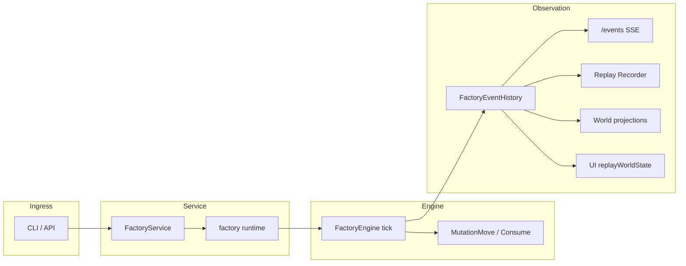

# Work, Session, and Runtime Event Feature Guide

---
author: Codex
last modified: 2026-05-31
doc-id: AGF-DEV-WSR-001
status: active
---

This document is the maintainer checklist for any feature that changes how **work
items** move through a **factory session**, how those changes appear on the
**canonical event stream**, or how **CLI / API / dashboard** surfaces observe
marking state.

Use it when implementing operator recovery, cascade failure visibility, new
submit paths, session-scoped runtime APIs, or dashboard position updates.
Reference PRDs:

- [`tasks/prd-work-manual-recovery.md`](../../../tasks/prd-work-manual-recovery.md) — operator `you work move`, `WORK_STATE_CHANGE` (`source: api` | `cli`)
- [`tasks/prd-cascading-failure-events.md`](../../../tasks/prd-cascading-failure-events.md) — cascade moves, same event type (`source: cascading-failure`)

For session route vocabulary, see
[`factory-session-api-cleanup-migration-guide.md`](factory-session-api-cleanup-migration-guide.md).
For record/replay semantics, see [`record-replay.md`](record-replay.md).

## Core invariant

**Marking mutations that customers should see must emit a canonical
`FactoryEvent` before fanout and replay persistence.**

Do not update `petri.Marking` alone. Until
[`prd-cascading-failure-events.md`](../../../tasks/prd-cascading-failure-events.md)
ships, `CascadingFailureSubsystem` still applies `MutationMove` without an event
(stale dashboard risk). New features must not add more invisible moves.

**Paused factory:** operator control (`POST …/move`, submit) may be allowed while
`PAUSED`; automatic subsystem ticks (dispatch, cascade, scheduling) must not
advance marking. Audit the engine tick loop when touching pause behavior.

## Pause policy and subsystem ticks

When `factoryImpl` sets `FactoryStatePaused`, the runtime wires
`engine.WithAutomaticTicksPaused` so `FactoryEngine.tick` returns immediately
without incrementing the tick counter or running subsystems. This freezes:

| TickGroup / subsystem | While `PAUSED` |
| --- | --- |
| Circuit breaker | No automatic tick |
| Dispatcher (scheduling, dispatches) | No automatic tick |
| History | No automatic tick |
| Transitioner | No automatic tick |
| Cascading failure | No automatic tick |
| Termination check | No automatic tick |

**Still allowed while paused:**

| Ingress | Path | Notes |
| --- | --- | --- |
| Operator move | `factoryImpl.MoveWork` → `FactoryEngine.MoveWork` | Synchronous `MutationMove`; records `WORK_STATE_CHANGE` when `source` is set |
| Work request submit | `SubmitWorkRequest` queues batches | Processing resumes on the next unpaused tick |

**Not subsystem ticks:** `MoveWork` does not call `tick`; it mutates marking under
the engine mutex directly. Pending worker results and queued submissions remain
buffered until automatic ticks resume (factory leaves `PAUSED`).

Regression coverage: `pkg/factory/engine/engine_tick_test.go` (paused skip),
`pkg/factory/runtime/factory_pause_tick_test.go` (cascade frozen, operator move works).

## End-to-end flow (reference)

## Checklist: adding a work-affecting feature

Complete every row that applies. Skip only with an explicit note in the PR.

### 1. Contract and API

- [ ] Add or extend OpenAPI schemas under `api/components/schemas/` (events,
  request/response bodies, parameters).
- [ ] Register routes on **both** default session and
  `factory-sessions/{session_id}/...` when the operation is runtime-scoped.
- [ ] Run `make verify-build-contracts`; commit generated
  `pkg/api/generated/` and `ui/src/api/generated/`.
- [ ] Update `pkg/api/contracttests/` (enum coverage, payload refs, sample events).
- [ ] Implement handlers in `pkg/api/handlers.go`; route through
  `pkg/service` / `apisurface` — avoid reaching into the engine from handlers
  directly except via existing runtime interfaces.

### 2. Service and session routing

- [ ] Add methods on `FactoryService` and session-scoped variants in
  `pkg/service/runtime_sessions.go` as needed.
- [ ] Return `apisurface.ErrFactorySessionNotFound` for unknown `session_id`
  (maps to HTTP 404).
- [ ] Preserve default compatibility session behavior for unscoped `/work` routes.

### 3. Engine and marking

- [ ] Validate against live marking: token exists, target place exists for work
  type, business rules (e.g. not in `ActiveDispatches`).
- [ ] Apply changes through `applyMutations` / existing mutation types in
  `pkg/factory/engine/mutations.go`.
- [ ] Prefer a dedicated subsystem or control hook with an explicit `TickGroup`
  over ad hoc mutation from API goroutines.
- [ ] Do not simulate worker completion with fake dispatch events.

### 4. Canonical events

- [ ] Add `FactoryEventType` enum value and payload schema.
- [ ] Implement `Record…` in `pkg/factory/events/event_history.go`.
- [ ] Set `FactoryEvent.context` (`workIds`, `requestId`, `traceIds`, `tick`,
  `sequence`, `eventTime` UTC).
- [ ] Set payload `source` (`cli`, `api`, `worker`, etc.).
- [ ] Wire recorder hook in `pkg/factory/runtime/factory.go` build options if
  a new callback is required.
- [ ] Confirm `SubscribeFactoryEvents` delivers the event in order.

### 5. Record and replay

- [ ] Events reach `WithFactoryEventRecorder` → `pkg/replay/recorder.go`.
- [ ] Add or extend replay test: artifact containing the new event replays to
  the expected marking / world projection.
- [ ] Document behavior in [`record-replay.md`](record-replay.md) if customer-
  visible artifact semantics change.

### 6. Backend projections

- [ ] Update `pkg/factory/projections/world_state.go` reducer (`apply*` for new
  event type).
- [ ] Confirm `ListWork` / `GetWork` handlers still match marking after the
  change (`pkg/api/handlers.go` `tokenToWork`).
- [ ] Add tests in `pkg/factory/projections/projectiontests/`.

### 7. UI projections

- [ ] Update `ui/src/features/timeline/state/timeline/replayWorldState.ts`
  `applyEvent` switch.
- [ ] Update `ui/src/api/events` constants if maintained separately from codegen.
- [ ] Fix dashboard / timeline / current-selection tests that build event fixtures.
- [ ] For UI-visible behavior: verify in browser (dev-browser skill).

### 8. CLI (if applicable)

- [ ] Implement in `pkg/cli/work/` (or `submit/`, `session/` as appropriate).
- [ ] Wire subcommand in `pkg/cli/root_work.go` when `root.go` is size-limited.
- [ ] Use `pkg/cli/sessionpath.ScopedPath`, `pkg/cli/clihttp`, `pkg/cli/clidiag`.
- [ ] Support global `--json` from root; no per-subcommand `--json`.
- [ ] Add `--session`; cross-link `you session list` in long help.
- [ ] httptest in package; optional `tests/functional/smoke/cli_*`.

### 9. Tests and verification

| Layer | Typical target |
| --- | --- |
| Unit | engine, event_history, projections, CLI package |
| API | `pkg/api/handlers_*_test.go`, session scoping |
| Functional | `tests/functional/` recovery or smoke |
| Contract | `pkg/api/contracttests/` |
| Aggregate | `make verify-pr` |

### 10. Documentation closeout (after code ships)

- [ ] Update this guide if the feature introduced a new seam or invariant.
- [ ] Add customer-facing notes only when user-visible (`docs/reference/`,
  `pkg/cli/docs/`).
- [ ] **AGENTS.md:** add a standards bullet linking this guide — done in the
  implementing PR's final story (see PRD US-011), not at PRD authoring time.

## Session-scoped routes (quick reference)

| Concern | Default session | Named session |
| --- | --- | --- |
| List work | `GET /work` | `GET /factory-sessions/{session_id}/work` |
| Get work | `GET /work/{id}` | `GET /factory-sessions/{session_id}/work/{id}` |
| Submit | `POST /work` | `POST /factory-sessions/{session_id}/work` |
| Events | `GET /events` | `GET /factory-sessions/{session_id}/events` |
| Move | `POST /work/{id}/move` | `POST /factory-sessions/{session_id}/work/{id}/move` |

Duplicate operator `requestId` → HTTP **409 Conflict** (no second mutation).

CLI: pass `--session <session_id>`; omit for default compatibility session.

## Event types and position today

| Event | Effect on work position |
| --- | --- |
| `WORK_REQUEST` | Places new work on initial place |
| `DISPATCH_REQUEST` | Removes token from place (consumed) |
| `DISPATCH_RESPONSE` | Adds output work to output places |
| `RELATIONSHIP_CHANGE_REQUEST` | Relations only; no place change |
| Cascading failure (subsystem) | `MutationMove` to FAILED — **no event today** (fix: [`prd-cascading-failure-events.md`](../../../tasks/prd-cascading-failure-events.md)) |
| `WORK_STATE_CHANGE` | Operator or cascade move between places; `source` distinguishes ingress |

Leaving **FAILED**: retain failure **history**; clear **guard-blocking** fields only
(shared helper between manual recovery and cascade PRDs).

## Common mistakes

| Mistake | Why it fails |
| --- | --- |
| Marking-only change | UI, SSE, replay, and remote CLI desync |
| Fake dispatch events | Corrupts trace drilldown and dispatch history |
| `WORK_REQUEST` for relocation | Wrong semantics; duplicates entry narrative |
| CLI bypasses HTTP/service | Skips session routing and recording |
| UI-only `replayWorldState` | Backend world view and `ListWork` stay stale |
| Forgetting session-scoped route | Named-session dashboards miss the operation |
| Moving in-flight work | Breaks active dispatch consumed-token contract |
| Subsystem tick while paused | Violates pause policy; use `WithAutomaticTicksPaused` gate |

## Relevant files (starting points)

| Area | Path |
| --- | --- |
| Event enum | `api/components/schemas/events/FactoryEventType.yaml` |
| Event history | `pkg/factory/events/event_history.go` |
| Engine | `pkg/factory/engine/engine.go`, `mutations.go`, `work_move.go` |
| Pause gate | `pkg/factory/engine/options.go` (`WithAutomaticTicksPaused`) |
| Cascading failure | `pkg/factory/subsystems/cascading_failure.go` |
| Runtime wiring | `pkg/factory/runtime/factory.go` |
| Service sessions | `pkg/service/runtime_sessions.go` |
| API handlers | `pkg/api/handlers_move.go` |
| Backend projection | `pkg/factory/projections/world_state.go` |
| UI projection | `ui/src/features/timeline/state/timeline/replayWorldState.ts` |
| CLI work | `pkg/cli/work/`, `pkg/cli/root_work.go` |
| Replay | `pkg/replay/recorder.go`, `pkg/service/factory_build.go` |
| Process map | `docs/internal/processes/development-guide-relevant-files.md` |

## Reviewer prompt

When reviewing a work/session/event PR, confirm:

1. A reviewer can trace ingress → engine mutation → event record → SSE → projection.
2. Session-scoped and default routes behave consistently.
3. Tests prove observable position change, not just helper existence.
4. No new invisible marking mutations without a tracked follow-up.
5. Pause-sensitive features respect `WithAutomaticTicksPaused` (no subsystem marking advances while `PAUSED`).
