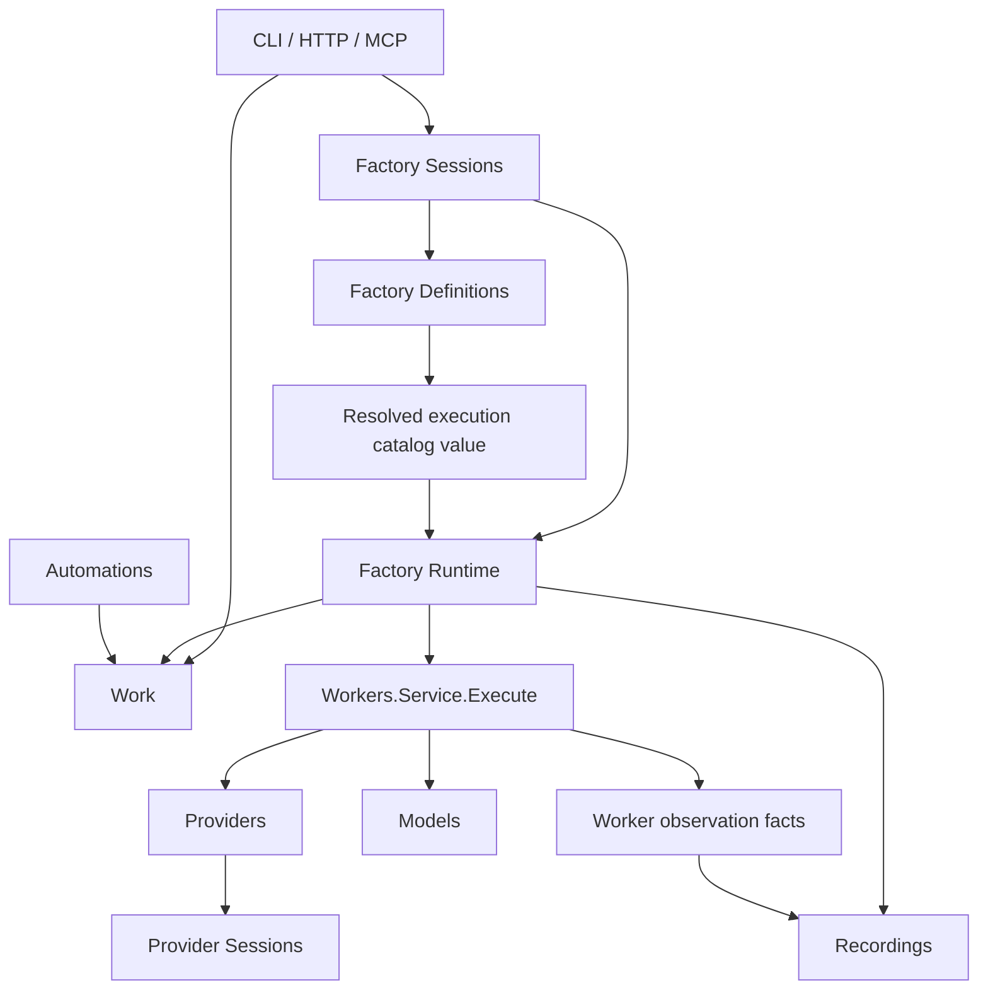
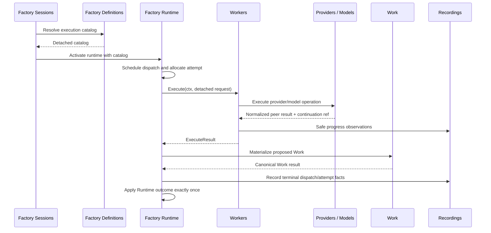

# Stateless Workers Execution Composition Plan

## Status

Proposed implementation plan for the Packaged Service Structure project.

This plan replaces the persistent Worker-runtime, executor-map, and Workstation-pool composition model with a stateless, request-scoped Workers execution service.

## Problem statement

Workers is physically closer to a packaged service, but the live composition graph still constructs session-bound Worker runtime objects. Factory Runtime receives concrete executors, Workers back-queries Factory Sessions for the Current Runtime, and Workstation pools split dispatch lifecycle and concurrency ownership across Runtime and Workers.

This creates five structural problems:

1. Workers is not stateless; it is reconstructed or decorated in a Factory Session context.
2. Factory Sessions and Workers depend on each other through `CurrentRuntimeResolver` and runtime-opening factories.
3. Factory Runtime receives executable implementation objects instead of calling the Workers root contract.
4. Workers calls multiple Factory Definitions policy interfaces at execution time instead of consuming resolved values.
5. Pool lifecycle, capacity, cancellation, retries, and result delivery have overlapping owners.

The intended product behavior does not require persistent Worker instances. A Worker execution is one attempt against an immutable execution specification. Persistent provider conversations, model runtimes, durable Factory Sessions, dispatch history, and Work state already have separate owners.

## Intended outcome

After this plan is complete:

- `workers.Service` is a process-scoped singleton with one request-scoped `Execute` operation.
- Factory Runtime owns all per-runtime and per-dispatch mutable state.
- Factory Definitions resolves authored configuration into an immutable execution catalog.
- Factory Runtime maps one selected catalog entry plus current Work into `workers.ExecuteRequest`.
- Workers selects a private runner, performs one attempt, and returns `workers.ExecuteResult`.
- Workers never queries Factory Sessions, Factory Runtime, or Factory Definitions for missing context.
- No caller receives a Runner, executor, binding, Workstation pool, or Worker instance.
- Provider Sessions and Models retain their own persistent state behind opaque references and root contracts.
- Hosted polling is owned by Automations and is not represented as a persistent Worker runner.

## Non-goals

This plan does not:

- Redesign authored Factory configuration syntax.
- Change customer-facing CLI, HTTP, MCP, or OpenAPI behavior unless contract characterization finds an unavoidable compatibility issue.
- Move Factory Runtime scheduling or Workstation capacity into Workers.
- Make Workers a durable dispatch ledger.
- Promise exactly-once external provider execution after a process crash.
- Create persistent in-memory Worker objects keyed by Factory Session.
- Introduce a generic plugin framework for runners.
- Rewrite all runner implementations in one change.
- Reorganize unrelated service roots.

## Design decisions

### D1. Workers is stateless across calls

Workers may retain immutable process-scoped dependencies and runner registrations. It may hold temporary request state while `Execute` is running. It must not retain Factory Session, Runtime, Workstation pool, dispatch, attempt, or provider-conversation state after the call returns.

### D2. Factory Runtime owns attempt lifecycle

Factory Runtime owns:

- Dispatch and attempt identity.
- Workstation/resource admission.
- Bounded concurrency.
- Active attempt cancellation functions.
- Work-level retry and outbox policy.
- Correlation of terminal results.
- Result application to Runtime state.

Workers does not expose pool lifecycle, queue state, dispatch cancellation methods, or result-stream lifecycle.

### D3. Cancellation uses the execution context

Factory Runtime starts `Execute` with an attempt-scoped context. Canceling the dispatch cancels that context. Workers propagates cancellation to Providers, Models, subprocesses, Worktree cleanup, and other request effects.

A separate Workers `CancelDispatch` method is prohibited unless a characterized external protocol cannot honor context cancellation. Adapter-specific cancellation remains behind Providers or a private runner.

### D4. Definitions and Workers exchange values through Runtime

Factory Definitions owns authored-policy interpretation. Workers owns execution request vocabulary. Neither service imports the other.

Factory Runtime calls Factory Definitions to obtain a detached execution catalog, stores it as immutable Runtime state, selects an entry for a dispatch, and maps that entry into `workers.ExecuteRequest`.

### D5. Work output is proposed, not canonical

Workers returns proposed output content and normalized execution facts. The Work service validates and materializes canonical Work. Factory Runtime applies the resulting Work and transition effects.

Workers does not construct canonical `FactoryWorkItem` values or Runtime token mutations.

### D6. Persistent provider state is opaque

Workers may receive and return a provider continuation reference. Provider Sessions or the external provider owns the underlying persistent state.

### D7. Hosted sources are Automations

Pollers, filesystem watchers, webhook listeners, and reconciliation loops are Automation sources that submit Work. They are not persistent Workers and are not implemented as a Workers runner.

## Target runtime shape

### Process-scoped services

The application process contains one instance of each service root:

| Service | Process-scoped responsibility |
|---|---|
| Factory Definitions | Load, validate, and resolve immutable Factory and execution definitions |
| Factory Sessions | Own customer-visible Factory Session lifecycle and durable session identity |
| Factory Runtime | Own mutable execution state, scheduling, dispatch lifecycle, and result application |
| Workers | Execute one stateless attempt from a complete request |
| Work | Admit, validate, materialize, and query canonical Work |
| Providers | Resolve provider identity and execute provider operations |
| Provider Sessions | Persist provider conversation/session lifecycle |
| Models | Own local model catalog, readiness, leases, and invocation |
| Recordings | Own canonical event durability and replay |
| Automations | Own persistent external-source lifecycle and submit Work |

### Per-Factory-Runtime state

Factory Runtime retains the mutable state associated with one activated runtime:

```go
type runtimeInstance struct {
	RuntimeID        string
	FactorySessionID string
	Generation       string

	Definition       ResolvedRuntimeDefinition
	ExecutionCatalog factorydefinitions.ResolvedExecutionCatalog

	OrchestrationState orchestration.Binding
	DispatchOutbox     dispatchplanning.Service
	ActiveAttempts     map[string]activeAttempt
}

type activeAttempt struct {
	DispatchID string
	AttemptID  string
	Cancel     context.CancelFunc
	StartedAt  time.Time
}
```

These are illustrative private shapes. They are not public contracts. The important invariant is that active-attempt and Runtime state live in Factory Runtime, not Workers.

### Process-scoped Workers state

The Workers implementation retains only immutable registrations and injected effects:

```go
type service struct {
	runners runners.Service
	clock   Clock
	effects executionEffects
}
```

It contains no Runtime ID map, Factory Session resolver, Workstation pool, executor map, or active dispatch registry.

### Request-scoped Workers state

During `Execute`, Workers may allocate:

- A private runner invocation.
- Rendered prompt and resolved environment values.
- A subprocess/provider/model call.
- Temporary files or a Worktree lease.
- Request-scoped progress and diagnostics.
- Cleanup functions.

All request state is released before `Execute` returns.

## Target dependency graph



Prohibited reverse edges:

- Workers must not depend on Factory Sessions.
- Workers must not depend on Factory Runtime.
- Workers must not depend on Factory Definitions policy services or mutable lookups.
- Providers must not implement a Workers-owned provider registry contract.
- Automations must not depend on Workers to host a poller lifecycle.

## Required contracts

### C1. Factory Definitions resolved execution catalog

Factory Definitions requires one root operation that resolves authored Worker and Workstation configuration into immutable execution values.

The final method may be part of the broader `ResolveInvocationDefinition` operation, but it must provide the following behavior:

```go
type ResolveExecutionCatalogRequest struct {
	EffectiveDefinition EffectiveFactoryDefinition
	Invocation          InvocationDefinitionContext
}

type ResolveExecutionCatalogResult struct {
	DefinitionVersion string
	Workers           map[string]ResolvedWorkerDefinition
	Workstations      map[string]ResolvedWorkstationDefinition
}
```

`ResolvedWorkerDefinition` contains authored-policy facts such as:

- Worker identity and type.
- Runner selection inputs.
- Provider and model references.
- Model operation bindings.
- Prompt/template policy.
- Tool policy.
- Output contract.
- Timeout and permission policy.
- Environment, working-directory, and Worktree templates.

`ResolvedWorkstationDefinition` contains:

- Workstation identity and type.
- Referenced Worker identity.
- Logical versus executable behavior.
- Execution/output/decision policy.
- Runtime scheduling/resource facts that Runtime needs.

Contract rules:

- Results are detached and deeply cloned.
- Results contain no service interfaces, functions, executors, runners, filesystems, providers, or model handles.
- Repeating the operation with equivalent inputs produces equivalent output.
- Structural/authored-policy errors are returned as typed Definition diagnostics.
- Factory Definitions does not import `pkg/services/workers`.

### C2. Workers root service

```go
type Service interface {
	Execute(
		context.Context,
		ExecuteRequest,
	) (ExecuteResult, error)
}
```

The Workers root declares no second named interface.

### C3. Workers execution request

```go
type ExecuteRequest struct {
	Correlation ExecutionCorrelation
	Target      ExecutionTarget
	Input       ExecutionInput
	Attempt     AttemptContext
}

type ExecutionCorrelation struct {
	FactorySessionID string
	RuntimeID        string
	DispatchID       string
	AttemptID        string
	RequestID        string
	TraceID          string
}

type ExecutionTarget struct {
	WorkerName      string
	WorkstationName string
	RunnerID        string

	Provider ProviderReference
	Model    ModelReference

	Prompt      PromptPolicy
	Tools       ToolPolicy
	Output      OutputPolicy
	Environment EnvironmentPolicy
	Workspace   WorkspacePolicy
	Permissions PermissionPolicy
	Timeout     time.Duration
}

type ExecutionInput struct {
	Work             []WorkInput
	Invocation       work.InvocationArguments
	ModelBindings    []ModelOperationBinding
	PreviousAttempts []AttemptSummary
	Resume           *ProviderContinuationRef
}
```

Contract rules:

- The request is complete and immutable for the lifetime of the call.
- Workers clones caller-owned slices/maps before mutation.
- No field contains `any` when a canonical typed value exists.
- No field contains Runtime tokens, colors, place IDs, markings, topology, transition objects, or mutable Runtime snapshots.
- No field contains Definition service interfaces or lookup objects.
- No field contains provider/model implementations or filesystem/process effects.
- Secrets are represented by references and resolved by the owning service; raw credentials are not carried in the request.

### C4. Work input

```go
type WorkInput struct {
	WorkID       string
	WorkTypeID   string
	RequestID    string
	Content      []work.WorkContentPart
	Tags         map[string]string
	Relations    []work.Relation
	Lineage      WorkLineage
	AttemptFacts AttemptFacts
}
```

`WorkInput` is the Worker-facing projection of canonical Work. Factory Runtime performs the projection from orchestration state. Work supplies canonical content and lineage vocabulary.

It intentionally excludes:

- Token ID.
- Place ID.
- Resource tokens.
- Marking history.
- Petri visit counters that are not explicit attempt facts.

If prior failures affect prompting or policy, Runtime projects them into `AttemptFacts` or `PreviousAttempts` using orchestration-neutral vocabulary.

### C5. Provider continuation reference

```go
type ProviderContinuationRef struct {
	Provider          string
	ProviderSessionID string
	ExternalRef       string
}
```

Contract rules:

- The reference is opaque to Runtime and Workers beyond correlation and forwarding.
- It contains no provider client, process handle, transcript, or mutable session object.
- Providers/Provider Sessions validates whether the reference can be resumed.
- Absence means a new provider operation.

### C6. Workers execution result

```go
type ExecuteResult struct {
	Correlation ExecutionCorrelation
	Outcome     ExecutionOutcome

	Output       ProposedOutput
	Failure      *ExecutionFailure
	Diagnostics  *SafeDiagnostics
	Metrics      ExecutionMetrics
	Continuation *ProviderContinuationRef
}

type ProposedOutput struct {
	Primary         []work.WorkContentPart
	Feedback        string
	Classification  string
	ProposedWork    []ProposedWork
	ArtifactRefs    []ArtifactRef
}
```

Required outcomes:

- `ACCEPTED`: the Worker produced an accepted business result.
- `CONTINUE`: the Worker produced partial progress requiring another Runtime decision.
- `REJECTED`: the Worker produced a valid negative business result.
- `FAILED`: execution failed and includes normalized failure facts.
- `CANCELED`: the attempt was canceled through its context.

Contract rules:

- Outcome does not name a Runtime arc or target state.
- `ProposedWork` is not canonical Work and has no Runtime token identity.
- Work validates and materializes proposed Work before Runtime applies it.
- Failure facts may contain a retry hint, but Runtime owns the retry decision.
- Provider continuation is detached and opaque.
- Diagnostics are safe for persistence and transport projection; unsafe raw prompts, environment values, credentials, and command stdin are excluded.

### C7. Execute error semantics

The result/error split must be deterministic:

- Validation failure before an attempt starts returns a typed error and no successful result.
- A started attempt should normally return a terminal `ExecuteResult`, including provider, model, command, timeout, and cancellation failures.
- Context cancellation before execution begins returns `context.Canceled` or `context.DeadlineExceeded`.
- Context cancellation after execution begins returns `OutcomeCanceled`; the implementation may also wrap the context error only where existing callers require it during migration.
- Panics are recovered inside Workers and normalized to `OutcomeFailed` with safe diagnostics.
- Runtime always records exactly one terminal attempt fact for an attempt that started.

### C8. Progress and observation

Live progress must not create a second Workers service interface or a Workers-to-Runtime construction cycle.

Target behavior:

- Workers emits detached `ExecutionObservation` values through an exact sink injected by `workers/wire`.
- The process composition adapter sends those observations to Recordings using the Recordings root.
- Observation values carry Factory Session, Runtime, dispatch, attempt, sequence, kind, timestamp, and safe payload facts.
- Terminal completion is still returned through `ExecuteResult`; it never depends solely on progress delivery.
- Observation delivery failure is surfaced through health/diagnostic policy characterized before cutover; it must not silently mutate the execution outcome.

The sink is a construction effect, not a peer-facing Workers service interface:

```go
type ObservationSink func(context.Context, ExecutionObservation) error
```

### C9. Factory Runtime active-attempt contract

Factory Runtime requires private operations to:

- Admit a scheduled dispatch under existing Runtime capacity/resource policy.
- Allocate an Attempt ID.
- Create and retain an attempt-scoped context/cancel function.
- Invoke `workers.Service.Execute`.
- Correlate the returned result.
- Record terminal execution facts.
- Ask Work to materialize proposed Work.
- Apply the resolved Runtime outcome exactly once.
- Remove the attempt from active state on every exit path.

These operations stay private to Factory Runtime. They are not new Workers methods.

## Explicit directional changes

| Current direction | Current behavior | Required target direction | Required change |
|---|---|---|---|
| Factory Sessions → Workers runtime factory | Sessions participates in constructing a session-bound `RuntimeService` | Factory Sessions → Factory Runtime | Sessions activates Runtime with resolved values; it never constructs Workers runtime instances |
| Workers → Factory Sessions | `CurrentRuntimeResolver.CurrentRuntime()` recovers config/context | No edge | Delete the resolver and pass all context in `ExecuteRequest` |
| Factory Runtime → Workers executors | Runtime receives `map[string]WorkerExecutor` | Factory Runtime → `workers.Service.Execute` | Runtime constructs detached requests and calls the root service |
| Factory Runtime → Workers pool boundary | Runtime creates/starts/stops `WorkstationPoolBoundary` | No pool edge | Runtime owns attempt concurrency and context cancellation |
| Workers → Factory Definitions policy interfaces | Workers calls interpolation, execution, and decision-envelope services | Factory Runtime → Factory Definitions values | Definitions resolves immutable catalog; Runtime maps selected values into Workers request |
| Factory Definitions → Workers types | Would couple Definitions to execution implementation vocabulary | No direct edge | Definitions publishes its own resolved values; Runtime owns mapping |
| Workers → Work materializer | Worker executor constructs/materializes canonical Work | Factory Runtime → Work | Workers returns proposals; Runtime requests Work materialization |
| Workers → Providers compatibility interface | Workers owns `Provider`/`ProviderRegistry` contracts | Workers → `providers.Service` | Move provider identity/catalog/execution authority to Providers root |
| Providers → Workers registry contract | Providers implements Workers-owned registry | No reverse ownership | Providers publishes its own root value contract consumed by Workers/Runtime |
| Workers → Provider Sessions metadata | Workers aliases or understands persistent provider session metadata | Providers → Provider Sessions | Workers carries only an opaque continuation reference |
| Workers → Models | Workers invokes model execution | Workers → `models.Service` | Retain, but only through Models root and only inside one Execute call |
| Workers → Recordings | Workers emits execution observations | Workers wire adapter → `recordings.Service` | Use one exact observation sink; do not expose Recordings implementation types |
| Factory Runtime → Recordings | Runtime records dispatch/attempt terminal facts | Factory Runtime → `recordings.Service` | Retain through Recordings root only |
| Automations → Workers poller | Poller Worker types enter executor construction | Automations → Work | Hosted sources submit Work; remove poller execution from Workers |
| CLI run → Workers mock loaders | CLI calls root parsing/loading helpers | CLI → Workers CLI adapter or private config loader | Keep flag parsing in CLI; move domain validation and runner selection behind owner boundary |
| `pkg/wire` → per-session Workers construction | Workers runtime is reconstructed/decorated during opening | `pkg/wire` → one `workers.Service` | Construct Workers once and inject the root into Factory Runtime composition |

## Target execution sequence



Factory Sessions may call Definitions directly during activation or may delegate that activation operation to Runtime, depending on the final Runtime root contract. In either case, Workers is not involved in activation and does not retain the catalog.

## Target package structure

```text
pkg/services/workers/
├── service.go                     # the only named root interface: Service
├── execution_contracts.go         # ExecuteRequest, ExecuteResult, values
├── diagnostics_contracts.go       # safe detached diagnostics values
├── observation_contracts.go       # detached execution observations
├── errors.go                      # typed root errors
│
├── wire/
│   ├── wire.go                    # constructs one process-scoped Service
│   └── observation.go             # binds exact observation effect
│
├── transports/
│   └── cli/                       # only if mock config remains Workers-owned
│
└── internal/
    ├── service/
    │   ├── service.go             # private root implementation
    │   ├── execute.go             # one-attempt orchestration
    │   ├── validation.go
    │   └── cleanup.go
    │
    ├── services/
    │   └── runners/
    │       ├── service.go         # one private runners.Service interface
    │       ├── wire/
    │       │   └── wire.go
    │       └── internal/
    │           ├── service/       # immutable registry + Execute dispatch
    │           ├── agent/
    │           ├── script/
    │           ├── inference/
    │           ├── process/
    │           └── testing/
    │
    ├── execution/                 # request-scoped execution helpers
    ├── prompting/                 # prompt rendering from resolved policy
    ├── worktree/                  # request-scoped Worktree preparation
    ├── diagnostics/               # safety/redaction/normalization
    ├── policy/                    # applies already-resolved execution policy
    └── testkit/                   # owner-private test support
```

Required deletions after cutover:

```text
pkg/services/workers/internal/services/runtime_assembly/
pkg/services/workers/internal/services/workstations/   # service/pool form
```

Useful request-scoped implementation code from `workstations` moves into the ordinary private packages shown above. The Workstation remains a Factory definition and Runtime scheduling concept; only the Workers pool service is deleted.

The final Workers root contains:

- Exactly one named interface, `Service`.
- No exported functions.
- Only detached request/result/error/value contracts.
- Only `wire`, `internal`, and `transports` child directories.

The final runners subservice root contains:

- Exactly one named interface, `runners.Service`.
- No exported implementation functions outside `wire` construction.
- Only `wire`, `internal`, and `transports` child directories.

## Migration stories

### WSE-01 — Resolve immutable execution policy

**Behavior outcome:** Activating a valid Factory produces a deterministic, detached execution catalog without constructing Workers, executors, Providers, Models, processes, or Workstation pools.

**Required work:**

- Add the Factory Definitions root operation or extend `ResolveInvocationDefinition` with the catalog result.
- Characterize current interpolation, output, decision-envelope, permissions, runner-selection, timeout, environment, and Worktree policy.
- Return detached values with typed diagnostics.
- Add the Runtime-side mapper from Definition catalog values to Workers execution values.

**Acceptance criteria:**

- Equivalent definitions resolve to equivalent catalogs.
- Mutating a returned map/slice does not mutate Definition service state.
- Invalid runner/provider/model/workstation references return typed diagnostics before execution starts.
- Resolution performs no process, provider, model, or Workers execution effect.
- Factory Definitions has no import of `pkg/services/workers`.
- Focused unit and contract tests pass.

**Depends on:** None.

### WSE-02 — Execute one stateless attempt through Workers root

**Behavior outcome:** A caller can execute one script, inference, or agent-shaped request through `workers.Service.Execute` and receive the same normalized outcome currently produced by the legacy execution path, without opening a Runtime or Factory Session.

**Required work:**

- Publish the root request/result/error contracts.
- Implement a compatibility adapter over the current canonical runner/executor behavior.
- Validate and clone the request at ingress.
- Normalize cancellation, timeout, panic, provider, model, and command failures.
- Emit safe observations through the injected observation sink.

**Acceptance criteria:**

- Service construction is inert.
- Each Execute call is isolated from preceding calls.
- Script, inference, and agent happy paths return correlated results.
- Cancellation terminates the underlying effect and releases request resources.
- A panic becomes one safe failed result rather than escaping.
- The service retains no Runtime, Factory Session, dispatch, or attempt state after return.
- Package integration tests and focused race tests pass.

**Depends on:** WSE-01 contract vocabulary may be developed in parallel, but Runtime cutover waits for both.

### WSE-03 — Runtime owns bounded execution lifecycle

**Behavior outcome:** Factory Runtime schedules, starts, cancels, correlates, and completes Worker attempts through `workers.Service.Execute` without constructing a Workers pool or executor map.

**Required work:**

- Add private Runtime active-attempt state.
- Map scheduled Work and the selected execution catalog entry into `ExecuteRequest`.
- Call Execute under Runtime-owned capacity and an attempt context.
- Correlate one terminal result and clean active state on every exit path.
- Preserve existing synchronous/inline test modes only as Runtime implementation policy, not Workers contract modes.

**Acceptance criteria:**

- Runtime never receives `WorkerExecutor`, `WorkstationRequestExecutor`, `Runner`, or `AssembledRuntimeBinding`.
- Runtime capacity prevents more attempts than admitted by existing scheduling/resource policy.
- Canceling a Runtime dispatch cancels its Execute context.
- Duplicate or late results cannot apply Runtime state twice.
- Completion, failure, cancellation, and timeout each produce one terminal attempt fact.
- Concurrency and cancellation race tests pass.

**Depends on:** WSE-01 and WSE-02.

### WSE-04 — Materialize Worker output through Work

**Behavior outcome:** Proposed output from Workers becomes canonical Work only after validation/materialization by the Work service, and Runtime applies only the materialized result.

**Required work:**

- Define proposed output and proposed Work values.
- Map legacy `RecordedOutputWork` behavior into proposals.
- Call Work materialization after Execute returns.
- Apply Runtime routing after materialization succeeds or fails according to characterized policy.

**Acceptance criteria:**

- Workers does not return canonical `FactoryWorkItem` values.
- Invalid proposed Work is rejected by Work and cannot enter Runtime state.
- Canonical Work identity and lineage remain Work-owned.
- Accepted, continued, rejected, and failed outcomes preserve existing customer behavior.
- Focused Work/Runtime integration and replay tests pass.

**Depends on:** WSE-03.

### WSE-05 — Remove Factory Sessions back-query and per-session Workers construction

**Behavior outcome:** Starting or replacing a Factory Session does not construct, mutate, or decorate a Workers runtime; Workers receives all required context only when Runtime calls Execute.

**Required work:**

- Remove `CurrentRuntimeResolver` from Workers.
- Remove workflow-context recovery from `FactorySessions.LiveRuntime`.
- Remove per-session `NewRuntimeWithSelection` factories.
- Construct one Workers root in `pkg/wire` and inject it into Factory Runtime composition.
- Pass session/runtime/generation identity explicitly in requests.

**Acceptance criteria:**

- Workers production code has no Factory Sessions import.
- Opening, replacing, pausing, or stopping a Factory Session does not mutate Workers service state.
- Two concurrent Factory Sessions execute isolated requests through the same Workers service.
- Process construction remains inert until Runtime starts an Execute call.
- Functional proof uses `root.BuildProcess`, `Process.Execute`, and `edges.Edges`.

**Depends on:** WSE-03.

### WSE-06 — Converge private runners

**Behavior outcome:** Agent, script, inference, and mock attempts all execute through one private immutable runner registry and the same Workers root behavior.

**Required work:**

- Move the public Runner contract into the private runners subservice.
- Route each strategy through `runners.Service.Execute`.
- Preserve process cleanup, provider/model failures, progress, diagnostics, Worktree behavior, and output normalization.
- Retire legacy strategy-specific factories and direct invocation façades after parity.

**Acceptance criteria:**

- Every supported strategy passes the shared runner conformance suite.
- Selecting a runner performs no execution or prerequisite side effect.
- Agent uses Providers root; inference uses Models root; script uses injected process effects.
- Mock behavior is confined to Workers mock feature paths and does not become a second production graph.
- No peer imports a private runner package.

**Depends on:** WSE-02; deletion waits for WSE-05.

### WSE-07 — Correct provider ownership and continuation

**Behavior outcome:** Workers resolves and invokes providers through Providers-owned root contracts and can resume provider work using opaque continuation references without owning Provider Session state.

**Required work:**

- Move provider registry/identity contracts to Providers.
- Retarget Workers selection and preflight to Providers root values.
- Replace full Provider Session metadata coupling with the minimal continuation reference.
- Preserve provider aliases, prerequisite errors, cancellation, and normalized diagnostics.

**Acceptance criteria:**

- Providers no longer implements an interface declared by Workers.
- Workers has no provider client or session object in a public contract.
- Resume succeeds or fails through Providers/Provider Sessions authority.
- Provider identity and prerequisite behavior remains equivalent.
- Provider failure and cancellation integration tests pass.

**Depends on:** WSE-02; may proceed alongside WSE-03.

### WSE-08 — Move hosted sources to Automations

**Behavior outcome:** A hosted poller produces Work through Automations and never enters Workers executor construction as a persistent Worker type.

**Required work:**

- Move HTTP, clock, secret, and runtime-path poller effects to Automations/platform boundaries.
- Submit hosted-source outputs through Work.
- Remove poller recognition and `NoopExecutor` fallback from Workers.
- Update Definition validation to reject or reinterpret obsolete hosted Worker execution shapes according to compatibility policy.

**Acceptance criteria:**

- Hosted source lifecycle is started/stopped only by Automations/initializer ownership.
- Poll output becomes a normal Work Request.
- Workers never creates a poller executor.
- No valid poller path silently returns accepted without doing work.
- Hosted-source functional tests prove inert construction and lifecycle activation through `root.BuildProcess`.

**Depends on:** Can proceed separately after compatibility behavior is decided; deletion must precede final Workers closure.

### WSE-09 — Delete pool and runtime assembly architecture

**Behavior outcome:** All live execution uses request-scoped Execute; no production path can construct a Workers Runtime, executable binding map, or Workstation pool.

**Required work:**

- Delete `RuntimeService` and legacy runtime construction helpers.
- Delete `BuildRuntimeExecutors`.
- Delete `BuildRuntime`, `AssembledRuntimeBinding`, pool lifecycle contracts, and `WorkstationPoolBoundary`.
- Move useful request-scoped Workstation implementation into private ordinary packages.
- Delete `internal/services/runtime_assembly` and the Workstation pool service after consumers are gone.

**Acceptance criteria:**

- Production search finds no executor map crossing Workers/Runtime boundaries.
- Production search finds no Workers pool start/stop lifecycle.
- Runtime behavior remains correct for concurrent, canceled, failed, and successful dispatches.
- No compatibility shim recreates a persistent Worker instance under a new name.
- Package, race, and functional tests pass.

**Depends on:** WSE-03, WSE-05, WSE-06, and WSE-07.

### WSE-10 — Seal root and target package structure

**Behavior outcome:** Workers is mechanically enforced as a packaged stateless service and deleted structures cannot return.

**Required work:**

- Reduce the root to one `Service` interface and detached values.
- Move exported helpers behind internal/wire/transports.
- Collapse runners to its target packaged subservice shape.
- Remove stale compatibility aliases and test helper packages.
- Lower package-structure, ownership, target-manifest, coverage, and file-count baselines.
- Add dependency-direction and forbidden-type gates.

**Acceptance criteria:**

- Workers root has exactly one named interface and no exported functions.
- Workers root child directories are only `wire`, `internal`, and `transports` when present.
- Runners subservice has exactly one named interface and only allowed child directories.
- No peer imports Workers internal packages.
- Static gates reject Factory Sessions imports, executor-bearing root values, pools, Runtime tokens, and Definition service ports in Workers.
- `make pkg-structure`, ownership checks, package boundary checks, file-count checks, lint, and required CI pass.

**Depends on:** WSE-09 and WSE-08.

## Sequencing and PR boundaries

Recommended implementation order:

1. WSE-01 — immutable execution catalog.
2. WSE-02 — stateless Execute contract and adapter.
3. WSE-03 — Runtime cutover.
4. WSE-04 — Work materialization boundary.
5. WSE-05 — Sessions/composition decoupling.
6. WSE-06 and WSE-07 — runner and provider convergence, in parallel where path leases permit.
7. WSE-08 — hosted-source ownership cut, independently where compatibility permits.
8. WSE-09 — deletion of pools/runtime assembly.
9. WSE-10 — root/package closure and baseline reduction.

Do not start with broad directory movement. Package movement before WSE-03 and WSE-05 would preserve the wrong persistent composition in a cleaner location and increase churn.

Each story should normally ship as an independently reviewable PR. WSE-03 may require a small sequence of PRs divided by Petri/JavaScript Runtime call path only if each PR preserves one canonical execution authority and does not introduce a second lasting adapter graph.

## Verification strategy

### Unit tests

- Definition execution-catalog determinism and cloning.
- Execute request validation and cloning.
- Definition-to-Workers mapping.
- Failure normalization and safe diagnostics.
- Proposed Work mapping.
- Runner selection without side effects.

### Package integration tests

- Workers Execute with script, inference, agent, and mock runners.
- Runtime attempt lifecycle with success, failure, timeout, cancellation, and panic.
- Work materialization after proposed output.
- Provider continuation and resume behavior.
- Observation delivery with safe payloads.

### Race and stress tests

- Concurrent Factory Sessions using one Workers service.
- Runtime active-attempt add/cancel/complete races.
- Cancellation versus terminal completion.
- Provider result versus timeout.
- No leaked goroutines, processes, temporary resources, or active-attempt entries.
- Capacity remains bounded by Runtime and peer-service limits.

### Functional tests

- Construct through `root.BuildProcess`.
- Execute through `Process.Execute`.
- Replace effects only through `edges.Edges`.
- Prefer real runner behavior through mocked command edges over `MockWorkers`, except in `tests/functional/workers/mock`.
- Prove process construction is inert.
- Prove two Factory Sessions share the Workers singleton without sharing execution state.
- Prove canceling one session's dispatch does not affect another.
- Prove hosted polling enters through Automations and Work, not Workers construction.

### Static and structural gates

- Forbid Workers production imports of Factory Sessions.
- Forbid Workers root contracts containing Runtime token/place/net/marking types.
- Forbid exported executor/runner interfaces at Workers root.
- Forbid pool lifecycle contracts and `AssembledRuntimeBinding` after deletion.
- Forbid Factory Definitions imports of Workers.
- Require Workers/Runtime peer calls through root contracts only.
- Require packaged root/subservice shape.

### Expected commands

Choose the narrowest relevant set for each story, then broaden before merge:

- Focused `go test` for changed packages.
- Focused `go test -race` for Runtime/Workers concurrency changes.
- `make pkg-structure` and ownership/package-boundary checks.
- `make pkg-file-count`.
- `make verify-fast` during iteration.
- `make verify-pr` before merge for shared Runtime/Workers/Definitions changes.
- Focused functional Workers/Runtime/Automations suites where behavior changes.

No OpenAPI regeneration is expected unless implementation reveals an intentional public schema change. If a public schema changes, author it under `api/components`, run `make generate-api`, update all generated clients/mappers, and run the relevant API contract and smoke checks.

## Delivery boundary

No story is complete merely because code is written, a PR is opened, or local tests pass.

For every story, implementation and review must continue until:

- Required CI is terminal and passing.
- Every blocking PR conversation is explicitly addressed.
- Merge conflicts and shared-file/baseline churn are resolved.
- Required architecture and behavior evidence is present.
- The PR is actually merged.

The project is complete only after WSE-10 is merged and the completion invariants below are true in the live repository.

## Completion invariants

- `workers.Service` has one method: request-scoped `Execute`.
- Workers is constructed once per process and remains inert until Execute.
- Workers retains no Factory Session, Runtime, Workstation pool, dispatch, attempt, or provider-session object state across calls.
- Factory Runtime owns active attempts, capacity, cancellation, retry, correlation, and result application.
- Factory Sessions does not construct or mutate Workers.
- Workers does not import Factory Sessions, Factory Runtime, or Factory Definitions policy ports.
- Factory Definitions and Workers do not import each other.
- Runtime maps detached Definition values into detached Workers values.
- Runtime tokens, places, markings, nets, and executor objects do not cross the Workers root.
- Workers returns proposed output; Work owns canonical materialization.
- Workers uses Providers and Models only through their root services.
- Provider continuation is opaque and Provider Sessions-owned.
- Hosted polling is Automations-owned and enters execution as Work.
- Agent, script, inference, and mock execution share one private runner service.
- No Workstation pool, RuntimeService, BuildRuntime, BuildRuntimeExecutors, or AssembledRuntimeBinding production path remains.
- Root and runners package shapes satisfy the packaged-service standard without baseline exceptions.
