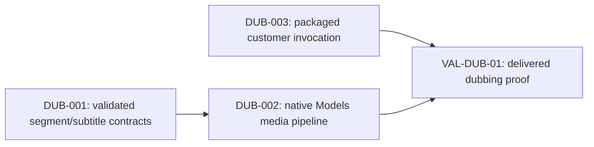

# Video dubbing packaged factory

## 1. Problem and desired outcome

### Problem statement

A customer needs to translate a video's speech into another language while
retaining aligned segments, speaker reference audio, and inspectable subtitles.

### Current behavior and gap

Models can transcribe video audio and invoke LLM and TTS operations independently.
There is no packaged Factory that preserves segment correspondence across these
operations and produces a playable dubbed video and subtitle artifacts.

### Desired outcome and success measures

`you run --named @you/dub-video --video demo.mp4 --language zh-CN --output-video
video-dubbed.mp4` returns one JSON result naming an existing video, saved ASR
result, validated translations, SRT, and ASS. Translation retains every source
segment ID exactly once; synthesis uses each segment's original audio and text
as its voice reference. Failure prevents publication of a successful result.

## 2. Scope and constraints

### In scope

- Four ordinary Factory workstations: transcription, translation, synthesis,
  and rendering, with durable intermediate artifacts.
- Segment validation, subtitles, reference-conditioned speech, and MP4/MKV
  output. Caller paths may be relative or absolute.
- Optional supplied ASS subtitles and configurable ASR, LLM, TTS models and
  Models HTTP server for TTS.
- Optional operator glossary to retain source proper names verbatim.

### Non-goals

Speaker diarization, arbitrary speaker impersonation controls, background music
separation, automatic remote services, and new runtime or model-host APIs.

### Assumptions and constraints

Python 3.10 or newer, `you`, `ffmpeg`, and `ffprobe` are installed on PATH.
Selected models are configured and support the requested operations; the TTS
model must accept reference audio and reference text. Workers have a 20-minute
execution timeout. There is no fixed input byte, output byte, or token ceiling
introduced by this Factory. Hardware and selected model context limits still
apply. Windows uses the ordinary `python` executable.

### Open questions

The native Windows reference-conditioned TTS backend and its CUDA distribution
have been validated on an RTX 4090. Other GPU architectures and clean-room
installation remain unproven. A configured Models HTTP endpoint can also supply
that capability; the Factory never provisions a separate server. Supplied ASS
preservation and cancellation still need delivered-journey validation.

### Replanning triggers

Replan if the chosen TTS backend cannot condition on both source audio and text,
if subtitles cannot preserve segment timing, or if packaged script resolution
does not retain caller path semantics. Do not claim voice preservation from an
unconditioned fallback.

## 3. Recommended approach

Package four SCRIPT_WORKER stages that invoke one Python driver and the canonical
Models CLI. Validate translated segment identities before synthesis and produce
subtitles from the validated timeline. Three implementation deployments own the
stage driver, pure segment/subtitle contracts, and packaged Factory/plan; the
delivery owner runs integrated validation and generation afterward.

### Decision record

| Option | Decision | Evidence and tradeoff |
| --- | --- | --- |
| Script workstations over Models CLI | Adopt | Existing SCRIPT_WORKER argument vectors and Models file inputs cover the effects without changing runtime state. |
| A dedicated dubbing runtime/model host | Reject | Existing Models operations and ffmpeg provide the required effects; another lifecycle would duplicate ownership. |

## 4. Customer behavior

### Actors, roles, and permissions

The local operator selects a readable video, target language, writable output,
and configured models. Local OS permissions govern reads, model cache access,
and writes. The customer is responsible for authorized use of source voices.

### User journey and states

The default language is `zh-CN`. Required video/output arguments are validated
before media/model effects. Running stages appear as ordinary Work and dispatch
progress; empty audio or no valid speech segments produces a failure. Success
returns artifact paths; model failures, missing dependencies, invalid translation,
or rendering errors enter the failed Work state and retain completed diagnostics
and artifacts. Permission errors name the failed operation and submitted path.

### Accessibility, localization, and visual references

The CLI is keyboard-driven and exposes text/JSON output; no UI focus or layout
changes are needed. Subtitles and manifests use UTF-8, and Chinese text must
survive ASR/translation/TTS/subtitle rendering without lossy conversion. No visual
reference is required for this CLI/media feature.

## 5. Contracts and data

### Contract inventory

| Contract | Authored source | Classification | Consumers |
| --- | --- | --- | --- |
| Factory invocation and workstations | `packages/packaged-factories/factories/dub-video/factory.yaml` | Additive | Named Factory CLI and packaged catalog |
| Stage argument grammar and result | `packages/packaged-factories/factories/dub-video/scripts/dub_video.py` | Additive | Script workers and operators |
| Segment validation/subtitles | `packages/packaged-factories/factories/dub-video/scripts/dub_contract.py` | Additive | Driver and artifact consumers |
| Models HTTP/CLI operations, Factory Events | Existing contracts | Unchanged | Driver and runtime |

### Factory invocation

Authored source: `packages/packaged-factories/factories/dub-video/factory.yaml`.

Current:

```yaml
# Not present
```

Proposed:

```yaml
name: "@you/dub-video"
invocationReturn:
  policy: EXPLICIT
  workTypeName: video-dub
  terminalState: complete
invocationSignature:
  unknownNamedArgumentPolicy: REJECT
  outputContract:
    mode: JSON
    contentType: application/json
  parameters:
    - {name: video, externalName: video, typeHint: FILE_PATH, required: true, bindings: [{kind: NAMED}]}
    - {name: language, externalName: language, defaultValue: zh-CN, bindings: [{kind: NAMED}]}
    - {name: output, externalName: output-video, typeHint: FILE_PATH, required: true, bindings: [{kind: NAMED}]}
    - {name: asrModel, externalName: asr-model, defaultValue: asr, bindings: [{kind: NAMED}]}
    - {name: llmModel, externalName: llm-model, defaultValue: llm, bindings: [{kind: NAMED}]}
    - {name: ttsModel, externalName: tts-model, defaultValue: qwen3-tts-base, bindings: [{kind: NAMED}]}
    - {name: ttsServer, externalName: tts-server, defaultValues: [""], bindings: [{kind: NAMED}]}
    - {name: subtitles, externalName: subtitles, typeHint: FILE_PATH, defaultValues: [""], bindings: [{kind: NAMED}]}
```

This adds a named Factory and changes no existing invocation. Packaging owners
regenerate the catalog/distribution only after scripts are complete. Removing
the package/catalog entry rolls back discovery; saved customer artifacts remain.

### Stage and final result grammar

Authored source: `packages/packaged-factories/factories/dub-video/scripts/dub_video.py`.

Current:

```text
# Not present
```

Proposed:

```text
python scripts/dub_video.py transcribe --video demo.mp4 --language zh-CN --output video-dubbed.mp4 --asr-model asr --llm-model llm --tts-model qwen3-tts-base --tts-server "" --subtitles ""
python scripts/dub_video.py translate --manifest ABSOLUTE_MANIFEST_PATH
python scripts/dub_video.py synthesize --manifest ABSOLUTE_MANIFEST_PATH
python scripts/dub_video.py render --manifest ABSOLUTE_MANIFEST_PATH
```

The first three stages print only the absolute manifest path, with one trailing
newline; its Work payload becomes the next stage's `--manifest` argument.
Rendering prints only the final JSON object. Operational messages go to stderr;
nonzero exit fails the workstation. Invocation uses argument vectors, never
shell interpolation. Manifest implementation details belong to the driver and
are not a second runtime state graph.

Current final result:

```json
# Not present
```

Proposed final result:

```json
{"video":"C:/output/video-dubbed.mp4","asr":"C:/output/artifacts/asr.json","transcript":"C:/output/artifacts/transcript.txt","translations":"C:/output/artifacts/translations.json","srt":"C:/output/artifacts/subtitles.srt","ass":"C:/output/artifacts/subtitles.ass","generated_ass":"C:/output/artifacts/subtitles.ass","language":"zh-CN","manifest":"C:/output/artifacts/manifest.json"}
```

The six core fields (`video`, `asr`, `translations`, `srt`, `ass`, `language`)
are required strings; additional fields are allowed. The driver also returns
`transcript`, `generated_ass`, and `manifest`; every path identifies a completed
artifact. `ass` names supplied ASS when selected; `generated_ass` always names
the subtitles derived from validated translated segments.
The Current marker denotes an absent contract, rather than a JSON payload.
There is no migration for earlier customer results.

### Persisted records and generated artifacts

Authored source: `packages/packaged-factories/factories/dub-video/scripts/dub_contract.py`.

Current:

```json
# Not present
```

Proposed translation response:

```json
{"language":"zh-CN","segments":[{"id":0,"text":"大家好"}]}
```

The object permits only `language` and `segments`; each segment permits only
integer `id` and nonempty `text`. Count, ID order, and language must match the
source exactly. Source ASR segments require unique nonnegative integer IDs,
integer millisecond `start`/`end`, nonempty text, ordered nonoverlapping timing,
and bounds within the video duration. Normalized translations copy the original
timing and add `source_text`. No model-supplied timestamp is accepted. Chinese
validation rejects Latin prose while allowing unchanged capitalized names and
acronyms; that heuristic does not establish semantic translation correctness.
These contracts are additive and require no generated API/client migration.

The driver saves raw ASR, source segments/transcript, translation request/result,
validated translations, reference audio, synthesized segment audio, subtitles,
and a stage manifest under the output artifact directory. Atomic stage manifest
updates happen only after stage validation. Artifacts survive failure for
inspection; no automatic retry overwrites validated content. Exact manifest
fields are owned by the stage driver and must be documented beside that source.
Generated packaged catalogs, embedded Factory assets, and distribution output
are refreshed by the delivery owner. OpenAPI and generated clients are unchanged.

## 6. Architecture and state

Current flow: separate Models ASR/LLM/TTS invocations produce independent outputs.
Target flow: `init -> transcribed -> translated -> synthesized -> complete`;
every workstation also routes to `failed`. Factory Events remain canonical for
Work/dispatch state; artifact manifests contain file references and stage data.
The runtime schedules scripts, Models owns inference/hosts, and ffmpeg owns media
effects. No new runtime opener, adapter, lifecycle registry, or secondary graph
is introduced. The packaged driver owns all new temporary files and removes
unfinished final media on render failure; no legacy path needs deprecation.

## 7. Failure modes and quality attributes

| Case | Detection | Customer outcome | Recovery | Evidence |
| --- | --- | --- | --- | --- |
| Missing source/dependency or permissions | Preflight/file operation | Failed Work and actionable stderr | Correct path/install and rerun | Public invalid-input witness |
| No speech/invalid timing | ASR segment validation | Failure before translation | Inspect saved ASR | Pure validation tests |
| Missing/duplicate/unknown translation IDs | Strict contract validation | Failure before TTS | Inspect translation response | Contract tests |
| TTS lacks references or fails | Capability/CLI error | Failed Work, no successful video | Configure model/server | Controlled and real reference-TTS witnesses |
| Invalid model-proposed filename | Artifact path confinement | Rejected response | Inspect preserved response | Traversal and absolute-path tests |
| ffmpeg fails or cancellation | Exit status/context | No finalized output success | Keep stage artifacts and rerun | Compiled integration cleanup witness |

### Performance, reliability, cost, and observability

One stage is dispatched at a time for each Work item; segment synthesis consumes
the configured model rather than starting another backend. Each dispatch has a
20-minute timeout; there is no arbitrary byte/token limit. Model call count is
recorded from real invocations, with one reference-conditioned TTS call per
validated segment. Stage failures retain manifests and artifact evidence.
Privacy: local media stays local unless the customer selects a remote Models
server; secrets and raw media never enter operational logs. Input strings are
passed as argv; all model-proposed filenames remain inside the artifact root.

## 8. Rollout, compatibility, and rollback

Ship the authored Factory and scripts together after validation, then refresh
generated distribution/catalog assets and customer docs. No feature flag or
compatibility interval is required for this additive package. Stop release if
voice references are ignored, segment correspondence changes, or final media is
invalid. Revert package/catalog/doc additions to roll back availability while
retaining customer-owned artifacts. Delivery owns cleanup and catalog refresh.

## 9. Implementation strategy

BEH-DUB-01 is one end-to-end customer behavior. Existing ASR/Models and script
runner behavior supplies the executable spine; characterize reference-conditioned
TTS before claiming real-media completion. Driver and pure validation work can
proceed concurrently, with the delivery owner controlling shared manifest shape.
No horizontal runtime work or migration is planned.

## 10. Verification strategy

| Behavior/gate | Scope/fidelity | Cadence/cost | Proves | Does not prove |
| --- | --- | --- | --- | --- |
| Segment/translation/subtitle validation | Unit, pure fixtures | Each change, no model calls | Exact IDs/timing/escaping | Model/media fidelity |
| Named Factory stages | Functional, public root with controlled effects | PR, no paid calls | Work states, arguments, output contract | Installed executable/media |
| Delivered dubbing journey | Integration, prebuilt you/Python/ffmpeg | Focused PR, one short clip | Real invocation and playable media | Unlimited duration/performance |
| Real reference-conditioned TTS | Local real selected backend | Before release, one short authorized clip | Backend accepts and uses references | All models/voices/languages |
| Packaged source/catalog checks | Static | Before delivery | Generation consistency | Inference correctness |

Functional cases: happy four-stage completion; missing input; invalid translation
IDs; unconditioned TTS rejection; failed renderer; cancellation. Use shared public
`root.BuildProcess` + `Process.Execute`, controlled effects, parallel independent
Factory Sessions and temp directories. OS/Python/ffmpeg processes belong to the
small prebuilt-deliverable integration lane. Driver validator unit tests call
pure contracts. No load/stress suite is introduced.

Paid validation is not required. Real validation uses one short source clip,
one ASR call, and one TTS call per source segment. Translation processes batches
of up to 64 segments, with at most three translation attempts per batch; each
structurally valid attempt adds a separate model audit call. Retain each raw
audit and feed rejection issues into the next translation attempt;
cache evidence by source digest, language, model/backend revisions, and script
revision. Native Windows CUDA reference conditioning and the first complete
named Factory MP4 journey passed. Remaining delivered edges include clean-room
installation, supplied ASS/MKV fidelity, cancellation, and perceived translation
and voice quality; these belong to VAL-DUB-01.

## 11. Task dependency graph



## 12. Tasks

### DUB-001 — Preserve source segment correspondence

**Parent behavior:** BEH-DUB-01, aligned translated speech and subtitles.
**Problem:** Translation can omit, duplicate, or alter source segment identities.
**Outcome:** Pure segment/translation validation and SRT/ASS generation.
**Plan reference:** This plan, sections 5 and 10.
**Actor and trigger:** Driver receives raw ASR and translated segment data.
**Dependencies:** None.
**Parallel and shared-surface ownership:** Contract agent owns `dub_contract.py`;
delivery owns the shared manifest shape and integration.
**Scope:** In: IDs, timing, text, escaping, output paths. Out: model/media effects.
**Implementation constraints:** UTF-8; no guessed segments or filename traversal.
**Contract excerpts:** Additive segment contract; exact schema and valid examples
must be recorded beside `dub_contract.py` before driver integration.
**Acceptance criteria:** Every source ID appears once; missing/unknown/duplicate
IDs fail; subtitles retain validated timing and text.
**Verification:** Unit pure fixtures; extends spine; cannot prove model fidelity.
**Paid validation:** None.
**Operational notes:** Invalid responses remain inspectable in driver artifacts.
**Escalation:** Report unsupported ASR shapes with evidence before broadening.

### DUB-002 — Produce reference-conditioned dubbed media

**Parent behavior:** BEH-DUB-01, playable target-language video.
**Problem:** Independent model outputs do not create an aligned dubbed artifact.
**Outcome:** Native Models CLI and ffmpeg driver with four stage commands.
**Plan reference:** This plan, sections 5–7.
**Actor and trigger:** Factory worker executes one named driver stage.
**Dependencies:** DUB-001 for translation/synthesis/render validation.
**Parallel and shared-surface ownership:** Delivery owns driver and manifest;
contract agent owns pure validation. Stage grammar is section 5's proposed shape.
**Scope:** In: saved ASR, translation, source references, TTS, render. Out: hosts.
**Implementation constraints:** argv subprocess calls; no fixed byte cap; source
audio and source text supplied for each segment; no unconditioned fallback.
**Acceptance criteria:** MP4 contains dubbed speech and soft mov_text subtitles,
with generated ASS retained as a sidecar;
MKV preserves source video with native ASS; failed stages emit no success result.
**Verification:** Pure/controlled driver tests plus one prebuilt real-media journey;
extends spine; cannot prove every TTS model. VAL-DUB-01 owns backend capability.
**Paid validation:** None; use local/configured backend and one short clip.
**Operational notes:** Stage manifest commits follow validation, stderr diagnostics.
**Escalation:** Report missing reference-TTS capability instead of claiming completion.

### DUB-003 — Expose the packaged Factory invocation

**Parent behavior:** BEH-DUB-01, one named customer command.
**Problem:** Customers lack a reusable four-stage Factory entry point.
**Outcome:** Authored Factory, plan, generated package assets, and invocation docs.
**Plan reference:** This plan, sections 5, 8, and 10.
**Actor and trigger:** Operator runs the proposed named Factory command.
**Dependencies:** Driver stage grammar finalized; generation waits for DUB-002.
**Parallel and shared-surface ownership:** Factory agent owns YAML/plan; delivery
owns catalog/distribution generation and docs after scripts stabilize.
**Scope:** In: parameters, Work states, failure routes, JSON return. Out: runtime.
**Implementation constraints:** Existing SCRIPT_WORKER/SCRIPT_RUN contracts;
`scripts/` resolution uses canonical selected Factory directory.
**Contract excerpts:** Current/Proposed Factory and CLI blocks in section 5.
**Acceptance criteria:** Required arguments/defaults bind exactly; each stage
receives the prior manifest path; all failures enter failed Work; complete emits
the six required JSON result fields, with additional artifact metadata allowed.
**Verification:** Public root functional journey, packaged source checks, and
delivered integration; establishes customer spine. No paid calls required.
**Operational notes:** Additive rollout and package/catalog revert per section 8.
**Escalation:** Report packaged resolution or parameter-binding mismatch first.

## 13. Project acceptance criteria

- [x] One named command returns the six required finalized result fields and
  additional artifact metadata for a short video.
- [x] Every translated segment matches a source ID and preserves its timeline.
- [x] Real TTS proves per-segment reference audio/text conditioning.
- [ ] SRT, ASS, MP4, and MKV retain UTF-8 target-language text and valid media.
- [ ] Failure/cancellation preserves diagnostics and avoids false successful video.
- [ ] Package generation, focused tests, and required CI gates pass.
- [ ] Clean-room prebuilt-deliverable validation records model/backend revisions.
- [ ] Implementation head is pushed, PR is open, CI has started, and blocking
  feedback is resolved; review owns terminal CI and merge.

## 14. References

- `factory/docs/standards/planning-standards.md`: planning and contract shapes.
- `factory/docs/standards/testing-standards.md`: public boundaries and OS fidelity.
- `docs/architecture/data-model.md`: customer Work/Factory terminology.
- `packages/packaged-factories/factories/full-flow/factory.yaml`: script workers.
- `packages/packaged-factories/factories/tts/factory.yaml`: canonical Models use.
- `packages/packaged-factories/factories/dub-video/factory.yaml`: authored invocation.

## Native Windows Models validation — 2026-10-01

The canonical builtin `qwen3-tts-base` invocation completed with the installed
Models implementation, an original source-video reference WAV, English
`ref_text`, Chinese target text, and `language=Chinese`. The operator model
override used for initial diagnosis was removed before the builtin proof; the
remaining operator settings were preserved. Models downloaded the two pinned
Hugging Face files into its ordinary cache, verified their hashes, and selected
the published Windows CUDA backend archive through the ordinary resolver.
Inspection reported two expected and installed model files, a valid manifest,
and READY model/runtime state.

The builtin proof produced `C:/t/dub-qwen-models-builtin-zh.wav`: 88,364 bytes,
mono PCM16 at 24 kHz, 1.84 seconds. A prior canonical invocation with an explicit
local model source produced 73,004 bytes at the same format, 1.52 seconds. The
native backend probe independently reported reference speaker embedding and
reference-code processing; this establishes reference conditioning and valid
Chinese synthesis, without quantifying perceived speaker similarity.

Published backend release:
`localai-backends-v1-3dc488f3dc9848f8e245954d28a3cd223aca1be42003e739d66ee3dd3b423598`.
Its archive is 446,509,483 bytes with SHA256
`63f26241a917c5340b2bdbb611c6362ae04fcae9d8dd6a7682c71b5c628f33b4`.
The release includes the native source provenance, reproducible build recipe,
and required Q6_K CUDA GET_ROWS backport. This package was tested on Windows
with an RTX 4090 and targets sm89; other GPU architectures and Linux/macOS
reference-conditioned runtime availability have not been established. The
immutable resolver selection is covered by tests; an actual offline invocation
has not been run.

Relevant Models, managed-backend launcher, wire catalog, artifact selection,
and reference-capability tests passed after the builtin catalog update. The
full packaged Factory media journey is recorded separately by its delivery
owner; standalone TTS success does not establish that end-to-end result.

## Delivered Factory and verification status — 2026-10-01

The first real `you run --named @you/dub-video` journey completed with exit code
0 and produced `video-dubbed.mp4`. It traversed transcription, validated
translation, per-segment source-audio/reference-text-conditioned TTS, and MP4
rendering. Segment IDs and source timing remained aligned. The returned object
contained the required `video`, `asr`, `translations`, `srt`, `ass`, and
`language` fields plus artifact metadata; the contract does not require an
exact six-field object. The delivery validation report records artifact paths
and model/backend evidence. A subsequent run checks music-name preservation;
its completion is not asserted here.

Local verification passed: all 24 `make lint` gates, the full Models/wire short
suite, `make docs-reference-smoke`, the focused public DubVideo Factory
functional proof, and all 26 Python contract/pipeline unit tests. The generated
packaged catalog contains all 20 first-party Factories including
`@you/dub-video`; focused wire catalog tests pass.

CI completion, clean-room installation, and a delivered cancellation proof
remain pending. Structural and reference-conditioning evidence does not measure
semantic translation accuracy or perceived speaker similarity.

### Translation model audit contract

The first real media runs exposed semantic errors that ID/timestamp validation
cannot detect, including reversed helper/addressee roles and literal translation
of a music group's name. A separate model invocation now reviews each validated
translation against source context before accepting the batch.

Current prior contract: no semantic audit result.

Proposed audit response:

```json
{"valid":false,"issues":["Segment 7 reverses the speaker and addressee roles"]}
```

The only keys are `valid` (boolean) and `issues` (array). Each issue is either
a nonempty string or exactly `{segment_id, suggested_correction}`, with an
integer ID from the original batch and a nonempty string correction. For example:

```json
{"valid":false,"issues":[{"segment_id":7,"suggested_correction":"Preserve the listener as the helper"}]}
```

Acceptance requires `valid=true` with an empty issues array; rejection requires
`valid=false` with at least one issue. Duplicate keys, extra keys, filename
pointers and commentary fail validation. Exactly one enclosing JSON code fence
is accepted without relaxing the object schema. Audit issues enter
the bounded three-attempt translation correction loop. Failure leaves the
manifest at the transcribed stage and prevents TTS. Per-attempt prompt, raw
response, and usage files remain in the artifact directory.

The audit explicitly reviews meaning, who performs/receives actions,
speaker/addressee roles, negation, questions, and proper names inferred from
source context. A model audit can still miss errors; acceptance does not
guarantee semantic accuracy. Controlled rejection/correction tests and strict
schema witnesses pass. The real media journey with this new gate remains to
be rerun.

### Operator glossary contract

The model audit also missed a literal translation of a band name in real media.
An optional `--preserve-names` Factory argument now supplies deterministic
operator guidance; it defaults to an empty string. The transcribe worker passes
that value to the driver unchanged. The driver stores trimmed nonempty lines as
`preserve_names` in the manifest, then includes that metadata in translation
prompts. A single name containing spaces is one quoted argument:

```bash
you run --named @you/dub-video --video demo.mp4 --language zh-CN --output-video video-dubbed.mp4 --preserve-names "Silver Clouds"
```

If a complete glossary term occurs in a source segment, the complete phrase must
occur in its translation, matching case-insensitively with ASCII identifier
boundaries. Chinese characters may adjoin preserved Latin names. Absent terms
are not required; `AI` in `said` does not constitute a name match. Dropped or
translated terms fail before the model audit, with actionable correction
feedback, and are checked again before synthesis and rendering. This preserves
operator-specified terms without asserting general semantic correctness.

Controlled tests prove glossary/default argument binding, trimmed manifest
storage, prompt metadata, whole-name matching, absent-term behavior, rejected
translations before audit/TTS, and synthesis/render revalidation.
