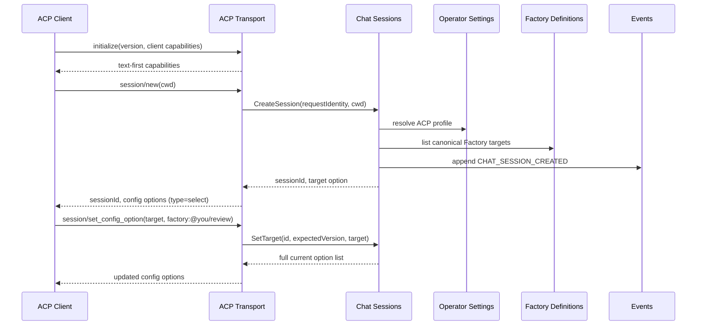
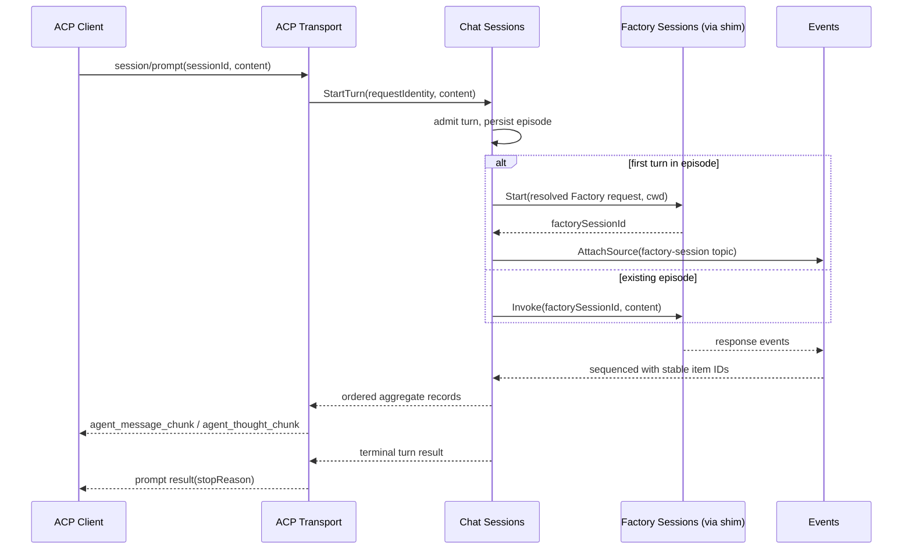
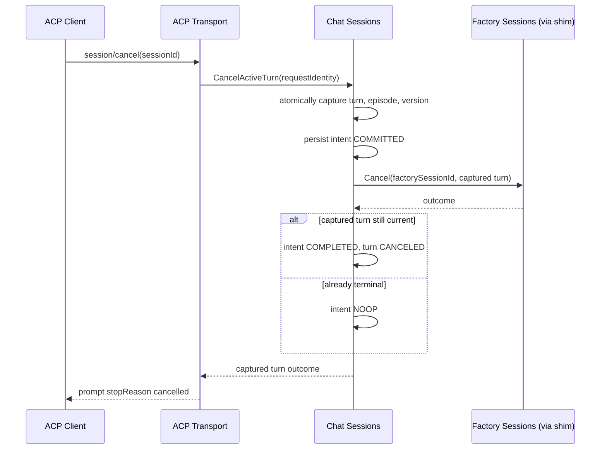
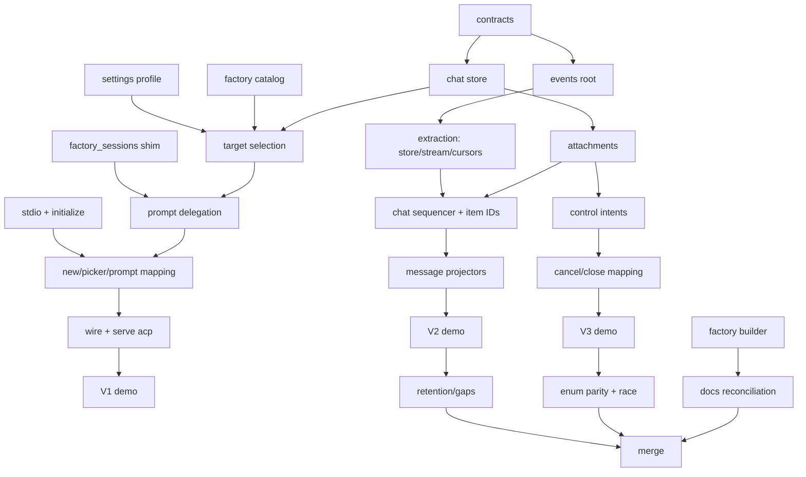

# L1 — ACP Core: Chat Sessions, Events Stream, and the ACP Agent Transport

Status: proposed
Date: 2026-08-02
Lane: L1 of `docs/internal/projects/acp-program/README.md`
Audience: backend, transport, and test maintainers
Supersedes: the prior single-document ACP proposal and
`docs/internal/projects/acp-client/design.md`

Governing decisions live in the lane map. This plan cites D1–D6 and does not
restate them.

## 1. Problem and outcome

You is convenient once a customer has decided to invoke a Factory through the
CLI, HTTP API, MCP, or dashboard. It is inconvenient for one-off work inside an
editor where the customer already has a preferred interaction surface.

Requiring one configured ACP process per installed Factory produces poor setup
UX. Modeling a Factory as a You Model would corrupt the domain model — a Factory
is an orchestration definition, not a provider model.

Target outcome:

> A customer runs `you acp serve` once, selects an installed You Factory from
> the client's existing picker, chats across multiple turns, sees the Factory's
> customer-facing output as assistant messages, and can cancel, close, load, or
> reconnect without exposing You's internal orchestration.

## 2. Scope

### In scope

- `pkg/services/chat_sessions` — conversation, target selection, turn admission,
  attachment, and control-intent owner.
- `pkg/services/events` — session-scoped event **stream** (D2): ordering,
  cursors, subscriptions, retention, gaps, backpressure. Absorbs
  `factory_sessions/internal/{responseeventstore,responsestream,cursors}`.
- `pkg/transports/acp` — JSON-RPC/stdio, capability negotiation, request
  mapping, and record→ACP projection.
- `@you/factory-builder` packaged Factory as the default target.
- One additive Operator Settings root operation pair for the ACP profile.

### Out of scope

| Deferred to | What |
| --- | --- |
| L4 | Worker Sessions, child Worker tool calls, worker control fan-out |
| L2 | Root sealing, dead-API removal, opportunistic cleanup |
| L3 | Everything else in packaged-service-structure |
| — | Durable storage of any kind (D1) |
| — | Filesystem callbacks, terminals, fork, agent plans, client MCP servers, auth |
| — | Remote HTTP/WebSocket ACP |

**Consequence of deferring L4:** in L1 a Factory turn produces top-level
assistant output only. Child Worker activity is not projected. This is a real
functional limitation and it is deliberate — it makes L1 shippable without the
Worker Sessions control plane.

### Existing code this lane consumes unchanged

- `pkg/services/factory_sessions` through a thin consumer-owned shim (D4). The
  root is 45 methods with three parallel pause/resume families; L1 does not seal
  it and does not depend on it being sealed.
- `pkg/services/workers/response_drafts.go` as the normalized vocabulary owner.
  L1 introduces no taxonomy.
- `github.com/coder/acp-go-sdk v0.13.5`, already a direct dependency. It
  supports `session/new`, `prompt`, `cancel`, `load`, `resume`, `close`,
  `set_config_option`, and `request_permission`. Protocol version 1.

## 3. Target selection

Installed Factories are presented through the ACP client's config-option
selector. The SDK type is a union requiring `type`:

```json
{
  "type": "select",
  "id": "target",
  "name": "Factory",
  "category": "model",
  "currentValue": "factory:@you/factory-builder",
  "options": [
    { "value": "factory:@you/factory-builder", "name": "Factory Builder" },
    { "value": "factory:@you/review",          "name": "Review" },
    { "value": "factory:local/software-auto",  "name": "Software Auto" }
  ]
}
```

`category` is `SessionConfigOptionCategoryModel` and is documented in the SDK as
*"Optional semantic category for this option (UX only)."* It is a presentation
hint. Internally every value decodes to a typed `ChatTargetRef`:

```go
type ChatTargetRef struct {
    Kind ChatTargetKind // FACTORY | WORKER
    Ref  string
}
```

`WORKER` is defined in L1 but never produced; direct Worker targets are L4.

Operator Settings owns the default and allowlist. Factory Definitions owns
enumeration and canonical reference resolution. Target refs are unversioned
(D6).

**Fallback.** Config options are the newer surface. If a client does not render
them, the customer cannot select a Factory. L1 therefore also advertises
`availableCommands` with `/factory <target>`, delegating to the same Chat
Session operation as `session/set_config_option`. This is a P0 fallback, not a
P1 nicety — without it the feature is unusable on clients that lag.

## 4. Chat Sessions

### 4.1 Model

```go
type Session struct {
    ID             string
    State          SessionState
    SelectedTarget ChatTargetRef
    TargetEpisode  uint64
    ActiveTurnID   string
    Version        uint64
    StreamHead     uint64
    CreatedAt      time.Time
    UpdatedAt      time.Time
}

type TargetEpisode struct {
    Number           uint64
    State            TargetEpisodeState
    Target           ChatTargetRef
    FactorySessionID string
    StartedAt        time.Time
    ClosedAt         *time.Time
}

type Turn struct {
    ID               string
    Episode          uint64
    State            TurnState
    RequestID        RequestIdentity
    StartSequence    uint64
    TerminalSequence uint64
}

type Attachment struct {
    ID             string
    SessionID      string
    ConnectionID   string
    AfterSequence  uint64
    Interactive    bool
}

type ControlIntent struct {
    RequestID       RequestIdentity
    SessionID       string
    TurnID          string
    TargetEpisode   uint64
    ExpectedVersion uint64
    Action          ControlAction
    State           ControlIntentState
    RequestedAt     time.Time
}
```

Three distinct positions, never conflated:

- **stream head** — last event sequenced for the Chat Session;
- **attachment cursor** — last event delivered to one attachment;
- **active control target** — turn ID, episode, and version captured when a
  control request commits.

Chat Sessions atomically captures and persists the control target *before*
invoking downstream controls. A newly admitted turn cannot be affected by an
older control intent.

### 4.2 Enum hardening

Every enum below is exhaustively defined with a transition table, a `Validate()`
method, and exhaustive-switch enforcement. The prior proposal referenced these
without enumerating them.

**`ChatTargetKind`** — `FACTORY`, `WORKER`.

**`SessionState`**

| From | To | Trigger |
| --- | --- | --- |
| `CREATED` | `ACTIVE` | first turn admitted |
| `CREATED` | `CLOSED` | `session/close` |
| `ACTIVE` | `CLOSED` | `session/close`, or process exit (D1) |
| `CLOSED` | — | terminal |

**`TargetEpisodeState`**

| From | To | Trigger |
| --- | --- | --- |
| `OPEN` | `CLOSED` | target changed, or session closed |
| `CLOSED` | — | terminal; accepts no new turns |

**`TurnState`**

| From | To | Trigger |
| --- | --- | --- |
| `ADMITTED` | `RUNNING` | downstream invocation accepted |
| `ADMITTED` | `CANCELED` | control intent commits before invocation |
| `RUNNING` | `COMPLETED` | terminal success |
| `RUNNING` | `FAILED` | terminal failure |
| `RUNNING` | `CANCELED` | cancel fan-out reached the target |
| terminal | — | terminal |

At most one non-terminal turn per session. Turn admission while one is active
returns a typed busy error.

**`ControlAction`** — `CANCEL`, `CLOSE`. (`PAUSE`, `RESUME`, `TERMINATE` are
declared for L4 but rejected as unsupported in L1.)

**`ControlIntentState`**

| From | To | Meaning |
| --- | --- | --- |
| `REQUESTED` | `COMMITTED` | target captured and persisted |
| `COMMITTED` | `COMPLETED` | fan-out reached the captured turn |
| `COMMITTED` | `NOOP` | captured turn already terminal on arrival |
| `COMMITTED` | `SUPERSEDED` | captured turn no longer current — never applied |

`NOOP` and `SUPERSEDED` are how the cancel-versus-completion race resolves
deterministically. An intent never migrates to a later turn.

**Existing vocabulary.** `workers.Kind` (12 values) and `workers.Phase` (6
values) are hardened, not extended: add `Validate()`, exhaustive-switch
enforcement, and a **parity test asserting every `(Kind, Phase)` pair has a
declared ACP mapping outcome — including explicit "no output."** This mirrors
the existing `recordings/internal/events/kinds/parity.go` pattern and prevents
§6.2's table from silently dropping a case.

**Simplification from D1.** Because state is session-scoped and process exit
terminalizes everything, there is no `INTERRUPTED` state, no restart
reconciliation, and no recovery scan. Historical inspection comes from recorder
JSONL.

### 4.3 Target episodes

A Chat Session contains multiple immutable episodes. Changing the target:

- is rejected while a turn is active;
- applies to the next admitted turn;
- increments the episode;
- never changes the identity of historical events;
- does not retroactively change connection capabilities.

L1 negotiates the text-first capability intersection across selectable targets.
`promptCapabilities` advertises no image, audio, or embedded context.

## 5. Events stream service

Per D2, `pkg/services/events` is a **stream, not a store**. It has no
`internal/store/` package and no persistence responsibility.

```go
type Service interface {
    Append(context.Context, AppendRequest) (AppendResult, error)
    AttachSource(context.Context, AttachSourceRequest) (AttachSourceResult, error)
    Read(context.Context, ReadRequest) (ReadResult, error)
    Subscribe(context.Context, SubscribeRequest) (Subscription, error)
}

type AppendRequest struct {
    TopicID        string
    SourceType     SourceType
    SourceID       string
    SourceSequence uint64
    SourceEventID  string
    SchemaID       string
    Payload        json.RawMessage
}
```

The envelope is delivery metadata; `Payload` stays source-native. The *kind*
taxonomy is `workers.Kind` (lane map §3).

### 5.1 Migration inputs

This service is an **extraction**, not a greenfield build. It absorbs working,
tested machinery out of `factory_sessions`:

| Source | Provides |
| --- | --- |
| `internal/responseeventstore/` | sequence counter, tier retention, `droppedSequences`, subscriber map, `backpressure_stress_test.go` |
| `internal/responsestream/` | registry, stream, publisher, subscription |
| `internal/cursors/` | `StorageIdentity`, `Checkpoint`, `Store`, `PreflightResult` |
| `response_event_contract.go` | `ResponseEventCursor`, `ResponseEventRetentionLimits`, gap and stale-cursor errors |

Factory Sessions gains no new event logic; it loses what it has. Its root
continues to expose `SubscribeFactoryResponseEvents` as a delegating shim until
L2 retires it.

### 5.2 Topics and ordering

L1 topics:

- `factory-session/<id>/response-events`
- `chat-session/<id>/events` — ordered references plus Chat control facts

The Chat topic assigns one monotonic aggregate sequence in **commit order, not
timestamp order**. Idempotency key:

```text
(sourceType, sourceID, sourceSequence, sourceEventID)
```

**Concurrency model, stated explicitly:** L1 is single-process. Each Chat
Session has one serialization point for sequence assignment. Multi-process
sequencing is out of scope and no lane plans it.

### 5.3 Stable item identity

Chat Sessions assigns the **stable ACP item ID onto each aggregate record at
sequencing time**, not at projection time. This is what makes item IDs survive
`session/load` and reconnect, and it is what lets the transport stay a pure
function (§6.1). It also pre-empts the ordering problem L4 inherits: a child
record cannot be sequenced before its parent because the sequencer assigns both.

## 6. ACP transport

### 6.1 Where the inversion transformation belongs

The repository's established shape is: one normalized vocabulary owned by a
service, one outward mapper per transport, located at the transport.

```
external ACP agent ──mapSessionUpdate──► providers.ExecuteProgress
                                              │   [providers/internal/.../acp/internal/service/service.go:819]
                                              ▼
                                        workers.Draft          ← vocabulary owner
                                              │                  [workers/response_drafts.go]
                     ┌────────────────────────┼────────────────────────┐
                     ▼                        ▼                        ▼
          HTTP/OpenAPI mapper        CLI NDJSON mapper          ◄NEW► ACP mapper
   transports/mapping/factorysession  responsestream/ndjsoncontract
```

Therefore:

- **Outbound (`record → acpsdk.SessionUpdate`) lives in
  `pkg/transports/acp/internal/mapping`.** Not `pkg/transports/mapping/` — that
  package serves the generated OpenAPI contract, and ACP's types come from the
  vendored SDK with no generator.
- **Inbound stays where it is.** `mapSessionUpdate` is provider-execution
  policy: how a third-party agent's stream becomes Worker progress. Moving it
  would invert service→transport dependency.
- **They must not share code.** A service may not import a transport, and the
  transport must not import `providers/internal`. There is no legal neutral
  home. Bind them **by fixture instead**: promote the corpus in
  `tests/functional/providers/acp/golden_fixture_test.go` into a shared
  committed ACP conformance corpus that both directions assert against, plus a
  round-trip property test over the subset both support.

Because Chat Sessions assigns item identity (§5.3), the outbound mapper is a
pure function of one record. That is what makes exhaustive table-driven coverage
achievable.

### 6.2 Projection

| Source record | ACP output |
| --- | --- |
| Chat user turn admitted | `user_message_chunk` during load replay |
| Factory response `MESSAGE` | `agent_message_chunk` |
| Factory response `REASONING` | `agent_thought_chunk` |
| Factory turn terminal | prompt result with stop reason |
| `USAGE` with meaningful primary context | `usage_update` |
| Title/time change | `session_info_update` |
| Target option change | `session_config_option_update` |
| `TOOL`, `FILE_CHANGE`, `PLAN`, `PROGRESS`, `SESSION`, `RUN`, `TURN` | no output in L1 — declared, not dropped |
| `STREAM_GAP` | surfaced as an explicit gap notice, never fabricated content |

`PLAN` deserves a note: `PlanPayload`/`PlanStep` already exist in the taxonomy
and ACP has a first-class plan concept. L1 declares no output as a scope cut,
not because plumbing is missing.

### 6.3 Stop reasons

Total mapping, with a defined default:

| Terminal outcome | ACP stop reason |
| --- | --- |
| Factory turn completed | `end_turn` |
| Cancel intent reached the captured turn | `cancelled` |
| Provider reported token exhaustion | `max_tokens` |
| Provider refused | `refusal` |
| Factory failed, or any unmapped terminal | `end_turn` with an error record already streamed |

### 6.4 Errors

| Condition | JSON-RPC |
| --- | --- |
| Unknown target ref | invalid params |
| Target not in allowlist | invalid params |
| Chat session not found | invalid params |
| Turn already active | internal error, typed busy payload |
| Stale `expectedVersion` on config change | invalid params, conflict payload |
| Cursor expired (`ErrResponseEventStoreExpired`, `ErrReconnectCursorExpired`) | internal error, reconnect hint |
| Unsupported method | method not found, no side effects |

Errors omit credentials, raw provider commands, unsafe paths, and internal
topology.

## 7. P0 operations the prior proposal omitted

1. **`cwd`.** `session/new(cwd)` becomes the Factory Session working root. When
   the selected Factory pins its own root, the mismatch is a typed rejection at
   session or turn admission — not a silent override. A customer in an editor
   expects the agent to act on the open project; this is the operation that
   makes that true.
2. **Permission passthrough.** For ACP-backed providers the plumbing exists —
   the provider-side client already implements `RequestPermission`. For
   subprocess CLI providers, confirm whether approval is surfaced at all. If it
   is not, L1 **must not advertise a permission capability**; shipping an editor
   agent that silently writes files is not an acceptable default.
3. **Request identity.** JSON-RPC ids are unique per connection only.
   `RequestIdentity` is `(ConnectionID, JSONRPCID)` or a transport-minted UUID.
   Never the bare id.
4. **Interactive leader.** First interactive attachment is leader. On leader
   disconnect with an outstanding `session/request_permission`, the request is
   denied after a bounded timeout and the turn continues with the denial. Never
   hang.
5. **`session/new` rejection surface.** Non-empty `mcpServers` is explicitly
   rejected, not ignored.
6. **Capability honesty.** `loadSession` and `sessionCapabilities` advertise
   only what is implemented. Under D1, `session/load` is valid only for sessions
   in the current process; loading an unknown session is an explicit failure,
   never fabricated history.
7. **Content bounding.** Retained per-session records are bounded by the
   inherited tier-eviction limits, and eviction surfaces as `STREAM_GAP`.

## 8. Package structure

```text
pkg/
  services/
    chat_sessions/
      contracts.go  types.go  errors.go
      internal/{service,store,projection}/
      wire/wire.go
    events/
      contracts.go  types.go  errors.go
      internal/{journal,sequencing,subscriptions,retention}/
      wire/wire.go
  transports/
    acp/
      contracts.go                    # minimal inert stdio-server operation
      internal/{server,connection,capabilities,stdio}/
      internal/mapping/{content,events,tools,usage,stopreason,errors}.go
      wire/wire.go
```

`events/` has no `store/` package by construction (D2). `chat_sessions/store/`
is in-memory session state, not persistence.

Naming: the CLI already uses `acp` for the opposite direction (`you workers acp
add|delete`, backed by `pkg/transports/cli/acp/`). The agent-side command is
therefore **`you serve acp`**, not `you acp serve`, and the two directions are
cross-referenced in `docs/reference/`.

`pkg/wire`, `pkg/root`, and `pkg/initializer` receive additive composition edits
resolved by normal rebase (D3). `cmd/factory` is unchanged.

## 9. Flows

### 9.1 Create and select



### 9.2 Prompt



### 9.3 Cancel without racing a new turn



### 9.4 Load and resume

`session/load` replays retained records from the Chat topic with their assigned
stable item IDs, then returns current target options, title, and usage.
`session/resume` attaches at live head with no replay. Attachment delivery
position is never used as a control target.

## 10. Slices

Each slice is independently demonstrable. A later slice's task may start as soon
as its actual inputs exist.

**V0 — contracts.** `chat_sessions`, `events`, and ACP compatibility contracts
plus representative fixtures. Additive `ResolveACPAgentProfile` /
`UpdateACPAgentProfile` on the Operator Settings root. The `factory_sessions`
shim, registered as an L2 deletion candidate.

**V1 — one Chat Session runs one Factory.** Chat store and versioning, target
catalog, ACP stdio framing and initialize, `session/new`, picker,
`set_config_option`, prompt delegation, `/factory` fallback command. Wire
injection and `you serve acp`. Demo: prompt a Factory, receive a terminal text
result in a real client.

**V2 — Events extraction and durable-in-session streaming.** Move
`responseeventstore`, `responsestream`, and `cursors` into `pkg/services/events`
behind the new root; Factory Sessions delegates. Chat aggregate sequencer with
stable item IDs. Attachment cursors. Message, thought, usage, and session-info
projectors. Demo: streaming output, two attachments with independent cursors,
disconnect and reconnect.

**V3 — lifecycle controls.** Control intents with expected-version capture,
cancel and close mapping, deterministic stop reasons, shutdown ordering. Demo:
cancel mid-turn; cancel racing completion; close and reload.

**V4 — Factory Builder and hardening.** `@you/factory-builder` authored source
and `docs/reference/` coverage audit; enum parity tests; retention and gap
behavior; safe logging and secret audit; documentation reconciliation
(lane map §6); real-client evidence.



## 11. Tests

Construction rules: functional tests build through `root.BuildProcess` and call
`Process.Execute`. External provider effects are replaced only through
`edges.Edges`, preferring `ProviderCommandRunner` with sanitized
real-provider-shaped fixtures. A built binary is used only for the OS-level
stdio framing cell. No arbitrary sleeps — synchronize on committed events,
controlled edges, or explicit lifecycle outcomes. Concurrency paths run under
the race detector with repeat/stress modes.

| ID | Path | Scenario | Evidence |
| --- | --- | --- | --- |
| L1-01 | `transport/acp` | Initialize over stdio | Valid framing; advertised capabilities exactly match implemented behavior |
| L1-02 | `sessions/chat` | Create session | Default Factory Builder target; option carries `type: "select"` |
| L1-03 | `sessions/chat` | Enumerate Factories | Stable namespaced target IDs; allowlist and default applied |
| L1-04 | `sessions/chat` | Change target before prompt | Version increments; next episode uses the selection |
| L1-05 | `sessions/chat` | Reject target change during active turn | Typed busy; active execution unchanged |
| L1-06 | `sessions/chat` | `/factory` fallback | Same operation as `set_config_option`; persisted in history |
| L1-07 | `factory/acp_projection` | Final-only Factory prompt | One top-level result and a mapped stop reason |
| L1-08 | `factory/acp_projection` | Streaming response | Stable item IDs; ordered text and thought chunks |
| L1-09 | `factory/acp_projection` | `cwd` honored | Factory executes against the supplied root; pinned-root mismatch rejects typed |
| L1-10 | `events` | Aggregate ordering | Commit order independent of timestamps |
| L1-11 | `events` | Retained-then-live handoff | No missing or duplicated aggregate sequence |
| L1-12 | `events` | Duplicate source delivery | Idempotency tuple prevents duplicate output |
| L1-13 | `events` | Retention eviction | Surfaces `STREAM_GAP`; never fabricates history |
| L1-14 | `sessions/chat` | Two attachments | Independent cursors, identical records, one execution |
| L1-15 | `sessions/chat` | Cancel active turn | Intent commits before fan-out; captured turn canceled |
| L1-16 | `sessions/chat` | Cancel/completion race | Deterministic `COMPLETED`/`NOOP`; a later turn is never canceled |
| L1-17 | `sessions/chat` | Close active session | Turn canceled, attachments detached, history retained in-process |
| L1-18 | `sessions/chat` | Load | Retained history replayed with the same item IDs |
| L1-19 | `sessions/chat` | Resume | Attaches at live head with no replay |
| L1-20 | `transport/acp` | Unsupported methods | Plans, FS, terminal, fork, auth, client MCP rejected without side effects |
| L1-21 | `transport/acp` | Enum parity | Every `(Kind, Phase)` pair has a declared mapping outcome |
| L1-22 | `transport/acp` | Conformance corpus round-trip | Inbound and outbound mappers agree on the shared fixture subset |
| L1-23 | `factory` | Factory Builder success | Creates and validates graph and JavaScript examples through public behavior |
| L1-24 | `factory` | Factory Builder invalid Factory | Actionable validation explanation; invalid output not installed |

End-to-end with `acpx` or another real client, plus human acceptance on Zed, a
Neovim ACP client, a VS Code ACP-capable client, and one non-editor client.
Retain sanitized transcripts, logs, and provider invocation records.

## 12. Acceptance criteria

### Customer

- One configured `you serve acp` agent entry.
- `session/new` returns a default `@you/factory-builder` target and all allowed
  installed Factories in the client's picker.
- Selecting a Factory neither exposes nor mutates You Model resources.
- Multi-turn prompting against the selected Factory works.
- Changing Factory between turns opens a new episode without losing history.
- The Factory's customer-facing output appears as top-level assistant output.
- Cancel and close visibly stop the intended active turn.
- Load reproduces retained history; resume reconnects without replay.
- The agent operates against the workspace the editor supplied.

### Correctness

- Control requests capture turn, episode, and expected version before fan-out;
  an older intent can never affect a newly admitted turn.
- Every enum in §4.2 is exhaustive, validated, and transition-tested.
- Each Chat Session has one monotonic aggregate sequence in commit order.
- Duplicate source delivery cannot duplicate output.
- Item IDs assigned at sequencing survive load and reconnect.
- Retention eviction surfaces as `STREAM_GAP`; history is never fabricated.
- Slow consumers do not block Factory execution.
- Advertised capabilities exactly match implemented behavior.
- No durable store is introduced (D1); no second event taxonomy is introduced.
- Factory Sessions gains no new event logic (D2).

### Delivery

Complete only when required CI is terminal and passing, blocking review
conversations are explicitly addressed, conflicts with concurrent lanes are
resolved against current `main`, generated artifacts are reconciled, and the
implementation PR is **merged**. Opening a PR, obtaining approval, or reaching
green CI without merge is not completion.

## References

- `docs/internal/projects/acp-program/README.md` — lane map and decisions
- `docs/internal/projects/root-consolidation/proposal.md` — L2
- `docs/internal/projects/acp-worker-events/proposal.md` — L4
- `docs/architecture/{architecture,data-model,event-streams}.md`
- `docs/internal/standards/code/planning-standards.md`
- [ACP session config options](https://agentclientprotocol.com/rfds/session-config-options)
- [ACP session resume](https://agentclientprotocol.com/rfds/session-resume)
- [ACP session close](https://agentclientprotocol.com/rfds/session-close)
