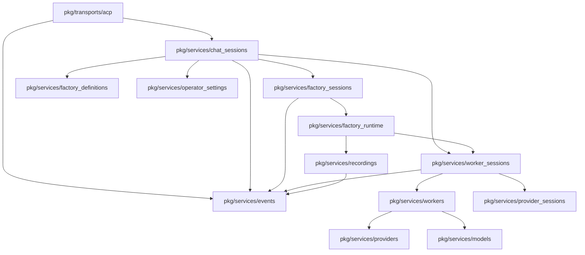
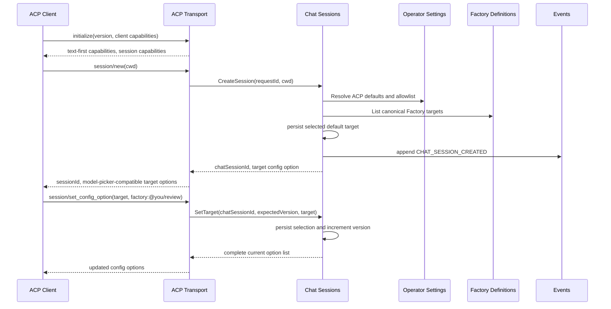
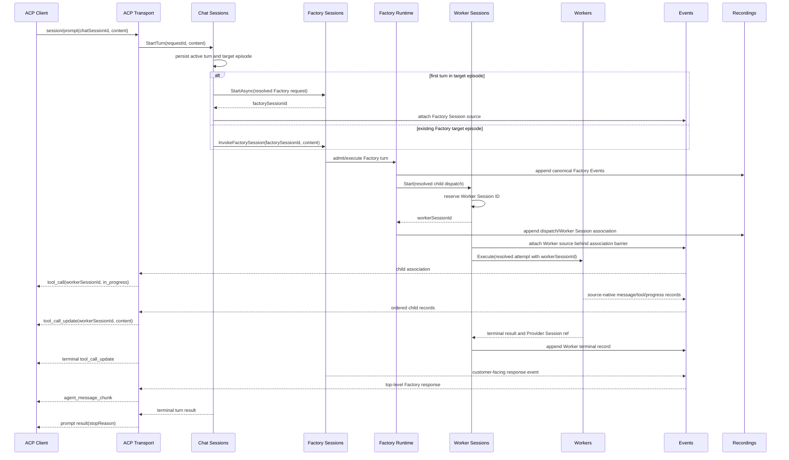
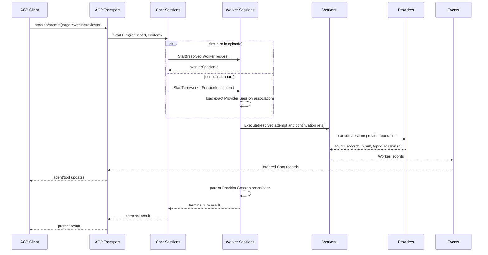
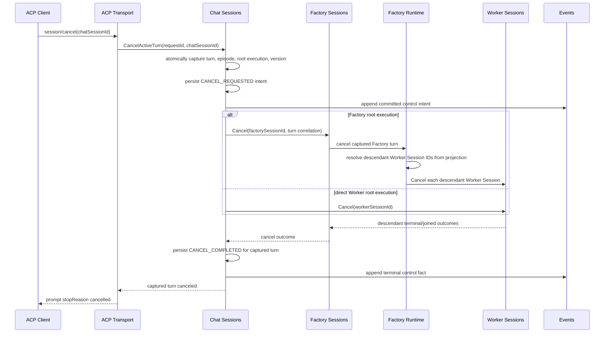
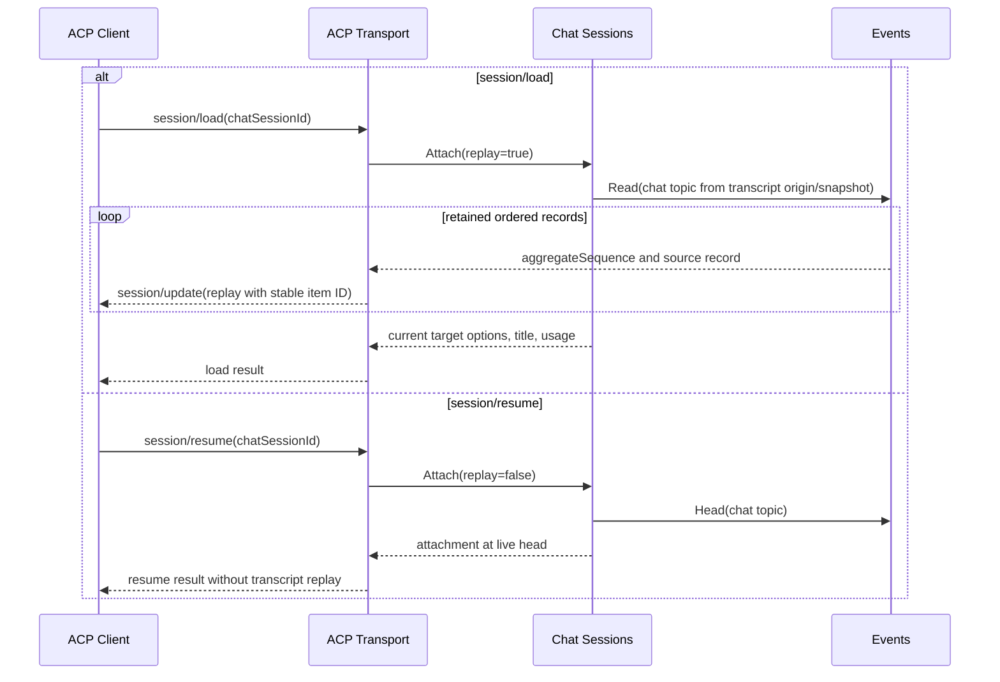
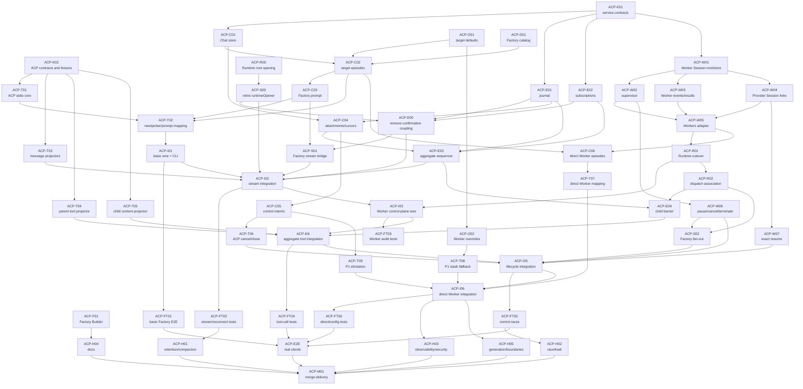

# ACP Chat Sessions and Worker Control Plane — Final Proposal

Status: proposed  
Date: 2026-08-02  
Audience: backend, transport, runtime, provider, packaged-factory, and test maintainers  
Supersedes for implementation planning: `docs/internal/projects/acp-client/design.md` and `docs/temp/acp-factory-worker-sessions-architecture.md`

## 1. Problem statement

You is effective when a customer already knows that they want to invoke a
Factory through the CLI, HTTP API, MCP, or dashboard. It is less convenient for
one-off work inside an editor or chat client where the customer already has a
preferred interaction surface.

Many of those clients support the Agent Client Protocol (ACP), but they expose
only a narrow and inconsistent subset of ACP:

- a single installed agent entry;
- session creation and prompting;
- a model picker or model-like session selector;
- streamed assistant messages, thoughts, and tool calls;
- cancel/close;
- partial support for list, load, resume, and configuration options.

Requiring one separately configured ACP process/profile for every installed
Factory produces poor discovery and setup UX. Conversely, modeling a Factory
as a You Model would corrupt the domain model: a Factory is an orchestration
definition, not a provider model.

The runtime also lacks one durable control-plane resource covering every Worker
execution. Workers currently executes a detached, request-scoped attempt and
returns a terminal result. Factory Runtime owns Factory dispatch identity, and
Provider Sessions exposes provider transcript inspection, but no single
resource currently gives callers all of:

- a Worker Session ID known before streamed output;
- execution origin and dispatch/attempt correlation;
- active state and result inspection;
- pause, resume, cancel, and terminate;
- retained Worker output;
- typed Provider Session continuation associations;
- identical behavior for Factory-originated and direct Worker execution.

ACP sessions are not stateless adapters. Correct cancellation requires knowing
which Chat turn and target episode were active when termination was requested.
Correct reconnection requires knowing the durable stream head and the attaching
client's read position. Correct Factory presentation requires merging Factory
events with concurrent child Worker streams while preserving one deterministic
client order.

The desired outcome is:

> A customer runs `you acp serve` once, selects an installed You Factory from
> the client's existing model-picker UX, chats across multiple turns, sees each
> child Worker as an ACP tool call, and can safely cancel, close, load, resume,
> or reconnect without exposing You's internal orchestration or provider
> topology.

### 1.1 Constraints

- Factory Events and Recordings remain canonical for Factory replay.
- Factory Sessions remains the singular Factory Session service root.
- Factory Runtime remains the owner of Factory orchestration and scheduling.
- Worker Sessions becomes the product control plane for Worker executions;
  Workers remains the lower-level execution engine.
- Provider Sessions remains the provider-independent inspection owner and uses
  the canonical typed provider session reference.
- A Factory is never represented as a Model inside You. ACP may use the
  model-category picker as presentation metadata for a Chat target selector.
- Factory provider/model selection remains opaque. Only direct Worker targets
  may expose provider/model and runner overrides.
- Commands and controls use explicit unary service calls. Events are committed
  facts and delivery records, not a hidden service locator or command bus.
- Every product dependency and transport is selected once by `pkg/wire` and
  constructor-injected. Session or command execution never performs secondary
  injection, constructs a child service graph, or imports another service's
  `internal/` implementation.
- Services are stateless wherever practical: canonical state lives in owned
  durable stores and event journals, while narrowly scoped active execution
  handles live only in the owning lifecycle/supervisor.
- No new universal normalized event vocabulary is introduced. Events retains
  source-native payloads behind a common delivery envelope.
- P0 does not support filesystem callbacks, terminals, fork, agent plans,
  custom `_meta` requirements, client-supplied MCP servers, or authentication.
- Operational slash-command fallbacks are P1.

## 2. Solution

Introduce one ACP agent process backed by three new durable service owners and
one new transport:

1. **Chat Sessions** — durable conversation, target-selection, turn,
   attachment, read-position, and control-intent owner.
2. **Worker Sessions** — durable Worker execution identity, audit, event,
   Provider Session association, and control plane.
3. **Events** — journal and retained/live delivery of source-native event
   records and aggregate Chat stream references.
4. **ACP transport** — JSON-RPC/stdio handling, capability negotiation, ACP
   request mapping, and source-event-to-ACP projection.

The solution presents installed Factories through the ACP client's most widely
supported picker:

```json
{
  "id": "target",
  "name": "Factory",
  "category": "model",
  "currentValue": "factory:@you/factory-builder",
  "options": [
    {
      "value": "factory:@you/factory-builder",
      "name": "Factory Builder"
    },
    {
      "value": "factory:@you/review",
      "name": "Review"
    },
    {
      "value": "factory:local/software-auto",
      "name": "Software Auto"
    }
  ]
}
```

The ACP category is a UX hint. Internally, every value decodes to a typed
`ChatTargetRef`:

```text
ChatTargetRef {
  kind: FACTORY | WORKER
  ref: canonical Factory or Worker reference
}
```

The default target is `factory:@you/factory-builder`. Operator Settings owns the
default and allowlist. Factory Definitions owns Factory enumeration and
canonical reference resolution. Direct Worker targets are included only when
explicitly enabled by Operator Settings.

### 2.1 Customer experience

1. The customer configures one ACP agent command: `you acp serve`.
2. The editor initializes the ACP connection.
3. `session/new` creates an empty Chat Session and returns target options.
4. The customer chooses a Factory using the client's model picker.
5. The first prompt lazily creates a Factory Session target episode.
6. Later prompts submit new invocation/Work through that same Factory Session.
7. Each Factory child Worker Session appears as one stable ACP tool call.
8. The Factory's customer-facing synthesis/final response appears as top-level
   assistant output.
9. Changing the target between turns closes the prior target episode for new
   input and creates a new episode on the next prompt. History remains in the
   same Chat Session.
10. Cancel, close, load, and resume operate against durable Chat Session state.

### 2.2 Target episodes

A Chat Session may contain multiple immutable target episodes:

```text
Chat Session
  Episode 1 -> Factory @you/review -> Factory Session A -> Turns 1..2
  Episode 2 -> Factory local/software-auto -> Factory Session B -> Turns 3..4
  Episode 3 -> Worker reviewer -> Worker Session C -> Turns 5..6
```

Changing the selected target:

- is rejected while a turn is active;
- applies to the next admitted turn;
- increments the target episode;
- never resumes a Provider Session associated with a different target;
- never changes the identity of historical events;
- does not change ACP connection capabilities retroactively.

P0 negotiates the safe text-first capability intersection across selectable
targets. Optional multimodal capability can be added when target-specific
capability refresh is proven across supported clients.

### 2.3 P0 and P1 scope

| Capability | Priority | Behavior |
| --- | --- | --- |
| Initialize and implementation info | P0 | One You agent, text-first safe capabilities |
| Target picker backed by Factory catalog | P0 | ACP model-category presentation over `ChatTargetRef` |
| Chat session create/list/get | P0 | Durable target-neutral catalog |
| Prompt Factory target | P0 | Delegate to Factory Sessions unary root |
| Prompt direct Worker target | P0 | Delegate to Worker Sessions control plane |
| Stream messages/thoughts/tools | P0 | Source-native event projection |
| Factory child Worker tool calls | P0 | One stable tool item per Worker Session |
| Cancel active turn | P0 | Persist control intent, then fan out |
| Close session | P0 | Cancel active turn, detach, retain history |
| Load and resume | P0 | Load replays; resume attaches at live head |
| Worker pause/resume/terminate | P0 backend | Worker Sessions control API |
| Factory pause/resume/terminate fan-out | P0 backend | Factory control reaches descendant Worker Sessions |
| Provider Session continuation | P0 | Exact typed association retained and reused |
| Permission requests | P0 | Native tool permission requests |
| Elicitation for non-tool approval | P1 | Version/capability gated |
| Slash-command operational configuration | P1 | Fallback over Chat Session config operations |
| Provider/model/worktree options | P1 | Direct Worker targets only |
| Remote HTTP/WebSocket ACP | P2 | Same services behind a later transport |
| Plans, filesystem, terminal, fork, custom `_meta` | DONOTDO | Omit; do not remap unrelated events |

## 3. Implementation details

### 3.1 Packaged-service-structure alignment

Implementation must begin from the then-current merged `main`, not the
checked-out commit observed while this proposal was authored.

Observed integration state on 2026-08-02:

| Commit/ref | Relevant delivered or pending boundary |
| --- | --- |
| `f6b02d2b9` on `origin/main` | Factory Sessions sealed to its singular unary root |
| `80120c8e6` | Packaged Factory prompt ownership repaired |
| `ccfe1fab7` | Factory Sessions and Work HTTP ownership separated |
| `cef3ffcfb` | Factory Runtime HTTP ownership split |
| `aa4a11083` | JavaScript terminal failure records preserved |
| `994a636cc` branch tip | Hosted invocation coverage over the unary Sessions root |
| `43fe2fc5b` branch tip | Typed Models presentation operator defaults |
| `823f71d96` lane | Factory Definitions unary-root reconstruction integration |

These commits are design context, not implementation gates. The proposal does
not require recording a baseline commit, freezing the repository, or completing
an audit before implementation begins. The enduring package constraints are:

- Do not copy pre-`f6b02d2b9` nested Factory Session service interfaces.
- Consume only the Factory Sessions root methods such as `StartAsync`,
  `InvokeFactorySession`, `ListSessions`, `ReadEvents`, `Pause`, `Resume`,
  `Cancel`, and `Terminate` after their merged names are verified.
- Depend on the Factory Definitions root. If catalog enumeration is missing,
  add one narrow root operation; never import a private Definitions package.
- Build on typed Models/Operator Settings presentation defaults after their
  active merge lands; do not restore `any`-typed settings.
- Follow the repaired packaged-factory prompt ownership. Authored Factory
  sources remain under `packages/packaged-factories/factories/` and generated
  output is regenerated rather than edited.
- Preserve the local architecture/event-stream work. This proposal adds a new
  file and does not rewrite those uncommitted documents.

### 3.2 Command versus event rule

Services communicate through two explicit channels:

1. **Unary root operations** for commands, controls, validation, and operations
   where the caller requires an accepted/rejected result.
2. **Events service records/subscriptions** for already-committed observations,
   replay, fan-out, projection, and reactions that are safe to retry.

The Events service must not receive a “create Factory Session” fact and
implicitly choose which service to construct. Chat Sessions calls Factory
Sessions directly, receives the result, persists its target episode, and then
publishes the committed association.

This preserves explicit dependencies, typed failures, and operation logging
while still allowing services to react to durable facts.

#### 3.2.1 Static composition and root-contract shims

`pkg/root.BuildProcess` and the canonical `pkg/wire` graph perform the only
application dependency-injection pass. Every service and transport is
constructed inertly with all required service roots, stores, platform effects,
and lifecycle roles already supplied. `pkg/initializer` activates those
objects; it does not construct replacements.

All cross-service calls target public root contracts. When a consumer needs a
narrower shape, add a thin adapter whose input is the provider's public root and
whose output is a consumer-owned port. The adapter may translate values or
restrict operations, but it must not import the provider's `internal/` tree. If
the root lacks required product behavior, add one deliberate operation to that
root instead of reaching around it.

The following are prohibited secondary-injection patterns:

- an `Open`, `Start`, command, or transport method invoking Wire or a service
  constructor;
- passing factories that construct another product service during a session;
- resolving dependencies from a context, registry, global, or service locator;
- allowing a transport to discover or construct its application service;
- exposing an internal implementation interface merely to avoid using the
  owning service root.

Per-session opening may allocate durable entity records, subscriptions,
process-local execution handles, and other state owned by an already-injected
service. It may not assemble a second service graph.

#### 3.2.2 Retiring `runtimeOpener` and confirmation coupling

The current `runtimeOpener`/`RuntimeOpeningFactory` path is a migration target,
not a pattern to extend. It aggregates internal Factory Sessions collaborators
and constructs a session-specific runtime graph. Replace it with:

1. a public Factory Runtime root operation, or a thin Factory Sessions adapter
   over that root, which opens only session-owned runtime state;
2. statically injected Factory Sessions, Factory Runtime, Recordings, Worker
   Sessions, and Events roots;
3. committed Events records for asynchronous runtime/secondary observations;
4. direct root operations only for commands that require an immediate
   accepted/rejected result.

Events removes the need for Factory Runtime and secondary services to maintain
a shared internal response buffer or synchronously confirm observation
messages. The producer commits its owned state and appends a durable fact. A
secondary independently consumes that fact, records an idempotent projection or
reaction, and can recover from its cursor after restart. Producer correctness
must not depend on a secondary acknowledging an observation.

Events does not make commands implicit. Work admission, Factory control, Worker
control, and other authoritative mutations still call the appropriate injected
root directly.

Service structs should therefore contain immutable dependencies and policy.
Canonical mutable state belongs in owned stores/events. The permitted
process-local exceptions are bounded delivery queues and active execution
handles that cannot be reconstructed as live OS/provider processes; they are
not canonical and must reconcile against durable state after restart.

### 3.3 Chat Session model

```go
type Session struct {
    ID                string
    State             SessionState
    SelectedTarget    ChatTargetRef
    TargetEpisode     uint64
    ActiveTurnID      string
    ActiveExecution   RootExecutionRef
    Version           uint64
    StreamHead        uint64
    CreatedAt         time.Time
    UpdatedAt         time.Time
}

type TargetEpisode struct {
    Number            uint64
    Target             ChatTargetRef
    FactorySessionID   string
    WorkerSessionID    string
    StartedAt          time.Time
    ClosedAt           *time.Time
}

type Turn struct {
    ID                 string
    Episode            uint64
    State              TurnState
    RootExecution      RootExecutionRef
    RequestID          string
    StartSequence      uint64
    TerminalSequence   uint64
}

type Attachment struct {
    ID                 string
    SessionID          string
    ConnectionID       string
    AfterSequence      uint64
    Interactive        bool
}

type ControlIntent struct {
    RequestID          string
    SessionID          string
    TurnID             string
    TargetEpisode      uint64
    ExpectedVersion    uint64
    Action             ControlAction
    State              ControlIntentState
    RequestedAt        time.Time
}
```

There are three distinct positions:

- **stream head** — last event committed for the Chat Session;
- **attachment cursor** — last event successfully delivered to one attachment;
- **active control target** — turn ID, target episode, and session version
  captured when a control request commits.

Cancellation never targets only “whatever is active after this request
returns.” Chat Sessions atomically captures and persists the active control
target before invoking downstream controls. A newly admitted turn cannot be
affected by an older control intent.

### 3.4 Target catalog and ACP picker

Operator Settings adds a typed configuration value:

```yaml
acp:
  defaultTarget: factory:@you/factory-builder
  allowedTargets:
    factories:
      - "*"
    workers:
      - reviewer
  p1WorkerOverrides:
    providers: [codex, cursor, claude]
    models: ["*"]
    scriptWrap: [disabled, enabled]
    acpRunner: [native, adapter]
```

Chat Sessions requests:

- the effective allowlist/default from Operator Settings;
- available canonical Factory references from Factory Definitions;
- explicitly allowed Worker target descriptors from Worker Sessions/Workers.

The returned target options are ordered:

1. configured default;
2. installed packaged Factories;
3. local Factories;
4. explicitly enabled direct Workers.

Unavailable targets are omitted or marked unavailable only when the ACP client
can render disabled options. Target IDs are stable and namespaced:

- `factory:@you/review`
- `factory:local/software-auto`
- `worker:reviewer`

### 3.5 Worker Sessions as the control plane

Worker Sessions is the product entrypoint for all Worker executions:

```go
type Service interface {
    Start(context.Context, StartRequest) (StartResult, error)
    StartTurn(context.Context, string, StartTurnRequest) (StartTurnResult, error)
    Get(context.Context, GetRequest) (Session, error)
    List(context.Context, ListRequest) (ListResult, error)
    Pause(context.Context, ControlRequest) (ControlResult, error)
    Resume(context.Context, ControlRequest) (ControlResult, error)
    Cancel(context.Context, ControlRequest) (ControlResult, error)
    Terminate(context.Context, ControlRequest) (ControlResult, error)
    GetResult(context.Context, ResultRequest) (Result, error)
    ListProviderSessions(context.Context, ProviderSessionListRequest) (ProviderSessionListResult, error)
}
```

`Start`:

1. validates an already-resolved Worker execution specification;
2. reserves and persists the Worker Session ID;
3. appends the session-start fact;
4. starts the lower-level synchronous `workers.Service.Execute` attempt under a
   supervised execution context;
5. registers cancellation/interruption control;
6. returns the Worker Session ID before Worker output is published.

Worker Sessions owns lifecycle and supervision but does not perform provider
execution. Workers remains responsible for runner policy, prompts, worktrees,
output shaping, and provider/model invocation.

Factory Runtime must migrate from direct product-level Workers dispatch to
`worker_sessions.Service.Start`. Direct Chat Worker targets use the same entry.
Temporary compatibility calls may remain only during a bounded migration and
must be deleted after all production callers converge.

### 3.6 Worker and Provider Session association

Provider Sessions are top-level typed identities. Worker Sessions stores
associations:

```text
WorkerProviderSessionAssociation {
  workerSessionId
  providerSessionRef { provider, kind, id }
  turnId
  dispatchId
  attemptId
  role
  status
  firstWorkerEventSequence
  lastWorkerEventSequence
}
```

The association is persisted before a resumed/running event that depends on it
is published. Resume validates the exact typed reference through Providers and
never silently reselects the current default provider/model.

Factory Runtime persists dispatch-to-Worker-Session associations in canonical
Factory Events. Factory Sessions resolves descendant Worker Session IDs through
the resulting recording/projection when it handles lifecycle controls; it does
not duplicate Provider Session associations.

### 3.7 Events journal

Events owns delivery metadata, journal retention, cursors, subscriptions, and
Chat aggregate ordering. It does not replace Recordings.

```go
type Service interface {
    Append(context.Context, AppendRequest) (AppendResult, error)
    AttachSource(context.Context, AttachSourceRequest) (AttachSourceResult, error)
    Read(context.Context, ReadRequest) (ReadResult, error)
    Subscribe(context.Context, SubscribeRequest) (Subscription, error)
}

type AppendRequest struct {
    TopicID        string
    SourceType     SourceType
    SourceID       string
    SourceSequence uint64
    SourceEventID  string
    SchemaID       string
    Payload        json.RawMessage
}
```

The envelope is common delivery metadata; `Payload` remains source-native.
There is no Events-owned union of message, plan, Work, Factory, provider, or
tool kinds.

P0 topics:

- `factory-session/<id>/factory-events` — references/copies needed for delivery,
  while Recordings remains canonical;
- `factory-session/<id>/response-events` — retained Factory response events;
- `worker-session/<id>/events` — Worker response and lifecycle events;
- `chat-session/<id>/events` — ordered references to source records and Chat
  control/metadata facts.

The Chat topic assigns one monotonic aggregate sequence. Cross-source order is
commit order, not timestamp order:

1. source appends its native event;
2. durable outbox/reference becomes available;
3. per-Chat-session sequencer assigns aggregate sequence;
4. aggregate reference commits;
5. subscribers receive the record.

Idempotency key:

```text
(sourceType, sourceID, sourceSequence, sourceEventID)
```

For a Factory child Worker, the Factory-dispatch-to-Worker-Session association
is indexed before the first child output. Early child output waits behind this
registration barrier so ACP never receives a tool update before its tool call.

Subscriptions are declared through injected service roots. Construction remains
inert. Long-running subscriptions activate through the normal process
lifecycle or an explicit service operation; constructors do not start hidden
goroutines.

### 3.8 ACP event projection

`pkg/transports/acp/mapping` maps typed source records directly:

| Source | ACP output |
| --- | --- |
| Chat user turn admitted | `user_message_chunk` during load/replay |
| Factory customer response `MESSAGE` | top-level `agent_message_chunk` |
| Factory customer response `REASONING` | top-level `agent_thought_chunk` |
| Direct Worker `MESSAGE` | top-level `agent_message_chunk` |
| Direct Worker `REASONING` | top-level `agent_thought_chunk` |
| Native direct Worker `TOOL` | `tool_call` / `tool_call_update` |
| Factory dispatch associated with Worker Session | one parent `tool_call` |
| Child Worker message/reasoning/tool/progress | safe content appended to the parent Worker `tool_call_update` |
| Worker terminal result | terminal parent `tool_call_update` |
| Factory turn terminal result | ACP prompt result/stop reason |
| Usage with meaningful primary context | `usage_update` |
| Title/time change | `session_info_update` |
| Native tool approval | `session/request_permission` |
| Plan, generic progress, Work state | no ACP output unless already inside an existing Worker tool call |

ACP has no required standard nested-subagent relationship. P0 uses the portable
flattened tool-result behavior and does not require custom metadata.

### 3.9 P1 slash-command compatibility

P1 may intercept exact, standalone commands:

- `/factory <target>`
- `/config`
- `/provider <provider>` — direct Worker only
- `/model <model>` — direct Worker only
- `/worktree <path>` — direct Worker only

Each command delegates to the same Chat Session configuration operation used by
`session/set_config_option`. Commands:

- are rejected while a turn is active when they would change execution;
- produce an explicit configuration result;
- are persisted in Chat Session history;
- never alter Factory-internal provider/model resolution;
- are not advertised as a P0 slash-command inventory.

## 4. Explicit package structure

### 4.1 New packages

```text
pkg/
  services/
    chat_sessions/
      contracts.go
      types.go
      errors.go
      internal/
        service/
        store/
        projection/
      wire/
        wire.go
      transports/
        http/                 # P2 or API parity only

    worker_sessions/
      contracts.go
      types.go
      errors.go
      internal/
        service/
        store/
        supervisor/
        projection/
      wire/
        wire.go

    events/
      contracts.go
      types.go
      errors.go
      internal/
        journal/
        sequencing/
        subscriptions/
        retention/
      wire/
        wire.go

  transports/
    acp/
      server.go
      connection.go
      capabilities.go
      errors.go
      mapping/
        content.go
        events.go
        tools.go
        usage.go
      stdio/
        transport.go
      wire/
        wire.go

packages/
  packaged-factories/
    factories/
      factory-builder/
        factory.yaml
        prompts/
        docs/

tests/
  functional/
    transport/
      acp/
    sessions/
      chat/
    workers/
      sessions/
    events/
    factory/
      acp_projection/
```

There must be one canonical package per owner:

- use `chat_sessions`, not an additional `chat` service;
- use `worker_sessions`, not an additional Worker-session implementation under
  ACP;
- use `events`, not parallel `event_stream` and `events` services;
- do not add a top-level Docs service for P0;
- do not create protocol state under Factory Sessions or Workers internals.

### 4.2 Existing packages changed

| Package | Intended change |
| --- | --- |
| `pkg/services/operator_settings` | Typed ACP default target, allowlists, and P1 direct-Worker overrides |
| `pkg/services/factory_definitions` | Root-level Factory target enumeration/resolution if not already available after the Definitions merge |
| `pkg/services/factory_sessions` | Publish retained response records/source correlations through its unary root implementation; replace the internal `runtimeOpener` composition path with a root-contract adapter |
| `pkg/services/factory_runtime` | Expose the root operation needed for session-owned runtime opening, dispatch resolved Worker requests through Worker Sessions, and publish committed observations through Events |
| `pkg/services/workers` | Remain the lower execution engine; accept Worker Session correlation and emit source-native events |
| `pkg/services/providers` | Expose interruption/resume capability through its root as needed |
| `pkg/services/provider_sessions` | Continue typed inspection; no live execution ownership |
| `pkg/services/recordings` | Remain canonical Factory Event ledger and source for retained Factory history |
| `pkg/services/factory_visualization` | Reuse safe presentation helpers where applicable; do not own Chat or ACP state |
| `pkg/wire` | Construct every new service and transport once, inject exact roots, and remove secondary/runtime service factories from product paths |
| `pkg/initializer` | Activate already-constructed ACP/event/transport roles; construct nothing |
| `cmd/factory` | Select activation of the injected `you acp serve` transport; construct no transport or service |
| `api/` | Only if a public non-ACP Chat/Worker Session HTTP contract is deliberately included |

### 4.3 Generated artifacts

Do not hand-edit:

- `api/openapi.yaml`;
- generated HTTP Go clients/servers;
- generated TypeScript OpenAPI types;
- packaged Factory generated output;
- CLI command manifests.

If public HTTP surfaces are added, edit authored OpenAPI fragments and run the
required generators. If only ACP stdio is added, avoid unnecessary OpenAPI
churn.

## 5. Explicit package interactions

| Caller | Callee | Allowed purpose | Prohibited behavior |
| --- | --- | --- | --- |
| ACP transport | Chat Sessions root | Session/turn/config/control operations | Owning durable Chat state |
| ACP transport | Events root | Read/subscribe by Chat cursor | Reading internal journal implementation |
| Chat Sessions | Operator Settings root | Effective default/allowlist | Parsing settings files directly |
| Chat Sessions | Factory Definitions root | Factory catalog and canonical refs | Importing Definitions internals |
| Chat Sessions | Factory Sessions root | Open/invoke/control Factory target episode | Calling Runtime or Work directly for Factory prompts |
| Chat Sessions | Worker Sessions root | Open/turn/control direct Worker episode | Calling Workers/Providers directly |
| Chat Sessions | Events root | Publish Chat facts, attach sources, query head | Defining a normalized event union |
| Factory Sessions | Factory Runtime root or root-only shim | Open session-owned runtime state and invoke/control execution | Importing Runtime internals or constructing a runtime service graph |
| Factory Runtime | Worker Sessions root | Start/control resolved Worker dispatches | Calling Workers directly after migration |
| Worker Sessions | Workers root | Execute resolved attempts | Resolving Factory definitions |
| Worker Sessions | Events root | Journal Worker lifecycle/output | Replacing Recordings |
| Worker Sessions | Provider Sessions root | Typed inspection where needed | Provider execution |
| Workers | Providers/Models roots | Existing provider/model execution | Chat/ACP state |
| Recordings | Events root or adapter | Publish canonical Factory event references | Ceding canonical Factory replay |
| Events subscribers | Owning service roots | React to committed facts through explicit operations | Hidden dependency lookup, synchronous producer acknowledgement, or construction |
| `pkg/wire` | all roots | Construct and inject exactly once | Secondary injector/service locator |
| Initializer | constructed roles | Start/stop/join | Construct services |
| CLI/HTTP/MCP/ACP selection | injected transports | Activate the selected transport | Constructing transports or resolving their dependencies at command time |

### 5.1 Dependency direction



No edge may be implemented by importing another service's `internal/` tree.
Every arrow denotes a statically injected public root or a root-only adapter;
none denotes runtime dependency discovery or a service factory.

## 6. Explicit intended service flow

### 6.1 Initialize, create, and select a Factory



### 6.2 Factory prompt and child Worker tool calls



### 6.3 Direct Worker prompt and continuation



### 6.4 Cancel and interrupt without racing a new turn



If natural completion commits first, cancel returns a deterministic terminal or
no-op outcome for that captured turn. It must not cancel a later turn.

### 6.5 Load, resume, and attachment cursors



The internal server/shim stream may carry `afterSequence`. ACP stdio does not
acknowledge every update, so stable item IDs and idempotent replay remain
required. Attachment delivery position is not used as the control target.

### 6.6 Pause, resume, and terminate

- Direct Worker pause/resume/terminate calls Worker Sessions.
- Factory pause enters through Factory Sessions, asks Factory Runtime to stop
  new scheduling, resolves child Worker Session IDs from the canonical
  projection, dispatches pause to each, and reports `PAUSED` only after every
  child is terminal or safely resumable.
- Factory resume enters through Factory Sessions and Factory Runtime, then
  validates all child continuation associations before starting any replacement
  attempt.
- Factory terminate enters through the same path and cancels and joins every
  descendant Worker Session.
- ACP P0 exposes cancel/close. Backend/CLI/HTTP may expose pause/resume/terminate
  without inventing custom ACP methods.

## 7. Explicit new services and packages

### 7.1 Chat Sessions service

The service object is stateless apart from immutable injected dependencies.
Session, turn, attachment, and control state is stored durably through its
owned store and Events projections.

Owns:

- Chat Session identity and durable catalog;
- selected target and target episodes;
- turn admission and one-active-turn policy;
- active root execution reference;
- attachment metadata and interactive leader;
- stream head projection;
- control intents and race-safe downstream fan-out;
- target-neutral result and usage projection.

Does not own:

- Factory execution;
- Work materialization;
- Worker execution;
- provider/model selection inside a Factory;
- ACP JSON-RPC types;
- source event schema.

### 7.2 Worker Sessions service

The service object is stateless apart from immutable injected dependencies and
a narrowly scoped supervisor of currently live execution handles. Durable
session, attempt, association, and interruption state remains in its store and
Events; the supervisor is never the source of historical truth.

Owns:

- Worker Session identity for all execution origins;
- asynchronous supervision of lower-level Workers attempts;
- direct and Factory dispatch associations;
- active attempt handles;
- pause/resume/cancel/terminate;
- typed Provider Session associations;
- Worker event and result projections;
- restart/interruption state;
- idempotency of start/control.

Does not own:

- Factory scheduling;
- Worker prompt/output policy;
- provider execution mechanics;
- Provider Session transcript parsing;
- canonical Work mutation.

### 7.3 Events service

Events is the asynchronous decomposition boundary between already-injected
services. Producers append committed facts without waiting for consumers to
confirm them. Consumers use durable cursors and idempotency to recover and
project independently.

Owns:

- durable append/read;
- source-native envelope validation;
- topic sequencing;
- Chat aggregate reference sequencing;
- subscriptions and retained-then-live handoff;
- cursor validation;
- bounded buffers/backpressure outcomes;
- retention, snapshots, and explicit gaps;
- idempotent outbox consumption.

Does not own:

- Factory canonical replay;
- service construction;
- domain command routing;
- ACP projection;
- a universal event-kind taxonomy.
- service instances, dependency resolution, or secondary injection;
- synchronous acknowledgement required for a producer to commit its own fact.

### 7.4 ACP transport

The ACP transport is constructed by `pkg/wire` with Chat Sessions, Events, and
all transport effects already injected. The CLI selects and activates this
transport; it does not construct it.

Owns:

- ACP version negotiation;
- stdio framing and JSON-RPC;
- connection state;
- capability advertisement;
- mapping ACP operations to Chat Sessions;
- mapping source-native records to ACP updates;
- permission request/response correlation;
- safe errors and stop reasons.

Does not own durable sessions, Workers, provider selection, or Factory policy.

### 7.5 Factory Builder packaged Factory

Add `@you/factory-builder` as the default ACP target. It should:

- understand how to discover and invoke `you docs` topics;
- guide customers through graph and JavaScript Factory authoring;
- create files only through existing execution/tool permissions;
- run canonical Factory validation;
- explain validation failures;
- place customer Factories under the configured user Factory directory;
- avoid embedding generated documentation copies into its prompt.

P0 should audit existing `docs/reference/` topics for sufficient Factory
authoring and validation coverage. A new Docs service is not required.

## 8. Explicit functional tests and end-to-end tests

### 8.1 Test construction rules

- Functional application tests construct through `root.BuildProcess` and call
  `Process.Execute` by default.
- Test adapters implement public service roots or consumer-owned ports; tests do
  not legitimize production imports of another service's `internal/` contracts.
- A built `you` binary is used only for the OS-level ACP stdio framing cell.
- External provider effects are replaced only through `edges.Edges`, preferring
  `ProviderCommandRunner` with sanitized real-provider-shaped fixtures.
- Tests do not use arbitrary sleeps. They synchronize on committed Events,
  controlled provider edges, or explicit lifecycle outcomes.
- Transport mechanics live under `tests/functional/transport/acp`. Chat,
  Worker Session, Events, and Factory behavior live under their domain
  directories.
- Concurrency paths run under the race detector and repeat/stress modes.

### 8.2 Functional test matrix

| ID | Owner/path | Scenario | Required evidence | Priority |
| --- | --- | --- | --- | --- |
| ACP-FT-001 | `transport/acp` | Initialize over stdio | Valid framing, negotiated P0 capabilities, no unsupported capabilities | P0 |
| ACP-FT-002 | `sessions/chat` | Create Chat Session | Durable ID, default Factory Builder target, stable target options | P0 |
| ACP-FT-003 | `sessions/chat` | Enumerate packaged/local Factories | Canonical stable target IDs, allowlist/default applied | P0 |
| ACP-FT-004 | `sessions/chat` | Change target before prompt | Version increments and next episode uses selected Factory | P0 |
| ACP-FT-005 | `sessions/chat` | Reject target change during active turn | Typed busy/conflict; active execution unchanged | P0 |
| ACP-FT-006 | `factory/acp_projection` | Factory prompt final-only | One top-level assistant result and terminal stop reason | P0 |
| ACP-FT-007 | `factory/acp_projection` | Streaming Factory response | Stable message IDs and ordered text/thought chunks | P0 |
| ACP-FT-008 | `workers/sessions` | Factory-originated Worker Session | ID reserved before first output; origin/dispatch associations persisted | P0 |
| ACP-FT-009 | `workers/sessions` | Direct Worker Session | Same session/result/control shape as Factory-originated execution | P0 |
| ACP-FT-010 | `factory/acp_projection` | Concurrent child Workers | One stable parent tool call per Worker Session with isolated updates | P0 |
| ACP-FT-011 | `events` | Concurrent aggregate ordering | Stable commit order independent of timestamps | P0 |
| ACP-FT-012 | `events` | Retained-then-live handoff | No missing or duplicate aggregate sequence | P0 |
| ACP-FT-013 | `events` | Duplicate source delivery | Idempotency tuple prevents duplicate Chat output | P0 |
| ACP-FT-014 | `events` | Child registration barrier | Tool call always precedes every update | P0 |
| ACP-FT-015 | `sessions/chat` | Two attachments | Independent cursors, identical records, one execution | P0 |
| ACP-FT-016 | `sessions/chat` | Cancel active Factory turn | Intent commits before fan-out; every descendant Worker Session canceled | P0 |
| ACP-FT-017 | `sessions/chat` | Cancel/completion race | One deterministic outcome; next turn cannot be canceled | P0 |
| ACP-FT-018 | `sessions/chat` | Close active session | Active turn canceled, resources detached, history retained | P0 |
| ACP-FT-019 | `sessions/chat` | Load | Retained history replayed with stable IDs | P0 |
| ACP-FT-020 | `sessions/chat` | Resume | Attachment starts at live head with no transcript replay | P0 |
| ACP-FT-021 | `workers/sessions` | Pause Worker | PAUSED only after terminal-or-resumable child state | P0 |
| ACP-FT-022 | `workers/sessions` | Resume Worker | Exact provider/kind/id passed to replacement attempt | P0 |
| ACP-FT-023 | `factory/acp_projection` | Factory pause/resume | Controls reach every associated child Worker Session | P0 |
| ACP-FT-024 | `workers/sessions` | Terminate | Active processes/providers joined and turn cannot resume | P0 |
| ACP-FT-025 | `workers/sessions` | Process restart/interruption | No external effect silently replayed; interrupted state inspectable | P0 |
| ACP-FT-026 | `transport/acp` | Native tool permission | Only interactive leader receives request; duplicate responses rejected | P0 |
| ACP-FT-027 | `transport/acp` | Unsupported methods | Plans, FS, terminal, fork, auth, custom methods rejected without effects | P0 |
| ACP-FT-028 | `sessions/chat` | Direct Worker config isolation | Worker override affects next Worker turn; Factory target exposes none | P1 |
| ACP-FT-029 | `sessions/chat` | Slash-command fallback | Exact command invokes same config operation and is persisted | P1 |
| ACP-FT-030 | `factory/acp_projection` | Target switch history | New episode opens; prior target/provider identities remain historical | P0 |
| ACP-FT-031 | `events` | Slow consumer | Execution continues; subscriber receives typed overflow/reconnect result | P1 |
| ACP-FT-032 | `events` | Compaction/gap | Snapshot plus retained tail or explicit load failure; no fabricated history | P1 |
| ACP-FT-033 | `factory` | Factory Builder success | Creates and validates graph and JavaScript examples through public behavior | P0 |
| ACP-FT-034 | `factory` | Factory Builder invalid Factory | Returns actionable validation explanation and does not install invalid output | P0 |
| ACP-FT-035 | package boundary checks | Root-only service integration | Production cross-service imports reference only public roots; no foreign `internal/` imports | P0 |
| ACP-FT-036 | root construction | Static service/transport injection | `BuildProcess` constructs each role once; command/session execution constructs no service or transport | P0 |
| ACP-FT-037 | `sessions/factory` | Runtime opening consolidation | Two Factory Sessions allocate independent state/handles through the injected Runtime root with no `runtimeOpener` or child service graph | P0 |
| ACP-FT-038 | `events` | Secondary consumer unavailable | Producer commits without acknowledgement; restarted consumer resumes from its cursor and projects the fact once | P0 |

### 8.3 Automated end-to-end tests

Run with `acpx` or another real ACP test client:

1. Start `you acp serve` and initialize.
2. Confirm installed Factories appear in the client's model picker.
3. Select `@you/factory-builder` and complete a basic Factory-authoring request.
4. Switch to `@you/review` between turns and prove a new target episode.
5. Run a Factory with at least three concurrent Workers and verify three stable
   tool calls with correctly isolated deltas.
6. Cancel while all three Workers are active and verify every child terminates.
7. Close and resume the Chat Session without losing target or provider identity.
8. Load the Chat Session and compare replay with the retained Events journal.
9. Run a direct Worker target for multiple turns and prove exact Provider
   Session continuation.
10. Exercise malformed JSON-RPC, unsupported methods, disconnect, and
    reconnect.

### 8.4 Human end-to-end acceptance

Required before general availability:

- Zed: target picker, stream, child tool calls, cancel, resume.
- Neovim ACP client: initialization, prompt, tool-call updates, close.
- VS Code ACP-capable client: target selection and multi-turn behavior.
- One non-editor ACP client such as Obsidian or AionUI.

Retain sanitized transcripts, screenshots, server logs, and provider invocation
records as release evidence.

## 9. Explicit phasing, vertical slices, and implementation tasks

### 9.1 Parallel workstreams

The paths below describe ownership boundaries, not leases. Tasks may run
concurrently, including tasks that integrate through shared composition files.
The dependency DAG records only genuine contract or behavior prerequisites.
Normal rebasing and conflict resolution are implementation mechanics and are
not proposal tasks or phase gates.

| Workstream | Primary paths |
| --- | --- |
| Chat | `pkg/services/chat_sessions/**` |
| Worker Sessions | `pkg/services/worker_sessions/**` |
| Events | `pkg/services/events/**` |
| ACP transport | `pkg/transports/acp/**` |
| Factory integration | `pkg/services/factory_sessions/**` |
| Runtime integration | `pkg/services/factory_runtime/**` |
| Workers integration | `pkg/services/workers/**` |
| Settings | `pkg/services/operator_settings/**` |
| Definitions | `pkg/services/factory_definitions/**` |
| Packaged Factory | `packages/packaged-factories/factories/factory-builder/**` and generator-owned output |
| Root integration | `pkg/wire/**`, `pkg/root/**`, `pkg/initializer/**` |
| CLI integration | `cmd/factory/**` and CLI manifests/generators |
| Authored API | `api/**` — only if separately admitted |

Every workstream can start when its own inputs exist. No workstream waits for a
repository-wide freeze, baseline record, audit, or path lease.

### 9.2 Vertical slices

Slices describe independently demonstrable product increments, not execution
waves. A task in a later slice may start immediately when its actual DAG inputs
exist; completing an earlier slice is not a scheduling gate.

#### Slice V0 — Contract definitions

Observable outcome: the new services and ACP transport have small typed
contracts that independent implementations can consume.

Tasks:

- **ACP-K01**: define the Chat Session, Worker Session, and Events root value,
  error, and operation contracts.
- **ACP-K02**: define the ACP compatibility contract and representative
  request/update fixtures used by the transport mapping tests.

These are ordinary implementation tasks, not a freeze. They can run in
parallel, and all work that does not consume their outputs can begin at the same
time.

#### Slice V1 — One Chat Session runs one Factory

Observable outcome: a real ACP client creates a Chat Session, selects a Factory,
prompts it, and receives a terminal text result.

Parallel tasks, beginning as soon as their specific inputs are available:

- **ACP-C01**: Chat Session create/get/store and versioning.
- **ACP-O01**: typed Operator Settings default target and allowlist.
- **ACP-D01**: Factory Definitions root target catalog adapter.
- **ACP-T01**: ACP stdio framing, initialize, errors, and fake Chat adapter.
- **ACP-F01**: `@you/factory-builder` authored source and docs coverage audit.

Fan-in:

- **ACP-C02**: Chat target selection and immutable target episode creation.
- **ACP-C03**: Factory prompt delegation through the merged Factory Sessions
  unary root.
- **ACP-T02**: `session/new`, target picker, `set_config_option`, and prompt
  mapping.
- **ACP-I01**: `pkg/wire`/initializer/`you acp serve` integration.
- **ACP-FT01**: end-to-end final-only Factory prompt.

#### Slice V2 — Durable ordered streaming

Observable outcome: Factory response events stream through a durable Chat topic
and reconnect without duplicate output.

Parallel tasks:

- **ACP-E01**: Events journal append/read, source envelopes, and idempotency.
- **ACP-E02**: subscription, cursor, retained-then-live handoff, and backpressure.
- **ACP-R00**: expose the Factory Runtime root operation and root-only adapter
  needed to open session-owned runtime state without internal contract types.
- **ACP-C04**: Chat attachment/cursor state and source attachment.
- **ACP-T03**: message/thought/usage/session-info projectors.

Fan-in:

- **ACP-S00**: migrate Factory Sessions from `runtimeOpener` and
  `RuntimeOpeningFactory` product composition to the injected Factory Runtime
  root adapter; retain only per-session state and execution handles.
- **ACP-E00**: replace Factory Runtime/secondary response buffers and
  confirmation callbacks with durable Events publication, subscription, and
  cursor recovery.
- **ACP-S01**: Factory Sessions response-event bridge using only its unary root
  implementation and the injected Events root.
- **ACP-E03**: Chat aggregate sequencer and restart recovery.
- **ACP-I02**: statically inject stream services and transports once, then
  activate them through the existing lifecycle.
- **ACP-FT02**: streaming, two attachments, disconnect/reconnect, load/resume.

#### Slice V3 — Worker Sessions control plane

Observable outcome: every Worker execution receives a durable Worker Session ID
before output and can be inspected/canceled through one root.

Parallel tasks:

- **ACP-W01**: Worker Session root contracts, identity, durable store, list/get.
- **ACP-W02**: execution supervisor, start idempotency, active handle registry.
- **ACP-W03**: Worker event publication and result projection.
- **ACP-W04**: typed Provider Session association store.

Fan-in:

- **ACP-W05**: Workers lower-engine adapter with Worker Session correlation.
- **ACP-R01**: Factory Runtime dispatch cutover to Worker Sessions.
- **ACP-I03**: wire Worker Sessions once and remove product-path direct Workers
  dispatch.
- **ACP-FT03**: Factory and direct execution audit parity plus cancellation.

#### Slice V4 — Factory children as ACP tool calls

Observable outcome: concurrent Factory child Workers are stable, isolated ACP
tool calls with ordered deltas.

Parallel tasks:

- **ACP-R02**: persist Factory dispatch-to-Worker-Session association before
  child publication.
- **ACP-E04**: child registration barrier and source attachment.
- **ACP-T04**: Worker parent-tool-call projector.
- **ACP-T05**: safe flattening of child message/reasoning/native-tool/progress
  content into the parent tool item.

Fan-in:

- **ACP-I04**: aggregate projector integration.
- **ACP-FT04**: concurrent child tools, deltas, partial failure, stable replay.

#### Slice V5 — Race-safe lifecycle controls

Observable outcome: Chat cancel/close and backend pause/resume/terminate target
the captured turn and all descendants exactly once.

Parallel tasks:

- **ACP-C05**: durable control intents and expected-version turn capture.
- **ACP-W06**: Worker pause/cancel/terminate and join semantics.
- **ACP-W07**: Worker resume with exact Provider Session validation.
- **ACP-S02**: Factory control fan-out through child Worker Session IDs.

Fan-in:

- **ACP-T06**: ACP cancel/close mapping and deterministic stop reasons.
- **ACP-I05**: lifecycle integration and shutdown ordering.
- **ACP-FT05**: cancel/completion/new-turn races, pause/resume, terminate.

#### Slice V6 — Direct Worker targets and P1 configuration

Observable outcome: an allowed direct Worker appears in the target picker,
continues across turns, and supports optional operational configuration.

Parallel tasks:

- **ACP-C06**: direct Worker target episodes and multi-turn continuation.
- **ACP-O02**: Worker-only provider/model/script-wrap/ACP override schema.
- **ACP-T07**: direct Worker message/tool projection.
- **ACP-T08**: P1 slash-command compatibility adapter.
- **ACP-T09**: P1 elicitation for durable non-tool approvals.

Fan-in:

- **ACP-I06**: direct Worker/configuration integration.
- **ACP-FT06**: Worker continuation, config isolation, slash fallback,
  permission/elicitation leadership.

#### Slice V7 — Hardening and release

Observable outcome: replay, restart, scale, security, documentation, and real
clients satisfy release criteria.

Tasks:

- **ACP-H01**: retention, snapshots, gaps, and compaction.
- **ACP-H02**: race/stress/load tests and slow-consumer behavior.
- **ACP-H03**: safe logging, metrics, traces, and secret/path audit.
- **ACP-H04**: public docs and `you docs` Factory Builder content.
- **ACP-H05**: generated artifacts, package manifests, boundary checks.
- **ACP-E2E**: automated acpx matrix and human client verification.
- **ACP-M01**: delivery loop through terminal green CI, addressed blocking
  feedback, resolved conflicts, and actual merge.

### 9.3 Dependency DAG



The DAG imposes only semantic dependencies. Settings, catalog, Factory Builder,
service contracts, ACP contracts, and any other nodes without incoming edges
can all begin concurrently. Integration nodes wait only for the behavior they
actually compose.

## 10. Explicit acceptance criteria

### 10.1 Customer acceptance

- A customer configures one `you acp serve` agent entry.
- `session/new` returns a default `@you/factory-builder` target and all allowed
  installed Factories in the client's model-picker UI.
- Selecting a Factory does not expose or mutate You's internal Model resources.
- A customer can prompt the selected Factory for multiple turns.
- Changing Factory between turns creates a new target episode without losing
  Chat history.
- Concurrent Factory Workers appear as separate stable tool calls.
- The Factory's final customer-facing output appears as top-level assistant
  output.
- A direct Worker target, when allowed, continues exact Provider Session state
  across turns.
- Cancel and close visibly stop the intended active turn.
- Load reproduces retained history; resume reconnects without replay.

### 10.2 State and control correctness

- Chat Sessions persists selected target, target episode, active turn, root
  execution, stream head, version, and control intent.
- Control requests atomically capture turn ID, episode, and expected version
  before downstream fan-out.
- An old cancel/terminate request cannot affect a newly admitted turn.
- Every product Worker execution obtains a Worker Session ID before output.
- Factory Runtime and direct Chat Worker execution converge on Worker Sessions.
- Worker pause reports `PAUSED` only after all active operations are terminal or
  safely resumable.
- Worker resume uses exact typed Provider Session references.
- Factory pause/resume/cancel/terminate reaches every associated descendant
  Worker Session.
- Terminated/canceled turns cannot be execution-resumed.

### 10.3 Event and replay correctness

- Recordings remains the canonical Factory Event ledger.
- Events journals source-native payloads without introducing a universal domain
  event kind.
- Every Chat Session has one monotonic aggregate sequence.
- Duplicate source delivery cannot duplicate Chat/ACP output.
- Retained-then-live subscription has no missing or duplicated record.
- Child Worker tool creation always precedes child tool updates.
- Multiple attachments have independent cursors and do not duplicate
  execution.
- Slow consumers do not block Factory or Worker execution.
- Compaction either supplies an authoritative snapshot plus retained tail or
  fails complete load explicitly.
- Event replay never reruns Workers or provider side effects.

### 10.4 Architecture acceptance

- New behavior is exposed through singular injected service roots.
- Production construction occurs only in focused service `wire/` providers and
  the canonical `pkg/wire` graph.
- `pkg/root.BuildProcess`/`pkg/wire` is the only full application injection
  pass; starting a command, transport, Chat Session, Factory Session, or Worker
  Session does not invoke an injector or construct a product service.
- Every transport, including ACP, is constructed inertly with its dependencies
  and injected before lifecycle selection.
- Constructors remain inert; Initializer activates already-constructed roles.
- No service imports another service's `internal/` tree.
- Consumer shims depend only on the provider's public root contract. Missing
  behavior is added to that root deliberately rather than exposed through an
  internal peer interface.
- Chat Sessions does not call Work or Factory Runtime directly for Factory
  prompts.
- ACP transport owns ACP types and projection; services do not.
- Worker Sessions owns product Worker lifecycle/control; Workers owns execution
  mechanics.
- Events is not a service locator, secondary injector, or implicit command bus.
- Events replaces the Factory Runtime/secondary response buffer and
  observation-confirmation coupling: producers commit without consumer
  acknowledgement, and consumers recover independently from durable cursors.
- The `runtimeOpener`/`RuntimeOpeningFactory` secondary-composition path is
  absent from production session opening. Factory Sessions reaches Factory
  Runtime through its injected public root or a root-only adapter.
- Service objects retain immutable dependencies rather than canonical mutable
  runtime state. Owned stores/events hold durable state; bounded queues and live
  execution handles are explicitly non-canonical and restart-reconciled.
- Factory Definitions, Factory Sessions, Models, Operator Settings, Work,
  Runtime, Recordings, Workers, Providers, and Provider Sessions are consumed
  through their post-PSS root contracts.
- Tasks are independently scoped and may execute concurrently; the plan adds no
  path leases, baseline-recording tasks, or repository-wide freeze.

### 10.5 Protocol acceptance

- Advertised capabilities exactly match implemented behavior.
- Unsupported plans, modes, filesystem, terminal, fork, auth, client MCP, and
  custom methods are omitted or rejected without side effects.
- Factory target selection is exposed as a model-category presentation option
  but persisted as `ChatTargetRef`.
- Factory targets expose no provider/model override.
- Direct Worker overrides affect only a future turn and never an active attempt.
- Stable message/tool IDs survive load and replay.
- ACP errors omit credentials, raw provider commands, unsafe paths, and internal
  topology.

### 10.6 Test and quality acceptance

- Unit tests cover reducers, validators, target selection, event mapping,
  sequencing, control-state transitions, and idempotency.
- Package integration tests cover each new service with explicit fakes.
- Functional tests use `root.BuildProcess` and `Process.Execute` by default.
- The OS-level stdio test uses the built binary only to prove process framing.
- External effects are replaced only through `edges.Edges`.
- Concurrency-sensitive packages pass race/repeat/stress coverage.
- Public contract changes regenerate and validate all derived artifacts.
- `make pkg-file-count`, `make pkg-boundary`, `make pkg-structure`, focused
  tests, `make verify-fast`, and the required PR verification tier pass.
- ACP source mapping has exhaustive table-driven coverage.
- Real-client evidence exists for the required editor/client matrix.

### 10.7 Delivery acceptance

The project is complete only when:

- every P0 vertical slice is implemented and its acceptance evidence is
  retained;
- required CI is terminal and passing;
- all blocking review conversations are explicitly addressed;
- conflicts with continued packaged-service-structure merges are resolved
  against current `main`;
- generated artifacts and ownership/coverage manifests are reconciled;
- the implementation PR or final integration PR is actually merged.

Opening a PR, obtaining approval, or reaching green CI without merge is not
completion.

## References

- `docs/internal/projects/acp-client/design.md`
- `docs/temp/acp-factory-worker-sessions-architecture.md`
- `docs/architecture/architecture.md`
- `docs/architecture/event-streams.md`
- `docs/architecture/data-model.md`
- `docs/architecture/packaged-structure.md`
- `docs/internal/standards/STANDARDS.md`
- `docs/internal/standards/code/general-backend-standards.md`
- `docs/internal/standards/code/planning-standards.md`
- `docs/internal/standards/code/code-review-standards.md`
- `docs/internal/projects/packaged-service-structure/README.md`
- [ACP Session Config Options](https://agentclientprotocol.com/rfds/session-config-options)
- [ACP Session Resume](https://agentclientprotocol.com/rfds/session-resume)
- [ACP Session Close](https://agentclientprotocol.com/rfds/session-close)
- [Claude Agent ACP adapter](https://github.com/agentclientprotocol/claude-agent-acp)
