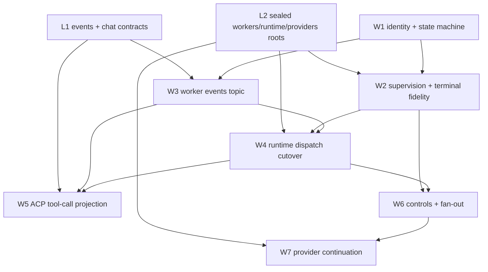

# L4 — ACP Worker Events

Status: proposed
Date: 2026-08-02
Lane: L4 of `docs/internal/projects/acp-program/README.md`
Depends on: L1 published contracts (`events.Service`, `chat_sessions.Service`),
L2 sealed roots (`workers` execution, Runtime dispatch, Providers attempt
control)

Program decisions D1–D6 are settled in the lane map. This plan cites them and
does not re-derive them.

## 1. What this lane adds

L1 ships a Chat Session that prompts a Factory and streams its customer-facing
response. L1 has no concept of the Workers executing underneath — a Factory turn
is opaque text.

L4 makes each Worker execution a first-class, controllable, observable resource
and projects it into ACP as a tool call:

- `pkg/services/worker_sessions` — durable-for-the-session Worker execution
  identity, supervision, control, and Provider Session association.
- Factory Runtime dispatch cutover from the workstation-pool boundary to
  `worker_sessions.Service.Start`.
- Worker topics on the L1 Events stream.
- ACP parent/child tool-call projection.
- pause / resume / cancel / terminate fan-out from a Chat turn to every
  descendant Worker Session.

Out of scope: direct Worker chat targets (that is an L1 follow-on once Worker
Sessions exists), provider daemon pooling (§4.9), and anything in L2 or L3.

## 2. Assumed inputs

| Input | Owner | Consumed as |
| --- | --- | --- |
| `events.Service` append/attach/read/subscribe | L1 | injected root |
| `chat_sessions.Service` turn + control + aggregate sequencing | L1 | injected root |
| Sealed `workers` execution root | L2 | injected root |
| Sealed Runtime dispatch operations | L2 | injected root |
| Providers attempt-control capability results | L2 | injected root |
| `providers.SessionRef{Provider, Kind, ID}` + `Validate()` | existing | value type |
| `workers.Kind` / `Phase` / `Draft` / `ToolPayload` | existing | vocabulary (lane map §3) |

Where an L2 seal has not landed when a task begins, that task uses a thin
consumer-owned shim per D4 and registers it as an L2 deletion candidate. L4
never blocks on L2 completion.

## 3. Worker Sessions contract

```go
type Service interface {
    Start(context.Context, StartRequest) (StartResult, error)
    StartTurn(context.Context, StartTurnRequest) (StartTurnResult, error)
    Get(context.Context, GetRequest) (Session, error)
    List(context.Context, ListRequest) (ListResult, error)
    Pause(context.Context, ControlRequest) (ControlResult, error)
    Resume(context.Context, ControlRequest) (ControlResult, error)
    Cancel(context.Context, ControlRequest) (ControlResult, error)
    Terminate(context.Context, ControlRequest) (ControlResult, error)
    GetResult(context.Context, ResultRequest) (Result, error)
    ListProviderSessions(context.Context, ProviderSessionListRequest) (ProviderSessionListResult, error)
}
```

`Start` ordering is load-bearing and testable:

1. validate an already-resolved Worker execution specification;
2. reserve the Worker Session ID and record `RESERVED`;
3. attach the Worker source to its Events topic;
4. transition `STARTING` and hand the attempt to the Workers root under
   supervision;
5. return the Worker Session ID.

Step 3 precedes step 4. The identifier and its stream exist before any Worker
output can be produced. This is what makes §4.7 work.

Worker Sessions owns lifecycle and supervision. It does not own runner policy,
prompts, worktrees, output shaping, or provider invocation — those stay in
Workers.

## 4. Design

### 4.1 Worker Session state machine

Per D1, sessions are session-scoped and die with the process. There is **no
`INTERRUPTED` state and no restart reconciliation**. Process exit is a normal
terminal condition; history is reconstructable from Recordings JSONL.

States: `RESERVED`, `STARTING`, `RUNNING`, `PAUSED`, `COMPLETED`, `FAILED`,
`CANCELED`, `TERMINATED`.

| From | Event | To | Notes |
| --- | --- | --- | --- |
| `RESERVED` | source attached, attempt handed off | `STARTING` | |
| `RESERVED` | validation failure | `FAILED` | no attempt started |
| `RESERVED` | `Cancel` / `Terminate` | `CANCELED` / `TERMINATED` | no attempt started; no external effect |
| `STARTING` | first attempt acknowledgement | `RUNNING` | |
| `STARTING` | start failure | `FAILED` | typed cause required |
| `STARTING` | `Cancel` / `Terminate` | `CANCELED` / `TERMINATED` | must join the in-flight handoff |
| `RUNNING` | terminal success | `COMPLETED` | |
| `RUNNING` | terminal failure | `FAILED` | typed cause required (§4.4) |
| `RUNNING` | `Pause` accepted, all operations terminal-or-resumable | `PAUSED` | |
| `RUNNING` | `Cancel` | `CANCELED` | via §4.3 |
| `RUNNING` | `Terminate` | `TERMINATED` | via §4.3, joins the process |
| `PAUSED` | `Resume` with validated association | `RUNNING` | §4.10 |
| `PAUSED` | `Cancel` / `Terminate` | `CANCELED` / `TERMINATED` | |
| terminal | any control | unchanged | idempotent no-op result, not an error |

Rules:

- `Pause` reports `PAUSED` only after every active operation is terminal or
  safely resumable. A `Pause` that cannot reach that condition returns a typed
  refusal and leaves state `RUNNING`.
- Terminal states are absorbing. Repeat controls return a deterministic no-op
  `ControlResult`, never an error and never a second external effect.
- Every transition into `FAILED` carries a non-nil typed cause.

`ControlAction` = `PAUSE | RESUME | CANCEL | TERMINATE`. Control results are
`ACCEPTED | NOOP | REFUSED`, each with a typed reason.

### 4.2 Runtime dispatch cutover

Today Factory Runtime dispatches through the workstation-pool boundary:

```
factory_runtime/internal/services/orchestration/runtime/factory.go
  → workers.NewWorkstationPoolBoundary(...)
  → workstationPoolBoundary.Publish(ctx, request, accept)
  → workers.Service.DispatchWorkstation
  → workerExecutorRequestAdapter.Execute
  → WorkerExecutor.Execute(ctx, work.WorkDispatch)
```

L4 inserts Worker Sessions above that seam: Runtime calls
`worker_sessions.Service.Start` with the resolved dispatch, receives the Worker
Session ID, records the dispatch→Worker-Session association in canonical Factory
Events, and Worker Sessions drives the existing boundary underneath.

The boundary is **not** removed in this lane. `workers.Service.Execute` is
currently dead in production (no `workers.ExecuteRequest` construction exists
outside the Workers package); whether to finish that cutover or delete it is an
L2 decision under D5, not an L4 task. L4 targets whichever surface L2 has
sealed, through a shim if necessary.

### 4.3 Cancellation routes through the boundary, not context

`workstationPoolBoundary.Publish` deliberately severs caller cancellation:

```go
execute := func() {
    result, err := b.service.DispatchWorkstation(context.WithoutCancel(ctx), request)
    accept(context.Background(), request, result, err)
}
if b.async { go execute(); return nil }
```

`context.WithoutCancel(ctx)` means cancelling the caller's context does nothing
to a running dispatch, and `context.Background()` means the result callback is
likewise uncancellable.

Therefore **Worker Session `Cancel` and `Terminate` must call
`WorkstationPoolBoundary.Cancel` → `workers.Service.CancelWorkstationDispatch`.**
Any implementation that cancels a context and reports `CANCELED` is wrong and
will pass naive tests while leaving the provider process running.

`Terminate` additionally joins the dispatch: it does not report `TERMINATED`
until the accept callback has fired or the supervisor has positively reaped the
attempt. Cancellation tests assert on observed provider-edge effects, not on
state transitions alone.

### 4.4 Terminal-outcome fidelity

`workerExecutorRequestAdapter.Execute` recovers executor panics:

```go
defer func() {
    if recovered := recover(); recovered != nil {
        result = WorkResult{
            DispatchID: ..., TransitionID: ...,
            Outcome: OutcomeFailed,
            Error:   fmt.Sprintf("executor panic: %v", recovered),
        }
        err = nil
    }
}()
```

The failure is real but arrives with `err == nil`. A supervisor that branches on
`err` alone sees success. Worker Sessions must classify terminal outcome from
`WorkResult.Outcome` first and `err` second, and must map
`OutcomeFailed` + non-empty `Error` to `FAILED` with a typed
`FailureCause{Kind: EXECUTOR_PANIC, Detail: ...}`.

This is required for the state machine's "every `FAILED` carries a non-nil typed
cause" rule to hold, and it is the specific case that makes deterministic
terminal outcomes testable.

### 4.5 Worker topics on the Events stream

One topic per Worker Session: `worker-session/<id>/events`. Records carry
source-native payloads behind the L1 delivery envelope; the kind taxonomy is
`workers.Kind` (lane map §3). Idempotency key is
`(sourceType, sourceID, sourceSequence, sourceEventID)`.

Per D2 the topic is an in-memory stream with session-scoped retention. It is not
a store and it does not persist.

### 4.6 Tool-call identity is assigned by the sequencer

The original proposal had a "registration barrier" that made early child output
wait until a dispatch→Worker-Session association was indexed. That mechanism is
**deleted**, because it solved a problem that the ordering model removes.

Chat Sessions assigns, at sequencing time, onto every aggregate record:

- `ItemID` — the stable ACP item this record belongs to;
- `ParentItemID` — the parent tool call, empty for top-level assistant output.

A Worker Session's parent tool call is created by the record that opens it, and
every child record is sequenced after that record because the sequencer assigns
both. A child cannot precede its parent by construction. No barrier, no waiting,
no buffering.

This makes the ACP transport a **pure function**: `record → SessionUpdate`, with
no connection-local map from Worker Session to open tool item. That is what lets
the mapping be exhaustively table-tested, and it is why stable IDs survive
`session/load` and reconnect — the IDs come from the sequencer, not from
per-connection reconstruction.

Projection:

| Source record | ACP output |
| --- | --- |
| Worker Session opened for a Factory dispatch | `tool_call` (`pending`) |
| Worker Session `STARTING` → `RUNNING` | `tool_call_update` (`in_progress`) |
| Child `MESSAGE` / `REASONING` / `TOOL` / `PROGRESS` | `tool_call_update` content on the parent item |
| Worker Session terminal | terminal `tool_call_update` (`completed` / `failed`) |
| Factory customer-facing `MESSAGE` / `REASONING` | top-level `agent_message_chunk` / `agent_thought_chunk` |

`workers.ToolPayload` already carries `ToolCallID`, `ToolName`, `Status`,
`ArgumentsSummary`, and `ResultSummary`; native child tool calls map through
those fields rather than a new shape.

### 4.7 Tool-call content bounding

Appending every child record into one parent `tool_call_update` is unbounded: a
long-running Worker emitting thousands of chunks degrades client rendering and
inflates replay.

L4 reuses the eviction semantics already specified in
`factory_sessions/internal/responseeventstore/doc.go` rather than inventing new
ones:

- hard per-parent-item limits on retained child records and serialized bytes;
- evict the oldest record in the lowest semantic tier first (`PROGRESS` before
  `MESSAGE` before `TOOL` before terminal);
- retained envelopes and their published identities are preserved verbatim;
- evicted spans surface as one cursor-relative `STREAM_GAP` before retained
  catch-up, out-of-band at sequence zero, never retained, never consuming a
  published identity.

The customer-visible contract: a tool call may show an explicit elision marker.
It never silently drops content and never fabricates history.

### 4.8 Provider concurrency gate — decision

`providers/internal/services/acp/internal/service/service.go` keeps one retained
subprocess per configured ACP integration, serialized by a
`gate: make(chan struct{}, 1)` acquired around prompt and cancel. **One
concurrent prompt per integration.** Three Factory Workers targeting the same
ACP integration execute serially, however concurrent the Factory is.

Decision for L4:

1. **Do not change provider daemon lifecycle in this lane.** Subprocess pooling
   is Providers-owned and changing it alongside a dispatch cutover compounds two
   risky changes.
2. **Render queued children honestly.** A Worker Session in `RESERVED` /
   `STARTING` still emits its parent `tool_call` in `pending`. The customer sees
   three tool calls immediately and watches them progress serially, rather than
   seeing tool calls appear one at a time with no explanation.
3. **Scope concurrency acceptance evidence to distinct provider integrations**
   or non-ACP providers, so the test proves isolation of the projection rather
   than accidentally proving the gate.
4. **File per-session daemon pooling as an explicit Providers follow-on** in the
   L2 catalog. It is a real limit with a real customer symptom; it is recorded,
   not hidden.

### 4.9 Provider Session association and resume

Association record:

```text
WorkerProviderSessionAssociation {
  workerSessionId
  providerSessionRef providers.SessionRef { Provider, Kind, ID }
  turnId, dispatchId, attemptId
  role, status
  firstWorkerEventSequence, lastWorkerEventSequence
}
```

Rules:

- The association is recorded **before** any event that depends on it is
  published.
- `Resume` validates the exact typed reference through the Providers root
  (`SessionRef.Validate()`, then provider-side existence) and passes it as
  `ExecuteRequest.ResumeSession`.
- A resume whose reference is missing or invalid **fails with a typed error**.
  It never silently reselects the current default provider or model. This is the
  single most important correctness rule in this section: silent reselection
  produces a plausible-looking answer from the wrong context.
- Factory Runtime records dispatch→Worker-Session associations in canonical
  Factory Events. Factory Sessions resolves descendant Worker Session IDs from
  that projection for control fan-out; it does not duplicate Provider Session
  associations.

### 4.10 Control fan-out

Cancel of a Chat turn, per L1, captures turn ID, target episode, and expected
version before any downstream call. L4 supplies the descendant half:

- Factory control enters through Factory Sessions → Factory Runtime.
- Runtime stops new scheduling, resolves descendant Worker Session IDs from the
  canonical projection, and dispatches the control to each.
- `PAUSED` is reported only after every descendant is terminal or safely
  resumable.
- `TERMINATED` is reported only after every descendant is joined.
- An old control intent can never affect a newly admitted turn; the captured
  turn ID is the target.

## 5. Vertical slices

Each slice is independently demonstrable.

**W1 — Worker Session identity.** Contracts, state machine, in-memory session
registry, `Get`/`List`. Outcome: a Worker execution has an ID and an inspectable
state before it produces output.

**W2 — Supervision and terminal fidelity.** `Start` ordering, attempt handoff,
outcome classification including §4.4. Outcome: every Worker execution reaches
exactly one terminal state with a typed cause.

**W3 — Worker events.** Topic attachment, record publication, result projection.
Outcome: a Worker's output is readable through the Events stream by cursor.

**W4 — Runtime cutover.** Factory Runtime dispatches through Worker Sessions;
dispatch→session association recorded in Factory Events. Outcome: Factory
children and direct executions converge on one control plane.

**W5 — ACP tool calls.** Sequencer item identity, pure transport projection,
content bounding. Outcome: concurrent Factory children appear as stable,
isolated ACP tool calls.

**W6 — Controls.** Pause/resume/cancel/terminate on Worker Sessions via §4.3,
plus Factory fan-out. Outcome: cancelling a Chat turn provably stops every
descendant Worker.

**W7 — Provider continuation.** Association store and exact-reference resume.
Outcome: a paused Worker resumes into the same provider session.



## 6. Functional tests

Construction rules: tests build through `root.BuildProcess` and call
`Process.Execute`. External provider effects are replaced only through
`edges.Edges`, preferring `ProviderCommandRunner` with sanitized
real-provider-shaped fixtures. No arbitrary sleeps — synchronization is on
committed Events records, controlled provider edges, or explicit lifecycle
outcomes. Concurrency paths run under `-race` with repeat/stress modes.

| ID | Path | Scenario | Required evidence |
| --- | --- | --- | --- |
| WEV-FT-001 | `workers/sessions` | Factory-originated Worker Session | ID and topic exist before first output record |
| WEV-FT-002 | `workers/sessions` | Every terminal state reachable | Each of COMPLETED/FAILED/CANCELED/TERMINATED observed with typed cause |
| WEV-FT-003 | `workers/sessions` | Executor panic | `FAILED` with `EXECUTOR_PANIC` cause despite nil error from the adapter |
| WEV-FT-004 | `workers/sessions` | Terminal control idempotence | Repeat cancel returns NOOP; no second provider effect at the edge |
| WEV-FT-005 | `workers/sessions` | Cancel stops the process | Provider edge observes termination; context-only cancel would fail this test |
| WEV-FT-006 | `workers/sessions` | Terminate joins | No provider effect after `TERMINATED` is reported |
| WEV-FT-007 | `workers/sessions` | Pause gating | `PAUSED` only after all operations terminal-or-resumable; refusal is typed |
| WEV-FT-008 | `workers/sessions` | Resume exact reference | Provider receives the exact `SessionRef`; no default reselection |
| WEV-FT-009 | `workers/sessions` | Resume with invalid reference | Typed failure; no attempt started |
| WEV-FT-010 | `events` | Worker topic ordering | Records delivered in commit order with no gaps or duplicates |
| WEV-FT-011 | `events` | Duplicate source delivery | Idempotency tuple prevents duplicate output |
| WEV-FT-012 | `factory/acp_projection` | Parent precedes children | Every child record carries a `ParentItemID` sequenced after its parent |
| WEV-FT-013 | `factory/acp_projection` | Concurrent children | One stable tool call per Worker Session with isolated deltas; distinct integrations per §4.8 |
| WEV-FT-014 | `factory/acp_projection` | Queued child rendering | A not-yet-started Worker still shows a `pending` tool call |
| WEV-FT-015 | `factory/acp_projection` | Content bounding | Eviction produces an explicit gap marker; no silent drop, no fabricated history |
| WEV-FT-016 | `factory/acp_projection` | Pure mapping | Table-driven coverage of every `(Kind, Phase)` pair, including explicit no-output cases |
| WEV-FT-017 | `factory/acp_projection` | Replay stability | Item IDs identical across load and live delivery |
| WEV-FT-018 | `sessions/chat` | Cancel fan-out | Every descendant Worker Session reaches a terminal state |
| WEV-FT-019 | `sessions/chat` | Cancel vs completion race | One deterministic outcome for the captured turn; a later turn is unaffected |
| WEV-FT-020 | `factory/acp_projection` | Factory pause/resume | Control reaches every associated descendant |
| WEV-FT-021 | `workers/sessions` | Process exit | All sessions terminalize; no INTERRUPTED state; Recordings JSONL reconstructs history |
| WEV-FT-022 | `workers/sessions` | Partial child failure | One failing child does not corrupt sibling tool calls or the Factory turn result |

## 7. Acceptance criteria

Customer-observable:

- Each Worker a Factory runs appears as its own ACP tool call, with its own
  progress, and its own terminal status.
- Concurrent Workers appear as separate tool calls whose content does not
  interleave.
- Cancelling a turn visibly stops every Worker that turn started.
- A long-running Worker's tool call stays readable; elided content is marked, not
  dropped.
- A resumed Worker continues the same provider conversation, or fails visibly.

Behavioral correctness:

- Every Worker execution obtains a Worker Session ID and an attached event topic
  before it produces output.
- Every Worker Session reaches exactly one terminal state, and every `FAILED`
  carries a non-nil typed cause — including executor panics.
- Cancel and terminate produce an observable effect at the provider edge, not
  only a state transition.
- Repeat controls on a terminal session are no-ops with no second external
  effect.
- `PAUSED` is reported only when every active operation is terminal or safely
  resumable.
- Resume passes the exact typed `SessionRef` and never falls back to a default.
- No child ACP record is ever delivered before the parent tool call that owns it.
- The ACP record→`SessionUpdate` mapping is a pure function with exhaustive
  `(Kind, Phase)` coverage.
- Factory-originated and direct Worker executions have the same session, result,
  and control shape.
- Process exit terminalizes all sessions; no reconciliation path exists and none
  is required.

Quality gates (necessary, not sufficient): focused package tests, the functional
matrix above under `-race` with repeat, `make verify-fast`, and the required PR
verification tier.

## 8. Delivery boundary

This lane is complete only when required CI is terminal and passing, blocking
review conversations are explicitly addressed, conflicts with concurrent lanes
are resolved against current `main`, and the implementation is **merged**.
Opening a PR, obtaining approval, or reaching green CI without merge is not
completion.

Composition edits under `pkg/wire/**` are resolved by normal rebase per D3 and
are not a phase gate for this lane.
