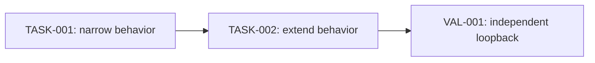

# Plan template

Use this structure for non-trivial factory plans and PRDs. Keep required
sections; omit a conditional section only with a one-line `Not applicable`
reason.

````markdown
# <Plan title>

## 1. Problem and desired outcome [Required]

### Problem statement
<One sentence describing the customer problem.>

### Current behavior and gap
<What happens now, for whom, and why it is insufficient.>

### Desired outcome and success measures
<Observable outcome and measurable completion conditions.>

## 2. Scope and constraints [Required]

### In scope
### Non-goals
### Assumptions and constraints
### Open questions
### Replanning triggers

## 3. Recommended approach [Required]

<No more than three introductory sentences. Include estimated tasks/agent
deployments and the decision rationale.>

### Decision record

| Option | Decision | Evidence and tradeoff |
| --- | --- | --- |

## 4. Customer behavior [Conditional]

### Actors, roles, and permissions
### User journeys
### Default, loading, empty, success, error, and permission states
### Accessibility, keyboard, focus, responsive, and localization behavior
### Visual references

## 5. Contracts and data [Conditional]

### Contract inventory and compatibility classification

| Contract/component | Authored source | Classification | Consumers |
| --- | --- | --- | --- |

### HTTP API and OpenAPI changes

#### <Operation or component name>

Authored source: `<api/openapi-main.yaml or component fragment>`

Current:

```yaml
<Exact current OpenAPI path, operation, request, response, error, or component
shape with sufficient surrounding context. Use `# Not present` for additions.>
```

Proposed:

```yaml
<Exact proposed OpenAPI shape. Use `# Removed` for deletions.>
```

Optional focused diff:

```diff
 <Unchanged context>
-<Removed contract line>
+<Added contract line>
```

Compatibility, migration, consumers, and generated outputs:

- <Concrete consequences; prose here supplements rather than replaces shapes.>

### Configuration and schema changes

#### <Configuration file or schema name>

Authored source: `<path>`

Current:

```yaml
<Exact current configuration/schema and valid example.>
```

Proposed:

```yaml
<Exact proposed configuration/schema and valid example.>
```

Validation, defaults, migration, and rollback:

- <Concrete consequences.>

### CLI, event, message, and persisted-contract changes

<Repeat the same Current/Proposed fenced-block pattern in the native format for
every changed shape.>

### Persisted data, migration, retention, and rollback
### Generated artifacts and consumers

## 6. Architecture and state [Conditional]

### Current-state flow
### Target-state flow
### Runtime sequence and dependencies
### Canonical, projected, and ephemeral state
### Mutation ownership and consistency boundaries
### Legacy path and removal plan

## 7. Failure modes and quality attributes [Required]

| Case | Detection | Customer outcome | State/recovery | Telemetry | Evidence |
| --- | --- | --- | --- | --- | --- |

### Performance and scale
### Reliability and availability
### Security and privacy
### Cost and resource limits
### Observability and operational readiness

## 8. Rollout, compatibility, and rollback [Conditional]

### Deployment and feature-flag sequence
### Compatibility interval
### Monitoring and stop conditions
### Rollback procedure
### Deprecation and cleanup owner

## 9. Implementation strategy [Required]

### Coverage assessment and characterization needs
### Parent behavior lanes
### Narrow executable spine
### Justified enabling work
### Migration or strangler sequence
### Shared-surface ownership

## 10. Verification strategy [Required]

| Behavior/gate | Scope | Dependency fidelity | Cadence | Cost | Proves | Does not prove |
| --- | --- | --- | --- | --- | --- | --- |

### Functional test-case matrix [Required when functional tests change]

| Case ID | Kind (happy/unhappy/boundary) | Given | When | Then (observable outcome) | Owning task |
| --- | --- | --- | --- | --- | --- |

### Test-layer design [Required when tests change]

- Behavior and observer:
- Selected layer and why a lower layer cannot prove it:
- Public or testable boundary:
- Real and controlled dependencies:
- Factory Session and shared `root.BuildProcess` strategy, if functional:
- Parallel-isolation model and customer-visible reason for any serialization:
- Prebuilt artifact owner and deliberately limited case set, if integration:
- Dedicated package and resource budget, if load/stress:
- Static/lint ownership for any inventory or repository-shape enforcement:

### Paid-validation budgets and evidence-reuse keys
### Remaining unproven edges and owning gates

## 11. Task dependency graph [Required]



## 12. Tasks [Required]

<Repeat the canonical task template for each task.>

## 13. Project acceptance criteria [Required]

- [ ] <Observable product behavior and direct evidence.>
- [ ] <Relevant failure behavior and direct evidence.>
- [ ] <Measured non-functional or operational outcome.>
- [ ] <Named quality gates and the properties they measure.>
- [ ] <Clean-room integrated validation outcome.>
- [ ] <Canonical implementation-stage delivery criterion.>

## 14. References [Required]

- <Repository source, architecture document, contract, research, or visual
  artifact with a stable path/URL and a note explaining its relevance.>
````
