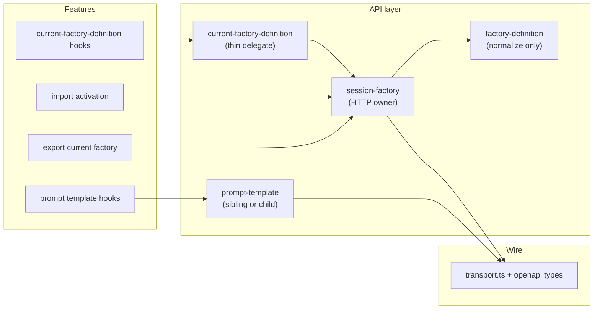

# PRD: UI API Module Cleanup (Recovery v2)

## Introduction

The dashboard still spreads session factory HTTP across `current-factory-definition`, `named-factory`, and feature hooks. Overlapping GET/PUT logic, a legacy `createFactory` export, and duplicate `getCurrentFactory` fetch paths make it hard to know which module owns session factory I/O. This recovery wave retriggers **U7** ([`tasks/prd-ui-api-module-cleanup.md`](../prd-ui-api-module-cleanup.md)) if [`ui-session-factory-client-recovery`](../prd-ui-session-factory-client.md) (v1) stalls partway through.

**Intent:** Give maintainers one documented, typed owner for session factory GET/PUT while keeping editor save, import confirm, and export behavior unchanged for operators.

## Context

### Customer ask

Retrigger UI API module cleanup when session-factory-client recovery v1 stalls. Full behavioral spec: [`tasks/prd-ui-api-module-cleanup.md`](../prd-ui-api-module-cleanup.md).

### Problem

- Session factory GET/PUT is implemented inside `current-factory-definition/api.ts` while import/export still import `named-factory` for activation and export helpers.
- `createFactory` remains exported even though it delegates to session PUT, preserving a misleading “named factory create” surface.
- `named-factory` duplicates a raw GET for `getCurrentFactory` instead of reusing the same normalization path as the editor.
- `factory-definition` and `current-factory-prompt-template` are not clearly grouped with the session-factory family, so contributors guess wrong import paths.

### Solution

Introduce `ui/src/api/session-factory/` as the sole HTTP owner for session factory GET/PUT (including save modes and typed errors). Thin `current-factory-definition` to delegation and keep feature hooks where they are. Retire `createFactory` and collapse import/export activation onto the session client. Document `factory-definition` as normalization-only and group prompt-template routes under the session-factory family via move or explicit cross-links—without changing URL shapes or operator-visible flows.

## Project-level acceptance criteria

- [ ] All dashboard session factory GET/PUT traffic goes through `ui/src/api/session-factory/` (method, path, `{ mode, factory }` body).
- [ ] Editor save and import confirm (replace current / create new named) behave as before, including stale-version and not-idle error surfacing.
- [ ] No production or integration test path issues `POST /factories` for factory activation.
- [ ] `factory-definition` performs normalization only; session HTTP does not live there.
- [ ] Maintainers can find session-scoped prompt-template HTTP next to session-factory (moved module or documented sibling with stable paths).
- [ ] Quality gate: UI typecheck, lint, and targeted test suites pass for touched modules.

## Goals

- One module answers “how do I GET/PUT the factory for session X?”
- Remove misleading `createFactory` / `POST /factories` surface from product code.
- Preserve backward-compatible imports from `current-factory-definition` during migration.
- Keep `factory-definition` as pure normalization/types.
- Make session-scoped ancillary routes (prompt template) discoverable without changing routes.

## User Stories

### ui-api-module-cleanup-recovery-v2-001: Session factory HTTP owner

**Description:** As a frontend maintainer, I want one module that performs session factory GET and PUT so transport, paths, and error codes are not duplicated.

**Acceptance Criteria:**

- [ ] `getSessionFactory(sessionID)` issues GET to `/factory-sessions/{session_id}/factory` via `factoryAPIURL` and `currentFactorySessionPath`.
- [ ] `saveSessionFactory({ sessionID, mode?, factory })` issues PUT with body `{ mode?: "REPLACE_CURRENT" | "UPSERT_NAMED_AND_ACTIVATE", factory }` and omits or sets `factory.version` per mode the same way editor save does today.
- [ ] Typed errors expose backend codes `STALE_FACTORY_VERSION`, `FACTORY_NOT_IDLE`, `INVALID_FACTORY`, `INVALID_FACTORY_NAME`, and `NOT_FOUND` for callers to map.
- [ ] Colocated unit tests assert method, path, and request body for default and non-default session IDs.
- [ ] Typecheck passes.
- [ ] Tests pass.

### ui-api-module-cleanup-recovery-v2-002: Editor save and load use the session factory owner

**Description:** As a factory editor, I want saving and loading the current factory to behave exactly as today while the API layer delegates to the session factory module.

**Acceptance Criteria:**

- [ ] `getCurrentFactoryDocument` / `saveCurrentFactoryDocument` / `saveFactoryForSessionDocument` delegate to `session-factory` without changing wire semantics (including `REPLACE_CURRENT` for editor save and version increment rules).
- [ ] `useCurrentFactoryDefinition` / `useSaveCurrentFactory` React Query keys and success/error UX are unchanged unless a regression test proves otherwise.
- [ ] Stale-version and not-idle failures still surface with the same user-visible messages in save flows covered by existing tests.
- [ ] Typecheck passes.
- [ ] Tests pass.

### ui-api-module-cleanup-recovery-v2-003: Import activation uses session PUT only

**Description:** As a dashboard operator, I want factory PNG import confirm (replace current vs create new named) to keep working without any legacy factory-create endpoint.

**Acceptance Criteria:**

- [ ] Replace-current import issues GET then PUT `REPLACE_CURRENT` with the current session factory name preserved.
- [ ] Create-new-named import issues PUT `UPSERT_NAMED_AND_ACTIVATE` with suffixed naming when a name collides, matching today’s resolved name behavior in the confirm dialog.
- [ ] `createFactory` is removed from the public API surface (or throws in development builds only until callers are migrated—prefer full removal in this wave).
- [ ] `App.import.test.tsx` and import hook tests complete without any mocked or real `POST /factories` activation call.
- [ ] Typecheck passes.
- [ ] Tests pass.
- [ ] Verify in browser: drop a factory PNG on the dashboard, confirm replace-current and create-new-named paths both activate successfully on default and a non-default session tab.

### ui-api-module-cleanup-recovery-v2-004: Export and duplicate GET paths use session factory owner

**Description:** As a dashboard operator, I want exporting the current factory to keep working while the client stops maintaining a second raw GET implementation.

**Acceptance Criteria:**

- [ ] `getCurrentFactory` (export) reads through `session-factory` or `current-factory-definition` delegation—no standalone fetch duplicate in `named-factory`.
- [ ] Export error mapping (`NamedFactoryAPIError` or successor) remains consistent for network, not-found, and invalid-response cases covered by export hook tests.
- [ ] Typecheck passes.
- [ ] Tests pass.

### ui-api-module-cleanup-recovery-v2-005: Normalization-only factory-definition boundary

**Description:** As a contributor, I want it obvious that `factory-definition` shapes data but never performs HTTP.

**Acceptance Criteria:**

- [ ] `factory-definition/api.ts` contains no `fetch` calls and no imports of `transport.ts` for network I/O.
- [ ] Module-level documentation (comment or internal dev guide entry) states that normalization lives here and session HTTP lives under `session-factory`.
- [ ] Existing normalization tests continue to pass without behavior change.
- [ ] Typecheck passes.
- [ ] Tests pass.

### ui-api-module-cleanup-recovery-v2-006: Session-scoped prompt template routes are discoverable

**Description:** As a maintainer, I want prompt-template HTTP grouped with session factory routes so I do not search unrelated API folders.

**Acceptance Criteria:**

- [ ] Prompt-template GET/PUT remains on `currentFactorySessionPath` + workstation segment (no URL change).
- [ ] Either `current-factory-prompt-template` moves under `session-factory/prompt-template/` or `session-factory/index.ts` re-exports / documents the sibling with stable import paths for features.
- [ ] Prompt-template hook tests pass unchanged for success, not-found, and network error cases.
- [ ] Typecheck passes.
- [ ] Tests pass.

## Functional Requirements

- FR-1: Session factory HTTP uses `factoryAPIURL`, `currentFactorySessionPath`, and shared `transport.ts` helpers only inside `session-factory`.
- FR-2: Generated OpenAPI types (`components`, `operations`) are the sole source for `Factory`, `FactorySaveMode`, and error payloads—no hand-rolled duplicate factory shapes.
- FR-3: `current-factory-definition` may re-export types and thin wrappers for one release; hooks stay under `features/current-factory-definition/`.
- FR-4: Import save-mode helpers (`import-save-mode.ts`) may remain colocated with import activation but must call session-factory HTTP, not legacy create endpoints.
- FR-5: Prompt-template paths and payloads stay aligned with OpenAPI; grouping is organizational only.

## Non-Goals

- Regenerating OpenAPI from scratch (follow normal codegen when backend schema changes).
- Moving `work/`, `events/`, or `factory-sessions` API modules.
- Changing `baseUrl.ts` resolution or dashboard session scope context (U2).
- Renaming all feature hooks from `current-factory-definition` to `session-factory`.
- PNG parsing, preview UI redesign, or new backend endpoints.
- Broad unrelated API refactors outside session-factory ownership.

## High-level technical design

**Recovery note:** If v1 already added `session-factory/`, each story verifies behavior and finishes migration rather than re-implementing from scratch. Do not delete working import flows to satisfy file-layout goals.

**Dependency fit:** Lands after or in parallel with stalled U1 transport; does not block on renaming feature hooks. Downstream [`prd-ui-factory-document-save-hook.md`](../prd-ui-factory-document-save-hook.md) should import `session-factory` once this wave completes.

## Supporting technical and UX considerations

- Preserve injectable `fetch` in options for unit tests and Storybook.
- Keep `session-factory-mocks` as the shared harness; update imports when modules move.
- Loading, empty, error, and success states for import confirm and editor save must not regress; browser verification is required only where story 003 touches visible import UX.
- Accessible semantics and keyboard behavior for the import dialog stay unchanged.
- Align error code mapping with backend [`prd-session-factory-save-modes.md`](../prd-session-factory-save-modes.md).

## Success metrics

- Zero `POST /factories` in UI test network logs for import/save/export flows.
- One documented import path for session factory GET/PUT in internal dev guides.
- `named-factory` folder removed or limited to deprecated re-exports for at most one release after migration.
- No increase in failed import or save integration tests on multi-session tabs.

## Open Questions

None—recovery scope is fully specified by U7 and current codebase boundaries; unresolved OpenAPI drift is handled by the normal codegen process when backend merges.
