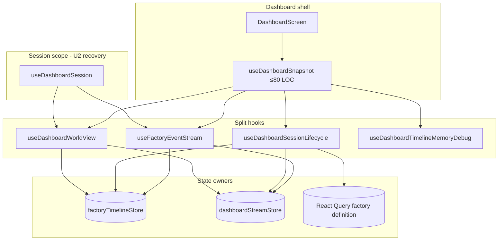

# PRD: UI Dashboard Stream and Timeline Split (U8 Recovery v2)

---
author: factory-agent
last modified: 2026-05-31
status: draft
recovery: wave2-plan-failure (blocked on ui-session-scope-context-recovery-v2)
baseline-spec: tasks/prd-ui-dashboard-stream-timeline-split.md
graph: U8
upstream-recovery: tasks/todo/ui-session-scope-context-recovery-v2.md
---

## Introduction

`useDashboardSnapshot` historically combined factory event SSE transport, session-switch lifecycle (timeline reset, stream reset, selection history, React Query invalidation), queued event flushing, optional timeline memory debug, and exposing `snapshot` from the timeline store. That coupling made the live dashboard shell hard to test and blurred **transport** with **derived dashboard state**.

U8 splits those concerns into focused hooks while preserving observable dashboard behavior: loading, offline-before-first-event errors, pause semantics, session/refresh resets, and the `snapshot` surface consumed by `DashboardScreen` and bento cards.

This document is a **recovery v2** plan after the wave-2 program token blocked on a failed U2 recovery plan. The full product intent remains in [`tasks/prd-ui-dashboard-stream-timeline-split.md`](../prd-ui-dashboard-stream-timeline-split.md). Main may already contain partial or complete implementation (for example `ralph/ui-dashboard-stream-timeline-split` on current `main`); stories are written to **verify, complete gaps, and prove behavior** idempotently rather than assume a greenfield start.

**Program dependency:** Do not start implementation until [`ui-session-scope-context-recovery-v2`](ui-session-scope-context-recovery-v2.md) is complete. Stream and composer wiring must consume `useDashboardSession()` for `rawSessionID` and `isPaused`, not `dashboardSessionStore`.

## Context

### Customer ask

Retrigger U8 (UI dashboard stream timeline split) after the prior recovery wave failed on U2. Deliver the split hook seams from [`tasks/prd-ui-dashboard-stream-timeline-split.md`](../prd-ui-dashboard-stream-timeline-split.md) so customers and maintainers get the same live dashboard behavior with isolated, testable ownership.

### Concrete problem

- A monolithic snapshot hook mixed SSE connection management, session lifecycle side effects, timeline projection, and debug tooling.
- Dashboard shell loading and error states were easy to derive incorrectly from `snapshot` truthiness instead of stream progress plus timeline event ownership.
- Session switches risked duplicate React Query removals, stale EventSource connections, or timeline/stream state leaking across tabs.
- Downstream snapshot-plane work depends on a single lifecycle owner for session-scoped resets.

### High-level solution

Extract **`useFactoryEventStream`** (SSE transport + stream store updates + queued flush into timeline), **`useDashboardSessionLifecycle`** (session/`refreshToken` resets), and **`useDashboardWorldView`** (snapshot + shell loading/error derivation). Keep **`useDashboardSnapshot`** as a thin composer (≤80 LOC) used by `DashboardScreen`, or inline the three hooks at the screen if the composer adds no value. Gate **`useDashboardTimelineMemoryDebug`** behind existing debug flags only. Prove behavior with focused hook/unit tests and one browser-visible dashboard shell regression.

## Goals

- Isolate factory event SSE transport from timeline projection and session lifecycle.
- Derive dashboard shell `isInitialLoading` and `error` from stream state plus timeline event ownership, not `snapshot` truthiness alone.
- Reset timeline, localized stream state, selection history, and current-factory definition queries exactly once per session or `refreshToken` transition.
- Preserve pause semantics (`enabled: false` when the active session is paused).
- Keep `DashboardScreen` / bento card APIs stable (`snapshot` prop or world-view hook).
- Provide reviewer-verifiable tests at the hook and dashboard-shell layers without meta-inventory checks.

## Project-level acceptance criteria

- [ ] `useFactoryEventStream({ sessionID, enabled, refreshToken, locale, onEvent, openStream? })` owns SSE open/close, stream status updates, queued flush into `onEvent`, and `FACTORY_CHANGE` sync into current-factory React Query keys; opens `/factory-sessions/{sessionID}/events` for the active session.
- [ ] Paused sessions do not open a live stream and surface the existing paused offline message; resuming reconnects without losing the `onEvent` contract.
- [ ] `useDashboardSessionLifecycle({ sessionID, refreshToken, locale })` resets timeline, localized stream state, selection history, and `CURRENT_FACTORY_DEFINITION_QUERY_KEY_PREFIX` queries once per qualifying session/`refreshToken` change (no duplicate `removeQueries`).
- [ ] `useDashboardWorldView()` returns `{ snapshot, selectedTick, hasEvents, streamState, isInitialLoading, error }` with `deriveDashboardWorldViewShellState` enforcing `selectedTick === 0 && eventCount === 0` for initial loading and offline-before-first-event errors.
- [ ] `useDashboardSnapshot` is a thin composer (≤80 LOC) that wires lifecycle, stream (via `useDashboardSession()` for `rawSessionID` / `isPaused`), world view, and optional debug; production stream modules do not import `dashboardSessionStore`.
- [ ] `useDashboardTimelineMemoryDebug` runs only when `readFactoryTimelineDebugOptions().memoryDebug` is true; default sessions do not install `__agentFactoryTimelineDebug__` or persist debug summary to `localStorage`.
- [ ] Dashboard shell regression proves loading → live snapshot, refresh reset, pause/resume stream behavior, and session-scoped stream URLs without EventSource leaks across tab switches.
- [ ] Typecheck, lint, and targeted UI tests pass for all touched areas.

## User Stories

### US-001: Factory event stream transport hook

**Description:** As a maintainer, I want SSE connection wiring isolated so I can test transport without mounting the full dashboard.

**Acceptance Criteria:**

- [x] `useFactoryEventStream` opens the session-scoped events URL, updates `dashboardStreamStore` status messages, compacts events before `onEvent`, and syncs `FACTORY_CHANGE` payloads into current-factory query keys for the stream session.
- [x] When `enabled` is false for a selected session, no new `EventSource` opens and stream state shows the paused offline copy; toggling `enabled` back to true opens a new connection.
- [x] Changing `refreshToken` closes and reopens the stream for the same `sessionID`; `sessionID: null` never opens a stream.
- [x] `useFactoryEventStream.test.tsx` covers open URL, paused/disabled, refresh reopen, resume-after-pause, offline-before-first-event, and factory-change query sync using the replay harness or injected `openStream`.
- [x] Typecheck passes
- [x] Tests pass

### US-002: Dashboard session lifecycle hook

**Description:** As an operator switching factory tabs or refreshing the dashboard, I want prior session timeline/stream/selection/factory-definition cache cleared once so I never see cross-session bleed.

**Acceptance Criteria:**

- [x] `useDashboardSessionLifecycle` calls `resetDashboardSessionScopedState` on qualifying `sessionID` or `refreshToken` changes: timeline reset, localized stream reset, `resetSelectionHistoryStore`, and a single `queryClient.removeQueries` for `CURRENT_FACTORY_DEFINITION_QUERY_KEY_PREFIX`.
- [x] `shouldResetDashboardSessionScopedState` skips the initial mount for `refreshToken === 0` but resets on later refresh increments and session key changes.
- [x] `dashboard-session-lifecycle.test.ts` and `useDashboardSessionLifecycle.test.tsx` prove no duplicate removes and correct reset on session switch vs first mount.
- [x] Typecheck passes
- [x] Tests pass

### US-003: Dashboard world view and shell state derivation

**Description:** As a dashboard user, I want the shell loading spinner and connection error to reflect stream progress before the first timeline event, not whether a cached snapshot object exists.

**Acceptance Criteria:**

- [ ] `useDashboardWorldView()` selects `worldViewCache[selectedTick]` and exposes `selectedTick`, `hasEvents`, `streamState`, `isInitialLoading`, and `error`.
- [ ] `deriveDashboardWorldViewShellState` sets `isInitialLoading` only while `rawSessionID != null`, `selectedTick === 0`, `eventCount === 0`, and stream status is not `offline`; sets `error` from stream message only in the offline-before-first-event case.
- [ ] Unit tests for `deriveDashboardWorldViewShellState` cover connecting, offline-before-first-event, and post-first-event success paths.
- [ ] Typecheck passes
- [ ] Tests pass

### US-004: Thin dashboard snapshot composer and screen wiring

**Description:** As a reader of `DashboardScreen`, I want stream, lifecycle, and world-view concerns composed in one obvious place without re-embedding transport logic.

**Acceptance Criteria:**

- [ ] `useDashboardSnapshot` composes `useDashboardSessionLifecycle`, `useFactoryEventStream` (with `enabled: rawSessionID != null && !isPaused` from `useDashboardSession()`), `useDashboardWorldView`, and queued append into the timeline store; file length ≤80 LOC.
- [ ] `DashboardScreen` continues to drive loading/error/empty/success panels from `useDashboardSnapshot({ locale, refreshToken })`; `DashboardBento` still receives live snapshot data through the existing screen/bento contract without forking timeline ownership.
- [ ] `useDashboardSnapshot.test.tsx` proves refresh resets timeline to tick 0 with loading, streamed events append to timeline state, and default sessions do not enable timeline memory debug side effects.
- [ ] Typecheck passes
- [ ] Tests pass
- [ ] Verify in browser using dev-browser skill: dashboard loads live stream, shows loading before first event, and recovers after refresh without stale cross-session UI

### US-005: Optional timeline memory debug isolation

**Description:** As a maintainer debugging timeline memory, I want debug globals and persistence opt-in only so normal operators are unaffected.

**Acceptance Criteria:**

- [ ] `useDashboardTimelineMemoryDebug` receives `debugOptions` from `readFactoryTimelineDebugOptions()` and runs only when `memoryDebug` is true (`?afMemoryDebug=1`).
- [ ] Default sessions do not set `window.__agentFactoryTimelineDebug__` or write `agentFactory.timelineDebugSummary` to `localStorage`; `useDashboardTimelineMemoryDebug.test.tsx` proves both off and on paths.
- [ ] Composer invokes debug hook only from `useDashboardSnapshot`; no behavior change for default users.
- [ ] Typecheck passes
- [ ] Tests pass

### US-006: Dashboard stream/timeline shell regression proof

**Description:** As an operator, I want confidence that session tab switches and pause/resume do not leak streams or show the wrong session’s timeline state.

**Acceptance Criteria:**

- [ ] Existing app-shell or Storybook regression (`App.replay-stream.test.tsx`, `App.session-switching.stories.tsx`, or `ui/integration/event-stream-replay.integration.test.mjs`) exercises session-scoped stream URLs and observable shell outcomes (loading clears after first event, pause stops live connection, tab switch resets timeline/stream targets).
- [ ] Regression asserts observable timeline scrubber or shell status outcomes, not internal hook file names or module registration inventories.
- [ ] Typecheck passes
- [ ] Tests pass
- [ ] Verify in browser using dev-browser skill when the regression surface is Storybook-backed

## Functional Requirements

- FR-1: Event stream URL is built from the active session identity supplied by `useDashboardSession()` / `session-routing`, not ad hoc store reads in transport modules.
- FR-2: Session or `refreshToken` transition must close the previous session’s `EventSource` (no leak across tabs).
- FR-3: `locale` is passed into stream reset for localized stream-state messages.
- FR-4: `refreshToken` from `dashboardBentoStore` still triggers lifecycle reset and stream refresh through `DashboardScreen`.
- FR-5: Dashboard shell panels use `isInitialLoading` and `error` from the world-view seam; empty snapshot without events follows existing empty-session copy.
- FR-6: SSE protocol and event types are unchanged (no backend contract work).

## Non-Goals

- Changing SSE protocol, event schemas, or backend session APIs.
- Moving the timeline store to React Query or redesigning snapshot planes (see [`prd-ui-factory-document-snapshot-planes.md`](../prd-ui-factory-document-snapshot-planes.md)).
- Replacing `dashboardSessionStore` or implementing U2 session scope (upstream recovery owns that).
- Real-time graph layout performance, bento layout persistence, or unrelated dashboard card refactors.
- Broad test harness rewrites, file-motion-only stories, or lint allowlist churn unless required to satisfy a behavioral criterion above.

## High-level technical design

**Package ownership**

| Concern | Owner |
| --- | --- |
| SSE transport + queued flush | `ui/src/features/dashboard/hooks/useFactoryEventStream.ts`, `lib/dashboard-event-stream.ts` |
| Session/`refreshToken` resets | `ui/src/features/dashboard/hooks/useDashboardSessionLifecycle.ts`, `lib/dashboard-session-lifecycle.ts` |
| Shell loading/error derivation | `ui/src/features/dashboard/hooks/useDashboardWorldView.ts`, `lib/dashboard-world-view.ts` |
| Composer | `ui/src/features/dashboard/hooks/useDashboardSnapshot.ts` |
| Debug-only memory tooling | `ui/src/features/dashboard/hooks/useDashboardTimelineMemoryDebug.ts` |
| Screen wiring | `ui/src/features/dashboard/components/dashboard-screen.tsx` |
| Session identity | `ui/src/features/dashboard/session/dashboard-session-provider.tsx` (U2) |

**Dependency fit:** Requires U2 recovery (`useDashboardSession`, `eventsPath`, pause projection). Soft coordination with factory document snapshot planes for query invalidation policy. No OpenAPI or Go changes.

## Supporting technical and UX considerations

- **Loading / empty / error / success:** Shell uses `isInitialLoading` while connecting before the first event; `error` when stream is offline with no events; existing empty-session copy when `snapshot` is missing after load; success path renders header + bento.
- **Accessibility:** Preserve existing localized stream status and scrubber semantics; this PRD does not change header copy contracts.
- **Pause:** `enabled: false` when `isPaused`; paused offline message remains customer-visible.
- **Tests:** Prefer replay harness / injected `openStream` over full `EventSource` mocks; keep `docs/internal/processes/development-guide-relevant-files.md` live dashboard seam paragraph accurate when behavior owners change.
- **Idempotent recovery:** If a criterion already passes on `main`, add or tighten tests only where proof is missing; do not rewrite working hooks for style.

## Success metrics

- `useDashboardSnapshot.ts` stays ≤80 LOC (or is removed in favor of explicit screen composition with no behavior change).
- Stream and lifecycle hooks are unit-testable without mounting `DashboardScreen`.
- Session switch and refresh do not leak `EventSource` instances or show the previous session’s timeline tick.
- No user-visible regression in live stream, pause, refresh, or timeline scrubbing.

## Open Questions

None for recovery v2—the baseline U8 spec is authoritative. Treat current `main` as the implementation baseline and extend only what fails the acceptance criteria above.
