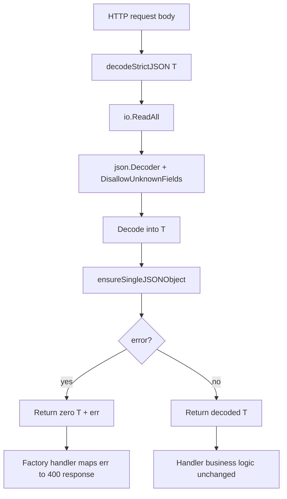

# PRD: Extract API Factory Strict JSON Decode Helper

---
author: Codex
last modified: 2026-05-31
status: draft
---

## Introduction

Customer ask `11` (backend `pkg/` duplication cleanup) advanced when PR `#512` consolidated factory CLI save/update paths and PR `#508` extracted shared work-write handler cores. Factory HTTP handlers in `pkg/api` still repeat the same strict JSON body-decode skeleton across four request decoders.

Each decoder reads the full body, constructs a `json.Decoder` with `DisallowUnknownFields`, decodes into a typed request, and enforces a single top-level JSON object. Two decoders already delegate trailing-decode enforcement to `ensureSingleJSONObject`; two still inline the same guard. `handlers_common.go` already owns `ensureSingleJSONObject` and `requestFieldValidationError`.

This PRD introduces one generic strict JSON decode helper and routes all four factory decoders through it **without changing HTTP status codes, error messages, or request validation behavior**.

## Context

### Customer ask

Consolidate duplicated strict JSON decode logic for factory handler request bodies so maintainers have one decode contract and factory endpoints keep identical validation behavior.

### Problem

Four factory body decoders (`decodeNamedFactoryBody`, `decodeOpenFactorySessionBody`, `decodeSaveCurrentFactoryBody`, `decodePromptTemplateValidationRequestBody`) duplicate the same read-decode-validate skeleton. Inline trailing-decode blocks in two decoders drift from the shared `ensureSingleJSONObject` helper used by the other two, increasing review cost and regression risk whenever strict-decode rules change.

### Solution

Add a generic `decodeStrictJSON[T any](body io.Reader) (T, error)` helper in `handlers_common.go` that reads the body, decodes with `DisallowUnknownFields`, calls `ensureSingleJSONObject`, and returns decode/validation errors unchanged for existing callers to map. Refactor the four factory decoders into thin typed wrappers. Lock behavior with direct HTTP response and validation-message assertions for the affected endpoints.

## Goals

- Provide one reusable strict JSON decode path for factory handler request bodies.
- Remove duplicated inline trailing-decode blocks from factory decoders.
- Preserve identical HTTP outcomes for valid payloads, unknown fields, malformed JSON, empty bodies, and multi-object payloads across all four factory decode call sites.
- Keep decode error mapping (`requestFieldValidationMessage` vs generic `"invalid request payload"`) unchanged at each handler.

## Project-Level Acceptance Criteria

- [ ] A generic strict JSON decode helper in `handlers_common.go` reads the full body, uses `DisallowUnknownFields`, and enforces a single top-level JSON object via `ensureSingleJSONObject`.
- [ ] All four factory decoders delegate to the shared helper and no longer duplicate the read-decode-trailing-guard skeleton inline.
- [ ] `POST /factory-validations`, `POST /factory-sessions`, `PUT /factory-sessions/{sessionId}/factory`, and `POST /factory-sessions/{sessionId}/factory/workstations/{workstationName}/prompt-template-validation` return the same status codes and error messages as today for valid payloads, unknown fields, malformed JSON, empty bodies, and multi-object payloads.
- [ ] Work submit/upsert decoders, model invocation decoders, and stage-submit decoders are untouched.
- [ ] No OpenAPI schema or generated contract changes.
- [ ] `go test ./pkg/api/...` passes with no weakened assertions.
- [ ] Typecheck, lint, and tests pass for all touched backend areas.

## User Stories

### US-001: Shared strict JSON decode helper

**Description:** As an API maintainer, I want one strict JSON decode helper so factory handlers enforce the same body rules from a single implementation.

**Acceptance Criteria:**

- [ ] `decodeStrictJSON[T any](body io.Reader) (T, error)` lives in `handlers_common.go`, reads the full request body, decodes with `DisallowUnknownFields`, and calls `ensureSingleJSONObject` after the primary decode.
- [ ] On success, the helper returns the decoded value with a nil error.
- [ ] On unknown JSON fields, the helper returns the same `json: unknown field ...` decode error the inline decoders produce today (no new wrapper type).
- [ ] On malformed JSON, empty body, or trailing non-EOF content after one object, the helper returns the same error shapes callers already map (including `requestFieldValidationError` with message `request payload must contain one JSON object` for multi-object payloads).
- [ ] Unit tests in `handlers_common_test.go` (or equivalent) exercise valid object, unknown field, malformed JSON, empty body, and multi-object inputs directly against the helper.
- [ ] Typecheck passes.
- [ ] Tests pass.

### US-002: Factory decoders delegate to shared helper

**Description:** As a reviewer, I want all four factory body decoders to be thin typed wrappers so strict-decode logic is not duplicated across `handlers_factory.go`.

**Acceptance Criteria:**

- [ ] `decodeNamedFactoryBody`, `decodeOpenFactorySessionBody`, `decodeSaveCurrentFactoryBody`, and `decodePromptTemplateValidationRequestBody` each call `decodeStrictJSON` with their existing request type and return its result unchanged.
- [ ] No factory decoder retains an inline trailing `decoder.Decode(&struct{}{})` block or duplicated read/decoder setup.
- [ ] Existing factory handler tests (`server_factory_test.go`, `server_factory_sessions_test.go`, and related) pass without assertion changes except where new coverage is intentionally added in US-003.
- [ ] Typecheck passes.
- [ ] Tests pass.

### US-003: Lock factory endpoint decode behavior with HTTP regression tests

**Description:** As an API consumer, I want factory endpoints to reject bad request bodies exactly as before so clients do not see silent validation drift after the refactor.

**Acceptance Criteria:**

- [ ] Table-driven HTTP tests cover payload edge cases for:
  - `POST /factory-validations` (factory validate)
  - `POST /factory-sessions` (open session)
  - `PUT /factory-sessions/~default/factory` (save current factory)
  - `POST /factory-sessions/~default/factory/workstations/{workstation}/prompt-template-validation` (prompt template validation)
- [ ] Each endpoint test matrix includes at minimum: valid minimal payload (success path where applicable), unknown top-level field (`400` with existing message behavior), malformed JSON (`400` + `"invalid request payload"` or field-specific message when applicable), empty body (`400`), and multi-object/array payload (`400` with `request payload must contain one JSON object` when that is today's behavior).
- [ ] Assertions use HTTP status, response `code`, and `message` fields — not file-layout or registration inventories.
- [ ] Typecheck passes.
- [ ] Tests pass.

## High-Level Technical Design

**Package ownership**

- `pkg/api/handlers_common.go`: generic decode helper, `ensureSingleJSONObject`, `requestFieldValidationError`, and error message extraction.
- `pkg/api/handlers_factory.go`: typed decoder wrappers and handler error mapping only — no duplicated decode skeleton.

**Error mapping (unchanged)**

| Decode outcome | Handler mapping (unchanged) |
|----------------|----------------------------|
| `requestFieldValidationError` | `400 BAD_REQUEST` with validation message |
| Other decode errors | `400 BAD_REQUEST` with `"invalid request payload"` |
| Save-current decode errors | `400 BAD_REQUEST` with validation targets including form factory payload target |

**State and side effects**

- Pure decode: no server state mutation; handlers retain existing runtime/session calls after decode succeeds.

## Functional Requirements

- FR-1: `decodeStrictJSON` must read the entire body before decoding (matching current factory decoders).
- FR-2: `decodeStrictJSON` must set `DisallowUnknownFields` on the decoder.
- FR-3: `decodeStrictJSON` must call `ensureSingleJSONObject` after the primary decode.
- FR-4: All four factory decoders must delegate to `decodeStrictJSON` without altering return types or error values.
- FR-5: Factory handlers must continue mapping decode errors through existing `requestFieldValidationMessage` checks and generic bad-request responses.
- FR-6: Regression tests must assert observable HTTP outcomes for the four factory endpoints listed above.

## Non-Goals

- Refactoring work submit/upsert decoders in `handlers_work_write.go`.
- Refactoring model invocation or stage-submit decoders in `handlers_models.go` / `handlers_work_read.go`.
- OpenAPI schema or generated API contract changes.
- CLI or service-layer refactors.
- Broad unrelated cleanup in `pkg/api` beyond the four factory decoders and their tests.

## Supporting Technical Considerations

- Prefer extending existing factory server tests over new test-file topology requirements.
- Keep the helper generic (`decodeStrictJSON[T]`) so future factory decoders can reuse it without copy-paste.
- Do not wrap JSON decode errors in new types; callers rely on `errors.As` against `requestFieldValidationError` and standard `json.SyntaxError` / unknown-field errors.
- Follow `docs/internal/standards/code/general-backend-standards.md` for package boundaries and test placement.

## Success Metrics

- Zero behavioral diffs in factory endpoint HTTP responses for the defined payload matrix.
- Four factory decoders reduced to single-expression wrappers around `decodeStrictJSON`.
- `go test ./pkg/api/...` green with added regression coverage for decode edge cases.
- No increase in duplicated strict-decode logic elsewhere in `handlers_factory.go`.

## Open Questions

None — scope and behavioral preservation requirements are explicit in the customer ask.
