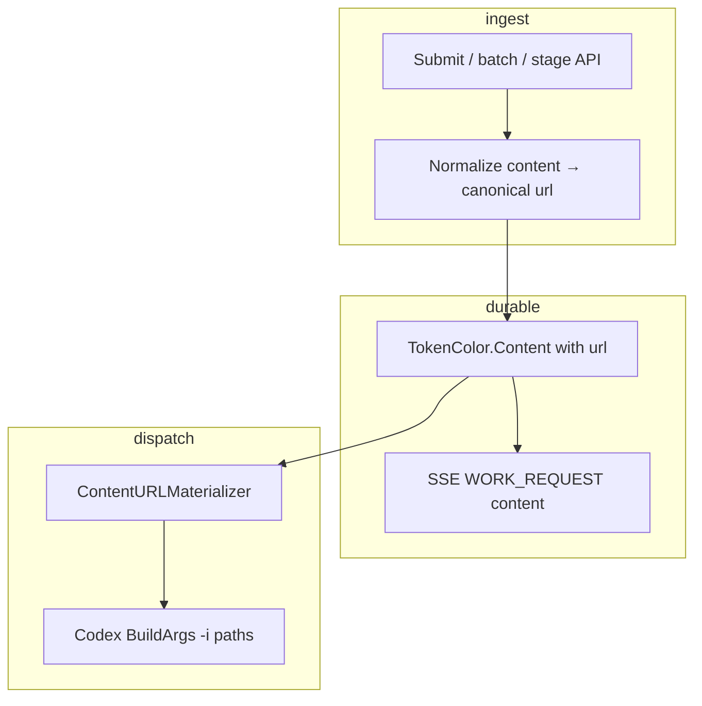

# PRD: Work content URL migration (multimedia without server file paths)

## Introduction

Canonical work `content` for image, audio, video, and binary parts today requires a **`file` string interpreted as a host-local path**. That works for factory-relative fixtures and for dashboard uploads after staging writes bytes to temp dirs, but it **does not work for API-only clients** that cannot place bytes on the factory host filesystem.

Operators and autonomous agents need to submit multimedia using **URLs** (local `file://`, remote `https://` / `http://`, and inline `data:`). The runtime must **materialize** those URLs to readable local paths at **dispatch time**—copying remote or inline bodies into bounded temp files when needed—while providers such as **Codex** continue to receive filesystem paths on CLI flags (`-i`).

This plan defines contract migration, a shared materialization layer, provider wiring, dashboard submit alignment, and regression tests. It complements `tasks/prd-website-work-payload-lineage.md`: lineage replays stored `content`; this work changes what clients put in `content` and how the backend resolves it at dispatch.

## Context

### Customer ask

Migrate image, audio, video, and binary work `content` from host-local `file` paths to canonical **`url`** references. Add dispatch-time **ContentURLMaterializer** so API clients can submit `file://`, `https://`, `http://`, and `data:` URLs without placing files on the factory host. Preserve dashboard staging while exposing resolvable `url` in canonical content and stage responses.

### Problem

| Client | Today | Gap |
|--------|-------|-----|
| Dashboard | Stage base64 → temp path → `content[].file` | Works only on same host |
| CLI / batch JSON | `file: "fixtures/foo.png"` | Requires checkout on server |
| Remote agent | No durable path | Cannot reference CDN/S3/assets |
| Codex | `-i <file>` from `content[].file` | Assumes path already exists |

Percent-encoding, `data:` URIs, and `file://` are not interpreted today; invalid paths fail at dispatch with opaque file errors.

### Solution

- Make **`url` the canonical reference** for file-backed content parts; deprecate bare `file` for API clients with ingest normalization during migration.
- **`pkg/workcontent/materialize`:** resolve `file://` in place (no copy), download `http(s)://` to bounded temp, decode `data:` to temp; SSRF guard and size/timeout limits; optional per-dispatch URL cache.
- **Dispatch-time materialization** in Codex (and shared hook for future audio/binary consumers); clear errors before subprocess start; inaccessible remote media marks work **failed**.
- **Stage API** continues uploads; responses and canonical content expose `url`, not opaque host paths.
- **Events** serialize `url` on content parts (not ephemeral temp paths).

## Project-level acceptance criteria

- [ ] API consumers can submit multimedia work items with `content[].url` using `file://`, `https://`, `http://`, and `data:` without writing bytes to the factory host (except via optional stage API).
- [ ] Legacy `file`-only parts are normalized to `url` at ingest; validation rejects empty `url`, unsupported schemes, and conflicting `url`+`file` on the same part.
- [ ] Dispatch-time materialization produces local paths for Codex `-i`; local `file://` uses the underlying path without copy; remote/inline use bounded temp files with cleanup after dispatch.
- [ ] Remote fetch failures surface as `media url inaccessible: <url> (<reason>)` before provider subprocess start; SSRF targets (e.g. `169.254.169.254`) are rejected by default.
- [ ] `WORK_REQUEST` / event history JSON carries `url` on content parts, not materialized temp paths.
- [ ] `docs/reference/work.md` documents URL submit examples and `file` deprecation for API clients.
- [ ] Typecheck, lint, and tests pass for touched backend, contract, and UI packages.

## Goals

- Make **`url` required** for file-backed content parts in the public contract (image, audio, binary; video submit maps per type rules).
- Support **local `file://`** without copy when readable on the factory host.
- Support **remote `http://` and `https://`** with bounded download, timeout, redirect limit, and clear failure when inaccessible.
- Support **inline `data:`** and retain stage API for large dashboard uploads (stage returns stable `url`).
- Preserve **Codex image behavior**: materialized path on `-i`; prompt on stdin.
- Add **automated tests** for materialization, ingest normalization, Codex arg assembly, API validation, and golden regressions (T1–T9).
- Align **dashboard submit** to use `url` from stage response.

## User stories

### US-001: OpenAPI and generated types for `url`

**Description:** As an API consumer, I submit multimedia using `content[].url` so I do not depend on server filesystem layout.

**Acceptance criteria:**

- [ ] `WorkImageContentPart`, `WorkAudioContentPart`, `WorkBinaryContentPart`, and related submit item schemas require `url`; `file` is deprecated with description pointing to `url`.
- [ ] Validation rejects empty `url`, unsupported schemes, and `url`+`file` conflicts on the same part.
- [ ] Codegen regenerated; Go and TypeScript compile.
- [ ] OpenAPI contract tests updated for new required fields and deprecation.
- [ ] Typecheck passes
- [ ] Tests pass

### US-002: Content URL materializer

**Description:** As the runtime, I resolve URLs to readable local paths with clear errors for local, remote, and data URLs.

**Acceptance criteria:**

- [ ] `pkg/workcontent/materialize` exposes `MaterializeContentURL(ctx, url, opts) (localPath, cleanup, err)`.
- [ ] Local `file://`: returns underlying path when readable; cleanup is no-op; no copy.
- [ ] Remote `https://` / `http://`: streams to temp with max bytes, timeout, redirect limit; returns `media url inaccessible: <url> (<reason>)` on 4xx/5xx/timeout/TLS failure.
- [ ] `data:` URLs decode to temp with size limit.
- [ ] SSRF guard rejects private/link-local/metadata IPs by default (`media url not allowed: <url> (ssrf)`).
- [ ] Optional per-dispatch cache: same URL materialized once when referenced by multiple tokens in one dispatch.
- [ ] Unit tests cover T1 (local ok), T2 (local missing), T3 (remote ok), T4 (404), T5 (timeout), T6 (data URL), T8 (SSRF); temp removed when cleanup runs.
- [ ] Typecheck passes
- [ ] Tests pass

### US-003: Submit and batch ingest with legacy normalization

**Description:** As an operator, I can submit work with remote or data URLs through `POST /work` and batch ingest, with legacy `file` normalized to `url`.

**Acceptance criteria:**

- [ ] `POST /work` and batch accept `content[].url` on multimedia items; examples and smoke paths use `url`.
- [ ] `normalizeWorkContent` maps legacy `file`-only parts to `url` (`file://` for absolute paths; relative resolved at materialization per documented rules); bare `file` is not persisted in canonical content.
- [ ] Stage API response includes `url` (e.g. `file://<absolute>`); submit with `stagedFileRef` still works.
- [ ] Staged-file submit path sets canonical `url` after resolve (not raw host path in customer-visible fields).
- [ ] Server submit and work-request tests cover url ingest and legacy normalization (T7).
- [ ] Typecheck passes
- [ ] Tests pass

### US-004: Codex dispatch materialization

**Description:** As a factory running Codex, image (and file-backed) inputs materialize correctly for `-i` flags before the provider subprocess starts.

**Acceptance criteria:**

- [ ] `codexImageArgs` uses materializer output paths instead of direct `os.Stat(part.File)`.
- [ ] Materialization errors surface before `commandExec.Run` (permanent bad request / failed work semantics for inaccessible media).
- [ ] Test: local `file://` → `-i` uses real path without extra copy.
- [ ] Test: `https://` httptest server → `-i` points at temp; inaccessible URL fails before runner (T3, T4).
- [ ] `TestScriptWrapProvider_Infer_CodexMissingImageFailsBeforeRunner` adapted for url-based parts.
- [ ] Audio/binary materializer hook stubbed or tested for future providers (no Codex change required if unused in v1).
- [ ] Typecheck passes
- [ ] Tests pass

### US-005: Golden fixtures and functional smoke

**Description:** As a maintainer, I have regression fixtures so URL materialization and Codex wiring cannot drift silently.

**Acceptance criteria:**

- [ ] Fixture JSON under `pkg/workcontent/materialize/testdata/` for representative URLs and expected outcomes.
- [ ] Event wire test: `WORK_REQUEST` after submit serializes `url`, not temp path (T9).
- [ ] Optional functional test: batch submit with `file://` + httptest remote URL, mock Codex runner asserts `-i` paths.
- [ ] CI runs new package tests on every PR.
- [ ] Typecheck passes
- [ ] Tests pass

### US-006: Dashboard stage → `url` submit path

**Description:** As a dashboard user, staged uploads produce `url` in canonical content so submit does not depend on opaque host paths.

**Acceptance criteria:**

- [ ] UI builds submit items using `url` from stage response (not raw staged path in public fields).
- [ ] Vitest for stage + submit client helpers updated for `url` field.
- [ ] Image submit from dashboard still reaches factory with resolvable `url` in submitted content.
- [ ] Typecheck passes
- [ ] Tests pass
- [ ] Verify in browser: stage upload → submit flow succeeds for image work item

## High-level technical design

| Layer | Responsibility |
|-------|----------------|
| OpenAPI / generated types | `url` required; `file` deprecated |
| Ingest handlers | Validation, legacy `file` → `url`, stage → `url` |
| `pkg/workcontent/materialize` | Single owner for URL resolution, SSRF, limits, cache |
| Provider (`codexImageArgs`) | Dispatch-time materialize → `-i` paths |
| Events | Persist `url` only; no temp paths |

**Materialization timing:** dispatch-time (provider preflight), not at submit, to avoid unbounded temp lifetime. **Temp lifecycle:** cleanup after dispatch completes.

**Resolved policy defaults:**

| Topic | Decision |
|-------|----------|
| Legacy `file` | Normalize to `url` at ingest; do not persist bare `file` |
| `http://` | Allowed by default (same guardrails as HTTPS) |
| Inaccessible remote media | Work **failed** (not dispatch rejected only) |
| Per-dispatch cache | Same URL materialized once when reused in one dispatch |

## Functional requirements

### Contract (OpenAPI + interfaces)

- **FR-1:** Add required `url` to `WorkImageContentPart`, `WorkAudioContentPart`, `WorkBinaryContentPart`; mark `file` deprecated.
- **FR-2:** `SubmitWork*Item` for image/video/audio/document accept `url` OR legacy `stagedFileRef` (stage returns `url`).
- **FR-3:** Validation rejects empty `url`, unsupported schemes, and `url`+`file` conflicts.
- **FR-4:** Handlers use `url` on validated parts; staged-file path sets `url` to `file://<absolute>` after resolve.

### Ingest normalization

- **FR-5:** `normalizeWorkContent` maps legacy `file`-only to `url` with documented resolution rules.
- **FR-6:** Batch and `POST /work` accept `content[].url` in examples and smoke tests.

### Materialization service

- **FR-7:** `MaterializeContentURL(ctx, url, opts) (localPath, cleanup, err)`.
- **FR-8:** Local `file://` — no copy; cleanup no-op.
- **FR-9:** Remote — stream to temp with max bytes, timeout, redirect limit.
- **FR-10:** `data:` — decode with size limit to temp.
- **FR-11:** SSRF guard — reject private/link-local/metadata unless `opts.AllowPrivateURLs` (test-only).

### Provider integration (Codex v1)

- **FR-12:** `codexImageArgs` uses materializer paths for `-i`.
- **FR-13:** Materialization errors before subprocess; inaccessible media → failed work.
- **FR-14:** Audio/binary parts share materializer for future providers (stub tests if unused in v1).

### Events and replay

- **FR-15:** Generated work / event history serialize `url`, not temp paths.
- **FR-16:** Payload-lineage snapshots clone `url` unchanged (no backend lineage change required).

### Documentation

- **FR-17:** Update `docs/reference/work.md` and batch input docs with URL examples; note `file` deprecation for API clients.

## Non-goals

- Enabling Cursor / Claude / Gemini image input in v1 (materialization only where providers consume files).
- CDN upload or presigned PUT from the factory.
- Content-addressed artifact store beyond temp materialization.
- Changing text or JSON content parts.
- Website timeline replay implementation (payload-lineage PRD); this work only ensures events carry `url`.

## Supporting technical and UX considerations

- **Security:** SSRF block for RFC1918, loopback, metadata IPs; max redirect count (3); max body 32 MiB default; redact credentials in logs.
- **Failure messages:** `media url inaccessible`, `media url not readable`, `media url not allowed`, `scheme not supported`.
- **Primary surfaces:** OpenAPI schemas, `pkg/workcontent/materialize`, work handlers, `work_request.go`, `provider_behavior.go`, `docs/reference/work.md`, dashboard stage/submit helpers.
- **Complements:** `tasks/prd-website-work-payload-lineage.md` should replay `url` in content once this ships.

## Test matrix (behavioral)

| # | Case | Input | Expected |
|---|------|-------|----------|
| T1 | Local file URL | `file:///abs/path/img.png` exists | Materialize returns path; Codex `-i` same path |
| T2 | Local missing | `file:///missing.png` | Error before provider run |
| T3 | Remote OK | httptest HTTPS | Temp file; `-i` temp; cleanup removes |
| T4 | Remote 404 | unreachable URL | `media url inaccessible`, no subprocess |
| T5 | Remote timeout | slow server | Timeout error, no subprocess |
| T6 | Data URL | small PNG data URL | Temp file; `-i` temp |
| T7 | Legacy file | `file: fixtures/a.png` ingest | Stored as `url`; behaves as T1 |
| T8 | SSRF | metadata/private IP URL | Rejected at materialize |
| T9 | Event wire | WORK_REQUEST after submit | JSON has `url`, not temp path |

## Success metrics

- API client can submit `WORK_REQUEST` with `https://` image url and Codex dispatch succeeds when URL is reachable—without writing to factory `fixtures/`.
- Zero regressions for existing `file://` / relative fixture paths used in tests.
- Materialize + Codex + ingest tests run in CI on every PR.

## Migration / rollout

1. Ship materializer + dual-read (`file` OR `url`) with normalization to `url`.
2. Update docs and OpenAPI examples to `url` only.
3. Switch dashboard to stage → `url` flow.
4. Remove `file` from required schemas in a later breaking release (release notes).
