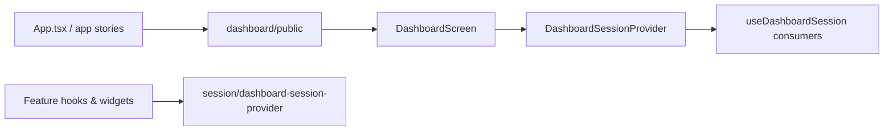

# PRD: Remove Dashboard Session Hook Re-exports From Public

---
author: Codex
last modified: 2026-05-31
status: draft
---

## Introduction

Website re-export cleanup advanced when dashboard stream/timeline hooks were split and session scope context landed. Production and feature-local code already import `DashboardSessionProvider` and `useDashboardSession` from `dashboard/session/dashboard-session-provider` directly.

`ui/src/features/dashboard/public/index.ts` still re-exports the session provider and hook even though the only `dashboard/public` consumers (`App.tsx` and app-level Storybook stories) import `DashboardScreen` alone. This PRD narrows the dashboard public boundary to the screen-only surface without changing dashboard session runtime behavior.

## Goals

- Make `features/dashboard/public` the app composition entry for `DashboardScreen` only.
- Remove dead session-provider and hook relay exports from the public barrel.
- Keep dashboard session behavior unchanged for operators using the app and Storybook.
- Prove the narrowed boundary with behavioral tests, not export inventories.

## User Stories

### US-001: Screen-only dashboard public barrel

**Description:** As an app composer, I want `features/dashboard/public` to expose only the dashboard screen so cross-feature imports do not accidentally depend on session internals through a compatibility barrel.

**Acceptance Criteria:**

- [x] `ui/src/features/dashboard/public/index.ts` exports only the dashboard screen surface (via `export * from "../components/dashboard-screen"` or equivalent); named re-exports of `DashboardSessionProvider` and `useDashboardSession` are removed.
- [x] `DashboardScreen` remains importable from `features/dashboard/public` with the same component API as before.
- [x] Typecheck passes

### US-002: Dashboard public import boundary

**Description:** As a maintainer, I want every consumer of `features/dashboard/public` to import only screen-related symbols so session scope stays on the direct session module.

**Acceptance Criteria:**

- [x] Every `from ".../features/dashboard/public"` import in `ui/` resolves to `DashboardScreen` (or another screen-only symbol re-exported from `dashboard-screen`, if any); no file imports `DashboardSessionProvider` or `useDashboardSession` from the public barrel.
- [x] Any straggler that imported session symbols from `dashboard/public` is retargeted to `features/dashboard/session/dashboard-session-provider`.
- [x] Typecheck passes
- [x] Tests pass

### US-003: Behavioral smoke for app composition through public barrel

**Description:** As a maintainer, I want regression coverage that the public barrel still composes a working dashboard with active session context, without asserting export lists.

**Acceptance Criteria:**

- [ ] A focused test imports `DashboardScreen` from `features/dashboard/public`, renders it with existing dashboard test providers/fixtures, and asserts an observable dashboard shell outcome (for example loading status copy, header region, or session tab chrome)—not a static list of barrel export names.
- [ ] If a pre-existing public-barrel inventory test asserted the old session relay exports, it is removed or replaced by the behavioral smoke above; do not add export-name inventories as the primary proof.
- [ ] Existing app-shell and `DashboardScreen` tests that exercise `App` → `DashboardScreen` continue to pass without changing session selection, pause, or stream behavior.
- [ ] Typecheck passes
- [ ] Tests pass
- [ ] Verify in browser using dev-browser skill: app-level Storybook story that imports `DashboardScreen` from `features/dashboard/public` still renders the dashboard shell.

## Functional Requirements

- FR-1: `features/dashboard/public` is the supported cross-feature import path for `DashboardScreen` used by `App.tsx` and app-level Storybook stories.
- FR-2: `DashboardSessionProvider` and `useDashboardSession` remain available from `features/dashboard/session/dashboard-session-provider` for feature-local and test code; behavior is unchanged.
- FR-3: `DashboardScreen` continues to wrap its content with `DashboardSessionProvider` internally; app composers do not need to add the provider at the app shell.
- FR-4: No changes to session store semantics, session tab UI, SSE stream wiring, or snapshot composition.

## Non-Goals

- Retargeting `current-factory-definition/public` hook vs API-type consumers.
- Mutation-dialog or current-activity-card inline-class work.
- Backend `pkg/` cleanup (`submit` clihttp, API handler cores).
- Broader public-barrel sweeps across other features.
- Moving `useDashboardSnapshot` or other dashboard hooks onto the public barrel.

## High-Level Technical Design

The change is a boundary tightening, not a session refactor.

1. **Public barrel** — `dashboard/public/index.ts` forwards only `dashboard-screen` exports. Session wiring stays in `dashboard-session-provider.tsx`, already used by hooks, bento, submit-work, and tests.
2. **App composition** — `App.tsx` and Storybook app stories keep importing `DashboardScreen` from `dashboard/public`; they never needed the session re-exports because `DashboardScreen` mounts `DashboardSessionProvider` internally.
3. **Verification** — Prefer behavioral smoke (render `DashboardScreen` from public, assert visible shell/session chrome) and existing `renderApp` / `renderAppWithDashboardShell` coverage over barrel export inventories.

## Supporting Technical and UX Considerations

- Internal guidance in `docs/internal/processes/development-guide-relevant-files.md` already documents `dashboard/public` as screen-only; implementation should match that seam.
- Biome import-boundary rules for `useDashboardSession` vs direct `dashboardSessionStore` access remain unchanged.
- Session-scoped API paths and pause semantics must not regress; this work must not alter `dashboard-session-provider.tsx` or store logic unless a test failure reveals an accidental coupling through the removed re-exports (none expected today).

## Success Metrics

- Zero imports of session symbols from `features/dashboard/public`.
- App and focused dashboard tests pass without session-behavior diffs.
- Maintainers have one obvious import path for session scope (`dashboard/session/dashboard-session-provider`) and one for app shell composition (`dashboard/public` → `DashboardScreen`).

## Project-Level Acceptance Criteria

- [ ] `ui/src/features/dashboard/public/index.ts` exports only the intended public dashboard screen surface.
- [ ] All `ui/` imports from `features/dashboard/public` are screen-related (`DashboardScreen` only with current consumers).
- [ ] Dashboard session selection, pause, and stream/snapshot behavior are unchanged in automated tests.
- [ ] Behavioral smoke proves `DashboardScreen` imported from the public barrel renders a working dashboard shell with session context.
- [ ] No new export-inventory tests are introduced as the primary acceptance mechanism for this change.
- [ ] Quality gate: `bun run lint`, UI typecheck, and focused dashboard/app-shell tests pass.

## Open Questions

None. Consumers and internal docs already align on a screen-only public boundary; implementation is removal of dead re-exports plus behavioral verification.
