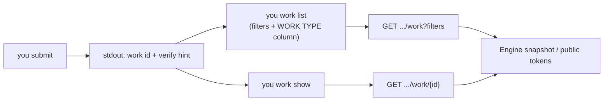

# PRD: CLI Work Inspection v3 (`you work list` / `you work show`)

## Introduction

After `you submit`, agents and operators need to confirm that work was created with the
expected **work type** and **state** without paging through an opaque table or parsing
full JSON by hand. Today `you work list` prints work id, name, state, and relations but
omits **work type** in the default human table. List filtering is limited to state name,
state type, and sort; there are no flags to narrow results by submitted name, work type,
or trace. There is no `you work show` command for a single-item summary after submit.

This plan implements the CLI work inspection improvements described in
[`tasks/prd-cli-work-inspection.md`](../prd-cli-work-inspection.md). It closes the
submit → verify loop together with
[`tasks/prd-cli-submit-response-contract.md`](../prd-cli-submit-response-contract.md)
(submit prints ids and hints) and is referenced by the wave-2 agents verify step in
[`tasks/prd-docs-agents-consolidation-wave2.md`](../prd-docs-agents-consolidation-wave2.md).

**Intent:** Make post-submit verification fast, scriptable, and trustworthy from the CLI
alone.

## Goals

- Default `you work list` human output includes a **work type** column (`workTypeName`).
- `you work list` supports `--name`, `--work-type-name`, and `--trace-id` filters with
  documented semantics and pagination behavior.
- New `you work show <work-id>` prints a concise human summary (or one JSON object with
  `--json`) for a single work item.
- Behavior is covered by CLI and API tests that assert observable stdout, exit codes,
  and HTTP query/response outcomes—not registration inventories.

## Project-level acceptance criteria

- [ ] Running `you work list` against a factory with work items shows a `WORK TYPE`
  column populated from each item's `workTypeName`.
- [ ] `you work list --name`, `--work-type-name`, and `--trace-id` return only matching
  items; help text explains match rules and interaction with `--max-results` /
  `--next-token`.
- [ ] `you work show <id>` prints work id, name, work type, state name/type, trace id,
  and relation summary; missing ids exit non-zero with a clear error; `--json` emits one
  work-shaped object.
- [ ] Commands honor `--session` the same way as existing `you work list`.
- [ ] Quality gate: Go typecheck, lint, and relevant tests pass for touched packages.

## User Stories

### cli-work-inspection-v3-001: Work type column on `you work list`

**Description:** As an agent verifying a submit, I want work type visible in the default
list table so I can confirm the correct work type without `--json`.

**Acceptance Criteria:**

- [ ] Human table header includes `WORK TYPE` between name and state columns (or another
  stable order documented in command help); each row prints `workTypeName` or empty when
  absent.
- [ ] Existing columns (`WORK ID`, `NAME`, `STATE NAME`, `STATE TYPE`, `RELATIONS`)
  remain tab-aligned and populated as today.
- [ ] Global `you --json work list` continues to encode `ListWorkResponse`; each result
  still includes `workTypeName` when the API provides it.
- [ ] CLI test updates assert the human header contains `WORK TYPE` and a row shows the
  expected work type for a mocked response.
- [ ] Typecheck passes.
- [ ] Tests pass.

### cli-work-inspection-v3-002: Server-side list filters for name, work type, and trace

**Description:** As a maintainer, I need list-work query parameters and handler filtering
so CLI filters are correct across pagination and do not depend on client-side truncation.

**Acceptance Criteria:**

- [ ] OpenAPI `GET /work` and session-scoped list routes accept optional query parameters:
  `name` (substring, case-sensitive per existing API string conventions),
  `workTypeName` (exact match), and `traceId` (exact match on `traceId` or
  `currentChainingTraceId` when present).
- [ ] Generated server code applies filters in `workMatchesListFilters` (or equivalent)
  before pagination so pages contain only matching items.
- [ ] API tests prove: `--work-type-name` equivalent filters out other types; name
  substring retains partial matches; trace id returns only the matching item.
- [ ] Invalid filter combinations return `400` only when the contract defines rejection
  (no new spurious 400s for empty filter values).
- [ ] Typecheck passes.
- [ ] Tests pass.

### cli-work-inspection-v3-003: CLI flags for list filters

**Description:** As an agent, I want to run `you work list --name …`,
`--work-type-name …`, or `--trace-id …` so I can find submitted work immediately after
`you submit`.

**Acceptance Criteria:**

- [ ] `you work list` exposes `--name`, `--work-type-name`, and `--trace-id` flags mapped
  to the list-work query parameters from story 002.
- [ ] Command help documents: substring semantics for `--name`, exact match for
  `--work-type-name` and `--trace-id`, and that pagination applies after server filtering.
- [ ] Verbose stderr diagnostics include active filter keys in the existing filter summary
  (no full response bodies).
- [ ] CLI httptest covers at least `--work-type-name` and `--name` query forwarding and
  filtered human output.
- [ ] Typecheck passes.
- [ ] Tests pass.

### cli-work-inspection-v3-004: `you work show` for one work item

**Description:** As an agent, I want `you work show <work-id>` so I can inspect one item
after submit without listing and scanning pages.

**Acceptance Criteria:**

- [ ] `you work show <work-id>` is registered under `you work` with the same
  `--session` routing as `you work list` (default compatibility session when omitted).
- [ ] Command calls `GET /work/{id}` or session-scoped `GET
  /factory-sessions/{session_id}/work/{id}` using the shared CLI HTTP patterns in
  `pkg/cli/work`.
- [ ] Human stdout includes labeled lines (or a compact table) for: work id, name, work
  type, state name, state type, trace id, and relation count or the same relation summary
  format used by `you work list`.
- [ ] Unknown or non-public ids exit non-zero; stderr carries a clear not-found message;
  stdout stays empty unless `--json` is set (then emit structured error only if existing
  CLI conventions do so—prefer empty stdout on failure).
- [ ] `you --json work show <id>` prints one JSON object with fields:
  `workId`, `name`, `workTypeName`, `state`, `traceId`, and `relations` aligned with
  list/show API shapes (map `TokenResponse.workType` to `workTypeName` in JSON output).
- [ ] CLI tests cover success human output, success JSON shape, and not-found exit code.
- [ ] Typecheck passes.
- [ ] Tests pass.

## Functional Requirements

- FR-1: `you work list` and `you work show` target the default compatibility session
  unless `--session` is set, matching existing work commands.
- FR-2: Diagnostics and verbose output stay on stderr per CLI standards; human stdout
  remains machine-friendly tables or labeled fields, not debug payloads.
- FR-3: List and show reuse `pkg/cli/cliserver`, `pkg/cli/sessionpath`, and
  `pkg/cli/clidiag` patterns established by `you work list`.
- FR-4: List filters are server-side; the CLI must not silently drop matches beyond the
  first page without documenting pagination (use existing `--max-results` / `--next-token`).
- FR-5: `you work show` accepts work or token ids accepted by the API `WorkOrTokenID`
  parameter.

## Non-Goals

- `you dispatch list` or dispatch history (see
  [`tasks/prd-cli-dispatch-list.md`](../prd-cli-dispatch-list.md)).
- Factory session inventory commands (see
  [`tasks/prd-cli-factory-session-list.md`](../prd-cli-factory-session-list.md)).
- Dashboard or UI work browser changes.
- Rewriting submit success output (see submit response contract PRD).
- Authoring or restructuring `you docs agents` in this lane (handled by docs wave-2 PRD;
  this work only needs to match the verify commands documented there).

## High-level technical design

1. **List presentation (001):** Extend `renderListResult` in `pkg/cli/work` to add the
   work type column; adjust tests' golden strings.
2. **API filters (002):** Add OpenAPI parameters; regenerate bindings; extend
   `workMatchesListFilters` in `pkg/api` for name, work type, and trace matching.
3. **CLI filters (003):** Extend `ListConfig`, `listEndpoint`, and cobra flags in
   `pkg/cli/root.go` / `pkg/cli/work`.
4. **Show command (004):** New `Show` function in `pkg/cli/work` calling get-work;
   normalize `TokenResponse` into human and JSON views consistent with list output.

## Supporting technical considerations

- `Work.workTypeName` is already present on list API results; column work is CLI-only.
- Trace matching should consider both `traceId` and `currentChainingTraceId` on `Work`
  so submit traces remain discoverable after chaining fields populate.
- `GET /work/{id}` returns `TokenResponse`; human show output should label work type
  consistently with list (`workTypeName` terminology) even when the API field is
  `workType`.
- Regenerate OpenAPI Go types after contract changes (`make` targets used elsewhere in
  the repo).

## Success metrics

- After submit, an agent can confirm work type and state in one command (`you work show`)
  or one filtered list (`you work list --name <name>`) without manual JSON parsing.
- CLI work package tests fail if the work type column or filter query params regress.
- No increase in default list command latency beyond one additional string column render.

## Open Questions

_None for implementation start._ Filter semantics and show field set are defined above;
docs cross-linking ships in the docs wave-2 PRD.
