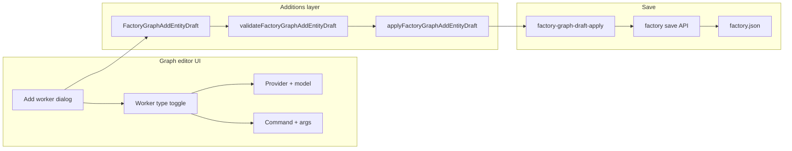

# PRD: Add Script Worker Option in Factory Worker Add Flow

## Introduction

The factory graph editor **Add worker** dialog always creates `MODEL_WORKER` entries with model provider and model fields. Operators who need command-driven workers (`SCRIPT_WORKER`) must hand-edit `factory.json` or use worker detail editing after the fact. This project extends the add-worker flow so customers can choose **model worker** or **script worker** at creation time, capture the right fields for each type, and persist the choice through the existing graph-editor save path into `factory.json`.

## Context

### Customer ask

- Add-worker flow toggles between model worker and script worker.
- Script worker captures **command** and **args**.
- Model worker captures **model provider** and **model**.
- Persisted `factory.json` reflects the chosen worker type.

### Problem

`createFactoryGraphAddEntityDraft`, `validateFactoryGraphAddEntityDraft`, and `applyFactoryGraphAddEntityDraft` in the factory graph editor additions layer only model `model` / `modelProvider` on the worker draft and always emit `type: "MODEL_WORKER"`. The add dialog renders only model-provider and model inputs. Script workers are already supported in the canonical factory contract, worker detail editing (`worker-editable-configuration-section`), and runtime loading—but not when adding a worker from the graph toolbar.

### High-level solution

1. Extend the worker add draft with a **worker type** discriminator (`MODEL_WORKER` | `SCRIPT_WORKER`) plus script fields (`command`, `argsText`).
2. Validate and apply additions using the same canonical shapes and arg parsing conventions as worker editing (`parseWorkerArgsText`, optional model on model workers, required model provider for model workers, required command for script workers).
3. Update the add dialog to show a type toggle and **conditionally render** model vs script fields, reusing existing worker detail messages where possible.
4. Prove behavior with focused unit tests on draft apply/validation, dialog interaction tests, and a save-path test that a script worker addition round-trips into the pending factory definition consumed by save.

## Goals

- Operators can add either a model worker or a script worker from the graph editor without leaving the UI.
- Only fields relevant to the selected worker type are shown and validated.
- Saved factory documents include `type`, and for script workers `command` / `args`, matching existing `SCRIPT_WORKER` examples in the repo.
- Model-worker add behavior (provider required, optional model) remains unchanged when model type is selected.

## Project-level acceptance criteria

- [ ] **Add worker** dialog includes a control to choose **Model worker** vs **Script worker** (default: model worker).
- [ ] Model worker path shows model provider (required) and model (optional); submitting adds a worker with `type: "MODEL_WORKER"` and the captured provider/model fields.
- [ ] Script worker path shows command (required) and args (optional, newline-separated lines); submitting adds a worker with `type: "SCRIPT_WORKER"`, `command`, and `args` when provided.
- [ ] Switching worker type in the dialog hides the other type's fields and does not leave stale model or script values on the applied addition.
- [ ] After graph save, the persisted factory definition (and resulting `factory.json` on disk) contains the new worker with the selected `type` and type-specific fields.
- [ ] Newly added script workers can be assigned to workstations (including poller behavior validation that already requires script or hosted workers).
- [ ] Automated tests cover draft validation/apply, dialog field visibility, and save-input projection for script workers.
- [ ] UI typecheck, lint, and affected tests pass.

## User Stories

### issues2-factory-worker-add-script-toggle-001: Worker add draft supports model and script types

**Description:** As a maintainer, I need the graph editor worker-add draft and apply logic to understand both model and script workers so additions persist the correct canonical worker shape.

**Acceptance Criteria:**

- [ ] `FactoryGraphAddEntityDraft` for `kind: "worker"` includes `workerType: "MODEL_WORKER" | "SCRIPT_WORKER"` (default `MODEL_WORKER`), plus `command` and `argsText` for script workers.
- [ ] `createFactoryGraphAddEntityDraft("worker", …)` seeds `workerType: "MODEL_WORKER"` with empty script fields.
- [ ] `validateFactoryGraphAddEntityDraft` requires `modelProvider` only when `workerType` is `MODEL_WORKER`; requires non-empty `command` when `workerType` is `SCRIPT_WORKER`; rejects `argsText` containing null bytes (same rule as editable worker validation).
- [ ] `applyFactoryGraphAddEntityDraft` appends `MODEL_WORKER` with `modelProvider` / optional `model` for model type, and `SCRIPT_WORKER` with `command` and optional `args` (parsed via `parseWorkerArgsText`) for script type.
- [ ] `factory-graph-editor-additions.test.ts` covers model-only, model+model, script command-only, and script command+args apply results.
- [ ] Typecheck passes
- [ ] Tests pass

### issues2-factory-worker-add-script-toggle-002: Add-worker dialog toggles fields by worker type

**Description:** As a factory author, I want to pick model vs script worker when adding a worker so I only see fields that apply to my choice.

**Acceptance Criteria:**

- [ ] Add worker dialog shows a **Worker type** control with **Model worker** and **Script worker** options (not hosted worker in this flow).
- [ ] Model worker selected: shows model provider select and model text field (current behavior); script command/args fields are not visible.
- [ ] Script worker selected: shows command text field and args textarea (one argument per line, matching worker detail editing); model provider/model fields are not visible.
- [ ] Changing worker type clears validation errors and field values belonging to the deselected type so the submitted draft does not mix model and script data.
- [ ] Field labels and help reuse `getWorkerDetailMessages` (or equivalent localized strings) for provider, model, command, and args.
- [ ] `factory-graph-editor-add-dialog.test.tsx` covers toggling visibility and onChange payloads for both types.
- [ ] Typecheck passes
- [ ] Tests pass
- [ ] Verify in browser using dev-browser skill: open graph editor → Add → Worker → toggle types and confirm only the relevant fields appear

### issues2-factory-worker-add-script-toggle-003: Save path persists script workers into factory.json

**Description:** As a factory author, I want a script worker I add from the graph editor to appear in the saved factory document with `SCRIPT_WORKER`, `command`, and `args` so runtime and other editors see the same definition.

**Acceptance Criteria:**

- [ ] Adding a script worker through the graph editor and saving produces a pending/applied factory definition whose `workers` entry includes `type: "SCRIPT_WORKER"`, the trimmed `command`, and `args` array when args lines were provided.
- [ ] `factory-graph-save-input.test.ts` or an equivalent focused test asserts save payload / applied definition includes a newly added script worker (extend existing `SCRIPT_WORKER` fixture patterns).
- [ ] After save in a dev environment, `factory.json` on disk lists the new worker with `type: "SCRIPT_WORKER"` and captured `command` / `args` (manual spot-check acceptable if automated save-to-disk test is impractical).
- [ ] A script worker added via this flow can be selected as **Assigned worker** when adding a poller workstation without triggering the existing poller/script validation error.
- [ ] Typecheck passes
- [ ] Tests pass

### issues2-factory-worker-add-script-toggle-004: Copy and menu text reflect both worker kinds

**Description:** As a factory author reading the add menu, I want descriptions to mention both model and script workers so the capability is discoverable.

**Acceptance Criteria:**

- [ ] Factory graph editor add-menu copy for **Worker** describes adding a reusable model **or** script worker (localized strings in `editor.ts` message catalogs).
- [ ] Add dialog description for worker kind matches the dual-type behavior.
- [ ] `editor.test.ts` (or message catalog coverage test) updated for changed strings.
- [ ] Typecheck passes
- [ ] Tests pass

## Functional Requirements

- **FR-1:** Worker add draft carries `workerType` with allowed values `MODEL_WORKER` and `SCRIPT_WORKER` only in this flow.
- **FR-2:** Model worker add requires a selected model provider; model identifier remains optional.
- **FR-3:** Script worker add requires a non-empty command; args are optional and entered as newline-separated lines converted to a string array on apply.
- **FR-4:** Applied draft additions set `type` to the selected worker type and omit model fields on script workers and omit command/args on model workers.
- **FR-5:** Add dialog conditionally renders fields; inaccessible fields are not validated.
- **FR-6:** Graph save merges additions into the factory document using existing draft-apply and save pipelines without new backend endpoints.

## Non-Goals

- Adding **hosted workers** from the graph add dialog (remain edit-only / hand-authored).
- Changing worker **edit** configuration UX, localization sweep (`issues2-localization-zh`), or workstation type-specific editing variants.
- Backend/OpenAPI schema changes (Worker model already supports `command`, `args`, and `SCRIPT_WORKER`).
- CLI `you init` or non-graph factory authoring flows.
- Script **body**-only workers in the add flow (edit flow may still allow command-or-body; add flow follows customer ask: command + args).

## High-level technical design

**Ownership:** Changes stay in `ui/src/features/factory-graph-editor/` (additions + add dialog + messages) with reuse from `ui/src/features/current-factory-definition/lib/worker-editable-values.ts` (`parseWorkerArgsText`) and `ui/src/features/current-selection/worker-selection/messages/worker-detail.ts`.

**Validation alignment:** Mirror editable worker rules where practical—model provider required for model workers; command required for script workers; args parsed with `parseWorkerArgsText`. Do not require script `body` in the add flow.

**State:** Worker type and field values live only in the ephemeral add-entity draft until submit; no new global stores.

## Supporting technical and UX considerations

- Use accessible radio group or select for worker type with labels from `localizeWorkerType` / worker detail messages.
- Args textarea should document one-argument-per-line behavior in help text (consistent with worker edit panel).
- Preserve existing duplicate-name and empty-identifier validation.
- When switching `workerType`, reset deselected-type fields in `onChange` to avoid accidental mixed payloads.
- No broad refactors of add dialog layout beyond the worker branch.

## Success metrics

- Operators can create a script worker from the graph editor in one dialog without manual JSON edits.
- Zero regressions in model-worker add tests and poller workstation validation.
- Saved factories containing script workers added via UI load and execute like hand-authored `SCRIPT_WORKER` entries.

## Open Questions

None—customer acceptance criteria and existing worker edit patterns define scope.
