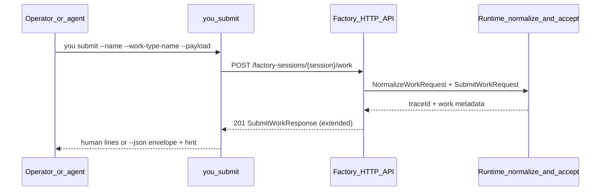

# PRD: CLI Submit Response Contract (`you submit`)

---
author: Codex
last modified: 2026-05-30
status: draft
work-item: batch-request-b8e7cd2f426dfb741e49b31aef9753d4-cli-submit-response-contract
---

## Introduction

`you submit` posts a single work item to a running factory session and today prints only `Submitted work: <traceId>` on success (or encodes the raw `SubmitWorkResponse` object under `--json`). Operators and autonomous agents cannot tell which **work id**, **name**, or **work type** were accepted without immediately running `you work list`. That gap caused duplicate ingress attempts and missed verification during the docs PRD submission exercise.

This project makes successful submit output **actionable** (human and `--json`), clarifies failure modes (transport vs API rejection), extends the HTTP contract when needed so `workId` is available at `201`, and documents the submit → verify loop alongside [`prd-cli-work-inspection.md`](../prd-cli-work-inspection.md) and [`prd-docs-agents-consolidation-wave2.md`](../prd-docs-agents-consolidation-wave2.md).

## Context

| | |
|---|---|
| **Customer ask** | After `you submit`, stdout/`--json` must identify the created work and suggest the next inspection command; errors must distinguish unreachable factory vs API rejection. |
| **Concrete problem** | Success output exposes only `traceId`; `SubmitWorkResponse` OpenAPI schema requires only `traceId`; agents re-submit or poll blindly. |
| **High-level solution** | Return stable work identifiers from the submit API where normalization already assigns them; shape CLI human/JSON output around those fields plus session/route context; improve bounded error text; document verify commands in `you docs work`. |

## Project-level acceptance criteria

- [ ] On HTTP `201`, human-mode stdout includes submitted **name**, **workTypeName**, **traceId**, and **workId** when the API returns it; otherwise it states the list-by-name fallback explicitly.
- [ ] Human-mode stdout prints a one-line next-step hint: `you work show <work-id>` when `workId` is present, else `you work list --name <name>` (aligned with work-inspection filters).
- [ ] `--json` on success emits one object with `workId`, `name`, `workTypeName`, `traceId`, `sessionId`, and `endpointPath`; exit code `0`.
- [ ] Non-success paths never print the success confirmation line; transport failures and API failures are distinguishable by message shape.
- [ ] OpenAPI `SubmitWorkResponse` and generated Go/TS types include new fields when the API is extended; contract tests updated.
- [ ] `you docs work` documents the submit success and verify loop; cross-links work-inspection commands.
- [ ] Quality gate: backend typecheck, lint, and targeted CLI/API tests pass without unrelated refactors.

## Goals

- Human-mode success prints actionable identifiers and a suggested follow-up command.
- `--json` success is stable for scripts and agents (not only the generated API DTO).
- Errors distinguish factory unreachable (transport) vs HTTP API rejection with bounded body summary.
- API `201` body exposes `workId`, `name`, and `workTypeName` using the same normalization rules as ingress (no second id scheme).
- Documentation tells agents to submit → verify with `you work show` / `you work list --name`.

## User Stories

### US-001: Submit API returns work identifiers on 201

**Description:** As an API consumer, I need `SubmitWorkResponse` to include the accepted work identifiers so CLI and UI do not guess after submit.

**Acceptance Criteria:**

- [ ] OpenAPI `SubmitWorkResponse` adds `workId`, `name`, and `workTypeName` (required when a single work item is accepted); `traceId` remains required.
- [ ] Session-scoped submit (`POST /factory-sessions/{sessionId}/work`) includes `sessionId` in the response body matching the path parameter (default label `~default` for the legacy `/work` route).
- [ ] `pkg/api` submit handlers populate fields using the same `WorkRequest` normalization path that assigns `batch-{requestId}-{name}` (or caller-provided `workId`) before returning `201`.
- [ ] API unit/contract tests assert the JSON body shape for default and session-scoped submit on success.
- [ ] Regenerated `pkg/api/generated` and UI OpenAPI types compile; no handwritten duplicate DTOs in handlers.
- [ ] Typecheck passes
- [ ] Tests pass

### US-002: Human success output for `you submit`

**Description:** As an operator, I want submit to tell me what was accepted and what command to run next so I can verify without listing the whole factory.

**Acceptance Criteria:**

- [x] On `201`, stdout includes at minimum: trimmed submitted **name**, **workTypeName**, **traceId**, and **workId** when the response includes it.
- [x] When `workId` is present, stdout includes a one-line hint containing `you work show <work-id>`; when absent, the hint uses `you work list --name <name>` and states that work id was not returned.
- [x] Stdout does not dump the full HTTP response body or request payload.
- [x] Existing verbose diagnostics remain on stderr only (`clidiag`); payload content is not logged on success paths.
- [x] CLI tests with `httptest` mock `201` responses assert human stdout lines and hint selection.
- [x] Typecheck passes
- [x] Tests pass

### US-003: JSON success output for `you submit --json`

**Description:** As a script, I want a single parseable confirmation object so I can branch on `workId` without scraping text.

**Acceptance Criteria:**

- [ ] Global `--json` success emits one JSON object with keys: `workId`, `name`, `workTypeName`, `traceId`, `sessionId`, `endpointPath` (CLI-scoped path such as `/factory-sessions/~default/work`).
- [ ] Omitted or empty `workId` is encoded as JSON `null` or omitted consistently (document the chosen rule in `you docs work`).
- [ ] Exit code `0` on success; stdout contains only the JSON object (no extra prose).
- [ ] CLI test asserts JSON shape from a mocked `201` response including session-scoped route.
- [ ] Typecheck passes
- [ ] Tests pass

### US-004: Clear submit error surfaces

**Description:** As an agent, I want duplicate, invalid, or unreachable submit attempts to fail with messages I can classify without mistaking them for success.

**Acceptance Criteria:**

- [ ] When `http.Post` fails (connection refused, timeout, DNS), the error message states the factory is not reachable at the resolved URL and does not print a success line.
- [ ] When HTTP status is not `201`, stderr/returned error includes HTTP status and a bounded API summary (`ErrorResponse.message` when JSON parses; otherwise a capped raw snippet).
- [ ] If the error JSON body includes `workId` (present or added on conflict responses), the CLI error text appends it in a stable `workId=` form.
- [ ] No `Submitted work:` or JSON success object is written on failure.
- [ ] CLI tests cover at least: unreachable server, `400` with `ErrorResponse`, and non-JSON error body.
- [ ] Typecheck passes
- [ ] Tests pass

### US-005: Document submit output and verify loop

**Description:** As an agent author, I want packaged docs to describe the submit contract and the verify commands that follow.

**Acceptance Criteria:**

- [ ] `you docs work` includes a **CLI submit success** subsection listing human fields, `--json` keys, and example success objects.
- [ ] The same section documents the verify loop: `you work show <work-id>` or `you work list --name <name> --work-type-name <type>` (cross-reference work-inspection PRD behavior).
- [ ] Docs state that diagnostics and verbose output stay on stderr; payloads are never echoed on success.
- [ ] `pkg/cli/docs` test coverage updated if topic text assertions exist for `work`.
- [ ] Typecheck passes
- [ ] Tests pass

## Functional Requirements

- **FR-1:** Extend `SubmitWorkResponse` in OpenAPI and propagate through codegen to Go (`factoryapi.SubmitWorkResponse`) and UI generated types.
- **FR-2:** Populate response fields in `pkg/api` submit handlers from normalized submit metadata (`requestId`, work name, work type, trace, session).
- **FR-3:** `pkg/cli/submit` maps API response + `SubmitConfig` (`SessionID`, scoped path) into human lines and the stable `--json` envelope.
- **FR-4:** If the API cannot return `workId` for a documented edge case, human and JSON output must use the list-by-name fallback and docs must say so; prefer fixing normalization over leaving the gap.
- **FR-5:** Error formatting reuses existing `ErrorResponse` parsing; optional `workId` in error JSON is best-effort without requiring schema changes in this lane unless needed for conflict cases.
- **FR-6:** Align verify hints with [`prd-cli-work-inspection.md`](../prd-cli-work-inspection.md) (`--name`, `--work-type-name`, `you work show`).

## Non-Goals

- Changing submit HTTP routes, session model, or request body schema beyond `SubmitWorkResponse`.
- Batch submit via `you submit` (batch remains file ingest, API batch, `you run --work`).
- Returning dispatch history, workstation state, or full work payloads in submit output.
- Dashboard/UI submit UX changes (CLI and contract only).
- Converting idempotent duplicate `201` (engine `Accepted=false`) into `409` in this project unless required for a listed acceptance criterion.

## High-level technical design

**Package ownership**

| Layer | Owner | Notes |
|-------|--------|------|
| OpenAPI + codegen | `api/`, `pkg/api/generated`, `ui/src/api/generated` | Single schema source for `SubmitWorkResponse`. |
| HTTP handlers | `pkg/api/handlers.go` | Build response after successful submit; session id from route. |
| Normalization | `pkg/factory/requests` | Existing `batch-{requestId}-{name}` work id assignment. |
| CLI presentation | `pkg/cli/submit` | Human/JSON mapping, hints, errors; no HTTP in tests beyond httptest. |
| Docs | `pkg/cli/docs/reference/work.md` | Customer-facing contract; agents topic links when wave-2 lands. |

**CLI `--json` envelope vs API DTO:** The API returns `SubmitWorkResponse`; the CLI may add `endpointPath` and normalized `sessionId` that are known at the client. Scripts should treat the CLI envelope as the stable `you submit --json` contract.

## Supporting technical and UX considerations

- Global `--json` is registered on the root command; submit must not add a per-subcommand duplicate flag.
- Use `clidiag.SessionLabel` for empty session display consistency with other CLI commands.
- Bound error body snippets (for example 512 bytes) to avoid dumping HTML or large payloads.
- Regenerate OpenAPI artifacts per repository process after schema edits.
- Pair implementation order with work-inspection PRD so hints reference commands that exist or land in the same release train.

## Success metrics

- Agents can copy `workId` or the suggested `you work` command from one successful submit without running list first (when API returns `workId`).
- Duplicate submit attempts during docs exercises drop because verify commands are visible in stdout.
- Scripted flows parse `--json` with a single `jq` expression (no trace-only workaround).

## Open Questions

- None blocking: `workId` assignment at accept time follows existing `NormalizeWorkRequest` rules; if product later requires caller-supplied ids only, document in `you docs work` without changing this PRD scope.

## Related documents

- [`tasks/prd-cli-submit-response-contract.md`](../prd-cli-submit-response-contract.md) (source ask)
- [`tasks/prd-cli-work-inspection.md`](../prd-cli-work-inspection.md)
- [`tasks/prd-docs-agents-consolidation-wave2.md`](../prd-docs-agents-consolidation-wave2.md)
