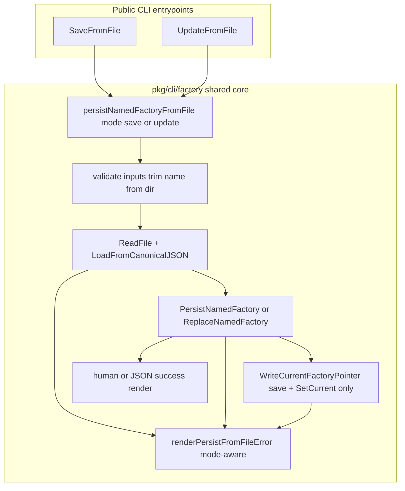

# PRD: Consolidate CLI Factory Save and Update From-File Commands

---
author: Codex
last modified: 2026-05-31
status: draft
---

## Introduction

Customer ask `11` (backend `pkg/` duplication cleanup) advanced when PR `#508` extracted shared `submitWorkCore` and `upsertWorkRequestCore` in `pkg/api/handlers_work_write.go`. The offline CLI paths `you factory save --from` and `you factory update --from` still carry nearly identical logic in `pkg/cli/factory/save.go` and `pkg/cli/factory/update.go`: argument validation, payload read, canonical JSON validation, persist/replace, optional current-factory pointer write (save only), and success/error rendering.

This PRD consolidates that flow into one internal implementation with a small save/update mode, while preserving every observable CLI outcome operators and scripts rely on today.

## Context

### Customer ask

Reduce duplicated file-based factory persistence logic between `SaveFromFile` and `UpdateFromFile` without changing operator-visible behavior for `you factory save` or `you factory update`.

### Concrete problem

`SaveFromFile` and `UpdateFromFile` each implement the same sequence independently. The only meaningful differences are which persist API runs (`PersistNamedFactory` vs `ReplaceNamedFactory`), whether `--set-current` writes the pointer (save only), success message text, and mode-specific error mapping (`factory already exists` vs `factory not found`). Duplication increases the risk that a fix or validation tweak lands in one command but not the other.

### High-level solution

Introduce a shared internal `persist from file` implementation in `pkg/cli/factory/` (for example `persist_from_file.go`) keyed by mode (`save` | `update`). Keep public `SaveFromFile` / `UpdateFromFile` entrypoints and their config/result types as thin wrappers that delegate to the shared core and apply mode-specific success strings. Centralize error rendering in one helper that preserves today's wording per mode. Lock behavior with existing CLI tests in `save_test.go` and `update_test.go`, adjusting only when needed to assert outcomes rather than file layout.

## Goals

- One shared internal implementation for file-based named-factory persistence used by both commands.
- Zero change to CLI flags, exit codes, human-readable stdout, stderr error text, or JSON field names.
- Mode-specific persist semantics preserved: create on save, replace on update; pointer write only on save when `SetCurrent` is true.
- Mode-specific error messages preserved for duplicate save, missing update, and invalid config cases.
- Existing `pkg/cli/factory` tests remain the primary behavior lock; extend only when a gap appears.

## Project-level acceptance criteria

- [ ] `go test ./pkg/cli/factory/...` passes with no intentional behavior changes.
- [ ] `you factory save <name> --from <path>` still creates a new named factory, rejects duplicates, validates before persist, supports `--set-current`, and emits the same human or `--json` output as before.
- [ ] `you factory update <name> --from <path>` still replaces an existing named factory, rejects missing names with `factory not found`, validates before persist, and emits the same human or `--json` output as before.
- [ ] Invalid JSON/topology still fails with `invalid factory config` and does not mutate on-disk layout on save or update failure paths covered by existing tests.
- [ ] No changes to HTTP/API handlers, `config/persist` semantics, CLI command names, or flag surfaces in `pkg/cli/root.go`.
- [ ] `SaveFromFile` and `UpdateFromFile` remain the public API used by CLI wiring; they become thin delegators to the shared helper.
- [ ] Typecheck, lint, and project tests pass.

## User Stories

### US-001: Shared from-file persistence core for save mode

**Description:** As an operator running `you factory save --from`, I want the same create, validation, pointer, and output behavior after consolidation so existing scripts and docs stay valid.

**Acceptance Criteria:**

- [ ] A shared internal helper in `pkg/cli/factory/` performs trimmed name/`--from`/root validation, reads the payload, runs `configload.LoadFromCanonicalJSON`, calls `configpersist.PersistNamedFactory`, and optionally `configpersist.WriteCurrentFactoryPointer` when `SetCurrent` is true.
- [ ] `SaveFromFile` delegates to the shared helper in save mode and still renders `Saved factory <name>\nDirectory: <dir>\n` for human output.
- [ ] `--json` still emits `{"name":"...","factoryDir":"..."}` with the same field names as `SaveFromFileResult` today.
- [ ] Save failure paths still surface `factory already exists` for duplicate names and `invalid factory config` for invalid payloads/topology; invalid topology still leaves no new named directory (per `TestSaveFromFile_RejectsInvalidTopologyBeforePersist`).
- [ ] All `TestSaveFromFile_*` tests pass without relaxing assertions.
- [ ] Typecheck passes
- [ ] Tests pass

### US-002: Update command uses the same shared core in update mode

**Description:** As an operator running `you factory update --from`, I want replace semantics and messaging unchanged so in-place factory upgrades remain predictable.

**Acceptance Criteria:**

- [ ] The shared helper's update mode calls `configpersist.ReplaceNamedFactory` instead of `PersistNamedFactory` and does not write the current-factory pointer.
- [ ] `UpdateFromFile` delegates to the shared helper in update mode and still renders `Updated factory <name>\nDirectory: <dir>\n` for human output.
- [ ] `--json` still emits `{"name":"...","factoryDir":"..."}` with the same field names as `UpdateFromFileResult` today.
- [ ] Missing named factory still returns an error containing `factory not found`; invalid payload/topology still returns `invalid factory config`; failed invalid topology update preserves the prior on-disk factory body (per `TestUpdateFromFile_RejectsInvalidTopologyBeforePersist`).
- [ ] All `TestUpdateFromFile_*` tests pass without relaxing assertions.
- [ ] Typecheck passes
- [ ] Tests pass

### US-003: Unified mode-aware error rendering

**Description:** As a maintainer, I want one error-mapping path for from-file persistence so save and update stay aligned on invalid-config handling while keeping mode-specific not-found/duplicate wording.

**Acceptance Criteria:**

- [ ] One internal error renderer handles save vs update mapping: save maps `configpersist.ErrNamedFactoryAlreadyExists` to `factory already exists`; update maps `os.ErrNotExist` to `factory not found`; both map invalid named-factory errors to `invalid factory config`.
- [ ] Read/persist errors not covered by the mappings pass through unchanged (for example read failures still mention `read factory config`).
- [ ] `TestSaveFromFile_RejectsDuplicateName`, `TestUpdateFromFile_RejectsMissingName`, and invalid-payload tests for both commands continue to pass with the same error substrings.
- [ ] Typecheck passes
- [ ] Tests pass

### US-004: Thin public wrappers and duplication removed

**Description:** As a reviewer, I want `save.go` and `update.go` to expose only mode-specific config/result types and thin delegators so future CLI changes have one implementation path.

**Acceptance Criteria:**

- [ ] `save.go` and `update.go` contain no duplicated validation/read/load/persist/render logic beyond delegating to the shared helper and mode-specific success formatters.
- [ ] Public types `SaveFromFileConfig`, `SaveFromFileResult`, `UpdateFromFileConfig`, and `UpdateFromFileResult` remain exported with unchanged JSON tags.
- [ ] `pkg/cli/root.go` continues to wire `factory save` and `factory update` through `SaveFromFile` and `UpdateFromFile` without flag or help text changes.
- [ ] `go test ./pkg/cli/factory/...` passes.
- [ ] Typecheck passes
- [ ] Tests pass

## Functional Requirements

- FR-1: Shared helper accepts mode `save` or `update`, name, from path, factory root dir, optional `SetCurrent` (save only), JSON flag, and output writer.
- FR-2: Validation errors for empty name, missing `--from`, and missing factory root match today's exact error strings.
- FR-3: Save mode persists with `PersistNamedFactory`; update mode persists with `ReplaceNamedFactory`.
- FR-4: Save mode writes current-factory pointer only when `SetCurrent` is true; update mode never changes the pointer.
- FR-5: Human success output uses mode-specific first line (`Saved factory` vs `Updated factory`) and shared directory line format.
- FR-6: JSON success output encodes name and factoryDir only; no extra fields.
- FR-7: Error renderer preserves mode-specific duplicate/not-found messages and shared invalid-config message.

## Non-Goals

- HTTP/API handler changes or `clihttp` migration for submit (`pkg/cli/submit/submit.go`).
- Changes to `pkg/config/persist` or `pkg/config/load` semantics.
- Renaming CLI commands, flags, or cobra help examples.
- Consolidating `SaveCurrent` (session HTTP save) with offline from-file save.
- Broad unrelated cleanup in `pkg/cli/factory` beyond this duplication lane.

## High-level technical design

Package ownership stays in `pkg/cli/factory/`. The shared helper is unexported; tests continue to exercise behavior through `SaveFromFile` and `UpdateFromFile`. Side effects remain isolated to configured factory root directories via existing `configpersist` APIs.

## Supporting technical considerations

- Follow [`docs/internal/standards/code/general-backend-standards.md`](../../docs/internal/standards/code/general-backend-standards.md) for Go structure and test style.
- Prefer behavioral assertions on CLI output, exit errors, filesystem effects, and pointer state over inventories of which files exist in the package.
- `writeFactoryConfigFile` and payload helpers in `save_test.go` may be reused by update tests; do not introduce meta-tests that only assert file names in the package directory.
- Related prior art: `pkg/api/handlers_work_write.go` shared write cores; `pkg/config/load` and `pkg/config/persist` boundaries from `tasks/prd-config-load-persist-boundary.md`.

## Success metrics

- `save.go` and `update.go` shrink to thin wrappers; duplicated logic lives in one shared file.
- Full `pkg/cli/factory` test package green with no changed golden strings.
- No operator-reported regression in offline save/update workflows after merge.

## Open Questions

None. Scope and behavioral preservation requirements are explicit in the customer ask.
