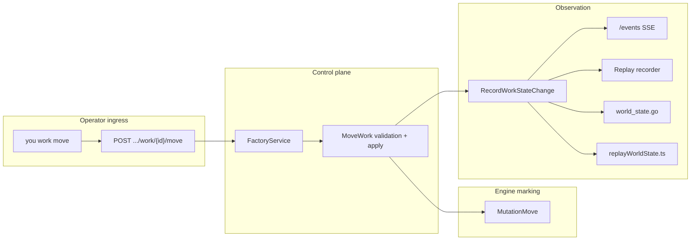

# PRD: Manual Work Recovery (`you work move`)

---
author: Codex
last modified: 2026-05-30
status: draft
work-item: batch-request-fcb63742c470157a3fdbacb4d83d6dd6-prd-work-manual-recovery
---

## Context

### Customer ask

Operators need a **session-scoped control plane** to relocate an existing work item to
another authored marking state after failures, provider errors, or cascading dependency
failure — without deleting tokens. Deliver `you work move <work-id> <state-name>`,
matching HTTP API, canonical `WORK_STATE_CHANGE` events, engine marking updates, CLI,
dashboard replay projection, and record/replay persistence.

### Problem

Work items can land in bad marking positions (`FAILED`, blocked dependents) when
`CascadingFailureSubsystem` or dispatch outcomes move tokens on marking only. Today
work advances only through submit → dispatch → transition paths. Dependents cascaded
into `FAILED` cannot progress until upstream work is corrected, but there is no
operator ingress to move an existing item to another authored state. Marking can show
the truth while `/events`, replay artifacts, and the dashboard stay stale.

### Solution

Add **manual work migration**: validate target state name, reject in-flight dispatches,
apply `MutationMove` on live marking, emit `WORK_STATE_CHANGE` with `source: api` |
`cli`, fan out on SSE, update backend and UI projections, and persist in replay.
Operator moves are **allowed while the factory is paused**; automatic subsystem ticks
must not advance marking while paused. Leaving `FAILED` **retains** failure history and
**clears** guard-blocking fields via a shared helper (also used by
[`prd-cascading-failure-events.md`](../prd-cascading-failure-events.md)).

| Topic | Decision |
| --- | --- |
| Event type | `WORK_STATE_CHANGE` (shared with cascade PRD; distinguish `source`) |
| Idempotent replay | HTTP **409 Conflict** when same `requestId` repeats |
| Target | Specific **state name** (e.g. `in-progress`), not state type alone |
| Delete | **No** — move only |
| In-flight dispatch | **Reject** move when work is in `ActiveDispatches` |
| Dependents | **Manual** — operator moves each item; no auto-unfail |
| Scope | Full vertical slice (contracts, engine, events, API, CLI, UI, replay, tests) |
| Allowed targets | Any authored state for the work item's work type |
| Session | Session-aware routes and `--session` on CLI |
| Paused factory | Operator move **allowed**; automatic ticks **must not** mutate marking |

## Introduction

This PRD implements operator-driven work recovery end-to-end. Automatic cascade moves
remain in [`prd-cascading-failure-events.md`](../prd-cascading-failure-events.md)
(same event type, `source: cascading-failure`). Coordinate **contract US-001** once
across both PRDs.

Maintainer checklist (update after implementation):
[`docs/internal/development/work-session-runtime-feature-guide.md`](../../docs/internal/development/work-session-runtime-feature-guide.md).

## Project-level acceptance criteria

- [ ] **PA-1:** `POST /work/{id}/move` and `POST /factory-sessions/{session_id}/work/{id}/move` accept `stateName` and move work to that authored state; response reflects the new position (same work shape as `GET /work/{id}`).
- [ ] **PA-2:** `you work move <work-id> <state-name>` performs the same operation with `--session`, `--json`, and human summary output (work id, previous state, new state, session).
- [ ] **PA-3:** Move is rejected with a stable client-visible error when the work item is consumed by an entry in `ActiveDispatches`.
- [ ] **PA-4:** Each successful operator move appends exactly one `WORK_STATE_CHANGE` (`source: api` | `cli`) to the session event stream before SSE fanout and replay recording.
- [ ] **PA-5:** Repeating the same operator `requestId` returns **409 Conflict** without a second marking mutation.
- [ ] **PA-6:** Operator move succeeds while factory lifecycle is `PAUSED`; with factory paused, no automatic cascade or new dispatch advances marking until resumed.
- [ ] **PA-7:** Dashboard/timeline replay at a tick after a manual move shows the work token in the target place (matches `you work show` / API marking).
- [ ] **PA-8 (quality gate):** Typecheck, lint, and `make verify-pr` pass for the changed surfaces.

## Goals

- Operators can move one work item to any valid authored state name for its work type.
- Move is rejected with a clear error when the work item is in an active dispatch.
- Move emits `WORK_STATE_CHANGE`, updates marking, streams on `/events`, and is recorded in replay artifacts.
- Dashboard/timeline projections show the work item at the new place after the event.
- CLI follows existing `you work` / `you submit` patterns (`--session`, `--json`, diagnostics).
- Operator move succeeds while factory is **paused**; automatic engine work remains frozen per pause policy.

## High-level technical design

**Control-plane placement:** Operator move is a synchronous control ingress (dedicated
hook or subsystem entry), not ad hoc mutation from handler goroutines and not inside
`TransitionerSubsystem`. **No fake** `DISPATCH_REQUEST` / `DISPATCH_RESPONSE` for moves.

**Failure exit policy:** When leaving a `FAILED` place, retain `FailureRecords` and
customer-visible failure history; clear guard-blocking fields via shared helper consumed
by cascade PRD when moving out of failed.

| Seam | Owner |
| --- | --- |
| OpenAPI / contracts | `api/components/schemas/events/`, `make verify-build-contracts` |
| Engine apply | `pkg/factory/engine/`, control hook |
| Events | `pkg/factory/events/event_history.go` |
| API | `pkg/api/handlers.go`, `pkg/service/` |
| CLI | `pkg/cli/work/` |
| Backend projection | `pkg/factory/projections/world_state.go` |
| UI projection | `ui/src/features/timeline/state/timeline/replayWorldState.ts` |
| Pause policy | `pkg/factory/runtime/factory.go`, engine tick loop |

## User Stories

### US-001: OpenAPI `WORK_STATE_CHANGE` and move routes

**Description:** As a maintainer, I need a canonical event type and move API contract so operator and cascade paths share one vocabulary.

**Acceptance Criteria:**

- [ ] Add `WORK_STATE_CHANGE` to `FactoryEventType` with payload: `workId`, `workTypeName`, `fromState`, `toState`, `fromPlaceId`, `toPlaceId`, `source` (`api` | `cli` | `cascading-failure`), optional `triggerWorkId`, optional `reason`.
- [ ] Add request/response schemas for `POST /work/{id}/move` and `POST /factory-sessions/{session_id}/work/{id}/move` (`stateName` required, optional `requestId`).
- [ ] `FactoryEvent.context` carries `workIds`, `requestId` (idempotency for operator moves), tick/sequence as today.
- [ ] Contract tests in `pkg/api/contracttests/` cover enum, payload refs, and a sample operator event with `source: cli`.
- [ ] `make verify-build-contracts` passes.
- [ ] Coordinate enum/payload merge with [`prd-cascading-failure-events.md`](../prd-cascading-failure-events.md) US-001 so only one contract lands.

### US-002: Engine control path and marking migration

**Description:** As the runtime, I must apply a validated place change on live marking when an operator requests a move.

**Acceptance Criteria:**

- [ ] Control ingress validates: work exists, target state exists for work type, target place resolves via topology, work is **not** in `ActiveDispatches`.
- [ ] Successful move applies `MutationMove`; leaving `FAILED` retains `FailureRecords` and clears guard-blocking fields via shared helper.
- [ ] Move does **not** emit fake dispatch events.
- [ ] Rejected moves return stable errors: not found, invalid state, in-flight dispatch, engine terminated.
- [ ] Operator move **allowed** when factory lifecycle is `PAUSED`.
- [ ] Unit tests prove accept/reject paths and paused-factory accept for operator move.
- [ ] Typecheck passes
- [ ] Tests pass

### US-003: Event history and live fanout

**Description:** As a dashboard consumer, I need move operations recorded like other canonical runtime changes.

**Acceptance Criteria:**

- [ ] `RecordWorkStateChange` in `pkg/factory/events/event_history.go` invoked on successful operator move (`source: api` | `cli`).
- [ ] `FactoryEventHistory` subscribers receive the event in order on `/events` and session-scoped SSE.
- [ ] Tests assert event shape and UTC `eventTime` consistent with `RecordWorkRequest`.
- [ ] Typecheck passes
- [ ] Tests pass

### US-004: HTTP API handlers

**Description:** As an integrator, I can move work via the public API on the default or selected session.

**Acceptance Criteria:**

- [ ] Handlers implement both move routes; route through `FactoryService` / runtime factory interface.
- [ ] `404` when work or session missing; `400` for invalid state or in-flight dispatch; **`409 Conflict`** when the same `requestId` was already applied.
- [ ] Response returns updated `Work` (aligned with `GET /work/{id}`).
- [ ] Handler tests cover default session, named session, **409** idempotency, and move **while paused**.
- [ ] Typecheck passes
- [ ] Tests pass

### US-005: CLI `you work move`

**Description:** As an operator, I can move work from the CLI without using the dashboard.

**Acceptance Criteria:**

- [ ] `you work move <work-id> <state-name>` with `--session`, global `--json`, `clidiag`, `clihttp`, `sessionpath`.
- [ ] Human output includes work id, previous state, new state, session id.
- [ ] CLI tests: help, session path, httptest success, in-flight error, **409** on duplicate client request id when exposed.
- [ ] Functional smoke: `tests/functional/smoke/cli_work_move_smoke_test.go` passes.
- [ ] Typecheck passes
- [ ] Tests pass

### US-006: Backend world projection

**Description:** As a service consumer, factory world state must reflect manual moves from events.

**Acceptance Criteria:**

- [ ] `pkg/factory/projections/world_state.go` handles `WORK_STATE_CHANGE`: place occupancy, `WorkItemsByID`, failed/terminal maps.
- [ ] Leaving FAILED updates occupancy maps without dropping retained failure history from stored work facts.
- [ ] Projection tests: FAILED → in-progress and INITIAL → arbitrary authored state reconstruct expected occupancy.
- [ ] Typecheck passes
- [ ] Tests pass

### US-007: UI event replay projection

**Description:** As a dashboard user, I see work at the new place after an operator move when scrubbing the timeline.

**Acceptance Criteria:**

- [ ] `replayWorldState.ts` `applyWorkStateChange`: `removeWorkToken`, `addToken`, update `workItemsByID`; adjust `failedWorkItemsByID` when leaving/entering FAILED without erasing historical failure details shown elsewhere.
- [ ] `FACTORY_EVENT_TYPES` updated after codegen.
- [ ] Timeline/dashboard tests prove work position at a later tick after a manual move event.
- [ ] Verify in browser using dev-browser skill: failed work moved to in-progress appears in the target place on the graph/timeline.
- [ ] Typecheck passes
- [ ] Tests pass

### US-008: Record and replay

**Description:** As a maintainer, recorded runs preserve manual recovery for postmortems.

**Acceptance Criteria:**

- [ ] `replay.Recorder` persists `WORK_STATE_CHANGE` events for operator moves.
- [ ] Replay reconstructs marking positions including manual moves (same places as live session after move).
- [ ] Replay test in `pkg/service/replaytests/` or `pkg/factory/runtime/` proves artifact round-trip.
- [ ] Typecheck passes
- [ ] Tests pass

### US-009: Pause / tick audit (fix if needed)

**Description:** As an operator, pausing the factory freezes automatic subsystem ticks while manual move still works.

**Acceptance Criteria:**

- [ ] Document which subsystems run while `PAUSED` in the work-session guide (dispatcher, cascade, cron, etc.).
- [ ] Engine tick loop / subsystems do **not** apply marking mutations or scheduling while `PAUSED` (fix if currently violated).
- [ ] `POST …/move` while paused succeeds without requiring a scheduling tick.
- [ ] Test: paused factory → no new cascade/dispatch marking changes; operator move still updates marking and emits `WORK_STATE_CHANGE`.
- [ ] Typecheck passes
- [ ] Tests pass

### US-010: Recovery scenario functional test

**Description:** As CI, we prove failure → cascade (sibling PRD) → manual move → progress.

**Acceptance Criteria:**

- [ ] Fixture: parent fails, child cascaded to FAILED; operator moves parent then child via API; child can progress when factory runs after recovery moves.
- [ ] In-flight rejection covered in unit/API tests (not duplicated only in this story).
- [ ] `make verify-pr` green for the recovery lane.
- [ ] Typecheck passes
- [ ] Tests pass

### US-011: Maintainer guide and AGENTS.md (after implementation)

**Description:** As a future contributor, docs reflect shipped manual recovery behavior.

**Acceptance Criteria:**

- [ ] Update [`work-session-runtime-feature-guide.md`](../../docs/internal/development/work-session-runtime-feature-guide.md) for `WORK_STATE_CHANGE`, pause policy, failure history vs guards.
- [ ] Cross-link [`prd-cascading-failure-events.md`](../prd-cascading-failure-events.md).
- [ ] Add standards bullet in root [`AGENTS.md`](../../AGENTS.md) linking the guide **only after US-001–US-010 are complete**.
- [ ] Typecheck passes

## Functional Requirements

- FR-1: Move targets an authored **state name**; server resolves place ID from topology.
- FR-2: Session-scoped and default `POST …/work/{id}/move` routes.
- FR-3: CLI `you work move <work-id> <state-name>` mirrors HTTP.
- FR-4: Reject move when work is in an active dispatch.
- FR-5: Each successful operator move appends one `WORK_STATE_CHANGE` (`source: api` | `cli`) before SSE and replay.
- FR-6: Duplicate `requestId` returns **409 Conflict** without a second mutation.
- FR-7: Operator move **allowed** while factory is **PAUSED**.
- FR-8: Automatic subsystem ticks (dispatch, cascade, transition) **must not** advance marking while **PAUSED** — fix if violated (US-009).
- FR-9: Leaving FAILED: **keep** failure history; **clear** guard-blocking fields (shared helper with cascade PRD).
- FR-10: Dependents are not auto-moved when parent recovers.
- FR-11: No delete API/CLI.
- FR-12: UI and backend projections both consume `WORK_STATE_CHANGE`; no marking-only operator moves.

## Non-Goals

- `you work delete` or token removal.
- Move by state **type** only when ambiguous.
- `--force` through in-flight dispatches.
- Auto-unfail dependents.
- Batch move.
- Dashboard move button (follow-up).
- Cascade event emission (see cascade PRD).
- Authorization beyond local-trust model.

## Supporting technical and UX considerations

- **Idempotency:** Clients may supply `requestId`; server stores applied operator move ids per session and returns 409 on replay.
- **CLI errors:** Map HTTP status to exit codes; surface in-flight and invalid-state messages on stderr per CLI standards.
- **UI:** No new move button in this PRD; timeline/graph must reflect events from API/CLI moves only.
- **Codegen:** Run `make verify-build-contracts` and commit `pkg/api/generated/` and `ui/src/api/generated/` when contracts change.

## Success Metrics

- Operator recovers cascaded-failed work via one CLI command; dashboard matches `you work show` at the selected tick.
- Duplicate `requestId` returns 409 without double move.
- Paused factory: no automatic cascade/dispatch marking changes; manual move still works.

## Dependencies

| Upstream | Notes |
| --- | --- |
| [`prd-cascading-failure-events.md`](../prd-cascading-failure-events.md) | Shares `WORK_STATE_CHANGE`; coordinate US-001 |
| [`prd-cli-work-inspection.md`](../prd-cli-work-inspection.md) | Verify loop after move |
| [`work-session-runtime-feature-guide.md`](../../docs/internal/development/work-session-runtime-feature-guide.md) | Implementer checklist |

## Related Documents

- [`tasks/prd-cascading-failure-events.md`](../prd-cascading-failure-events.md)
- [`docs/internal/development/work-session-runtime-feature-guide.md`](../../docs/internal/development/work-session-runtime-feature-guide.md)
- [`docs/internal/development/record-replay.md`](../../docs/internal/development/record-replay.md)
- [`tasks/prd-cli-work-inspection.md`](../prd-cli-work-inspection.md)
