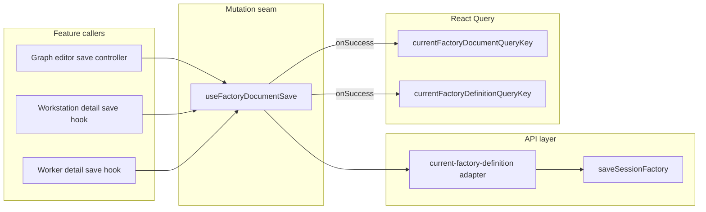

# PRD: UI Factory Document Save Hook (U3)

## Introduction

Factory definition writes in the dashboard are orchestrated in three parallel places that each implement the same mutation concerns: confirm/save state, scope keys, stale-version recovery, submitting flags, operator error mapping, and React Query cache updates after success.

Today those paths are:

- **Graph editor** — `react-flow-current-activity-card-editor` wires `useSaveCurrentFactory` into `useEditableFactoryGraph` save controller.
- **Workstation detail card** — `use-save-editable-workstation-configuration` patches a local `CanonicalFactoryDefinition`, then calls `useSaveCurrentFactory`.
- **Worker detail card** — `use-save-editable-worker-configuration` does the same pattern with separate messages and tests.

The session factory transport layer (`saveSessionFactory` via `current-factory-definition`) already exists. What is missing is a **single feature-level mutation hook** that every factory-document write path can call after it has merged its local edits.

This project introduces **`useFactoryDocumentSave`** as the one mutation seam for persisting a full canonical factory document to the active session factory API. Graph and detail-card features stay responsible for drafting and patching; the hook owns transport, pending/error state, operator error codes, and cache coherence.

## Goals

- One hook performs all session-scoped factory document PUTs from editor and detail-card features.
- Callers pass save mode (default `REPLACE_CURRENT`), the full factory payload (with version rules handled consistently), and optional session override.
- Operator errors `STALE_FACTORY_VERSION`, `FACTORY_NOT_IDLE`, and `INVALID_FACTORY` surface with stable `code` values for recovery UX.
- On success, session-scoped React Query caches for the current factory document and definition update together.
- Graph editor and worker/workstation detail saves keep existing user-visible behavior while delegating persistence to the shared hook.

## Project-level acceptance criteria

- [ ] A single `useFactoryDocumentSave` hook is the production mutation entry point for graph editor save and worker/workstation detail-card save paths.
- [ ] Successful saves update both `currentFactoryDocumentQueryKey` and `currentFactoryDefinitionQueryKey` for the active session without requiring callers to invalidate manually.
- [ ] Stale version, factory-not-idle, and invalid-factory failures expose the same error codes and messages detail cards and the graph editor already rely on.
- [ ] Graph editor save summary, blocked-when-active-work, confirm-save, and confirm-leave flows behave the same before and after migration.
- [ ] Workstation and worker detail cards preserve confirm-save, scope-key error isolation, submitting state, and localized error copy.
- [ ] Feature code does not call `saveCurrentFactoryDocument` directly; the API function remains for the hook and tests only.
- [ ] Quality gate: UI typecheck, lint, and affected unit tests pass before merge.

## User Stories

### US-001: Shared factory document save hook

**Description:** As a feature developer, I want one mutation hook for persisting a full factory document so every save path shares transport, cache updates, and error mapping.

**Acceptance Criteria:**

- [ ] `useFactoryDocumentSave` lives under `ui/src/features/current-factory-definition/hooks/` (or a dedicated `factory-document` hooks module) and is exported from the feature public surface.
- [ ] The hook exposes `save` (fire-and-forget), `saveAsync`, `isPending`, `error`, and `reset` with semantics equivalent to React Query `useMutation`.
- [ ] Input accepts `{ mode?: FactorySaveMode, factory: CanonicalFactoryDefinition, baseVersion?: CurrentFactoryVersion, sessionID?: string }`; when `sessionID` is omitted, the hook uses `useDashboardSession().sessionID`.
- [ ] Default save mode is `REPLACE_CURRENT` when `mode` is omitted.
- [ ] The hook calls `saveSessionFactory` (via the existing current-factory adapter) and does not mutate the caller’s `factory` object in place.
- [ ] `onSuccess` writes the returned document into `currentFactoryDocumentQueryKey(sessionID)` and `currentFactoryDefinitionQueryKey(sessionID)`.
- [ ] Thrown/rejected errors include `code: "STALE_FACTORY_VERSION" | "FACTORY_NOT_IDLE" | "INVALID_FACTORY"` when the API returns those operator outcomes.
- [ ] Unit tests cover success cache update, default mode, session override, and mapped error codes without weakening existing API tests.
- [ ] Typecheck passes
- [ ] Tests pass

### US-002: Graph editor uses shared save hook

**Description:** As a factory graph editor, I want Save to behave exactly as today while the editor delegates persistence to the shared hook.

**Acceptance Criteria:**

- [ ] `react-flow-current-activity-card-editor` (and graph save controller wiring) uses `useFactoryDocumentSave` instead of `useSaveCurrentFactory` for `saveFactoryDefinition` / `saveEditableDefinition`.
- [ ] Editor saves send `REPLACE_CURRENT` or omit mode; no graph path sends `UPSERT_NAMED_AND_ACTIVATE`.
- [ ] Save summary text, blocked save when active work is present, confirm-save dialog, and confirm-leave-with-unsaved-changes flows match pre-migration behavior.
- [ ] `react-flow-current-activity-card` and related editor tests pass without relaxed assertions.
- [ ] Typecheck passes
- [ ] Tests pass
- [ ] Verify in browser using dev-browser skill: save succeeds, stale-version error still appears when simulated, leave-editor confirm still blocks navigation while dirty

### US-003: Workstation detail card uses shared save hook

**Description:** As an operator editing a workstation in the detail card, I want save confirmation, submitting state, and errors to behave as today while persistence goes through the shared hook.

**Acceptance Criteria:**

- [ ] `use-save-editable-workstation-configuration` builds the updated `CanonicalFactoryDefinition` locally, then persists via `useFactoryDocumentSave` (not `useSaveCurrentFactory`).
- [ ] `beginSaveConfirmation`, `cancelSaveConfirmation`, `confirmSave`, `canSave`, and `saveState` semantics are unchanged for dirty/valid/invalid/scope transitions.
- [ ] Scope-key behavior is preserved: errors and success markers do not bleed across selection changes; stale-version errors remain scoped to the failing save attempt.
- [ ] `use-save-editable-workstation-configuration.test.tsx` and workstation detail card tests pass.
- [ ] Typecheck passes
- [ ] Tests pass
- [ ] Verify in browser using dev-browser skill: confirm save, success feedback, and stale/not-idle error presentation on workstation card

### US-004: Worker detail card uses shared save hook

**Description:** As an operator editing a worker in the detail card, I want the same save behavior as the workstation card, backed by the same mutation hook.

**Acceptance Criteria:**

- [ ] `use-save-editable-worker-configuration` migrates to `useFactoryDocumentSave` with the same confirm/save/state contract as US-003.
- [ ] Localized fallback and field-target error mapping for worker saves is unchanged.
- [ ] `use-save-editable-worker-configuration.test.tsx` uses the shared `factory-document-save-mocks` seam against the new hook (or a thin adapter) without duplicating inline mutation stubs.
- [ ] Worker detail card and `current-selection-widget.save` tests pass.
- [ ] Typecheck passes
- [ ] Tests pass
- [ ] Verify in browser using dev-browser skill: worker save confirm, success, and error states match workstation card patterns

### US-005: Single public save seam for features

**Description:** As a reviewer, I want feature code to depend on the document save hook—not the raw API function—so new factory write surfaces have one integration point.

**Acceptance Criteria:**

- [ ] `useSaveCurrentFactory` becomes a thin deprecated wrapper around `useFactoryDocumentSave` (or is removed after call-site migration) with no remaining production imports of `saveCurrentFactoryDocument` outside API modules and hook tests.
- [ ] `ui/src/testing/factory-document-save-mocks.ts` documents and mocks the shared hook contract (`saveAsync` / pending / error modes) for graph and detail-card tests.
- [ ] Internal development guide or feature README notes: features import `useFactoryDocumentSave`; direct `saveCurrentFactoryDocument` is API-layer only.
- [ ] Typecheck passes
- [ ] Tests pass

## Functional requirements

- FR-1: Default save mode is `REPLACE_CURRENT` when omitted.
- FR-2: The hook accepts a full canonical factory document; callers merge graph or entity patches before calling save.
- FR-3: Version on the wire follows existing `baseVersion` → incremented `factory.version` adapter behavior; callers must not manually fight the adapter.
- FR-4: Stale version errors expose `code: "STALE_FACTORY_VERSION"` (including HTTP 409 targets when present) for refresh/recovery UX.
- FR-5: Factory-not-idle and invalid-factory errors expose stable codes for blocking save affordances.
- FR-6: The hook does not own draft/dirty state for graph or detail cards.
- FR-7: Import activation (`UPSERT_NAMED_AND_ACTIVATE`) may call the same hook; editor and detail-card paths remain `REPLACE_CURRENT` only.

## Non-goals

- Partial PATCH API or debounced/auto-save.
- Replacing React Query with another client store for factory documents.
- Consolidating confirm-save UX across worker/workstation (see `prd-ui-current-selection-save-consolidation.md`).
- Splitting graph editor orchestration (`prd-ui-graph-editor-orchestration-split.md`).
- Validation-only API calls or new server endpoints.

## High-level technical design

**Ownership**

| Layer | Responsibility |
|-------|----------------|
| Feature hooks (graph, worker, workstation) | Draft state, validation, confirm UX, scope keys, building `CanonicalFactoryDefinition` |
| `useFactoryDocumentSave` | Mutation lifecycle, session resolution, mode default, API call, error normalization, cache writes |
| `ui/src/api/session-factory` | HTTP transport and OpenAPI-shaped bodies |
| `ui/src/api/current-factory-definition` | Legacy type aliases and thin save/get wrappers |

**Dependencies**

| Upstream | Relationship |
|----------|----------------|
| Session factory client (`prd-ui-session-factory-client`) | Hard — transport must exist |
| Dashboard session selection | Soft — default `sessionID` from `useDashboardSession()` |

| Downstream | Relationship |
|------------|----------------|
| Graph editor orchestration split | Consumes hook |
| Current selection save consolidation | Consumes hook |

## Supporting technical and UX considerations

- Reuse `CurrentFactoryDefinitionError` (or a renamed `FactoryDocumentSaveError` alias) so existing message catalogs and `factory-document-save-mocks` error modes stay valid.
- Keep `SaveCurrentFactoryInput`-shaped adapters only at the hook boundary if needed for incremental migration; prefer the `{ mode, factory, baseVersion }` shape for new call sites.
- Loading: callers already disable actions while `isPending`; the hook must expose a reliable pending flag.
- Accessibility: this PRD does not change visible affordances; downstream consolidation PRDs own shared live-region copy.
- Tests should assert runtime outcomes (mutation result, cache data, error codes, save state), not file import inventories.

## Success metrics

- Three independent save implementations collapse to one hook plus thin feature wrappers.
- A new factory write feature can integrate with under ~50 lines (patch document + `saveAsync`).
- No new user-reported regressions in graph save, leave-editor confirm, or detail-card stale-version handling after rollout.

## Open questions

None — session factory client and dashboard session routing are already in place; scope is hook extraction and call-site migration with behavioral parity.
