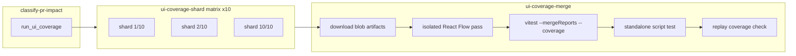

# PRD: CI UI Coverage Test Sharding

---
author: factory work item batch-request-141ac04cec0032db974c90c53e2a6998-ci-coverage-test-sharding
last modified: 2026-05-30
status: draft
---

## Introduction

Pull-request CI spends roughly **9–10 minutes** on the **UI Coverage** lane because the jsdom coverage suite runs as one long `make test-ui-coverage` invocation (~**8m52s** for the lane command on `ubuntu-latest`, dominated by the main covered Vitest pass at ~**403s**). Backend verification and browser integration already run in parallel sibling jobs, but the coverage lane itself is a single runner executing all covered tests serially (aside from two in-process workers).

The customer asks to **keep UI coverage as its own CI lane**, **shard the covered Vitest corpus across ten parallel runners**, and **merge shard results with Vitest’s blob + `--mergeReports` flow** (the same mechanism `ui/scripts/ui-coverage-runner.mjs` already uses between the main and isolated React Flow passes). The goal is to cut **lane wall-clock time** on the critical path without weakening the merged coverage threshold contract in `ui/vite.config.ts` or the replay metadata check.

`make test-ui-coverage` remains the **local canonical** full lane for contributors; CI adds a shard + merge orchestration layer on top of the existing runner phases.

## Context

| Item | Detail |
| --- | --- |
| **Customer ask** | Separate UI coverage into its own CI steps, run **10 shards** in parallel, merge coverage with Vitest merging. |
| **Concrete problem** | One `ui-coverage` job runs the entire covered corpus on one machine; PR CI wall time is dominated by frontend coverage even after prior in-job optimizations (worker tuning, App slimming). |
| **High-level solution** | Replace the monolithic `ui-coverage` job with a **matrix of ten shard jobs** (main covered pass only, using Vitest `--shard=i/10` + blob reporter) and a **merge job** that downloads shard blobs, runs the existing serial follow-on phases (isolated React Flow, standalone script, replay check), and executes `vitest --mergeReports` with the same threshold enforcement as today. |

Prior analysis in `docs/internal/development/ui-coverage-speed-closeout.md` (**Optional CI sharding, US-008**) rejected **two–three directory-based shards** because file-count splits were imbalanced and savings were marginal. This initiative **re-opens sharding** with an explicit product decision: **Vitest-native file sharding (`--shard`)**, **ten-way parallelism**, and **runner/CI co-design**—not workflow-only glob splits.

## Goals

- Reduce **UI Coverage job wall time** on `ubuntu-latest` by parallelizing the main covered pass across **10** CI runners.
- Preserve **merged coverage thresholds** (statements/lines/branches/functions) exactly as enforced today after blob merge.
- Preserve **lane boundaries**: browser integration stays in `ui-browser-integration`; backend stays in `backend-verification`; integration tests stay excluded from the jsdom coverage corpus.
- Keep **`make test-ui-coverage`** the documented local rerun for the full lane (unsharded).
- Surface **actionable CI failure evidence** per shard (logs, blob presence) and on merge (threshold gaps, missing artifacts).
- Add **direct automated tests** at the runner/script layer for shard argument wiring and merge inputs—no meta-inventory tests.

## Project-level acceptance criteria

- [ ] When classification routes UI coverage to **run**, CI executes **ten parallel shard steps** plus **one merge step** instead of one monolithic `make test-ui-coverage` on a single runner.
- [ ] Each shard runs only its Vitest-assigned subset of the main covered corpus (same exclusions as today’s main pass) and uploads a distinct blob report artifact.
- [ ] The merge step produces a **single merged coverage result** that satisfies the existing `ui/vite.config.ts` thresholds and runs the replay coverage check successfully.
- [ ] A failing shard fails the workflow and names the shard index in the GitHub Actions step summary; a missing shard blob fails merge with a clear error (no silent pass).
- [ ] `make test-ui-coverage` locally still runs the **full unsharded** lane with stable `[ui-coverage] … elapsed` phase labels.
- [ ] Documented maintainer rerun commands distinguish **full local lane** vs **CI shard replay** (single shard index).
- [ ] **Quality gate:** Typecheck, lint, and project tests pass.

## User Stories

### US-001: Shard-aware main covered pass in the UI coverage runner

**Description:** As a maintainer, I want the UI coverage runner to execute one Vitest shard of the main covered pass so CI can fan out work without duplicating files across shards.

**Acceptance Criteria:**

- [ ] When `UI_COVERAGE_SHARD` is set to `i/n` (e.g. `3/10`), the runner executes **only** the main covered Vitest phase for that shard using Vitest’s `--shard=i/n`, preserving today’s exclusions (`integration/*.integration.test.mjs`, `scripts/dashboard-shell-storybook-responsive.test.mjs`, `react-flow-current-activity-card.test.tsx`) and coverage flags (`--coverage`, thresholds zeroed during shard, `--maxWorkers` default **2** unless overridden).
- [ ] Each shard writes a **unique** blob file under `.vitest-reports/` (e.g. `main-shard-03-of-10.json`) via `--outputFile.blob=…` and does **not** run isolated React Flow, blob merge, standalone script, or replay phases.
- [ ] When `UI_COVERAGE_SHARD` is unset, `make test-ui-coverage` behavior is unchanged (full phased lane including merge and replay).
- [ ] Shard mode prints `[ui-coverage]` timing for the shard main pass only.
- [ ] Typecheck passes
- [ ] Tests pass (extend `ui/scripts/ui-coverage-runner.test.mjs` with behavioral assertions on built argv and blob paths)

### US-002: CI shard matrix job for UI coverage

**Description:** As a contributor waiting on CI, I want the main covered corpus split across ten parallel jobs so wall time drops below the current single-runner baseline.

**Acceptance Criteria:**

- [ ] `.github/workflows/ci.yml` defines a `ui-coverage-shard` job with `strategy.matrix.shard: [1,2,3,4,5,6,7,8,9,10]` and `shard-total: 10`, gated by the same `run_ui_coverage` classification output as today’s lane.
- [ ] Each matrix cell checks out the repo, installs deps (`make ui-deps`), and runs the shard entrypoint with `UI_COVERAGE_SHARD=<index>/10` (or equivalent documented env), teeing logs to `.artifacts/ui-coverage-shard-<index>/command.log`.
- [ ] Each successful shard uploads an artifact containing its `.vitest-reports/` blob(s) and command log; upload failure fails the shard job.
- [ ] Shard jobs run **in parallel** with each other (matrix `fail-fast: false` unless product chooses otherwise—document choice in workflow).
- [ ] Typecheck passes

### US-003: CI merge job for shard blobs and serial follow-on phases

**Description:** As a maintainer, I want one merge job to combine shard coverage and run the remaining lane phases so the regression contract stays identical to the pre-shard lane.

**Acceptance Criteria:**

- [ ] A `ui-coverage-merge` job depends on all ten shard jobs (and `verify-build-contracts` / classification as today), downloads every shard blob into `.vitest-reports/`, and fails fast if any expected shard artifact is missing.
- [ ] Merge job runs, in order: **isolated React Flow covered pass** (unchanged single-worker semantics), **`vitest --mergeReports .vitest-reports --coverage`** (enforcing `ui/vite.config.ts` thresholds), **standalone script-style test**, **`make ui-replay-coverage-check`** (or equivalent replay step today).
- [ ] Merge job step summary states merged thresholds result (`passed` / `failed`) and lists missing shards when applicable.
- [ ] On merge failure, retain `.artifacts/ui-coverage-merge/` logs for 14 days (mirror today’s failure artifact pattern).
- [ ] Typecheck passes
- [ ] Tests pass (script-level test or focused workflow fixture that asserts merge invokes the same merge argv the runner uses today)

### US-004: Replace monolithic `ui-coverage` job wiring

**Description:** As a CI operator, I want the workflow’s public “UI Coverage” lane to mean sharded execution + merge so PR checks reflect the new architecture.

**Acceptance Criteria:**

- [ ] Remove or disable the old single-job `ui-coverage` path that runs full `make test-ui-coverage` on one runner; required checks route through shard + merge jobs only when coverage runs.
- [ ] Classification outputs (`ui_coverage_command`, summaries) still tell contributors to run **`make test-ui-coverage`** locally; CI summary links to shard/merge jobs and the canonical local command.
- [ ] `verify-tests` / `make verify-pr` documentation remains accurate: local verify still uses unsharded `test-ui-coverage`; CI parallelism is an implementation detail called out in dev docs.
- [ ] Typecheck passes

### US-005: Shard failure observability

**Description:** As a contributor debugging a red PR, I want shard failures to identify which slice failed without reading ten full logs blindly.

**Acceptance Criteria:**

- [ ] Failed shard jobs upload the same artifact bundle as successful shards (logs + partial blobs when present).
- [ ] Step summary for a failed shard includes shard index `i/10`, exit code, and last ~40 lines of `command.log`.
- [ ] Merge job summary, when blocked by missing shards, lists which indices were absent.
- [ ] Typecheck passes

### US-006: Timing evidence and maintainer documentation

**Description:** As a maintainer, I want recorded before/after CI timings and rerun instructions so we can verify the sharding investment and operate the lane safely.

**Acceptance Criteria:**

- [ ] `docs/internal/development/ui-coverage-speed-closeout.md` gains a **CI ten-shard rollout** subsection with: baseline (pre-shard) lane step wall, post-shard critical path (slowest shard + merge job wall), and date/run URL of the first green proof run.
- [ ] `docs/internal/development/development.md` (or development-guide relevant-files row) documents: `UI_COVERAGE_SHARD`, shard-only vs full `make test-ui-coverage`, and that Vitest `--mergeReports` owns merged thresholds.
- [ ] Post-shard **UI Coverage lane** job wall (merge job completion) is **≤ 4 minutes** on `ubuntu-latest` for the US-001 CI baseline commit class, or the doc records measured wall with explanation if overhead prevents target (no threshold lowering).
- [ ] Typecheck passes

## Functional requirements

- **FR-1:** Shard count is fixed at **10** for CI (`--shard=i/10`); changing count requires updating matrix, merge expectations, and runner validation together.
- **FR-2:** Shard jobs run **only** the main covered Vitest pass; isolated React Flow, standalone script, and replay check run **once** on the merge job.
- **FR-3:** All shard jobs use the same Vitest config, dependency install, and exclusion list as the current main pass; no per-shard threshold enforcement (thresholds zero on shard, enforced at merge).
- **FR-4:** Blob outputs from shards and the isolated React Flow pass must coexist in `.vitest-reports/` before `--mergeReports`.
- **FR-5:** Browser integration (`make ui-integration-test`) and backend verification are out of scope for sharding.
- **FR-6:** Do not lower `ui/vite.config.ts` coverage thresholds to make merge pass.
- **FR-7:** Do not add directory-glob shard maps; use Vitest’s built-in shard partitioner only.

## Non-goals

- Sharding backend Go coverage or functional tests.
- Sharding Playwright browser integration (`ui-browser-integration` job).
- Sharding the isolated React Flow pass across ten workers (stays single-worker on merge job unless separate flake evidence says otherwise).
- Replacing V8 coverage with Istanbul solely to work around merge tooling bugs (if V8 merge fails in CI, fix or document upstream workaround—do not silently weaken the contract).
- Removing the replay coverage check or standalone script phase.
- Requiring contributors to run ten local shards for routine development.

## High-level technical design

**Runner (`ui/scripts/ui-coverage-runner.mjs`):**

- Add `parseUiCoverageShard(env)` → `{ index, total } | null`.
- `buildUiCoveragePhases({ shard })` returns shard-only main phase when set; otherwise existing `uiCoveragePhases`.
- Shard argv adds `--shard=${index}/${total}` and distinct `--outputFile.blob`.

**CI (`.github/workflows/ci.yml`):**

- `ui-coverage-shard`: `matrix.shard` 1–10; env `UI_COVERAGE_SHARD=${{ matrix.shard }}/10`; artifact `ui-coverage-shard-${{ matrix.shard }}`.
- `ui-coverage-merge`: `needs: [ui-coverage-shard]` with `if: always()` + explicit failure when any shard failed or artifact missing; download and flatten blobs; invoke runner merge phases or a thin `make test-ui-coverage-merge` target.

**Local:**

- `make test-ui-coverage` → full lane (unchanged).
- Optional `make test-ui-coverage-shard SHARD=3/10` (name illustrative) for debugging one slice.

**Vitest merge:** Reuse existing pattern from the runner’s “Blob report merge pass” (`vitest --mergeReports .vitest-reports --coverage`). Vitest assigns files to shards; union of blobs must cover the full corpus before thresholds apply.

## Supporting technical considerations

- **Imbalance:** Vitest shards by test file count, not duration; megatest files may dominate one shard. Ten shards reduce but do not eliminate skew; slow-file summary can remain on merge job if merge re-runs main pass logging is impractical—prefer logging per-shard slow files in shard jobs.
- **Overhead:** Each shard pays checkout + `ui-deps` (~25s). Ten parallel shards trade duplicated setup for parallel CPU; net wall should still beat ~403s main pass when merge + RF (~130s) run once.
- **v8 + mergeReports:** Project uses `coverage.provider: "v8"`. Watch for CI-only native crashes on merge (Vitest 4.x known issues); if observed, document reproduction and prefer fixing versions over switching providers without approval.
- **Concurrency group:** Keep existing `ci-${{ github.workflow }}-…` cancel-in-progress behavior compatible with matrix jobs.
- **Classification:** `cmd/ciclassify` should keep emitting `ui_coverage_command=make test-ui-coverage` for local reruns; CI implements sharding internally.

## Success metrics

| Metric | Target |
| --- | --- |
| UI Coverage lane wall (slowest shard ∥ + merge job serial tail) | **≤ 4 minutes** on `ubuntu-latest` vs ~**9m17s** job wall baseline (US-001 CI table) |
| Main-pass critical path | **≤ ~60–90s** per shard at p50 (theoretical ~403s/10) with measured proof in closeout doc |
| Merged threshold compliance | Same pass/fail as pre-shard `main` for equivalent commit |
| Contributor local workflow | Still one command: `make test-ui-coverage` |

## Open questions

None blocking implementation—the shard count (10) and Vitest-native partitioning are specified by the customer ask. If measured CI wall does not meet targets after rollout, follow-up may tune shard count or add duration-aware grouping in a separate initiative (out of scope here).
