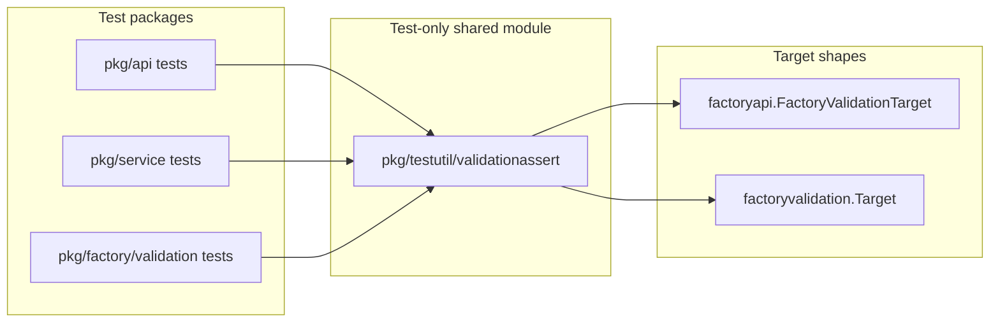

# PRD: Consolidate Validation Target Test Assertions

---
author: Codex
last modified: 2026-05-30
status: draft
---

## Introduction

Customer ask `11` (`pkg/` duplication cleanup) is consolidating repeated test helpers into shared `pkg/testutil` modules. PR `#492` moved `minimalFactoryConfig` / `writeFactoryJSON` into `pkg/testutil/factoryfixtures`. The next non-overlapping slice consolidates duplicated **validation target assertion helpers** used by API, service, and factory-validation tests.

Today, the same “does this validation result include target X?” logic is copy-pasted across `pkg/api`, `pkg/service`, and `pkg/factory/validation` tests. That drift risks subtly different matching rules (for example, different `t.Fatalf` messages or subject-field comparisons) and makes topology validation regressions harder to review.

**Intent:** Provide one canonical, test-only assertion module and retarget call sites so validation topology tests share identical assertion behavior with **no production or validation-semantics change**.

## Context

### Customer ask

Consolidate duplicated `assertHasValidationTarget` and `assertHasValidationTargetCode` helpers into a shared test-only package; remove duplicate definitions from API and service tests (and validation package tests where equivalent); retarget imports only.

### Concrete problem

- `assertHasValidationTarget` (full match on code, subject type, subject id, location) is defined in `pkg/api/server_test_helpers_test.go`, `pkg/api/servertests/server_factory_validation_test.go`, and `pkg/service/factory_test.go`.
- `assertHasValidationTargetCode` is duplicated in `pkg/api/server_factory_test.go`, `pkg/api/servertests/server_factory_validation_test.go`, and `pkg/service/factory_test.go` (service copy also takes a custom failure label).
- `pkg/factory/validation/validation_test.go` duplicates the same ideas as `assertHasTargetCode` and `assertHasTargetSubject` on `factoryvalidation.Target` / `factoryvalidation.Subject`.

### High-level solution

Add `pkg/testutil/validationassert` (or extend an existing `pkg/testutil` submodule if import boundaries require it) with:

1. **API-shaped helpers** for `[]factoryapi.FactoryValidationTarget`: full target match and code-only match.
2. **Domain-shaped helpers** for `[]factoryvalidation.Target`: code-only and subject match (replacing `assertHasTargetCode` / `assertHasTargetSubject`).

Retarget test call sites, delete local copies, and prove equivalence by running the existing validation topology test suites unchanged.

## Goals

- Exactly one canonical implementation per assertion shape (API full match, API code-only, domain code-only, domain subject match).
- All listed duplicate definitions removed from API, service, and validation package tests.
- Existing validation topology tests continue to pass with the same expected codes, subjects, and locations—no assertion weakening or semantic drift.
- Test-only change: no production API, CLI, UI, or OpenAPI contract changes.

## Project-level acceptance criteria

- [ ] `pkg/testutil/validationassert` (or approved `pkg/testutil` submodule) exports canonical helpers for API and domain validation target assertions.
- [ ] No remaining duplicate `assertHasValidationTarget`, `assertHasValidationTargetCode`, `assertHasTargetCode`, or `assertHasTargetSubject` definitions in `pkg/api`, `pkg/service`, or `pkg/factory/validation` test files listed in scope.
- [ ] All prior call sites use the shared helpers without changing which codes, subjects, or locations each test expects.
- [ ] `go test ./pkg/api/... ./pkg/service/... ./pkg/factory/validation/...` passes.
- [ ] No production packages import `validationassert` (test-only boundary preserved).
- [ ] Typecheck, lint, and targeted tests pass (quality gate).

## User Stories

### consolidate-validation-target-test-asserts-001: Canonical API validation target assertions

**Description:** As a maintainer, I want shared helpers for OpenAPI `FactoryValidationTarget` slices so API and service tests assert targets the same way.

**Acceptance Criteria:**

- [ ] `pkg/testutil/validationassert` provides `HasTarget` matching code, subject type, subject id, and location on `[]factoryapi.FactoryValidationTarget`.
- [ ] `HasTargetCode` matches when any target carries the given validation code (optional human-readable label for failure messages, preserving service-test ergonomics).
- [ ] Helpers call `t.Helper()` and preserve existing match semantics (code gate first, then subject fields).
- [ ] Package is test-only (`package validationassert` under `pkg/testutil`, no production imports).
- [ ] Typecheck passes
- [ ] Tests pass for any new helper unit coverage added in this story

### consolidate-validation-target-test-asserts-002: API tests use shared validation assertions

**Description:** As a maintainer, I want API validation topology tests to import shared assertions so duplicate helpers are not redefined per test file.

**Acceptance Criteria:**

- [ ] `pkg/api/server_test_helpers_test.go`, `pkg/api/server_factory_test.go`, and `pkg/api/servertests/server_factory_validation_test.go` call `validationassert` instead of local helpers.
- [ ] Local `assertHasValidationTarget` / `assertHasValidationTargetCode` definitions are removed from those files.
- [ ] Existing API validation tests (`TestValidateFactory_*`, save/create factory validation target tests, topology multi-target tests) still fail/pass on the same inputs as before this change.
- [ ] Typecheck passes
- [ ] Tests pass (`go test ./pkg/api/...`)

### consolidate-validation-target-test-asserts-003: Service tests use shared validation assertions

**Description:** As a maintainer, I want service-layer factory validation tests to share the same target assertions as API tests.

**Acceptance Criteria:**

- [ ] `pkg/service/factory_test.go` imports `validationassert` for topology and canonical target assertions.
- [ ] Local `assertHasValidationTarget` and `assertHasValidationTargetCode` definitions are removed from `factory_test.go`.
- [ ] Service tests that assert validation targets (including `assertCanonicalTopologyTargets` call sites) behave identically: same expected codes and subject coordinates.
- [ ] Typecheck passes
- [ ] Tests pass (`go test ./pkg/service/...`)

### consolidate-validation-target-test-asserts-004: Domain validation tests use shared assertions

**Description:** As a maintainer, I want `pkg/factory/validation` unit tests to use the same canonical assertion module for domain `Target` slices.

**Acceptance Criteria:**

- [ ] `validationassert` exposes domain helpers equivalent to prior `assertHasTargetCode` and `assertHasTargetSubject` on `[]factoryvalidation.Target`.
- [ ] `pkg/factory/validation/validation_test.go` retargets to shared helpers and removes local duplicates.
- [ ] Explicit validation unit tests still report the same missing-code and missing-subject failures for invalid factory configs.
- [ ] Typecheck passes
- [ ] Tests pass (`go test ./pkg/factory/validation/...`)

### consolidate-validation-target-test-asserts-005: Duplication cleanup verification

**Description:** As a reviewer, I want confidence that consolidation is complete and behavior-neutral across all touched packages.

**Acceptance Criteria:**

- [ ] Repository search shows no duplicate validation-target assertion helpers remaining in scoped `pkg/api`, `pkg/service`, and `pkg/factory/validation` test files.
- [ ] `go test ./pkg/api/... ./pkg/service/... ./pkg/factory/validation/...` passes with zero diff in expected validation codes or subject shapes in test assertions.
- [ ] No changes to production validation logic, handlers, or OpenAPI schemas.
- [ ] Typecheck passes
- [ ] Tests pass (full scoped suite above)

## Functional Requirements

- FR-1: Provide canonical API helpers for full validation target match and code-only match on `factoryapi.FactoryValidationTarget` slices.
- FR-2: Provide canonical domain helpers for code-only and `factoryvalidation.Subject` match on `factoryvalidation.Target` slices.
- FR-3: Remove duplicate helper definitions from `pkg/api/server_test_helpers_test.go`, `pkg/api/server_factory_test.go`, `pkg/api/servertests/server_factory_validation_test.go`, `pkg/service/factory_test.go`, and `pkg/factory/validation/validation_test.go`.
- FR-4: Retarget imports and call sites only; do not alter validation rules, error codes, or expected target payloads in tests.
- FR-5: Keep `pkg/cli/submit` clihttp migration, API handler extraction, and functional-test helper consolidation out of this lane.

## Non-Goals

- Production API, CLI, or UI changes.
- `pkg/cli/submit` clihttp migration (blocked on open PR `#480`).
- API handler core extraction (`submitWorkCore`, strict JSON decode helpers).
- Consolidating Petri/net, bundled-file, or functional-test `hasValidationTarget*` helpers under `tests/functional/...` (separate follow-on).
- Meta-tests that assert helper file layout, import graphs, or assertion inventories.
- Changing validation semantics or weakening tests to accommodate helper moves.

## High-level technical design

**Package ownership:** `pkg/testutil/validationassert` owns cross-package test assertions. Production validation remains in `pkg/factory/validation`; API projection remains in handlers/services.

**Import boundaries:** `validationassert` may depend on `pkg/api/generated` and `pkg/factory/validation` types. Production packages must not import `validationassert`. If a cycle appears, split API vs domain helpers into sibling files within the same testutil submodule rather than duplicating logic.

**Matching semantics (must not change):**

| Helper | Match rule |
|--------|------------|
| Full API target | Same `code`, `subject.type`, `subject.id`, `subject.location` |
| API code-only | Any target with matching `code` |
| Domain code-only | Any target with matching `code` |
| Domain subject | Any target with `subject` equal to expected `factoryvalidation.Subject` |

**Verification surface:** Existing behavioral tests that exercise validation through API HTTP tests, service factory save/validation paths, and `factoryvalidation.Validate` unit tests. No new inventory or registration tests.

## Supporting technical considerations

- Follow the `pkg/testutil/factoryfixtures` precedent: small focused submodule under `pkg/testutil`, documented in `pkg/testutil/doc.go` if needed.
- Prefer preserving distinct failure messages where tests rely on them (service topology messages vs API code-only messages) via optional label parameters—not by keeping duplicate implementations.
- `pkg/factory/validation/target_equivalence.go` already centralizes signature comparison for equivalence tests; do not conflate signature helpers with per-target presence assertions.
- Defer `assertFactorySessionValidationTarget` in service session tests (different shape: reason + field); out of scope unless trivially shareable without API/domain coupling.

## Success metrics

- Zero duplicate validation-target assertion implementations in scoped packages after merge.
- No new validation test failures or changed expected target lists in PR diff.
- Reviewers can locate all validation-target presence checks via one import path.

## Open Questions

None. Scope and deferrals are explicit; functional-test duplication is intentionally a follow-on.

## Dependencies

| Relationship | Item |
|--------------|------|
| Upstream context | Customer ask `11`, PR `#492` (`factoryfixtures`) |
| Blocked elsewhere | PR `#480` (`cli-submit-response-contract-v3`) — do not touch `pkg/cli/submit` |
| Independent follow-ons | Petri/net assertions, functional `hasValidationTarget*` under `tests/functional/` |
