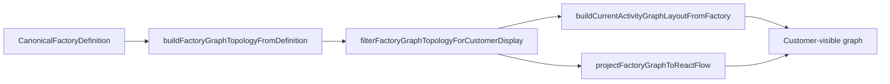

# PRD: Hide Cron / System-Time Utility Topology from Factory Graph UI

## Introduction

Cron and other time-driven workstations rely on internal `__system_time` work: a dedicated work type (`__system_time`), a `pending` place, and an expiry transition workstation (`__system_time:expire`, often rendered as `workstation:__system_time:expire` in graph node IDs). These entities are required for runtime scheduling and replay, but they are not customer-facing workflow.

Today, factory graph surfaces built from the canonical factory definition (current-activity observer graph and factory graph editor) include this internal topology. Customers see extra workstations, work types, states, and edges that do not represent their authored workflow. Timeline replay already projects a public dashboard topology that omits `__system_time` internals while preserving the canonical factory payload for diagnostics.

This project hides internal system-time graph entities from UI rendering using the same product intent as existing resource-availability collapsing: keep canonical data intact, filter only what is painted in the graph, and prove behavior with direct layout/projection tests.

## Context

### Customer ask

Various utility workstations and work states appear in the factory graph because they are not hidden. Hide them from the UI and add tests that validate hiding the same way we validate hiding resources—primarily for `__system_time` (`workstation:__system_time:expire`, `pending`, the work type, and related edges).

### Concrete problem

- Observer and editor graphs are built from full `CanonicalFactoryDefinition` topology via `buildFactoryGraphTopologyFromDefinition`, which currently emits all work types, work states, workstations, and edges.
- Internal cron plumbing (`__system_time`, `__system_time:pending`, `__system_time:expire`) therefore appears alongside real customer workstations (for example cron triggers like `cron:cleaner`).
- Dashboard timeline topology projection already filters these (`replayFactoryTopology.ts`, `systemTime.ts`) but graph layout paths do not, causing a confusing mismatch between “monitor” topology and visible graph.

### High-level solution

Introduce a shared **customer-display graph filter** aligned with existing system-time contracts (`pkg/interfaces` constants and `ui/.../timeline/systemTime.ts`). Apply it at graph **render** boundaries (current-activity layout and factory graph editor React Flow projection), not at canonical factory persistence or timeline snapshot factory fields. Strip:

- the `__system_time` work-type node and `pending` work-state node;
- the `__system_time:expire` utility workstation node;
- any edges whose source or target resolves to filtered nodes;
- system-time IO edges on otherwise public workstations (continue/failure/rejection/output/input routes that only exist for internal ticking).

Customer-authored cron workstations and public work types remain visible.

## Goals

- Remove internal `__system_time` graph clutter from factory graph UI surfaces.
- Preserve canonical factory definitions, event replay, and existing timeline topology filtering behavior.
- Reuse one shared visibility rule set for observer and editor graph rendering.
- Add direct automated tests patterned after resource-availability graph tests (raw topology may still contain entities; rendered layout/projection must not).

## Project-level acceptance criteria

- [ ] Factory graph UI (current-activity observer and factory graph editor) does not render `__system_time` work type, `__system_time:pending` work state, or `__system_time:expire` workstation nodes.
- [ ] No graph edge in customer-facing surfaces connects to or from filtered system-time nodes; mixed customer workstations no longer show internal tick/expire routes.
- [ ] Customer cron workstations and their public work types/states remain visible and selectable where they were before.
- [ ] Canonical factory payloads and timeline `snapshot.factory` continue to retain `__system_time` data; existing `factoryTimelineSnapshotFactoryGraph` expectations for topology omission remain passing.
- [ ] Automated tests demonstrate the filter on rendered graph output (node IDs / edge IDs / React Flow projection), following the resource-hiding test style in `react-flow-current-activity-card-graph.test.ts`.
- [ ] Typecheck, lint, and tests pass for touched packages.

## User Stories

### cron-workstation-ui-hide-001: Shared customer-display graph visibility rules

**Description:** As a maintainer, I need one authoritative rule set for “internal system-time graph entities” so observer and editor surfaces hide the same nodes and edges.

**Acceptance Criteria:**

- [ ] A shared graph visibility module (for example under `ui/src/features/factory-graph-editor/lib/`) exposes predicates/filtering for system-time work types, places/work-states, utility workstations (`__system_time:expire`), and edges touching them, aligned with `SYSTEM_TIME_*` constants in `ui/src/features/timeline/state/timeline/systemTime.ts` and `pkg/interfaces/factory_config.go`.
- [ ] `filterFactoryGraphTopologyForCustomerDisplay` (or equivalent) returns a topology with filtered nodes and edges removed consistently (no orphan edges).
- [ ] Unit tests cover: pure system-time factory fixtures, mixed public/system-time workstation fixtures, and a negative case where a normal customer workstation remains.
- [ ] Typecheck passes
- [ ] Tests pass

### cron-workstation-ui-hide-002: Hide system-time topology from current-activity graph layout

**Description:** As a customer viewing the workflow graph, I want internal cron/system-time plumbing hidden so I only see my authored factory workflow.

**Acceptance Criteria:**

- [ ] `buildCurrentActivityGraphLayoutFromFactory` applies the shared customer-display filter before seeding layout nodes/edges (same stage resource-availability nodes are skipped).
- [ ] Rendered layout node IDs do not include `work-type:__system_time`, `work-state:__system_time:pending`, or `workstation:__system_time:expire` for factories containing cron/system-time definitions.
- [ ] A workstation that routes some outputs to `__system_time` still renders, but without edges to internal pending/expire nodes.
- [ ] Layout test mirrors the resource-availability pattern: raw `buildFactoryGraphTopologyFromDefinition` may still contain system-time entities; `buildCurrentActivityGraphLayoutFromFactory` output must not.
- [ ] Typecheck passes
- [ ] Tests pass

### cron-workstation-ui-hide-003: Hide system-time topology from factory graph editor projection

**Description:** As a customer editing the factory graph, I want the editor canvas to match the observer graph and not surface internal utility workstations or states.

**Acceptance Criteria:**

- [ ] Factory graph editor React Flow projection (`projectFactoryGraphToReactFlow` / `buildFactoryGraphEditorFlowModel`) applies the shared customer-display filter to topology before nodes/edges are materialized.
- [ ] Editor projection tests confirm system-time node IDs and incident edges are absent while customer workstations remain addressable.
- [ ] Draft/save paths that need full canonical topology for validation are not broken; filtering is limited to display projection (canonical document unchanged).
- [ ] Typecheck passes
- [ ] Tests pass

### cron-workstation-ui-hide-004: End-to-end graph card verification for cron factories

**Description:** As a customer with cron-enabled factories, I want the dashboard graph card to stay readable and free of `__system_time` clutter in the live UI.

**Acceptance Criteria:**

- [ ] React Flow current-activity card coverage (component or graph test using a factory fixture with `__system_time` and a customer cron workstation) asserts no button/node titled or identified as `__system_time:expire` and no `__system_time` work-type chip in the rendered graph.
- [ ] Customer cron workstation (for example `Nightly Cron` / `nightly-cron`) remains discoverable and selectable when present in the fixture.
- [ ] Typecheck passes
- [ ] Tests pass
- [ ] Verify in browser using dev-browser skill on a factory graph view that includes cron configuration

## Functional Requirements

- FR-1: Define customer-display visibility for internal system-time graph entities using existing `__system_time` contract IDs.
- FR-2: Filter topology at render boundaries for current-activity layout and factory graph editor projection.
- FR-3: Remove incident edges when either endpoint is filtered; do not leave dangling handles or edges.
- FR-4: Do not mutate canonical factory definitions, OpenAPI factory payloads, or timeline `snapshot.factory` when hiding UI topology.
- FR-5: Keep dashboard timeline topology projection behavior unchanged (already omits `__system_time` in `snapshot.topology`).
- FR-6: Add automated tests proving filtered rendered output; raw topology builders may remain unfiltered for diagnostics parity tests.

## Non-Goals

- Hiding customer-visible cron workstations or their configured `cron-triggers` (or other public) work types unless they are purely internal utility nodes under the system-time contract.
- Changing backend `/work`, `/status`, or work-query filtering (already hides system-time work items).
- Removing `__system_time` from event streams, replay logs, or canonical factory API responses.
- New visibility preset UX; this work applies to default graph rendering regardless of preset.
- Broad graph refactors unrelated to system-time/cron utility hiding.

## High-level technical design

1. **Contract alignment**  
   Reuse `SYSTEM_TIME_WORK_TYPE_ID`, `SYSTEM_TIME_PENDING_PLACE_ID`, and `SYSTEM_TIME_EXPIRY_TRANSITION_ID` from `systemTime.ts` (mirroring `pkg/interfaces`). Utility workstation detection matches timeline replay: workstation id/name equals `__system_time:expire`.

2. **Shared filter**  
   Implement `filterFactoryGraphTopologyForCustomerDisplay(topology: FactoryGraphTopology): FactoryGraphTopology` that:
   - drops work-type node `__system_time`;
   - drops work-state nodes whose work type is `__system_time`;
   - drops workstation node for `__system_time:expire` (by workstation name/id used in graph keys);
   - drops edges referencing removed node IDs;
   - optionally normalizes mixed workstation edges the same way `isPublicWorkstationIO` trims timeline workstation topology.

3. **Apply at render choke points**  
   - `buildCurrentActivityGraphLayoutFromFactory` — after `buildFactoryGraphTopologyFromDefinition`, before resource-availability skipping and seeding.  
   - `projectFactoryGraphToReactFlow` (or `buildFactoryGraphEditorFlowModel`) — before node/edge materialization.

4. **Testing strategy**  
   - Unit tests on filter helper (001).  
   - Layout integration test comparing raw vs filtered node/edge IDs (002), modeled on `constrains sample factory resource availability aliases to one rendered node`.  
   - Projection test for editor flow (003).  
   - Card-level test or story play for cron factory (004).  
   - Do not add meta-tests that scan file lists or registration inventories.

## Supporting technical and UX considerations

- **Parity with timeline**: `factoryTimelineSnapshotFactoryGraph.test.ts` already expects `snapshot.topology` JSON not to contain `__system_time` while `snapshot.factory` does; graph UI should match that public topology intent.
- **Node ID conventions**: Workstation nodes use `workstation:${name}`; work states use `work-state:${workType}:${state}`; tests should assert these IDs, not implementation helpers.
- **Resource hiding precedent**: `resourceAvailabilityWorkTypeNames` + skip logic in `current-activity-factory-graph-layout.ts` is the pattern to mirror for test structure and filter placement.
- **Accessibility**: Removing nodes should not leave focusable ghost controls; filtered nodes must not appear in React Flow `nodes` arrays passed to the canvas.
- **Editor drafts**: If draft topology is built from full definition, apply display filter only when projecting to React Flow so internal validation that references full graphs continues to work.

## Success metrics

- Graphs for cron-enabled sample/replay factories show zero `__system_time*` nodes or edges in the rendered canvas.
- No customer reports of “mystery” `__system_time:expire` workstations in factory graph views after release.
- No regressions in timeline snapshot tests or resource-availability graph tests.

## Open Questions

None blocking implementation; contract IDs and timeline filtering behavior are already established in-repo.
