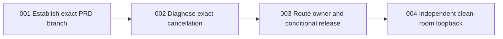

# PR #2631 TTS plan-branch recovery and CI release handoff

## 1. Problem and desired outcome

### Problem statement
The reviewed Factory-managed TTS correction cannot be delivered because the prior PRD claimed the retained implementation branch as this Work's branch identity and required Backend Unit Coverage twice cancelled at PR #2631's unchanged head.

### Current behavior and gap
The PRD reader rejected `tasks/todo/localai-tts-pr2631-ci-cancellation-owner-20260923.json` because its `branchName` was `localai-tts-factory-managed-backend-repair-20260922 (retained PR #2631)` instead of this Work's exact name. PR #2631 is OPEN and mergeable at `1f0fdcb075788670a209a6ceec21434af5f71b36`; its eight-file diff, direct and `@you/tts` cold/warm WAV and 14-event lineage evidence, and prior review are retained. Run `35781141584` attempt 1 job `106926867509` and attempt 2 job `106947274488` cancelled. Attempt 2's coverage step ended at 21:38:32Z, about 5m07s after job start, under the configured five-minute unit-job ceiling; always-run reporting ended at 21:40:05Z. The uploaded diagnostics say the test phase completed in 159.524 seconds and `command.log` reached the coverage result, so a failing TTS assertion has not been established. Verification Policy failed because Backend Unit Coverage was cancelled. Main run `35828877253` completed the same named job successfully; its cache restore took 9 seconds, compared with 109 seconds on the cancelled PR attempt. This is a strong critical-path lead, still requiring attempt/base and resource comparison before owner assignment.

### Desired outcome and success measures
The new PRD parses with `branchName` exactly `localai-tts-pr2631-plan-branch-recovery-20260923` from its own separate worktree/branch. Within a 60-minute read-only diagnosis, identify the cancellation mechanism from the exact job, a comparable base/main run, resource and workflow evidence, and name the owner and exact condition that would justify one cause-corrected run. If that condition is independently witnessed, obtain terminal required checks at a changed PR head or proven corrected baseline, independent current-head review, and ordinary merge/consume. Otherwise hand off the exact release event to Factory Reliability and keep PR #2631 blocked.

## 2. Scope and constraints

### In scope
- Exact PRD branch identity in a separate worktree, PR #2631 delivery/evidence, exact-head CI diagnosis, and TTS-private branch correction only if a source cause is demonstrated.
- Read-only inspection of shared `.github/workflows/ci.yml`, PR #2637, workflow history, job logs, diagnostic artifact, and comparable main/base runs.
- Conditional cause-corrected CI handoff and review-owned merge after all required checks succeed.

### Non-goals
ASR, LLM CLI, Factory Reliability implementation, speech semantic acceptance, generated public-contract edits, and broad test or workflow redesign.

### Assumptions and constraints
Source plan: `docs/temp/projects/localai/source-plan.md`, especially “Backend artifacts and CI compilation”, “Factory inference and the OmniVoice switch”, “Functional test plan”, `V4` and `C1` in “Lane plan”, “Acceptance criteria”, “Verification”, and its bounded operator amendments; immutable criteria in `docs/temp/projects/localai/acceptance.md` and `operator-amendment-v3.md`. `work-plan-6` is the failed Factory Work identity, not a second governing file. The source plan's `P3` workflow ownership is respected through read-only use here; `.github/workflows/ci.yml` and Factory Reliability PR #2637 are excluded without an explicit lease. One unchanged failed-job rerun is spent. Windows amd64; exact commit and artifact hashes; isolated cache, state and ports; 60-minute investigation; zero new model download; at most one backend and two real TTS calls of at most 10 minutes each only if cause requires them; 3 GiB incremental disk; $0; one corrected executor retry.

`operator-amendment-v2.md` supersedes the source plan's fixed VibeVoice-7B selection. This delivery slice preserves the resolved TTS dependency already reviewed in PR #2631 and does not reinstate a prescribed model pin.

### Open questions
- The 109-second cache restore and completed 159.524-second test phase explain most of the five-minute critical path, but the exact cancellation trigger and ownership require the first-attempt, resource, workflow and base comparison. Safe assumption: treat the five-minute ceiling as a delivery constraint and keep CI blocked; do not label it an external outage or raise it without owner evidence.
- Has the workflow/process owner released a changed baseline that removes the observed bottleneck? Safe assumption: no until a specific merged commit and successful comparable run are recorded.

### Replanning triggers
A named failing test, demonstrated TTS-private regression, new head, source-plan conflict, changed required-check policy, or workflow owner request for an out-of-lease edit requires a bounded delta plan and owner handoff.

## 3. Recommended approach
Use four narrow tasks: establish exact PRD/worktree identity, diagnose the exact-head cancellation, route a cause-corrected owner/release event, then independently validate delivery. The first task establishes the reader-to-worktree executable spine; later tasks preserve the retained product path and extend that spine through the actual PR gate. The shared workflow's existing owner retains all workflow mutation authority.

### Decision record

| Option | Decision | Evidence and tradeoff |
| --- | --- | --- |
| Another unchanged failed-job rerun | Reject | One was spent and produced the same cancellation; no changed condition. |
| Raise the unit-job timeout in this lane | Reject | Five minutes is an explicit current delivery constraint and workflow is leased to PR #2637/Factory Reliability. |
| Compare logs, artifact, and main/base timing; route the demonstrated cause | Choose | Gives an actionable owner without disturbing the reviewed eight-file TTS diff. |

## 4. Customer behavior

### Actors, roles, and permissions
The TTS reviewer may inspect PR/CI and merge under ordinary policy after terminal green checks. Factory Reliability owns shared workflow edits. Independent engineering and blind customer validators own later acceptance, not this CI-recovery slice.

### User journeys
Reviewer opens PR #2631, sees the exact TTS head and required checks, diagnoses the cancelled unit job, follows the corrected owner gate, and either merges after independent approval and terminal green checks or receives a named blocker with evidence.

### Default, loading, empty, success, error, and permission states
Default is OPEN/BLOCKED; pending checks remain pending. Success is terminal required checks and ordinary merge. A missing artifact, unavailable comparable run, or insufficient workflow authority yields a structured blocked handoff. There is no UI or permission model change.

### Accessibility, keyboard, focus, responsive, and localization behavior
Not applicable: no visible UI changes.

### Visual references
Not applicable: no visual design change.

## 5. Contracts and data

### Contract inventory and compatibility classification

| Contract/component | Authored source | Classification | Consumers |
| --- | --- | --- | --- |
| TTS packaged Factory source and generated distribution retained in PR #2631 | `packages/packaged-factories/factories/tts/factory.yaml` | Unchanged by this slice | Factory Definitions, Models, Workers |
| PRD work branch identity | `tasks/todo/localai-tts-pr2631-plan-branch-recovery-20260923.json` | Changed, internal configuration | PRD reader and workspace setup |
| Required CI job and Verification Policy | `.github/workflows/ci.yml`, `scripts/verification-policy.mjs` | Unchanged/read-only | PR review and branch protection |
| Public Go, OpenAPI, CLI, event, persisted schema, configuration | Existing authored sources | Unchanged | Existing callers |

### HTTP API and OpenAPI changes
Not applicable: this slice changes no public interface.

### Configuration and schema changes
#### PRD branch identity

Authored source: previous `tasks/todo/localai-tts-pr2631-ci-cancellation-owner-20260923.json`; proposed `tasks/todo/localai-tts-pr2631-plan-branch-recovery-20260923.json`.

Current:

```json
{
  "project": "localai",
  "branchName": "localai-tts-factory-managed-backend-repair-20260922 (retained PR #2631)",
  "context": {
    "sourcePlan": "docs/temp/projects/localai/source-plan.md"
  }
}
```

Proposed:

```json
{
  "project": "localai",
  "branchName": "localai-tts-pr2631-plan-branch-recovery-20260923",
  "context": {
    "sourcePlan": "docs/temp/projects/localai/source-plan.md"
  }
}
```

Compatibility: the prior rejected PRD remains historical evidence; the new file is a separate Work artifact and does not rename PR #2631 or its retained head. Migration: create a separate worktree/branch with the exact new name and point the PRD reader at the new JSON. Generated outputs: none. Consumers: PRD reader, workspace setup, Factory task routing. Rollback: retire this new plan branch without altering the retained PR. The five-minute workflow limit is diagnosed, not edited; any workflow change requires its lease holder's separate Current/Proposed YAML delta.

### CLI, event, message, and persisted-contract changes
Not applicable: no shape changes.

### Persisted data, migration, retention, and rollback
No product migration. CI logs and the uploaded diagnostics artifact are evidence with existing retention; the PR comment is the durable review pointer. The new PRD branch is separate from retained PR #2631. A source correction, if later demonstrated, must be independently revertible on the retained TTS branch through an authorized implementation route.

### Generated artifacts and consumers
No generation in this slice. Retained PR #2631 already contains canonical TTS factory source plus generated package output, which review checks for consistency.

## 6. Architecture and state

### Current-state flow
The PR head selects backend coverage; the Ubuntu hosted unit job runs controlled LocalAI component tests then `make test-unit-coverage`; job cancellation prevents a complete unit verdict; Verification Policy consumes `BACKEND_RESULT=cancelled` and fails; branch protection blocks merge. Canonical product Factory state is not mutated by this delivery issue.

### Target-state flow
Keep the TTS eight-file diff intact. Classify the cancellation from exact job diagnostics and comparable base timing; send a cause-corrected request to the CI/process owner, or consume a witnessed changed workflow baseline. A fresh run is permitted only after that event. Review then inspects terminal checks and current-head behavior and merges under normal policy.

### Runtime sequence and dependencies
Models owns managed TTS backend invocation; Workers invokes Models for Factory TTS; Work/Recordings preserve output and event lineage. Existing direct and Factory TTS proof remains the runtime evidence. This task only advances the PR/CI delivery sequence.

### Canonical, projected, and ephemeral state
Git commit and PR head identify code; GitHub job/check records identify CI outcomes. Verification Policy is a projection of selected job conclusions. Logs and diagnostic artifacts are ephemeral evidence. No Factory Event ledger or Work state is changed.

### Mutation ownership and consistency boundaries
TTS branch owner may correct TTS-private files if evidence identifies a source defect. Factory Reliability owns `.github/workflows/ci.yml`; GitHub Actions owns job status; review owns merge. Compare all evidence to exact head and run attempt before any action.

### Legacy path and removal plan
Not applicable: the source plan's OmniVoice removal belongs to `D1`, outside this retained PR's CI recovery.

## 7. Failure modes and quality attributes

| Case | Detection | Customer outcome | State/recovery | Telemetry | Evidence |
| --- | --- | --- | --- | --- | --- |
| Named unit assertion fails | Job log and diagnostics | PR blocked | TTS-private defect owner or baseline owner; no rerun until correction | Package/test name, attempt/head | Job log/artifact |
| Job ceiling reached | Step/job timestamps and main/base comparison | PR blocked | CI/process owner reduces critical path or explicitly revises policy under its lease | Step durations, cache hit, package timing | Both attempts plus comparable run |
| GitHub runner externally cancelled | GitHub cancellation/incident evidence independent of job ceiling | PR blocked | Factory Reliability/platform owner restores service; one changed-condition run | Runner and cancellation reason | Actions API/status evidence |
| PRD reader rejects branch | Parse error naming branchName | This Work cannot start implementation | Keep retained PR read-only; correct exact new branch/JSON identity | Reader error, branch/worktree state | Parse in isolated worktree |
| Artifact missing or partial | Artifact listing/download | PR blocked | Preserve logs, name missing evidence and owner | Artifact ID/retention | `gh api` and PR comment |
| New head or merge conflict | `gh pr view` | No stale approval | Reconcile new diff and current-head checks | SHA, base SHA, merge status | PR view |
| Concurrent workflow edit | PR #2637/lease inspection | No conflicting edit | Workflow owner resolves in its lane | PR head/patch | PR files/patch |
| Review blocker | Independent review finding | No merge | Scoped correction, new exact-head checks | Review thread | PR review |

### Performance and scale
The five-minute CI job limit is a current gate, not a proposed local benchmark. Treat package timings as diagnostic; compare step critical path, cache restoration, and base/main runs. Do not demand low-variance local timing rituals. If a package-level performance correction becomes necessary, preserve tests and use directional current-PR package results as verdict, with one bounded follow-up pass if non-improving.

### Reliability and availability
No waiver, manual completion, unchanged second rerun, or administrative merge. A pending gate is a wait state; terminal cancellation requires cause routing.

### Security and privacy
Read CI evidence without exposing tokens, model assets, private payloads, cache paths, or runner secrets in PR comments. No new network/model operation beyond GitHub read calls and at most one authorized hosted CI run.

### Cost and resource limits
Diagnosis maximum 60 minutes; Windows amd64; zero new model downloads; at most one backend and two real TTS calls of at most 10 minutes each only if the demonstrated cause requires them; 3 GiB incremental disk; $0; one corrected executor retry. At most one cause-corrected hosted run after a witnessed changed condition. Record exact commit and binary/backend/model artifact hashes, isolated cache/state/ports, Ubuntu hosted runner/workflow revision, job timeout, network policy, and owned process lifetime before triggering. Existing retained real evidence normally avoids any new model call.

### Observability and operational readiness
Record both attempt IDs, job/step timestamps, cache hit and package timing, artifact ID, base/main comparison, owner, changed release event, and next gate in a PR comment; CI-run evidence never enters a commit.

## 8. Rollout, compatibility, and rollback

### Deployment and feature-flag sequence
No deployment or flag. First diagnose, then consume the owner-released correction if one exists; review merges PR #2631 only with current-head green checks.

### Compatibility interval
The retained TTS source/generated pair and public contracts stay as reviewed. No compatibility transition is introduced here.

### Monitoring and stop conditions
Stop on absent changed condition, repeated cancellation, named source defect outside this task, stale head, conflict, or missing independent review.

### Rollback procedure
No new product mutation is planned. If a narrow TTS-private correction is later made and regresses behavior, revert that correction on the retained branch; the shared workflow owner rolls back its own workflow change.

### Deprecation and cleanup owner
`D1` owns OmniVoice removal. CI/process owner cleans any temporary workflow instrumentation it introduces.

## 9. Implementation strategy

### Coverage assessment and characterization needs
P0 TTS characterization is merged (#2157). PR #2631's eight paths include one Models unit characterization and one Factory functional scenario, already reviewed with focused/race and real cold/warm evidence. Count for this plan branch: zero newly changed tests and zero new product behaviors. Existing evidence includes direct and `@you/tts` decodable WAV and 14-event lineage; it does not establish blind semantic speech or public clean install. Characterize CI timing before any structural change. If a cause-supported correction changes unit tests, classify each case at the package boundary and run focused normal/race where concurrency changes. If it changes the Factory functional scenario, require a task delta with the complete given/when/then matrix before coding.

### Parent behavior lanes
- `BEH-ADMISSION`: the PRD reader accepts this Work's own exact branch identity in a separate worktree.
- `BEH-CI`: a reviewer can identify why required CI cancelled and its exact correction owner, without changing the reviewed TTS behavior.
- `BEH-DELIVERY`: a witnessed changed release event allows ordinary terminal CI, independent review, and merge, or produces an exact blocked gate.

### Narrow executable spine
new branch/worktree → parse new PRD `branchName` → `gh pr view 2631 --json headRefOid,statusCheckRollup,mergeStateStatus` → `gh run view 35781141584 --log-failed` → attempt job/diagnostics → owner event → current-head required-check verdict. Existing real TTS runtime proof is retained at the same head; this recovery repeats model execution only if the cause requires it within budget.

### Justified enabling work
Task 001 is a bounded admission enabler because the PRD reader rejects the prior branch identity before implementation; it proves a new Work can be routed without mutating retained PR #2631. Task 002 is a bounded read-only diagnosis because the source/process owner cannot be chosen from a cancelled check alone; it is independently useful as a reproducible owner handoff and precedes any CI mutation.

### Migration or strangler sequence
Not applicable to this delivery-only slice; source-plan `V4` behavior is retained and `D1` remains separate.

### Shared-surface ownership
Factory Reliability PR #2637 exclusively owns workflow changes; this lane is read-only there. TTS owner owns PR #2631 evidence and TTS-private corrections. Review owns terminal CI, conflicts, and merge.

## 10. Verification strategy

| Behavior/gate | Scope | Dependency fidelity | Cadence | Cost | Proves | Does not prove |
| --- | --- | --- | --- | --- | --- | --- |
| `GATE-PRD-ADMISSION` branch and PRD parse | Contract/configuration | controlled local reader | Per PRD change | Free | This Work's branch identity is accepted and separate | CI or TTS behavior |
| `GATE-CI-DIAG` exact run/job and comparable base | Integration delivery evidence | remote real GitHub Actions | Once per cause | Free, bounded API/time | Cancellation mechanism/owner and whether ceiling is implicated | TTS speech semantics |
| `GATE-TTS-RETAINED` exact-head prior review and real output | Integration/end-to-end | local real | Reuse while SHA unchanged | No new spend | WAV decoding, warm reuse, Factory lineage as recorded | Blind acceptance or public install |
| `GATE-CI-RELEASE` current-head required checks | Integration delivery gate | remote real hosted CI | Once after changed event | One bounded run | Required CI terminal/pass for exact head | Independent runtime semantic acceptance |
| `GATE-REVIEW-MERGE` independent review | End-to-end delivery | remote real PR | Per changed head | Free | All blockers resolved and ordinary merge | Whole Project acceptance |
| `GATE-CLEAN-ROOM` independent read-only loopback | End-to-end review | remote real PR plus retained local-real evidence | Once at handoff | Free | Evidence identity, criteria map, owner/gate correctness | New speech semantics |
| `GATE-LA14-LA15` fresh blind public install | End-to-end | local real/remote real as platform requires | Per usable vertical, later | Separate declared budget | Discovery, meaningful speech, clean install | This slice does not perform it |

### Functional test-case matrix
Not applicable to the planned admission and diagnosis: no functional tests are added or changed. If diagnosis requires changing the retained Factory functional test, a bounded plan delta must enumerate all distinct given/when/then happy, unhappy and public boundary behaviors before that correction starts; retained PR #2631's case is reviewed, not silently reauthored here.

### Test-layer design
No test files are planned to change. Diagnostic inspection is delivery evidence, not a test. If a TTS-owned correction changes a unit test, its behavior/observer is managed backend start, cancellation or cleanup through the package service boundary with controlled subprocess/network edges; focused package normal/race tests prove that property, not the whole customer journey. The retained Factory functional test observes public Work and Factory Events through `root.BuildProcess`/`Process.Execute`, controlled external edges, a `--named` local Factory invocation, per-test temporary homes/cache, and `t.Parallel`; it does not demonstrate an explicit-session shared-process fixture. A changed functional test requires explicit-session/shared-process analysis, parallel isolation and the full distinct behavior matrix in a delta plan. The retained real direct and `@you/tts` proof uses a prebuilt artifact owned by the prior release lane; review checks exact hash and the deliberately limited case set. No load or source-inventory test is added. Repository-shape enforcement belongs to lint. The required Backend Unit Coverage lane owns package timings; do not duplicate its corpus solely for performance measurement.

### Paid-validation budgets and evidence-reuse keys
No paid validation. Hosted CI allowance: trigger only after a recorded source/workflow/process/base change; maximum one cause-corrected run and one corrected executor retry; maximum one backend plus two real TTS calls only if cause requires, each at most 10 minutes; $0 and zero new model download; fixture is the retained declared text/audio validator; reuse key is exact commit, contract version, backend/model hashes, Windows amd64, fixture, target environment and configuration hash. Prior local-real TTS evidence reuse key is PR head `1f0fdcb075788670a209a6ceec21434af5f71b36` plus recorded binary/model/backend/platform/config and fixtures in PR review; any head or dependency change requires relevance review.

### Remaining unproven edges and owning gates
Blind meaningful speech/public installation → `GATE-LA14-LA15`; macOS/Linux/Windows real conformance → `GATE-C1`; overall semantic artifacts and other operation families → Project `LA-04/LA-06` validation; terminal current-head CI → `GATE-CI-RELEASE`; merge → `GATE-REVIEW-MERGE`.

## 11. Task dependency graph



## 12. Tasks

### localai-tts-pr2631-plan-branch-recovery-20260923-001 — Admit this Work on its own branch

**Parent behavior:** `BEH-ADMISSION` — the PRD reader accepts this Work's exact branch identity without conflating retained PR #2631.

**Problem:** The previous PRD reader rejected a `branchName` belonging to the retained implementation PR.

**Outcome:** A separate worktree and branch named `localai-tts-pr2631-plan-branch-recovery-20260923` contains a parseable Markdown/JSON PRD pair with that exact `branchName`.

**Plan reference:** `C:\Users\andre\work\portos\infinite-you\docs\temp\projects\localai\source-plan.md` “Lane plan” V4/C1 and “Verification”; `acceptance.md` LA-10, LA-13; this PRD `BEH-ADMISSION`.

**Actor and trigger:** Factory PRD reader receives this Work after `work-plan-6` failed admission.

**Dependencies:** None.

**Parallel and shared-surface ownership:** This Work owns only its new branch and PRD pair. Retained branch `localai-tts-factory-managed-backend-repair-20260922` and PR #2631 remain read-only evidence; Factory Reliability owns workflow files.

**Scope:**
- In: exact new branch/worktree, matching JSON field, reader parse and story IDs.
- Out: retained PR branch/head changes, product changes, CI retry.

**Implementation constraints:** Preserve the prior rejected PRD and the retained implementation as history; no immutable preflight hashes or path allowlists in admission metadata.

**Contract and configuration excerpts:** Authored source: `tasks/todo/localai-tts-pr2631-plan-branch-recovery-20260923.json`, `branchName`.

Current:

```json
{
  "project": "localai",
  "branchName": "localai-tts-factory-managed-backend-repair-20260922 (retained PR #2631)",
  "context": {
    "sourcePlan": "docs/temp/projects/localai/source-plan.md"
  }
}
```

Proposed:

```json
{
  "project": "localai",
  "branchName": "localai-tts-pr2631-plan-branch-recovery-20260923",
  "context": {
    "sourcePlan": "docs/temp/projects/localai/source-plan.md"
  }
}
```

Generated outputs: none. Consumers: PRD reader and workspace setup.

**Acceptance criteria:**
- [ ] Given the new JSON, when the PRD reader parses it, then `branchName` equals this Work's name byte for byte and all four sequential story IDs are accepted.
- [ ] Given the retained PR branch, when workspace identity is inspected, then its head remains `1f0fdcb075788670a209a6ceec21434af5f71b36` and no write to it occurred.
- [ ] Given a parse or worktree conflict, when setup stops, then it reports the exact conflict and preserves both branches.

**Verification:**
- Behavioral witness: the reader accepts the new PRD and resolves this Work to its separate worktree.
- Executable-spine effect: `establish`.
- Required evidence: scope contract/configuration; fidelity controlled local; cadence per PRD change; cost free; procedure parse the new JSON and invoke the Factory PRD reader, then inspect `git worktree list --porcelain` and PR #2631 head; proves admission identity and custody; does not prove CI or TTS behavior.
- Highest feasible level: local Factory admission because this task changes only its task artifact.
- Remaining unproven edges: cancellation cause → `GATE-CI-DIAG`; terminal CI → `GATE-CI-RELEASE`.
- Test-layer design: no test changed; reader parse is a contract check, not a source-scanning meta test.

**Operational and rollout notes:** The new branch can be discarded without touching PR #2631; stop on duplicate branch/worktree identity.

**Escalation:** Report malformed reader input or a branch collision with exact paths and smallest correction; do not reuse the retained implementation branch.

**Handoff artifacts:** New PRD Markdown/JSON, separate worktree/branch, reader result.

### localai-tts-pr2631-plan-branch-recovery-20260923-002 — Identify the cancellation cause and owner

**Parent behavior:** `BEH-CI` — reviewer can route the exact required-check failure to the demonstrated owner.

**Problem:** Two cancelled unit jobs lack a measured causal comparison.

**Outcome:** An exact-head diagnosis records job timings, diagnostics, comparable base/main evidence, and a named owner/changed-condition gate.

**Plan reference:** `C:\Users\andre\work\portos\infinite-you\docs\temp\projects\localai\source-plan.md` §§“Backend artifacts and CI compilation”, “Verification”, `V4`/`C1`; `acceptance.md` LA-03, LA-10, LA-13.

**Actor and trigger:** TTS reviewer inspects PR #2631 at `1f0fdcb...` with run `35781141584` terminal cancelled.

**Dependencies:** Story 001 admission.

**Parallel and shared-surface ownership:** Read-only alongside PR #2637; Factory Reliability owns workflow edits. The retained TTS branch is read-only during this diagnostic task.

**Scope:**
- In: PR/check query, both job attempts and steps, uploaded unit diagnostics, workflow timeout and cache behavior, comparable passing base/main run, cancellation classification.
- Out: workflow edit, rerun, TTS source change, model invocation.

**Implementation constraints:** Timebox 60 minutes; avoid secrets in evidence; do not call a five-minute ceiling shared infrastructure without comparison.

**Acceptance criteria:**
- [ ] Given the exact head, when jobs and artifact are inspected, then both cancellation timestamps, completed 159.524-second test phase, last completed step/package, 109-second cache restore, resource context, and Verification Policy dependency are recorded with source URLs/IDs.
- [ ] Given a comparable passing base/main run, when its unit critical path is compared, then the likely cancellation mechanism and precise CI/process or TTS source owner are identified, or an evidence-limited uncertainty is explicitly routed.
- [ ] Given a missing artifact or comparator, when diagnosis reaches the timebox, then the handoff names the missing evidence and owner without an unchanged rerun.

**Verification:**
- Behavioral witness: reviewer can reproduce the cancellation-to-Verification-Policy chain and identify the next responsible owner.
- Executable-spine effect: `establish`.
- Required evidence: scope integration delivery; fidelity remote real; procedure `gh pr view 2631 --json headRefOid,statusCheckRollup,mergeStateStatus`, both attempts of `gh run view 35781141584`, `gh api repos/portpowered/you-agent-factory/actions/jobs/106947274488`, artifact `10720088803` (`unit-timing-summary.json` SHA-256 `13169f4e90d17842efd1153dbf2e5b0e7ab8aac34e57f496894a669daf2d4fd4`), and main run `35828877253`; proves exact cancellation timing/owner; does not prove TTS speech or a passing release gate. Cadence once per cause; cost free/bounded GitHub API and 60 minutes.
- Highest feasible level: remote-real hosted CI records; no new execution needed for diagnosis.
- Remaining unproven edges: corrected run → `GATE-CI-RELEASE`; blind speech/install → `GATE-LA14-LA15`.
- Test-layer design: no test changed; job logs and diagnostics are operational evidence.

**Operational and rollout notes:** Store concise evidence and owner in PR comment; no product rollout.

**Escalation:** If cause remains unknown at the timebox, preserve the measurements and hand off to CI/process owner with the exact missing comparator/artifact.

**Handoff artifacts:** PR evidence comment and cause/owner/gate tuple.

### localai-tts-pr2631-plan-branch-recovery-20260923-003 — Consume a witnessed corrected CI condition or hand off the blocker

**Parent behavior:** `BEH-DELIVERY` — required CI can advance only from a cause-corrected release event.

**Problem:** An unchanged retry has already failed and cannot satisfy branch protection.

**Outcome:** Exact changed-event and owner handoff, followed by at most one justified current-head run and ordinary review/merge if all gates pass.

**Plan reference:** `C:\Users\andre\work\portos\infinite-you\docs\temp\projects\localai\source-plan.md` §§“Lane plan” (`P3`, `V4`, `C1`), “Acceptance criteria”, “Verification”; `acceptance.md` LA-09, LA-10, LA-12, LA-13.

**Actor and trigger:** CI/process owner publishes a changed workflow/process baseline or a measured TTS-private source cause is corrected.

**Dependencies:** Story 002.

**Parallel and shared-surface ownership:** Factory Reliability PR #2637 owns `.github/workflows/ci.yml`; TTS branch owner controls only PR #2631 private diff/evidence; review owns merge.

**Scope:**
- In: verify changed commit/event, record Windows amd64 and exact artifact hashes, isolate state/cache/ports, bound process lifetime, make only a demonstrated TTS-owned source/test/delivery correction if needed, one cause-corrected hosted run if justified, terminal checks, independent review, ordinary merge or precise blocked handoff.
- Out: unchanged rerun, waived/manual check, shared workflow edit, broad source reimplementation.

**Implementation constraints:** Preserve reviewed eight paths and exact head unless evidence proves a TTS-private defect; any changed head requires focused TTS/Factory normal and race tests as applicable, review of the delta and new current-head checks. If a functional test must change, obtain a delta plan with its full customer-behavior matrix before coding. `.github/workflows/ci.yml` and PR #2637 remain excluded without explicit lease.

**Acceptance criteria:**
- [ ] Given a witnessed changed PR head or corrected baseline condition, when one hosted execution runs, then Backend Unit Coverage and Verification Policy finish terminal success on the same reviewed head before ordinary merge.
- [ ] Given shared infrastructure ownership, no changed condition, or a repeat failure, when the gate is assessed, then PR #2631 remains OPEN/BLOCKED with exact Factory Reliability release event, job, cause evidence, and next gate; no rerun, waiver or manual Work completion occurs.
- [ ] Given a source-specific failure, when review routes it, then the smallest TTS-private correction is separately reviewed and all current-head checks restart.

**Verification:**
- Behavioral witness: PR shows either merged current-head green gate and independent review, or a precise blocked owner handoff.
- Executable-spine effect: `promote`.
- Required evidence: scope integration delivery; fidelity remote real; procedure compare `gh pr view 2631 --json headRefOid,statusCheckRollup,mergeStateStatus` with changed workflow/base SHA, run/job API and review/merge state; proves terminal current-head gate or exact blocker; does not prove blind speech, cross-platform conformance, or other verticals. Cadence once after changed event; cost one hosted run, zero paid/backend calls.
- Highest feasible level: remote-real hosted required CI and review. New runtime proof is not applicable because this task changes no TTS behavior; exact-head real WAV/lineage evidence remains the runtime input.
- Remaining unproven edges: Project real platform matrix → `GATE-C1`; public clean install and semantic speech → `GATE-LA14-LA15`.

**Paid validation, when applicable:** Trigger witnessed cause correction; maximum hosted runs 1 and one corrected executor retry; maximum backend calls 1 and real TTS calls 2 only if the cause requires them, each at most 10 minutes; zero model downloads, maximum paid cost $0 and 3 GiB incremental disk; fixture is the retained declared text/audio validator; reuse key exact head SHA + workflow/base SHA + Ubuntu runner + Go version/cache key + Windows binary/backend/model hashes + config/fixture hash + run attempt.

**Operational and rollout notes:** PR comment records run evidence, never a commit. Stop at repeat cancellation or failure; rollback of shared workflow belongs to its owner.

**Escalation:** Any needed `.github/workflows/ci.yml` mutation goes to Factory Reliability with exact measured cause; do not collide with PR #2637.

**Handoff artifacts:** Changed-event reference, CI comment, independent review verdict, merge reference or blocked owner/gate.

### localai-tts-pr2631-plan-branch-recovery-20260923-004 — Independently validate the delivery evidence

**Parent behavior:** `BEH-DELIVERY` — independent reviewer can distinguish slice delivery from Project acceptance.

**Problem:** A green or blocked CI status alone does not audit TTS evidence identity and remaining acceptance gates.

**Outcome:** Read-only clean-room report using `factory/docs/standards/validation-loopback-template.md` with criterion-by-criterion verdict and delta request for any failure.

**Plan reference:** `C:\Users\andre\work\portos\infinite-you\docs\temp\projects\localai\source-plan.md` §§“Factory inference and the OmniVoice switch”, “Functional test plan”, “Acceptance criteria”, “Verification”; `acceptance.md` LA-03, LA-04, LA-06, LA-09, LA-10, LA-12, LA-13; `operator-amendment-v3.md` LA-14/LA-15.

**Actor and trigger:** Independent engineering reviewer receives story 002 evidence after owner disposition.

**Dependencies:** Story 003 disposition.

**Parallel and shared-surface ownership:** Validator writes report only; TTS owner and Factory Reliability retain their own surfaces.

**Scope:**
- In: clean checkout/read-only PR inspection, exact-head retained WAV/14-event evidence, source/generated consistency, CI result or blocker, project criterion map, next gates.
- Out: defect repair, new backend/model run, blind speech claim, manual merge.

**Implementation constraints:** Independent from the implementer and blind probe; no silent repair; no acceptance upgrade from WAV nonemptiness.

**Acceptance criteria:**
- [ ] Given the current PR/head, when the independent report is written, then every assigned criterion has PASS/FAIL/BLOCKED, evidence identity, unproven edge, and owning gate.
- [ ] Given red CI or missing blind semantic/public-install proof, when the report concludes, then verdict is BLOCKED for that criterion and a smallest delta-plan request is recorded.
- [ ] Given terminal current-head green CI and no review blockers, when review completes, then the report cites ordinary merge/consume or names the remaining release owner.

**Verification:**
- Behavioral witness: a reviewer can follow the report to the actual PR/job and distinguish retained real TTS proof from later blind acceptance.
- Executable-spine effect: `preserve`.
- Required evidence: scope end-to-end delivery review; fidelity remote real PR plus retained local-real artifact; procedure clean checkout, `gh pr view 2631 --json headRefOid,statusCheckRollup,mergeStateStatus`, exact job/PR comments, template report; proves independent gate/owner classification; does not prove new runtime behavior or meaningful speech. Cadence once after owner disposition; cost free, zero model calls.
- Highest feasible level: independent delivery loopback; actual runtime execution is not applicable to a read-only CI ownership slice and is already retained at unchanged head.
- Remaining unproven edges: blind TTS semantic/install → `GATE-LA14-LA15`; full real platform matrix → `GATE-C1`; whole Project integration → Project validation.

**Operational and rollout notes:** Report through the validation-loopback template; no silent defect fix. Failure requests a delta plan.

**Escalation:** A missing prerequisite or contradictory authority becomes a structured blocker with evidence and smallest next action.

**Handoff artifacts:** Clean-room report, criterion map, PR/owner gate reference.

## 13. Project acceptance criteria

| Criterion | Immutable requirement retained for this slice | Local ownership and evidence | Later gate if incomplete |
| --- | --- | --- | --- |
| LA-03 | Independent engineering validation inspects source, plan, tests, traces and observable claims without self-repair. | Story 004 delivery review. | Full Project engineering validation. |
| LA-04 | Focused functional matrix proves every admitted operation's grammar, resolution, cache, outputs, errors and release. | Retained TTS evidence reviewed; no new functional case. | Project functional matrix. |
| LA-05 | A currently supportable non-TTS operation drives a local Factory Session through admission, invocation, result, canonical event/artifact and release; TTS cannot substitute. | None in this TTS delivery recovery. | `GATE-NON-TTS-FACTORY`. |
| LA-06 | Semantic ASR/TTS/LLM/embed and Factory Work/event/artifact/lineage assertions with identities and release. | Retained TTS WAV decoding and 14-event lineage, without blind speech claim. | `GATE-LA14-LA15`, Project semantic validation. |
| LA-09 | Built real conformance on actual LocalAI/backend across macOS, Linux, Windows; no unavailable platform passes. | No new run. | `GATE-C1`. |
| LA-10 | Declare platform, artifact, state/cache/ports, timeout, process, network, download and retry/call limits before each run. | Story 003 conditional run record within one backend/two TTS call ceiling and zero new model download. | Every later probe owner. |
| LA-11 | Each retrospective finding links observed result, concrete action/owner, and verification command/result; unresolved action is consumed before new scope. | Stories 002–004 record cancellation, owner and release or blocker evidence. | Project retrospective loopback. |
| LA-12 | Preserve governing plan; new public contract needs approved Current/Proposed delta; generated outputs come from source. | No new public shape; retain source/generated TTS pair. | Independent review and Project contract audit. |
| LA-13 | Bounded independently mergeable stories, focused evidence, releasable head, delivery and final script/conformance before Project completion. | Story 001 exact admission and story 003 CI/review/merge or exact blocker. | `GATE-REVIEW-MERGE`, `GATE-C1`, final Project gate. |
| LA-14 | Fresh independent blind acceptance for each usable vertical from immutable installable build, with matrix and engineering evidence. | TTS row prerequisite evidence only. | `GATE-LA14-LA15` blind probe. |
| LA-15 | Public clean install with empty state, documented discovery, real first-use TTS, meaningful speech, warm/offline reuse, cleanup. | Retained direct real WAV and warm reuse are partial prerequisite only. | `GATE-LA14-LA15` public clean-install probe. |

Named quality gates: `GATE-PRD-ADMISSION`, `GATE-CI-DIAG`, `GATE-CI-RELEASE`, `GATE-REVIEW-MERGE`, `GATE-CLEAN-ROOM`, `GATE-NON-TTS-FACTORY`, `GATE-C1`, and `GATE-LA14-LA15`. Clean-room loopback reports PASS/FAIL/BLOCKED per assigned criterion and does not silently repair. A terminal red unit job cannot count as `Tests pass`; the named Backend Unit Coverage job must complete and Verification Policy must succeed on the reviewed head.

Implementation-stage delivery criterion: The implementation stage marks this criterion satisfied and stops after its final head is pushed, the PR is open, CI has started, and all blocking review feedback is addressed. It does not poll or re-check CI after this finish line. The review stage owns driving CI to terminal-and-passing, resolving merge conflicts, and merging the PR; merge remains the lane-wide delivery boundary. CI-run evidence goes in a PR comment and never in a commit.

## 14. References

- `docs/temp/projects/localai/source-plan.md` — governing `V4`/`C1` source plan and delivery rule.
- `docs/temp/projects/localai/acceptance.md` and `operator-amendment-v3.md` — immutable LA criteria, including LA-14/15.
- `docs/temp/projects/localai/operator-amendment-v2.md` — approved dependency selection supersedes fixed VibeVoice-7B identity.
- `factory/docs/standards/planning-standards.md`, `task-template.md`, `review-standards.md`, `testing-standards.md`, `validation-loopback-template.md` — artifact, evidence, and independent review rules.
- PR #2631 `https://github.com/portpowered/you-agent-factory/pull/2631` — retained TTS diff and real evidence.
- Run `https://github.com/portpowered/you-agent-factory/actions/runs/35781141584` — two cancelled attempts and dependent Verification Policy.
- PR #2637 `https://github.com/portpowered/you-agent-factory/pull/2637` — Factory Reliability shared CI owner; the workflow remains excluded without lease.

## 15. Operator-authorized review correction — PR #2642 CI-1

The operator's `RejectionFeedback` authorizes this bounded correction after the exact PR head failed Backend Integration while the exact merge base passed. The blocking review comment is [CI-1](https://github.com/portpowered/you-agent-factory/pull/2642#issuecomment-5792605469), which identifies `TestPortableControlledReservationContention` and the final ledger assertion in `tests/integration/models/platform_conformance/runner_test.go`.

- **Owner:** platform-conformance integration lane.
- **In scope:** Make the contention witness deterministically inject one child-start failure and assert each outcome against its durable reservation state. Capacity rejections must be `budget_exhausted` and absent from the ledger; the failed start must remain as `RELEASED`; successful starts remain `COMMITTED`. Keep the four-start budget and validate the five-row finalized ledger.
- **Out of scope:** Production behavior, shared CI/workflow edits, other platform-conformance scenarios, and broad test-harness redesign.
- **Behavior and observer:** Eight concurrent controlled attempts share one ledger; one injected start failure is released, three capacity losers are rejected, and four children start. The integration test observes each report, process-start count, and final durable ledger; it proves exactly four starts/commits plus one matching released start reservation.
- **Verification:** `go test ./tests/integration/models/platform_conformance -run '^TestPortableControlledReservationContention$' -count=1 -v -timeout 3m`; highest feasible local fidelity is the existing controlled runner plus the local filesystem budget ledger and child process. The current-head Backend Integration and Verification Policy checks provide the hosted gate; the exact merge-base run already passed and is recorded in CI-1.
- **Remaining edge:** Hosted current-head checks must start after the correction is pushed; terminal CI and merge remain review-owned.
